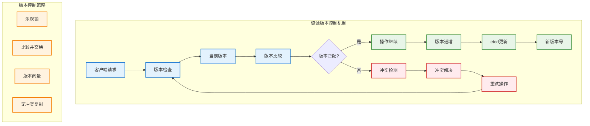

# 资源版本控制

## 概述

Kubernetes 资源版本控制机制通过乐观锁和版本号管理来解决分布式环境中的并发修改冲突问题。每个 Kubernetes 对象都有一个资源版本（ResourceVersion）字段，用于跟踪对象的修改历史，确保在高并发环境下的数据一致性和操作安全性。

## 版本控制架构



## 资源版本机制

### 版本号生成

```go
// 资源版本器接口
type Versioner interface {
    // 更新对象的资源版本
    UpdateObject(obj runtime.Object, resourceVersion uint64) error
    
    // 更新列表的资源版本
    UpdateList(obj runtime.Object, resourceVersion uint64, continueValue string, count *int64) error
    
    // 从对象中提取资源版本
    ObjectResourceVersion(obj runtime.Object) uint64
    
    // 从对象中提取资源版本字符串
    ObjectResourceVersionString(obj runtime.Object) string
    
    // 解析资源版本字符串
    ParseResourceVersion(resourceVersion string) (uint64, error)
}

// API 对象版本器实现
type APIObjectVersioner struct{}

func (a APIObjectVersioner) UpdateObject(obj runtime.Object, resourceVersion uint64) error {
    accessor, err := meta.Accessor(obj)
    if err != nil {
        return err
    }
    
    versionString := strconv.FormatUint(resourceVersion, 10)
    accessor.SetResourceVersion(versionString)
    return nil
}

func (a APIObjectVersioner) ObjectResourceVersion(obj runtime.Object) uint64 {
    accessor, err := meta.Accessor(obj)
    if err != nil {
        return 0
    }
    
    version, err := strconv.ParseUint(accessor.GetResourceVersion(), 10, 64)
    if err != nil {
        return 0
    }
    
    return version
}

func (a APIObjectVersioner) ParseResourceVersion(resourceVersion string) (uint64, error) {
    if resourceVersion == "" {
        return 0, nil
    }
    return strconv.ParseUint(resourceVersion, 10, 64)
}
```

### 版本字段详解

```yaml
# Kubernetes 资源的版本相关字段
apiVersion: apps/v1
kind: Deployment
metadata:
  name: nginx-deployment
  namespace: default
  resourceVersion: "12345"     # etcd 修订版本号
  generation: 2                # 规格变更计数器
  uid: "a1b2c3d4-e5f6-7890"   # 全局唯一标识符
  creationTimestamp: "2023-01-01T10:00:00Z"
spec:
  replicas: 3
status:
  observedGeneration: 1        # 控制器已处理的代次
  replicas: 2
  readyReplicas: 2
```

### 乐观锁实现

```go
// 乐观锁存储实现
type OptimisticLockStorage struct {
    storage     storage.Interface
    versioner   storage.Versioner
    transformer *transformer.PrefixTransformer
}

func (o *OptimisticLockStorage) GuaranteedUpdate(
    ctx context.Context,
    key string,
    obj runtime.Object,
    ignoreNotFound bool,
    preconditions *storage.Preconditions,
    tryUpdate storage.UpdateFunc,
    suggestion ...runtime.Object,
) error {
    
    trace := utiltrace.New("GuaranteedUpdate etcd3", utiltrace.Field{"key", key})
    defer trace.LogIfLong(500 * time.Millisecond)
    
    v, err := conversion.EnforcePtr(obj)
    if err != nil {
        return fmt.Errorf("unable to convert obj to pointer: %v", err)
    }
    
    key = path.Join(o.pathPrefix, key)
    
    for {
        // 获取当前对象
        origState, err := o.storage.Get(ctx, key, storage.GetOptions{
            ResourceVersion: "",
        })
        
        if err != nil {
            if !storage.IsNotFound(err) {
                return err
            }
            if !ignoreNotFound {
                return err
            }
            // 对象不存在，使用建议对象
            if len(suggestion) > 0 {
                origState = suggestion[0].DeepCopyObject()
            } else {
                origState = reflect.New(v.Type().Elem()).Interface().(runtime.Object)
            }
        }
        
        // 检查前置条件
        if preconditions != nil {
            if err := o.checkPreconditions(origState, preconditions); err != nil {
                return err
            }
        }
        
        // 获取当前资源版本
        origResourceVersion := o.versioner.ObjectResourceVersion(origState)
        
        // 执行更新函数
        ret, ttl, err := tryUpdate(origState.DeepCopyObject(), storage.ResponseMeta{})
        if err != nil {
            return err
        }
        
        // 设置资源版本（用于乐观锁）
        o.versioner.UpdateObject(ret, origResourceVersion)
        
        // 序列化对象
        data, err := runtime.Encode(o.codec, ret)
        if err != nil {
            return err
        }
        
        // 执行条件更新
        newResourceVersion, err := o.storage.GuaranteedUpdate(ctx, key, data, origResourceVersion, ttl)
        if err != nil {
            if storage.IsConflict(err) {
                // 版本冲突，重试
                continue
            }
            return err
        }
        
        // 更新对象的资源版本
        o.versioner.UpdateObject(ret, newResourceVersion)
        return o.copyInto(ret, obj)
    }
}
```

## 并发控制实现

### 比较并交换（CAS）操作

```go
// CAS 操作实现
type CASOperation struct {
    client    clientv3.Client
    keyPrefix string
    codec     runtime.Codec
}

func (c *CASOperation) CompareAndSwap(
    ctx context.Context,
    key string,
    obj runtime.Object,
    expectedVersion uint64,
) (uint64, error) {
    
    // 序列化对象
    data, err := runtime.Encode(c.codec, obj)
    if err != nil {
        return 0, err
    }
    
    fullKey := path.Join(c.keyPrefix, key)
    
    // 构建 CAS 事务
    txnResp, err := c.client.Txn(ctx).
        If(clientv3.Compare(clientv3.ModRevision(fullKey), "=", int64(expectedVersion))).
        Then(clientv3.OpPut(fullKey, string(data))).
        Else(clientv3.OpGet(fullKey)).
        Commit()
    
    if err != nil {
        return 0, err
    }
    
    if !txnResp.Succeeded {
        // CAS 失败，返回当前版本
        if len(txnResp.Responses) > 0 {
            getResp := txnResp.Responses[0].GetResponseRange()
            if len(getResp.Kvs) > 0 {
                return uint64(getResp.Kvs[0].ModRevision), storage.NewConflictError("version conflict")
            }
        }
        return 0, storage.NewConflictError("object not found")
    }
    
    // CAS 成功，返回新版本
    return uint64(txnResp.Header.Revision), nil
}

// 条件更新实现
func (c *CASOperation) ConditionalUpdate(
    ctx context.Context,
    key string,
    updateFunc func(current runtime.Object) (runtime.Object, error),
    maxRetries int,
) (runtime.Object, error) {
    
    var lastVersion uint64
    
    for retry := 0; retry < maxRetries; retry++ {
        // 获取当前对象
        current, version, err := c.getCurrent(ctx, key)
        if err != nil {
            return nil, err
        }
        
        lastVersion = version
        
        // 应用更新
        updated, err := updateFunc(current)
        if err != nil {
            return nil, err
        }
        
        // 尝试 CAS 更新
        newVersion, err := c.CompareAndSwap(ctx, key, updated, version)
        if err != nil {
            if storage.IsConflict(err) {
                // 版本冲突，重试
                continue
            }
            return nil, err
        }
        
        // 更新成功
        c.updateResourceVersion(updated, newVersion)
        return updated, nil
    }
    
    return nil, fmt.Errorf("failed to update after %d retries, last seen version: %d", maxRetries, lastVersion)
}
```

### 多版本并发控制（MVCC）

```go
// MVCC 存储实现
type MVCCStorage struct {
    client       clientv3.Client
    pathPrefix   string
    codec        runtime.Codec
    transformer  *transformer.PrefixTransformer
}

func (m *MVCCStorage) Get(
    ctx context.Context,
    key string,
    opts storage.GetOptions,
    out runtime.Object,
) error {
    
    key = path.Join(m.pathPrefix, key)
    
    getOpts := []clientv3.OpOption{}
    
    if opts.ResourceVersion != "" {
        rev, err := strconv.ParseInt(opts.ResourceVersion, 10, 64)
        if err != nil {
            return fmt.Errorf("invalid resource version %q", opts.ResourceVersion)
        }
        getOpts = append(getOpts, clientv3.WithRev(rev))
    }
    
    resp, err := m.client.Get(ctx, key, getOpts...)
    if err != nil {
        return err
    }
    
    if len(resp.Kvs) == 0 {
        return storage.NewKeyNotFoundError(key, 0)
    }
    
    kv := resp.Kvs[0]
    data := kv.Value
    
    // 解密数据（如果启用了加密）
    if m.transformer != nil {
        data, err = m.transformer.TransformFromStorage(data, authenticatedDataString(key))
        if err != nil {
            return storage.NewInternalError(err.Error())
        }
    }
    
    // 反序列化对象
    if err := runtime.DecodeInto(m.codec, data, out); err != nil {
        return err
    }
    
    // 设置资源版本
    return m.setResourceVersion(out, kv.ModRevision)
}

func (m *MVCCStorage) List(
    ctx context.Context,
    key string,
    opts storage.ListOptions,
    listObj runtime.Object,
) error {
    
    key = path.Join(m.pathPrefix, key)
    
    getOpts := []clientv3.OpOption{
        clientv3.WithPrefix(),
        clientv3.WithSort(clientv3.SortByKey, clientv3.SortAscend),
    }
    
    if opts.ResourceVersion != "" {
        rev, err := strconv.ParseInt(opts.ResourceVersion, 10, 64)
        if err != nil {
            return fmt.Errorf("invalid resource version %q", opts.ResourceVersion)
        }
        getOpts = append(getOpts, clientv3.WithRev(rev))
    }
    
    if opts.Predicate.Limit > 0 {
        getOpts = append(getOpts, clientv3.WithLimit(opts.Predicate.Limit))
    }
    
    resp, err := m.client.Get(ctx, key, getOpts...)
    if err != nil {
        return err
    }
    
    return m.decodeList(resp.Kvs, opts.Predicate.Filter, listObj, resp.Header.Revision)
}
```

## Watch 机制中的版本控制

### 版本化 Watch 实现

```go
// 版本化 Watch 实现
type VersionedWatcher struct {
    client      clientv3.Client
    pathPrefix  string
    codec       runtime.Codec
    transformer *transformer.PrefixTransformer
}

func (v *VersionedWatcher) Watch(
    ctx context.Context,
    key string,
    opts storage.ListOptions,
) (watch.Interface, error) {
    
    key = path.Join(v.pathPrefix, key)
    
    watcher := &etcdWatcher{
        client:      v.client,
        codec:       v.codec,
        transformer: v.transformer,
        pathPrefix:  v.pathPrefix,
        key:         key,
        recursive:   opts.Recursive,
        resultChan:  make(chan watch.Event, 100),
        ctx:         ctx,
    }
    
    var startRev int64
    if opts.ResourceVersion != "" {
        rev, err := strconv.ParseInt(opts.ResourceVersion, 10, 64)
        if err != nil {
            return nil, fmt.Errorf("invalid resource version %q", opts.ResourceVersion)
        }
        startRev = rev + 1 // 从下一个版本开始 watch
    }
    
    watcher.startRev = startRev
    go watcher.run()
    
    return watcher, nil
}

type etcdWatcher struct {
    client      clientv3.Client
    codec       runtime.Codec
    transformer *transformer.PrefixTransformer
    pathPrefix  string
    key         string
    recursive   bool
    startRev    int64
    
    ctx        context.Context
    cancel     context.CancelFunc
    resultChan chan watch.Event
}

func (e *etcdWatcher) run() {
    defer close(e.resultChan)
    
    var watchOpts []clientv3.OpOption
    if e.recursive {
        watchOpts = append(watchOpts, clientv3.WithPrefix())
    }
    
    if e.startRev > 0 {
        watchOpts = append(watchOpts, clientv3.WithRev(e.startRev))
    }
    
    // 启用进度通知
    watchOpts = append(watchOpts, clientv3.WithProgressNotify())
    
    watchChan := e.client.Watch(e.ctx, e.key, watchOpts...)
    
    for {
        select {
        case resp := <-watchChan:
            if err := resp.Err(); err != nil {
                e.sendError(err)
                return
            }
            
            for _, event := range resp.Events {
                if err := e.sendEvent(event); err != nil {
                    return
                }
            }
            
            // 处理进度通知（用于 bookmark 事件）
            if resp.IsProgressNotify() {
                e.sendBookmark(resp.Header.Revision)
            }
            
        case <-e.ctx.Done():
            return
        }
    }
}

func (e *etcdWatcher) sendEvent(event *clientv3.Event) error {
    var eventType watch.EventType
    var obj runtime.Object
    
    switch event.Type {
    case clientv3.EventTypePut:
        if event.IsCreate() {
            eventType = watch.Added
        } else {
            eventType = watch.Modified
        }
        
        obj = &unstructured.Unstructured{}
        if err := e.decodeObject(event.Kv.Value, obj, event.Kv.ModRevision); err != nil {
            return err
        }
        
    case clientv3.EventTypeDelete:
        eventType = watch.Deleted
        if event.PrevKv != nil {
            obj = &unstructured.Unstructured{}
            if err := e.decodeObject(event.PrevKv.Value, obj, event.PrevKv.ModRevision); err != nil {
                return err
            }
        }
    }
    
    watchEvent := watch.Event{
        Type:   eventType,
        Object: obj,
    }
    
    select {
    case e.resultChan <- watchEvent:
        return nil
    case <-e.ctx.Done():
        return e.ctx.Err()
    }
}

func (e *etcdWatcher) sendBookmark(revision int64) {
    // 发送 bookmark 事件以通知客户端当前版本
    bookmark := &metav1.Status{
        TypeMeta: metav1.TypeMeta{
            APIVersion: "v1",
            Kind:       "Status",
        },
        Code: 200,
        Metadata: &metav1.ListMeta{
            ResourceVersion: strconv.FormatInt(revision, 10),
        },
    }
    
    watchEvent := watch.Event{
        Type:   watch.Bookmark,
        Object: bookmark,
    }
    
    select {
    case e.resultChan <- watchEvent:
    case <-e.ctx.Done():
    }
}

func (e *etcdWatcher) Stop() {
    if e.cancel != nil {
        e.cancel()
    }
}

func (e *etcdWatcher) ResultChan() <-chan watch.Event {
    return e.resultChan
}
```

## 版本冲突解决

### 智能冲突解决器

```go
// 冲突解决策略
type ConflictResolver struct {
    client         client.Client
    conflictCount  map[string]int
    lastConflict   map[string]time.Time
    mutex          sync.RWMutex
    
    // 配置
    maxRetries     int
    baseBackoff    time.Duration
    maxBackoff     time.Duration
    backoffFactor  float64
}

func NewConflictResolver(client client.Client) *ConflictResolver {
    return &ConflictResolver{
        client:        client,
        conflictCount: make(map[string]int),
        lastConflict:  make(map[string]time.Time),
        maxRetries:    10,
        baseBackoff:   time.Millisecond * 100,
        maxBackoff:    time.Second * 30,
        backoffFactor: 2.0,
    }
}

func (c *ConflictResolver) ResolveUpdate(
    ctx context.Context,
    obj client.Object,
    updateFunc func(client.Object) error,
) error {
    
    key := c.getObjectKey(obj)
    
    return c.retryWithBackoff(ctx, key, func() error {
        // 获取最新版本
        latest := obj.DeepCopyObject().(client.Object)
        err := c.client.Get(ctx, client.ObjectKeyFromObject(obj), latest)
        if err != nil {
            return err
        }
        
        // 应用更新
        if err := updateFunc(latest); err != nil {
            return err
        }
        
        // 尝试更新
        err = c.client.Update(ctx, latest)
        if errors.IsConflict(err) {
            c.recordConflict(key)
            return err
        }
        
        if err == nil {
            c.clearConflictHistory(key)
        }
        
        return err
    })
}

func (c *ConflictResolver) retryWithBackoff(
    ctx context.Context,
    key string,
    operation func() error,
) error {
    
    var lastErr error
    backoff := c.baseBackoff
    
    for attempt := 0; attempt < c.maxRetries; attempt++ {
        lastErr = operation()
        if lastErr == nil {
            return nil
        }
        
        if !errors.IsConflict(lastErr) {
            return lastErr
        }
        
        // 根据冲突历史调整退避时间
        backoff = c.calculateBackoff(key, attempt, backoff)
        
        select {
        case <-ctx.Done():
            return ctx.Err()
        case <-time.After(backoff):
            continue
        }
    }
    
    return fmt.Errorf("max retries exceeded after %d attempts, last error: %v", c.maxRetries, lastErr)
}

func (c *ConflictResolver) calculateBackoff(key string, attempt int, currentBackoff time.Duration) time.Duration {
    c.mutex.RLock()
    conflictCount := c.conflictCount[key]
    lastConflict := c.lastConflict[key]
    c.mutex.RUnlock()
    
    // 基础指数退避
    newBackoff := time.Duration(float64(currentBackoff) * c.backoffFactor)
    
    // 根据历史冲突调整
    if conflictCount > 5 {
        // 频繁冲突，增加额外延迟
        newBackoff = newBackoff * time.Duration(conflictCount/5+1)
    }
    
    // 如果最近有冲突，增加随机抖动
    if time.Since(lastConflict) < time.Minute {
        jitter := time.Duration(rand.Float64() * float64(newBackoff) * 0.1)
        newBackoff += jitter
    }
    
    if newBackoff > c.maxBackoff {
        newBackoff = c.maxBackoff
    }
    
    return newBackoff
}

func (c *ConflictResolver) recordConflict(key string) {
    c.mutex.Lock()
    defer c.mutex.Unlock()
    
    c.conflictCount[key]++
    c.lastConflict[key] = time.Now()
}

func (c *ConflictResolver) clearConflictHistory(key string) {
    c.mutex.Lock()
    defer c.mutex.Unlock()
    
    delete(c.conflictCount, key)
    delete(c.lastConflict, key)
}
```

### 三方合并策略

```go
// 三方合并实现
type ThreeWayMerger struct {
    logger klog.Logger
}

func (t *ThreeWayMerger) Merge(
    original, current, desired runtime.Object,
) (runtime.Object, error) {
    
    if original == nil || current == nil || desired == nil {
        return nil, fmt.Errorf("cannot perform three-way merge with nil objects")
    }
    
    // 转换为 unstructured 对象
    originalMap, err := runtime.DefaultUnstructuredConverter.ToUnstructured(original)
    if err != nil {
        return nil, err
    }
    
    currentMap, err := runtime.DefaultUnstructuredConverter.ToUnstructured(current)
    if err != nil {
        return nil, err
    }
    
    desiredMap, err := runtime.DefaultUnstructuredConverter.ToUnstructured(desired)
    if err != nil {
        return nil, err
    }
    
    // 执行三方合并
    mergedMap, conflicts, err := t.performThreeWayMerge(originalMap, currentMap, desiredMap)
    if err != nil {
        return nil, err
    }
    
    if len(conflicts) > 0 {
        t.logger.Info("Conflicts detected during merge", "conflicts", conflicts)
        // 可以选择不同的冲突解决策略
        mergedMap = t.resolveConflicts(originalMap, currentMap, desiredMap, conflicts)
    }
    
    // 转换回对象
    merged := &unstructured.Unstructured{Object: mergedMap}
    return merged, nil
}

func (t *ThreeWayMerger) performThreeWayMerge(
    original, current, desired map[string]interface{},
) (map[string]interface{}, []string, error) {
    
    result := make(map[string]interface{})
    var conflicts []string
    
    // 收集所有键
    allKeys := make(map[string]struct{})
    for k := range original {
        allKeys[k] = struct{}{}
    }
    for k := range current {
        allKeys[k] = struct{}{}
    }
    for k := range desired {
        allKeys[k] = struct{}{}
    }
    
    for key := range allKeys {
        originalVal, originalExists := original[key]
        currentVal, currentExists := current[key]
        desiredVal, desiredExists := desired[key]
        
        mergedVal, conflict := t.mergeField(key, originalVal, currentVal, desiredVal, originalExists, currentExists, desiredExists)
        
        if conflict {
            conflicts = append(conflicts, key)
        }
        
        if mergedVal != nil {
            result[key] = mergedVal
        }
    }
    
    return result, conflicts, nil
}

func (t *ThreeWayMerger) mergeField(
    key string,
    original, current, desired interface{},
    originalExists, currentExists, desiredExists bool,
) (interface{}, bool) {
    
    // 字段不存在的情况
    if !originalExists && !currentExists && !desiredExists {
        return nil, false
    }
    
    if !originalExists && !currentExists && desiredExists {
        return desired, false // 新增字段
    }
    
    if !originalExists && currentExists && !desiredExists {
        return current, false // 保持当前值
    }
    
    if originalExists && !currentExists && !desiredExists {
        return nil, false // 都删除了
    }
    
    // 字段存在的情况
    if originalExists && currentExists && desiredExists {
        // 检查是否有修改
        originalChanged := !reflect.DeepEqual(original, current)
        desiredChanged := !reflect.DeepEqual(original, desired)
        
        if !originalChanged && !desiredChanged {
            return current, false // 都没改变
        }
        
        if originalChanged && !desiredChanged {
            return current, false // 只有当前改变
        }
        
        if !originalChanged && desiredChanged {
            return desired, false // 只有期望改变
        }
        
        if originalChanged && desiredChanged {
            if reflect.DeepEqual(current, desired) {
                return current, false // 改变相同
            }
            return current, true // 冲突：都改变了但不同
        }
    }
    
    return current, false
}
```

## 性能优化

### 版本缓存优化

```go
// 版本感知缓存
type VersionAwareCache struct {
    cache     map[string]*CacheEntry
    mutex     sync.RWMutex
    ttl       time.Duration
    maxSize   int
    hitCount  int64
    missCount int64
}

type CacheEntry struct {
    Object          runtime.Object
    ResourceVersion string
    Generation      int64
    Timestamp       time.Time
}

func NewVersionAwareCache(ttl time.Duration, maxSize int) *VersionAwareCache {
    return &VersionAwareCache{
        cache:   make(map[string]*CacheEntry),
        ttl:     ttl,
        maxSize: maxSize,
    }
}

func (v *VersionAwareCache) Get(key, resourceVersion string) (runtime.Object, bool) {
    v.mutex.RLock()
    defer v.mutex.RUnlock()
    
    entry, exists := v.cache[key]
    if !exists {
        atomic.AddInt64(&v.missCount, 1)
        return nil, false
    }
    
    // 检查版本是否匹配
    if resourceVersion != "" && entry.ResourceVersion != resourceVersion {
        atomic.AddInt64(&v.missCount, 1)
        return nil, false
    }
    
    // 检查是否过期
    if time.Since(entry.Timestamp) > v.ttl {
        atomic.AddInt64(&v.missCount, 1)
        return nil, false
    }
    
    atomic.AddInt64(&v.hitCount, 1)
    return entry.Object.DeepCopyObject(), true
}

func (v *VersionAwareCache) Set(key string, obj runtime.Object) {
    v.mutex.Lock()
    defer v.mutex.Unlock()
    
    // 检查缓存大小
    if len(v.cache) >= v.maxSize {
        v.evictLRU()
    }
    
    accessor, err := meta.Accessor(obj)
    if err != nil {
        return
    }
    
    entry := &CacheEntry{
        Object:          obj.DeepCopyObject(),
        ResourceVersion: accessor.GetResourceVersion(),
        Generation:      accessor.GetGeneration(),
        Timestamp:       time.Now(),
    }
    
    v.cache[key] = entry
}

func (v *VersionAwareCache) evictLRU() {
    var oldestKey string
    var oldestTime time.Time
    
    for key, entry := range v.cache {
        if oldestKey == "" || entry.Timestamp.Before(oldestTime) {
            oldestKey = key
            oldestTime = entry.Timestamp
        }
    }
    
    if oldestKey != "" {
        delete(v.cache, oldestKey)
    }
}

func (v *VersionAwareCache) GetStats() (hitRate float64, totalRequests int64) {
    hits := atomic.LoadInt64(&v.hitCount)
    misses := atomic.LoadInt64(&v.missCount)
    total := hits + misses
    
    if total == 0 {
        return 0, 0
    }
    
    return float64(hits) / float64(total), total
}
```

### 批量版本操作

```go
// 批量版本操作管理器
type BatchVersionManager struct {
    client    client.Client
    batchSize int
    timeout   time.Duration
}

func NewBatchVersionManager(client client.Client, batchSize int) *BatchVersionManager {
    return &BatchVersionManager{
        client:    client,
        batchSize: batchSize,
        timeout:   30 * time.Second,
    }
}

type BatchOperation struct {
    Object     client.Object
    UpdateFunc func(client.Object) error
    Version    string
}

type BatchResult struct {
    Object client.Object
    Error  error
}

func (b *BatchVersionManager) BatchUpdate(
    ctx context.Context,
    operations []BatchOperation,
) ([]BatchResult, error) {
    
    results := make([]BatchResult, len(operations))
    batches := b.splitIntoBatches(operations)
    
    for _, batch := range batches {
        batchResults := b.processBatch(ctx, batch)
        for i, result := range batchResults {
            results[batch[0].index+i] = result
        }
    }
    
    return results, nil
}

type indexedOperation struct {
    BatchOperation
    index int
}

func (b *BatchVersionManager) splitIntoBatches(operations []BatchOperation) [][]indexedOperation {
    var batches [][]indexedOperation
    
    for i := 0; i < len(operations); i += b.batchSize {
        end := i + b.batchSize
        if end > len(operations) {
            end = len(operations)
        }
        
        batch := make([]indexedOperation, end-i)
        for j := i; j < end; j++ {
            batch[j-i] = indexedOperation{
                BatchOperation: operations[j],
                index:         j,
            }
        }
        
        batches = append(batches, batch)
    }
    
    return batches
}

func (b *BatchVersionManager) processBatch(
    ctx context.Context,
    batch []indexedOperation,
) []BatchResult {
    
    results := make([]BatchResult, len(batch))
    var wg sync.WaitGroup
    
    // 限制并发数
    semaphore := make(chan struct{}, 5)
    
    for i, op := range batch {
        wg.Add(1)
        go func(index int, operation indexedOperation) {
            defer wg.Done()
            
            semaphore <- struct{}{}
            defer func() { <-semaphore }()
            
            results[index] = b.processOperation(ctx, operation.BatchOperation)
        }(i, op)
    }
    
    wg.Wait()
    return results
}

func (b *BatchVersionManager) processOperation(
    ctx context.Context,
    op BatchOperation,
) BatchResult {
    
    err := retry.RetryOnConflict(retry.DefaultRetry, func() error {
        // 获取最新版本
        key := client.ObjectKeyFromObject(op.Object)
        latest := op.Object.DeepCopyObject().(client.Object)
        
        if err := b.client.Get(ctx, key, latest); err != nil {
            return err
        }
        
        // 检查版本（如果指定）
        if op.Version != "" {
            accessor, err := meta.Accessor(latest)
            if err != nil {
                return err
            }
            
            if accessor.GetResourceVersion() != op.Version {
                return fmt.Errorf("version mismatch: expected %s, got %s",
                    op.Version, accessor.GetResourceVersion())
            }
        }
        
        // 应用更新
        if err := op.UpdateFunc(latest); err != nil {
            return err
        }
        
        // 执行更新
        return b.client.Update(ctx, latest)
    })
    
    if err != nil {
        return BatchResult{Error: err}
    }
    
    return BatchResult{Object: op.Object}
}
```

## 监控和调试

### 版本控制指标

```go
// 版本控制监控指标
var (
    versionConflictsTotal = prometheus.NewCounterVec(
        prometheus.CounterOpts{
            Name: "kubernetes_version_conflicts_total",
            Help: "Total number of version conflicts encountered",
        },
        []string{"resource", "namespace", "operation"},
    )
    
    versionUpdateDuration = prometheus.NewHistogramVec(
        prometheus.HistogramOpts{
            Name: "kubernetes_version_update_duration_seconds",
            Help: "Time taken to complete version updates",
            Buckets: prometheus.DefBuckets,
        },
        []string{"resource", "result"},
    )
    
    retryAttemptsTotal = prometheus.NewHistogramVec(
        prometheus.HistogramOpts{
            Name: "kubernetes_retry_attempts_total",
            Help: "Number of retry attempts for operations",
            Buckets: prometheus.LinearBuckets(1, 1, 10),
        },
        []string{"resource", "operation"},
    )
    
    cacheHitRatio = prometheus.NewGaugeVec(
        prometheus.GaugeOpts{
            Name: "kubernetes_version_cache_hit_ratio",
            Help: "Cache hit ratio for version-aware cache",
        },
        []string{"cache_type"},
    )
)

func RecordVersionConflict(resource, namespace, operation string) {
    versionConflictsTotal.WithLabelValues(resource, namespace, operation).Inc()
}

func RecordVersionUpdate(resource, result string, duration time.Duration) {
    versionUpdateDuration.WithLabelValues(resource, result).Observe(duration.Seconds())
}

func RecordRetryAttempts(resource, operation string, attempts int) {
    retryAttemptsTotal.WithLabelValues(resource, operation).Observe(float64(attempts))
}

func UpdateCacheHitRatio(cacheType string, ratio float64) {
    cacheHitRatio.WithLabelValues(cacheType).Set(ratio)
}
```

### 版本调试工具

```go
// 版本调试器
type VersionDebugger struct {
    client client.Client
    logger klog.Logger
}

func NewVersionDebugger(client client.Client) *VersionDebugger {
    return &VersionDebugger{
        client: client,
        logger: klog.WithName("version-debugger"),
    }
}

func (v *VersionDebugger) AnalyzeVersionHistory(
    ctx context.Context,
    obj client.Object,
) (*VersionAnalysis, error) {
    
    key := client.ObjectKeyFromObject(obj)
    
    // 获取当前对象
    current := obj.DeepCopyObject().(client.Object)
    err := v.client.Get(ctx, key, current)
    if err != nil {
        return nil, err
    }
    
    accessor, err := meta.Accessor(current)
    if err != nil {
        return nil, err
    }
    
    analysis := &VersionAnalysis{
        ObjectKey:       key,
        CurrentVersion:  accessor.GetResourceVersion(),
        Generation:      accessor.GetGeneration(),
        CreationTime:    accessor.GetCreationTimestamp().Time,
        LastModified:    time.Now(), // 近似值
    }
    
    // 分析版本变化模式
    analysis.VersionPattern = v.analyzeVersionPattern(accessor.GetResourceVersion())
    
    // 检查 Generation 滞后
    if statusAccessor, ok := current.(interface {
        GetStatus() interface{}
    }); ok {
        if status := statusAccessor.GetStatus(); status != nil {
            if statusObj, ok := status.(map[string]interface{}); ok {
                if observedGen, exists := statusObj["observedGeneration"]; exists {
                    if observedGenInt, ok := observedGen.(int64); ok {
                        analysis.GenerationLag = analysis.Generation - observedGenInt
                    }
                }
            }
        }
    }
    
    return analysis, nil
}

type VersionAnalysis struct {
    ObjectKey       client.ObjectKey
    CurrentVersion  string
    Generation      int64
    GenerationLag   int64
    CreationTime    time.Time
    LastModified    time.Time
    VersionPattern  string
    ConflictHistory []ConflictEvent
}

type ConflictEvent struct {
    Timestamp     time.Time
    Operation     string
    ExpectedVersion string
    ActualVersion   string
    Resolution    string
}

func (v *VersionDebugger) analyzeVersionPattern(version string) string {
    versionNum, err := strconv.ParseInt(version, 10, 64)
    if err != nil {
        return "invalid"
    }
    
    // 分析版本号模式
    if versionNum < 1000 {
        return "low-frequency"
    } else if versionNum < 10000 {
        return "medium-frequency"
    } else {
        return "high-frequency"
    }
}

func (v *VersionDebugger) DiagnoseConflicts(
    ctx context.Context,
    objectKey client.ObjectKey,
    timeWindow time.Duration,
) (*ConflictDiagnosis, error) {
    
    diagnosis := &ConflictDiagnosis{
        ObjectKey:      objectKey,
        TimeWindow:     timeWindow,
        AnalysisTime:   time.Now(),
        ConflictEvents: make([]ConflictEvent, 0),
    }
    
    // 这里可以通过审计日志或监控数据分析冲突
    // 简化实现，仅提供框架
    
    // 分析冲突模式
    diagnosis.ConflictPattern = v.analyzeConflictPattern(diagnosis.ConflictEvents)
    
    // 提供建议
    diagnosis.Recommendations = v.generateRecommendations(diagnosis)
    
    return diagnosis, nil
}

type ConflictDiagnosis struct {
    ObjectKey       client.ObjectKey
    TimeWindow      time.Duration
    AnalysisTime    time.Time
    ConflictEvents  []ConflictEvent
    ConflictPattern string
    Recommendations []string
}

func (v *VersionDebugger) analyzeConflictPattern(events []ConflictEvent) string {
    if len(events) == 0 {
        return "no-conflicts"
    }
    
    if len(events) > 10 {
        return "high-contention"
    } else if len(events) > 3 {
        return "moderate-contention"
    } else {
        return "low-contention"
    }
}

func (v *VersionDebugger) generateRecommendations(diagnosis *ConflictDiagnosis) []string {
    var recommendations []string
    
    switch diagnosis.ConflictPattern {
    case "high-contention":
        recommendations = append(recommendations,
            "Consider implementing application-level coordination",
            "Use optimistic locking with exponential backoff",
            "Review update frequency and batch operations",
        )
    case "moderate-contention":
        recommendations = append(recommendations,
            "Monitor conflict patterns",
            "Consider using resource finalizers for coordination",
        )
    case "low-contention":
        recommendations = append(recommendations,
            "Current conflict level is acceptable",
            "Continue monitoring",
        )
    }
    
    return recommendations
}
```

## 最佳实践

### 版本控制设计原则

1. **乐观锁优先**：
   - 默认使用乐观锁而非悲观锁
   - 设计幂等的更新操作
   - 实现智能重试机制

2. **版本感知编程**：
   - 总是检查和使用资源版本
   - 理解 Generation 和 ResourceVersion 的区别
   - 正确处理版本冲突

3. **性能优化**：
   - 使用版本感知的缓存
   - 批量操作减少冲突
   - 避免不必要的更新

### 冲突处理策略

1. **智能重试**：
   ```go
   // 推荐的重试模式
   err := retry.RetryOnConflict(retry.DefaultRetry, func() error {
       // 获取最新版本
       latest := obj.DeepCopyObject()
       if err := client.Get(ctx, key, latest); err != nil {
           return err
       }
       
       // 应用更新
       updateFunc(latest)
       
       // 尝试更新
       return client.Update(ctx, latest)
   })
   ```

2. **冲突避免**：
   - 使用 Patch 操作而非完整更新
   - 分离规格和状态更新
   - 使用 Server-Side Apply

### 监控和排查

1. **版本监控**：
   ```bash
   # 监控资源版本变化
   kubectl get pods -w -o custom-columns=NAME:.metadata.name,VERSION:.metadata.resourceVersion
   
   # 检查 Generation 滞后
   kubectl get deployment -o custom-columns=NAME:.metadata.name,GEN:.metadata.generation,OBSERVED:.status.observedGeneration
   ```

2. **冲突诊断**：
   - 分析审计日志中的冲突事件
   - 监控重试次数和模式
   - 识别高冲突的资源和操作

3. **性能调优**：
   - 调整重试策略参数
   - 优化更新频率
   - 使用批量操作减少冲突概率
