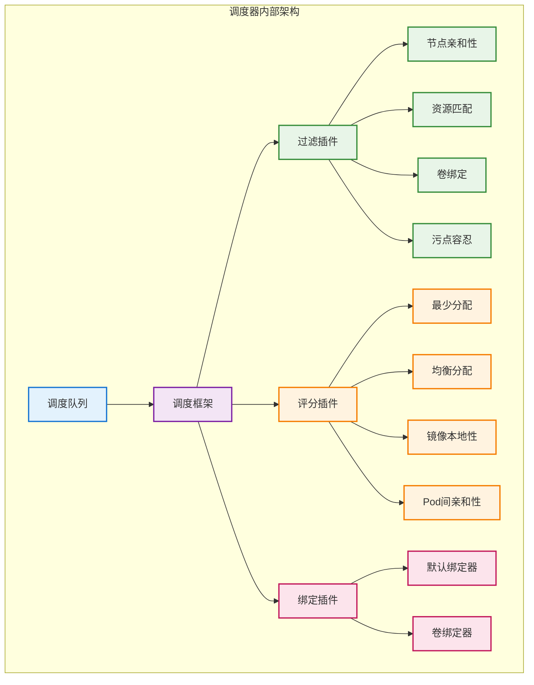
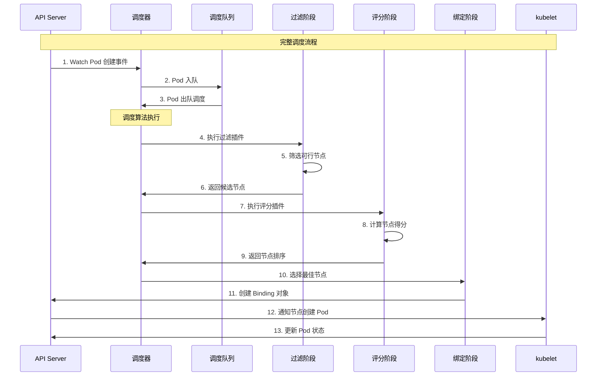

# 调度器算法

## 概述

Kubernetes 调度器（kube-scheduler）是集群的大脑，负责将 Pod 分配到最合适的节点上运行。调度器使用复杂的算法来平衡资源利用率、满足约束条件，并优化整体集群性能。

## 调度器架构



## 调度算法执行流程

### 完整调度流程



### 调度算法实现

```go
// 调度器核心实现
type Scheduler struct {
    schedulerCache    cache.Cache
    profiles          map[string]*profile.Profile
    nodeInfoSnapshot  *cache.Snapshot
    percentageOfNodesToScore int32
}

func (sched *Scheduler) scheduleOne(ctx context.Context) {
    podInfo := sched.NextPod()
    if podInfo == nil || podInfo.Pod == nil {
        return
    }
    
    pod := podInfo.Pod
    fwk, err := sched.frameworkForPod(pod)
    if err != nil {
        sched.recordSchedulingFailure(pod, err)
        return
    }
    
    // 执行调度算法
    scheduleResult, err := sched.Algorithm.Schedule(ctx, fwk, pod)
    if err != nil {
        sched.recordSchedulingFailure(pod, err)
        return
    }
    
    // 执行绑定
    err = sched.bind(ctx, fwk, pod, scheduleResult.SuggestedHost)
    if err != nil {
        sched.recordSchedulingFailure(pod, err)
        return
    }
}

// 调度算法接口
type Algorithm interface {
    Schedule(ctx context.Context, fwk framework.Framework, pod *v1.Pod) (ScheduleResult, error)
}

// 通用调度算法实现
type genericScheduler struct {
    cache                    cache.Cache
    nodeInfoSnapshot         *cache.Snapshot
    percentageOfNodesToScore int32
}

func (g *genericScheduler) Schedule(ctx context.Context, fwk framework.Framework, pod *v1.Pod) (result ScheduleResult, err error) {
    // 1. 获取节点快照
    if err := g.snapshot(); err != nil {
        return result, err
    }
    
    // 2. 执行过滤阶段
    feasibleNodes, diagnosis, err := g.findNodesThatFitPod(ctx, fwk, pod)
    if err != nil {
        return result, err
    }
    
    // 3. 如果只有一个节点，直接返回
    if len(feasibleNodes) == 1 {
        return ScheduleResult{
            SuggestedHost:  feasibleNodes[0].Name,
            EvaluatedNodes: 1,
            FeasibleNodes:  1,
        }, nil
    }
    
    // 4. 执行评分阶段
    priorityList, err := g.prioritizeNodes(ctx, fwk, pod, feasibleNodes)
    if err != nil {
        return result, err
    }
    
    // 5. 选择最高分节点
    host, err := g.selectHost(priorityList)
    return ScheduleResult{
        SuggestedHost:  host,
        EvaluatedNodes: len(feasibleNodes),
        FeasibleNodes:  len(feasibleNodes),
    }, err
}
```

## 过滤阶段（Filter）

### 过滤插件执行

```go
// 过滤阶段实现
func (g *genericScheduler) findNodesThatFitPod(ctx context.Context, fwk framework.Framework, pod *v1.Pod) ([]*v1.Node, framework.Diagnosis, error) {
    allNodes, err := g.nodeInfoSnapshot.NodeInfos().List()
    if err != nil {
        return nil, framework.Diagnosis{}, err
    }
    
    // 并发执行过滤
    feasibleNodes := make([]*v1.Node, 0, len(allNodes))
    filteredNodesStatuses := make(framework.NodeToStatusMap)
    
    checkNode := func(i int) {
        nodeInfo := allNodes[i]
        status := fwk.RunFilterPlugins(ctx, state, pod, nodeInfo)
        if status.IsSuccess() {
            feasibleNodes = append(feasibleNodes, nodeInfo.Node())
        } else {
            filteredNodesStatuses[nodeInfo.Node().Name] = status
        }
    }
    
    // 并发处理节点
    fwk.Parallelizer().Until(ctx, len(allNodes), checkNode)
    
    return feasibleNodes, framework.Diagnosis{
        NodeToStatusMap: filteredNodesStatuses,
    }, nil
}

// 过滤插件接口
type FilterPlugin interface {
    Plugin
    Filter(ctx context.Context, state *CycleState, pod *v1.Pod, nodeInfo *NodeInfo) *Status
}
```

### 核心过滤插件

#### 1. NodeResourcesFit（资源匹配）
```go
// 资源匹配过滤器
type NodeResourcesFit struct {
    scoringStrategy *ScoringStrategy
}

func (f *NodeResourcesFit) Filter(ctx context.Context, cycleState *framework.CycleState, pod *v1.Pod, nodeInfo *framework.NodeInfo) *framework.Status {
    // 计算节点可分配资源
    allocatable := nodeInfo.Allocatable
    if allocatable == nil {
        return framework.NewStatus(framework.Error, "node allocatable is nil")
    }
    
    // 计算 Pod 资源需求
    podRequest := computePodResourceRequest(pod)
    
    // 检查资源是否足够
    if podRequest.MilliCPU > allocatable.MilliCPU ||
       podRequest.Memory > allocatable.Memory ||
       podRequest.EphemeralStorage > allocatable.EphemeralStorage {
        return framework.NewStatus(framework.Unschedulable, "insufficient resources")
    }
    
    // 检查扩展资源
    for resourceName, quantity := range podRequest.ScalarResources {
        if available, ok := allocatable.ScalarResources[resourceName]; !ok || quantity > available {
            return framework.NewStatus(framework.Unschedulable, fmt.Sprintf("insufficient %s", resourceName))
        }
    }
    
    return nil
}

func computePodResourceRequest(pod *v1.Pod) *Resource {
    result := &Resource{}
    for _, container := range pod.Spec.Containers {
        result = result.Add(computeContainerResourceRequest(&container))
    }
    for _, container := range pod.Spec.InitContainers {
        result = result.MaxWith(computeContainerResourceRequest(&container))
    }
    return result
}
```

#### 2. NodeAffinity（节点亲和性）
```go
// 节点亲和性过滤器
type NodeAffinity struct{}

func (pl *NodeAffinity) Filter(ctx context.Context, cycleState *framework.CycleState, pod *v1.Pod, nodeInfo *framework.NodeInfo) *framework.Status {
    node := nodeInfo.Node()
    if node == nil {
        return framework.NewStatus(framework.Error, "node not found")
    }
    
    // 检查 nodeSelector
    if !nodeMatchesNodeSelectorTerms(node, pod.Spec.NodeSelector) {
        return framework.NewStatus(framework.Unschedulable, "node doesn't match nodeSelector")
    }
    
    // 检查 NodeAffinity
    if pod.Spec.Affinity != nil && pod.Spec.Affinity.NodeAffinity != nil {
        nodeAffinity := pod.Spec.Affinity.NodeAffinity
        
        // 检查 RequiredDuringSchedulingIgnoredDuringExecution
        if nodeAffinity.RequiredDuringSchedulingIgnoredDuringExecution != nil {
            if !nodeMatchesNodeSelectorTerms(node, nodeAffinity.RequiredDuringSchedulingIgnoredDuringExecution.NodeSelectorTerms) {
                return framework.NewStatus(framework.Unschedulable, "node doesn't match NodeAffinity")
            }
        }
    }
    
    return nil
}

func nodeMatchesNodeSelectorTerms(node *v1.Node, nodeSelectorTerms []v1.NodeSelectorTerm) bool {
    for _, term := range nodeSelectorTerms {
        if nodeMatchesNodeSelectorTerm(node, term) {
            return true
        }
    }
    return len(nodeSelectorTerms) == 0
}
```

#### 3. TaintToleration（污点容忍）
```go
// 污点容忍过滤器
type TaintToleration struct{}

func (pl *TaintToleration) Filter(ctx context.Context, cycleState *framework.CycleState, pod *v1.Pod, nodeInfo *framework.NodeInfo) *framework.Status {
    node := nodeInfo.Node()
    if node == nil {
        return framework.NewStatus(framework.Error, "node not found")
    }
    
    filterPredicate := func(t *v1.Taint) bool {
        return t.Effect == v1.TaintEffectNoSchedule || t.Effect == v1.TaintEffectNoExecute
    }
    
    taint, isUntolerated := v1helper.FindMatchingUntoleratedTaint(node.Spec.Taints, pod.Spec.Tolerations, filterPredicate)
    if !isUntolerated {
        return nil
    }
    
    errReason := fmt.Sprintf("node has taint {%s: %s}, that the pod doesn't tolerate", taint.Key, taint.Value)
    return framework.NewStatus(framework.Unschedulable, errReason)
}
```

## 评分阶段（Score）

### 评分插件执行

```go
// 评分阶段实现
func (g *genericScheduler) prioritizeNodes(ctx context.Context, fwk framework.Framework, pod *v1.Pod, nodes []*v1.Node) (framework.NodeScoreList, error) {
    // 限制评分节点数量以提高性能
    numNodesToScore := g.numFeasibleNodesToScore(int32(len(nodes)))
    
    if numNodesToScore < len(nodes) {
        nodes = nodes[:numNodesToScore]
    }
    
    // 执行评分插件
    scoresMap, err := fwk.RunScorePlugins(ctx, state, pod, nodes)
    if err != nil {
        return nil, err
    }
    
    // 合并所有插件的分数
    result := make(framework.NodeScoreList, 0, len(nodes))
    for i := range nodes {
        totalScore := int64(0)
        for j := range scoresMap {
            totalScore += scoresMap[j][i].Score
        }
        result = append(result, framework.NodeScore{
            Name:  nodes[i].Name,
            Score: totalScore,
        })
    }
    
    return result, nil
}
```

### 核心评分插件

#### 1. NodeResourcesFit（资源利用率评分）
```go
// 资源利用率评分
type NodeResourcesFit struct {
    scoringStrategy *ScoringStrategy
}

func (f *NodeResourcesFit) Score(ctx context.Context, state *framework.CycleState, pod *v1.Pod, nodeName string) (int64, *framework.Status) {
    nodeInfo, err := f.handle.SnapshotSharedLister().NodeInfos().Get(nodeName)
    if err != nil {
        return 0, framework.NewStatus(framework.Error, fmt.Sprintf("getting node %q from Snapshot: %v", nodeName, err))
    }
    
    return f.score(pod, nodeInfo)
}

func (f *NodeResourcesFit) score(pod *v1.Pod, nodeInfo *framework.NodeInfo) (int64, *framework.Status) {
    node := nodeInfo.Node()
    if node == nil {
        return 0, framework.NewStatus(framework.Error, "node not found")
    }
    
    // 计算资源使用情况
    allocatable := nodeInfo.Allocatable
    requested := nodeInfo.Requested
    podRequest := computePodResourceRequest(pod)
    
    // 根据评分策略计算分数
    switch f.scoringStrategy.Type {
    case LeastAllocated:
        return f.leastAllocatedScore(allocatable, requested, podRequest)
    case MostAllocated:
        return f.mostAllocatedScore(allocatable, requested, podRequest)
    case RequestedToCapacityRatio:
        return f.requestedToCapacityRatioScore(allocatable, requested, podRequest)
    default:
        return 0, framework.NewStatus(framework.Error, "unknown scoring strategy")
    }
}

func (f *NodeResourcesFit) leastAllocatedScore(allocatable, requested, podRequest *Resource) (int64, *framework.Status) {
    // 计算 CPU 利用率
    cpuScore := int64(0)
    if allocatable.MilliCPU > 0 {
        cpuUtilization := float64(requested.MilliCPU+podRequest.MilliCPU) / float64(allocatable.MilliCPU)
        cpuScore = int64((1.0 - cpuUtilization) * 100)
    }
    
    // 计算内存利用率
    memoryScore := int64(0)
    if allocatable.Memory > 0 {
        memoryUtilization := float64(requested.Memory+podRequest.Memory) / float64(allocatable.Memory)
        memoryScore = int64((1.0 - memoryUtilization) * 100)
    }
    
    // 返回平均分数
    return (cpuScore + memoryScore) / 2, nil
}
```

#### 2. InterPodAffinity（Pod间亲和性评分）
```go
// Pod间亲和性评分
type InterPodAffinity struct {
    handle framework.Handle
}

func (pl *InterPodAffinity) Score(ctx context.Context, state *framework.CycleState, pod *v1.Pod, nodeName string) (int64, *framework.Status) {
    nodeInfo, err := pl.handle.SnapshotSharedLister().NodeInfos().Get(nodeName)
    if err != nil {
        return 0, framework.NewStatus(framework.Error, fmt.Sprintf("getting node %q from Snapshot: %v", nodeName, err))
    }
    
    node := nodeInfo.Node()
    if node == nil {
        return 0, framework.NewStatus(framework.Error, "node not found")
    }
    
    // 计算亲和性分数
    affinityScore := int64(0)
    antiAffinityScore := int64(0)
    
    if pod.Spec.Affinity != nil && pod.Spec.Affinity.PodAffinity != nil {
        affinityScore = pl.calculateAffinityScore(pod, node, nodeInfo.Pods)
    }
    
    if pod.Spec.Affinity != nil && pod.Spec.Affinity.PodAntiAffinity != nil {
        antiAffinityScore = pl.calculateAntiAffinityScore(pod, node, nodeInfo.Pods)
    }
    
    return affinityScore - antiAffinityScore, nil
}

func (pl *InterPodAffinity) calculateAffinityScore(pod *v1.Pod, node *v1.Node, existingPods []*framework.PodInfo) int64 {
    var score int64
    
    for _, term := range pod.Spec.Affinity.PodAffinity.PreferredDuringSchedulingIgnoredDuringExecution {
        matches := 0
        for _, existingPod := range existingPods {
            if pl.podMatchesAffinityTerm(existingPod.Pod, &term.PodAffinityTerm, node) {
                matches++
            }
        }
        score += int64(term.Weight * int32(matches))
    }
    
    return score
}
```

#### 3. ImageLocality（镜像本地性评分）
```go
// 镜像本地性评分
type ImageLocality struct{}

func (pl *ImageLocality) Score(ctx context.Context, state *framework.CycleState, pod *v1.Pod, nodeName string) (int64, *framework.Status) {
    nodeInfo, err := pl.handle.SnapshotSharedLister().NodeInfos().Get(nodeName)
    if err != nil {
        return 0, framework.NewStatus(framework.Error, fmt.Sprintf("getting node %q from Snapshot: %v", nodeName, err))
    }
    
    node := nodeInfo.Node()
    if node == nil {
        return 0, framework.NewStatus(framework.Error, "node not found")
    }
    
    // 计算镜像本地性分数
    totalScore := int64(0)
    for _, container := range pod.Spec.Containers {
        if imageSize, exists := getImageSize(node, container.Image); exists {
            // 根据镜像大小计算分数（越大的本地镜像分数越高）
            totalScore += int64(imageSize / (1024 * 1024)) // MB
        }
    }
    
    // 限制最大分数
    if totalScore > 100 {
        totalScore = 100
    }
    
    return totalScore, nil
}

func getImageSize(node *v1.Node, image string) (int64, bool) {
    if node.Status.Images == nil {
        return 0, false
    }
    
    for _, nodeImage := range node.Status.Images {
        for _, name := range nodeImage.Names {
            if name == image {
                return nodeImage.SizeBytes, true
            }
        }
    }
    return 0, false
}
```

## 高级调度特性

### 抢占调度

```go
// 抢占调度实现
type Preemption struct {
    handle framework.Handle
}

func (pl *Preemption) PostFilter(ctx context.Context, state *framework.CycleState, pod *v1.Pod, filteredNodeStatusMap framework.NodeToStatusMap) (*framework.PostFilterResult, *framework.Status) {
    // 检查 Pod 优先级
    if pod.Spec.Priority == nil || *pod.Spec.Priority <= 0 {
        return nil, framework.NewStatus(framework.Unschedulable, "pod priority is too low for preemption")
    }
    
    // 查找可抢占的节点
    candidates, err := pl.findCandidates(ctx, pod, filteredNodeStatusMap)
    if err != nil {
        return nil, framework.NewStatus(framework.Error, err.Error())
    }
    
    if len(candidates) == 0 {
        return nil, framework.NewStatus(framework.Unschedulable, "no preemption candidates found")
    }
    
    // 选择最佳抢占候选
    bestCandidate := pl.selectBestCandidate(candidates)
    
    // 执行抢占
    err = pl.preemptPods(ctx, bestCandidate)
    if err != nil {
        return nil, framework.NewStatus(framework.Error, err.Error())
    }
    
    return &framework.PostFilterResult{
        NominatedNodeName: bestCandidate.Node().Name,
    }, nil
}

type Candidate struct {
    node        *v1.Node
    victims     []*v1.Pod
    numVictims  int
}

func (pl *Preemption) findCandidates(ctx context.Context, pod *v1.Pod, filteredNodeStatusMap framework.NodeToStatusMap) ([]Candidate, error) {
    allNodes, err := pl.handle.SnapshotSharedLister().NodeInfos().List()
    if err != nil {
        return nil, err
    }
    
    var candidates []Candidate
    
    for _, nodeInfo := range allNodes {
        // 检查是否可以通过抢占满足调度条件
        victims := pl.findVictims(pod, nodeInfo)
        if len(victims) > 0 {
            candidates = append(candidates, Candidate{
                node:       nodeInfo.Node(),
                victims:    victims,
                numVictims: len(victims),
            })
        }
    }
    
    return candidates, nil
}

func (pl *Preemption) findVictims(pod *v1.Pod, nodeInfo *framework.NodeInfo) []*v1.Pod {
    var victims []*v1.Pod
    podPriority := *pod.Spec.Priority
    
    // 查找优先级较低的 Pod
    for _, podInfo := range nodeInfo.Pods {
        if podInfo.Pod.Spec.Priority != nil && *podInfo.Pod.Spec.Priority < podPriority {
            victims = append(victims, podInfo.Pod)
        }
    }
    
    // 按优先级排序，优先抢占优先级最低的 Pod
    sort.Slice(victims, func(i, j int) bool {
        return *victims[i].Spec.Priority < *victims[j].Spec.Priority
    })
    
    return victims
}
```

### 多调度器支持

```go
// 多调度器配置
type SchedulerConfig struct {
    SchedulerName string
    Profiles      []KubeSchedulerProfile
}

type KubeSchedulerProfile struct {
    SchedulerName string
    Plugins       *Plugins
    PluginConfig  []PluginConfig
}

// 调度器选择
func (sched *Scheduler) frameworkForPod(pod *v1.Pod) (framework.Framework, error) {
    schedulerName := pod.Spec.SchedulerName
    if schedulerName == "" {
        schedulerName = DefaultSchedulerName
    }
    
    profile, exists := sched.profiles[schedulerName]
    if !exists {
        return nil, fmt.Errorf("profile not found for scheduler %s", schedulerName)
    }
    
    return profile.Framework, nil
}
```

## 性能优化

### 调度性能调优

```go
// 性能优化配置
type SchedulingConfig struct {
    // 限制评分的节点百分比
    PercentageOfNodesToScore int32
    // 并发工作器数量
    SchedulingConcurrency int
    // 调度队列配置
    QueueConfig QueueConfig
}

type QueueConfig struct {
    // 队列排序插件
    QueueSortPlugin string
    // 批处理大小
    BatchSize int
    // 初始退避时间
    InitialBackoffDuration time.Duration
    // 最大退避时间
    MaxBackoffDuration time.Duration
}

// 并发调度控制
func (sched *Scheduler) Run(ctx context.Context) {
    // 启动多个调度工作器
    for i := 0; i < sched.schedulingConcurrency; i++ {
        go wait.UntilWithContext(ctx, sched.scheduleOne, 0)
    }
    
    <-ctx.Done()
}

// 节点评分优化
func (g *genericScheduler) numFeasibleNodesToScore(numAllNodes int32) int32 {
    if numAllNodes < 50 {
        return numAllNodes
    }
    
    // 计算需要评分的节点百分比
    percentage := g.percentageOfNodesToScore
    if percentage == 0 {
        // 默认策略：节点数越多，评分比例越小
        if numAllNodes <= 100 {
            percentage = 50
        } else if numAllNodes <= 300 {
            percentage = 20
        } else {
            percentage = 5
        }
    }
    
    numNodes := numAllNodes * percentage / 100
    if numNodes < 50 {
        numNodes = 50
    }
    
    return numNodes
}
```

### 缓存优化

```go
// 调度器缓存
type Cache interface {
    AssumePod(pod *v1.Pod) error
    FinishBinding(pod *v1.Pod) error
    ForgetPod(pod *v1.Pod) error
    AddPod(pod *v1.Pod) error
    UpdatePod(oldPod, newPod *v1.Pod) error
    RemovePod(pod *v1.Pod) error
    AddNode(node *v1.Node) error
    UpdateNode(oldNode, newNode *v1.Node) error
    RemoveNode(node *v1.Node) error
    Snapshot() Snapshot
}

// 缓存实现
type schedulerCache struct {
    stop   <-chan struct{}
    ttl    time.Duration
    period time.Duration
    
    // 假设的 Pod（已调度但可能未真正绑定）
    assumedPods map[string]bool
    // 节点信息缓存
    nodes map[string]*NodeInfo
    // 镜像状态缓存
    imageStates map[string]*ImageStateSummary
    
    mu sync.RWMutex
}

func (cache *schedulerCache) AssumePod(pod *v1.Pod) error {
    cache.mu.Lock()
    defer cache.mu.Unlock()
    
    key, err := framework.GetPodKey(pod)
    if err != nil {
        return err
    }
    
    // 标记为假设状态
    cache.assumedPods[key] = true
    
    // 更新节点信息
    if pod.Spec.NodeName != "" {
        cache.addPodToNode(pod, pod.Spec.NodeName)
    }
    
    return nil
}
```

## 监控和调试

### 调度器指标

```go
// 调度器监控指标
var (
    schedulingDuration = prometheus.NewHistogramVec(
        prometheus.HistogramOpts{
            Name: "scheduler_scheduling_duration_seconds",
            Help: "Scheduling duration in seconds",
            Buckets: []float64{0.001, 0.01, 0.1, 1.0, 10.0},
        },
        []string{"profile", "result"},
    )
    
    pendingPods = prometheus.NewGaugeVec(
        prometheus.GaugeOpts{
            Name: "scheduler_pending_pods",
            Help: "Number of pending pods",
        },
        []string{"queue"},
    )
    
    filterPluginDuration = prometheus.NewHistogramVec(
        prometheus.HistogramOpts{
            Name: "scheduler_filter_plugin_duration_seconds",
            Help: "Filter plugin execution duration",
        },
        []string{"plugin", "status"},
    )
)

func recordSchedulingLatency(profile, result string, duration time.Duration) {
    schedulingDuration.WithLabelValues(profile, result).Observe(duration.Seconds())
}
```

### 调度事件记录

```go
// 调度事件记录
func (sched *Scheduler) recordSchedulingFailure(pod *v1.Pod, err error) {
    sched.recorder.Eventf(pod, v1.EventTypeWarning, "FailedScheduling", err.Error())
    
    // 记录详细的调度失败信息
    klog.V(2).InfoS("Failed to schedule pod", 
        "pod", klog.KObj(pod),
        "error", err,
        "schedulerName", pod.Spec.SchedulerName)
}

func (sched *Scheduler) recordSchedulingSuccess(pod *v1.Pod, nodeName string) {
    sched.recorder.Eventf(pod, v1.EventTypeNormal, "Scheduled", "Successfully assigned %s/%s to %s", pod.Namespace, pod.Name, nodeName)
    
    klog.V(2).InfoS("Successfully scheduled pod",
        "pod", klog.KObj(pod),
        "node", nodeName,
        "schedulerName", pod.Spec.SchedulerName)
}
```

## 最佳实践

### 调度配置优化
1. **合理设置资源请求**：为容器设置合适的 CPU 和内存请求
2. **使用亲和性规则**：利用节点和 Pod 亲和性优化调度
3. **配置污点和容忍**：隔离特殊节点和工作负载
4. **设置优先级类**：为重要 Pod 设置高优先级

### 性能调优建议
1. **限制评分节点数**：在大集群中限制参与评分的节点数量
2. **启用并发调度**：增加调度器并发数提高吞吐量
3. **优化插件选择**：只启用必要的调度插件
4. **使用节点选择器**：通过 nodeSelector 预先过滤节点

### 故障排查
1. **检查调度事件**：使用 `kubectl describe pod` 查看调度失败原因
2. **分析调度器日志**：检查调度器组件的详细日志
3. **监控调度延迟**：监控调度器性能指标
4. **验证资源可用性**：确认集群有足够的可用资源
