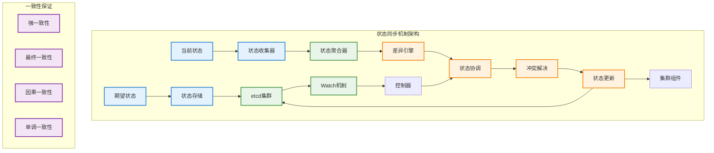

# 状态同步机制

## 概述

Kubernetes 状态同步机制负责确保集群中所有组件之间的数据一致性，通过分布式协调、冲突解决和最终一致性保证等技术，实现在大规模分布式环境中的状态收敛。这个机制是 Kubernetes 实现声明式 API 和自愈能力的基础。

## 状态同步架构



## 分布式一致性模型

### etcd 强一致性

```go
// etcd 客户端配置
type EtcdConfig struct {
    Endpoints   []string
    DialTimeout time.Duration
    Username    string
    Password    string
    TLS         *tls.Config
}

// etcd 强一致性存储
type EtcdConsistentStorage struct {
    client   *clientv3.Client
    codec    runtime.Codec
    logger   klog.Logger
    versioner storage.Versioner
}

func NewEtcdConsistentStorage(config EtcdConfig, codec runtime.Codec) (*EtcdConsistentStorage, error) {
    client, err := clientv3.New(clientv3.Config{
        Endpoints:   config.Endpoints,
        DialTimeout: config.DialTimeout,
        Username:    config.Username,
        Password:    config.Password,
        TLS:         config.TLS,
    })
    
    if err != nil {
        return nil, err
    }
    
    return &EtcdConsistentStorage{
        client:    client,
        codec:     codec,
        logger:    klog.WithName("etcd-storage"),
        versioner: APIObjectVersioner{},
    }, nil
}

// 强一致性读取
func (ecs *EtcdConsistentStorage) Get(
    ctx context.Context,
    key string,
    opts storage.GetOptions,
    objPtr runtime.Object,
) error {
    
    startTime := time.Now()
    defer func() {
        ecs.logger.V(4).Info("Get operation completed",
            "key", key,
            "duration", time.Since(startTime))
    }()
    
    // 使用线性化读取确保强一致性
    getOpts := []clientv3.OpOption{
        clientv3.WithSerializable(), // 可以配置为线性化读取
    }
    
    if opts.ResourceVersion != "" {
        revision, err := ecs.parseResourceVersion(opts.ResourceVersion)
        if err != nil {
            return err
        }
        getOpts = append(getOpts, clientv3.WithRev(revision))
    }
    
    resp, err := ecs.client.Get(ctx, key, getOpts...)
    if err != nil {
        return storage.NewInternalError(err.Error())
    }
    
    if len(resp.Kvs) == 0 {
        return storage.NewKeyNotFoundError(key, 0)
    }
    
    kv := resp.Kvs[0]
    return ecs.decode(kv.Value, objPtr, kv.ModRevision)
}

// 条件更新（使用乐观锁）
func (ecs *EtcdConsistentStorage) GuaranteedUpdate(
    ctx context.Context,
    key string,
    objPtr runtime.Object,
    ignoreNotFound bool,
    preconditions *storage.Preconditions,
    tryUpdate storage.UpdateFunc,
    suggestion ...runtime.Object,
) error {
    
    for retries := 0; retries < 10; retries++ {
        // 获取当前对象
        current := objPtr.DeepCopyObject()
        err := ecs.Get(ctx, key, storage.GetOptions{}, current)
        
        if err != nil {
            if !storage.IsNotFound(err) || !ignoreNotFound {
                return err
            }
            // 对象不存在，使用建议对象
            if len(suggestion) > 0 {
                current = suggestion[0]
            }
        }
        
        // 检查前置条件
        if preconditions != nil {
            if err := ecs.checkPreconditions(current, preconditions); err != nil {
                return err
            }
        }
        
        // 执行更新函数
        updated, ttl, err := tryUpdate(current, storage.ResponseMeta{})
        if err != nil {
            return err
        }
        
        // 序列化更新后的对象
        data, err := ecs.encode(updated)
        if err != nil {
            return err
        }
        
        // 获取当前版本号用于 CAS 操作
        currentVersion := ecs.versioner.ObjectResourceVersion(current)
        
        // 执行条件更新
        var txnResp *clientv3.TxnResponse
        if currentVersion == 0 {
            // 创建操作
            txnResp, err = ecs.client.Txn(ctx).
                If(clientv3.Compare(clientv3.CreateRevision(key), "=", 0)).
                Then(clientv3.OpPut(key, string(data))).
                Commit()
        } else {
            // 更新操作
            txnResp, err = ecs.client.Txn(ctx).
                If(clientv3.Compare(clientv3.ModRevision(key), "=", currentVersion)).
                Then(clientv3.OpPut(key, string(data))).
                Commit()
        }
        
        if err != nil {
            return storage.NewInternalError(err.Error())
        }
        
        if txnResp.Succeeded {
            // 更新成功
            ecs.versioner.UpdateObject(updated, uint64(txnResp.Header.Revision))
            return ecs.decode(data, objPtr, txnResp.Header.Revision)
        }
        
        // 冲突，重试
        ecs.logger.V(4).Info("Update conflict, retrying",
            "key", key,
            "retry", retries)
    }
    
    return storage.NewTooManyOperationsError("too many retries")
}
```

### Watch 机制实现

```go
// Watch 事件类型
type WatchEventType string

const (
    Added    WatchEventType = "ADDED"
    Modified WatchEventType = "MODIFIED"
    Deleted  WatchEventType = "DELETED"
    Bookmark WatchEventType = "BOOKMARK"
    Error    WatchEventType = "ERROR"
)

// Watch 事件
type WatchEvent struct {
    Type   WatchEventType
    Object runtime.Object
    
    // 可选字段
    PrevObject runtime.Object
}

// Watch 接口
type Watcher interface {
    Stop()
    ResultChan() <-chan WatchEvent
}

// etcd Watch 实现
type EtcdWatcher struct {
    client     *clientv3.Client
    codec      runtime.Codec
    versioner  storage.Versioner
    
    key        string
    recursive  bool
    startRev   int64
    
    ctx        context.Context
    cancel     context.CancelFunc
    resultChan chan WatchEvent
    
    logger     klog.Logger
}

func (ecs *EtcdConsistentStorage) Watch(
    ctx context.Context,
    key string,
    opts storage.ListOptions,
) (Watcher, error) {
    
    watchCtx, cancel := context.WithCancel(ctx)
    
    watcher := &EtcdWatcher{
        client:     ecs.client,
        codec:      ecs.codec,
        versioner:  ecs.versioner,
        key:        key,
        recursive:  opts.Recursive,
        ctx:        watchCtx,
        cancel:     cancel,
        resultChan: make(chan WatchEvent, 100),
        logger:     ecs.logger.WithName("watcher"),
    }
    
    // 解析起始版本
    if opts.ResourceVersion != "" {
        rev, err := ecs.parseResourceVersion(opts.ResourceVersion)
        if err != nil {
            cancel()
            return nil, err
        }
        watcher.startRev = rev + 1 // 从下一个版本开始监听
    }
    
    go watcher.run()
    
    return watcher, nil
}

func (ew *EtcdWatcher) run() {
    defer close(ew.resultChan)
    
    var watchOpts []clientv3.OpOption
    if ew.recursive {
        watchOpts = append(watchOpts, clientv3.WithPrefix())
    }
    if ew.startRev > 0 {
        watchOpts = append(watchOpts, clientv3.WithRev(ew.startRev))
    }
    
    // 添加进度通知
    watchOpts = append(watchOpts, clientv3.WithProgressNotify())
    
    watchChan := ew.client.Watch(ew.ctx, ew.key, watchOpts...)
    
    for {
        select {
        case watchResp := <-watchChan:
            if err := watchResp.Err(); err != nil {
                ew.logger.Error(err, "Watch error")
                ew.resultChan <- WatchEvent{
                    Type:   Error,
                    Object: &metav1.Status{
                        Code:    500,
                        Message: err.Error(),
                    },
                }
                return
            }
            
            for _, event := range watchResp.Events {
                if err := ew.processEvent(event); err != nil {
                    ew.logger.Error(err, "Failed to process watch event")
                }
            }
            
            // 处理进度通知
            if watchResp.IsProgressNotify() {
                ew.sendBookmark(watchResp.Header.Revision)
            }
            
        case <-ew.ctx.Done():
            return
        }
    }
}

func (ew *EtcdWatcher) processEvent(event *clientv3.Event) error {
    var eventType WatchEventType
    var obj runtime.Object
    var prevObj runtime.Object
    
    switch event.Type {
    case clientv3.EventTypePut:
        if event.IsCreate() {
            eventType = Added
        } else {
            eventType = Modified
            if event.PrevKv != nil {
                prevObj = &unstructured.Unstructured{}
                if err := ew.decode(event.PrevKv.Value, prevObj, event.PrevKv.ModRevision); err != nil {
                    return err
                }
            }
        }
        
        obj = &unstructured.Unstructured{}
        if err := ew.decode(event.Kv.Value, obj, event.Kv.ModRevision); err != nil {
            return err
        }
        
    case clientv3.EventTypeDelete:
        eventType = Deleted
        if event.PrevKv != nil {
            obj = &unstructured.Unstructured{}
            if err := ew.decode(event.PrevKv.Value, obj, event.PrevKv.ModRevision); err != nil {
                return err
            }
        }
    }
    
    watchEvent := WatchEvent{
        Type:       eventType,
        Object:     obj,
        PrevObject: prevObj,
    }
    
    select {
    case ew.resultChan <- watchEvent:
    case <-ew.ctx.Done():
        return ew.ctx.Err()
    }
    
    return nil
}

func (ew *EtcdWatcher) sendBookmark(revision int64) {
    bookmark := &metav1.Status{
        Code: 200,
        Metadata: &metav1.ListMeta{
            ResourceVersion: strconv.FormatInt(revision, 10),
        },
    }
    
    watchEvent := WatchEvent{
        Type:   Bookmark,
        Object: bookmark,
    }
    
    select {
    case ew.resultChan <- watchEvent:
    case <-ew.ctx.Done():
    }
}

func (ew *EtcdWatcher) Stop() {
    ew.cancel()
}

func (ew *EtcdWatcher) ResultChan() <-chan WatchEvent {
    return ew.resultChan
}
```

## 状态协调引擎

### 协调循环核心

```go
// 状态协调引擎
type StateReconciliationEngine struct {
    client        client.Client
    eventRecorder record.EventRecorder
    
    // 协调器注册表
    reconcilers   map[schema.GroupVersionKind]Reconciler
    
    // 工作队列
    workqueue     workqueue.RateLimitingInterface
    
    // 状态缓存
    stateCache    *StateCache
    
    // 配置
    workers       int
    resyncPeriod  time.Duration
    
    logger        klog.Logger
}

// 状态协调器接口
type Reconciler interface {
    Reconcile(ctx context.Context, req ReconcileRequest) (ReconcileResult, error)
    GetState(ctx context.Context, key client.ObjectKey) (StateSnapshot, error)
}

// 协调请求
type ReconcileRequest struct {
    NamespacedName types.NamespacedName
    GVK           schema.GroupVersionKind
    Operation     OperationType
}

// 操作类型
type OperationType string

const (
    CreateOp OperationType = "CREATE"
    UpdateOp OperationType = "UPDATE"
    DeleteOp OperationType = "DELETE"
    SyncOp   OperationType = "SYNC"
)

// 协调结果
type ReconcileResult struct {
    RequeueAfter time.Duration
    Requeue      bool
    Error        error
}

// 状态快照
type StateSnapshot struct {
    DesiredState runtime.Object
    CurrentState runtime.Object
    LastSynced   time.Time
    Generation   int64
}

func NewStateReconciliationEngine(
    client client.Client,
    eventRecorder record.EventRecorder,
    workers int,
) *StateReconciliationEngine {
    
    return &StateReconciliationEngine{
        client:        client,
        eventRecorder: eventRecorder,
        reconcilers:   make(map[schema.GroupVersionKind]Reconciler),
        workqueue:     workqueue.NewNamedRateLimitingQueue(workqueue.DefaultControllerRateLimiter(), "state-reconciler"),
        stateCache:    NewStateCache(),
        workers:       workers,
        resyncPeriod:  10 * time.Minute,
        logger:        klog.WithName("state-reconciliation-engine"),
    }
}

// 注册协调器
func (sre *StateReconciliationEngine) RegisterReconciler(
    gvk schema.GroupVersionKind,
    reconciler Reconciler,
) {
    sre.reconcilers[gvk] = reconciler
    sre.logger.Info("Registered reconciler", "gvk", gvk)
}

// 启动协调引擎
func (sre *StateReconciliationEngine) Start(ctx context.Context) error {
    sre.logger.Info("Starting state reconciliation engine", "workers", sre.workers)
    
    // 启动工作协程
    for i := 0; i < sre.workers; i++ {
        go wait.UntilWithContext(ctx, sre.runWorker, time.Second)
    }
    
    // 启动定期同步
    go wait.UntilWithContext(ctx, sre.runPeriodicSync, sre.resyncPeriod)
    
    <-ctx.Done()
    sre.workqueue.ShutDown()
    sre.logger.Info("Shutting down state reconciliation engine")
    
    return nil
}

// 工作协程
func (sre *StateReconciliationEngine) runWorker(ctx context.Context) {
    for sre.processNextWorkItem(ctx) {
    }
}

func (sre *StateReconciliationEngine) processNextWorkItem(ctx context.Context) bool {
    obj, shutdown := sre.workqueue.Get()
    if shutdown {
        return false
    }
    defer sre.workqueue.Done(obj)
    
    req := obj.(ReconcileRequest)
    result, err := sre.reconcile(ctx, req)
    
    if err != nil {
        sre.logger.Error(err, "Reconciliation failed", "request", req)
        sre.workqueue.AddRateLimited(obj)
        return true
    }
    
    sre.workqueue.Forget(obj)
    
    if result.Requeue {
        if result.RequeueAfter > 0 {
            sre.workqueue.AddAfter(obj, result.RequeueAfter)
        } else {
            sre.workqueue.Add(obj)
        }
    }
    
    return true
}

// 执行协调
func (sre *StateReconciliationEngine) reconcile(
    ctx context.Context,
    req ReconcileRequest,
) (ReconcileResult, error) {
    
    startTime := time.Now()
    defer func() {
        sre.logger.V(4).Info("Reconciliation completed",
            "request", req,
            "duration", time.Since(startTime))
    }()
    
    // 查找对应的协调器
    reconciler, exists := sre.reconcilers[req.GVK]
    if !exists {
        return ReconcileResult{}, fmt.Errorf("no reconciler found for GVK: %s", req.GVK)
    }
    
    // 执行协调
    result, err := reconciler.Reconcile(ctx, req)
    if err != nil {
        return result, err
    }
    
    // 更新状态缓存
    if state, err := reconciler.GetState(ctx, req.NamespacedName); err == nil {
        sre.stateCache.Set(req.NamespacedName, state)
    }
    
    return result, nil
}

// 定期同步
func (sre *StateReconciliationEngine) runPeriodicSync(ctx context.Context) {
    sre.logger.V(4).Info("Running periodic sync")
    
    // 获取所有缓存的状态
    states := sre.stateCache.GetAll()
    
    for key, state := range states {
        // 检查是否需要重新同步
        if time.Since(state.LastSynced) > sre.resyncPeriod {
            req := ReconcileRequest{
                NamespacedName: key,
                Operation:      SyncOp,
            }
            sre.workqueue.Add(req)
        }
    }
}
```

### 冲突解决机制

```go
// 冲突解决器
type ConflictResolver struct {
    client    client.Client
    logger    klog.Logger
    strategies map[schema.GroupVersionKind]ConflictResolutionStrategy
}

// 冲突解决策略
type ConflictResolutionStrategy interface {
    ResolveConflict(ctx context.Context, conflict *StateConflict) (*StateResolution, error)
}

// 状态冲突
type StateConflict struct {
    Object        client.Object
    DesiredState  runtime.Object
    CurrentState  runtime.Object
    ConflictType  ConflictType
    ConflictFields []string
}

// 冲突类型
type ConflictType string

const (
    ResourceVersionConflict ConflictType = "ResourceVersion"
    FieldValueConflict     ConflictType = "FieldValue"
    OwnershipConflict      ConflictType = "Ownership"
    FinalizerConflict      ConflictType = "Finalizer"
)

// 状态解决方案
type StateResolution struct {
    ResolvedState runtime.Object
    Action       ResolutionAction
    Reason       string
}

// 解决方案动作
type ResolutionAction string

const (
    MergeAction    ResolutionAction = "MERGE"
    OverwriteAction ResolutionAction = "OVERWRITE"
    RetryAction     ResolutionAction = "RETRY"
    SkipAction      ResolutionAction = "SKIP"
)

func NewConflictResolver(client client.Client) *ConflictResolver {
    return &ConflictResolver{
        client:     client,
        logger:     klog.WithName("conflict-resolver"),
        strategies: make(map[schema.GroupVersionKind]ConflictResolutionStrategy),
    }
}

// 注册冲突解决策略
func (cr *ConflictResolver) RegisterStrategy(
    gvk schema.GroupVersionKind,
    strategy ConflictResolutionStrategy,
) {
    cr.strategies[gvk] = strategy
}

// 解决冲突
func (cr *ConflictResolver) ResolveConflict(
    ctx context.Context,
    conflict *StateConflict,
) (*StateResolution, error) {
    
    gvk := conflict.Object.GetObjectKind().GroupVersionKind()
    strategy, exists := cr.strategies[gvk]
    
    if !exists {
        // 使用默认策略
        strategy = &DefaultConflictResolutionStrategy{}
    }
    
    resolution, err := strategy.ResolveConflict(ctx, conflict)
    if err != nil {
        cr.logger.Error(err, "Failed to resolve conflict",
            "object", klog.KObj(conflict.Object),
            "conflictType", conflict.ConflictType)
        return nil, err
    }
    
    cr.logger.Info("Conflict resolved",
        "object", klog.KObj(conflict.Object),
        "conflictType", conflict.ConflictType,
        "action", resolution.Action,
        "reason", resolution.Reason)
    
    return resolution, nil
}

// 默认冲突解决策略
type DefaultConflictResolutionStrategy struct{}

func (dcrs *DefaultConflictResolutionStrategy) ResolveConflict(
    ctx context.Context,
    conflict *StateConflict,
) (*StateResolution, error) {
    
    switch conflict.ConflictType {
    case ResourceVersionConflict:
        return dcrs.resolveResourceVersionConflict(conflict)
    case FieldValueConflict:
        return dcrs.resolveFieldValueConflict(conflict)
    case OwnershipConflict:
        return dcrs.resolveOwnershipConflict(conflict)
    case FinalizerConflict:
        return dcrs.resolveFinalizerConflict(conflict)
    default:
        return &StateResolution{
            ResolvedState: conflict.DesiredState,
            Action:       RetryAction,
            Reason:       "Unknown conflict type, retry with latest state",
        }, nil
    }
}

func (dcrs *DefaultConflictResolutionStrategy) resolveResourceVersionConflict(
    conflict *StateConflict,
) (*StateResolution, error) {
    
    // 对于资源版本冲突，通常需要重新获取最新状态
    return &StateResolution{
        ResolvedState: nil, // 需要重新获取
        Action:       RetryAction,
        Reason:       "Resource version conflict, retry with latest version",
    }, nil
}

func (dcrs *DefaultConflictResolutionStrategy) resolveFieldValueConflict(
    conflict *StateConflict,
) (*StateResolution, error) {
    
    // 对于字段值冲突，尝试合并策略
    merged, err := dcrs.mergeStates(conflict.CurrentState, conflict.DesiredState, conflict.ConflictFields)
    if err != nil {
        return nil, err
    }
    
    return &StateResolution{
        ResolvedState: merged,
        Action:       MergeAction,
        Reason:       "Merged conflicting fields",
    }, nil
}

func (dcrs *DefaultConflictResolutionStrategy) mergeStates(
    current, desired runtime.Object,
    conflictFields []string,
) (runtime.Object, error) {
    
    // 这里实现具体的状态合并逻辑
    // 可以使用 strategic merge patch 或者自定义合并策略
    
    currentUnstructured := current.(*unstructured.Unstructured)
    desiredUnstructured := desired.(*unstructured.Unstructured)
    
    merged := currentUnstructured.DeepCopy()
    
    // 合并指定字段
    for _, field := range conflictFields {
        if value, exists, err := unstructured.NestedFieldCopy(desiredUnstructured.Object, strings.Split(field, ".")...); err == nil && exists {
            unstructured.SetNestedField(merged.Object, value, strings.Split(field, ".")...)
        }
    }
    
    return merged, nil
}
```

### 三路合并算法

```go
// 三路合并器
type ThreeWayMerger struct {
    logger klog.Logger
}

func NewThreeWayMerger() *ThreeWayMerger {
    return &ThreeWayMerger{
        logger: klog.WithName("three-way-merger"),
    }
}

// 执行三路合并
func (twm *ThreeWayMerger) Merge(
    original, modified, current runtime.Object,
) (runtime.Object, error) {
    
    // 转换为 unstructured 对象以便处理
    originalMap, err := runtime.DefaultUnstructuredConverter.ToUnstructured(original)
    if err != nil {
        return nil, err
    }
    
    modifiedMap, err := runtime.DefaultUnstructuredConverter.ToUnstructured(modified)
    if err != nil {
        return nil, err
    }
    
    currentMap, err := runtime.DefaultUnstructuredConverter.ToUnstructured(current)
    if err != nil {
        return nil, err
    }
    
    // 执行三路合并
    merged, hasConflicts, err := twm.threeWayMerge(originalMap, modifiedMap, currentMap)
    if err != nil {
        return nil, err
    }
    
    if hasConflicts {
        twm.logger.Info("Conflicts detected during three-way merge, using strategic merge")
        // 在有冲突的情况下，可以采用策略性合并
        return twm.strategicMerge(modified, current)
    }
    
    // 转换回原始类型
    result := &unstructured.Unstructured{Object: merged}
    return result, nil
}

func (twm *ThreeWayMerger) threeWayMerge(
    original, modified, current map[string]interface{},
) (map[string]interface{}, bool, error) {
    
    result := make(map[string]interface{})
    hasConflicts := false
    
    // 收集所有键
    allKeys := make(map[string]bool)
    for k := range original {
        allKeys[k] = true
    }
    for k := range modified {
        allKeys[k] = true
    }
    for k := range current {
        allKeys[k] = true
    }
    
    for key := range allKeys {
        originalVal, originalExists := original[key]
        modifiedVal, modifiedExists := modified[key]
        currentVal, currentExists := current[key]
        
        // 三路合并逻辑
        mergedVal, conflict, err := twm.mergeValue(originalVal, modifiedVal, currentVal, originalExists, modifiedExists, currentExists)
        if err != nil {
            return nil, false, err
        }
        
        if conflict {
            hasConflicts = true
            // 在冲突情况下，优先使用修改后的值
            if modifiedExists {
                result[key] = modifiedVal
            } else if currentExists {
                result[key] = currentVal
            }
        } else if mergedVal != nil {
            result[key] = mergedVal
        }
    }
    
    return result, hasConflicts, nil
}

func (twm *ThreeWayMerger) mergeValue(
    original, modified, current interface{},
    originalExists, modifiedExists, currentExists bool,
) (interface{}, bool, error) {
    
    // 情况1：只有一方有值
    if !originalExists && !modifiedExists && currentExists {
        return current, false, nil
    }
    if !originalExists && modifiedExists && !currentExists {
        return modified, false, nil
    }
    if originalExists && !modifiedExists && !currentExists {
        return nil, false, nil // 被删除
    }
    
    // 情况2：原始值不存在，修改和当前都存在
    if !originalExists && modifiedExists && currentExists {
        if reflect.DeepEqual(modified, current) {
            return modified, false, nil
        }
        return nil, true, nil // 冲突
    }
    
    // 情况3：原始值存在
    if originalExists {
        if !modifiedExists && !currentExists {
            return nil, false, nil // 都被删除
        }
        
        if modifiedExists && !currentExists {
            return modified, false, nil
        }
        
        if !modifiedExists && currentExists {
            if reflect.DeepEqual(original, current) {
                return nil, false, nil // 被修改方删除
            }
            return current, false, nil
        }
        
        if modifiedExists && currentExists {
            // 检查是否有人修改了值
            modifiedChanged := !reflect.DeepEqual(original, modified)
            currentChanged := !reflect.DeepEqual(original, current)
            
            if !modifiedChanged && !currentChanged {
                return current, false, nil
            }
            
            if modifiedChanged && !currentChanged {
                return modified, false, nil
            }
            
            if !modifiedChanged && currentChanged {
                return current, false, nil
            }
            
            // 两边都修改了
            if reflect.DeepEqual(modified, current) {
                return modified, false, nil // 修改相同
            }
            
            return nil, true, nil // 冲突
        }
    }
    
    return nil, false, nil
}

func (twm *ThreeWayMerger) strategicMerge(
    modified, current runtime.Object,
) (runtime.Object, error) {
    
    // 使用 strategic merge patch 进行合并
    modifiedBytes, err := json.Marshal(modified)
    if err != nil {
        return nil, err
    }
    
    currentBytes, err := json.Marshal(current)
    if err != nil {
        return nil, err
    }
    
    // 创建合并补丁
    patchBytes, err := strategicpatch.CreateTwoWayMergePatch(currentBytes, modifiedBytes, modified)
    if err != nil {
        return nil, err
    }
    
    // 应用补丁
    mergedBytes, err := strategicpatch.StrategicMergePatch(currentBytes, patchBytes, modified)
    if err != nil {
        return nil, err
    }
    
    // 转换回对象
    result := &unstructured.Unstructured{}
    err = json.Unmarshal(mergedBytes, result)
    return result, err
}
```

## 最终一致性保证

### 状态收敛控制器

```go
// 状态收敛控制器
type StateConvergenceController struct {
    client         client.Client
    stateStore     StateStore
    convergenceChecker ConvergenceChecker
    
    // 配置
    maxRetries     int
    retryInterval  time.Duration
    timeoutPeriod  time.Duration
    
    logger         klog.Logger
}

// 状态存储接口
type StateStore interface {
    GetDesiredState(ctx context.Context, key client.ObjectKey) (runtime.Object, error)
    GetCurrentState(ctx context.Context, key client.ObjectKey) (runtime.Object, error)
    SetDesiredState(ctx context.Context, key client.ObjectKey, state runtime.Object) error
    UpdateCurrentState(ctx context.Context, key client.ObjectKey, state runtime.Object) error
}

// 收敛检查器
type ConvergenceChecker interface {
    IsConverged(desired, current runtime.Object) (bool, []string, error)
    GetConvergenceTime(key client.ObjectKey) time.Duration
}

func NewStateConvergenceController(
    client client.Client,
    stateStore StateStore,
    convergenceChecker ConvergenceChecker,
) *StateConvergenceController {
    
    return &StateConvergenceController{
        client:            client,
        stateStore:        stateStore,
        convergenceChecker: convergenceChecker,
        maxRetries:        10,
        retryInterval:     5 * time.Second,
        timeoutPeriod:     5 * time.Minute,
        logger:            klog.WithName("state-convergence-controller"),
    }
}

// 确保状态收敛
func (scc *StateConvergenceController) EnsureConvergence(
    ctx context.Context,
    key client.ObjectKey,
) error {
    
    startTime := time.Now()
    timeoutCtx, cancel := context.WithTimeout(ctx, scc.timeoutPeriod)
    defer cancel()
    
    for retries := 0; retries < scc.maxRetries; retries++ {
        converged, err := scc.checkAndCorrectState(timeoutCtx, key)
        if err != nil {
            scc.logger.Error(err, "Failed to check state convergence",
                "key", key,
                "retry", retries)
            
            if retries == scc.maxRetries-1 {
                return fmt.Errorf("max retries exceeded: %w", err)
            }
            
            select {
            case <-timeoutCtx.Done():
                return timeoutCtx.Err()
            case <-time.After(scc.retryInterval):
                continue
            }
        }
        
        if converged {
            scc.logger.Info("State converged successfully",
                "key", key,
                "duration", time.Since(startTime),
                "retries", retries)
            return nil
        }
        
        scc.logger.V(4).Info("State not yet converged, retrying",
            "key", key,
            "retry", retries)
        
        select {
        case <-timeoutCtx.Done():
            return fmt.Errorf("convergence timeout after %v", scc.timeoutPeriod)
        case <-time.After(scc.retryInterval):
            continue
        }
    }
    
    return fmt.Errorf("state did not converge within %d retries", scc.maxRetries)
}

func (scc *StateConvergenceController) checkAndCorrectState(
    ctx context.Context,
    key client.ObjectKey,
) (bool, error) {
    
    // 获取期望状态和当前状态
    desiredState, err := scc.stateStore.GetDesiredState(ctx, key)
    if err != nil {
        return false, err
    }
    
    currentState, err := scc.stateStore.GetCurrentState(ctx, key)
    if err != nil {
        return false, err
    }
    
    // 检查是否已收敛
    converged, differences, err := scc.convergenceChecker.IsConverged(desiredState, currentState)
    if err != nil {
        return false, err
    }
    
    if converged {
        return true, nil
    }
    
    scc.logger.V(4).Info("State differences detected",
        "key", key,
        "differences", differences)
    
    // 尝试纠正状态
    if err := scc.correctState(ctx, key, desiredState, currentState, differences); err != nil {
        return false, err
    }
    
    return false, nil
}

func (scc *StateConvergenceController) correctState(
    ctx context.Context,
    key client.ObjectKey,
    desiredState, currentState runtime.Object,
    differences []string,
) error {
    
    scc.logger.Info("Correcting state differences",
        "key", key,
        "differences", differences)
    
    // 创建修正后的状态
    correctedState := currentState.DeepCopyObject()
    
    // 应用期望状态的差异
    if err := scc.applyDifferences(correctedState, desiredState, differences); err != nil {
        return err
    }
    
    // 更新对象
    return scc.client.Update(ctx, correctedState.(client.Object))
}

func (scc *StateConvergenceController) applyDifferences(
    target, source runtime.Object,
    differences []string,
) error {
    
    targetUnstructured := target.(*unstructured.Unstructured)
    sourceUnstructured := source.(*unstructured.Unstructured)
    
    for _, diff := range differences {
        fieldPath := strings.Split(diff, ".")
        
        value, exists, err := unstructured.NestedFieldCopy(sourceUnstructured.Object, fieldPath...)
        if err != nil {
            return err
        }
        
        if exists {
            err = unstructured.SetNestedField(targetUnstructured.Object, value, fieldPath...)
            if err != nil {
                return err
            }
        } else {
            unstructured.RemoveNestedField(targetUnstructured.Object, fieldPath...)
        }
    }
    
    return nil
}
```

### 一致性检查器

```go
// 默认收敛检查器
type DefaultConvergenceChecker struct {
    ignoredFields map[schema.GroupVersionKind][]string
    logger        klog.Logger
}

func NewDefaultConvergenceChecker() *DefaultConvergenceChecker {
    return &DefaultConvergenceChecker{
        ignoredFields: make(map[schema.GroupVersionKind][]string),
        logger:        klog.WithName("convergence-checker"),
    }
}

// 配置忽略字段
func (dcc *DefaultConvergenceChecker) SetIgnoredFields(
    gvk schema.GroupVersionKind,
    fields []string,
) {
    dcc.ignoredFields[gvk] = fields
}

// 检查是否收敛
func (dcc *DefaultConvergenceChecker) IsConverged(
    desired, current runtime.Object,
) (bool, []string, error) {
    
    if desired == nil || current == nil {
        return false, []string{"nil object"}, nil
    }
    
    gvk := desired.GetObjectKind().GroupVersionKind()
    ignoredFields := dcc.ignoredFields[gvk]
    
    // 转换为 map 进行比较
    desiredMap, err := runtime.DefaultUnstructuredConverter.ToUnstructured(desired)
    if err != nil {
        return false, nil, err
    }
    
    currentMap, err := runtime.DefaultUnstructuredConverter.ToUnstructured(current)
    if err != nil {
        return false, nil, err
    }
    
    // 移除忽略的字段
    dcc.removeIgnoredFields(desiredMap, ignoredFields)
    dcc.removeIgnoredFields(currentMap, ignoredFields)
    
    // 比较状态
    differences := dcc.findDifferences("", desiredMap, currentMap)
    
    return len(differences) == 0, differences, nil
}

func (dcc *DefaultConvergenceChecker) findDifferences(
    path string,
    desired, current map[string]interface{},
) []string {
    
    var differences []string
    
    // 收集所有键
    allKeys := make(map[string]bool)
    for k := range desired {
        allKeys[k] = true
    }
    for k := range current {
        allKeys[k] = true
    }
    
    for key := range allKeys {
        currentPath := key
        if path != "" {
            currentPath = path + "." + key
        }
        
        desiredVal, desiredExists := desired[key]
        currentVal, currentExists := current[key]
        
        if !desiredExists && currentExists {
            differences = append(differences, currentPath+" (unexpected field)")
        } else if desiredExists && !currentExists {
            differences = append(differences, currentPath+" (missing field)")
        } else if desiredExists && currentExists {
            if desiredMap, ok := desiredVal.(map[string]interface{}); ok {
                if currentMap, ok := currentVal.(map[string]interface{}); ok {
                    // 递归比较嵌套对象
                    subDiffs := dcc.findDifferences(currentPath, desiredMap, currentMap)
                    differences = append(differences, subDiffs...)
                } else {
                    differences = append(differences, currentPath+" (type mismatch)")
                }
            } else if !reflect.DeepEqual(desiredVal, currentVal) {
                differences = append(differences, currentPath+" (value mismatch)")
            }
        }
    }
    
    return differences
}

func (dcc *DefaultConvergenceChecker) removeIgnoredFields(
    obj map[string]interface{},
    ignoredFields []string,
) {
    
    for _, field := range ignoredFields {
        fieldPath := strings.Split(field, ".")
        dcc.removeNestedField(obj, fieldPath)
    }
}

func (dcc *DefaultConvergenceChecker) removeNestedField(
    obj map[string]interface{},
    fieldPath []string,
) {
    
    if len(fieldPath) == 0 {
        return
    }
    
    if len(fieldPath) == 1 {
        delete(obj, fieldPath[0])
        return
    }
    
    if nested, ok := obj[fieldPath[0]].(map[string]interface{}); ok {
        dcc.removeNestedField(nested, fieldPath[1:])
    }
}

func (dcc *DefaultConvergenceChecker) GetConvergenceTime(key client.ObjectKey) time.Duration {
    // 根据对象类型返回不同的收敛时间
    // 这里可以实现更复杂的逻辑
    return 30 * time.Second
}
```

## 监控和调试

### 状态同步指标

```go
// 状态同步监控指标
var (
    stateReconciliationDuration = prometheus.NewHistogramVec(
        prometheus.HistogramOpts{
            Name: "kubernetes_state_reconciliation_duration_seconds",
            Help: "Time taken to reconcile state",
        },
        []string{"gvk", "operation", "result"},
    )
    
    stateConvergenceTime = prometheus.NewHistogramVec(
        prometheus.HistogramOpts{
            Name: "kubernetes_state_convergence_duration_seconds",
            Help: "Time taken for state to converge",
        },
        []string{"gvk"},
    )
    
    stateConflictTotal = prometheus.NewCounterVec(
        prometheus.CounterOpts{
            Name: "kubernetes_state_conflicts_total",
            Help: "Total number of state conflicts",
        },
        []string{"gvk", "conflict_type", "resolution"},
    )
    
    stateSyncTotal = prometheus.NewCounterVec(
        prometheus.CounterOpts{
            Name: "kubernetes_state_sync_total",
            Help: "Total number of state sync operations",
        },
        []string{"gvk", "operation", "result"},
    )
)

func recordStateSyncMetrics(
    gvk schema.GroupVersionKind,
    operation string,
    result string,
    duration time.Duration,
) {
    gvkStr := gvk.String()
    stateReconciliationDuration.WithLabelValues(gvkStr, operation, result).Observe(duration.Seconds())
    stateSyncTotal.WithLabelValues(gvkStr, operation, result).Inc()
}

func recordConflictMetrics(
    gvk schema.GroupVersionKind,
    conflictType ConflictType,
    resolution ResolutionAction,
) {
    stateConflictTotal.WithLabelValues(gvk.String(), string(conflictType), string(resolution)).Inc()
}
```

### 状态调试工具

```go
// 状态调试器
type StateDebugger struct {
    client client.Client
    logger klog.Logger
}

func NewStateDebugger(client client.Client) *StateDebugger {
    return &StateDebugger{
        client: client,
        logger: klog.WithName("state-debugger"),
    }
}

// 分析状态差异
func (sd *StateDebugger) AnalyzeStateDifferences(
    ctx context.Context,
    key client.ObjectKey,
    gvk schema.GroupVersionKind,
) (*StateDiffAnalysis, error) {
    
    // 获取对象
    obj := &unstructured.Unstructured{}
    obj.SetGroupVersionKind(gvk)
    
    err := sd.client.Get(ctx, key, obj)
    if err != nil {
        return nil, err
    }
    
    analysis := &StateDiffAnalysis{
        Object:     obj,
        Generation: obj.GetGeneration(),
        Timestamp:  time.Now(),
    }
    
    // 分析规格和状态差异
    spec, specExists, _ := unstructured.NestedMap(obj.Object, "spec")
    status, statusExists, _ := unstructured.NestedMap(obj.Object, "status")
    
    if specExists && statusExists {
        analysis.SpecStatusDiffs = sd.compareSpecs(spec, status)
    }
    
    // 分析观察到的代次
    if observedGeneration, exists, _ := unstructured.NestedInt64(obj.Object, "status", "observedGeneration"); exists {
        analysis.GenerationLag = obj.GetGeneration() - observedGeneration
    }
    
    // 分析条件
    if conditions, exists, _ := unstructured.NestedSlice(obj.Object, "status", "conditions"); exists {
        analysis.Conditions = sd.analyzeConditions(conditions)
    }
    
    return analysis, nil
}

type StateDiffAnalysis struct {
    Object         *unstructured.Unstructured
    Generation     int64
    GenerationLag  int64
    Timestamp      time.Time
    SpecStatusDiffs []string
    Conditions     []ConditionAnalysis
}

type ConditionAnalysis struct {
    Type           string
    Status         string
    LastTransition time.Time
    Reason         string
    Message        string
    IsStale        bool
}

func (sd *StateDebugger) compareSpecs(spec, status map[string]interface{}) []string {
    var diffs []string
    
    // 这里实现规格和状态的比较逻辑
    // 比较副本数、镜像版本等关键字段
    
    if specReplicas, exists := spec["replicas"]; exists {
        if statusReplicas, statusExists := status["replicas"]; statusExists {
            if !reflect.DeepEqual(specReplicas, statusReplicas) {
                diffs = append(diffs, fmt.Sprintf("replicas: spec=%v, status=%v", specReplicas, statusReplicas))
            }
        }
    }
    
    return diffs
}

func (sd *StateDebugger) analyzeConditions(conditions []interface{}) []ConditionAnalysis {
    var analysis []ConditionAnalysis
    
    for _, cond := range conditions {
        if condMap, ok := cond.(map[string]interface{}); ok {
            condAnalysis := ConditionAnalysis{}
            
            if condType, exists := condMap["type"]; exists {
                condAnalysis.Type = condType.(string)
            }
            
            if condStatus, exists := condMap["status"]; exists {
                condAnalysis.Status = condStatus.(string)
            }
            
            if lastTransition, exists := condMap["lastTransitionTime"]; exists {
                if t, err := time.Parse(time.RFC3339, lastTransition.(string)); err == nil {
                    condAnalysis.LastTransition = t
                    condAnalysis.IsStale = time.Since(t) > 5*time.Minute
                }
            }
            
            if reason, exists := condMap["reason"]; exists {
                condAnalysis.Reason = reason.(string)
            }
            
            if message, exists := condMap["message"]; exists {
                condAnalysis.Message = message.(string)
            }
            
            analysis = append(analysis, condAnalysis)
        }
    }
    
    return analysis
}

// 诊断状态同步问题
func (sd *StateDebugger) DiagnoseStateSyncIssues(
    ctx context.Context,
    key client.ObjectKey,
    gvk schema.GroupVersionKind,
) (*SyncDiagnosis, error) {
    
    diagnosis := &SyncDiagnosis{
        Key:       key,
        GVK:       gvk,
        Timestamp: time.Now(),
        Issues:    make([]SyncIssue, 0),
    }
    
    // 分析状态差异
    diffAnalysis, err := sd.AnalyzeStateDifferences(ctx, key, gvk)
    if err != nil {
        return nil, err
    }
    
    // 检查代次滞后
    if diffAnalysis.GenerationLag > 0 {
        diagnosis.Issues = append(diagnosis.Issues, SyncIssue{
            Type:        "GenerationLag",
            Severity:    "Warning",
            Description: fmt.Sprintf("Observed generation lags behind by %d", diffAnalysis.GenerationLag),
        })
    }
    
    // 检查陈旧条件
    for _, cond := range diffAnalysis.Conditions {
        if cond.IsStale {
            diagnosis.Issues = append(diagnosis.Issues, SyncIssue{
                Type:        "StaleCondition",
                Severity:    "Warning",
                Description: fmt.Sprintf("Condition %s is stale (last updated: %v)", cond.Type, cond.LastTransition),
            })
        }
    }
    
    // 检查规格状态差异
    if len(diffAnalysis.SpecStatusDiffs) > 0 {
        diagnosis.Issues = append(diagnosis.Issues, SyncIssue{
            Type:        "SpecStatusMismatch",
            Severity:    "Error",
            Description: fmt.Sprintf("Spec and status mismatch: %v", diffAnalysis.SpecStatusDiffs),
        })
    }
    
    return diagnosis, nil
}

type SyncDiagnosis struct {
    Key       client.ObjectKey
    GVK       schema.GroupVersionKind
    Timestamp time.Time
    Issues    []SyncIssue
}

type SyncIssue struct {
    Type        string
    Severity    string
    Description string
}
```

## 最佳实践

### 设计原则

1. **最终一致性优先**：
   - 接受短期不一致性
   - 设计幂等操作
   - 实现自动重试机制
   - 避免强一致性要求

2. **冲突最小化**：
   - 合理设计资源所有权
   - 使用乐观锁机制
   - 实现智能冲突解决
   - 避免不必要的并发修改

3. **状态可观测性**：
   - 记录状态变更日志
   - 实现状态差异监控
   - 提供调试工具
   - 设置合适的告警

### 性能优化

1. **减少不必要的同步**：
   - 使用 Generation 字段判断变更
   - 实现智能状态比较
   - 缓存常用状态信息
   - 避免频繁的全量同步

2. **优化 Watch 性能**：
   - 使用合适的资源版本
   - 实现 Watch 重连机制
   - 设置合理的缓冲区大小
   - 避免 Watch 风暴

### 故障排查

1. **状态同步问题诊断**：
   ```bash
   # 检查对象的代次和观察到的代次
   kubectl get <resource> <name> -o jsonpath='{.metadata.generation} {.status.observedGeneration}'
   
   # 检查对象条件
   kubectl get <resource> <name> -o jsonpath='{.status.conditions[*].type}'
   
   # 检查控制器日志
   kubectl logs -n kube-system deployment/<controller-name>
   ```

2. **常见问题解决**：
   - **状态不同步**：检查控制器运行状态和权限
   - **代次滞后**：检查控制器处理速度和错误日志
   - **频繁冲突**：分析并发修改模式，优化更新策略
   - **Watch 中断**：检查网络连接和 etcd 健康状态
