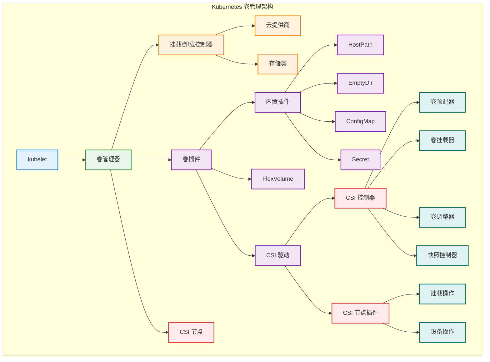

# 卷管理机制

## 概述

Kubernetes 卷管理机制负责为 Pod 提供持久化存储和临时存储解决方案。通过卷管理器（Volume Manager）、CSI（Container Storage Interface）驱动程序和各种存储插件，Kubernetes 实现了存储资源的动态分配、挂载、卸载和生命周期管理。

## 卷管理架构



## 卷管理器实现

### 核心卷管理器

```go
// 卷管理器主结构
type VolumeManager interface {
    // 生命周期管理
    Run(sourcesReady config.SourcesReady, stopCh <-chan struct{})
    
    // 等待挂载
    WaitForAttachAndMount(pod *v1.Pod) error
    WaitForUnmount(pod *v1.Pod) error
    
    // 状态查询
    GetMountedVolumesForPod(podName types.UniquePodName) container.VolumeMap
    GetExtraSupplementalGroupsForPod(pod *v1.Pod) []int64
    GetVolumesInUse() []v1.UniqueVolumeName
    
    // Pod 管理
    MarkVolumesAsReportedInUse(volumesReportedAsInUse []v1.UniqueVolumeName)
}

type volumeManager struct {
    // 核心组件
    kubeClient                clientset.Interface
    volumePluginMgr           *volume.VolumePluginMgr
    desiredStateOfWorld       cache.DesiredStateOfWorld
    actualStateOfWorld        cache.ActualStateOfWorld
    operationExecutor         operationexecutor.OperationExecutor
    
    // 调度器
    reconciler                reconciler.Reconciler
    
    // 配置
    kubeletPodDir             string
    recorder                  record.EventRecorder
    checkNodeCapabilitiesBeforeMount bool
    
    // 状态
    volumesNeedUpdateFromNodeStatus []v1.UniqueVolumeName
    volumeNeedReportedInUseProtection sync.RWMutex
}

func NewVolumeManager(
    controllerAttachDetachEnabled bool,
    nodeName types.NodeName,
    podManager podmanager.Manager,
    podStatusProvider status.PodStatusProvider,
    kubeClient clientset.Interface,
    volumePluginMgr *volume.VolumePluginMgr,
    kubeContainerRuntime kubecontainer.Runtime,
    mounter mount.Interface,
    hostutil hostutil.HostUtils,
    kubeletPodDir string,
    recorder record.EventRecorder,
    checkNodeCapabilitiesBeforeMount bool,
    keepTerminatedPodVolumes bool,
) VolumeManager {
    
    vm := &volumeManager{
        kubeClient:                kubeClient,
        volumePluginMgr:           volumePluginMgr,
        kubeletPodDir:             kubeletPodDir,
        recorder:                  recorder,
        checkNodeCapabilitiesBeforeMount: checkNodeCapabilitiesBeforeMount,
    }
    
    // 初始化期望状态和实际状态
    vm.desiredStateOfWorld = cache.NewDesiredStateOfWorld(volumePluginMgr)
    vm.actualStateOfWorld = cache.NewActualStateOfWorld(nodeName, volumePluginMgr)
    
    // 初始化操作执行器
    vm.operationExecutor = operationexecutor.NewOperationExecutor(
        kubeClient,
        volumePluginMgr,
        recorder,
        hostutil,
    )
    
    // 初始化协调器
    vm.reconciler = reconciler.NewReconciler(
        kubeClient,
        controllerAttachDetachEnabled,
        reconcilerLoopSleepDuration,
        waitForAttachTimeout,
        nodeName,
        vm.desiredStateOfWorld,
        vm.actualStateOfWorld,
        vm.operationExecutor,
        mounter,
        hostutil,
        volumePluginMgr,
        kubeletPodDir,
    )
    
    return vm
}

func (vm *volumeManager) Run(sourcesReady config.SourcesReady, stopCh <-chan struct{}) {
    defer runtime.HandleCrash()
    
    // 等待源就绪
    if !cache.WaitForCacheSync(stopCh, sourcesReady.AllReady) {
        return
    }
    
    klog.V(2).InfoS("Starting kubelet volume manager")
    
    // 启动协调器
    go vm.reconciler.Run(stopCh)
    
    // 启动期望状态填充器
    go vm.desiredStateOfWorldPopulator.Run(sourcesReady, stopCh)
    
    klog.InfoS("Started kubelet volume manager")
    <-stopCh
    klog.InfoS("Shutting down kubelet volume manager")
}

func (vm *volumeManager) WaitForAttachAndMount(pod *v1.Pod) error {
    expectedVolumes := getExpectedVolumes(pod)
    if len(expectedVolumes) == 0 {
        // 没有卷需要挂载
        return nil
    }
    
    klog.V(3).InfoS("Waiting for volumes to attach and mount for pod", "pod", klog.KObj(pod))
    
    uniquePodName := util.GetUniquePodName(pod)
    
    // 设置超时
    timeout := 2 * time.Minute
    ticker := time.NewTicker(100 * time.Millisecond)
    defer ticker.Stop()
    
    for {
        select {
        case <-ticker.C:
            mounted := true
            for _, volumeName := range expectedVolumes {
                if !vm.actualStateOfWorld.PodExistsInVolume(uniquePodName, volumeName) {
                    mounted = false
                    break
                }
            }
            
            if mounted {
                klog.V(3).InfoS("All volumes are attached and mounted for pod", "pod", klog.KObj(pod))
                return nil
            }
            
        case <-time.After(timeout):
            return fmt.Errorf("timeout waiting for volumes to attach or mount for pod %q", pod.Name)
        }
    }
}
```

### 期望状态管理

```go
// 期望状态世界
type DesiredStateOfWorld interface {
    // Pod 和卷管理
    AddPodToVolume(podName types.UniquePodName, pod *v1.Pod, volumeSpec *volume.Spec, outerVolumeSpecName string, volumeGidValue string, seLinuxLabel string) (v1.UniqueVolumeName, error)
    MarkVolumesReportedInUse(volumesReportedAsInUse []v1.UniqueVolumeName)
    DeletePodFromVolume(podName types.UniquePodName, volumeName v1.UniqueVolumeName) error
    VolumeExists(volumeName v1.UniqueVolumeName) bool
    PodExistsInVolume(podName types.UniquePodName, volumeName v1.UniqueVolumeName) bool
    
    // 遍历和查询
    GetVolumesToMount() []VolumeToMount
    GetPods() map[types.UniquePodName]bool
}

type desiredStateOfWorld struct {
    // 卷到 Pod 的映射
    volumesToMount map[v1.UniqueVolumeName]volumeToMount
    
    // Pod 到卷的映射
    volumePluginMgr *volume.VolumePluginMgr
    
    // 同步锁
    sync.RWMutex
}

type volumeToMount struct {
    // 卷规格
    volumeName         v1.UniqueVolumeName
    podsToMount        map[types.UniquePodName]podToMount
    pluginIsAttachable bool
    volumeGidValue     string
    reportedInUse      bool
    
    // 卷插件相关
    volumeSpec *volume.Spec
    plugin     volume.VolumePlugin
}

type podToMount struct {
    podName                types.UniquePodName
    pod                    *v1.Pod
    volumeSpec             *volume.Spec
    outerVolumeSpecName    string
    volumeGidValue         string
    seLinuxLabel          string
}

func NewDesiredStateOfWorld(volumePluginMgr *volume.VolumePluginMgr) DesiredStateOfWorld {
    return &desiredStateOfWorld{
        volumesToMount:  make(map[v1.UniqueVolumeName]volumeToMount),
        volumePluginMgr: volumePluginMgr,
    }
}

func (dsw *desiredStateOfWorld) AddPodToVolume(
    podName types.UniquePodName,
    pod *v1.Pod,
    volumeSpec *volume.Spec,
    outerVolumeSpecName string,
    volumeGidValue string,
    seLinuxLabel string) (v1.UniqueVolumeName, error) {
    
    dsw.Lock()
    defer dsw.Unlock()
    
    volumeName, err := util.GetUniqueVolumeNameFromSpec(dsw.volumePluginMgr, volumeSpec)
    if err != nil {
        return "", fmt.Errorf("failed to get unique volume name for volume %q for pod %q: %v", volumeSpec.Name(), pod.Name, err)
    }
    
    // 获取卷插件
    volumePlugin, err := dsw.volumePluginMgr.FindPluginBySpec(volumeSpec)
    if err != nil || volumePlugin == nil {
        return "", fmt.Errorf("failed to get volume plugin for volume %q for pod %q: %v", volumeSpec.Name(), pod.Name, err)
    }
    
    var attachableVolumePlugin volume.AttachableVolumePlugin
    if attachable := volumePlugin.GetPluginName(); attachable != "" {
        attachableVolumePlugin, _ = dsw.volumePluginMgr.FindAttachablePluginByName(attachable)
    }
    
    pluginIsAttachable := attachableVolumePlugin != nil
    
    // 检查卷是否已存在
    volumeObj, volumeExists := dsw.volumesToMount[volumeName]
    if !volumeExists {
        volumeObj = volumeToMount{
            volumeName:         volumeName,
            podsToMount:        make(map[types.UniquePodName]podToMount),
            pluginIsAttachable: pluginIsAttachable,
            volumeGidValue:     volumeGidValue,
            volumeSpec:         volumeSpec,
            plugin:             volumePlugin,
        }
        dsw.volumesToMount[volumeName] = volumeObj
    }
    
    // 添加 Pod 到卷
    if podObj, podExists := volumeObj.podsToMount[podName]; podExists {
        klog.V(5).InfoS("Pod already exists in volume", "podName", podName, "volumeName", volumeName)
        return volumeName, nil
    }
    
    volumeObj.podsToMount[podName] = podToMount{
        podName:             podName,
        pod:                 pod,
        volumeSpec:          volumeSpec,
        outerVolumeSpecName: outerVolumeSpecName,
        volumeGidValue:      volumeGidValue,
        seLinuxLabel:       seLinuxLabel,
    }
    
    dsw.volumesToMount[volumeName] = volumeObj
    
    klog.V(4).InfoS("Added pod to volume in desired state", "podName", podName, "volumeName", volumeName)
    return volumeName, nil
}

func (dsw *desiredStateOfWorld) DeletePodFromVolume(podName types.UniquePodName, volumeName v1.UniqueVolumeName) error {
    dsw.Lock()
    defer dsw.Unlock()
    
    volumeObj, volumeExists := dsw.volumesToMount[volumeName]
    if !volumeExists {
        return nil
    }
    
    if _, podExists := volumeObj.podsToMount[podName]; !podExists {
        return nil
    }
    
    // 删除 Pod
    delete(volumeObj.podsToMount, podName)
    
    // 如果没有 Pod 使用该卷，删除卷
    if len(volumeObj.podsToMount) == 0 {
        delete(dsw.volumesToMount, volumeName)
    } else {
        dsw.volumesToMount[volumeName] = volumeObj
    }
    
    klog.V(4).InfoS("Deleted pod from volume in desired state", "podName", podName, "volumeName", volumeName)
    return nil
}
```

### 实际状态管理

```go
// 实际状态世界
type ActualStateOfWorld interface {
    // 卷挂载状态
    MarkVolumeAsAttached(logger klog.Logger, volumeName v1.UniqueVolumeName, volumeSpec *volume.Spec, nodeName types.NodeName, devicePath string) error
    MarkVolumeAsDetached(volumeName v1.UniqueVolumeName, nodeName types.NodeName)
    MarkVolumeAsMounted(podName types.UniquePodName, podUID types.UID, volumeName v1.UniqueVolumeName, mounter volume.Mounter, blockVolumeMapper volume.BlockVolumeMapper, outerVolumeSpecName string, volumeGidValue string, volumeSpec *volume.Spec) error
    MarkVolumeAsUnmounted(podName types.UniquePodName, volumeName v1.UniqueVolumeName) error
    
    // 状态查询
    VolumeExistsWithSpecName(podName types.UniquePodName, volumeSpecName string) bool
    VolumeExists(volumeName v1.UniqueVolumeName) bool
    PodExistsInVolume(podName types.UniquePodName, volumeName v1.UniqueVolumeName) bool
    GetMountedVolumes() []MountedVolume
    GetMountedVolumesForPod(podName types.UniquePodName) []MountedVolume
    
    // Pod 和卷的关系
    GetPodsToRemount() []PodToRemount
    GetVolumesToUnmount() []MountedVolume
}

type actualStateOfWorld struct {
    // 节点名称
    nodeName types.NodeName
    
    // 已挂载的卷
    attachedVolumes map[v1.UniqueVolumeName]attachedVolume
    
    // 卷插件管理器
    volumePluginMgr *volume.VolumePluginMgr
    
    // 同步锁
    sync.RWMutex
}

type attachedVolume struct {
    volumeName         v1.UniqueVolumeName
    volumeSpec         *volume.Spec
    nodeName           types.NodeName
    pluginIsAttachable bool
    devicePath         string
    
    // 挂载的 Pod
    mountedPods        map[types.UniquePodName]mountedPod
}

type mountedPod struct {
    podName                types.UniquePodName
    podUID                 types.UID
    mounter                volume.Mounter
    blockVolumeMapper      volume.BlockVolumeMapper
    outerVolumeSpecName    string
    volumeGidValue         string
    volumeSpec             *volume.Spec
    remountRequired        bool
}

func NewActualStateOfWorld(nodeName types.NodeName, volumePluginMgr *volume.VolumePluginMgr) ActualStateOfWorld {
    return &actualStateOfWorld{
        nodeName:        nodeName,
        attachedVolumes: make(map[v1.UniqueVolumeName]attachedVolume),
        volumePluginMgr: volumePluginMgr,
    }
}

func (asw *actualStateOfWorld) MarkVolumeAsMounted(
    podName types.UniquePodName,
    podUID types.UID,
    volumeName v1.UniqueVolumeName,
    mounter volume.Mounter,
    blockVolumeMapper volume.BlockVolumeMapper,
    outerVolumeSpecName string,
    volumeGidValue string,
    volumeSpec *volume.Spec) error {
    
    asw.Lock()
    defer asw.Unlock()
    
    volumeObj, volumeExists := asw.attachedVolumes[volumeName]
    if !volumeExists {
        // 如果卷不存在，创建它
        volumeObj = attachedVolume{
            volumeName:         volumeName,
            volumeSpec:         volumeSpec,
            nodeName:           asw.nodeName,
            pluginIsAttachable: isAttachableVolume(volumeSpec, asw.volumePluginMgr),
            mountedPods:        make(map[types.UniquePodName]mountedPod),
        }
    }
    
    // 检查 Pod 是否已经挂载
    if podObj, podExists := volumeObj.mountedPods[podName]; podExists {
        klog.V(5).InfoS("Pod already mounted to volume", "podName", podName, "volumeName", volumeName)
        
        // 更新挂载信息
        podObj.remountRequired = false
        podObj.volumeSpec = volumeSpec
        podObj.mounter = mounter
        podObj.blockVolumeMapper = blockVolumeMapper
        volumeObj.mountedPods[podName] = podObj
    } else {
        // 添加新的已挂载 Pod
        volumeObj.mountedPods[podName] = mountedPod{
            podName:             podName,
            podUID:              podUID,
            mounter:             mounter,
            blockVolumeMapper:   blockVolumeMapper,
            outerVolumeSpecName: outerVolumeSpecName,
            volumeGidValue:      volumeGidValue,
            volumeSpec:          volumeSpec,
            remountRequired:     false,
        }
    }
    
    asw.attachedVolumes[volumeName] = volumeObj
    
    klog.V(4).InfoS("Volume is now mounted to pod", "podName", podName, "volumeName", volumeName)
    return nil
}

func (asw *actualStateOfWorld) MarkVolumeAsUnmounted(podName types.UniquePodName, volumeName v1.UniqueVolumeName) error {
    asw.Lock()
    defer asw.Unlock()
    
    volumeObj, volumeExists := asw.attachedVolumes[volumeName]
    if !volumeExists {
        return nil
    }
    
    if _, podExists := volumeObj.mountedPods[podName]; !podExists {
        return nil
    }
    
    // 删除 Pod
    delete(volumeObj.mountedPods, podName)
    asw.attachedVolumes[volumeName] = volumeObj
    
    klog.V(4).InfoS("Volume is now unmounted from pod", "podName", podName, "volumeName", volumeName)
    return nil
}
```

## 卷插件系统

### 插件管理器

```go
// 卷插件管理器
type VolumePluginMgr struct {
    mutex   sync.RWMutex
    plugins map[string]VolumePlugin
    
    // 特定类型插件的快速查找
    attachablePlugins     map[string]AttachableVolumePlugin
    deviceMountablePlugins map[string]DeviceMountableVolumePlugin
    expandablePlugins     map[string]ExpandableVolumePlugin
    
    // 主机工具
    host VolumeHost
    
    // 概率配置
    probVolumePlugins []VolumePlugin
}

type VolumePlugin interface {
    // 基本信息
    GetPluginName() string
    GetVolumeName(spec *Spec) (string, error)
    CanSupport(spec *Spec) bool
    RequiresRemount(spec *Spec) bool
    SupportsMountOption() bool
    SupportsBulkVolumeVerification() bool
    
    // 创建器和清理器
    NewMounter(spec *Spec, podRef *v1.ObjectReference, opts VolumeOptions) (Mounter, error)
    NewUnmounter(volumeName string, podUID types.UID) (Unmounter, error)
    
    // 构造和销毁
    ConstructVolumeSpec(volumeName, mountPath string) (*Spec, error)
}

type AttachableVolumePlugin interface {
    VolumePlugin
    NewAttacher() (Attacher, error)
    NewDetacher() (Detacher, error)
    GetDeviceMountRefs(deviceMountPath string) ([]string, error)
}

type DeviceMountableVolumePlugin interface {
    VolumePlugin
    NewDeviceMounter() (DeviceMounter, error)
    NewDeviceUnmounter() (DeviceUnmounter, error)
    GetDeviceMountPath(spec *Spec) (string, error)
}

func NewVolumePluginMgr() *VolumePluginMgr {
    return &VolumePluginMgr{
        plugins:               make(map[string]VolumePlugin),
        attachablePlugins:     make(map[string]AttachableVolumePlugin),
        deviceMountablePlugins: make(map[string]DeviceMountableVolumePlugin),
        expandablePlugins:     make(map[string]ExpandableVolumePlugin),
    }
}

func (pm *VolumePluginMgr) InitPlugins(plugins []VolumePlugin, host VolumeHost) error {
    pm.mutex.Lock()
    defer pm.mutex.Unlock()
    
    pm.host = host
    
    for _, plugin := range plugins {
        pluginName := plugin.GetPluginName()
        if pluginName == "" {
            return fmt.Errorf("Plugin name should not be empty")
        }
        
        pm.plugins[pluginName] = plugin
        
        // 注册特定类型的插件
        if attachablePlugin, ok := plugin.(AttachableVolumePlugin); ok {
            pm.attachablePlugins[pluginName] = attachablePlugin
        }
        
        if deviceMountablePlugin, ok := plugin.(DeviceMountableVolumePlugin); ok {
            pm.deviceMountablePlugins[pluginName] = deviceMountablePlugin
        }
        
        if expandablePlugin, ok := plugin.(ExpandableVolumePlugin); ok {
            pm.expandablePlugins[pluginName] = expandablePlugin
        }
        
        klog.V(1).InfoS("Loaded volume plugin", "pluginName", pluginName)
    }
    
    return nil
}

func (pm *VolumePluginMgr) FindPluginBySpec(spec *Spec) (VolumePlugin, error) {
    pm.mutex.RLock()
    defer pm.mutex.RUnlock()
    
    if spec == nil {
        return nil, fmt.Errorf("Could not find plugin because volume spec is nil")
    }
    
    for _, plugin := range pm.plugins {
        if plugin.CanSupport(spec) {
            return plugin, nil
        }
    }
    
    return nil, fmt.Errorf("no volume plugin matched")
}

func (pm *VolumePluginMgr) FindPluginByName(name string) (VolumePlugin, error) {
    pm.mutex.RLock()
    defer pm.mutex.RUnlock()
    
    if plugin, found := pm.plugins[name]; found {
        return plugin, nil
    }
    
    return nil, fmt.Errorf("no volume plugin found with name: %s", name)
}
```

### CSI 插件实现

```go
// CSI 卷插件
type csiPlugin struct {
    host   VolumeHost
    csiClientGetter CSIClientGetter
    volumeAttachLimitKey string
}

const CSIPluginName = "kubernetes.io/csi"

func (p *csiPlugin) GetPluginName() string {
    return CSIPluginName
}

func (p *csiPlugin) CanSupport(spec *Spec) bool {
    return spec.Volume != nil && spec.Volume.CSI != nil
}

func (p *csiPlugin) NewMounter(spec *Spec, pod *v1.Pod, opts VolumeOptions) (Mounter, error) {
    if !p.CanSupport(spec) {
        return nil, fmt.Errorf("volume %s is not a CSI volume", spec.Name())
    }
    
    volumeLifecycleMode, err := p.getVolumeLifecycleMode(spec)
    if err != nil {
        return nil, err
    }
    
    k8s := p.host.GetKubeClient()
    if k8s == nil {
        return nil, fmt.Errorf("failed to get kubeclient")
    }
    
    mounter := &csiMountMgr{
        plugin:              p,
        k8s:                k8s,
        spec:               spec,
        pod:                pod,
        podUID:             pod.UID,
        driverName:         spec.Volume.CSI.Driver,
        volumeLifecycleMode: volumeLifecycleMode,
        volumeAttachments:   make(map[string]string),
        csiClientGetter:     p.csiClientGetter,
        readOnly:           spec.ReadOnly,
    }
    
    return mounter, nil
}

// CSI 挂载管理器
type csiMountMgr struct {
    plugin              *csiPlugin
    k8s                clientset.Interface
    spec               *Spec
    pod                *v1.Pod
    podUID             types.UID
    driverName         string
    volumeLifecycleMode VolumeLifecycleMode
    volumeAttachments   map[string]string
    csiClientGetter     CSIClientGetter
    readOnly           bool
    
    // 挂载相关
    mounterArgs        MounterArgs
    deviceMountPath    string
    deviceStagePath    string
}

func (c *csiMountMgr) SetUp(mounterArgs MounterArgs) error {
    return c.SetUpAt(c.GetPath(), mounterArgs)
}

func (c *csiMountMgr) SetUpAt(dir string, mounterArgs MounterArgs) error {
    klog.V(4).InfoS("CSI SetUpAt", "path", dir, "driver", c.driverName)
    
    c.mounterArgs = mounterArgs
    
    // 检查驱动程序是否已注册
    if err := c.waitForDriverRegistration(); err != nil {
        return fmt.Errorf("failed to wait for driver registration: %v", err)
    }
    
    // 准备卷
    if err := c.prepareVolume(); err != nil {
        return fmt.Errorf("failed to prepare volume: %v", err)
    }
    
    // Stage 卷（如果需要）
    if c.volumeLifecycleMode == VolumeLifecyclePersistent {
        if err := c.stageVolume(); err != nil {
            return fmt.Errorf("failed to stage volume: %v", err)
        }
    }
    
    // Publish 卷
    if err := c.publishVolume(dir); err != nil {
        return fmt.Errorf("failed to publish volume: %v", err)
    }
    
    klog.V(4).InfoS("CSI SetUpAt completed successfully", "path", dir, "driver", c.driverName)
    return nil
}

func (c *csiMountMgr) stageVolume() error {
    klog.V(4).InfoS("CSI staging volume", "driver", c.driverName)
    
    csi, err := c.csiClientGetter.Get()
    if err != nil {
        return fmt.Errorf("failed to get CSI client: %v", err)
    }
    
    ctx, cancel := context.WithTimeout(context.Background(), csiTimeout)
    defer cancel()
    
    // 构建 NodeStageVolume 请求
    req := &csipb.NodeStageVolumeRequest{
        VolumeId:          c.spec.Volume.CSI.VolumeHandle,
        PublishContext:    c.volumeAttachments,
        StagingTargetPath: c.deviceStagePath,
        VolumeCapability:  c.getVolumeCapability(),
        Secrets:          c.getSecrets(),
        VolumeContext:    c.spec.Volume.CSI.VolumeAttributes,
    }
    
    _, err = csi.NodeStageVolume(ctx, req)
    if err != nil {
        return fmt.Errorf("CSI NodeStageVolume failed: %v", err)
    }
    
    klog.V(4).InfoS("CSI volume staged successfully", "driver", c.driverName)
    return nil
}

func (c *csiMountMgr) publishVolume(targetPath string) error {
    klog.V(4).InfoS("CSI publishing volume", "driver", c.driverName, "targetPath", targetPath)
    
    csi, err := c.csiClientGetter.Get()
    if err != nil {
        return fmt.Errorf("failed to get CSI client: %v", err)
    }
    
    ctx, cancel := context.WithTimeout(context.Background(), csiTimeout)
    defer cancel()
    
    // 构建 NodePublishVolume 请求
    req := &csipb.NodePublishVolumeRequest{
        VolumeId:         c.spec.Volume.CSI.VolumeHandle,
        PublishContext:   c.volumeAttachments,
        TargetPath:       targetPath,
        VolumeCapability: c.getVolumeCapability(),
        Readonly:         c.readOnly,
        Secrets:         c.getSecrets(),
        VolumeContext:   c.spec.Volume.CSI.VolumeAttributes,
    }
    
    if c.volumeLifecycleMode == VolumeLifecyclePersistent {
        req.StagingTargetPath = c.deviceStagePath
    }
    
    _, err = csi.NodePublishVolume(ctx, req)
    if err != nil {
        return fmt.Errorf("CSI NodePublishVolume failed: %v", err)
    }
    
    klog.V(4).InfoS("CSI volume published successfully", "driver", c.driverName, "targetPath", targetPath)
    return nil
}

func (c *csiMountMgr) getVolumeCapability() *csipb.VolumeCapability {
    var accessMode *csipb.VolumeCapability_AccessMode
    if c.spec.PersistentVolume != nil {
        accessMode = &csipb.VolumeCapability_AccessMode{
            Mode: asCSIAccessMode(c.spec.PersistentVolume.Spec.AccessModes[0]),
        }
    }
    
    capability := &csipb.VolumeCapability{
        AccessMode: accessMode,
    }
    
    if c.spec.Volume.CSI.FSType != nil {
        capability.AccessType = &csipb.VolumeCapability_Mount{
            Mount: &csipb.VolumeCapability_MountVolume{
                FsType:     *c.spec.Volume.CSI.FSType,
                MountFlags: c.spec.Volume.CSI.MountOptions,
            },
        }
    } else {
        capability.AccessType = &csipb.VolumeCapability_Block{
            Block: &csipb.VolumeCapability_BlockVolume{},
        }
    }
    
    return capability
}
```

## 存储类和动态预配

### 动态预配控制器

```go
// 动态预配控制器
type ProvisionController struct {
    client      clientset.Interface
    provisioner Provisioner
    
    // 缓存
    claimQueue  workqueue.RateLimitingInterface
    volumeQueue workqueue.RateLimitingInterface
    
    claimLister  corelisters.PersistentVolumeClaimLister
    volumeLister corelisters.PersistentVolumeLister
    classLister  storagev1listers.StorageClassLister
    
    // 配置
    provisionerName string
    kubeVersion     *version.Info
    
    // 指标
    metrics *ProvisionMetrics
}

type Provisioner interface {
    // 预配卷
    Provision(ProvisionOptions) (*v1.PersistentVolume, error)
    
    // 删除卷
    Delete(volume *v1.PersistentVolume) error
    
    // 支持的访问模式
    SupportsAccessMode(accessMode v1.PersistentVolumeAccessMode) bool
}

type ProvisionOptions struct {
    // 存储类
    StorageClass *storagev1.StorageClass
    
    // PVC
    PVC *v1.PersistentVolumeClaim
    
    // 节点亲和性
    SelectedNode *v1.Node
}

func NewProvisionController(
    client clientset.Interface,
    provisionerName string,
    provisioner Provisioner,
    kubeVersion string,
) *ProvisionController {
    
    controller := &ProvisionController{
        client:          client,
        provisioner:     provisioner,
        provisionerName: provisionerName,
        claimQueue:      workqueue.NewNamedRateLimitingQueue(workqueue.DefaultControllerRateLimiter(), "claims"),
        volumeQueue:     workqueue.NewNamedRateLimitingQueue(workqueue.DefaultControllerRateLimiter(), "volumes"),
        metrics:         newProvisionMetrics(),
    }
    
    return controller
}

func (ctrl *ProvisionController) Run(ctx context.Context) {
    defer runtime.HandleCrash()
    defer ctrl.claimQueue.ShutDown()
    defer ctrl.volumeQueue.ShutDown()
    
    klog.InfoS("Starting provision controller", "provisioner", ctrl.provisionerName)
    defer klog.InfoS("Shutting down provision controller", "provisioner", ctrl.provisionerName)
    
    // 启动工作协程
    go wait.Until(ctrl.runClaimWorker, time.Second, ctx.Done())
    go wait.Until(ctrl.runVolumeWorker, time.Second, ctx.Done())
    
    <-ctx.Done()
}

func (ctrl *ProvisionController) runClaimWorker() {
    for ctrl.processNextClaimWorkItem() {
    }
}

func (ctrl *ProvisionController) processNextClaimWorkItem() bool {
    key, quit := ctrl.claimQueue.Get()
    if quit {
        return false
    }
    defer ctrl.claimQueue.Done(key)
    
    err := ctrl.syncClaimHandler(key.(string))
    if err == nil {
        ctrl.claimQueue.Forget(key)
        return true
    }
    
    runtime.HandleError(fmt.Errorf("error syncing claim %q: %v", key, err))
    ctrl.claimQueue.AddRateLimited(key)
    
    return true
}

func (ctrl *ProvisionController) syncClaimHandler(key string) error {
    namespace, name, err := cache.SplitMetaNamespaceKey(key)
    if err != nil {
        return err
    }
    
    claim, err := ctrl.claimLister.PersistentVolumeClaims(namespace).Get(name)
    if errors.IsNotFound(err) {
        klog.V(4).InfoS("PVC deleted", "pvc", key)
        return nil
    }
    if err != nil {
        return err
    }
    
    return ctrl.syncClaim(claim)
}

func (ctrl *ProvisionController) syncClaim(claim *v1.PersistentVolumeClaim) error {
    // 检查是否需要预配
    if !shouldProvision(claim, ctrl.provisionerName) {
        return nil
    }
    
    // 获取存储类
    storageClass, err := ctrl.getStorageClass(claim)
    if err != nil {
        return fmt.Errorf("failed to get storage class: %v", err)
    }
    
    // 检查预配器是否匹配
    if storageClass.Provisioner != ctrl.provisionerName {
        return nil
    }
    
    klog.V(4).InfoS("Provisioning volume for claim", "claim", klog.KObj(claim), "storageClass", storageClass.Name)
    
    // 执行预配
    volume, err := ctrl.provisionVolume(claim, storageClass)
    if err != nil {
        return fmt.Errorf("failed to provision volume: %v", err)
    }
    
    // 创建 PV
    volume, err = ctrl.client.CoreV1().PersistentVolumes().Create(context.TODO(), volume, metav1.CreateOptions{})
    if err != nil {
        return fmt.Errorf("failed to create PV: %v", err)
    }
    
    klog.V(2).InfoS("Volume provisioned successfully", "volume", volume.Name, "claim", klog.KObj(claim))
    ctrl.metrics.persistentVolumeClaimProvisionTotal.WithLabelValues(storageClass.Name).Inc()
    
    return nil
}

func (ctrl *ProvisionController) provisionVolume(claim *v1.PersistentVolumeClaim, storageClass *storagev1.StorageClass) (*v1.PersistentVolume, error) {
    options := ProvisionOptions{
        StorageClass: storageClass,
        PVC:          claim,
    }
    
    // 选择节点（如果需要）
    if storageClass.VolumeBindingMode != nil && *storageClass.VolumeBindingMode == storagev1.VolumeBindingWaitForFirstConsumer {
        selectedNode, err := ctrl.getSelectedNode(claim)
        if err != nil {
            return nil, fmt.Errorf("failed to get selected node: %v", err)
        }
        options.SelectedNode = selectedNode
    }
    
    // 调用预配器
    volume, err := ctrl.provisioner.Provision(options)
    if err != nil {
        return nil, err
    }
    
    // 设置 PV 属性
    volume.Spec.ClaimRef = &v1.ObjectReference{
        Kind:            "PersistentVolumeClaim",
        APIVersion:      "v1",
        UID:             claim.UID,
        Namespace:       claim.Namespace,
        Name:            claim.Name,
        ResourceVersion: claim.ResourceVersion,
    }
    
    volume.Spec.StorageClassName = storageClass.Name
    
    // 设置回收策略
    if storageClass.ReclaimPolicy != nil {
        volume.Spec.PersistentVolumeReclaimPolicy = *storageClass.ReclaimPolicy
    } else {
        volume.Spec.PersistentVolumeReclaimPolicy = v1.PersistentVolumeReclaimDelete
    }
    
    // 设置挂载选项
    if len(storageClass.MountOptions) > 0 {
        volume.Spec.MountOptions = storageClass.MountOptions
    }
    
    return volume, nil
}

// CSI 预配器实现
type CSIProvisioner struct {
    client       clientset.Interface
    csiClient    csi.Interface
    driverName   string
    volumeNamePrefix string
    fsType       string
    
    // 超时配置
    timeout      time.Duration
}

func (p *CSIProvisioner) Provision(options ProvisionOptions) (*v1.PersistentVolume, error) {
    // 生成卷名称
    volumeName := p.generateVolumeName(options.PVC)
    
    // 构建 CreateVolume 请求
    req := &csi.CreateVolumeRequest{
        Name:               volumeName,
        CapacityRange:      p.getCapacityRange(options.PVC),
        VolumeCapabilities: p.getVolumeCapabilities(options.StorageClass, options.PVC),
        Parameters:         options.StorageClass.Parameters,
        Secrets:           p.getSecrets(options.StorageClass),
    }
    
    // 设置拓扑要求
    if options.SelectedNode != nil {
        req.AccessibilityRequirements = p.getAccessibilityRequirements(options.SelectedNode)
    }
    
    // 调用 CSI 驱动创建卷
    ctx, cancel := context.WithTimeout(context.Background(), p.timeout)
    defer cancel()
    
    resp, err := p.csiClient.CreateVolume(ctx, req)
    if err != nil {
        return nil, fmt.Errorf("failed to create volume: %v", err)
    }
    
    // 构建 PersistentVolume
    pv := &v1.PersistentVolume{
        ObjectMeta: metav1.ObjectMeta{
            Name: volumeName,
        },
        Spec: v1.PersistentVolumeSpec{
            Capacity: v1.ResourceList{
                v1.ResourceStorage: options.PVC.Spec.Resources.Requests[v1.ResourceStorage],
            },
            AccessModes: options.PVC.Spec.AccessModes,
            PersistentVolumeSource: v1.PersistentVolumeSource{
                CSI: &v1.CSIPersistentVolumeSource{
                    Driver:           p.driverName,
                    VolumeHandle:     resp.Volume.VolumeId,
                    VolumeAttributes: resp.Volume.VolumeContext,
                    FSType:           p.fsType,
                },
            },
        },
    }
    
    // 设置节点亲和性
    if resp.Volume.AccessibleTopology != nil {
        pv.Spec.NodeAffinity = p.getNodeAffinityFromTopology(resp.Volume.AccessibleTopology)
    }
    
    return pv, nil
}

func (p *CSIProvisioner) Delete(volume *v1.PersistentVolume) error {
    if volume.Spec.CSI == nil {
        return fmt.Errorf("volume is not a CSI volume")
    }
    
    // 构建 DeleteVolume 请求
    req := &csi.DeleteVolumeRequest{
        VolumeId: volume.Spec.CSI.VolumeHandle,
        Secrets:  p.getDeleteSecrets(volume),
    }
    
    // 调用 CSI 驱动删除卷
    ctx, cancel := context.WithTimeout(context.Background(), p.timeout)
    defer cancel()
    
    _, err := p.csiClient.DeleteVolume(ctx, req)
    if err != nil {
        return fmt.Errorf("failed to delete volume: %v", err)
    }
    
    return nil
}
```

## 监控和调试

### 卷管理指标

```go
// 卷管理监控指标
type VolumeMetrics struct {
    // 挂载操作指标
    volumeMountDuration    *prometheus.HistogramVec
    volumeMountTotal       *prometheus.CounterVec
    
    // 卷状态指标
    volumeAttachedCount    prometheus.Gauge
    volumeMountedCount     prometheus.Gauge
    
    // 错误统计
    volumeErrorsTotal      *prometheus.CounterVec
    
    // CSI 指标
    csiOperationDuration   *prometheus.HistogramVec
    csiOperationTotal      *prometheus.CounterVec
}

func newVolumeMetrics() *VolumeMetrics {
    return &VolumeMetrics{
        volumeMountDuration: prometheus.NewHistogramVec(
            prometheus.HistogramOpts{
                Name: "kubelet_volume_mount_duration_seconds",
                Help: "Duration of volume mount operations",
                Buckets: []float64{0.01, 0.1, 1.0, 10.0, 100.0},
            },
            []string{"operation", "volume_plugin"},
        ),
        volumeMountTotal: prometheus.NewCounterVec(
            prometheus.CounterOpts{
                Name: "kubelet_volume_mount_total",
                Help: "Total number of volume mount operations",
            },
            []string{"operation", "volume_plugin", "result"},
        ),
        volumeAttachedCount: prometheus.NewGauge(
            prometheus.GaugeOpts{
                Name: "kubelet_volumes_attached",
                Help: "Number of volumes currently attached",
            },
        ),
        csiOperationDuration: prometheus.NewHistogramVec(
            prometheus.HistogramOpts{
                Name: "kubelet_csi_operation_duration_seconds",
                Help: "Duration of CSI operations",
                Buckets: []float64{0.1, 1.0, 10.0, 60.0, 300.0},
            },
            []string{"driver", "method"},
        ),
    }
}
```

## 最佳实践

### 卷管理优化

1. **存储类配置**：
   - 选择合适的预配器
   - 配置正确的回收策略
   - 设置适当的卷绑定模式
   - 优化存储参数

2. **性能调优**：
   - 使用本地存储提高性能
   - 配置适当的 I/O 限制
   - 启用卷预分配
   - 优化文件系统类型

3. **安全配置**：
   - 使用加密存储
   - 配置访问权限
   - 启用审计日志
   - 定期备份数据

### 故障排查

1. **卷管理问题诊断**：
   ```bash
   # 检查卷状态
   kubectl get pv,pvc
   kubectl describe pv <pv-name>
   kubectl describe pvc <pvc-name>
   
   # 查看 kubelet 日志
   journalctl -u kubelet | grep -i volume
   
   # 检查 CSI 驱动状态
   kubectl get csidrivers
   kubectl get csinodes
   ```

2. **常见问题解决**：
   - **挂载失败**：检查节点权限和驱动程序
   - **预配失败**：验证存储类和凭据配置
   - **性能问题**：检查 I/O 限制和网络延迟
   - **数据丢失**：确认回收策略和备份状态

### 安全考虑

1. **数据保护**：
   - 启用卷加密
   - 配置访问控制
   - 实施数据备份
   - 监控异常访问

2. **网络安全**：
   - 使用安全传输协议
   - 配置防火墙规则
   - 启用网络分段
   - 监控网络流量
