# Watch 机制原理

## 概述

Kubernetes Watch 机制是基于事件流处理的实时通知系统，允许客户端监听集群中资源的变化。通过 Watch API，控制器和其他组件能够实时响应资源状态变化，实现高效的事件驱动架构。Watch 机制是 Kubernetes 声明式 API 和控制器模式的核心基础。

## Watch 机制架构

```mermaid
graph TB
    subgraph "Watch 机制架构"
        CLIENT[客户端] --> WATCH_REQUEST[Watch请求]
        WATCH_REQUEST --> API_SERVER[API Server]
        API_SERVER --> WATCH_HANDLER[Watch处理器]
        
        WATCH_HANDLER --> ETCD_WATCH[etcd Watch]
        ETCD_WATCH --> EVENT_STREAM[事件流]
        EVENT_STREAM --> FILTER[事件过滤]
        FILTER --> TRANSFORM[事件转换]
        TRANSFORM --> CLIENT_STREAM[客户端流]
        CLIENT_STREAM --> CLIENT
        
        ETCD[etcd存储] --> ETCD_WATCH
        RESOURCE_CHANGE[资源变化] --> ETCD
    end
    
    subgraph "事件处理流水线"
        RAW_EVENT[原始事件] --> DECODE[事件解码]
        DECODE --> VALIDATE[事件验证]
        VALIDATE --> ENRICH[事件丰富]
        ENRICH --> SERIALIZE[序列化]
        SERIALIZE --> SEND[发送客户端]
    end
    
    subgraph "连接管理"
        CONNECTION_POOL[连接池] --> HEARTBEAT[心跳检测]
        HEARTBEAT --> RECONNECT[断线重连]
        RECONNECT --> BACKOFF[指数退避]
        BACKOFF --> CONNECTION_POOL
    end
    
    %% 样式定义
    classDef watchPhase fill:#e3f2fd,stroke:#1976d2,stroke-width:2px
    classDef eventPhase fill:#e8f5e8,stroke:#388e3c,stroke-width:2px
    classDef connectionPhase fill:#fff3e0,stroke:#f57c00,stroke-width:2px
    classDef storagePhase fill:#f3e5f5,stroke:#7b1fa2,stroke-width:2px
    
    class CLIENT,WATCH_REQUEST,API_SERVER,WATCH_HANDLER watchPhase
    class RAW_EVENT,DECODE,VALIDATE,ENRICH,SERIALIZE,SEND eventPhase
    class CONNECTION_POOL,HEARTBEAT,RECONNECT,BACKOFF connectionPhase
    class ETCD,ETCD_WATCH,EVENT_STREAM storagePhase
```



## Watch API 实现

### Watch 请求处理

```go
// Watch 处理器实现
type WatchHandler struct {
    storage   storage.Interface
    codec     runtime.Codec
    versioner storage.Versioner
    
    // 连接管理
    connections *ConnectionManager
    
    // 配置
    timeout      time.Duration
    bufferSize   int
    
    logger klog.Logger
}

func NewWatchHandler(storage storage.Interface, codec runtime.Codec) *WatchHandler {
    return &WatchHandler{
        storage:     storage,
        codec:       codec,
        versioner:   storage.Versioner(),
        connections: NewConnectionManager(),
        timeout:     30 * time.Minute,
        bufferSize:  100,
        logger:      klog.WithName("watch-handler"),
    }
}

// HTTP Watch 端点处理
func (w *WatchHandler) ServeHTTP(response http.ResponseWriter, request *http.Request) {
    ctx := request.Context()
    
    // 解析 Watch 参数
    opts, err := w.parseWatchOptions(request)
    if err != nil {
        http.Error(response, err.Error(), http.StatusBadRequest)
        return
    }
    
    w.logger.V(4).Info("Starting watch", "options", opts)
    
    // 设置流式响应
    if err := w.setupStreamingResponse(response); err != nil {
        http.Error(response, err.Error(), http.StatusInternalServerError)
        return
    }
    
    // 创建 Watch 实例
    watcher, err := w.storage.Watch(ctx, opts.Key, *opts)
    if err != nil {
        w.sendError(response, err)
        return
    }
    defer watcher.Stop()
    
    // 注册连接
    connID := w.connections.Register(response, request)
    defer w.connections.Unregister(connID)
    
    // 处理事件流
    w.streamEvents(ctx, response, watcher, opts)
}

func (w *WatchHandler) parseWatchOptions(req *http.Request) (*storage.ListOptions, error) {
    opts := &storage.ListOptions{
        Recursive: true,
    }
    
    query := req.URL.Query()
    
    // 解析资源版本
    if rv := query.Get("resourceVersion"); rv != "" {
        opts.ResourceVersion = rv
    }
    
    // 解析标签选择器
    if labelSelector := query.Get("labelSelector"); labelSelector != "" {
        selector, err := labels.Parse(labelSelector)
        if err != nil {
            return nil, fmt.Errorf("invalid label selector: %v", err)
        }
        opts.Predicate.Label = selector
    }
    
    // 解析字段选择器
    if fieldSelector := query.Get("fieldSelector"); fieldSelector != "" {
        selector, err := fields.ParseSelector(fieldSelector)
        if err != nil {
            return nil, fmt.Errorf("invalid field selector: %v", err)
        }
        opts.Predicate.Field = selector
    }
    
    // 解析超时时间
    if timeoutStr := query.Get("timeoutSeconds"); timeoutStr != "" {
        if timeout, err := strconv.Atoi(timeoutStr); err == nil && timeout > 0 {
            opts.Predicate.Timeout = time.Duration(timeout) * time.Second
        }
    }
    
    return opts, nil
}

func (w *WatchHandler) setupStreamingResponse(response http.ResponseWriter) error {
    response.Header().Set("Content-Type", "application/json")
    response.Header().Set("Cache-Control", "no-cache")
    response.Header().Set("Connection", "keep-alive")
    response.Header().Set("Transfer-Encoding", "chunked")
    
    // 启用 HTTP/2 服务端推送（如果支持）
    if flusher, ok := response.(http.Flusher); ok {
        flusher.Flush()
        return nil
    }
    
    return fmt.Errorf("streaming not supported")
}

func (w *WatchHandler) streamEvents(
    ctx context.Context,
    response http.ResponseWriter,
    watcher watch.Interface,
    opts *storage.ListOptions,
) {
    
    encoder := json.NewEncoder(response)
    flusher := response.(http.Flusher)
    
    // 设置超时
    timeout := w.timeout
    if opts.Predicate.Timeout > 0 {
        timeout = opts.Predicate.Timeout
    }
    
    timer := time.NewTimer(timeout)
    defer timer.Stop()
    
    for {
        select {
        case event, ok := <-watcher.ResultChan():
            if !ok {
                w.logger.V(4).Info("Watch channel closed")
                return
            }
            
            // 处理事件
            if err := w.processWatchEvent(encoder, event); err != nil {
                w.logger.Error(err, "Failed to process watch event")
                return
            }
            
            flusher.Flush()
            timer.Reset(timeout)
            
        case <-timer.C:
            w.logger.V(4).Info("Watch timeout")
            return
            
        case <-ctx.Done():
            w.logger.V(4).Info("Watch context cancelled")
            return
        }
    }
}

func (w *WatchHandler) processWatchEvent(encoder *json.Encoder, event watch.Event) error {
    // 转换为 API 事件格式
    apiEvent := &WatchEvent{
        Type:   string(event.Type),
        Object: event.Object,
    }
    
    // 序列化并发送
    return encoder.Encode(apiEvent)
}

type WatchEvent struct {
    Type   string      `json:"type"`
    Object interface{} `json:"object"`
}
```

### 存储层 Watch 实现

```go
// 存储层 Watch 接口
type StorageWatcher interface {
    Watch(ctx context.Context, key string, opts storage.ListOptions) (watch.Interface, error)
}

// etcd Watch 实现
type EtcdWatcher struct {
    client       clientv3.Client
    codec        runtime.Codec
    pathPrefix   string
    
    key          string
    recursive    bool
    startRev     int64
    
    ctx          context.Context
    cancel       context.CancelFunc
    resultChan   chan watch.Event
    
    // 事件处理
    eventProcessor *EventProcessor
    
    logger klog.Logger
}

func (s *EtcdStorage) Watch(
    ctx context.Context,
    key string,
    opts storage.ListOptions,
) (watch.Interface, error) {
    
    key = path.Join(s.pathPrefix, key)
    
    watchCtx, cancel := context.WithCancel(ctx)
    
    watcher := &EtcdWatcher{
        client:         s.client,
        codec:          s.codec,
        pathPrefix:     s.pathPrefix,
        key:            key,
        recursive:      opts.Recursive,
        ctx:            watchCtx,
        cancel:         cancel,
        resultChan:     make(chan watch.Event, 100),
        eventProcessor: NewEventProcessor(s.codec, opts.Predicate),
        logger:         s.logger.WithName("etcd-watcher"),
    }
    
    // 解析起始版本
    if opts.ResourceVersion != "" {
        rev, err := strconv.ParseInt(opts.ResourceVersion, 10, 64)
        if err != nil {
            cancel()
            return nil, fmt.Errorf("invalid resource version: %v", err)
        }
        watcher.startRev = rev + 1
    }
    
    go watcher.run()
    
    return watcher, nil
}

func (w *EtcdWatcher) run() {
    defer close(w.resultChan)
    
    w.logger.V(4).Info("Starting etcd watch",
        "key", w.key,
        "recursive", w.recursive,
        "startRev", w.startRev)
    
    var watchOpts []clientv3.OpOption
    
    if w.recursive {
        watchOpts = append(watchOpts, clientv3.WithPrefix())
    }
    
    if w.startRev > 0 {
        watchOpts = append(watchOpts, clientv3.WithRev(w.startRev))
    }
    
    // 启用进度通知
    watchOpts = append(watchOpts, clientv3.WithProgressNotify())
    
    // 启用压缩事件
    watchOpts = append(watchOpts, clientv3.WithCreatedNotify())
    
    watchChan := w.client.Watch(w.ctx, w.key, watchOpts...)
    
    for {
        select {
        case resp := <-watchChan:
            if err := resp.Err(); err != nil {
                w.sendError(err)
                return
            }
            
            // 处理事件
            for _, event := range resp.Events {
                if err := w.processEtcdEvent(event); err != nil {
                    w.logger.Error(err, "Failed to process etcd event")
                }
            }
            
            // 处理进度通知
            if resp.IsProgressNotify() {
                w.sendBookmark(resp.Header.Revision)
            }
            
            // 处理压缩通知
            if resp.CompactRevision > 0 {
                w.handleCompaction(resp.CompactRevision)
            }
            
        case <-w.ctx.Done():
            w.logger.V(4).Info("Watch context cancelled")
            return
        }
    }
}

func (w *EtcdWatcher) processEtcdEvent(event *clientv3.Event) error {
    var eventType watch.EventType
    var obj runtime.Object
    var prevObj runtime.Object
    
    switch event.Type {
    case clientv3.EventTypePut:
        if event.IsCreate() {
            eventType = watch.Added
        } else {
            eventType = watch.Modified
        }
        
        // 解码当前对象
        obj = &unstructured.Unstructured{}
        if err := w.decodeObject(event.Kv.Value, obj, event.Kv.ModRevision); err != nil {
            return err
        }
        
        // 解码前一个对象（如果存在）
        if event.PrevKv != nil {
            prevObj = &unstructured.Unstructured{}
            if err := w.decodeObject(event.PrevKv.Value, prevObj, event.PrevKv.ModRevision); err != nil {
                w.logger.Error(err, "Failed to decode previous object")
            }
        }
        
    case clientv3.EventTypeDelete:
        eventType = watch.Deleted
        
        // 对于删除事件，使用前一个值作为对象
        if event.PrevKv != nil {
            obj = &unstructured.Unstructured{}
            if err := w.decodeObject(event.PrevKv.Value, obj, event.PrevKv.ModRevision); err != nil {
                return err
            }
        }
    }
    
    // 创建 Watch 事件
    watchEvent := watch.Event{
        Type:   eventType,
        Object: obj,
    }
    
    // 处理和过滤事件
    if processedEvent, shouldSend := w.eventProcessor.Process(watchEvent, prevObj); shouldSend {
        select {
        case w.resultChan <- processedEvent:
        case <-w.ctx.Done():
            return w.ctx.Err()
        default:
            w.logger.Warn("Watch result channel full, dropping event")
        }
    }
    
    return nil
}

func (w *EtcdWatcher) decodeObject(data []byte, obj runtime.Object, revision int64) error {
    if err := runtime.DecodeInto(w.codec, data, obj); err != nil {
        return err
    }
    
    // 设置资源版本
    if accessor, err := meta.Accessor(obj); err == nil {
        accessor.SetResourceVersion(strconv.FormatInt(revision, 10))
    }
    
    return nil
}

func (w *EtcdWatcher) sendBookmark(revision int64) {
    bookmark := &metav1.Status{
        TypeMeta: metav1.TypeMeta{
            APIVersion: "v1",
            Kind:       "Status",
        },
        Code: 200,
        Metadata: &metav1.ListMeta{
            ResourceVersion: strconv.FormatInt(revision, 10),
        },
    }
    
    event := watch.Event{
        Type:   watch.Bookmark,
        Object: bookmark,
    }
    
    select {
    case w.resultChan <- event:
    case <-w.ctx.Done():
    }
}

func (w *EtcdWatcher) sendError(err error) {
    status := &metav1.Status{
        TypeMeta: metav1.TypeMeta{
            APIVersion: "v1",
            Kind:       "Status",
        },
        Code:    500,
        Message: err.Error(),
    }
    
    event := watch.Event{
        Type:   watch.Error,
        Object: status,
    }
    
    select {
    case w.resultChan <- event:
    case <-w.ctx.Done():
    }
}

func (w *EtcdWatcher) Stop() {
    w.cancel()
}

func (w *EtcdWatcher) ResultChan() <-chan watch.Event {
    return w.resultChan
}
```

### 事件处理器

```go
// 事件处理器
type EventProcessor struct {
    codec     runtime.Codec
    predicate storage.SelectionPredicate
    
    // 事件变换器
    transformers []EventTransformer
    
    // 统计信息
    processedCount int64
    filteredCount  int64
    
    logger klog.Logger
}

type EventTransformer interface {
    Transform(event watch.Event, prevObject runtime.Object) (watch.Event, bool)
}

func NewEventProcessor(codec runtime.Codec, predicate storage.SelectionPredicate) *EventProcessor {
    return &EventProcessor{
        codec:     codec,
        predicate: predicate,
        transformers: []EventTransformer{
            &LabelFilterTransformer{predicate.Label},
            &FieldFilterTransformer{predicate.Field},
            &ResourceVersionTransformer{},
        },
        logger: klog.WithName("event-processor"),
    }
}

func (p *EventProcessor) Process(event watch.Event, prevObject runtime.Object) (watch.Event, bool) {
    atomic.AddInt64(&p.processedCount, 1)
    
    // 应用所有变换器
    for _, transformer := range p.transformers {
        var shouldContinue bool
        event, shouldContinue = transformer.Transform(event, prevObject)
        
        if !shouldContinue {
            atomic.AddInt64(&p.filteredCount, 1)
            return event, false
        }
    }
    
    return event, true
}

// 标签过滤变换器
type LabelFilterTransformer struct {
    selector labels.Selector
}

func (t *LabelFilterTransformer) Transform(event watch.Event, prevObject runtime.Object) (watch.Event, bool) {
    if t.selector == nil || t.selector.Empty() {
        return event, true
    }
    
    if event.Object == nil {
        return event, false
    }
    
    accessor, err := meta.Accessor(event.Object)
    if err != nil {
        return event, false
    }
    
    labels := labels.Set(accessor.GetLabels())
    return event, t.selector.Matches(labels)
}

// 字段过滤变换器
type FieldFilterTransformer struct {
    selector fields.Selector
}

func (t *FieldFilterTransformer) Transform(event watch.Event, prevObject runtime.Object) (watch.Event, bool) {
    if t.selector == nil || t.selector.Empty() {
        return event, true
    }
    
    if event.Object == nil {
        return event, false
    }
    
    // 提取对象字段用于匹配
    fieldSet := extractObjectFields(event.Object)
    return event, t.selector.Matches(fieldSet)
}

func extractObjectFields(obj runtime.Object) fields.Set {
    fieldSet := fields.Set{}
    
    accessor, err := meta.Accessor(obj)
    if err != nil {
        return fieldSet
    }
    
    fieldSet["metadata.name"] = accessor.GetName()
    fieldSet["metadata.namespace"] = accessor.GetNamespace()
    
    // 根据对象类型提取特定字段
    switch o := obj.(type) {
    case *corev1.Pod:
        fieldSet["spec.nodeName"] = o.Spec.NodeName
        fieldSet["status.phase"] = string(o.Status.Phase)
    case *corev1.Node:
        fieldSet["spec.unschedulable"] = strconv.FormatBool(o.Spec.Unschedulable)
    }
    
    return fieldSet
}

// 资源版本变换器
type ResourceVersionTransformer struct{}

func (t *ResourceVersionTransformer) Transform(event watch.Event, prevObject runtime.Object) (watch.Event, bool) {
    if event.Object == nil {
        return event, true
    }
    
    // 确保资源版本正确设置
    accessor, err := meta.Accessor(event.Object)
    if err != nil {
        return event, true
    }
    
    if accessor.GetResourceVersion() == "" {
        // 如果没有资源版本，可能需要从存储中获取
        return event, false
    }
    
    return event, true
}
```

## 客户端 Watch 实现

### Watch 客户端

```go
// Watch 客户端实现
type WatchClient struct {
    client     rest.Interface
    namespace  string
    resource   string
    
    // 重连配置
    retryBackoff *wait.Backoff
    maxRetries   int
    
    logger klog.Logger
}

func NewWatchClient(client rest.Interface, namespace, resource string) *WatchClient {
    return &WatchClient{
        client:    client,
        namespace: namespace,
        resource:  resource,
        retryBackoff: &wait.Backoff{
            Duration: time.Second,
            Factor:   2.0,
            Jitter:   0.1,
            Steps:    5,
            Cap:      30 * time.Second,
        },
        maxRetries: 10,
        logger:     klog.WithName("watch-client"),
    }
}

func (w *WatchClient) Watch(ctx context.Context, opts metav1.ListOptions) (watch.Interface, error) {
    return NewRetryWatcher(ctx, w, opts)
}

func (w *WatchClient) watch(ctx context.Context, opts metav1.ListOptions) (watch.Interface, error) {
    req := w.client.Get().
        Namespace(w.namespace).
        Resource(w.resource).
        VersionedParams(&opts, metav1.ParameterCodec).
        Watch(ctx)
    
    return req.Watch(ctx)
}

// 重试 Watch 包装器
type RetryWatcher struct {
    client       *WatchClient
    ctx          context.Context
    initialOpts  metav1.ListOptions
    
    resultChan   chan watch.Event
    stopCh       chan struct{}
    
    currentWatch watch.Interface
    lastRV       string
    
    mutex        sync.RWMutex
    logger       klog.Logger
}

func NewRetryWatcher(ctx context.Context, client *WatchClient, opts metav1.ListOptions) (*RetryWatcher, error) {
    rw := &RetryWatcher{
        client:      client,
        ctx:         ctx,
        initialOpts: opts,
        resultChan:  make(chan watch.Event, 100),
        stopCh:      make(chan struct{}),
        lastRV:      opts.ResourceVersion,
        logger:      client.logger.WithName("retry-watcher"),
    }
    
    go rw.run()
    
    return rw, nil
}

func (rw *RetryWatcher) run() {
    defer close(rw.resultChan)
    
    backoff := *rw.client.retryBackoff
    
    for {
        select {
        case <-rw.stopCh:
            return
        case <-rw.ctx.Done():
            return
        default:
        }
        
        // 创建新的 watch
        opts := rw.initialOpts
        opts.ResourceVersion = rw.lastRV
        
        watcher, err := rw.client.watch(rw.ctx, opts)
        if err != nil {
            rw.logger.Error(err, "Failed to create watch", "resourceVersion", rw.lastRV)
            
            // 等待重试
            select {
            case <-time.After(backoff.Step()):
                continue
            case <-rw.stopCh:
                return
            case <-rw.ctx.Done():
                return
            }
        }
        
        rw.mutex.Lock()
        rw.currentWatch = watcher
        rw.mutex.Unlock()
        
        // 重置退避
        backoff = *rw.client.retryBackoff
        
        // 处理事件流
        if rw.handleWatchStream(watcher) {
            // 正常结束
            return
        }
        
        // Watch 异常结束，准备重连
        rw.logger.Info("Watch stream ended, reconnecting", "lastRV", rw.lastRV)
    }
}

func (rw *RetryWatcher) handleWatchStream(watcher watch.Interface) bool {
    defer watcher.Stop()
    
    for {
        select {
        case event, ok := <-watcher.ResultChan():
            if !ok {
                rw.logger.V(4).Info("Watch channel closed")
                return false
            }
            
            switch event.Type {
            case watch.Error:
                if status, ok := event.Object.(*metav1.Status); ok {
                    rw.logger.Error(nil, "Watch error", "status", status)
                    
                    // 检查是否是致命错误
                    if rw.isFatalError(status) {
                        rw.sendEvent(event)
                        return true
                    }
                }
                return false
                
            case watch.Bookmark:
                // 更新资源版本但不发送给用户
                if obj, ok := event.Object.(*metav1.Status); ok {
                    if obj.Metadata != nil && obj.Metadata.ResourceVersion != "" {
                        rw.lastRV = obj.Metadata.ResourceVersion
                    }
                }
                continue
                
            default:
                // 更新最后看到的资源版本
                if accessor, err := meta.Accessor(event.Object); err == nil {
                    if rv := accessor.GetResourceVersion(); rv != "" {
                        rw.lastRV = rv
                    }
                }
                
                // 发送事件给用户
                if !rw.sendEvent(event) {
                    return true
                }
            }
            
        case <-rw.stopCh:
            return true
        case <-rw.ctx.Done():
            return true
        }
    }
}

func (rw *RetryWatcher) sendEvent(event watch.Event) bool {
    select {
    case rw.resultChan <- event:
        return true
    case <-rw.stopCh:
        return false
    case <-rw.ctx.Done():
        return false
    }
}

func (rw *RetryWatcher) isFatalError(status *metav1.Status) bool {
    // 检查错误代码确定是否应该重试
    switch status.Code {
    case 401, 403, 404:
        return true // 认证、权限、资源不存在错误
    case 410:
        // Gone - 资源版本过期，可以重试但需要重新列表
        rw.lastRV = ""
        return false
    default:
        return false
    }
}

func (rw *RetryWatcher) Stop() {
    close(rw.stopCh)
    
    rw.mutex.RLock()
    if rw.currentWatch != nil {
        rw.currentWatch.Stop()
    }
    rw.mutex.RUnlock()
}

func (rw *RetryWatcher) ResultChan() <-chan watch.Event {
    return rw.resultChan
}
```

### List-Watch 模式

```go
// List-Watch 控制器
type ListWatchController struct {
    listFunc  ListFunc
    watchFunc WatchFunc
    
    // 对象存储
    store     cache.Store
    reflector *cache.Reflector
    
    // 事件处理
    processor *EventProcessor
    
    logger klog.Logger
}

type ListFunc func(options metav1.ListOptions) (runtime.Object, error)
type WatchFunc func(options metav1.ListOptions) (watch.Interface, error)

func NewListWatchController(
    listFunc ListFunc,
    watchFunc WatchFunc,
    objType runtime.Object,
) *ListWatchController {
    
    store := cache.NewStore(cache.MetaNamespaceKeyFunc)
    
    lw := &cache.ListWatch{
        ListFunc: func(options metav1.ListOptions) (runtime.Object, error) {
            return listFunc(options)
        },
        WatchFunc: func(options metav1.ListOptions) (watch.Interface, error) {
            return watchFunc(options)
        },
    }
    
    reflector := cache.NewReflector(lw, objType, store, 0)
    
    return &ListWatchController{
        listFunc:  listFunc,
        watchFunc: watchFunc,
        store:     store,
        reflector: reflector,
        processor: NewEventProcessor(),
        logger:    klog.WithName("list-watch-controller"),
    }
}

func (c *ListWatchController) Run(ctx context.Context) error {
    c.logger.Info("Starting list-watch controller")
    
    // 启动 reflector
    go c.reflector.Run(ctx.Done())
    
    // 等待初始同步完成
    if !cache.WaitForCacheSync(ctx.Done(), c.reflector.HasSynced) {
        return fmt.Errorf("failed to sync cache")
    }
    
    c.logger.Info("List-watch controller synced")
    
    <-ctx.Done()
    return nil
}

func (c *ListWatchController) GetStore() cache.Store {
    return c.store
}

func (c *ListWatchController) HasSynced() bool {
    return c.reflector.HasSynced()
}

// 事件处理器
type EventProcessor struct {
    handlers  []cache.ResourceEventHandler
    mutex     sync.RWMutex
}

func NewEventProcessor() *EventProcessor {
    return &EventProcessor{}
}

func (p *EventProcessor) AddEventHandler(handler cache.ResourceEventHandler) {
    p.mutex.Lock()
    defer p.mutex.Unlock()
    
    p.handlers = append(p.handlers, handler)
}

func (p *EventProcessor) ProcessEvent(eventType watch.EventType, obj, oldObj interface{}) {
    p.mutex.RLock()
    handlers := make([]cache.ResourceEventHandler, len(p.handlers))
    copy(handlers, p.handlers)
    p.mutex.RUnlock()
    
    for _, handler := range handlers {
        switch eventType {
        case watch.Added:
            handler.OnAdd(obj)
        case watch.Modified:
            handler.OnUpdate(oldObj, obj)
        case watch.Deleted:
            handler.OnDelete(obj)
        }
    }
}
```

## 性能优化

### 连接池管理

```go
// 连接管理器
type ConnectionManager struct {
    connections map[string]*Connection
    mutex       sync.RWMutex
    
    // 配置
    maxConnections    int
    connectionTimeout time.Duration
    heartbeatInterval time.Duration
    
    logger klog.Logger
}

type Connection struct {
    ID         string
    RemoteAddr string
    UserAgent  string
    StartTime  time.Time
    LastActive time.Time
    
    Response http.ResponseWriter
    Request  *http.Request
    
    // 统计信息
    EventsSent   int64
    BytesSent    int64
    
    // 状态
    Active   bool
    mutex    sync.RWMutex
}

func NewConnectionManager() *ConnectionManager {
    cm := &ConnectionManager{
        connections:       make(map[string]*Connection),
        maxConnections:    1000,
        connectionTimeout: 30 * time.Minute,
        heartbeatInterval: 30 * time.Second,
        logger:           klog.WithName("connection-manager"),
    }
    
    // 启动清理协程
    go cm.cleanupRoutine()
    
    return cm
}

func (cm *ConnectionManager) Register(response http.ResponseWriter, request *http.Request) string {
    cm.mutex.Lock()
    defer cm.mutex.Unlock()
    
    // 检查连接数限制
    if len(cm.connections) >= cm.maxConnections {
        cm.logger.Warn("Connection limit reached, rejecting new connection")
        return ""
    }
    
    connID := generateConnectionID()
    conn := &Connection{
        ID:         connID,
        RemoteAddr: request.RemoteAddr,
        UserAgent:  request.UserAgent(),
        StartTime:  time.Now(),
        LastActive: time.Now(),
        Response:   response,
        Request:    request,
        Active:     true,
    }
    
    cm.connections[connID] = conn
    
    cm.logger.V(4).Info("Connection registered",
        "id", connID,
        "remoteAddr", conn.RemoteAddr,
        "userAgent", conn.UserAgent)
    
    return connID
}

func (cm *ConnectionManager) Unregister(connID string) {
    cm.mutex.Lock()
    defer cm.mutex.Unlock()
    
    if conn, exists := cm.connections[connID]; exists {
        conn.mutex.Lock()
        conn.Active = false
        conn.mutex.Unlock()
        
        delete(cm.connections, connID)
        
        cm.logger.V(4).Info("Connection unregistered",
            "id", connID,
            "duration", time.Since(conn.StartTime),
            "eventsSent", conn.EventsSent)
    }
}

func (cm *ConnectionManager) UpdateActivity(connID string) {
    cm.mutex.RLock()
    conn, exists := cm.connections[connID]
    cm.mutex.RUnlock()
    
    if exists {
        conn.mutex.Lock()
        conn.LastActive = time.Now()
        conn.mutex.Unlock()
    }
}

func (cm *ConnectionManager) GetStats() ConnectionStats {
    cm.mutex.RLock()
    defer cm.mutex.RUnlock()
    
    stats := ConnectionStats{
        TotalConnections: len(cm.connections),
        ActiveSince:      make(map[string]time.Duration),
    }
    
    now := time.Now()
    for id, conn := range cm.connections {
        stats.ActiveSince[id] = now.Sub(conn.StartTime)
    }
    
    return stats
}

type ConnectionStats struct {
    TotalConnections int
    ActiveSince      map[string]time.Duration
}

func (cm *ConnectionManager) cleanupRoutine() {
    ticker := time.NewTicker(cm.heartbeatInterval)
    defer ticker.Stop()
    
    for {
        select {
        case <-ticker.C:
            cm.cleanupInactiveConnections()
        }
    }
}

func (cm *ConnectionManager) cleanupInactiveConnections() {
    cm.mutex.Lock()
    defer cm.mutex.Unlock()
    
    now := time.Now()
    var toDelete []string
    
    for id, conn := range cm.connections {
        conn.mutex.RLock()
        inactive := now.Sub(conn.LastActive) > cm.connectionTimeout
        conn.mutex.RUnlock()
        
        if inactive {
            toDelete = append(toDelete, id)
        }
    }
    
    for _, id := range toDelete {
        if conn := cm.connections[id]; conn != nil {
            conn.mutex.Lock()
            conn.Active = false
            conn.mutex.Unlock()
            
            delete(cm.connections, id)
            
            cm.logger.Info("Cleaned up inactive connection", "id", id)
        }
    }
}

func generateConnectionID() string {
    return fmt.Sprintf("conn_%d_%s", time.Now().UnixNano(), randomString(8))
}

func randomString(length int) string {
    const charset = "abcdefghijklmnopqrstuvwxyz0123456789"
    b := make([]byte, length)
    for i := range b {
        b[i] = charset[rand.Intn(len(charset))]
    }
    return string(b)
}
```

### 事件缓冲和批处理

```go
// 事件缓冲器
type EventBuffer struct {
    buffer    []*watch.Event
    capacity  int
    size      int
    head      int
    tail      int
    
    // 批处理配置
    batchSize     int
    flushInterval time.Duration
    
    // 输出通道
    output chan []watch.Event
    
    mutex  sync.Mutex
    cond   *sync.Cond
    
    logger klog.Logger
}

func NewEventBuffer(capacity, batchSize int, flushInterval time.Duration) *EventBuffer {
    eb := &EventBuffer{
        buffer:        make([]*watch.Event, capacity),
        capacity:      capacity,
        batchSize:     batchSize,
        flushInterval: flushInterval,
        output:        make(chan []watch.Event, 10),
        logger:        klog.WithName("event-buffer"),
    }
    
    eb.cond = sync.NewCond(&eb.mutex)
    
    // 启动批处理协程
    go eb.batchProcessor()
    
    return eb
}

func (eb *EventBuffer) Add(event watch.Event) error {
    eb.mutex.Lock()
    defer eb.mutex.Unlock()
    
    // 检查缓冲区是否已满
    if eb.size == eb.capacity {
        // 覆盖最旧的事件
        eb.head = (eb.head + 1) % eb.capacity
        eb.size--
    }
    
    // 添加新事件
    eb.buffer[eb.tail] = &event
    eb.tail = (eb.tail + 1) % eb.capacity
    eb.size++
    
    // 通知批处理器
    eb.cond.Signal()
    
    return nil
}

func (eb *EventBuffer) batchProcessor() {
    ticker := time.NewTicker(eb.flushInterval)
    defer ticker.Stop()
    
    for {
        select {
        case <-ticker.C:
            eb.flushBatch()
        }
    }
}

func (eb *EventBuffer) flushBatch() {
    eb.mutex.Lock()
    
    if eb.size == 0 {
        eb.mutex.Unlock()
        return
    }
    
    // 确定批大小
    batchSize := eb.batchSize
    if eb.size < batchSize {
        batchSize = eb.size
    }
    
    // 提取事件
    batch := make([]watch.Event, batchSize)
    for i := 0; i < batchSize; i++ {
        batch[i] = *eb.buffer[eb.head]
        eb.head = (eb.head + 1) % eb.capacity
        eb.size--
    }
    
    eb.mutex.Unlock()
    
    // 发送批次
    select {
    case eb.output <- batch:
    default:
        eb.logger.Warn("Output channel full, dropping batch", "size", len(batch))
    }
}

func (eb *EventBuffer) Output() <-chan []watch.Event {
    return eb.output
}

func (eb *EventBuffer) GetStats() BufferStats {
    eb.mutex.Lock()
    defer eb.mutex.Unlock()
    
    return BufferStats{
        Capacity:    eb.capacity,
        CurrentSize: eb.size,
        Utilization: float64(eb.size) / float64(eb.capacity),
    }
}

type BufferStats struct {
    Capacity    int
    CurrentSize int
    Utilization float64
}
```

## 监控和调试

### Watch 性能指标

```go
// Watch 性能指标
var (
    watchConnectionsActive = prometheus.NewGauge(
        prometheus.GaugeOpts{
            Name: "kubernetes_watch_connections_active",
            Help: "Number of active watch connections",
        },
    )
    
    watchEventsSent = prometheus.NewCounterVec(
        prometheus.CounterOpts{
            Name: "kubernetes_watch_events_sent_total",
            Help: "Total number of watch events sent",
        },
        []string{"resource", "event_type"},
    )
    
    watchConnectionDuration = prometheus.NewHistogram(
        prometheus.HistogramOpts{
            Name: "kubernetes_watch_connection_duration_seconds",
            Help: "Duration of watch connections",
        },
    )
    
    watchBufferUtilization = prometheus.NewHistogramVec(
        prometheus.HistogramOpts{
            Name: "kubernetes_watch_buffer_utilization",
            Help: "Watch buffer utilization",
        },
        []string{"buffer_type"},
    )
)

// 监控收集器
type WatchMetricsCollector struct {
    connectionManager *ConnectionManager
    eventBuffer      *EventBuffer
    logger           klog.Logger
}

func NewWatchMetricsCollector(cm *ConnectionManager, eb *EventBuffer) *WatchMetricsCollector {
    return &WatchMetricsCollector{
        connectionManager: cm,
        eventBuffer:      eb,
        logger:           klog.WithName("watch-metrics"),
    }
}

func (wmc *WatchMetricsCollector) Collect() {
    // 收集连接指标
    stats := wmc.connectionManager.GetStats()
    watchConnectionsActive.Set(float64(stats.TotalConnections))
    
    // 收集缓冲区指标
    bufferStats := wmc.eventBuffer.GetStats()
    watchBufferUtilization.WithLabelValues("event").Observe(bufferStats.Utilization)
}

func RecordWatchEvent(resource, eventType string) {
    watchEventsSent.WithLabelValues(resource, eventType).Inc()
}

func RecordWatchConnectionDuration(duration time.Duration) {
    watchConnectionDuration.Observe(duration.Seconds())
}
```

## 最佳实践

### Watch 使用指南

1. **正确处理资源版本**：
   - 始终保存并使用最新的资源版本
   - 处理资源版本过期（410 错误）
   - 实现自动重连和重新列表

2. **事件处理最佳实践**：
   - 实现幂等的事件处理逻辑
   - 正确处理重复和乱序事件
   - 使用 Finalizer 确保清理完成

3. **性能优化**：
   - 使用合适的标签和字段选择器
   - 实现事件过滤和去重
   - 控制 Watch 连接数量

### 故障处理

1. **连接问题诊断**：
   ```bash
   # 检查 Watch 连接状态
   kubectl get --raw /api/v1/namespaces/default/pods?watch=true
   
   # 监控 API Server 指标
   curl -s http://localhost:8080/metrics | grep watch
   ```

2. **常见问题解决**：
   - **Watch 中断**：实现自动重连机制
   - **事件丢失**：检查缓冲区大小和网络稳定性
   - **资源版本问题**：实现 List-Watch 重新同步
   - **性能问题**：优化选择器和事件处理逻辑

Watch 机制是 Kubernetes 实现高效事件驱动架构的核心技术，正确理解和使用 Watch API 对于构建可靠的 Kubernetes 应用至关重要。
