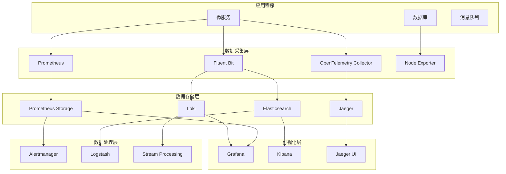

# Kubernetes 可观测性完整指南

## 概述

本指南提供了 Kubernetes 环境下可观测性的全面实践方案，涵盖监控、日志、追踪、告警、事件管理等核心领域，帮助构建生产级的可观测性平台。

## 📊 可观测性三大支柱

### 指标监控 (Metrics)
- **系统指标**: CPU、内存、磁盘、网络等基础设施指标
- **应用指标**: 业务KPI、性能指标、自定义指标
- **Kubernetes指标**: Pod、Node、Service等资源指标

### 日志管理 (Logs)
- **结构化日志**: JSON格式、统一字段标准
- **日志聚合**: 集中收集、存储、检索
- **日志分析**: 实时分析、异常检测、趋势分析

### 分布式追踪 (Traces)
- **请求链路**: 端到端请求跟踪
- **性能分析**: 延迟分析、瓶颈识别
- **依赖关系**: 服务调用关系映射

## 🗂️ 文档索引

| 文档 | 状态 | 描述 | 最后更新 |
|-----|------|------|----------|
| [监控系统架构](./monitoring-architecture.md) | 📝 待补充 | 整体监控架构设计 | - |
| [Prometheus 监控](./prometheus-monitoring.md) | 📝 待补充 | Prometheus 部署与配置 | - |
| [自定义指标](./custom-metrics.md) | 📝 待补充 | 业务指标采集与监控 | - |
| [SLI/SLO 管理](./sli-slo.md) | ✅ 已完成 | 服务等级指标与目标管理 | 2024-06-16 |
| [日志系统](./logging-systems.md) | 📝 待补充 | 日志收集、存储、分析方案 | - |
| [结构化日志](./structured-logging.md) | 📝 待补充 | 日志标准化与最佳实践 | - |
| [日志分析](./log-analysis.md) | 📝 待补充 | 日志分析技术与工具 | - |
| [分布式追踪](./distributed-tracing.md) | 📝 待补充 | Jaeger、Zipkin 分布式追踪 | - |
| [OpenTelemetry](./opentelemetry.md) | ✅ 已完成 | 统一可观测性框架 | 2024-06-16 |
| [性能分析](./performance-analysis.md) | 📝 待补充 | 应用性能分析与优化 | - |
| [智能告警](./alerting.md) | ✅ 已完成 | 告警规则、降噪、自动修复 | 2024-06-16 |
| [事件管理](./incident-management.md) | ✅ 已完成 | 事件响应与根因分析 | 2024-06-16 |
| [值班管理](./on-call-management.md) | 📝 待补充 | 值班轮换与响应流程 | - |
| [仪表板设计](./dashboards.md) | ✅ 已完成 | Grafana 仪表板最佳实践 | 2024-06-16 |
| [业务仪表板](./business-dashboards.md) | 📝 待补充 | 面向业务的监控视图 | - |
| [运维仪表板](./ops-dashboards.md) | 📝 待补充 | 面向运维的技术视图 | - |
| [异常检测](./anomaly-detection.md) | 📝 待补充 | 基于AI的异常检测 | - |
| [预测分析](./predictive-analytics.md) | 📝 待补充 | 容量规划与趋势预测 | - |
| [自动化运维](./automated-operations.md) | 📝 待补充 | 基于可观测性的自动化 | - |

## 🚀 快速开始

### 1. 基础监控部署

```bash
# 部署 Prometheus Operator
kubectl apply -f https://github.com/prometheus-operator/prometheus-operator/releases/latest/download/bundle.yaml

# 部署 Grafana
helm repo add grafana https://grafana.github.io/helm-charts
helm install grafana grafana/grafana

# 部署 Node Exporter
kubectl apply -f monitoring/node-exporter-daemonset.yaml
```

### 2. 日志系统部署

```bash
# 部署 Loki
helm repo add grafana https://grafana.github.io/helm-charts
helm install loki grafana/loki-stack

# 部署 Fluent Bit
kubectl apply -f logging/fluent-bit-daemonset.yaml
```

### 3. 追踪系统部署

```bash
# 部署 Jaeger
kubectl apply -f https://github.com/jaegertracing/jaeger-operator/releases/latest/download/jaeger-operator.yaml

# 部署 OpenTelemetry Collector
kubectl apply -f tracing/otel-collector.yaml
```

## 🏗️ 架构组件

### 核心组件



### 技术栈选择

| 组件类型 | 推荐技术 | 备选方案 | 适用场景 |
|---------|----------|----------|----------|
| **指标监控** | Prometheus + Grafana | DataDog, New Relic | 开源优先、成本敏感 |
| **日志管理** | Loki + Promtail | ELK Stack, Splunk | 与 Prometheus 生态集成 |
| **分布式追踪** | Jaeger + OpenTelemetry | Zipkin, AWS X-Ray | 云原生环境 |
| **告警管理** | Alertmanager + PagerDuty | OpsGenie, VictorOps | 多渠道通知需求 |
| **事件管理** | PagerDuty + Slack | ServiceNow, Jira | 协作型事件响应 |

## 📈 监控策略

### 分层监控模型

```yaml
monitoring_layers:
  infrastructure:
    metrics:
      - cpu_usage_percent
      - memory_usage_percent
      - disk_usage_percent
      - network_io_bytes
    tools: [Prometheus, Node Exporter, cAdvisor]
    
  platform:
    metrics:
      - kubernetes_api_latency
      - etcd_performance
      - container_restart_count
      - pod_scheduling_latency
    tools: [kube-state-metrics, Prometheus]
    
  application:
    metrics:
      - request_rate
      - error_rate
      - response_time
      - business_kpi
    tools: [Application metrics, Custom exporters]
    
  business:
    metrics:
      - user_conversion_rate
      - revenue_per_minute
      - active_user_count
      - feature_adoption_rate
    tools: [Business analytics, Custom dashboards]
```

### 关键指标定义

#### 黄金信号 (Golden Signals)
- **延迟 (Latency)**: 请求响应时间
- **流量 (Traffic)**: 系统处理的请求量
- **错误 (Errors)**: 失败请求的比率
- **饱和度 (Saturation)**: 系统资源利用率

#### RED 方法
- **Rate**: 每秒请求数
- **Errors**: 错误率
- **Duration**: 响应时间分布

#### USE 方法
- **Utilization**: 资源利用率
- **Saturation**: 资源饱和度
- **Errors**: 错误计数

## 🎯 SLI/SLO 框架

### 服务等级指标 (SLI)

```yaml
sli_examples:
  availability:
    definition: "成功请求 / 总请求"
    measurement: "HTTP 状态码 2xx, 3xx 的比例"
    
  latency:
    definition: "请求响应时间的百分位数"
    measurement: "P95 响应时间 < 100ms"
    
  throughput:
    definition: "系统处理能力"
    measurement: "每秒处理请求数"
    
  quality:
    definition: "输出正确性"
    measurement: "业务逻辑正确的请求比例"
```

### 服务等级目标 (SLO)

```yaml
slo_examples:
  api_service:
    availability: "99.9% (monthly)"
    latency: "95% of requests < 100ms"
    
  database:
    availability: "99.95% (monthly)"
    latency: "99% of queries < 50ms"
    
  payment_service:
    availability: "99.99% (monthly)"
    success_rate: "99.9% payment success"
```

## 🔧 配置示例

### Prometheus 配置

```yaml
global:
  scrape_interval: 15s
  evaluation_interval: 15s

rule_files:
  - "alerts/*.yml"

scrape_configs:
  - job_name: 'kubernetes-apiservers'
    kubernetes_sd_configs:
    - role: endpoints
    scheme: https
    tls_config:
      ca_file: /var/run/secrets/kubernetes.io/serviceaccount/ca.crt
    bearer_token_file: /var/run/secrets/kubernetes.io/serviceaccount/token
    
  - job_name: 'kubernetes-nodes'
    kubernetes_sd_configs:
    - role: node
    relabel_configs:
    - action: labelmap
      regex: __meta_kubernetes_node_label_(.+)
```

### Grafana 仪表板

```json
{
  "dashboard": {
    "title": "Kubernetes Cluster Overview",
    "panels": [
      {
        "title": "CPU Usage",
        "type": "graph",
        "targets": [
          {
            "expr": "100 - (avg by (instance) (rate(node_cpu_seconds_total{mode=\"idle\"}[5m])) * 100)"
          }
        ]
      }
    ]
  }
}
```

## 🚨 告警配置

### 基础告警规则

```yaml
groups:
  - name: kubernetes.rules
    rules:
    - alert: NodeDown
      expr: up{job="node-exporter"} == 0
      for: 1m
      labels:
        severity: critical
      annotations:
        summary: "Node {{ $labels.instance }} is down"
        
    - alert: HighCPUUsage
      expr: 100 - (avg by (instance) (rate(node_cpu_seconds_total{mode="idle"}[5m])) * 100) > 80
      for: 5m
      labels:
        severity: warning
      annotations:
        summary: "High CPU usage on {{ $labels.instance }}"
```

### Alertmanager 配置

```yaml
global:
  smtp_smarthost: 'localhost:587'
  smtp_from: 'alerts@company.com'

route:
  group_by: ['alertname']
  group_wait: 10s
  group_interval: 10s
  repeat_interval: 1h
  receiver: 'web.hook'

receivers:
- name: 'web.hook'
  slack_configs:
  - api_url: 'YOUR_SLACK_WEBHOOK_URL'
    channel: '#alerts'
```

## 📚 最佳实践

### 1. 监控设计原则
- **用户体验为中心**: 监控用户可感知的服务质量
- **分层监控**: 从基础设施到业务层面的全栈监控
- **主动监控**: 合成监控和健康检查
- **可操作的告警**: 每个告警都应该有明确的应对行动

### 2. 数据管理策略
- **数据保留策略**: 根据数据重要性设定不同保留期
- **存储优化**: 使用数据压缩和分层存储
- **采样策略**: 平衡数据完整性和存储成本
- **数据安全**: 敏感数据脱敏和访问控制

### 3. 性能优化
- **查询优化**: 使用高效的 PromQL 查询
- **标签策略**: 合理设计标签避免高基数
- **资源规划**: 根据数据量规划存储和计算资源
- **网络优化**: 减少数据传输开销

### 4. 运维自动化
- **自愈能力**: 基于监控数据的自动修复
- **弹性伸缩**: 基于指标的自动扩缩容
- **预测性维护**: 趋势分析和容量规划
- **混沌工程**: 主动故障注入和恢复验证

## 🔄 持续改进

### 监控成熟度模型

1. **反应式** (Reactive): 问题发生后响应
2. **主动式** (Proactive): 预防问题发生
3. **预测式** (Predictive): 基于趋势预测问题
4. **自适应** (Adaptive): 自动调整和优化

### 评估指标

- **MTTD** (Mean Time To Detection): 平均检测时间
- **MTTR** (Mean Time To Resolution): 平均恢复时间
- **Alert Fatigue**: 告警疲劳度
- **Coverage**: 监控覆盖率
- **Accuracy**: 监控准确性

## 🤝 贡献指南

### 文档贡献
1. Fork 项目仓库
2. 创建特性分支
3. 提交文档更新
4. 创建 Pull Request

### 内容标准
- 使用 Markdown 格式
- 包含实际可用的配置示例
- 提供清晰的架构图
- 遵循既定的文档结构

## 📞 支持与反馈

- **Issue 跟踪**: [GitHub Issues](https://github.com/your-org/kubernetes-knowledge/issues)
- **讨论社区**: [GitHub Discussions](https://github.com/your-org/kubernetes-knowledge/discussions)
- **技术支持**: support@company.com

## 📄 许可证

本文档采用 [MIT License](LICENSE) 开源协议。

---

**最后更新**: 2024年6月16日  
**维护团队**: SRE Team & Platform Engineering Team
