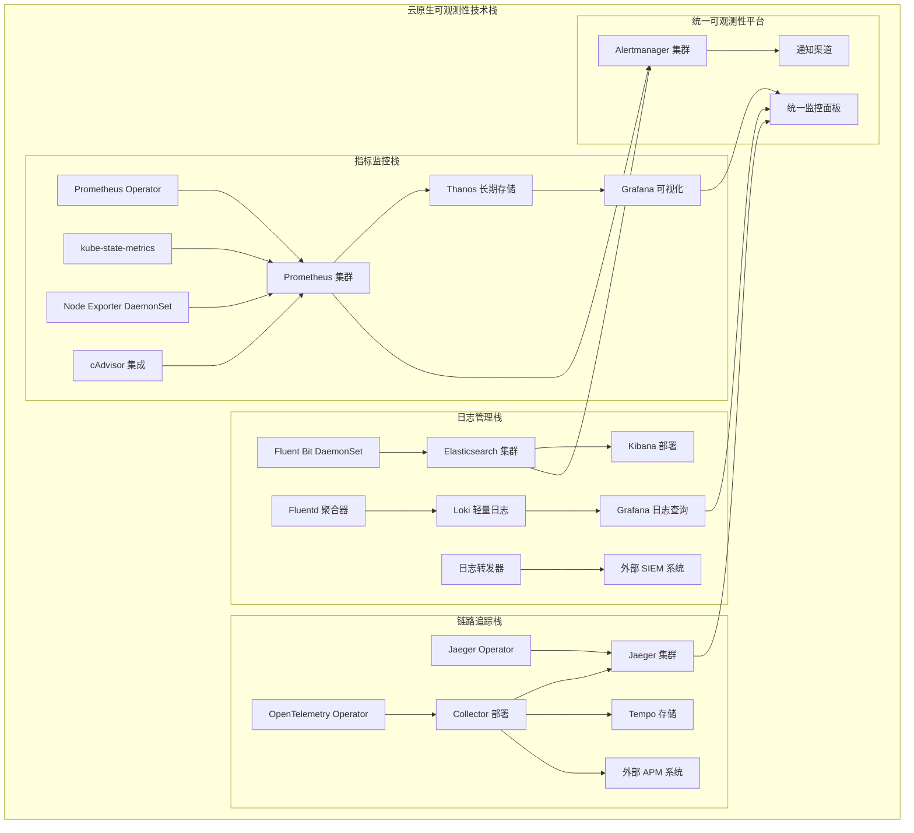
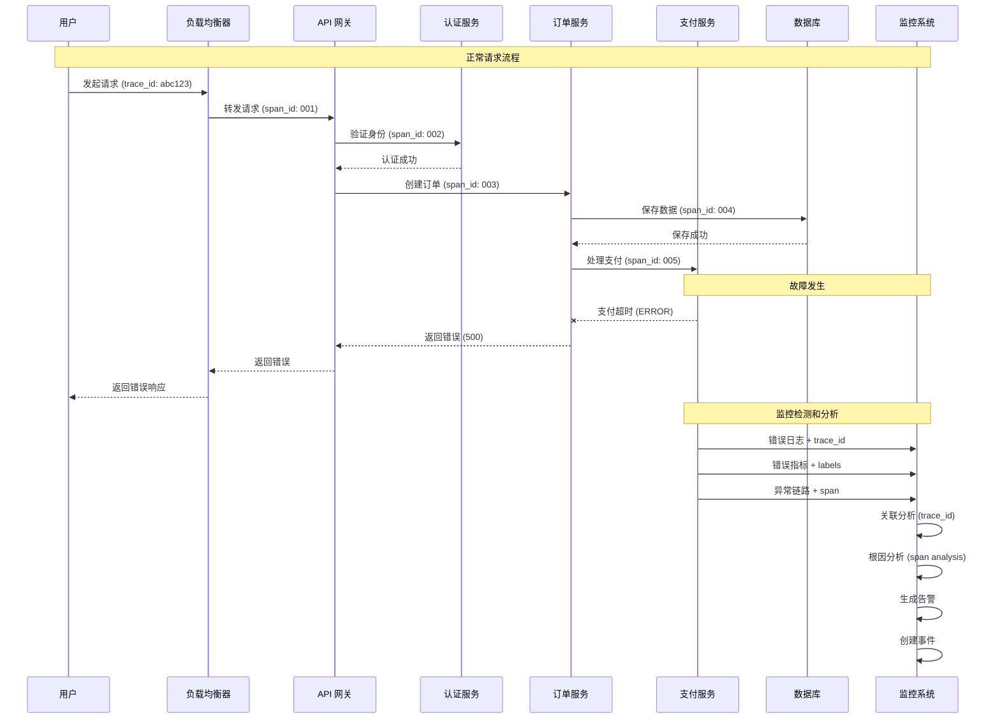
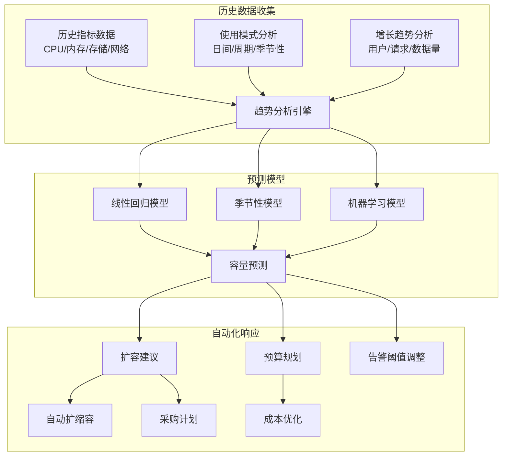
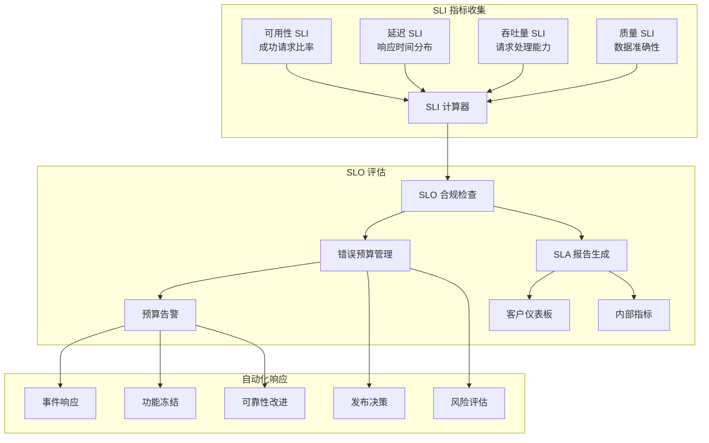

# Kubernetes 可观测性

## 概述

可观测性（Observability）是指通过系统的外部输出来推断系统内部状态的能力。在 Kubernetes 这样的复杂分布式系统中，可观测性是确保系统可靠性、性能和安全性的关键基础设施能力。

### 可观测性的核心价值

**业务价值**：
- **提升用户体验**：快速发现和解决影响用户的问题
- **降低运营成本**：减少系统停机时间和业务损失
- **提高开发效率**：快速定位和修复问题
- **支持数据驱动决策**：基于真实数据进行业务优化

**技术价值**：
- **实时系统洞察**：全面了解系统运行状态
- **主动问题发现**：在用户感知前发现潜在问题
- **性能优化指导**：识别瓶颈和优化机会
- **容量规划支持**：基于使用模式进行资源规划

### 设计哲学

- **统一可观测性**：指标、日志、链路追踪的统一视图
- **数据驱动运维**：基于数据而非经验进行决策
- **自动化响应**：从被动运维转向主动和自动化运维
- **持续改进**：通过观测数据持续优化系统

## 可观测性三大支柱

### 指标（Metrics）
数值型的时间序列数据，用于量化系统性能和健康状态

**特点**：
- **高效存储**：占用存储空间小，查询速度快
- **易于聚合**：支持统计分析和趋势分析
- **告警友好**：便于设置阈值告警
- **长期保存**：适合长期趋势分析

**典型应用**：
- 系统资源使用率监控
- 应用性能指标追踪
- 业务 KPI 监控
- SLA/SLO 合规性检查

### 日志（Logs）
系统运行时产生的离散事件记录，包含详细的上下文信息

**特点**：
- **信息丰富**：包含详细的事件上下文
- **结构灵活**：支持结构化和非结构化数据
- **查询复杂**：支持复杂的文本搜索和分析
- **存储成本高**：需要大量存储空间

**典型应用**：
- 应用错误调试
- 安全事件分析
- 审计合规检查
- 用户行为分析

### 链路追踪（Traces）
分布式系统中请求的完整调用链路和时序信息

**特点**：
- **端到端视图**：完整的请求处理路径
- **性能分析**：详细的性能瓶颈定位
- **依赖关系**：清晰的服务依赖关系
- **采样机制**：通过采样控制数据量

**典型应用**：
- 分布式系统性能分析
- 服务依赖关系梳理
- 请求失败根因分析
- 系统优化指导

## 可观测性架构

### 完整架构视图

```mermaid
graph TB
    subgraph "数据源层 (Data Sources)"
        subgraph "基础设施"
            NODES[节点资源]
            NETWORK[网络设备]
            STORAGE[存储系统]
            LOAD_BALANCERS[负载均衡器]
        end
        
        subgraph "Kubernetes 平台"
            API_SERVER[API Server]
            ETCD[etcd]
            SCHEDULER[Scheduler]
            CONTROLLER_MANAGER[Controller Manager]
            KUBELET[kubelet]
            KUBE_PROXY[kube-proxy]
        end
        
        subgraph "应用层"
            MICROSERVICES[微服务应用]
            DATABASES[数据库]
            MESSAGE_QUEUES[消息队列]
            CACHES[缓存系统]
            WEB_APPS[Web 应用]
            BATCH_JOBS[批处理任务]
        end
    end
    
    subgraph "数据收集层 (Collection Layer)"
        subgraph "指标收集"
            PROMETHEUS[Prometheus]
            NODE_EXPORTER[Node Exporter]
            KUBE_STATE_METRICS[kube-state-metrics]
            CADVISOR[cAdvisor]
            CUSTOM_EXPORTERS[自定义 Exporters]
        end
        
        subgraph "日志收集"
            FLUENTD[Fluentd]
            FLUENT_BIT[Fluent Bit]
            FILEBEAT[Filebeat]
            LOGSTASH[Logstash]
            VECTOR[Vector]
        end
        
        subgraph "链路收集"
            JAEGER_AGENT[Jaeger Agent]
            OTEL_COLLECTOR[OpenTelemetry Collector]
            ZIPKIN_COLLECTOR[Zipkin Collector]
            CUSTOM_TRACERS[自定义 Tracers]
        end
    end
    
    subgraph "数据存储层 (Storage Layer)"
        subgraph "时序数据库"
            PROMETHEUS_STORAGE[Prometheus TSDB]
            THANOS[Thanos]
            CORTEX[Cortex]
            INFLUXDB[InfluxDB]
            M3DB[M3DB]
        end
        
        subgraph "日志存储"
            ELASTICSEARCH[Elasticsearch]
            LOKI[Loki]
            CLICKHOUSE[ClickHouse]
            SPLUNK[Splunk]
        end
        
        subgraph "链路存储"
            JAEGER_STORAGE[Jaeger Storage]
            ZIPKIN_STORAGE[Zipkin Storage]
            TEMPO[Tempo]
            X_RAY[AWS X-Ray]
        end
    end
    
    subgraph "数据分析层 (Analytics Layer)"
        subgraph "查询引擎"
            PROMQL[PromQL]
            LOGQL[LogQL]
            LUCENE[Lucene Query]
            SQL[SQL Query]
            GRAPHQL[GraphQL]
        end
        
        subgraph "智能分析"
            STATISTICAL_ANALYSIS[统计分析]
            ANOMALY_DETECTION[异常检测]
            PATTERN_RECOGNITION[模式识别]
            MACHINE_LEARNING[机器学习]
            FORECASTING[预测分析]
        end
        
        subgraph "关联分析"
            METRIC_LOG_CORRELATION[指标日志关联]
            TRACE_LOG_CORRELATION[链路日志关联]
            CROSS_SERVICE_ANALYSIS[跨服务分析]
            ROOT_CAUSE_ANALYSIS[根因分析]
        end
    end
    
    subgraph "可视化和告警层 (Visualization & Alerting)"
        subgraph "监控面板"
            GRAFANA[Grafana]
            KIBANA[Kibana]
            JAEGER_UI[Jaeger UI]
            CUSTOM_DASHBOARDS[自定义面板]
        end
        
        subgraph "告警系统"
            ALERTMANAGER[Alertmanager]
            ELASTALERT[ElastAlert]
            CUSTOM_ALERTING[自定义告警]
            INCIDENT_MANAGEMENT[事件管理]
        end
        
        subgraph "通知和响应"
            EMAIL[邮件通知]
            SLACK[Slack]
            PAGERDUTY[PagerDuty]
            WEBHOOK[Webhook]
            AUTO_REMEDIATION[自动修复]
        end
    end
    
    %% 数据流连接
    NODES --> NODE_EXPORTER
    MICROSERVICES --> PROMETHEUS
    WEB_APPS --> FLUENTD
    API_SERVER --> JAEGER_AGENT
    
    PROMETHEUS --> PROMETHEUS_STORAGE
    FLUENTD --> ELASTICSEARCH
    JAEGER_AGENT --> JAEGER_STORAGE
    
    PROMETHEUS_STORAGE --> PROMQL
    ELASTICSEARCH --> LUCENE
    JAEGER_STORAGE --> JAEGER_UI
    
    PROMQL --> GRAFANA
    LUCENE --> KIBANA
    GRAFANA --> ALERTMANAGER
    
    ALERTMANAGER --> EMAIL
    ALERTMANAGER --> AUTO_REMEDIATION
    
    %% 样式定义
    classDef sourceLayer fill:#e3f2fd,stroke:#1976d2,stroke-width:2px
    classDef collectionLayer fill:#f3e5f5,stroke:#7b1fa2,stroke-width:2px
    classDef storageLayer fill:#fff3e0,stroke:#f57c00,stroke-width:2px
    classDef analyticsLayer fill:#fce4ec,stroke:#c2185b,stroke-width:2px
    classDef visualizationLayer fill:#f1f8e9,stroke:#558b2f,stroke-width:2px
    
    class NODES,NETWORK,API_SERVER,MICROSERVICES,WEB_APPS sourceLayer
    class PROMETHEUS,FLUENTD,JAEGER_AGENT,NODE_EXPORTER,OTEL_COLLECTOR collectionLayer
    class PROMETHEUS_STORAGE,ELASTICSEARCH,JAEGER_STORAGE,THANOS storageLayer
    class PROMQL,STATISTICAL_ANALYSIS,ANOMALY_DETECTION,ROOT_CAUSE_ANALYSIS analyticsLayer
    class GRAFANA,KIBANA,ALERTMANAGER,EMAIL,AUTO_REMEDIATION visualizationLayer
```



### 技术栈架构图



## 可观测性能力矩阵

| 观测维度 | 数据类型 | 收集方式 | 存储方案 | 查询能力 | 告警配置 | 详细文档 |
|---------|----------|----------|----------|----------|----------|----------|
| **基础设施层** |
| 节点资源监控 | 指标 | Node Exporter 拉取 | Prometheus TSDB | PromQL | 阈值告警 | [节点监控](./metrics.md#node-monitoring) |
| 网络监控 | 指标/日志 | SNMP/Syslog | InfluxDB/Elasticsearch | SQL/Lucene | 复合告警 | [网络监控](./metrics.md#network-monitoring) |
| 存储监控 | 指标/日志 | 专用 Exporter | Prometheus/Loki | PromQL/LogQL | 容量告警 | [存储监控](./metrics.md#storage-monitoring) |
| **Kubernetes 平台层** |
| 集群组件监控 | 指标/日志 | 内置指标端点 | Prometheus/Elasticsearch | PromQL/Lucene | 服务告警 | [集群监控](./metrics.md#cluster-monitoring) |
| 资源对象监控 | 指标 | kube-state-metrics | Prometheus | PromQL | 状态告警 | [资源监控](./metrics.md#resource-monitoring) |
| 容器监控 | 指标 | cAdvisor | Prometheus | PromQL | 性能告警 | [容器监控](./metrics.md#container-monitoring) |
| **应用服务层** |
| 应用性能监控 | 指标/链路 | 自定义埋点 | Prometheus/Jaeger | PromQL/TraceQL | APM 告警 | [应用监控](./metrics.md#application-monitoring) |
| 微服务链路追踪 | 链路 | OpenTelemetry | Jaeger/Tempo | TraceQL | 延迟告警 | [链路追踪](./tracing.md) |
| 应用日志分析 | 日志 | Fluentd/Filebeat | Elasticsearch/Loki | Lucene/LogQL | 异常告警 | [日志分析](./logging.md) |
| **业务层** |
| 业务指标监控 | 指标 | 业务埋点 | Prometheus/InfluxDB | PromQL/SQL | 业务告警 | [业务监控](./metrics.md#business-monitoring) |
| 用户体验监控 | 指标/链路 | RUM/Synthetic | 专用 APM | 自定义查询 | UX 告警 | [用户体验监控](./metrics.md#user-experience) |
| 安全事件监控 | 日志/指标 | 安全代理 | SIEM 系统 | 威胁查询 | 安全告警 | [安全监控](./security-monitoring.md) |

## 关键观测场景

### 性能监控

#### 黄金信号监控

```mermaid
graph TB
    subgraph "四大黄金信号"
        LATENCY[延迟 (Latency)<br/>请求处理时间]
        TRAFFIC[流量 (Traffic)<br/>系统负载量]
        ERRORS[错误 (Errors)<br/>失败请求率]
        SATURATION[饱和度 (Saturation)<br/>资源利用率]
        
        LATENCY --> SLI_LATENCY[延迟 SLI<br/>95分位 < 100ms]
        TRAFFIC --> SLI_TRAFFIC[流量 SLI<br/>RPS 处理能力]
        ERRORS --> SLI_ERRORS[错误率 SLI<br/>错误率 < 0.1%]
        SATURATION --> SLI_SATURATION[饱和度 SLI<br/>CPU < 80%]
    end
    
    subgraph "SLO 目标"
        SLI_LATENCY --> SLO_AVAILABILITY[可用性 SLO<br/>99.9% 正常响应]
        SLI_TRAFFIC --> SLO_PERFORMANCE[性能 SLO<br/>处理能力保证]
        SLI_ERRORS --> SLO_RELIABILITY[可靠性 SLO<br/>错误率控制]
        SLI_SATURATION --> SLO_CAPACITY[容量 SLO<br/>资源充足保证]
    end
    
    subgraph "监控实现"
        SLO_AVAILABILITY --> PROMETHEUS_RULES[Prometheus 规则]
        SLO_PERFORMANCE --> GRAFANA_DASHBOARD[Grafana 面板]
        SLO_RELIABILITY --> ALERTMANAGER[告警规则]
        SLO_CAPACITY --> ERROR_BUDGET[错误预算跟踪]
    end
```

#### 性能监控配置示例

```yaml
# 黄金信号监控配置
golden_signals_monitoring:
  latency:
    description: "请求延迟监控"
    metrics:
      - name: "http_request_duration_seconds"
        labels: ["method", "status", "handler"]
        percentiles: [0.5, 0.95, 0.99]
    slo_target: "95th percentile < 100ms"
    alert_rules:
      - name: "HighLatency"
        expr: |
          histogram_quantile(0.95, 
            sum(rate(http_request_duration_seconds_bucket[5m])) by (le)
          ) > 0.1
        for: "2m"
        severity: "warning"
  
  traffic:
    description: "流量监控"
    metrics:
      - name: "http_requests_total"
        labels: ["method", "status", "handler"]
    slo_target: "处理 1000 RPS"
    alert_rules:
      - name: "TrafficSpike"
        expr: "rate(http_requests_total[5m]) > 1000"
        for: "1m"
        severity: "info"
  
  errors:
    description: "错误率监控"
    metrics:
      - name: "http_requests_total"
        labels: ["method", "status", "handler"]
    slo_target: "错误率 < 0.1%"
    alert_rules:
      - name: "HighErrorRate"
        expr: |
          sum(rate(http_requests_total{status=~"5.."}[5m])) /
          sum(rate(http_requests_total[5m])) > 0.001
        for: "1m"
        severity: "critical"
  
  saturation:
    description: "资源饱和度监控"
    metrics:
      - name: "node_cpu_utilization"
      - name: "node_memory_utilization"
      - name: "node_disk_utilization"
    slo_target: "资源利用率 < 80%"
    alert_rules:
      - name: "HighResourceUsage"
        expr: |
          (1 - avg(rate(node_cpu_seconds_total{mode="idle"}[5m]))) * 100 > 80 OR
          (1 - node_memory_MemAvailable_bytes / node_memory_MemTotal_bytes) * 100 > 85
        for: "5m"
        severity: "warning"
```

### 故障检测和根因分析

#### 分布式故障追踪流程



#### 根因分析配置

```yaml
# 根因分析配置
root_cause_analysis:
  correlation_rules:
    - name: "service_dependency_failure"
      description: "服务依赖故障关联"
      conditions:
        - "error_rate{service='payment'} > 0.05"
        - "latency{service='order'} > 1s"
      correlation_window: "5m"
      confidence_threshold: 0.8
      
    - name: "infrastructure_impact"
      description: "基础设施影响分析"
      conditions:
        - "node_memory_utilization > 90"
        - "pod_restart_count > 3"
      correlation_window: "10m"
      confidence_threshold: 0.9

  trace_analysis:
    failure_patterns:
      - pattern: "timeout_cascade"
        description: "超时级联故障"
        detection_rules:
          - "span.duration > service.slo.timeout"
          - "span.status = 'timeout'"
          - "dependent_span.count > 1"
        
      - pattern: "circuit_breaker_open"
        description: "熔断器开启"
        detection_rules:
          - "span.tags.circuit_breaker = 'open'"
          - "error_rate > 0.5"
          
      - pattern: "resource_exhaustion"
        description: "资源耗尽"
        detection_rules:
          - "span.tags.error_type = 'resource_exhaustion'"
          - "node.cpu_utilization > 95 OR node.memory_utilization > 95"

  automated_response:
    actions:
      - trigger: "timeout_cascade"
        actions:
          - "scale_up_dependent_services"
          - "enable_circuit_breaker"
          - "notify_on_call_engineer"
          
      - trigger: "resource_exhaustion"
        actions:
          - "horizontal_pod_autoscale"
          - "node_autoscale"
          - "throttle_non_critical_requests"
```

### 容量规划和预测

#### 容量趋势分析



#### 容量预测查询示例

```promql
# CPU 容量使用率 7 天趋势
predict_linear(
  avg_over_time(
    (1 - avg(rate(node_cpu_seconds_total{mode="idle"}[5m])) by (instance)) * 100
    [7d:1h]
  )[7d:], 
  7*24*3600  # 预测未来 7 天
)

# 内存使用增长速率
deriv(
  avg_over_time(
    (1 - node_memory_MemAvailable_bytes / node_memory_MemTotal_bytes) * 100
    [7d:1h]
  )[7d:]
)

# 存储容量增长预测
predict_linear(
  increase(
    node_filesystem_size_bytes{mountpoint="/"} - 
    node_filesystem_avail_bytes{mountpoint="/"}
  [7d])
[7d:], 30*24*3600  # 预测未来 30 天
)

# Pod 数量增长趋势
predict_linear(
  avg_over_time(count(kube_pod_info)[7d:1h])[7d:], 
  14*24*3600  # 预测未来 14 天
)

# 请求量增长预测
predict_linear(
  avg_over_time(rate(http_requests_total[5m])[7d:1h])[7d:], 
  7*24*3600
)
```

### SLA/SLO 监控

#### 服务等级协议监控架构



#### SLO 配置示例

```yaml
# SLO 配置示例
slo_configurations:
  api_availability:
    name: "API 服务可用性"
    description: "核心 API 服务的可用性保证"
    sli:
      type: "availability"
      query: |
        sum(rate(http_requests_total{job="api-server",code!~"5.."}[5m])) /
        sum(rate(http_requests_total{job="api-server"}[5m])) * 100
      unit: "percentage"
    slo:
      target: 99.9
      window: "30d"
    error_budget:
      type: "time_based"
      total_budget: "43.2m"  # 30天 * 0.1% = 43.2分钟
      burn_rate_alerts:
        - name: "fast_burn"
          threshold: 14.4  # 消耗 1小时预算需要 14.4倍燃烧率
          window: "1h"
          severity: "critical"
        - name: "slow_burn"
          threshold: 6  # 消耗 6小时预算需要 6倍燃烧率
          window: "6h" 
          severity: "warning"

  api_latency:
    name: "API 响应延迟"
    description: "API 95分位延迟保证"
    sli:
      type: "latency"
      query: |
        histogram_quantile(0.95,
          sum(rate(http_request_duration_seconds_bucket{job="api-server"}[5m])) by (le)
        )
      unit: "seconds"
    slo:
      target: 0.1  # 100ms
      window: "30d"
    error_budget:
      type: "count_based"
      total_requests_query: 'sum(increase(http_requests_total{job="api-server"}[30d]))'
      
  data_freshness:
    name: "数据新鲜度"
    description: "数据更新及时性保证"
    sli:
      type: "freshness"
      query: "time() - max(data_pipeline_last_success_timestamp)"
      unit: "seconds"
    slo:
      target: 300  # 5分钟
      window: "7d"
    error_budget:
      type: "time_based"
      total_budget: "168m"  # 7天 * 1.67% ≈ 168分钟
```

## 文档索引

| 文档类别 | 文档名称 | 复杂度 | 主要内容 | 详细链接 |
|---------|----------|--------|----------|----------|
| **指标监控** |
| [指标监控系统](./metrics.md) | 中级 | Prometheus 生态、指标收集、告警配置 | [详细文档](./metrics.md) |
| [自定义指标](./custom-metrics.md) | 高级 | 应用埋点、业务指标、HPA 集成 | [详细文档](./custom-metrics.md) |
| [SLI/SLO 监控](./sli-slo.md) | 高级 | 服务等级指标、错误预算、合规监控 | [详细文档](./sli-slo.md) |
| **日志管理** |
| [日志管理系统](./logging.md) | 中级 | 日志收集、存储、分析和可视化 | [详细文档](./logging.md) |
| [结构化日志](./structured-logging.md) | 中级 | 日志标准化、解析规则、索引策略 | [详细文档](./structured-logging.md) |
| [日志分析](./log-analysis.md) | 高级 | 日志挖掘、异常检测、模式识别 | [详细文档](./log-analysis.md) |
| **链路追踪** |
| [分布式追踪](./tracing.md) | 高级 | Jaeger/Zipkin 部署、链路分析 | [详细文档](./tracing.md) |
| [OpenTelemetry](./opentelemetry.md) | 高级 | 统一可观测性框架、多信号关联 | [详细文档](./opentelemetry.md) |
| [性能分析](./performance-analysis.md) | 高级 | 瓶颈识别、优化建议、容量规划 | [详细文档](./performance-analysis.md) |
| **告警系统** |
| [智能告警](./alerting.md) | 中级 | 告警规则、通知渠道、降噪策略 | [详细文档](./alerting.md) |
| [事件管理](./incident-management.md) | 高级 | 事件响应流程、根因分析、改进 | [详细文档](./incident-management.md) |
| [值班体系](./on-call-management.md) | 中级 | 值班安排、升级策略、疲劳防护 | [详细文档](./on-call-management.md) |
| **可视化面板** |
| [Grafana 仪表板](./dashboards.md) | 中级 | 面板设计、数据可视化、用户体验 | [详细文档](./dashboards.md) |
| [业务监控面板](./business-dashboards.md) | 中级 | 业务指标、KPI 跟踪、高管报表 | [详细文档](./business-dashboards.md) |
| [运维监控面板](./ops-dashboards.md) | 中级 | 运维视图、故障排查、性能分析 | [详细文档](./ops-dashboards.md) |
| **高级特性** |
| [异常检测](./anomaly-detection.md) | 高级 | 机器学习、统计分析、行为建模 | [详细文档](./anomaly-detection.md) |
| [预测分析](./predictive-analytics.md) | 高级 | 趋势预测、容量预警、智能运维 | [详细文档](./predictive-analytics.md) |
| [自动化运维](./automated-operations.md) | 高级 | 自愈系统、智能扩缩容、故障转移 | [详细文档](./automated-operations.md) |

## 最佳实践要点

### 监控即代码 (Monitoring as Code)
- **版本控制**：监控配置纳入 Git 版本管理
- **自动化部署**：通过 CI/CD 自动部署监控配置
- **环境一致性**：确保不同环境监控配置的一致性
- **代码审查**：监控配置变更需要代码审查

### 分层监控策略
- **基础设施监控**：节点、网络、存储等基础资源
- **平台监控**：Kubernetes 组件和资源对象
- **应用监控**：业务应用的性能和健康状态
- **业务监控**：关键业务指标和用户体验

### 告警优化
- **告警分级**：根据影响程度设置不同级别的告警
- **告警聚合**：避免告警风暴，合理聚合相关告警
- **告警降噪**：通过抑制规则减少重复和无效告警
- **可操作性**：确保每个告警都有明确的处理步骤

### 数据治理
- **数据保留策略**：根据数据类型设置合理的保留期限
- **数据分层存储**：热数据高性能存储，冷数据成本优化存储
- **数据安全**：敏感数据脱敏和访问控制
- **数据备份**：重要监控数据的备份和恢复策略

## 相关概念

本章节的可观测性实践与以下技术知识密切相关：

- **[核心概念](../01-core-concepts/README.md)**：理解被监控的 Kubernetes 资源和对象
- **[系统架构](../02-architecture/README.md)**：了解监控目标的系统架构和组件关系
- **[工作原理](../03-working-principles/README.md)**：理解系统内部机制以设计有效的监控策略
- **[性能优化](../05-optimization/README.md)**：基于监控数据进行系统性能优化
- **[故障排除](../06-troubleshooting/README.md)**：利用可观测性数据进行故障诊断和排除

## 参考资料

### 官方文档
- [Kubernetes 监控架构](https://kubernetes.io/docs/concepts/cluster-administration/monitoring/)
- [Prometheus 监控指南](https://prometheus.io/docs/introduction/overview/)
- [OpenTelemetry 规范](https://opentelemetry.io/docs/)

### 深入学习资源
- [Site Reliability Engineering Book](https://sre.google/books/)
- [Observability Engineering Book](https://www.oreilly.com/library/view/observability-engineering/9781492076438/)
- [CNCF 可观测性白皮书](https://www.cncf.io/reports/)

### 社区最佳实践
- [SRE 工作手册](https://sre.google/workbook/)
- [Prometheus 最佳实践](https://prometheus.io/docs/practices/)
- [Grafana 仪表板设计指南](https://grafana.com/docs/grafana/latest/best-practices/)
