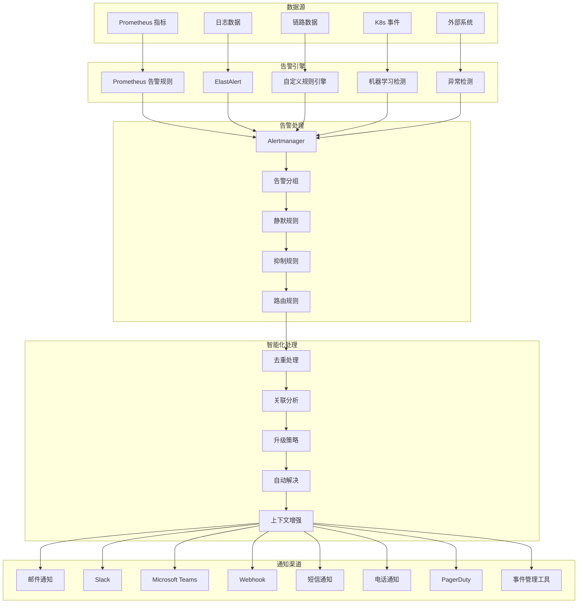

# Kubernetes 智能告警系统

## 概述

智能告警系统是 Kubernetes 可观测性的核心组件，通过智能化的规则引擎、降噪算法和多渠道通知机制，为运维团队提供及时、准确、可操作的告警信息。

### 告警系统架构



## Prometheus 告警规则

### 基础设施告警

```yaml
# infrastructure-alerts.yaml
groups:
  - name: infrastructure.rules
    interval: 30s
    rules:
      # 节点状态告警
      - alert: NodeDown
        expr: up{job="node-exporter"} == 0
        for: 1m
        labels:
          severity: critical
          team: infrastructure
          component: node
        annotations:
          summary: "Node {{ $labels.instance }} is down"
          description: |
            Node {{ $labels.instance }} has been down for more than 1 minute.
            
            Current status: DOWN
            Last seen: {{ $value }}
            
            Immediate actions:
            1. Check node physical/virtual machine status
            2. Verify network connectivity
            3. Check system logs for errors
            4. Consider node replacement if hardware failure
          runbook_url: "https://runbooks.company.com/infrastructure/node-down"
          dashboard_url: "https://grafana.company.com/d/node-overview"
      
      # CPU 使用率告警
      - alert: HighCPUUsage
        expr: |
          (1 - avg by (instance) (rate(node_cpu_seconds_total{mode="idle"}[5m]))) * 100 > 80
        for: 5m
        labels:
          severity: warning
          team: infrastructure
          component: cpu
        annotations:
          summary: "High CPU usage on {{ $labels.instance }}"
          description: |
            CPU usage on node {{ $labels.instance }} is {{ $value | humanizePercentage }}.
            
            Current CPU usage: {{ $value | humanizePercentage }}
            Threshold: 80%
            Duration: > 5 minutes
            
            Investigation steps:
            1. Check top processes consuming CPU
            2. Review CPU usage trends
            3. Consider scaling or optimization
          query: '(1 - avg by (instance) (rate(node_cpu_seconds_total{mode="idle"}[5m]))) * 100'
      
      # 内存使用率告警
      - alert: HighMemoryUsage
        expr: |
          (1 - node_memory_MemAvailable_bytes / node_memory_MemTotal_bytes) * 100 > 85
        for: 3m
        labels:
          severity: warning
          team: infrastructure
          component: memory
        annotations:
          summary: "High memory usage on {{ $labels.instance }}"
          description: |
            Memory usage on node {{ $labels.instance }} is {{ $value | humanizePercentage }}.
            
            Available memory: {{ with query "node_memory_MemAvailable_bytes{instance='$labels.instance'}" }}{{ . | first | value | humanizeBytes }}{{ end }}
            Total memory: {{ with query "node_memory_MemTotal_bytes{instance='$labels.instance'}" }}{{ . | first | value | humanizeBytes }}{{ end }}
            
            Recommended actions:
            1. Identify memory-intensive processes
            2. Check for memory leaks
            3. Consider adding more memory or optimization
      
      # 磁盘空间告警
      - alert: HighDiskUsage
        expr: |
          (1 - node_filesystem_avail_bytes{fstype!="tmpfs"} / node_filesystem_size_bytes) * 100 > 85
        for: 1m
        labels:
          severity: warning
          team: infrastructure
          component: disk
        annotations:
          summary: "High disk usage on {{ $labels.instance }}:{{ $labels.mountpoint }}"
          description: |
            Disk usage on {{ $labels.instance }}:{{ $labels.mountpoint }} is {{ $value | humanizePercentage }}.
            
            Available space: {{ with query "node_filesystem_avail_bytes{instance='$labels.instance',mountpoint='$labels.mountpoint'}" }}{{ . | first | value | humanizeBytes }}{{ end }}
            Total space: {{ with query "node_filesystem_size_bytes{instance='$labels.instance',mountpoint='$labels.mountpoint'}" }}{{ . | first | value | humanizeBytes }}{{ end }}
            
            Cleanup recommendations:
            1. Remove old log files
            2. Clean temporary files
            3. Archive or compress large files
            4. Consider storage expansion
      
      # 磁盘 I/O 告警
      - alert: HighDiskIOWait
        expr: rate(node_cpu_seconds_total{mode="iowait"}[5m]) * 100 > 20
        for: 5m
        labels:
          severity: warning
          team: infrastructure
          component: disk
        annotations:
          summary: "High disk I/O wait on {{ $labels.instance }}"
          description: |
            I/O wait time on {{ $labels.instance }} is {{ $value | humanizePercentage }}.
            This indicates disk performance issues.
            
            Investigation steps:
            1. Check disk utilization and queue depth
            2. Identify I/O intensive processes
            3. Consider storage optimization or upgrade
      
      # 网络错误告警
      - alert: HighNetworkErrors
        expr: |
          rate(node_network_receive_errs_total[5m]) + rate(node_network_transmit_errs_total[5m]) > 10
        for: 2m
        labels:
          severity: warning
          team: infrastructure
          component: network
        annotations:
          summary: "High network errors on {{ $labels.instance }}"
          description: |
            Network interface {{ $labels.device }} on {{ $labels.instance }} is experiencing high error rates.
            
            Error rate: {{ $value }} errors/second
            
            Troubleshooting steps:
            1. Check network cable connections
            2. Verify network switch health
            3. Review network driver logs
            4. Consider hardware replacement

  # Kubernetes 集群告警
  - name: kubernetes.rules
    interval: 30s
    rules:
      # API Server 告警
      - alert: KubernetesAPIServerDown
        expr: up{job="kubernetes-apiservers"} == 0
        for: 1m
        labels:
          severity: critical
          team: platform
          component: apiserver
        annotations:
          summary: "Kubernetes API server is down"
          description: |
            Kubernetes API server {{ $labels.instance }} is not responding.
            
            Impact: 
            - Cluster management operations will fail
            - kubectl commands will not work
            - New pods cannot be scheduled
            
            Immediate actions:
            1. Check API server pod status
            2. Verify etcd connectivity
            3. Check API server logs
            4. Restart API server if necessary
      
      # etcd 告警
      - alert: EtcdDown
        expr: up{job="etcd"} == 0
        for: 1m
        labels:
          severity: critical
          team: platform
          component: etcd
        annotations:
          summary: "etcd cluster member is down"
          description: |
            etcd cluster member {{ $labels.instance }} is down.
            
            Impact:
            - Potential data loss risk
            - Cluster state inconsistency
            - API server may become unavailable
            
            Critical actions:
            1. Check etcd cluster health immediately
            2. Verify remaining etcd members
            3. Restore from backup if necessary
      
      # 节点资源不足告警
      - alert: KubernetesNodeNotReady
        expr: kube_node_status_condition{condition="Ready",status="true"} == 0
        for: 2m
        labels:
          severity: critical
          team: platform
          component: node
        annotations:
          summary: "Kubernetes node {{ $labels.node }} is not ready"
          description: |
            Node {{ $labels.node }} has been in NotReady state for more than 2 minutes.
            
            Possible causes:
            - kubelet issues
            - Network connectivity problems
            - Resource exhaustion
            - Container runtime problems
            
            Investigation steps:
            1. Check kubelet logs
            2. Verify node resources
            3. Check container runtime status
            4. Review network connectivity
      
      # Pod 重启频繁告警
      - alert: PodCrashLooping
        expr: |
          rate(kube_pod_container_status_restarts_total[15m]) * 60 * 15 > 5
        for: 5m
        labels:
          severity: warning
          team: application
          component: pod
        annotations:
          summary: "Pod {{ $labels.namespace }}/{{ $labels.pod }} is crash looping"
          description: |
            Pod {{ $labels.namespace }}/{{ $labels.pod }} has restarted {{ $value }} times in the last 15 minutes.
            
            Container: {{ $labels.container }}
            Namespace: {{ $labels.namespace }}
            
            Troubleshooting steps:
            1. Check pod logs for errors
            2. Review resource limits and requests
            3. Verify configuration and secrets
            4. Check liveness and readiness probes
          logs_url: "https://grafana.company.com/explore?left=%5B%22now-1h%22,%22now%22,%22Loki%22,%7B%22expr%22:%22%7Bnamespace%3D%5C%22{{ $labels.namespace }}%5C%22,pod%3D%5C%22{{ $labels.pod }}%5C%22%7D%22%7D%5D"
      
      # PVC 空间不足告警
      - alert: PersistentVolumeClaimSpaceLow
        expr: |
          (kubelet_volume_stats_available_bytes / kubelet_volume_stats_capacity_bytes) * 100 < 15
        for: 5m
        labels:
          severity: warning
          team: platform
          component: storage
        annotations:
          summary: "PVC {{ $labels.namespace }}/{{ $labels.persistentvolumeclaim }} is running low on space"
          description: |
            PVC {{ $labels.namespace }}/{{ $labels.persistentvolumeclaim }} has only {{ $value | humanizePercentage }} space remaining.
            
            Available: {{ with query "kubelet_volume_stats_available_bytes{namespace='$labels.namespace',persistentvolumeclaim='$labels.persistentvolumeclaim'}" }}{{ . | first | value | humanizeBytes }}{{ end }}
            Total: {{ with query "kubelet_volume_stats_capacity_bytes{namespace='$labels.namespace',persistentvolumeclaim='$labels.persistentvolumeclaim'}" }}{{ . | first | value | humanizeBytes }}{{ end }}
            
            Actions needed:
            1. Clean up unnecessary files
            2. Expand PVC if possible
            3. Archive old data
            4. Consider storage optimization

  # 应用程序告警
  - name: application.rules
    interval: 30s
    rules:
      # 应用响应时间告警
      - alert: HighResponseTime
        expr: |
          histogram_quantile(0.95, sum(rate(http_request_duration_seconds_bucket[5m])) by (job, le)) > 0.5
        for: 5m
        labels:
          severity: warning
          team: application
          component: latency
        annotations:
          summary: "High response time for {{ $labels.job }}"
          description: |
            95th percentile response time for {{ $labels.job }} is {{ $value }}s.
            
            SLA threshold: 500ms
            Current value: {{ $value | humanizeDuration }}
            
            Performance investigation:
            1. Check application logs for errors
            2. Review database query performance
            3. Monitor resource utilization
            4. Consider scaling or optimization
      
      # 应用错误率告警
      - alert: HighErrorRate
        expr: |
          sum(rate(http_requests_total{status=~"5.."}[5m])) by (job) /
          sum(rate(http_requests_total[5m])) by (job) * 100 > 5
        for: 3m
        labels:
          severity: critical
          team: application
          component: errors
        annotations:
          summary: "High error rate for {{ $labels.job }}"
          description: |
            Error rate for {{ $labels.job }} is {{ $value | humanizePercentage }}.
            
            Error threshold: 5%
            Current rate: {{ $value | humanizePercentage }}
            
            Immediate actions:
            1. Check application logs for error details
            2. Verify dependent services health
            3. Review recent deployments
            4. Consider rollback if necessary
      
      # 应用实例不足告警
      - alert: LowApplicationReplicas
        expr: |
          kube_deployment_status_replicas_available < kube_deployment_spec_replicas * 0.7
        for: 2m
        labels:
          severity: warning
          team: application
          component: availability
        annotations:
          summary: "Low replica count for {{ $labels.namespace }}/{{ $labels.deployment }}"
          description: |
            Deployment {{ $labels.namespace }}/{{ $labels.deployment }} has only {{ $value }} available replicas.
            
            Expected: {{ with query "kube_deployment_spec_replicas{namespace='$labels.namespace',deployment='$labels.deployment'}" }}{{ . | first | value }}{{ end }}
            Available: {{ $value }}
            
            Scaling investigation:
            1. Check pod scheduling issues
            2. Verify resource availability
            3. Review node capacity
            4. Check for failed deployments
```

### 告警规则模板

```yaml
# alert-rule-template.yaml
alert_rule_template: |
  - alert: {{ .AlertName }}
    expr: {{ .Expression }}
    for: {{ .Duration | default "1m" }}
    labels:
      severity: {{ .Severity | default "warning" }}
      team: {{ .Team }}
      component: {{ .Component }}
      environment: {{ .Environment | default "production" }}
      service: {{ .Service }}
      {{- range $key, $value := .CustomLabels }}
      {{ $key }}: {{ $value }}
      {{- end }}
    annotations:
      summary: {{ .Summary }}
      description: |
        {{ .Description }}
        
        {{- if .Impact }}
        Impact: {{ .Impact }}
        {{- end }}
        
        {{- if .Troubleshooting }}
        Troubleshooting steps:
        {{- range .Troubleshooting }}
        {{ . }}
        {{- end }}
        {{- end }}
        
        {{- if .RunbookURL }}
        runbook_url: {{ .RunbookURL }}
        {{- end }}
        
        {{- if .DashboardURL }}
        dashboard_url: {{ .DashboardURL }}
        {{- end }}
        
        {{- if .LogsURL }}
        logs_url: {{ .LogsURL }}
        {{- end }}

# 使用模板生成告警规则示例
example_alerts:
  database_connection_high:
    AlertName: "DatabaseConnectionHigh"
    Expression: "sum(database_connections_active) by (instance) > 80"
    Duration: "2m"
    Severity: "warning"
    Team: "database"
    Component: "connection-pool"
    Service: "postgresql"
    Summary: "High database connections on {{ $labels.instance }}"
    Description: |
      Database connection pool usage is {{ $value }} connections.
      This may indicate connection leaks or high load.
    Impact: "Database performance degradation and potential connection exhaustion"
    Troubleshooting:
      - "1. Check for connection leaks in applications"
      - "2. Review long-running queries"
      - "3. Consider increasing connection pool size"
      - "4. Monitor application connection patterns"
    RunbookURL: "https://runbooks.company.com/database/high-connections"
    DashboardURL: "https://grafana.company.com/d/database-overview"
```

## Alertmanager 配置

### 主配置文件

```yaml
# alertmanager.yml
global:
  # SMTP 配置
  smtp_smarthost: 'smtp.company.com:587'
  smtp_from: 'alerts@company.com'
  smtp_auth_username: 'alerts@company.com'
  smtp_auth_password: 'your-password'
  smtp_require_tls: true
  
  # Slack 配置
  slack_api_url: 'https://hooks.slack.com/services/YOUR/SLACK/WEBHOOK'
  
  # 其他全局配置
  resolve_timeout: 5m
  http_config:
    tls_config:
      insecure_skip_verify: false

# 路由配置
route:
  group_by: ['alertname', 'cluster', 'service']
  group_wait: 10s
  group_interval: 10s
  repeat_interval: 1h
  receiver: 'default-receiver'
  
  routes:
    # 严重告警立即通知
    - match:
        severity: critical
      receiver: 'critical-alerts'
      group_wait: 0s
      group_interval: 5s
      repeat_interval: 30m
      continue: true
    
    # 基础设施告警
    - match:
        team: infrastructure
      receiver: 'infrastructure-team'
      group_by: ['alertname', 'instance']
      group_interval: 5m
      repeat_interval: 2h
    
    # 应用程序告警
    - match:
        team: application
      receiver: 'application-team'
      group_by: ['alertname', 'namespace', 'service']
      group_interval: 2m
      repeat_interval: 1h
    
    # 平台告警
    - match:
        team: platform
      receiver: 'platform-team'
      group_by: ['alertname', 'component']
      group_interval: 1m
      repeat_interval: 30m
    
    # 数据库告警
    - match:
        component: database
      receiver: 'database-team'
      group_by: ['alertname', 'instance', 'database']
      group_interval: 30s
      repeat_interval: 15m
    
    # 安全告警
    - match:
        component: security
      receiver: 'security-team'
      group_wait: 0s
      group_interval: 0s
      repeat_interval: 5m
    
    # 业务告警
    - match:
        type: business
      receiver: 'business-team'
      group_by: ['alertname', 'service', 'region']
      group_interval: 5m
      repeat_interval: 4h

# 抑制规则
inhibit_rules:
  # 节点宕机时抑制该节点上的其他告警
  - source_match:
      alertname: 'NodeDown'
    target_match_re:
      instance: '.*'
    equal: ['instance']
  
  # API Server 宕机时抑制 Kubernetes 组件告警
  - source_match:
      alertname: 'KubernetesAPIServerDown'
    target_match_re:
      component: 'kubernetes.*'
    equal: ['cluster']
  
  # 严重错误时抑制警告级别的相关告警
  - source_match:
      severity: 'critical'
    target_match:
      severity: 'warning'
    equal: ['alertname', 'service', 'instance']

# 接收器配置
receivers:
  # 默认接收器
  - name: 'default-receiver'
    slack_configs:
    - channel: '#alerts-default'
      title: '{{ range .Alerts }}{{ .Annotations.summary }}{{ end }}'
      text: |
        {{ range .Alerts }}
        *Alert:* {{ .Annotations.summary }}
        *Description:* {{ .Annotations.description }}
        *Severity:* {{ .Labels.severity }}
        *Team:* {{ .Labels.team }}
        {{ end }}
      send_resolved: true
  
  # 严重告警接收器
  - name: 'critical-alerts'
    email_configs:
    - to: 'oncall@company.com'
      subject: '[CRITICAL] {{ .GroupLabels.alertname }} - {{ .CommonLabels.service }}'
      body: |
        Alert: {{ .GroupLabels.alertname }}
        Severity: CRITICAL
        Service: {{ .CommonLabels.service }}
        Environment: {{ .CommonLabels.environment }}
        
        {{ range .Alerts }}
        Summary: {{ .Annotations.summary }}
        Description: {{ .Annotations.description }}
        Started: {{ .StartsAt }}
        {{ if .Annotations.runbook_url }}Runbook: {{ .Annotations.runbook_url }}{{ end }}
        {{ if .Annotations.dashboard_url }}Dashboard: {{ .Annotations.dashboard_url }}{{ end }}
        {{ end }}
    
    slack_configs:
    - channel: '#alerts-critical'
      title: '🚨 CRITICAL ALERT'
      title_link: '{{ .CommonAnnotations.dashboard_url }}'
      text: |
        {{ range .Alerts }}
        *Alert:* {{ .Annotations.summary }}
        *Service:* {{ .Labels.service }}
        *Environment:* {{ .Labels.environment }}
        *Description:* {{ .Annotations.description }}
        {{ if .Annotations.runbook_url }}*Runbook:* <{{ .Annotations.runbook_url }}|View Runbook>{{ end }}
        {{ end }}
      color: 'danger'
      send_resolved: true
    
    webhook_configs:
    - url: 'https://api.pagerduty.com/generic/2010-04-15/create_event.json'
      http_config:
        tls_config:
          insecure_skip_verify: false
      send_resolved: true
  
  # 基础设施团队
  - name: 'infrastructure-team'
    email_configs:
    - to: 'infrastructure@company.com'
      subject: '[{{ .Status | toUpper }}] Infrastructure Alert - {{ .CommonLabels.alertname }}'
      body: |
        {{ template "email.body" . }}
    
    slack_configs:
    - channel: '#infrastructure-alerts'
      title: '{{ .Status | title }} - Infrastructure Alert'
      text: |
        {{ template "slack.body" . }}
      color: '{{ if eq .Status "firing" }}warning{{ else }}good{{ end }}'
      send_resolved: true
  
  # 应用程序团队
  - name: 'application-team'
    slack_configs:
    - channel: '#app-alerts'
      title: '{{ .Status | title }} - Application Alert'
      text: |
        {{ template "slack.body" . }}
      color: '{{ if eq .Status "firing" }}{{ if eq .CommonLabels.severity "critical" }}danger{{ else }}warning{{ end }}{{ else }}good{{ end }}'
      send_resolved: true
  
  # 平台团队
  - name: 'platform-team'
    email_configs:
    - to: 'platform@company.com'
      subject: '[{{ .Status | toUpper }}] Platform Alert - {{ .CommonLabels.alertname }}'
      body: |
        {{ template "email.body" . }}
    
    slack_configs:
    - channel: '#platform-alerts'
      title: '{{ .Status | title }} - Platform Alert'
      text: |
        {{ template "slack.body" . }}
      send_resolved: true
  
  # 数据库团队
  - name: 'database-team'
    email_configs:
    - to: 'dba@company.com'
      subject: '[{{ .Status | toUpper }}] Database Alert - {{ .CommonLabels.alertname }}'
      body: |
        {{ template "email.body" . }}
    
    slack_configs:
    - channel: '#database-alerts'
      title: '{{ .Status | title }} - Database Alert'
      text: |
        {{ template "slack.body" . }}
      send_resolved: true
  
  # 安全团队
  - name: 'security-team'
    email_configs:
    - to: 'security@company.com'
      subject: '[SECURITY ALERT] {{ .CommonLabels.alertname }}'
      body: |
        SECURITY ALERT DETECTED
        
        {{ range .Alerts }}
        Alert: {{ .Annotations.summary }}
        Description: {{ .Annotations.description }}
        Time: {{ .StartsAt }}
        Severity: {{ .Labels.severity }}
        Source: {{ .Labels.instance }}
        {{ end }}
        
        This requires immediate attention!
    
    slack_configs:
    - channel: '#security-alerts'
      title: '🔒 SECURITY ALERT'
      text: |
        {{ range .Alerts }}
        *Alert:* {{ .Annotations.summary }}
        *Description:* {{ .Annotations.description }}
        *Source:* {{ .Labels.instance }}
        *Time:* {{ .StartsAt }}
        {{ end }}
      color: 'danger'
      send_resolved: true
  
  # 业务团队
  - name: 'business-team'
    email_configs:
    - to: 'business-ops@company.com'
      subject: '[{{ .Status | toUpper }}] Business Metric Alert - {{ .CommonLabels.alertname }}'
      body: |
        {{ template "email.body" . }}
    
    slack_configs:
    - channel: '#business-alerts'
      title: '📊 Business Alert'
      text: |
        {{ template "slack.body" . }}
      send_resolved: true

# 模板定义
templates:
- '/etc/alertmanager/templates/*.tmpl'
```

### 通知模板

```yaml
# templates/email.tmpl
{{ define "email.body" }}
Alert Details:
=============

{{ range .Alerts }}
Alert Name: {{ .Labels.alertname }}
Severity: {{ .Labels.severity }}
Service: {{ .Labels.service }}{{ if .Labels.instance }}
Instance: {{ .Labels.instance }}{{ end }}{{ if .Labels.namespace }}
Namespace: {{ .Labels.namespace }}{{ end }}

Summary: {{ .Annotations.summary }}

Description:
{{ .Annotations.description }}

Started At: {{ .StartsAt.Format "2006-01-02 15:04:05 UTC" }}{{ if .EndsAt }}
Resolved At: {{ .EndsAt.Format "2006-01-02 15:04:05 UTC" }}{{ end }}

{{ if .Annotations.runbook_url }}Runbook: {{ .Annotations.runbook_url }}{{ end }}
{{ if .Annotations.dashboard_url }}Dashboard: {{ .Annotations.dashboard_url }}{{ end }}
{{ if .Annotations.logs_url }}Logs: {{ .Annotations.logs_url }}{{ end }}

Labels:
{{ range .Labels.SortedPairs }}  {{ .Name }}: {{ .Value }}
{{ end }}

{{ end }}

{{ end }}

{{ define "slack.body" }}
{{ range .Alerts }}
*Alert:* {{ .Annotations.summary }}
*Severity:* {{ .Labels.severity }}{{ if .Labels.service }}
*Service:* {{ .Labels.service }}{{ end }}{{ if .Labels.instance }}
*Instance:* {{ .Labels.instance }}{{ end }}{{ if .Labels.namespace }}
*Namespace:* {{ .Labels.namespace }}{{ end }}

*Description:* {{ .Annotations.description }}

*Started:* {{ .StartsAt.Format "2006-01-02 15:04:05 UTC" }}{{ if .EndsAt }}
*Resolved:* {{ .EndsAt.Format "2006-01-02 15:04:05 UTC" }}{{ end }}

{{ if .Annotations.runbook_url }}*Runbook:* <{{ .Annotations.runbook_url }}|View Runbook>{{ end }}
{{ if .Annotations.dashboard_url }}*Dashboard:* <{{ .Annotations.dashboard_url }}|View Dashboard>{{ end }}
{{ if .Annotations.logs_url }}*Logs:* <{{ .Annotations.logs_url }}|View Logs>{{ end }}

{{ end }}
{{ end }}

{{ define "pagerduty.title" }}
{{ range .Alerts }}{{ .Annotations.summary }}{{ end }}
{{ end }}

{{ define "pagerduty.description" }}
{{ range .Alerts }}
Alert: {{ .Annotations.summary }}
Service: {{ .Labels.service }}
Severity: {{ .Labels.severity }}
Description: {{ .Annotations.description }}
{{ end }}
{{ end }}
```

## 智能告警功能

### 告警降噪

```yaml
# noise-reduction-config.yaml
noise_reduction:
  # 频率限制
  rate_limiting:
    - name: "high_frequency_alerts"
      pattern: ".*"
      max_alerts_per_minute: 10
      window_size: "5m"
      action: "suppress"
      
    - name: "duplicate_alerts"
      pattern: "same_alert_same_instance"
      max_duplicates: 3
      window_size: "1h"
      action: "group"
  
  # 相似告警合并
  alert_clustering:
    - name: "node_resource_alerts"
      cluster_by: ["alertname", "instance"]
      similarity_threshold: 0.8
      merge_window: "10m"
      representative_selection: "first"
      
    - name: "application_errors"
      cluster_by: ["alertname", "service", "namespace"]
      similarity_threshold: 0.9
      merge_window: "5m"
      representative_selection: "highest_severity"
  
  # 时间模式分析
  temporal_analysis:
    - name: "business_hours_suppression"
      suppress_during:
        - days: ["saturday", "sunday"]
          times: ["00:00", "23:59"]
        - days: ["monday", "tuesday", "wednesday", "thursday", "friday"]
          times: ["18:00", "08:00"]
      alert_patterns: ["low_priority_alerts"]
      
    - name: "maintenance_window"
      suppress_during:
        - days: ["sunday"]
          times: ["02:00", "04:00"]
      alert_patterns: ["infrastructure_alerts"]
  
  # 依赖关系分析
  dependency_analysis:
    - name: "cascade_suppression"
      root_cause_patterns:
        - "NodeDown"
        - "APIServerDown"
        - "DatabaseDown"
      dependent_patterns:
        - "PodCrashLooping"
        - "HighLatency"
        - "ServiceUnavailable"
      suppression_window: "30m"

# 机器学习降噪
ml_noise_reduction:
  models:
    - name: "anomaly_detector"
      type: "isolation_forest"
      features:
        - "alert_frequency"
        - "time_of_day"
        - "day_of_week"
        - "alert_duration"
        - "resolution_time"
      training_period: "30d"
      anomaly_threshold: 0.1
      
    - name: "pattern_classifier"
      type: "clustering"
      features:
        - "alert_text_similarity"
        - "label_similarity"
        - "timing_pattern"
      cluster_count: 20
      similarity_threshold: 0.7
```

### 告警关联分析

```yaml
# correlation-analysis.yaml
correlation_analysis:
  # 时间序列关联
  temporal_correlation:
    - name: "infrastructure_app_correlation"
      primary_pattern: "infrastructure_alerts"
      secondary_pattern: "application_alerts"
      time_window: "15m"
      correlation_threshold: 0.8
      action: "create_incident"
      
    - name: "database_app_correlation"
      primary_pattern: "database_alerts"
      secondary_pattern: "application_performance_alerts"
      time_window: "10m"
      correlation_threshold: 0.9
      action: "enhance_context"
  
  # 空间关联（服务/节点）
  spatial_correlation:
    - name: "node_pod_correlation"
      primary_pattern: "node_alerts"
      secondary_pattern: "pod_alerts"
      correlation_key: "instance"
      action: "merge_alerts"
      
    - name: "service_dependency_correlation"
      primary_pattern: "service_alerts"
      secondary_pattern: "dependent_service_alerts"
      correlation_key: "service_dependency_map"
      action: "create_service_incident"
  
  # 业务影响关联
  business_impact_correlation:
    - name: "customer_facing_correlation"
      primary_pattern: "customer_facing_alerts"
      business_metrics:
        - "user_login_failures"
        - "transaction_failures"
        - "page_load_errors"
      correlation_threshold: 0.85
      action: "escalate_priority"
      
    - name: "revenue_impact_correlation"
      primary_pattern: "payment_system_alerts"
      business_metrics:
        - "transaction_volume"
        - "revenue_per_minute"
        - "conversion_rate"
      correlation_threshold: 0.9
      action: "create_business_incident"

# 根因分析
root_cause_analysis:
  analysis_rules:
    - name: "network_root_cause"
      symptoms:
        - "HighLatency"
        - "ConnectionErrors"
        - "TimeoutErrors"
      potential_causes:
        - pattern: "NetworkHardwareFailure"
          weight: 0.8
          evidence: ["NetworkErrors", "PacketLoss"]
        - pattern: "NetworkCongestion"
          weight: 0.6
          evidence: ["HighTraffic", "BandwidthUtilization"]
        - pattern: "DNSIssues"
          weight: 0.4
          evidence: ["DNSResolutionFailure", "HighDNSLatency"]
      
    - name: "resource_exhaustion_root_cause"
      symptoms:
        - "PodEviction"
        - "OOMKilled"
        - "HighMemoryUsage"
      potential_causes:
        - pattern: "MemoryLeak"
          weight: 0.9
          evidence: ["ContinuousMemoryGrowth", "ApplicationErrors"]
        - pattern: "InsufficientResources"
          weight: 0.7
          evidence: ["ResourceRequestsExceedLimits", "NodeResourceExhaustion"]
        - pattern: "ConfigurationError"
          weight: 0.5
          evidence: ["RecentConfigChange", "IncorrectResourceLimits"]
  
  machine_learning_analysis:
    model_type: "decision_tree"
    features:
      - "alert_sequence"
      - "timing_pattern"
      - "affected_components"
      - "error_patterns"
      - "resource_utilization"
    training_data: "historical_incidents"
    confidence_threshold: 0.75
```

### 自动修复

```yaml
# auto-remediation.yaml
auto_remediation:
  # 简单修复动作
  simple_actions:
    - trigger:
        alertname: "PodCrashLooping"
        conditions:
          - "restart_count < 5"
          - "last_restart_time > 5m"
      actions:
        - name: "restart_pod"
          type: "kubernetes"
          config:
            action: "delete_pod"
            namespace: "{{ .Labels.namespace }}"
            pod: "{{ .Labels.pod }}"
        - name: "collect_logs"
          type: "logging"
          config:
            namespace: "{{ .Labels.namespace }}"
            pod: "{{ .Labels.pod }}"
            lines: 1000
      
    - trigger:
        alertname: "HighMemoryUsage"
        conditions:
          - "memory_usage > 90%"
          - "hpa_enabled = true"
      actions:
        - name: "scale_up"
          type: "kubernetes"
          config:
            action: "scale_deployment"
            namespace: "{{ .Labels.namespace }}"
            deployment: "{{ .Labels.deployment }}"
            replicas: "{{ .CurrentReplicas | add 2 }}"
        - name: "monitor_scaling"
          type: "monitoring"
          config:
            duration: "10m"
            metrics: ["memory_usage", "cpu_usage"]
  
  # 复杂修复流程
  complex_workflows:
    - name: "database_connection_recovery"
      trigger:
        alertname: "DatabaseConnectionHigh"
        severity: "critical"
      workflow:
        - step: "analyze_connections"
          action: "query_database"
          config:
            query: "SELECT * FROM pg_stat_activity WHERE state = 'active'"
            timeout: "30s"
        - step: "kill_long_running_queries"
          condition: "query_duration > 5m"
          action: "database_command"
          config:
            command: "SELECT pg_terminate_backend(pid) FROM pg_stat_activity WHERE state = 'active' AND query_start < NOW() - INTERVAL '5 minutes'"
        - step: "restart_connection_pool"
          action: "kubernetes"
          config:
            action: "restart_pods"
            label_selector: "app=pgbouncer"
        - step: "verify_recovery"
          action: "monitoring"
          config:
            check_metrics: ["database_connections_active"]
            expected_value: "< 50"
            timeout: "5m"
    
    - name: "service_recovery_workflow"
      trigger:
        alertname: "ServiceUnavailable"
        severity: "critical"
      workflow:
        - step: "check_pods"
          action: "kubernetes"
          config:
            action: "get_pods"
            namespace: "{{ .Labels.namespace }}"
            label_selector: "app={{ .Labels.service }}"
        - step: "restart_unhealthy_pods"
          condition: "pod_ready = false"
          action: "kubernetes"
          config:
            action: "delete_pods"
            namespace: "{{ .Labels.namespace }}"
            label_selector: "app={{ .Labels.service }}"
            field_selector: "status.phase!=Running"
        - step: "scale_if_needed"
          condition: "available_replicas < desired_replicas"
          action: "kubernetes"
          config:
            action: "scale_deployment"
            namespace: "{{ .Labels.namespace }}"
            deployment: "{{ .Labels.service }}"
            replicas: "{{ .DesiredReplicas }}"
        - step: "health_check"
          action: "http_check"
          config:
            url: "http://{{ .Labels.service }}.{{ .Labels.namespace }}.svc.cluster.local/health"
            expected_status: 200
            timeout: "30s"
        - step: "notify_success"
          action: "notification"
          config:
            message: "Service {{ .Labels.service }} has been automatically recovered"
            channels: ["slack", "email"]

# 修复动作库
remediation_actions:
  kubernetes_actions:
    - name: "restart_pod"
      description: "Delete pod to trigger restart"
      risk_level: "low"
      permissions: ["pods/delete"]
      
    - name: "scale_deployment"
      description: "Scale deployment up or down"
      risk_level: "medium"
      permissions: ["deployments/scale"]
      
    - name: "rollback_deployment"
      description: "Rollback deployment to previous version"
      risk_level: "high"
      permissions: ["deployments/update"]
  
  system_actions:
    - name: "clear_disk_space"
      description: "Clean up temporary files and logs"
      risk_level: "medium"
      script: "/scripts/cleanup-disk.sh"
      
    - name: "restart_service"
      description: "Restart system service"
      risk_level: "high"
      script: "/scripts/restart-service.sh"
  
  network_actions:
    - name: "flush_dns_cache"
      description: "Clear DNS cache"
      risk_level: "low"
      script: "/scripts/flush-dns.sh"
      
    - name: "reset_network_interface"
      description: "Reset network interface"
      risk_level: "high"
      script: "/scripts/reset-network.sh"
```

## 告警测试和验证

### 告警规则测试

```yaml
# alert-testing.yaml
alert_testing:
  # 单元测试
  unit_tests:
    - name: "test_high_cpu_alert"
      rule_group: "infrastructure.rules"
      rule_name: "HighCPUUsage"
      input_series:
        - series: 'node_cpu_seconds_total{instance="node1", mode="idle"}'
          values: '0 0 0 0 0'  # 100% CPU usage (0% idle)
        - series: 'node_cpu_seconds_total{instance="node1", mode="user"}'
          values: '100 200 300 400 500'
      alert_rule: 'HighCPUUsage'
      exp_alerts:
        - exp_labels:
            severity: warning
            instance: node1
            team: infrastructure
            component: cpu
          exp_annotations:
            summary: "High CPU usage on node1"
    
    - name: "test_pod_crash_loop_alert"
      rule_group: "kubernetes.rules"
      rule_name: "PodCrashLooping"
      input_series:
        - series: 'kube_pod_container_status_restarts_total{namespace="default", pod="test-pod", container="app"}'
          values: '0 2 4 6 8 10'  # 10 restarts in 15 minutes
      alert_rule: 'PodCrashLooping'
      exp_alerts:
        - exp_labels:
            severity: warning
            namespace: default
            pod: test-pod
            container: app
            team: application
            component: pod
  
  # 集成测试
  integration_tests:
    - name: "test_alert_routing"
      scenario: "Critical alert routing to multiple channels"
      trigger_alert:
        alertname: "NodeDown"
        labels:
          severity: "critical"
          instance: "node1"
          team: "infrastructure"
      expected_notifications:
        - receiver: "critical-alerts"
          channels: ["email", "slack", "pagerduty"]
          delivery_time: "< 30s"
        - receiver: "infrastructure-team"
          channels: ["email", "slack"]
          delivery_time: "< 60s"
    
    - name: "test_alert_inhibition"
      scenario: "Node down should inhibit pod alerts on same node"
      trigger_alerts:
        - alertname: "NodeDown"
          labels:
            instance: "node1"
        - alertname: "PodCrashLooping"
          labels:
            instance: "node1"
      expected_behavior:
        - alert: "NodeDown"
          status: "firing"
        - alert: "PodCrashLooping"
          status: "inhibited"

# 性能测试
performance_tests:
  load_testing:
    - name: "high_volume_alerts"
      description: "Test system with high alert volume"
      alert_rate: "1000 alerts/minute"
      duration: "10m"
      metrics:
        - "alert_processing_latency"
        - "notification_delivery_time"
        - "system_resource_usage"
      thresholds:
        - metric: "alert_processing_latency"
          threshold: "< 5s"
        - metric: "notification_delivery_time"
          threshold: "< 30s"
    
    - name: "alert_storm_handling"
      description: "Test handling of alert storms"
      scenario: "500 alerts fired simultaneously"
      expected_behavior:
        - "Rate limiting should activate"
        - "Alert grouping should occur"
        - "System should remain responsive"
      recovery_time: "< 2m"

# 故障演练
chaos_testing:
  alert_system_resilience:
    - name: "alertmanager_pod_failure"
      description: "Test alerting when Alertmanager pod fails"
      failure_injection:
        - target: "alertmanager-pod"
          action: "kill_pod"
      expected_behavior:
        - "Alerts continue to be processed by other replicas"
        - "No alert loss during failover"
        - "Recovery within 1 minute"
    
    - name: "prometheus_outage"
      description: "Test behavior during Prometheus outage"
      failure_injection:
        - target: "prometheus"
          action: "stop_service"
          duration: "5m"
      expected_behavior:
        - "Existing alerts continue firing"
        - "New alerts resume after recovery"
        - "No duplicate notifications"
```

### 告警验证工具

```bash
#!/bin/bash
# alert-validation.sh

# 告警规则语法验证
validate_alert_rules() {
    echo "Validating Prometheus alert rules..."
    
    for file in alerts/*.yml; do
        echo "Checking $file..."
        promtool check rules "$file"
        if [ $? -ne 0 ]; then
            echo "❌ Validation failed for $file"
            return 1
        else
            echo "✅ $file is valid"
        fi
    done
}

# Alertmanager 配置验证
validate_alertmanager_config() {
    echo "Validating Alertmanager configuration..."
    
    amtool config show --config.file=alertmanager.yml
    if [ $? -ne 0 ]; then
        echo "❌ Alertmanager configuration is invalid"
        return 1
    else
        echo "✅ Alertmanager configuration is valid"
    fi
}

# 告警通知测试
test_alert_notifications() {
    echo "Testing alert notifications..."
    
    # 发送测试告警
    amtool alert add \
        --alertmanager.url=http://alertmanager:9093 \
        alertname="TestAlert" \
        severity="warning" \
        team="test" \
        summary="This is a test alert" \
        description="Testing alert notification system"
    
    echo "Test alert sent. Check notification channels."
}

# 告警查询测试
test_alert_queries() {
    echo "Testing alert rule queries..."
    
    # 查询当前活跃告警
    active_alerts=$(promtool query instant \
        --server=http://prometheus:9090 \
        'ALERTS{alertstate="firing"}')
    
    echo "Active alerts: $active_alerts"
    
    # 测试特定告警规则
    cpu_usage=$(promtool query instant \
        --server=http://prometheus:9090 \
        '(1 - avg by (instance) (rate(node_cpu_seconds_total{mode="idle"}[5m]))) * 100')
    
    echo "Current CPU usage: $cpu_usage"
}

# 端到端测试
end_to_end_test() {
    echo "Running end-to-end alert test..."
    
    # 1. 触发测试告警
    kubectl run test-pod --image=stress --restart=Never -- stress --cpu 8 --timeout 300s
    
    # 2. 等待告警触发
    sleep 120
    
    # 3. 检查告警状态
    alerts=$(curl -s http://alertmanager:9093/api/v1/alerts | jq '.data[] | select(.labels.alertname=="HighCPUUsage")')
    
    if [ -n "$alerts" ]; then
        echo "✅ CPU alert triggered successfully"
    else
        echo "❌ CPU alert was not triggered"
        return 1
    fi
    
    # 4. 清理测试资源
    kubectl delete pod test-pod
    
    echo "End-to-end test completed"
}

# 主函数
main() {
    echo "🔍 Starting alert system validation..."
    
    validate_alert_rules
    validate_alertmanager_config
    test_alert_notifications
    test_alert_queries
    end_to_end_test
    
    echo "🎉 Alert system validation completed"
}

main "$@"
```

## 最佳实践

### 告警设计最佳实践

```yaml
# alerting-best-practices.yaml
alerting_best_practices:
  rule_design:
    principles:
      - "告警应该是可操作的"
      - "避免告警疲劳"
      - "提供足够的上下文信息"
      - "设置合理的阈值和持续时间"
      - "包含修复指导和资源链接"
    
    naming_conventions:
      - "使用描述性的告警名称"
      - "包含影响的组件或服务"
      - "反映告警的严重程度"
      - "保持名称简洁且易理解"
    
    severity_levels:
      critical:
        description: "需要立即响应的告警"
        response_time: "< 5分钟"
        examples: ["服务完全不可用", "数据丢失风险", "安全漏洞"]
        escalation: "立即通知值班人员"
        
      warning:
        description: "需要关注但不紧急的问题"
        response_time: "< 30分钟"
        examples: ["性能下降", "资源使用率高", "非关键组件故障"]
        escalation: "工作时间内处理"
        
      info:
        description: "信息性通知"
        response_time: "< 2小时"
        examples: ["部署完成", "定期维护", "配置变更"]
        escalation: "记录和跟踪"
  
  threshold_setting:
    guidelines:
      - "基于历史数据设置合理阈值"
      - "考虑业务影响设置严重程度"
      - "使用百分位数而非平均值"
      - "设置适当的评估持续时间"
      - "定期审查和调整阈值"
    
    examples:
      cpu_usage:
        warning: "80%"
        critical: "95%"
        duration: "5分钟"
        rationale: "给系统缓冲时间处理突发负载"
        
      memory_usage:
        warning: "85%"
        critical: "95%"
        duration: "3分钟"
        rationale: "内存不足会快速影响系统稳定性"
        
      disk_usage:
        warning: "85%"
        critical: "95%"
        duration: "1分钟"
        rationale: "磁盘空间耗尽会导致系统崩溃"
        
      error_rate:
        warning: "1%"
        critical: "5%"
        duration: "2分钟"
        rationale: "错误率上升通常表示严重问题"
  
  notification_strategy:
    routing_principles:
      - "根据团队职责路由告警"
      - "严重告警多渠道通知"
      - "避免不必要的噪音"
      - "提供清晰的升级路径"
    
    channel_selection:
      email:
        use_case: "详细信息和记录保存"
        advantages: ["详细描述", "历史记录", "易于转发"]
        disadvantages: ["响应较慢", "容易被忽略"]
        
      slack:
        use_case: "团队协作和快速响应"
        advantages: ["实时通知", "团队可见", "易于讨论"]
        disadvantages: ["可能被其他消息淹没"]
        
      sms:
        use_case: "紧急情况和值班通知"
        advantages: ["立即送达", "高注意度"]
        disadvantages: ["信息有限", "成本较高"]
        
      phone:
        use_case: "最严重的紧急情况"
        advantages: ["必须响应", "直接沟通"]
        disadvantages: ["侵入性强", "成本最高"]
        
      pagerduty:
        use_case: "值班管理和升级"
        advantages: ["自动升级", "值班轮换", "确认追踪"]
        disadvantages: ["额外成本", "配置复杂"]
```

## 总结

智能告警系统是 Kubernetes 可观测性的关键组件，通过合理的规则设计、智能化的处理和多样化的通知机制，可以显著提升运维效率和系统可靠性。关键要点包括：

1. **规则设计**：基于业务影响设计可操作的告警规则
2. **智能处理**：使用降噪、关联和自动修复技术减少告警疲劳
3. **通知策略**：根据严重程度和团队职责合理路由告警
4. **持续优化**：定期审查和调整告警配置
5. **测试验证**：确保告警系统的可靠性和有效性

通过系统性的告警管理实践，能够实现从被动响应到主动预防的运维模式转变。
