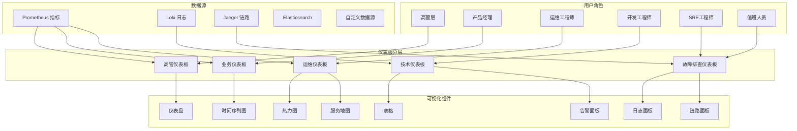

# Kubernetes Grafana 仪表板设计

## 概述

Grafana 仪表板是 Kubernetes 可观测性的可视化窗口，通过精心设计的图表和面板，为不同角色的用户提供直观、实用的监控视图，支持快速问题诊断和决策制定。

### 仪表板架构



## 仪表板设计原则

### 用户体验设计

```yaml
# dashboard-design-principles.yaml
design_principles:
  user_experience:
    clarity:
      - "使用清晰的标题和标签"
      - "避免信息过载"
      - "保持一致的视觉风格"
      - "合理的颜色搭配和对比度"
    
    usability:
      - "5秒原则：5秒内理解关键信息"
      - "逻辑分组和层次结构"
      - "支持快速导航和钻取"
      - "响应式设计适配不同屏幕"
    
    performance:
      - "快速加载时间 < 3秒"
      - "合理的查询时间范围"
      - "避免过于复杂的计算"
      - "优化查询语句性能"
  
  information_hierarchy:
    overview_level:
      description: "整体健康状态概览"
      content: ["关键KPI", "整体可用性", "关键告警摘要"]
      update_frequency: "实时更新"
      target_audience: ["高管", "产品经理", "值班人员"]
    
    service_level:
      description: "服务级别监控"
      content: ["服务性能", "依赖关系", "容量使用"]
      update_frequency: "1分钟刷新"
      target_audience: ["运维工程师", "SRE"]
    
    detail_level:
      description: "详细技术指标"
      content: ["资源使用率", "详细日志", "性能分析"]
      update_frequency: "30秒刷新"
      target_audience: ["开发工程师", "系统管理员"]
  
  layout_guidelines:
    grid_system:
      - "使用24列网格系统"
      - "保持面板对齐和一致的间距"
      - "重要信息放在左上角"
      - "相关信息就近放置"
    
    color_coding:
      success: "#28a745"  # 绿色
      warning: "#ffc107"  # 黄色
      danger: "#dc3545"   # 红色
      info: "#17a2b8"     # 蓝色
      neutral: "#6c757d"  # 灰色
    
    typography:
      - "使用清晰易读的字体"
      - "保持合适的字体大小层次"
      - "重要数值使用大字体"
      - "避免过多的文字描述"
```

## 核心仪表板模板

### 集群概览仪表板

```json
{
  "dashboard": {
    "title": "Kubernetes Cluster Overview",
    "tags": ["kubernetes", "overview", "cluster"],
    "timezone": "browser",
    "refresh": "30s",
    "time": {
      "from": "now-1h",
      "to": "now"
    },
    "panels": [
      {
        "id": 1,
        "title": "Cluster Health Status",
        "type": "stat",
        "gridPos": {"h": 6, "w": 8, "x": 0, "y": 0},
        "targets": [
          {
            "expr": "up{job=\"kubernetes-apiservers\"}",
            "legendFormat": "API Server",
            "refId": "A"
          },
          {
            "expr": "up{job=\"etcd\"}",
            "legendFormat": "etcd",
            "refId": "B"
          }
        ],
        "fieldConfig": {
          "defaults": {
            "mappings": [
              {"options": {"0": {"text": "DOWN", "color": "red"}}, "type": "value"},
              {"options": {"1": {"text": "UP", "color": "green"}}, "type": "value"}
            ],
            "thresholds": {
              "steps": [
                {"color": "red", "value": 0},
                {"color": "green", "value": 1}
              ]
            }
          }
        }
      },
      {
        "id": 2,
        "title": "Node Status",
        "type": "piechart",
        "gridPos": {"h": 6, "w": 8, "x": 8, "y": 0},
        "targets": [
          {
            "expr": "sum(kube_node_status_condition{condition=\"Ready\",status=\"true\"})",
            "legendFormat": "Ready",
            "refId": "A"
          },
          {
            "expr": "sum(kube_node_status_condition{condition=\"Ready\",status=\"false\"})",
            "legendFormat": "NotReady",
            "refId": "B"
          }
        ],
        "options": {
          "pieType": "donut",
          "displayLabels": ["name", "value"]
        }
      },
      {
        "id": 3,
        "title": "Active Alerts",
        "type": "table",
        "gridPos": {"h": 6, "w": 8, "x": 16, "y": 0},
        "targets": [
          {
            "expr": "ALERTS{alertstate=\"firing\"}",
            "format": "table",
            "refId": "A"
          }
        ],
        "transformations": [
          {
            "id": "organize",
            "options": {
              "excludeByName": {"Time": true, "__name__": true},
              "renameByName": {
                "alertname": "Alert",
                "severity": "Severity",
                "instance": "Instance"
              }
            }
          }
        ]
      },
      {
        "id": 4,
        "title": "CPU Usage by Node",
        "type": "timeseries",
        "gridPos": {"h": 8, "w": 12, "x": 0, "y": 6},
        "targets": [
          {
            "expr": "(1 - avg(rate(node_cpu_seconds_total{mode=\"idle\"}[5m])) by (instance)) * 100",
            "legendFormat": "{{instance}}",
            "refId": "A"
          }
        ],
        "fieldConfig": {
          "defaults": {
            "unit": "percent",
            "thresholds": {
              "steps": [
                {"color": "green", "value": 0},
                {"color": "yellow", "value": 70},
                {"color": "red", "value": 90}
              ]
            }
          }
        }
      },
      {
        "id": 5,
        "title": "Memory Usage by Node",
        "type": "timeseries",
        "gridPos": {"h": 8, "w": 12, "x": 12, "y": 6},
        "targets": [
          {
            "expr": "(1 - node_memory_MemAvailable_bytes / node_memory_MemTotal_bytes) * 100",
            "legendFormat": "{{instance}}",
            "refId": "A"
          }
        ],
        "fieldConfig": {
          "defaults": {
            "unit": "percent",
            "thresholds": {
              "steps": [
                {"color": "green", "value": 0},
                {"color": "yellow", "value": 80},
                {"color": "red", "value": 95}
              ]
            }
          }
        }
      },
      {
        "id": 6,
        "title": "Pod Distribution",
        "type": "bargauge",
        "gridPos": {"h": 8, "w": 12, "x": 0, "y": 14},
        "targets": [
          {
            "expr": "sum(kube_pod_info) by (namespace)",
            "legendFormat": "{{namespace}}",
            "refId": "A"
          }
        ],
        "options": {
          "orientation": "horizontal",
          "displayMode": "gradient"
        }
      },
      {
        "id": 7,
        "title": "Cluster Resource Utilization",
        "type": "gauge",
        "gridPos": {"h": 8, "w": 12, "x": 12, "y": 14},
        "targets": [
          {
            "expr": "sum(kube_node_status_allocatable{resource=\"cpu\"}) - sum(kube_pod_container_resource_requests{resource=\"cpu\"})",
            "legendFormat": "Available CPU",
            "refId": "A"
          },
          {
            "expr": "sum(kube_node_status_allocatable{resource=\"memory\"}) - sum(kube_pod_container_resource_requests{resource=\"memory\"})",
            "legendFormat": "Available Memory",
            "refId": "B"
          }
        ],
        "fieldConfig": {
          "defaults": {
            "thresholds": {
              "steps": [
                {"color": "red", "value": 0},
                {"color": "yellow", "value": 30},
                {"color": "green", "value": 50}
              ]
            }
          }
        }
      }
    ]
  }
}
```

### 应用性能仪表板

```json
{
  "dashboard": {
    "title": "Application Performance Dashboard",
    "tags": ["application", "performance", "monitoring"],
    "timezone": "browser",
    "refresh": "1m",
    "time": {
      "from": "now-4h",
      "to": "now"
    },
    "templating": {
      "list": [
        {
          "name": "namespace",
          "type": "query",
          "query": "label_values(kube_pod_info, namespace)",
          "refresh": 1,
          "includeAll": false,
          "multi": false
        },
        {
          "name": "service",
          "type": "query",
          "query": "label_values(kube_service_info{namespace=\"$namespace\"}, service)",
          "refresh": 1,
          "includeAll": false,
          "multi": false
        }
      ]
    },
    "panels": [
      {
        "id": 1,
        "title": "Service Health Overview",
        "type": "stat",
        "gridPos": {"h": 4, "w": 24, "x": 0, "y": 0},
        "targets": [
          {
            "expr": "up{job=\"$service\"}",
            "legendFormat": "Service Status",
            "refId": "A"
          },
          {
            "expr": "sum(rate(http_requests_total{job=\"$service\"}[5m]))",
            "legendFormat": "Request Rate",
            "refId": "B"
          },
          {
            "expr": "histogram_quantile(0.95, sum(rate(http_request_duration_seconds_bucket{job=\"$service\"}[5m])) by (le))",
            "legendFormat": "P95 Latency",
            "refId": "C"
          },
          {
            "expr": "sum(rate(http_requests_total{job=\"$service\",code=~\"5..\"}[5m])) / sum(rate(http_requests_total{job=\"$service\"}[5m])) * 100",
            "legendFormat": "Error Rate",
            "refId": "D"
          }
        ],
        "fieldConfig": {
          "defaults": {
            "mappings": [
              {"options": {"0": {"text": "DOWN", "color": "red"}}, "type": "value"},
              {"options": {"1": {"text": "UP", "color": "green"}}, "type": "value"}
            ]
          }
        }
      },
      {
        "id": 2,
        "title": "Request Rate",
        "type": "timeseries",
        "gridPos": {"h": 8, "w": 12, "x": 0, "y": 4},
        "targets": [
          {
            "expr": "sum(rate(http_requests_total{job=\"$service\"}[5m])) by (method, code)",
            "legendFormat": "{{method}} {{code}}",
            "refId": "A"
          }
        ],
        "fieldConfig": {
          "defaults": {
            "unit": "reqps"
          }
        }
      },
      {
        "id": 3,
        "title": "Response Time Percentiles",
        "type": "timeseries",
        "gridPos": {"h": 8, "w": 12, "x": 12, "y": 4},
        "targets": [
          {
            "expr": "histogram_quantile(0.50, sum(rate(http_request_duration_seconds_bucket{job=\"$service\"}[5m])) by (le))",
            "legendFormat": "P50",
            "refId": "A"
          },
          {
            "expr": "histogram_quantile(0.90, sum(rate(http_request_duration_seconds_bucket{job=\"$service\"}[5m])) by (le))",
            "legendFormat": "P90",
            "refId": "B"
          },
          {
            "expr": "histogram_quantile(0.95, sum(rate(http_request_duration_seconds_bucket{job=\"$service\"}[5m])) by (le))",
            "legendFormat": "P95",
            "refId": "C"
          },
          {
            "expr": "histogram_quantile(0.99, sum(rate(http_request_duration_seconds_bucket{job=\"$service\"}[5m])) by (le))",
            "legendFormat": "P99",
            "refId": "D"
          }
        ],
        "fieldConfig": {
          "defaults": {
            "unit": "s"
          }
        }
      },
      {
        "id": 4,
        "title": "Error Rate by Endpoint",
        "type": "heatmap",
        "gridPos": {"h": 8, "w": 12, "x": 0, "y": 12},
        "targets": [
          {
            "expr": "sum(rate(http_requests_total{job=\"$service\",code=~\"5..\"}[5m])) by (handler)",
            "legendFormat": "{{handler}}",
            "refId": "A"
          }
        ],
        "options": {
          "calculate": true,
          "calculation": {"xBuckets": {"mode": "count", "value": "20"}},
          "cellGap": 1,
          "cellValues": {
            "unit": "percent"
          },
          "color": {
            "mode": "spectrum",
            "scheme": "Spectral",
            "steps": 128
          }
        }
      },
      {
        "id": 5,
        "title": "Database Connection Pool",
        "type": "timeseries",
        "gridPos": {"h": 8, "w": 12, "x": 12, "y": 12},
        "targets": [
          {
            "expr": "database_connections_active{service=\"$service\"}",
            "legendFormat": "Active Connections",
            "refId": "A"
          },
          {
            "expr": "database_connections_idle{service=\"$service\"}",
            "legendFormat": "Idle Connections",
            "refId": "B"
          },
          {
            "expr": "database_connections_max{service=\"$service\"}",
            "legendFormat": "Max Connections",
            "refId": "C"
          }
        ],
        "fieldConfig": {
          "defaults": {
            "unit": "short"
          }
        }
      },
      {
        "id": 6,
        "title": "Top Slowest Endpoints",
        "type": "table",
        "gridPos": {"h": 8, "w": 12, "x": 0, "y": 20},
        "targets": [
          {
            "expr": "topk(10, histogram_quantile(0.95, sum(rate(http_request_duration_seconds_bucket{job=\"$service\"}[5m])) by (handler, le)))",
            "format": "table",
            "refId": "A"
          }
        ],
        "transformations": [
          {
            "id": "organize",
            "options": {
              "excludeByName": {"Time": true, "__name__": true, "job": true, "instance": true},
              "renameByName": {
                "handler": "Endpoint",
                "Value": "P95 Latency (s)"
              }
            }
          }
        ]
      },
      {
        "id": 7,
        "title": "Memory Usage",
        "type": "timeseries",
        "gridPos": {"h": 8, "w": 12, "x": 12, "y": 20},
        "targets": [
          {
            "expr": "process_resident_memory_bytes{job=\"$service\"}",
            "legendFormat": "RSS Memory",
            "refId": "A"
          },
          {
            "expr": "process_virtual_memory_bytes{job=\"$service\"}",
            "legendFormat": "Virtual Memory",
            "refId": "B"
          },
          {
            "expr": "go_memstats_heap_inuse_bytes{job=\"$service\"}",
            "legendFormat": "Heap In Use",
            "refId": "C"
          }
        ],
        "fieldConfig": {
          "defaults": {
            "unit": "bytes"
          }
        }
      }
    ]
  }
}
```

### 业务指标仪表板

```json
{
  "dashboard": {
    "title": "Business Metrics Dashboard",
    "tags": ["business", "kpi", "metrics"],
    "timezone": "browser",
    "refresh": "5m",
    "time": {
      "from": "now-24h",
      "to": "now"
    },
    "panels": [
      {
        "id": 1,
        "title": "Key Performance Indicators",
        "type": "stat",
        "gridPos": {"h": 6, "w": 24, "x": 0, "y": 0},
        "targets": [
          {
            "expr": "sum(increase(business_orders_total[1h]))",
            "legendFormat": "Orders/Hour",
            "refId": "A"
          },
          {
            "expr": "sum(increase(business_revenue_total[1h]))",
            "legendFormat": "Revenue/Hour",
            "refId": "B"
          },
          {
            "expr": "sum(business_active_users)",
            "legendFormat": "Active Users",
            "refId": "C"
          },
          {
            "expr": "avg(business_conversion_rate) * 100",
            "legendFormat": "Conversion Rate",
            "refId": "D"
          }
        ],
        "fieldConfig": {
          "defaults": {
            "color": {"mode": "palette-classic"},
            "custom": {
              "displayMode": "gradient",
              "orientation": "horizontal"
            }
          },
          "overrides": [
            {
              "matcher": {"id": "byName", "options": "Revenue/Hour"},
              "properties": [{"id": "unit", "value": "currencyUSD"}]
            },
            {
              "matcher": {"id": "byName", "options": "Conversion Rate"},
              "properties": [{"id": "unit", "value": "percent"}]
            }
          ]
        }
      },
      {
        "id": 2,
        "title": "Daily Revenue Trend",
        "type": "timeseries",
        "gridPos": {"h": 8, "w": 12, "x": 0, "y": 6},
        "targets": [
          {
            "expr": "sum(increase(business_revenue_total[1d]))",
            "legendFormat": "Daily Revenue",
            "refId": "A"
          }
        ],
        "fieldConfig": {
          "defaults": {
            "unit": "currencyUSD",
            "custom": {
              "fillOpacity": 20,
              "gradientMode": "opacity"
            }
          }
        }
      },
      {
        "id": 3,
        "title": "User Activity",
        "type": "timeseries",
        "gridPos": {"h": 8, "w": 12, "x": 12, "y": 6},
        "targets": [
          {
            "expr": "sum(business_user_registrations)",
            "legendFormat": "New Registrations",
            "refId": "A"
          },
          {
            "expr": "sum(business_user_logins)",
            "legendFormat": "User Logins",
            "refId": "B"
          },
          {
            "expr": "sum(business_active_users)",
            "legendFormat": "Active Users",
            "refId": "C"
          }
        ],
        "fieldConfig": {
          "defaults": {
            "unit": "short"
          }
        }
      },
      {
        "id": 4,
        "title": "Order Status Distribution",
        "type": "piechart",
        "gridPos": {"h": 8, "w": 8, "x": 0, "y": 14},
        "targets": [
          {
            "expr": "sum(business_orders_total) by (status)",
            "legendFormat": "{{status}}",
            "refId": "A"
          }
        ],
        "options": {
          "pieType": "donut",
          "tooltip": {"mode": "multi"},
          "legend": {"displayMode": "table", "placement": "right"}
        }
      },
      {
        "id": 5,
        "title": "Payment Methods",
        "type": "bargauge",
        "gridPos": {"h": 8, "w": 8, "x": 8, "y": 14},
        "targets": [
          {
            "expr": "sum(business_payments_total) by (method)",
            "legendFormat": "{{method}}",
            "refId": "A"
          }
        ],
        "options": {
          "orientation": "horizontal",
          "displayMode": "gradient"
        }
      },
      {
        "id": 6,
        "title": "Geographic Distribution",
        "type": "geomap",
        "gridPos": {"h": 8, "w": 8, "x": 16, "y": 14},
        "targets": [
          {
            "expr": "sum(business_users_total) by (country)",
            "legendFormat": "{{country}}",
            "refId": "A"
          }
        ],
        "options": {
          "view": {"id": "coords", "lat": 40, "lon": -74, "zoom": 3},
          "controls": {"showZoom": true, "mouseWheelZoom": true}
        }
      },
      {
        "id": 7,
        "title": "Customer Acquisition Funnel",
        "type": "table",
        "gridPos": {"h": 8, "w": 12, "x": 0, "y": 22},
        "targets": [
          {
            "expr": "business_funnel_visitors",
            "legendFormat": "Visitors",
            "refId": "A"
          },
          {
            "expr": "business_funnel_signups",
            "legendFormat": "Sign-ups",
            "refId": "B"
          },
          {
            "expr": "business_funnel_trials",
            "legendFormat": "Trials",
            "refId": "C"
          },
          {
            "expr": "business_funnel_conversions",
            "legendFormat": "Conversions",
            "refId": "D"
          }
        ],
        "transformations": [
          {
            "id": "calculateField",
            "options": {
              "mode": "reduceRow",
              "reduce": {"reducer": "sum"},
              "replaceFields": false
            }
          }
        ]
      },
      {
        "id": 8,
        "title": "Revenue by Product Category",
        "type": "timeseries",
        "gridPos": {"h": 8, "w": 12, "x": 12, "y": 22},
        "targets": [
          {
            "expr": "sum(increase(business_revenue_total[1h])) by (category)",
            "legendFormat": "{{category}}",
            "refId": "A"
          }
        ],
        "fieldConfig": {
          "defaults": {
            "unit": "currencyUSD",
            "custom": {
              "stacking": {"mode": "normal"}
            }
          }
        }
      }
    ]
  }
}
```

## 专用仪表板

### 节点监控仪表板

```json
{
  "dashboard": {
    "title": "Node Monitoring Dashboard",
    "tags": ["infrastructure", "nodes", "system"],
    "timezone": "browser",
    "refresh": "30s",
    "templating": {
      "list": [
        {
          "name": "node",
          "type": "query",
          "query": "label_values(node_uname_info, nodename)",
          "refresh": 1,
          "includeAll": true,
          "multi": true
        }
      ]
    },
    "panels": [
      {
        "id": 1,
        "title": "System Load",
        "type": "timeseries",
        "gridPos": {"h": 8, "w": 12, "x": 0, "y": 0},
        "targets": [
          {
            "expr": "node_load1{instance=~\"$node\"}",
            "legendFormat": "{{instance}} - 1m",
            "refId": "A"
          },
          {
            "expr": "node_load5{instance=~\"$node\"}",
            "legendFormat": "{{instance}} - 5m",
            "refId": "B"
          },
          {
            "expr": "node_load15{instance=~\"$node\"}",
            "legendFormat": "{{instance}} - 15m",
            "refId": "C"
          }
        ],
        "fieldConfig": {
          "defaults": {
            "unit": "short"
          }
        }
      },
      {
        "id": 2,
        "title": "CPU Usage by Mode",
        "type": "timeseries",
        "gridPos": {"h": 8, "w": 12, "x": 12, "y": 0},
        "targets": [
          {
            "expr": "rate(node_cpu_seconds_total{instance=~\"$node\"}[5m]) * 100",
            "legendFormat": "{{instance}} - {{mode}}",
            "refId": "A"
          }
        ],
        "fieldConfig": {
          "defaults": {
            "unit": "percent",
            "custom": {
              "stacking": {"mode": "percent"}
            }
          }
        }
      },
      {
        "id": 3,
        "title": "Memory Usage",
        "type": "timeseries",
        "gridPos": {"h": 8, "w": 12, "x": 0, "y": 8},
        "targets": [
          {
            "expr": "node_memory_MemTotal_bytes{instance=~\"$node\"}",
            "legendFormat": "{{instance}} - Total",
            "refId": "A"
          },
          {
            "expr": "node_memory_MemAvailable_bytes{instance=~\"$node\"}",
            "legendFormat": "{{instance}} - Available",
            "refId": "B"
          },
          {
            "expr": "node_memory_MemTotal_bytes{instance=~\"$node\"} - node_memory_MemAvailable_bytes{instance=~\"$node\"}",
            "legendFormat": "{{instance}} - Used",
            "refId": "C"
          }
        ],
        "fieldConfig": {
          "defaults": {
            "unit": "bytes"
          }
        }
      },
      {
        "id": 4,
        "title": "Disk I/O",
        "type": "timeseries",
        "gridPos": {"h": 8, "w": 12, "x": 12, "y": 8},
        "targets": [
          {
            "expr": "rate(node_disk_read_bytes_total{instance=~\"$node\"}[5m])",
            "legendFormat": "{{instance}} {{device}} - Read",
            "refId": "A"
          },
          {
            "expr": "rate(node_disk_written_bytes_total{instance=~\"$node\"}[5m])",
            "legendFormat": "{{instance}} {{device}} - Write",
            "refId": "B"
          }
        ],
        "fieldConfig": {
          "defaults": {
            "unit": "Bps"
          }
        }
      },
      {
        "id": 5,
        "title": "Network Traffic",
        "type": "timeseries",
        "gridPos": {"h": 8, "w": 12, "x": 0, "y": 16},
        "targets": [
          {
            "expr": "rate(node_network_receive_bytes_total{instance=~\"$node\",device!~\"lo|veth.*\"}[5m])",
            "legendFormat": "{{instance}} {{device}} - RX",
            "refId": "A"
          },
          {
            "expr": "rate(node_network_transmit_bytes_total{instance=~\"$node\",device!~\"lo|veth.*\"}[5m])",
            "legendFormat": "{{instance}} {{device}} - TX",
            "refId": "B"
          }
        ],
        "fieldConfig": {
          "defaults": {
            "unit": "Bps"
          }
        }
      },
      {
        "id": 6,
        "title": "Filesystem Usage",
        "type": "table",
        "gridPos": {"h": 8, "w": 12, "x": 12, "y": 16},
        "targets": [
          {
            "expr": "100 - (node_filesystem_avail_bytes{instance=~\"$node\",fstype!~\"tmpfs|fuse.lxcfs\"} / node_filesystem_size_bytes{instance=~\"$node\",fstype!~\"tmpfs|fuse.lxcfs\"} * 100)",
            "format": "table",
            "refId": "A"
          }
        ],
        "transformations": [
          {
            "id": "organize",
            "options": {
              "excludeByName": {"Time": true, "__name__": true, "job": true},
              "renameByName": {
                "instance": "Node",
                "mountpoint": "Mount Point",
                "Value": "Usage %"
              }
            }
          }
        ],
        "fieldConfig": {
          "overrides": [
            {
              "matcher": {"id": "byName", "options": "Usage %"},
              "properties": [
                {"id": "unit", "value": "percent"},
                {"id": "custom.cellOptions", "value": {"type": "color-background"}},
                {"id": "thresholds", "value": {
                  "steps": [
                    {"color": "green", "value": 0},
                    {"color": "yellow", "value": 80},
                    {"color": "red", "value": 90}
                  ]
                }}
              ]
            }
          ]
        }
      }
    ]
  }
}
```

### 应用故障排查仪表板

```json
{
  "dashboard": {
    "title": "Application Troubleshooting Dashboard",
    "tags": ["troubleshooting", "debugging", "application"],
    "timezone": "browser",
    "refresh": "30s",
    "time": {
      "from": "now-1h",
      "to": "now"
    },
    "templating": {
      "list": [
        {
          "name": "namespace",
          "type": "query",
          "query": "label_values(kube_pod_info, namespace)",
          "refresh": 1
        },
        {
          "name": "pod",
          "type": "query",
          "query": "label_values(kube_pod_info{namespace=\"$namespace\"}, pod)",
          "refresh": 1
        }
      ]
    },
    "panels": [
      {
        "id": 1,
        "title": "Pod Status",
        "type": "stat",
        "gridPos": {"h": 4, "w": 24, "x": 0, "y": 0},
        "targets": [
          {
            "expr": "kube_pod_status_phase{namespace=\"$namespace\",pod=\"$pod\"}",
            "legendFormat": "{{phase}}",
            "refId": "A"
          }
        ],
        "fieldConfig": {
          "defaults": {
            "mappings": [
              {"options": {"1": {"text": "Running", "color": "green"}}, "type": "value"},
              {"options": {"2": {"text": "Pending", "color": "yellow"}}, "type": "value"},
              {"options": {"3": {"text": "Failed", "color": "red"}}, "type": "value"}
            ]
          }
        }
      },
      {
        "id": 2,
        "title": "Container Restarts",
        "type": "timeseries",
        "gridPos": {"h": 8, "w": 12, "x": 0, "y": 4},
        "targets": [
          {
            "expr": "kube_pod_container_status_restarts_total{namespace=\"$namespace\",pod=\"$pod\"}",
            "legendFormat": "{{container}}",
            "refId": "A"
          }
        ],
        "fieldConfig": {
          "defaults": {
            "unit": "short"
          }
        }
      },
      {
        "id": 3,
        "title": "Resource Usage",
        "type": "timeseries",
        "gridPos": {"h": 8, "w": 12, "x": 12, "y": 4},
        "targets": [
          {
            "expr": "rate(container_cpu_usage_seconds_total{namespace=\"$namespace\",pod=\"$pod\"}[5m]) * 100",
            "legendFormat": "CPU Usage %",
            "refId": "A"
          },
          {
            "expr": "container_memory_working_set_bytes{namespace=\"$namespace\",pod=\"$pod\"} / 1024 / 1024",
            "legendFormat": "Memory Usage MB",
            "refId": "B"
          }
        ],
        "fieldConfig": {
          "overrides": [
            {
              "matcher": {"id": "byRegexp", "options": "/CPU.*/"}, 
              "properties": [{"id": "unit", "value": "percent"}]
            },
            {
              "matcher": {"id": "byRegexp", "options": "/Memory.*/"}, 
              "properties": [{"id": "unit", "value": "decmbytes"}]
            }
          ]
        }
      },
      {
        "id": 4,
        "title": "Application Logs",
        "type": "logs",
        "gridPos": {"h": 12, "w": 24, "x": 0, "y": 12},
        "targets": [
          {
            "expr": "{namespace=\"$namespace\",pod=\"$pod\"}",
            "refId": "A"
          }
        ],
        "options": {
          "showTime": true,
          "showLabels": true,
          "showCommonLabels": false,
          "wrapLogMessage": true,
          "enableLogDetails": true
        }
      },
      {
        "id": 5,
        "title": "Error Log Analysis",
        "type": "table",
        "gridPos": {"h": 8, "w": 12, "x": 0, "y": 24},
        "targets": [
          {
            "expr": "sum by (level) (count_over_time({namespace=\"$namespace\",pod=\"$pod\"} |= \"ERROR\" [$__interval]))",
            "format": "table",
            "refId": "A"
          }
        ]
      },
      {
        "id": 6,
        "title": "Recent Events",
        "type": "table",
        "gridPos": {"h": 8, "w": 12, "x": 12, "y": 24},
        "targets": [
          {
            "expr": "kube_event_count{involved_object_namespace=\"$namespace\",involved_object_name=\"$pod\"}",
            "format": "table",
            "refId": "A"
          }
        ],
        "transformations": [
          {
            "id": "organize",
            "options": {
              "excludeByName": {"Time": true, "__name__": true},
              "renameByName": {
                "reason": "Reason",
                "type": "Type",
                "message": "Message"
              }
            }
          }
        ]
      }
    ]
  }
}
```

## 仪表板自动化

### 仪表板即代码

```yaml
# dashboard-as-code.yaml
dashboard_automation:
  provisioning:
    # Grafana 配置提供者
    datasources:
      - name: Prometheus
        type: prometheus
        url: http://prometheus:9090
        access: proxy
        isDefault: true
        
      - name: Loki
        type: loki
        url: http://loki:3100
        access: proxy
        
      - name: Jaeger
        type: jaeger
        url: http://jaeger:16686
        access: proxy
    
    # 仪表板自动导入
    dashboards:
      - name: 'Kubernetes Dashboards'
        folder: 'Kubernetes'
        options:
          path: /var/lib/grafana/dashboards/kubernetes
        
      - name: 'Application Dashboards'
        folder: 'Applications'
        options:
          path: /var/lib/grafana/dashboards/applications
          
      - name: 'Business Dashboards'
        folder: 'Business'
        options:
          path: /var/lib/grafana/dashboards/business

  # 仪表板模板引擎
  template_engine:
    variables:
      cluster_name: "production"
      environment: "prod"
      namespace_filter: "default,kube-system"
      refresh_interval: "30s"
      
    templates:
      - name: "node-overview"
        source: "templates/node-overview.json.j2"
        output: "dashboards/kubernetes/node-overview.json"
        variables:
          title: "Node Overview - {{ cluster_name }}"
          refresh: "{{ refresh_interval }}"
          
      - name: "application-performance"
        source: "templates/app-performance.json.j2"
        output: "dashboards/applications/app-performance.json"
        variables:
          namespaces: "{{ namespace_filter }}"
          environment: "{{ environment }}"

  # CI/CD 集成
  cicd_integration:
    validation:
      - name: "JSON Schema Validation"
        command: "jsonschema -i dashboard.json schema/grafana-dashboard.json"
        
      - name: "Dashboard Syntax Check"
        command: "grafana-dashboard-validator dashboard.json"
        
      - name: "Query Performance Test"
        command: "prometheus-query-test queries.yaml"
    
    deployment:
      - name: "Upload to Grafana"
        command: |
          curl -X POST \
            -H "Authorization: Bearer $GRAFANA_API_KEY" \
            -H "Content-Type: application/json" \
            -d @dashboard.json \
            $GRAFANA_URL/api/dashboards/db
            
      - name: "Update Dashboard Permissions"
        command: |
          curl -X POST \
            -H "Authorization: Bearer $GRAFANA_API_KEY" \
            -H "Content-Type: application/json" \
            -d '{"permissions": [{"role": "Viewer", "permission": 1}]}' \
            $GRAFANA_URL/api/dashboards/id/$DASHBOARD_ID/permissions
```

### 动态仪表板生成

```python
# dashboard-generator.py
import json
import yaml
from jinja2 import Template

class DashboardGenerator:
    def __init__(self, config_file):
        with open(config_file, 'r') as f:
            self.config = yaml.safe_load(f)
    
    def generate_dashboard(self, template_name, variables=None):
        """生成仪表板配置"""
        template_config = self.config['templates'][template_name]
        
        # 加载模板
        with open(template_config['source'], 'r') as f:
            template = Template(f.read())
        
        # 合并变量
        template_vars = template_config.get('variables', {})
        if variables:
            template_vars.update(variables)
        
        # 渲染模板
        dashboard_json = template.render(**template_vars)
        
        # 保存输出
        output_file = template_config['output']
        with open(output_file, 'w') as f:
            f.write(dashboard_json)
        
        return json.loads(dashboard_json)
    
    def generate_service_dashboard(self, service_name, namespace):
        """为特定服务生成仪表板"""
        service_config = {
            'service_name': service_name,
            'namespace': namespace,
            'title': f'{service_name} Service Dashboard',
            'refresh': '30s'
        }
        
        return self.generate_dashboard('service-overview', service_config)
    
    def generate_namespace_dashboard(self, namespace):
        """为命名空间生成仪表板"""
        namespace_config = {
            'namespace': namespace,
            'title': f'{namespace} Namespace Overview',
            'refresh': '1m'
        }
        
        return self.generate_dashboard('namespace-overview', namespace_config)
    
    def bulk_generate_dashboards(self):
        """批量生成仪表板"""
        # 获取所有服务
        services = self.get_services_from_prometheus()
        
        for service in services:
            namespace = service['namespace']
            service_name = service['name']
            
            # 生成服务仪表板
            dashboard = self.generate_service_dashboard(service_name, namespace)
            
            # 上传到 Grafana
            self.upload_dashboard(dashboard)
    
    def get_services_from_prometheus(self):
        """从 Prometheus 获取服务列表"""
        import requests
        
        prometheus_url = self.config['prometheus']['url']
        query = 'group by (namespace, service) (kube_service_info)'
        
        response = requests.get(
            f'{prometheus_url}/api/v1/query',
            params={'query': query}
        )
        
        services = []
        for result in response.json()['data']['result']:
            services.append({
                'namespace': result['metric']['namespace'],
                'name': result['metric']['service']
            })
        
        return services
    
    def upload_dashboard(self, dashboard):
        """上传仪表板到 Grafana"""
        import requests
        
        grafana_config = self.config['grafana']
        
        headers = {
            'Authorization': f'Bearer {grafana_config["api_key"]}',
            'Content-Type': 'application/json'
        }
        
        payload = {
            'dashboard': dashboard,
            'overwrite': True
        }
        
        response = requests.post(
            f'{grafana_config["url"]}/api/dashboards/db',
            headers=headers,
            json=payload
        )
        
        if response.status_code == 200:
            print(f'Dashboard "{dashboard["title"]}" uploaded successfully')
        else:
            print(f'Failed to upload dashboard: {response.text}')

# 使用示例
if __name__ == '__main__':
    generator = DashboardGenerator('dashboard-config.yaml')
    
    # 生成单个服务仪表板
    generator.generate_service_dashboard('api-gateway', 'production')
    
    # 批量生成所有服务仪表板
    generator.bulk_generate_dashboards()
```

## 最佳实践

### 仪表板设计最佳实践

```yaml
# dashboard-best-practices.yaml
dashboard_best_practices:
  design_principles:
    user_focused:
      - "以用户需求为中心设计"
      - "不同角色使用不同仪表板"
      - "提供清晰的导航路径"
      - "支持快速定位问题"
    
    information_hierarchy:
      - "重要信息放在顶部和左侧"
      - "使用合理的信息分组"
      - "保持逻辑清晰的布局"
      - "避免信息过载"
    
    visual_design:
      - "使用一致的颜色主题"
      - "保持适当的留白空间"
      - "选择合适的图表类型"
      - "确保良好的可读性"
  
  performance_optimization:
    query_optimization:
      - "使用合适的时间范围"
      - "避免高基数查询"
      - "使用缓存机制"
      - "优化复杂计算"
    
    loading_optimization:
      - "分页加载大量数据"
      - "使用懒加载技术"
      - "压缩传输数据"
      - "优化图片和资源"
    
    refresh_strategy:
      - "根据数据变化频率设置刷新间隔"
      - "避免过于频繁的刷新"
      - "使用智能刷新策略"
      - "提供手动刷新选项"
  
  maintenance_guidelines:
    version_control:
      - "仪表板配置纳入版本控制"
      - "记录变更历史和原因"
      - "使用分支管理不同环境"
      - "建立代码审查流程"
    
    testing_strategy:
      - "测试仪表板在不同数据量下的表现"
      - "验证告警和阈值设置"
      - "检查跨浏览器兼容性"
      - "进行用户体验测试"
    
    documentation:
      - "提供仪表板使用说明"
      - "记录查询语句含义"
      - "说明重要指标的业务含义"
      - "维护故障排查指南"
```

## 总结

Grafana 仪表板设计是 Kubernetes 可观测性的重要组成部分，通过精心设计的可视化界面，可以显著提升监控效率和用户体验。关键要点包括：

1. **用户导向**：根据不同角色需求设计专门的仪表板
2. **信息架构**：合理组织信息层次和布局结构
3. **视觉设计**：使用一致的设计语言和合适的图表类型
4. **性能优化**：确保快速加载和响应体验
5. **自动化管理**：使用代码化方式管理仪表板生命周期

通过系统性的仪表板设计实践，能够构建出既美观又实用的监控界面，为运维和开发团队提供强有力的可视化支撑。
