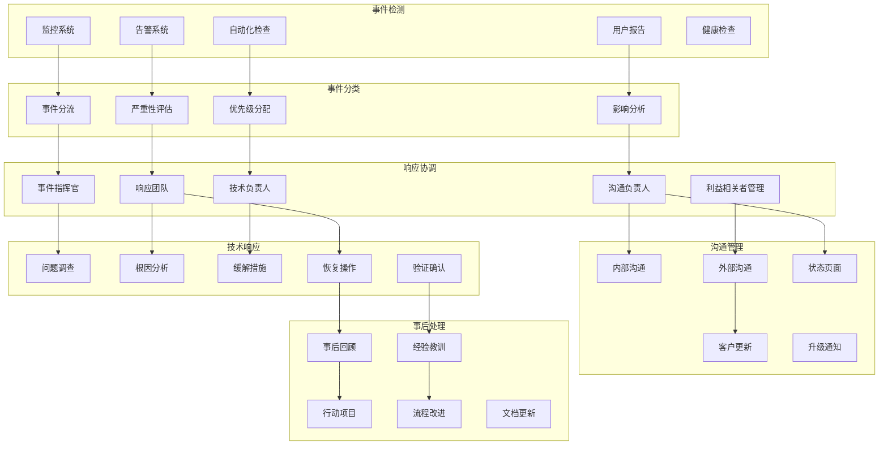
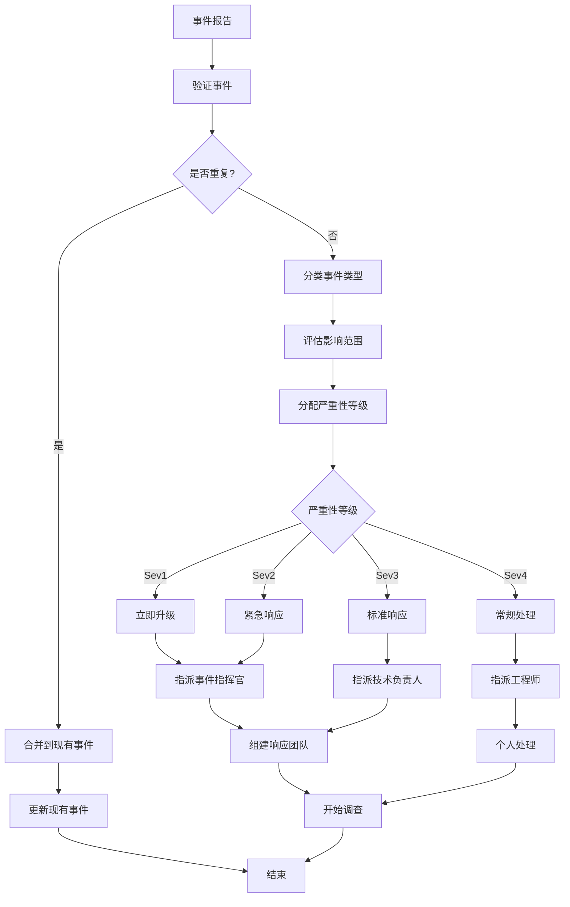

# Kubernetes 事件管理与响应

## 概述

事件管理是 Kubernetes 可观测性的关键环节，通过标准化的事件响应流程、根因分析方法和持续改进机制，确保系统故障得到快速有效的处理，最大化系统可用性和业务连续性。

### 事件管理架构



## 事件分类与严重性等级

### 严重性等级定义

```yaml
# incident-severity-levels.yaml
severity_levels:
  sev1_critical:
    name: "严重 (Critical)"
    description: "系统完全不可用或重大功能失效"
    response_time: "立即响应 (< 15分钟)"
    examples:
      - "整个服务不可用"
      - "数据丢失或损坏"
      - "安全漏洞被利用"
      - "重要客户完全无法使用服务"
    escalation:
      immediate: ["值班工程师", "技术负责人", "产品负责人"]
      after_30min: ["工程总监", "CTO"]
      after_1hour: ["CEO", "公关团队"]
    communication:
      internal: "立即通知所有相关团队"
      external: "15分钟内更新状态页面"
      frequency: "每30分钟更新一次"
    
  sev2_high:
    name: "高 (High)"
    description: "核心功能受影响但有备用方案"
    response_time: "30分钟内响应"
    examples:
      - "主要功能性能严重下降"
      - "部分用户无法访问"
      - "非关键数据丢失"
      - "安全监控告警"
    escalation:
      immediate: ["值班工程师", "技术负责人"]
      after_1hour: ["工程总监"]
      after_4hours: ["CTO"]
    communication:
      internal: "30分钟内通知相关团队"
      external: "1小时内更新状态页面"
      frequency: "每1小时更新一次"
    
  sev3_medium:
    name: "中 (Medium)"
    description: "非核心功能受影响或性能下降"
    response_time: "2小时内响应"
    examples:
      - "次要功能不可用"
      - "性能轻微下降"
      - "监控系统告警"
      - "批处理任务失败"
    escalation:
      immediate: ["值班工程师"]
      after_4hours: ["技术负责人"]
      after_1day: ["工程总监"]
    communication:
      internal: "2小时内通知相关团队"
      external: "根据需要更新状态页面"
      frequency: "每4小时更新一次"
    
  sev4_low:
    name: "低 (Low)"
    description: "轻微问题或潜在风险"
    response_time: "工作时间内响应"
    examples:
      - "文档错误"
      - "轻微的用户界面问题"
      - "性能监控建议"
      - "非紧急的安全更新"
    escalation:
      immediate: ["相关开发团队"]
      after_1week: ["技术负责人"]
    communication:
      internal: "工作时间内通知"
      external: "通常不需要外部沟通"
      frequency: "每日更新或根据需要"

impact_categories:
  availability:
    description: "服务可用性影响"
    metrics: ["服务不可用时间", "受影响用户数", "功能可用性"]
    
  performance:
    description: "服务性能影响"
    metrics: ["响应时间增加", "吞吐量下降", "错误率上升"]
    
  data_integrity:
    description: "数据完整性影响"
    metrics: ["数据丢失量", "数据准确性", "同步状态"]
    
  security:
    description: "安全性影响"
    metrics: ["暴露范围", "潜在损失", "合规风险"]
    
  business:
    description: "业务影响"
    metrics: ["收入损失", "客户满意度", "品牌形象"]
```

### 事件分流流程



## 事件响应流程

### 标准响应流程

```yaml
# incident-response-process.yaml
incident_response_phases:
  detection_and_reporting:
    duration: "0-15分钟"
    objectives:
      - "快速识别问题"
      - "准确报告事件"
      - "初步影响评估"
    activities:
      - "监控告警触发"
      - "用户报告收集"
      - "自动化检测"
      - "初步验证"
    deliverables:
      - "事件报告"
      - "初步影响评估"
      - "严重性等级"
    
  initial_response:
    duration: "15-60分钟"
    objectives:
      - "组建响应团队"
      - "建立沟通机制"
      - "实施初步缓解措施"
    activities:
      - "指派事件指挥官"
      - "组建响应团队"
      - "建立沟通渠道"
      - "开始初步调查"
      - "实施快速修复"
    deliverables:
      - "响应团队名单"
      - "沟通计划"
      - "初步缓解措施"
    
  investigation_and_diagnosis:
    duration: "30分钟-4小时"
    objectives:
      - "确定根本原因"
      - "评估完整影响"
      - "制定恢复计划"
    activities:
      - "日志分析"
      - "系统检查"
      - "性能分析"
      - "根因分析"
      - "影响评估"
    deliverables:
      - "根因分析报告"
      - "完整影响评估"
      - "恢复计划"
    
  containment_and_mitigation:
    duration: "1-8小时"
    objectives:
      - "防止问题扩散"
      - "减少持续影响"
      - "准备长期解决方案"
    activities:
      - "隔离受影响系统"
      - "实施临时解决方案"
      - "监控系统状态"
      - "准备永久修复"
    deliverables:
      - "临时解决方案"
      - "监控计划"
      - "永久修复方案"
    
  recovery_and_restoration:
    duration: "2-24小时"
    objectives:
      - "恢复正常服务"
      - "验证系统功能"
      - "监控稳定性"
    activities:
      - "执行恢复操作"
      - "功能验证测试"
      - "性能监控"
      - "用户验证"
    deliverables:
      - "恢复操作记录"
      - "验证测试结果"
      - "监控报告"
    
  closure_and_follow_up:
    duration: "1-5天"
    objectives:
      - "正式关闭事件"
      - "总结经验教训"
      - "制定改进计划"
    activities:
      - "最终验证"
      - "事后回顾会议"
      - "文档更新"
      - "改进计划制定"
    deliverables:
      - "事件关闭报告"
      - "事后回顾报告"
      - "改进行动计划"

communication_protocols:
  internal_communication:
    channels:
      primary: "专用 Slack 频道"
      backup: "Microsoft Teams"
      escalation: "电话会议"
    frequency:
      sev1: "每15分钟更新"
      sev2: "每30分钟更新"
      sev3: "每1小时更新"
      sev4: "每日更新"
    
  external_communication:
    channels:
      status_page: "公共状态页面"
      email: "客户通知邮件"
      support: "客服系统更新"
      social_media: "社交媒体通告"
    templates:
      initial: "我们正在调查影响XX功能的问题"
      update: "我们继续调查XX问题，预计在XX时间解决"
      resolution: "XX问题已解决，所有功能已恢复正常"
    
  stakeholder_management:
    executives:
      trigger: "Sev1事件或Sev2持续超过2小时"
      method: "直接电话或短信"
      frequency: "每30分钟更新"
    
    customers:
      trigger: "面向客户的功能受影响"
      method: "状态页面和邮件通知"
      frequency: "根据严重性等级"
    
    partners:
      trigger: "影响合作伙伴集成"
      method: "专用沟通渠道"
      frequency: "每1小时更新"
```

### 角色和职责

```yaml
# incident-roles-responsibilities.yaml
incident_roles:
  incident_commander:
    responsibilities:
      - "总体协调事件响应"
      - "做出关键决策"
      - "管理升级流程"
      - "确保沟通有效"
      - "资源分配协调"
    skills_required:
      - "强大的沟通能力"
      - "决策能力"
      - "压力下的领导力"
      - "技术背景理解"
    authority:
      - "调动任何必要资源"
      - "做出技术和业务决策"
      - "暂停非关键操作"
      - "升级到高级管理层"
    
  technical_lead:
    responsibilities:
      - "领导技术调查"
      - "制定技术解决方案"
      - "协调技术团队"
      - "评估技术风险"
    skills_required:
      - "深度技术专业知识"
      - "系统架构理解"
      - "故障排除经验"
      - "团队协作能力"
    authority:
      - "指导技术调查方向"
      - "批准技术解决方案"
      - "分配技术任务"
    
  communications_lead:
    responsibilities:
      - "管理内外部沟通"
      - "更新状态页面"
      - "协调客户沟通"
      - "管理媒体关系"
    skills_required:
      - "优秀的写作能力"
      - "公关经验"
      - "客户关系管理"
      - "危机沟通"
    authority:
      - "发布外部通告"
      - "协调媒体响应"
      - "管理客户沟通"
    
  subject_matter_expert:
    responsibilities:
      - "提供专业技术建议"
      - "协助根因分析"
      - "评估解决方案风险"
      - "指导技术实施"
    skills_required:
      - "特定领域专业知识"
      - "故障排除经验"
      - "风险评估能力"
    authority:
      - "在专业领域内做决定"
      - "否决高风险操作"
    
  scribe:
    responsibilities:
      - "记录事件时间线"
      - "记录决策过程"
      - "维护行动日志"
      - "准备事件报告"
    skills_required:
      - "优秀的记录能力"
      - "注意细节"
      - "技术理解"
    authority:
      - "访问所有相关信息"
      - "要求澄清决策"

escalation_matrix:
  severity_1:
    immediate:
      - "值班工程师"
      - "技术负责人"
      - "产品负责人"
      - "事件指挥官"
    after_30_minutes:
      - "工程总监"
      - "产品总监"
    after_1_hour:
      - "CTO"
      - "CEO"
      - "公关团队"
    
  severity_2:
    immediate:
      - "值班工程师"
      - "技术负责人"
    after_1_hour:
      - "工程总监"
    after_4_hours:
      - "CTO"
    
  severity_3:
    immediate:
      - "值班工程师"
    after_4_hours:
      - "技术负责人"
    after_24_hours:
      - "工程总监"
    
  severity_4:
    immediate:
      - "相关开发团队"
    after_1_week:
      - "技术负责人"
```

## 根因分析方法

### 5 Whys 分析法

```yaml
# five-whys-analysis.yaml
five_whys_template:
  incident_description: "简要描述事件"
  immediate_cause: "直接导致问题的原因"
  
  analysis_steps:
    why_1:
      question: "为什么会发生这个问题？"
      answer: "描述直接原因"
      evidence: "支持证据"
      
    why_2:
      question: "为什么会出现上述原因？"
      answer: "描述更深层原因"
      evidence: "支持证据"
      
    why_3:
      question: "为什么会出现上述原因？"
      answer: "描述更深层原因"
      evidence: "支持证据"
      
    why_4:
      question: "为什么会出现上述原因？"
      answer: "描述更深层原因"
      evidence: "支持证据"
      
    why_5:
      question: "为什么会出现上述原因？"
      answer: "根本原因"
      evidence: "支持证据"
  
  root_cause: "最终确定的根本原因"
  contributing_factors: "其他贡献因素"
  
  prevention_measures:
    immediate: "立即预防措施"
    short_term: "短期预防措施"
    long_term: "长期预防措施"

example_analysis:
  incident: "Kubernetes Pod 内存不足导致服务不可用"
  
  why_1:
    question: "为什么 Pod 会内存不足？"
    answer: "Pod 消耗的内存超过了配置的限制"
    evidence: "监控显示内存使用率达到100%，Pod被OOMKilled"
    
  why_2:
    question: "为什么 Pod 消耗超过限制的内存？"
    answer: "应用程序出现内存泄漏"
    evidence: "内存使用量持续增长，GC无法回收"
    
  why_3:
    question: "为什么应用程序会内存泄漏？"
    answer: "代码中存在未关闭的数据库连接"
    evidence: "连接池监控显示连接数持续增长"
    
  why_4:
    question: "为什么会有未关闭的数据库连接？"
    answer: "异常处理代码中缺少连接关闭逻辑"
    evidence: "代码审查发现try-catch块中没有finally关闭连接"
    
  why_5:
    question: "为什么异常处理代码中缺少连接关闭逻辑？"
    answer: "代码审查流程没有检查资源管理"
    evidence: "代码审查清单中没有资源管理检查项"
  
  root_cause: "代码审查流程不完善，缺少资源管理检查"
  
  prevention_measures:
    immediate: "修复代码中的连接泄漏问题"
    short_term: "更新代码审查清单，增加资源管理检查"
    long_term: "实施静态代码分析工具，自动检测资源泄漏"
```

### 鱼骨图分析法

```yaml
# fishbone-analysis.yaml
fishbone_categories:
  people:
    description: "人为因素"
    common_causes:
      - "技能不足"
      - "培训缺失"
      - "沟通问题"
      - "工作负载过重"
      - "人员变动"
    
  process:
    description: "流程因素"
    common_causes:
      - "流程不完善"
      - "文档过时"
      - "审查不充分"
      - "测试覆盖不足"
      - "变更管理问题"
    
  technology:
    description: "技术因素"
    common_causes:
      - "软件缺陷"
      - "硬件故障"
      - "架构设计问题"
      - "依赖系统故障"
      - "配置错误"
    
  environment:
    description: "环境因素"
    common_causes:
      - "资源限制"
      - "网络问题"
      - "外部依赖"
      - "负载变化"
      - "安全威胁"

fishbone_template:
  problem_statement: "明确定义问题"
  
  major_categories:
    people:
      potential_causes: []
      evidence: []
      likelihood: "high|medium|low"
      
    process:
      potential_causes: []
      evidence: []
      likelihood: "high|medium|low"
      
    technology:
      potential_causes: []
      evidence: []
      likelihood: "high|medium|low"
      
    environment:
      potential_causes: []
      evidence: []
      likelihood: "high|medium|low"
  
  most_likely_causes:
    primary: "最可能的主要原因"
    secondary: "次要原因"
    contributing: "贡献因素"
  
  validation_plan:
    hypotheses: "需要验证的假设"
    tests: "验证测试方法"
    timeline: "验证时间计划"
```

### 时间线分析

```yaml
# timeline-analysis.yaml
timeline_template:
  incident_start: "事件开始时间"
  incident_end: "事件结束时间"
  total_duration: "总持续时间"
  
  events:
    - timestamp: "YYYY-MM-DD HH:MM:SS UTC"
      event_type: "normal|warning|error|action"
      source: "系统|用户|自动化"
      description: "事件描述"
      impact: "对系统的影响"
      evidence: "相关日志或监控数据"
      
  key_milestones:
    problem_start: "问题实际开始时间"
    detection: "问题检测时间"
    alert_fired: "告警触发时间"
    response_started: "响应开始时间"
    cause_identified: "原因确定时间"
    mitigation_started: "缓解开始时间"
    resolution_completed: "解决完成时间"
    
  analysis:
    detection_delay: "检测延迟时间"
    response_delay: "响应延迟时间"
    resolution_time: "解决用时"
    total_impact_time: "总影响时间"
    
  improvement_opportunities:
    faster_detection: "更快检测的机会"
    faster_response: "更快响应的机会"
    faster_resolution: "更快解决的机会"

example_timeline:
  incident: "数据库连接池耗尽导致API响应缓慢"
  incident_start: "2024-01-15 14:30:00 UTC"
  incident_end: "2024-01-15 16:45:00 UTC"
  total_duration: "2小时15分钟"
  
  events:
    - timestamp: "2024-01-15 14:30:00"
      event_type: "normal"
      source: "系统"
      description: "数据库连接池使用率开始上升"
      impact: "轻微性能影响"
      evidence: "数据库监控显示连接池80%使用率"
      
    - timestamp: "2024-01-15 14:45:00"
      event_type: "warning"
      source: "监控系统"
      description: "API响应时间告警触发"
      impact: "用户体验下降"
      evidence: "Prometheus告警：API响应时间P95 > 2s"
      
    - timestamp: "2024-01-15 15:00:00"
      event_type: "error"
      source: "应用"
      description: "数据库连接池耗尽"
      impact: "API请求开始失败"
      evidence: "应用日志：无法获取数据库连接"
      
    - timestamp: "2024-01-15 15:05:00"
      event_type: "action"
      source: "值班工程师"
      description: "开始事件响应"
      impact: "响应开始"
      evidence: "事件跟踪系统记录"
```

## 事后回顾

### 事后回顾流程

```yaml
# post-incident-review.yaml
post_incident_review_process:
  preparation:
    timeline: "事件解决后1-3天内"
    participants:
      required:
        - "事件指挥官"
        - "技术负责人"
        - "主要响应人员"
      optional:
        - "相关团队成员"
        - "管理层代表"
        - "客户代表"
    materials:
      - "事件时间线"
      - "根因分析报告"
      - "监控数据"
      - "沟通记录"
      - "客户反馈"
    
  meeting_structure:
    duration: "1-2小时"
    facilitator: "中立的促进者（非直接参与者）"
    
    agenda:
      - "事件概述（10分钟）"
      - "时间线回顾（20分钟）"
      - "根因分析（30分钟）"
      - "响应过程分析（20分钟）"
      - "经验教训讨论（20分钟）"
      - "改进行动计划（20分钟）"
    
    ground_rules:
      - "无指责文化 (No-blame culture)"
      - "专注于系统和流程改进"
      - "鼓励开放和诚实的讨论"
      - "重视每个人的观点"
      - "关注未来预防"
  
  analysis_framework:
    what_went_well:
      - "有效的响应行动"
      - "成功的技术决策"
      - "良好的团队协作"
      - "有用的工具和流程"
    
    what_went_wrong:
      - "延迟的检测或响应"
      - "无效的解决方案"
      - "沟通问题"
      - "流程缺陷"
    
    what_we_learned:
      - "新的技术知识"
      - "流程改进机会"
      - "工具和监控需求"
      - "培训需求"
    
    what_to_improve:
      - "具体的改进建议"
      - "优先级排序"
      - "负责人和时间线"
      - "成功标准"

action_items_template:
  - id: "PIR-001"
    title: "改进监控告警"
    description: "增加数据库连接池监控告警"
    priority: "high|medium|low"
    owner: "负责人姓名"
    due_date: "完成日期"
    success_criteria: "成功标准"
    status: "open|in_progress|completed|cancelled"
    
  - id: "PIR-002"
    title: "更新运维手册"
    description: "添加数据库连接问题排查指南"
    priority: "medium"
    owner: "文档团队"
    due_date: "2024-02-15"
    success_criteria: "手册更新并通过团队评审"
    status: "open"

follow_up_process:
  tracking:
    method: "行动项跟踪系统"
    frequency: "每周检查进度"
    reporting: "每月汇总报告"
    
  verification:
    criteria: "改进措施的有效性验证"
    methods: ["测试", "演练", "监控验证"]
    timeline: "实施后30天内验证"
    
  communication:
    internal: "向相关团队通报改进进展"
    management: "向管理层汇报改进成果"
    learning: "与其他团队分享经验教训"
```

### 知识管理

```yaml
# knowledge-management.yaml
knowledge_capture:
  incident_database:
    structure:
      - "事件ID和基本信息"
      - "问题描述和影响"
      - "根本原因分析"
      - "解决方案和步骤"
      - "经验教训和改进"
    
    categorization:
      by_component: ["数据库", "网络", "应用", "基础设施"]
      by_cause: ["代码缺陷", "配置错误", "容量问题", "依赖故障"]
      by_impact: ["可用性", "性能", "数据", "安全"]
    
    search_capabilities:
      - "全文搜索"
      - "标签过滤"
      - "时间范围"
      - "严重性等级"
      - "相似事件推荐"
  
  runbook_management:
    structure:
      problem_identification: "问题识别指南"
      diagnostic_steps: "诊断步骤"
      resolution_procedures: "解决程序"
      escalation_paths: "升级路径"
      verification_steps: "验证步骤"
    
    maintenance:
      review_frequency: "季度审查"
      update_triggers: ["新事件类型", "工具变更", "流程更新"]
      approval_process: "技术负责人审批"
      version_control: "Git版本管理"
  
  lessons_learned:
    documentation_format:
      - "简洁的标题"
      - "背景和上下文"
      - "关键教训"
      - "可操作的建议"
      - "适用范围"
    
    sharing_mechanisms:
      - "月度技术分享会"
      - "内部博客文章"
      - "培训材料更新"
      - "新员工入职材料"
    
    impact_measurement:
      - "相似事件减少率"
      - "检测时间改进"
      - "解决时间缩短"
      - "团队能力提升"

continuous_improvement:
  metrics_tracking:
    incident_metrics:
      - "事件数量趋势"
      - "平均检测时间"
      - "平均解决时间"
      - "重复事件率"
      - "客户影响时间"
    
    process_metrics:
      - "响应时间合规率"
      - "升级准确性"
      - "沟通有效性"
      - "事后回顾完成率"
      - "行动项完成率"
  
  quarterly_review:
    objectives:
      - "分析事件趋势"
      - "识别系统性问题"
      - "评估流程有效性"
      - "制定改进计划"
    
    deliverables:
      - "事件趋势分析报告"
      - "流程改进建议"
      - "培训需求评估"
      - "工具和系统改进计划"
  
  culture_development:
    no_blame_culture:
      - "关注系统而非个人"
      - "鼓励问题报告"
      - "学习导向的讨论"
      - "持续改进心态"
    
    learning_organization:
      - "失败快速恢复"
      - "知识共享文化"
      - "实验和创新"
      - "反馈循环建立"
```

## 工具和技术

### 事件管理工具

```yaml
# incident-management-tools.yaml
incident_management_platforms:
  pagerduty:
    features:
      - "智能告警聚合"
      - "升级策略管理"
      - "值班轮换调度"
      - "事件协作"
      - "事后分析"
    integration:
      monitoring: ["Prometheus", "Grafana", "Datadog"]
      communication: ["Slack", "Microsoft Teams"]
      ticketing: ["Jira", "ServiceNow"]
    pricing: "按用户付费"
    
  opsgenie:
    features:
      - "告警管理"
      - "值班调度"
      - "事件响应"
      - "报告分析"
      - "移动应用"
    integration:
      monitoring: ["各种监控工具"]
      communication: ["Slack", "HipChat"]
      itsm: ["Jira Service Desk"]
    pricing: "分层定价"
    
  victorops:
    features:
      - "实时协作"
      - "时间线管理"
      - "智能路由"
      - "事后分析"
      - "API集成"
    integration:
      monitoring: ["广泛的监控工具支持"]
      communication: ["团队协作工具"]
    pricing: "按用户付费"

communication_tools:
  slack:
    incident_channels:
      - "自动创建事件频道"
      - "状态机器人更新"
      - "集成监控告警"
      - "行动项跟踪"
    
    integrations:
      - "PagerDuty集成"
      - "Grafana通知"
      - "Jira工单创建"
      - "状态页面更新"
  
  microsoft_teams:
    features:
      - "视频会议集成"
      - "文件共享"
      - "白板协作"
      - "移动应用支持"
    
    workflows:
      - "自动化工作流"
      - "Power Automate集成"
      - "自定义应用"

status_page_tools:
  statuspage_io:
    features:
      - "实时状态更新"
      - "订阅通知"
      - "历史事件记录"
      - "维护窗口管理"
      - "自定义品牌"
    
    automation:
      - "API自动更新"
      - "监控集成"
      - "自动化消息"
    
  atlassian_statuspage:
    features:
      - "多渠道通知"
      - "组件状态管理"
      - "影响分析"
      - "用户订阅管理"
    
    integration:
      - "Jira集成"
      - "Confluence集成"
      - "监控工具集成"
```

### 自动化响应

```yaml
# automated-incident-response.yaml
automation_strategies:
  detection_automation:
    smart_alerting:
      - "基于机器学习的异常检测"
      - "智能告警聚合和去重"
      - "动态阈值调整"
      - "上下文感知告警"
    
    multi_signal_correlation:
      - "指标、日志、链路关联"
      - "跨系统事件关联"
      - "时间窗口分析"
      - "因果关系推断"
  
  response_automation:
    auto_remediation:
      playbooks:
        - name: "Pod重启"
          trigger: "Pod崩溃循环"
          actions:
            - "检查Pod状态"
            - "收集日志"
            - "重启Pod"
            - "验证恢复"
          safety_checks:
            - "最大重试次数"
            - "时间间隔限制"
            - "影响范围检查"
        
        - name: "自动扩容"
          trigger: "高CPU使用率"
          actions:
            - "验证指标"
            - "检查扩容限制"
            - "增加Pod副本"
            - "监控效果"
          safety_checks:
            - "最大副本数限制"
            - "资源配额检查"
            - "成本影响评估"
    
    notification_automation:
      - "基于严重性的自动升级"
      - "智能值班人员选择"
      - "多渠道通知发送"
      - "状态页面自动更新"
  
  investigation_automation:
    data_collection:
      - "自动日志收集"
      - "性能数据快照"
      - "配置状态捕获"
      - "依赖关系图生成"
    
    analysis_assistance:
      - "相似历史事件查找"
      - "根因分析建议"
      - "影响评估计算"
      - "解决方案推荐"

automation_implementation:
  kubernetes_operators:
    chaos_engineering:
      - "故障注入测试"
      - "恢复能力验证"
      - "自动化演练"
    
    self_healing:
      - "故障自动检测"
      - "自动恢复操作"
      - "健康状态维护"
    
    capacity_management:
      - "自动扩缩容"
      - "资源优化"
      - "负载均衡调整"
  
  integration_examples:
    prometheus_alertmanager:
      - name: "磁盘空间清理"
        webhook_config:
          url: "http://automation-service/cleanup-disk"
          method: "POST"
          headers:
            Authorization: "Bearer <token>"
        payload:
          alert: "{{ .GroupLabels.alertname }}"
          instance: "{{ .CommonLabels.instance }}"
          severity: "{{ .CommonLabels.severity }}"
    
    grafana_webhooks:
      - name: "性能异常处理"
        condition: "CPU使用率 > 90%"
        action: "调用自动化API"
        safety_check: "确认无活跃维护窗口"
```

## 最佳实践

### 事件管理最佳实践

```yaml
# incident-management-best-practices.yaml
best_practices:
  preparation:
    team_readiness:
      - "建立清晰的角色和职责"
      - "定期进行事件响应培训"
      - "保持最新的联系信息"
      - "建立有效的值班制度"
    
    process_documentation:
      - "标准化事件响应流程"
      - "维护最新的运维手册"
      - "建立决策树和检查清单"
      - "定期审查和更新流程"
    
    tool_preparation:
      - "配置监控和告警系统"
      - "准备事件管理工具"
      - "建立沟通渠道"
      - "准备自动化脚本"
  
  response_execution:
    communication:
      - "建立清晰的沟通层次"
      - "使用一致的术语"
      - "定期更新状态"
      - "记录所有决策"
    
    decision_making:
      - "快速做出初步决策"
      - "基于数据而非猜测"
      - "考虑风险和影响"
      - "必要时寻求帮助"
    
    coordination:
      - "避免太多人参与"
      - "保持清晰的指挥链"
      - "并行处理可能的任务"
      - "定期重新评估策略"
  
  continuous_improvement:
    learning_culture:
      - "无指责的事后回顾"
      - "鼓励问题报告"
      - "分享经验教训"
      - "持续改进心态"
    
    metrics_driven:
      - "跟踪关键指标"
      - "设定改进目标"
      - "定期回顾趋势"
      - "基于数据做决策"
    
    automation_adoption:
      - "逐步引入自动化"
      - "保持人工监督"
      - "测试自动化流程"
      - "记录自动化决策"

common_pitfalls:
  - name: "过度升级"
    description: "将所有问题都升级为严重事件"
    solution: "建立清晰的严重性等级标准"
    
  - name: "沟通混乱"
    description: "太多人在不同渠道讨论"
    solution: "建立专用沟通渠道和协议"
    
  - name: "文档缺失"
    description: "没有记录事件处理过程"
    solution: "指定专人记录，使用模板"
    
  - name: "经验教训丢失"
    description: "事后不进行回顾和改进"
    solution: "强制性事后回顾流程"
    
  - name: "工具过度依赖"
    description: "完全依赖工具而忽视人的判断"
    solution: "保持人工验证和监督"

success_metrics:
  response_metrics:
    - "平均检测时间 (MTTD)"
    - "平均响应时间 (MTTR)"
    - "平均恢复时间 (MTTR)"
    - "升级准确率"
    - "首次修复成功率"
  
  business_metrics:
    - "服务可用性"
    - "客户满意度"
    - "业务影响时间"
    - "收入损失"
    - "品牌影响"
  
  improvement_metrics:
    - "事后回顾完成率"
    - "行动项完成率"
    - "重复事件减少率"
    - "流程改进数量"
    - "团队能力提升"
```

## 总结

事件管理是 Kubernetes 可观测性体系的重要组成部分，通过系统化的事件响应流程、有效的根因分析方法和持续的改进机制，可以显著提升系统的可靠性和团队的响应能力。关键要点包括：

1. **标准化流程**：建立清晰的事件分类、响应和升级流程
2. **有效沟通**：确保内外部沟通的及时性和准确性
3. **根因分析**：深入分析问题根因，制定有效的预防措施
4. **持续改进**：通过事后回顾和经验教训实现持续改进
5. **文化建设**：培养无指责的学习文化和持续改进心态

通过实施完善的事件管理体系，可以将故障影响降到最低，提升系统可靠性，并不断增强团队的应急响应能力。
