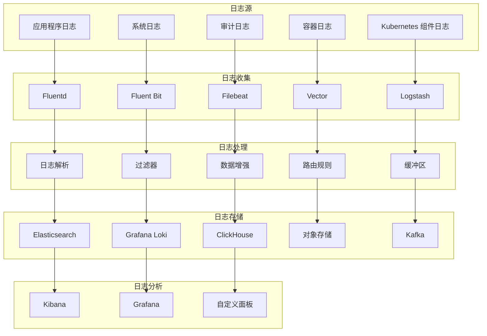

# Kubernetes 日志管理系统

## 概述

日志管理是 Kubernetes 可观测性的重要组成部分，通过收集、存储、分析和可视化系统运行时产生的日志数据，为故障排查、安全审计和性能优化提供详细的上下文信息。

### 日志架构



## 核心组件

### Fluentd

Fluentd 是一个开源的数据收集器，用于统一日志收集和处理。

#### 部署配置

```yaml
# fluentd-daemonset.yaml
apiVersion: apps/v1
kind: DaemonSet
metadata:
  name: fluentd
  namespace: logging
  labels:
    app: fluentd
spec:
  selector:
    matchLabels:
      app: fluentd
  template:
    metadata:
      labels:
        app: fluentd
    spec:
      serviceAccountName: fluentd
      containers:
      - name: fluentd
        image: fluent/fluentd-kubernetes-daemonset:v1.15-debian-elasticsearch7-1
        env:
        - name: FLUENT_ELASTICSEARCH_HOST
          value: "elasticsearch.logging.svc.cluster.local"
        - name: FLUENT_ELASTICSEARCH_PORT
          value: "9200"
        - name: FLUENT_ELASTICSEARCH_SCHEME
          value: "http"
        - name: FLUENT_ELASTICSEARCH_USER
          value: "elastic"
        - name: FLUENT_ELASTICSEARCH_PASSWORD
          valueFrom:
            secretKeyRef:
              name: elasticsearch-credentials
              key: password
        - name: FLUENT_ELASTICSEARCH_LOGSTASH_INDEX_NAME
          value: "kubernetes"
        - name: FLUENT_ELASTICSEARCH_LOGSTASH_PREFIX
          value: "kubernetes"
        - name: FLUENT_ELASTICSEARCH_RELOAD_CONNECTIONS
          value: "false"
        - name: FLUENT_ELASTICSEARCH_RECONNECT_ON_ERROR
          value: "true"
        - name: FLUENT_ELASTICSEARCH_RELOAD_ON_FAILURE
          value: "true"
        - name: FLUENT_ELASTICSEARCH_LOG_ES_400_REASON
          value: "false"
        - name: FLUENT_ELASTICSEARCH_REQUEST_TIMEOUT
          value: "5s"
        resources:
          limits:
            memory: 500Mi
            cpu: 500m
          requests:
            memory: 200Mi
            cpu: 100m
        volumeMounts:
        - name: varlog
          mountPath: /var/log
        - name: varlibdockercontainers
          mountPath: /var/lib/docker/containers
          readOnly: true
        - name: config-volume
          mountPath: /fluentd/etc
      volumes:
      - name: varlog
        hostPath:
          path: /var/log
      - name: varlibdockercontainers
        hostPath:
          path: /var/lib/docker/containers
      - name: config-volume
        configMap:
          name: fluentd-config
      tolerations:
      - key: node-role.kubernetes.io/master
        effect: NoSchedule
      - operator: Exists
        effect: NoExecute
      - operator: Exists
        effect: NoSchedule
```

#### Fluentd 配置

```yaml
# fluentd-config.yaml
apiVersion: v1
kind: ConfigMap
metadata:
  name: fluentd-config
  namespace: logging
data:
  fluent.conf: |
    # 系统级配置
    <system>
      root_dir /tmp/fluentd-buffers/
      log_level info
    </system>
    
    # 输入插件配置
    <source>
      @type tail
      @id in_tail_container_logs
      path /var/log/containers/*.log
      pos_file /var/log/fluentd-containers.log.pos
      tag raw.kubernetes.*
      read_from_head true
      <parse>
        @type multi_format
        <pattern>
          format json
          time_key time
          time_format %Y-%m-%dT%H:%M:%S.%NZ
        </pattern>
        <pattern>
          format /^(?<time>.+) (?<stream>stdout|stderr) [^ ]* (?<log>.*)$/
          time_format %Y-%m-%dT%H:%M:%S.%N%:z
        </pattern>
      </parse>
    </source>
    
    # Kubernetes 元数据增强
    <filter kubernetes.**>
      @type kubernetes_metadata
      @id filter_kube_metadata
      kubernetes_url "#{ENV['FLUENT_FILTER_KUBERNETES_URL'] || 'https://' + ENV.fetch('KUBERNETES_SERVICE_HOST') + ':' + ENV.fetch('KUBERNETES_SERVICE_PORT') + '/api'}"
      verify_ssl "#{ENV['KUBERNETES_VERIFY_SSL'] || true}"
      ca_file "#{ENV['KUBERNETES_CA_FILE']}"
      skip_labels "#{ENV['FLUENT_KUBERNETES_METADATA_SKIP_LABELS'] || 'false'}"
      skip_container_metadata "#{ENV['FLUENT_KUBERNETES_METADATA_SKIP_CONTAINER_METADATA'] || 'false'}"
      skip_master_url "#{ENV['FLUENT_KUBERNETES_METADATA_SKIP_MASTER_URL'] || 'false'}"
      skip_namespace_metadata "#{ENV['FLUENT_KUBERNETES_METADATA_SKIP_NAMESPACE_METADATA'] || 'false'}"
    </filter>
    
    # 系统日志过滤
    <filter kubernetes.var.log.containers.**fluentd**.log>
      @type grep
      <exclude>
        key log
        pattern /fluent/
      </exclude>
    </filter>
    
    <filter kubernetes.var.log.containers.**kube-system**.log>
      @type grep
      <exclude>
        key log
        pattern /health|ping|metrics/
      </exclude>
    </filter>
    
    # 日志解析和增强
    <filter kubernetes.var.log.containers.**>
      @type parser
      key_name log
      reserve_data true
      remove_key_name_field true
      <parse>
        @type multi_format
        <pattern>
          format json
        </pattern>
        <pattern>
          format none
        </pattern>
      </parse>
    </filter>
    
    # 添加标签和元数据
    <filter kubernetes.**>
      @type record_transformer
      enable_ruby
      <record>
        hostname "#{Socket.gethostname}"
        timestamp ${time.strftime('%Y-%m-%dT%H:%M:%S.%LZ')}
        cluster_name "#{ENV['CLUSTER_NAME'] || 'kubernetes'}"
        environment "#{ENV['ENVIRONMENT'] || 'production'}"
        log_level ${record.dig("level") || "info"}
        service_name ${record.dig("kubernetes", "labels", "app") || record.dig("kubernetes", "container_name")}
        namespace_name ${record.dig("kubernetes", "namespace_name")}
        pod_name ${record.dig("kubernetes", "pod_name")}
        container_name ${record.dig("kubernetes", "container_name")}
      </record>
    </filter>
    
    # 输出到 Elasticsearch
    <match kubernetes.**>
      @type elasticsearch
      @id out_es
      @log_level info
      include_tag_key true
      host "#{ENV['FLUENT_ELASTICSEARCH_HOST']}"
      port "#{ENV['FLUENT_ELASTICSEARCH_PORT']}"
      scheme "#{ENV['FLUENT_ELASTICSEARCH_SCHEME'] || 'http'}"
      ssl_verify "#{ENV['FLUENT_ELASTICSEARCH_SSL_VERIFY'] || 'true'}"
      user "#{ENV['FLUENT_ELASTICSEARCH_USER'] || use_default}"
      password "#{ENV['FLUENT_ELASTICSEARCH_PASSWORD'] || use_default}"
      reload_connections "#{ENV['FLUENT_ELASTICSEARCH_RELOAD_CONNECTIONS'] || 'false'}"
      reconnect_on_error "#{ENV['FLUENT_ELASTICSEARCH_RECONNECT_ON_ERROR'] || 'true'}"
      reload_on_failure "#{ENV['FLUENT_ELASTICSEARCH_RELOAD_ON_FAILURE'] || 'true'}"
      log_es_400_reason "#{ENV['FLUENT_ELASTICSEARCH_LOG_ES_400_REASON'] || 'false'}"
      logstash_prefix "#{ENV['FLUENT_ELASTICSEARCH_LOGSTASH_PREFIX'] || 'logstash'}"
      logstash_format true
      logstash_dateformat %Y.%m.%d
      index_name "#{ENV['FLUENT_ELASTICSEARCH_LOGSTASH_INDEX_NAME'] || 'logstash'}"
      type_name "fluentd"
      request_timeout "#{ENV['FLUENT_ELASTICSEARCH_REQUEST_TIMEOUT'] || '5s'}"
      <buffer>
        @type file
        path /var/log/fluentd-buffers/kubernetes.system.buffer
        flush_mode interval
        retry_type exponential_backoff
        flush_thread_count 2
        flush_interval 5s
        retry_forever
        retry_max_interval 30
        chunk_limit_size "#{ENV['FLUENT_ELASTICSEARCH_BUFFER_CHUNK_LIMIT_SIZE'] || '2M'}"
        queue_limit_length "#{ENV['FLUENT_ELASTICSEARCH_BUFFER_QUEUE_LIMIT_LENGTH'] || '8'}"
        overflow_action block
      </buffer>
    </match>
```

### Fluent Bit

Fluent Bit 是轻量级的日志处理器，适合资源受限的环境。

#### 部署配置

```yaml
# fluent-bit-daemonset.yaml
apiVersion: apps/v1
kind: DaemonSet
metadata:
  name: fluent-bit
  namespace: logging
spec:
  selector:
    matchLabels:
      app: fluent-bit
  template:
    metadata:
      labels:
        app: fluent-bit
    spec:
      serviceAccountName: fluent-bit
      containers:
      - name: fluent-bit
        image: fluent/fluent-bit:2.0.8
        ports:
        - containerPort: 2020
        env:
        - name: FLUENT_CONF
          value: "fluent-bit.conf"
        - name: FLUENT_OPT
          value: "--workdir=/fluent-bit/etc --config=/fluent-bit/etc/fluent-bit.conf"
        volumeMounts:
        - name: varlog
          mountPath: /var/log
        - name: varlibdockercontainers
          mountPath: /var/lib/docker/containers
          readOnly: true
        - name: fluent-bit-config
          mountPath: /fluent-bit/etc/
        - name: mnt
          mountPath: /mnt
          readOnly: true
        resources:
          limits:
            memory: 100Mi
            cpu: 100m
          requests:
            memory: 50Mi
            cpu: 50m
      volumes:
      - name: varlog
        hostPath:
          path: /var/log
      - name: varlibdockercontainers
        hostPath:
          path: /var/lib/docker/containers
      - name: fluent-bit-config
        configMap:
          name: fluent-bit-config
      - name: mnt
        hostPath:
          path: /mnt
      tolerations:
      - key: node-role.kubernetes.io/master
        operator: Exists
        effect: NoSchedule
      - operator: Exists
        effect: NoExecute
      - operator: Exists
        effect: NoSchedule
```

#### Fluent Bit 配置

```yaml
# fluent-bit-config.yaml
apiVersion: v1
kind: ConfigMap
metadata:
  name: fluent-bit-config
  namespace: logging
data:
  fluent-bit.conf: |
    [SERVICE]
        Flush         1
        Log_Level     info
        Daemon        off
        Parsers_File  parsers.conf
        HTTP_Server   On
        HTTP_Listen   0.0.0.0
        HTTP_Port     2020
        Health_Check  On
    
    [INPUT]
        Name              tail
        Tag               kube.*
        Path              /var/log/containers/*.log
        Parser            docker
        DB                /var/log/flb_kube.db
        Mem_Buf_Limit     50MB
        Skip_Long_Lines   On
        Refresh_Interval  10
    
    [INPUT]
        Name              systemd
        Tag               host.*
        Systemd_Filter    _SYSTEMD_UNIT=kubelet.service
        Systemd_Filter    _SYSTEMD_UNIT=docker.service
        Systemd_Filter    _SYSTEMD_UNIT=containerd.service
        Read_From_Tail    On
    
    [FILTER]
        Name                kubernetes
        Match               kube.*
        Kube_URL            https://kubernetes.default.svc:443
        Kube_CA_File        /var/run/secrets/kubernetes.io/serviceaccount/ca.crt
        Kube_Token_File     /var/run/secrets/kubernetes.io/serviceaccount/token
        Kube_Tag_Prefix     kube.var.log.containers.
        Merge_Log           On
        Merge_Log_Key       log_processed
        K8S-Logging.Parser  On
        K8S-Logging.Exclude Off
        Annotations         Off
        Labels              On
    
    [FILTER]
        Name                modify
        Match               *
        Add                 cluster_name kubernetes
        Add                 environment production
        Add                 hostname ${HOSTNAME}
    
    [FILTER]
        Name                grep
        Match               kube.*
        Exclude             kubernetes_namespace_name kube-system
        Exclude             kubernetes_namespace_name kube-public
        Exclude             kubernetes_namespace_name kube-node-lease
    
    [OUTPUT]
        Name                es
        Match               kube.*
        Host                elasticsearch.logging.svc.cluster.local
        Port                9200
        HTTP_User           elastic
        HTTP_Passwd         ${ELASTICSEARCH_PASSWORD}
        Logstash_Format     On
        Logstash_Prefix     kubernetes
        Logstash_DateFormat %Y.%m.%d
        Retry_Limit         False
        Type                flb_type
        Time_Key            @timestamp
        Replace_Dots        On
        Trace_Error         On
        Buffer_Size         4KB
    
    [OUTPUT]
        Name                stdout
        Match               host.*
        Format              json_lines
  
  parsers.conf: |
    [PARSER]
        Name   docker
        Format json
        Time_Key time
        Time_Format %Y-%m-%dT%H:%M:%S.%L
        Time_Precision nano
        Time_Keep On
    
    [PARSER]
        Name        k8s-nginx-ingress
        Format      regex
        Regex       ^(?<host>[^ ]*) - (?<user>[^ ]*) \[(?<time>[^\]]*)\] "(?<method>\S+)(?: +(?<path>[^\"]*?)(?: +\S*)?)?" (?<code>[^ ]*) (?<size>[^ ]*) "(?<referer>[^\"]*)" "(?<agent>[^\"]*)" (?<request_length>[^ ]*) (?<request_time>[^ ]*) \[(?<proxy_upstream_name>[^ ]*)\] \[(?<proxy_alternative_upstream_name>[^ ]*)\] (?<upstream_addr>[^ ]*) (?<upstream_response_length>[^ ]*) (?<upstream_response_time>[^ ]*) (?<upstream_status>[^ ]*) (?<reg_id>[^ ]*).*$
        Time_Key    time
        Time_Format %d/%b/%Y:%H:%M:%S %z
    
    [PARSER]
        Name        json
        Format      json
        Time_Key    time
        Time_Format %d/%b/%Y:%H:%M:%S %z
        Time_Keep   On
        Decode_Field_As escaped_utf8 log do_next
        Decode_Field_As json log
```

### Elasticsearch

Elasticsearch 是一个分布式搜索和分析引擎，用于存储和检索日志数据。

#### 部署配置

```yaml
# elasticsearch-deployment.yaml
apiVersion: apps/v1
kind: StatefulSet
metadata:
  name: elasticsearch
  namespace: logging
spec:
  serviceName: elasticsearch
  replicas: 3
  selector:
    matchLabels:
      app: elasticsearch
  template:
    metadata:
      labels:
        app: elasticsearch
    spec:
      containers:
      - name: elasticsearch
        image: docker.elastic.co/elasticsearch/elasticsearch:7.17.7
        resources:
          limits:
            cpu: 1000m
            memory: 2Gi
          requests:
            cpu: 500m
            memory: 1Gi
        ports:
        - containerPort: 9200
          name: rest
          protocol: TCP
        - containerPort: 9300
          name: inter-node
          protocol: TCP
        volumeMounts:
        - name: data
          mountPath: /usr/share/elasticsearch/data
        env:
        - name: cluster.name
          value: k8s-logs
        - name: node.name
          valueFrom:
            fieldRef:
              fieldPath: metadata.name
        - name: discovery.seed_hosts
          value: "elasticsearch-0.elasticsearch,elasticsearch-1.elasticsearch,elasticsearch-2.elasticsearch"
        - name: cluster.initial_master_nodes
          value: "elasticsearch-0,elasticsearch-1,elasticsearch-2"
        - name: ES_JAVA_OPTS
          value: "-Xms512m -Xmx512m"
        - name: xpack.security.enabled
          value: "false"
        - name: xpack.monitoring.collection.enabled
          value: "true"
      initContainers:
      - name: fix-permissions
        image: busybox
        command: ["sh", "-c", "chown -R 1000:1000 /usr/share/elasticsearch/data"]
        securityContext:
          privileged: true
        volumeMounts:
        - name: data
          mountPath: /usr/share/elasticsearch/data
      - name: increase-vm-max-map
        image: busybox
        command: ["sysctl", "-w", "vm.max_map_count=262144"]
        securityContext:
          privileged: true
      - name: increase-fd-ulimit
        image: busybox
        command: ["sh", "-c", "ulimit -n 65536"]
        securityContext:
          privileged: true
  volumeClaimTemplates:
  - metadata:
      name: data
      labels:
        app: elasticsearch
    spec:
      accessModes: [ "ReadWriteOnce" ]
      storageClassName: "fast-ssd"
      resources:
        requests:
          storage: 100Gi
```

#### Elasticsearch 服务配置

```yaml
# elasticsearch-service.yaml
apiVersion: v1
kind: Service
metadata:
  name: elasticsearch
  namespace: logging
  labels:
    app: elasticsearch
spec:
  selector:
    app: elasticsearch
  clusterIP: None
  ports:
  - port: 9200
    name: rest
  - port: 9300
    name: inter-node
---
apiVersion: v1
kind: Service
metadata:
  name: elasticsearch-client
  namespace: logging
  labels:
    app: elasticsearch
spec:
  selector:
    app: elasticsearch
  ports:
  - port: 9200
    name: rest
  type: ClusterIP
```

### Kibana

Kibana 是 Elasticsearch 的可视化界面，用于日志搜索和分析。

#### 部署配置

```yaml
# kibana-deployment.yaml
apiVersion: apps/v1
kind: Deployment
metadata:
  name: kibana
  namespace: logging
spec:
  replicas: 1
  selector:
    matchLabels:
      app: kibana
  template:
    metadata:
      labels:
        app: kibana
    spec:
      containers:
      - name: kibana
        image: docker.elastic.co/kibana/kibana:7.17.7
        resources:
          limits:
            cpu: 500m
            memory: 1Gi
          requests:
            cpu: 100m
            memory: 512Mi
        env:
        - name: ELASTICSEARCH_HOSTS
          value: "http://elasticsearch-client:9200"
        - name: SERVER_NAME
          value: "kibana"
        - name: SERVER_BASEPATH
          value: ""
        - name: SERVER_REWRITEBASEPATH
          value: "false"
        - name: XPACK_SECURITY_ENABLED
          value: "false"
        - name: XPACK_MONITORING_ENABLED
          value: "true"
        ports:
        - containerPort: 5601
        readinessProbe:
          httpGet:
            path: /api/status
            port: 5601
          initialDelaySeconds: 30
          periodSeconds: 10
        livenessProbe:
          httpGet:
            path: /api/status
            port: 5601
          initialDelaySeconds: 60
          periodSeconds: 30
---
apiVersion: v1
kind: Service
metadata:
  name: kibana
  namespace: logging
spec:
  selector:
    app: kibana
  ports:
  - port: 5601
    targetPort: 5601
  type: LoadBalancer
```

## 日志收集策略

### 应用日志收集

#### 应用日志格式标准化

```yaml
# 应用日志配置示例
logging_standards:
  json_format:
    timestamp: "2023-01-01T00:00:00.000Z"
    level: "INFO"
    logger: "com.example.Application"
    message: "User login successful"
    thread: "http-nio-8080-exec-1"
    mdc:
      userId: "12345"
      sessionId: "abcdef"
      requestId: "req-123"
      traceId: "trace-456"
      spanId: "span-789"
    exception:
      class: "java.lang.RuntimeException"
      message: "Something went wrong"
      stackTrace: "..."
    
  structured_fields:
    mandatory:
      - timestamp
      - level
      - message
    optional:
      - logger
      - thread
      - mdc
      - exception
    
  log_levels:
    - TRACE
    - DEBUG
    - INFO
    - WARN
    - ERROR
    - FATAL
```

#### 日志标注和过滤

```yaml
# 日志标注配置
log_annotations:
  # 启用日志收集
  prometheus.io/scrape: "true"
  fluentd.io/enabled: "true"
  fluentd.io/parser: "json"
  
  # 日志路径配置
  fluentd.io/path: "/var/log/app/*.log"
  fluentd.io/exclude-path: "/var/log/app/debug.log"
  
  # 日志格式配置
  fluentd.io/format: "json"
  fluentd.io/time-key: "timestamp"
  fluentd.io/time-format: "%Y-%m-%dT%H:%M:%S.%L%z"
  
  # 日志级别过滤
  fluentd.io/log-level: "INFO"
  fluentd.io/exclude-pattern: "health|ping|metrics"
  
  # 数据增强
  fluentd.io/add-hostname: "true"
  fluentd.io/add-kubernetes-metadata: "true"
```

### 系统日志收集

#### 系统组件日志配置

```yaml
# 系统日志收集配置
system_logs:
  kubelet:
    path: "/var/log/kubelet.log"
    format: "multiline"
    multiline_pattern: "^[A-Z]\\d{4}"
    tags:
      - "kubernetes"
      - "kubelet"
      - "system"
  
  kube-apiserver:
    path: "/var/log/kube-apiserver.log"
    format: "json"
    fields:
      - "timestamp"
      - "level"
      - "message"
      - "component"
    tags:
      - "kubernetes"
      - "apiserver"
      - "system"
  
  kube-scheduler:
    path: "/var/log/kube-scheduler.log"
    format: "json"
    tags:
      - "kubernetes"
      - "scheduler"
      - "system"
  
  kube-controller-manager:
    path: "/var/log/kube-controller-manager.log"
    format: "json"
    tags:
      - "kubernetes"
      - "controller-manager"
      - "system"
  
  etcd:
    path: "/var/log/etcd.log"
    format: "json"
    tags:
      - "kubernetes"
      - "etcd"
      - "system"
  
  docker:
    path: "/var/log/docker.log"
    format: "json"
    tags:
      - "docker"
      - "container-runtime"
      - "system"
  
  containerd:
    path: "/var/log/containerd.log"
    format: "json"
    tags:
      - "containerd"
      - "container-runtime"
      - "system"
```

### 审计日志收集

#### Kubernetes 审计日志配置

```yaml
# audit-policy.yaml
apiVersion: audit.k8s.io/v1
kind: Policy
rules:
  # 记录所有请求的元数据
  - level: Metadata
    omitStages:
      - RequestReceived
    resources:
    - group: ""
      resources: ["pods", "services", "secrets", "configmaps"]
    - group: "apps"
      resources: ["deployments", "replicasets", "daemonsets", "statefulsets"]
    - group: "extensions"
      resources: ["deployments", "replicasets", "daemonsets"]
    - group: "batch"
      resources: ["jobs", "cronjobs"]
    - group: "networking.k8s.io"
      resources: ["networkpolicies", "ingresses"]
    - group: "rbac.authorization.k8s.io"
      resources: ["roles", "rolebindings", "clusterroles", "clusterrolebindings"]
  
  # 记录 Pod 变更的详细信息
  - level: RequestResponse
    omitStages:
      - RequestReceived
    resources:
    - group: ""
      resources: ["pods"]
    verbs: ["create", "delete", "update", "patch"]
  
  # 记录 Secret 访问
  - level: Request
    omitStages:
      - RequestReceived
    resources:
    - group: ""
      resources: ["secrets"]
    verbs: ["get", "list"]
  
  # 记录所有身份验证失败
  - level: Request
    omitStages:
      - RequestReceived
    namespaces: [""]
    verbs: [""]
    resources: [""]
    
  # 忽略系统级别的请求
  - level: None
    users: ["system:serviceaccount:kube-system:*"]
    verbs: ["get", "list", "watch"]
  
  # 忽略健康检查
  - level: None
    nonResourceURLs:
      - /healthz*
      - /readyz*
      - /livez*
      - /version
      - /metrics
```

## 日志处理和分析

### 日志解析规则

#### 常见日志格式解析

```yaml
# 日志解析规则配置
parsing_rules:
  # Nginx 访问日志
  nginx_access:
    pattern: |
      ^(?<remote>[^ ]*) (?<host>[^ ]*) (?<user>[^ ]*) \[(?<time>[^\]]*)\] "(?<method>\S+)(?: +(?<path>[^\"]*?)(?: +\S*)?)?" (?<code>[^ ]*) (?<size>[^ ]*)(?: "(?<referer>[^\"]*)" "(?<agent>[^\"]*)")?$
    time_format: "%d/%b/%Y:%H:%M:%S %z"
    fields:
      - remote_addr
      - host
      - remote_user
      - time_local
      - request_method
      - request_uri
      - status
      - body_bytes_sent
      - http_referer
      - http_user_agent
  
  # Apache 访问日志
  apache_access:
    pattern: |
      ^(?<host>[^ ]*) [^ ]* (?<user>[^ ]*) \[(?<time>[^\]]*)\] "(?<method>\S+) (?<path>[^\"]*) HTTP/[0-9.]*" (?<status>[^ ]*) (?<size>[^ ]*)( "(?<referer>[^\"]*)" "(?<agent>[^\"]*)")?$
    time_format: "%d/%b/%Y:%H:%M:%S %z"
  
  # Java 应用日志
  java_application:
    pattern: |
      ^(?<timestamp>\d{4}-\d{2}-\d{2} \d{2}:\d{2}:\d{2}.\d{3}) \[(?<thread>[^\]]+)\] (?<level>\w+) {1,2}(?<logger>[^ ]+) - (?<message>.*)$
    time_format: "%Y-%m-%d %H:%M:%S.%L"
  
  # MySQL 慢查询日志
  mysql_slow:
    pattern: |
      ^# Time: (?<time>\d{4}-\d{2}-\d{2}T\d{2}:\d{2}:\d{2}.\d+Z)[\s\S]*?# Query_time: (?<query_time>[\d.]+)\s+Lock_time: (?<lock_time>[\d.]+)\s+Rows_sent: (?<rows_sent>\d+)\s+Rows_examined: (?<rows_examined>\d+)[\s\S]*?(?<query>.*?)(?=# Time:|$)
    time_format: "%Y-%m-%dT%H:%M:%S.%L%z"
  
  # PostgreSQL 日志
  postgresql:
    pattern: |
      ^(?<timestamp>\d{4}-\d{2}-\d{2} \d{2}:\d{2}:\d{2}.\d{3} \w+) \[(?<pid>\d+)\] (?<level>\w+): {1,2}(?<message>.*)$
    time_format: "%Y-%m-%d %H:%M:%S.%L %Z"
```

### 日志增强和标准化

#### 元数据增强

```yaml
# 日志元数据增强配置
metadata_enrichment:
  kubernetes_metadata:
    - namespace_name
    - pod_name
    - container_name
    - container_image
    - pod_ip
    - node_name
    - labels
    - annotations
  
  infrastructure_metadata:
    - hostname
    - cluster_name
    - region
    - availability_zone
    - instance_type
    - environment
  
  application_metadata:
    - service_name
    - service_version
    - deployment_name
    - team_name
    - project_name
    - cost_center
  
  trace_metadata:
    - trace_id
    - span_id
    - parent_span_id
    - operation_name
    - trace_flags
```

#### 日志规范化

```yaml
# 日志规范化配置
log_normalization:
  timestamp_standardization:
    target_format: "ISO8601"
    timezone: "UTC"
    precision: "milliseconds"
  
  level_mapping:
    trace: "TRACE"
    debug: "DEBUG"
    info: "INFO"
    warn: "WARN"
    error: "ERROR"
    fatal: "FATAL"
    # 映射非标准级别
    verbose: "DEBUG"
    warning: "WARN"
    critical: "ERROR"
    emergency: "FATAL"
  
  field_standardization:
    message_field: "message"
    timestamp_field: "@timestamp"
    level_field: "level"
    logger_field: "logger"
    thread_field: "thread"
    exception_field: "exception"
    
  sensitive_data_masking:
    patterns:
      - name: "password"
        regex: '(?i)(password|pwd|passwd)["\s]*[:=]["\s]*([^"\s,}]+)'
        replacement: '${1}": "***"'
      - name: "credit_card"
        regex: '\b(?:\d{4}[-\s]?){3}\d{4}\b'
        replacement: "****-****-****-****"
      - name: "ssn"
        regex: '\b\d{3}-\d{2}-\d{4}\b'
        replacement: "***-**-****"
      - name: "email"
        regex: '\b[A-Za-z0-9._%+-]+@[A-Za-z0-9.-]+\.[A-Z|a-z]{2,}\b'
        replacement: "***@***.***"
```

## 日志存储和索引

### Elasticsearch 索引策略

#### 索引模板配置

```yaml
# Elasticsearch 索引模板
index_template:
  name: "kubernetes-logs"
  pattern: "kubernetes-*"
  settings:
    number_of_shards: 3
    number_of_replicas: 1
    refresh_interval: "5s"
    max_result_window: 50000
    
    # 索引生命周期管理
    lifecycle:
      policy: "kubernetes-logs-policy"
      rollover_alias: "kubernetes-logs-write"
    
    # 分析器配置
    analysis:
      analyzer:
        default:
          type: "standard"
          stopwords: "_english_"
        log_analyzer:
          type: "custom"
          tokenizer: "standard"
          filter:
            - "lowercase"
            - "stop"
            - "snowball"
  
  mappings:
    properties:
      "@timestamp":
        type: "date"
        format: "strict_date_optional_time||epoch_millis"
      level:
        type: "keyword"
      message:
        type: "text"
        analyzer: "log_analyzer"
        fields:
          keyword:
            type: "keyword"
            ignore_above: 256
      logger:
        type: "keyword"
      thread:
        type: "keyword"
      kubernetes:
        properties:
          namespace_name:
            type: "keyword"
          pod_name:
            type: "keyword"
          container_name:
            type: "keyword"
          container_image:
            type: "keyword"
          node_name:
            type: "keyword"
          labels:
            type: "object"
            dynamic: true
          annotations:
            type: "object"
            dynamic: true
      trace:
        properties:
          trace_id:
            type: "keyword"
          span_id:
            type: "keyword"
          parent_span_id:
            type: "keyword"
      exception:
        properties:
          class:
            type: "keyword"
          message:
            type: "text"
          stack_trace:
            type: "text"
```

#### 索引生命周期管理

```yaml
# 索引生命周期策略
lifecycle_policy:
  name: "kubernetes-logs-policy"
  phases:
    hot:
      actions:
        rollover:
          max_size: "10GB"
          max_age: "1d"
          max_docs: 1000000
        set_priority:
          priority: 100
    
    warm:
      min_age: "1d"
      actions:
        allocate:
          number_of_replicas: 0
        forcemerge:
          max_num_segments: 1
        set_priority:
          priority: 50
    
    cold:
      min_age: "7d"
      actions:
        allocate:
          number_of_replicas: 0
        set_priority:
          priority: 0
    
    delete:
      min_age: "30d"
      actions:
        delete: {}
```

### 索引优化

#### 分片和路由策略

```yaml
# 索引分片策略
sharding_strategy:
  # 基于时间的分片
  time_based_sharding:
    pattern: "kubernetes-logs-{yyyy.MM.dd}"
    rollover_frequency: "daily"
    retention_period: "30d"
  
  # 基于命名空间的路由
  namespace_routing:
    enabled: true
    routing_field: "kubernetes.namespace_name"
    benefits:
      - "improved query performance"
      - "better resource isolation"
      - "simplified data management"
  
  # 分片大小优化
  shard_sizing:
    target_shard_size: "20-50GB"
    max_docs_per_shard: 2000000000
    considerations:
      - "search performance"
      - "indexing throughput"
      - "cluster stability"
```

## 日志查询和分析

### 常用查询模式

#### Elasticsearch 查询示例

```json
{
  "query": {
    "bool": {
      "must": [
        {
          "range": {
            "@timestamp": {
              "gte": "now-1h",
              "lte": "now"
            }
          }
        },
        {
          "term": {
            "level": "ERROR"
          }
        }
      ],
      "filter": [
        {
          "term": {
            "kubernetes.namespace_name": "production"
          }
        }
      ]
    }
  },
  "aggs": {
    "error_count_by_service": {
      "terms": {
        "field": "kubernetes.labels.app",
        "size": 10
      }
    },
    "error_timeline": {
      "date_histogram": {
        "field": "@timestamp",
        "fixed_interval": "5m"
      }
    }
  },
  "sort": [
    {
      "@timestamp": {
        "order": "desc"
      }
    }
  ]
}
```

#### 常见查询场景

```yaml
# 日志查询场景
query_scenarios:
  error_analysis:
    description: "错误日志分析"
    query: |
      level:ERROR AND NOT message:(/health|/metrics|/ping/)
    aggregations:
      - by_service
      - by_error_type
      - by_time_interval
    
  performance_monitoring:
    description: "性能日志监控"
    query: |
      message:("slow query" OR "timeout" OR "high latency")
    filters:
      - time_range: "last_1_hour"
      - namespace: "production"
    
  security_audit:
    description: "安全审计查询"
    query: |
      (kubernetes.labels.security:"true" OR message:("authentication failed" OR "authorization denied"))
    fields:
      - "@timestamp"
      - "kubernetes.pod_name"
      - "kubernetes.namespace_name"
      - "message"
      - "user"
      - "source_ip"
    
  business_transaction:
    description: "业务事务跟踪"
    query: |
      trace.trace_id:"your-trace-id"
    sort:
      - "@timestamp": "asc"
    include:
      - "trace.span_id"
      - "service_name"
      - "operation_name"
      - "duration"
      - "status"
```

### 日志分析和可视化

#### Kibana 仪表板配置

```yaml
# Kibana 仪表板配置
kibana_dashboards:
  application_overview:
    title: "应用程序概览"
    panels:
      - type: "line_chart"
        title: "日志量趋势"
        query: "*"
        aggregation: "count"
        time_field: "@timestamp"
        interval: "auto"
      
      - type: "pie_chart"
        title: "日志级别分布"
        query: "*"
        aggregation: "terms"
        field: "level"
        size: 5
      
      - type: "data_table"
        title: "错误日志详情"
        query: "level:ERROR"
        columns:
          - "@timestamp"
          - "kubernetes.namespace_name"
          - "kubernetes.pod_name"
          - "message"
        size: 10
      
      - type: "heatmap"
        title: "服务错误热力图"
        query: "level:ERROR"
        x_axis: "@timestamp"
        y_axis: "kubernetes.labels.app"
        aggregation: "count"
  
  infrastructure_monitoring:
    title: "基础设施监控"
    panels:
      - type: "metric"
        title: "总日志数"
        query: "*"
        aggregation: "count"
      
      - type: "metric"
        title: "错误率"
        query: "level:ERROR"
        aggregation: "percentage"
        base_query: "*"
      
      - type: "bar_chart"
        title: "按命名空间分组的日志量"
        query: "*"
        aggregation: "terms"
        field: "kubernetes.namespace_name"
        size: 10
      
      - type: "timeline"
        title: "系统事件时间线"
        query: "kubernetes.labels.component:system"
        time_field: "@timestamp"
        title_field: "kubernetes.pod_name"
        description_field: "message"
```

## 告警和通知

### 日志告警配置

#### ElastAlert 告警规则

```yaml
# elastalert-rules.yaml
error_spike_alert:
  name: "Error Spike Alert"
  type: "spike"
  index: "kubernetes-*"
  timeframe:
    minutes: 5
  threshold_ref: 10
  threshold_cur: 50
  spike_height: 3
  spike_type: "up"
  filter:
    - term:
        level: "ERROR"
  alert:
    - "email"
    - "slack"
  email:
    - "ops-team@company.com"
  slack:
    slack_webhook_url: "https://hooks.slack.com/services/YOUR/SLACK/WEBHOOK"
    slack_channel: "#alerts"
    slack_username: "ElastAlert"

application_down_alert:
  name: "Application Down Alert"
  type: "flatline"
  index: "kubernetes-*"
  timeframe:
    minutes: 5
  threshold: 1
  filter:
    - term:
        kubernetes.labels.app: "web-app"
    - term:
        level: "INFO"
  alert:
    - "email"
    - "pagerduty"
  email:
    - "on-call@company.com"
  pagerduty:
    pagerduty_service_key: "YOUR_PAGERDUTY_SERVICE_KEY"

security_event_alert:
  name: "Security Event Alert"
  type: "any"
  index: "kubernetes-*"
  filter:
    - query:
        query_string:
          query: 'message:("authentication failed" OR "authorization denied" OR "suspicious activity")'
  alert:
    - "email"
    - "slack"
  email:
    - "security-team@company.com"
  slack:
    slack_webhook_url: "https://hooks.slack.com/services/YOUR/SLACK/WEBHOOK"
    slack_channel: "#security-alerts"
    slack_username: "SecurityAlert"
  alert_text: |
    Security event detected:
    Time: {0}
    Namespace: {1}
    Pod: {2}
    Message: {3}
  alert_text_args:
    - "@timestamp"
    - "kubernetes.namespace_name"
    - "kubernetes.pod_name"
    - "message"
```

## 性能优化

### 日志收集优化

#### 收集器性能调优

```yaml
# 性能优化配置
performance_optimization:
  fluent_bit:
    # 内存限制
    mem_buf_limit: "50MB"
    # 缓冲区配置
    buffer_chunk_size: "1MB"
    buffer_max_size: "10MB"
    # 刷新间隔
    flush_interval: "5s"
    # 工作线程数
    workers: 2
    # 日志解析优化
    parsers_file: "/fluent-bit/etc/parsers.conf"
    # 过滤器优化
    filters:
      - name: "kubernetes"
        merge_log: "On"
        k8s_logging_parser: "On"
        k8s_logging_exclude: "Off"
  
  fluentd:
    # 缓冲区配置
    buffer_type: "file"
    buffer_path: "/var/log/fluentd-buffers/"
    buffer_chunk_limit: "2MB"
    buffer_queue_limit: "8"
    # 刷新配置
    flush_interval: "5s"
    flush_mode: "interval"
    flush_thread_count: 2
    # 重试配置
    retry_type: "exponential_backoff"
    retry_max_interval: "30s"
    retry_forever: true
```

### 存储优化

#### Elasticsearch 性能调优

```yaml
# Elasticsearch 性能调优
elasticsearch_tuning:
  # JVM 堆大小设置
  jvm_heap:
    initial: "1g"
    maximum: "1g"
    ratio: "50%"  # 不超过系统内存的50%
  
  # 索引设置
  index_settings:
    refresh_interval: "30s"  # 降低刷新频率
    number_of_replicas: 0    # 写入阶段不设置副本
    translog_durability: "async"  # 异步事务日志
    translog_sync_interval: "5s"
  
  # 批量写入优化
  bulk_operations:
    bulk_size: "10MB"
    bulk_actions: 1000
    flush_interval: "10s"
    concurrent_requests: 1
  
  # 查询优化
  query_optimization:
    max_result_window: 10000
    search_timeout: "30s"
    scroll_timeout: "5m"
    default_operator: "AND"
```

## 故障排查

### 常见问题诊断

#### 日志收集问题

```bash
# 检查日志收集器状态
kubectl get pods -n logging
kubectl logs -n logging fluent-bit-xxxxx

# 检查日志文件权限
ls -la /var/log/containers/
ls -la /var/lib/docker/containers/

# 检查存储空间
df -h
du -sh /var/log/

# 检查网络连接
telnet elasticsearch.logging.svc.cluster.local 9200
curl -X GET "elasticsearch:9200/_cluster/health"
```

#### Elasticsearch 问题

```bash
# 检查集群状态
curl -X GET "elasticsearch:9200/_cluster/health?pretty"
curl -X GET "elasticsearch:9200/_cat/nodes?v"
curl -X GET "elasticsearch:9200/_cat/indices?v"

# 检查索引状态
curl -X GET "elasticsearch:9200/_cat/shards?v"
curl -X GET "elasticsearch:9200/_cluster/allocation/explain?pretty"

# 检查查询性能
curl -X GET "elasticsearch:9200/_cat/pending_tasks?v"
curl -X GET "elasticsearch:9200/_nodes/stats/indices/search?pretty"
```

#### 性能问题诊断

```bash
# 检查资源使用
kubectl top pods -n logging
kubectl describe pod elasticsearch-0 -n logging

# 检查日志收集延迟
kubectl logs -n logging fluent-bit-xxxxx | grep "flush"
kubectl logs -n logging fluentd-xxxxx | grep "buffer"

# 检查索引性能
curl -X GET "elasticsearch:9200/_cat/thread_pool/write?v"
curl -X GET "elasticsearch:9200/_nodes/stats/indices/indexing?pretty"
```

## 最佳实践

### 日志管理最佳实践

```yaml
# 日志管理最佳实践
best_practices:
  log_design:
    - "使用结构化日志格式 (JSON)"
    - "包含必要的上下文信息"
    - "避免记录敏感信息"
    - "合理设置日志级别"
    - "使用唯一标识符关联日志"
  
  collection_optimization:
    - "选择适合的日志收集器"
    - "配置合理的缓冲区大小"
    - "设置适当的刷新间隔"
    - "使用标签和过滤器优化"
    - "监控收集器性能"
  
  storage_management:
    - "设计合理的索引策略"
    - "配置生命周期管理"
    - "优化分片和副本设置"
    - "定期清理历史数据"
    - "监控存储使用情况"
  
  query_optimization:
    - "使用时间范围限制查询"
    - "避免使用通配符开头的查询"
    - "合理使用聚合功能"
    - "缓存常用查询结果"
    - "优化查询语句"
  
  security_considerations:
    - "配置访问控制"
    - "加密传输数据"
    - "脱敏敏感信息"
    - "定期审计日志访问"
    - "监控异常活动"
```

## 总结

日志管理系统是 Kubernetes 可观测性的核心组件，通过统一的日志收集、存储、分析和可视化，为运维团队提供强大的故障排查和分析能力。关键要点包括：

1. **统一收集**：标准化日志格式和收集流程
2. **高效处理**：优化解析、过滤和增强逻辑
3. **可扩展存储**：合理设计索引策略和生命周期管理
4. **智能分析**：构建有效的查询和可视化方案
5. **及时告警**：配置关键指标的实时监控和通知

通过系统性的日志管理实践，能够实现对 Kubernetes 集群的全面日志可观测性，为系统稳定运行提供坚实保障。
