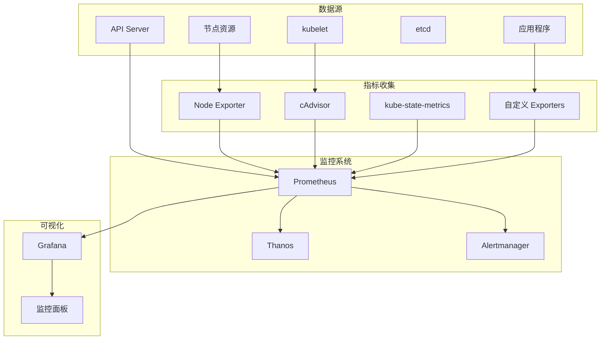

# Kubernetes 指标监控系统

## 概述

指标监控是 Kubernetes 可观测性的核心组件，通过收集、存储和分析数值型时间序列数据，为系统运维提供实时的性能洞察和告警能力。

### 监控架构



## 核心组件

### Prometheus

Prometheus 是云原生监控的事实标准，提供多维数据模型和强大的查询语言。

#### 部署配置

```yaml
# prometheus-deployment.yaml
apiVersion: apps/v1
kind: Deployment
metadata:
  name: prometheus
  namespace: monitoring
spec:
  replicas: 1
  selector:
    matchLabels:
      app: prometheus
  template:
    metadata:
      labels:
        app: prometheus
    spec:
      containers:
      - name: prometheus
        image: prom/prometheus:v2.40.0
        args:
          - '--config.file=/etc/prometheus/prometheus.yml'
          - '--storage.tsdb.path=/prometheus/'
          - '--web.console.libraries=/etc/prometheus/console_libraries'
          - '--web.console.templates=/etc/prometheus/consoles'
          - '--storage.tsdb.retention.time=15d'
          - '--web.enable-lifecycle'
          - '--web.enable-admin-api'
        ports:
        - containerPort: 9090
        volumeMounts:
        - name: prometheus-config
          mountPath: /etc/prometheus/
        - name: prometheus-storage
          mountPath: /prometheus/
        resources:
          requests:
            memory: "1Gi"
            cpu: "500m"
          limits:
            memory: "2Gi"
            cpu: "1000m"
      volumes:
      - name: prometheus-config
        configMap:
          name: prometheus-config
      - name: prometheus-storage
        persistentVolumeClaim:
          claimName: prometheus-pvc
```

#### 配置文件

```yaml
# prometheus-config.yaml
apiVersion: v1
kind: ConfigMap
metadata:
  name: prometheus-config
  namespace: monitoring
data:
  prometheus.yml: |
    global:
      scrape_interval: 15s
      evaluation_interval: 15s
      external_labels:
        cluster: 'kubernetes-cluster'
        region: 'us-west-2'
    
    rule_files:
      - "/etc/prometheus/rules/*.yml"
    
    alerting:
      alertmanagers:
        - static_configs:
            - targets:
              - alertmanager:9093
    
    scrape_configs:
      # Kubernetes API Server
      - job_name: 'kubernetes-apiservers'
        kubernetes_sd_configs:
        - role: endpoints
        scheme: https
        tls_config:
          ca_file: /var/run/secrets/kubernetes.io/serviceaccount/ca.crt
        bearer_token_file: /var/run/secrets/kubernetes.io/serviceaccount/token
        relabel_configs:
        - source_labels: [__meta_kubernetes_namespace, __meta_kubernetes_service_name, __meta_kubernetes_endpoint_port_name]
          action: keep
          regex: default;kubernetes;https
      
      # Kubernetes Nodes
      - job_name: 'kubernetes-nodes'
        kubernetes_sd_configs:
        - role: node
        scheme: https
        tls_config:
          ca_file: /var/run/secrets/kubernetes.io/serviceaccount/ca.crt
        bearer_token_file: /var/run/secrets/kubernetes.io/serviceaccount/token
        relabel_configs:
        - action: labelmap
          regex: __meta_kubernetes_node_label_(.+)
        - target_label: __address__
          replacement: kubernetes.default.svc:443
        - source_labels: [__meta_kubernetes_node_name]
          regex: (.+)
          target_label: __metrics_path__
          replacement: /api/v1/nodes/${1}/proxy/metrics
      
      # Kubernetes Pods
      - job_name: 'kubernetes-pods'
        kubernetes_sd_configs:
        - role: pod
        relabel_configs:
        - source_labels: [__meta_kubernetes_pod_annotation_prometheus_io_scrape]
          action: keep
          regex: true
        - source_labels: [__meta_kubernetes_pod_annotation_prometheus_io_path]
          action: replace
          target_label: __metrics_path__
          regex: (.+)
        - source_labels: [__address__, __meta_kubernetes_pod_annotation_prometheus_io_port]
          action: replace
          regex: ([^:]+)(?::\d+)?;(\d+)
          replacement: $1:$2
          target_label: __address__
        - action: labelmap
          regex: __meta_kubernetes_pod_label_(.+)
        - source_labels: [__meta_kubernetes_namespace]
          action: replace
          target_label: kubernetes_namespace
        - source_labels: [__meta_kubernetes_pod_name]
          action: replace
          target_label: kubernetes_pod_name
      
      # Node Exporter
      - job_name: 'node-exporter'
        kubernetes_sd_configs:
        - role: endpoints
        relabel_configs:
        - source_labels: [__meta_kubernetes_endpoints_name]
          regex: 'node-exporter'
          action: keep
      
      # kube-state-metrics
      - job_name: 'kube-state-metrics'
        static_configs:
        - targets: ['kube-state-metrics:8080']
      
      # Custom Applications
      - job_name: 'custom-apps'
        kubernetes_sd_configs:
        - role: endpoints
        relabel_configs:
        - source_labels: [__meta_kubernetes_service_annotation_prometheus_io_scrape]
          action: keep
          regex: true
        - source_labels: [__meta_kubernetes_service_annotation_prometheus_io_scheme]
          action: replace
          target_label: __scheme__
          regex: (https?)
        - source_labels: [__meta_kubernetes_service_annotation_prometheus_io_path]
          action: replace
          target_label: __metrics_path__
          regex: (.+)
        - source_labels: [__address__, __meta_kubernetes_service_annotation_prometheus_io_port]
          action: replace
          target_label: __address__
          regex: ([^:]+)(?::\d+)?;(\d+)
          replacement: $1:$2
        - action: labelmap
          regex: __meta_kubernetes_service_label_(.+)
        - source_labels: [__meta_kubernetes_namespace]
          action: replace
          target_label: kubernetes_namespace
        - source_labels: [__meta_kubernetes_service_name]
          action: replace
          target_label: kubernetes_name
```

### Node Exporter

Node Exporter 收集宿主机的系统级指标。

#### 部署配置

```yaml
# node-exporter-daemonset.yaml
apiVersion: apps/v1
kind: DaemonSet
metadata:
  name: node-exporter
  namespace: monitoring
  labels:
    app: node-exporter
spec:
  selector:
    matchLabels:
      app: node-exporter
  template:
    metadata:
      labels:
        app: node-exporter
    spec:
      hostNetwork: true
      hostPID: true
      containers:
      - name: node-exporter
        image: prom/node-exporter:v1.4.0
        args:
          - '--path.procfs=/host/proc'
          - '--path.sysfs=/host/sys'
          - '--path.rootfs=/host/root'
          - '--collector.filesystem.mount-points-exclude=^/(sys|proc|dev|host|etc)($$|/)'
          - '--collector.netdev.device-exclude=^(veth.*|docker.*|lo)$$'
          - '--collector.processes'
          - '--collector.systemd'
          - '--collector.tcpstat'
        ports:
        - containerPort: 9100
          protocol: TCP
          name: metrics
        volumeMounts:
        - name: proc
          mountPath: /host/proc
          readOnly: true
        - name: sys
          mountPath: /host/sys
          readOnly: true
        - name: root
          mountPath: /host/root
          mountPropagation: HostToContainer
          readOnly: true
        resources:
          requests:
            memory: "64Mi"
            cpu: "50m"
          limits:
            memory: "128Mi"
            cpu: "100m"
      volumes:
      - name: proc
        hostPath:
          path: /proc
      - name: sys
        hostPath:
          path: /sys
      - name: root
        hostPath:
          path: /
      tolerations:
      - operator: Exists
```

### kube-state-metrics

kube-state-metrics 暴露 Kubernetes 资源对象的状态信息。

#### 部署配置

```yaml
# kube-state-metrics-deployment.yaml
apiVersion: apps/v1
kind: Deployment
metadata:
  name: kube-state-metrics
  namespace: monitoring
spec:
  replicas: 1
  selector:
    matchLabels:
      app: kube-state-metrics
  template:
    metadata:
      labels:
        app: kube-state-metrics
    spec:
      serviceAccountName: kube-state-metrics
      containers:
      - name: kube-state-metrics
        image: k8s.gcr.io/kube-state-metrics/kube-state-metrics:v2.6.0
        ports:
        - containerPort: 8080
          name: http-metrics
        - containerPort: 8081
          name: telemetry
        args:
          - --collectors=certificatesigningrequests
          - --collectors=configmaps
          - --collectors=cronjobs
          - --collectors=daemonsets
          - --collectors=deployments
          - --collectors=endpoints
          - --collectors=horizontalpodautoscalers
          - --collectors=ingresses
          - --collectors=jobs
          - --collectors=limitranges
          - --collectors=mutatingwebhookconfigurations
          - --collectors=namespaces
          - --collectors=networkpolicies
          - --collectors=nodes
          - --collectors=persistentvolumeclaims
          - --collectors=persistentvolumes
          - --collectors=poddisruptionbudgets
          - --collectors=pods
          - --collectors=replicasets
          - --collectors=replicationcontrollers
          - --collectors=resourcequotas
          - --collectors=secrets
          - --collectors=services
          - --collectors=statefulsets
          - --collectors=storageclasses
          - --collectors=validatingwebhookconfigurations
          - --collectors=volumeattachments
        resources:
          requests:
            memory: "64Mi"
            cpu: "50m"
          limits:
            memory: "128Mi"
            cpu: "100m"
        readinessProbe:
          httpGet:
            path: /healthz
            port: 8080
          initialDelaySeconds: 5
          timeoutSeconds: 5
        livenessProbe:
          httpGet:
            path: /healthz
            port: 8080
          initialDelaySeconds: 30
          timeoutSeconds: 5
```

## 监控分类

### 节点监控 {#node-monitoring}

#### 系统资源监控

```promql
# CPU 使用率
100 - (avg by (instance) (irate(node_cpu_seconds_total{mode="idle"}[5m])) * 100)

# 内存使用率
(1 - (node_memory_MemAvailable_bytes / node_memory_MemTotal_bytes)) * 100

# 磁盘使用率
100 - ((node_filesystem_avail_bytes{mountpoint="/"} / node_filesystem_size_bytes{mountpoint="/"}) * 100)

# 磁盘 I/O 使用率
100 * (irate(node_disk_io_time_seconds_total[5m]))

# 网络带宽使用率
irate(node_network_receive_bytes_total{device!="lo"}[5m]) * 8 / 1000000  # Mbps
irate(node_network_transmit_bytes_total{device!="lo"}[5m]) * 8 / 1000000  # Mbps

# 负载平均值
node_load1
node_load5
node_load15

# 文件描述符使用率
(node_filefd_allocated / node_filefd_maximum) * 100
```

#### 节点告警规则

```yaml
# node-alerts.yaml
groups:
- name: node-alerts
  rules:
  - alert: NodeCPUHighUsage
    expr: 100 - (avg by (instance) (irate(node_cpu_seconds_total{mode="idle"}[5m])) * 100) > 80
    for: 5m
    labels:
      severity: warning
      category: node
    annotations:
      summary: "Node CPU usage is high"
      description: "Node {{ $labels.instance }} has CPU usage above 80% for more than 5 minutes."
      
  - alert: NodeMemoryHighUsage
    expr: (1 - (node_memory_MemAvailable_bytes / node_memory_MemTotal_bytes)) * 100 > 85
    for: 5m
    labels:
      severity: warning
      category: node
    annotations:
      summary: "Node memory usage is high"
      description: "Node {{ $labels.instance }} has memory usage above 85% for more than 5 minutes."
      
  - alert: NodeDiskSpaceHighUsage
    expr: 100 - ((node_filesystem_avail_bytes{mountpoint="/"} / node_filesystem_size_bytes{mountpoint="/"}) * 100) > 85
    for: 5m
    labels:
      severity: warning
      category: node
    annotations:
      summary: "Node disk space usage is high"
      description: "Node {{ $labels.instance }} has disk space usage above 85% for more than 5 minutes."
      
  - alert: NodeLoadHigh
    expr: node_load5 > 2
    for: 10m
    labels:
      severity: warning
      category: node
    annotations:
      summary: "Node load is high"
      description: "Node {{ $labels.instance }} has load5 above 2 for more than 10 minutes."
```

### 网络监控 {#network-monitoring}

#### 网络指标查询

```promql
# 网络接口状态
node_network_up{device!="lo"}

# 网络流量
rate(node_network_receive_bytes_total{device!="lo"}[5m])
rate(node_network_transmit_bytes_total{device!="lo"}[5m])

# 网络错误率
rate(node_network_receive_errs_total{device!="lo"}[5m])
rate(node_network_transmit_errs_total{device!="lo"}[5m])

# 网络丢包率
rate(node_network_receive_drop_total{device!="lo"}[5m])
rate(node_network_transmit_drop_total{device!="lo"}[5m])

# TCP 连接状态
node_netstat_Tcp_CurrEstab
node_netstat_Tcp_InSegs
node_netstat_Tcp_OutSegs
node_netstat_Tcp_RetransSegs
```

### 存储监控 {#storage-monitoring}

#### 存储指标查询

```promql
# 磁盘空间使用
node_filesystem_size_bytes{fstype!="tmpfs"}
node_filesystem_free_bytes{fstype!="tmpfs"}
node_filesystem_avail_bytes{fstype!="tmpfs"}

# 磁盘 I/O 性能
rate(node_disk_read_bytes_total[5m])
rate(node_disk_written_bytes_total[5m])
rate(node_disk_reads_completed_total[5m])
rate(node_disk_writes_completed_total[5m])

# 磁盘延迟
rate(node_disk_read_time_seconds_total[5m]) / rate(node_disk_reads_completed_total[5m])
rate(node_disk_write_time_seconds_total[5m]) / rate(node_disk_writes_completed_total[5m])

# I/O 队列深度
node_disk_io_now

# 磁盘利用率
rate(node_disk_io_time_seconds_total[5m])
```

### 集群监控 {#cluster-monitoring}

#### Kubernetes 组件监控

```promql
# API Server 性能
apiserver_request_duration_seconds_sum
apiserver_request_duration_seconds_count
rate(apiserver_request_total[5m])

# etcd 性能
etcd_server_requests_total
etcd_server_request_duration_seconds_sum
etcd_disk_wal_fsync_duration_seconds_sum

# Scheduler 性能  
scheduler_scheduling_duration_seconds_sum
scheduler_scheduling_duration_seconds_count

# Controller Manager 性能
workqueue_depth
workqueue_adds_total
workqueue_queue_duration_seconds_sum
```

#### 集群资源监控

```promql
# 节点状态
kube_node_status_condition{condition="Ready"}
kube_node_spec_unschedulable

# Pod 状态
kube_pod_status_phase
kube_pod_status_ready
kube_pod_container_status_restarts_total

# Deployment 状态
kube_deployment_status_replicas
kube_deployment_status_replicas_available
kube_deployment_status_replicas_unavailable

# Service 状态
kube_service_info
kube_endpoints_ready

# PV/PVC 状态
kube_persistentvolume_status_phase
kube_persistentvolumeclaim_status_phase
```

### 资源监控 {#resource-monitoring}

#### 资源使用情况

```promql
# CPU 请求和限制
sum(kube_pod_container_resource_requests{resource="cpu"}) by (namespace)
sum(kube_pod_container_resource_limits{resource="cpu"}) by (namespace)

# 内存请求和限制
sum(kube_pod_container_resource_requests{resource="memory"}) by (namespace)
sum(kube_pod_container_resource_limits{resource="memory"}) by (namespace)

# 实际资源使用
sum(rate(container_cpu_usage_seconds_total[5m])) by (namespace, pod)
sum(container_memory_usage_bytes) by (namespace, pod)

# 资源利用率
sum(rate(container_cpu_usage_seconds_total[5m])) by (namespace) / 
sum(kube_pod_container_resource_requests{resource="cpu"}) by (namespace) * 100

sum(container_memory_usage_bytes) by (namespace) / 
sum(kube_pod_container_resource_requests{resource="memory"}) by (namespace) * 100
```

### 容器监控 {#container-monitoring}

#### 容器级别指标

```promql
# 容器 CPU 使用率
rate(container_cpu_usage_seconds_total{container!="POD"}[5m])

# 容器内存使用
container_memory_usage_bytes{container!="POD"}
container_memory_working_set_bytes{container!="POD"}

# 容器文件系统使用
container_fs_usage_bytes{container!="POD"}
container_fs_limit_bytes{container!="POD"}

# 容器网络流量
rate(container_network_receive_bytes_total[5m])
rate(container_network_transmit_bytes_total[5m])

# 容器重启次数
increase(kube_pod_container_status_restarts_total[1h])
```

### 应用监控 {#application-monitoring}

#### 应用性能指标

```promql
# HTTP 请求指标
rate(http_requests_total[5m])
histogram_quantile(0.95, rate(http_request_duration_seconds_bucket[5m]))
rate(http_requests_total{status=~"5.."}[5m]) / rate(http_requests_total[5m])

# 数据库连接池
database_connections_active
database_connections_idle
database_connections_max

# 消息队列指标
queue_depth
queue_processing_rate
queue_error_rate

# 应用业务指标
user_registrations_total
order_processing_duration_seconds
payment_success_rate
```

### 业务监控 {#business-monitoring}

#### 关键业务指标

```promql
# 用户活跃度
active_users_total
session_duration_seconds
page_views_total

# 业务转化率
conversion_rate
cart_abandonment_rate
payment_completion_rate

# 收入指标
revenue_total
average_order_value
customer_lifetime_value

# 服务质量指标
customer_satisfaction_score
support_ticket_resolution_time
feature_adoption_rate
```

### 用户体验监控 {#user-experience}

#### 前端性能指标

```promql
# 页面加载时间
page_load_time_seconds
first_contentful_paint_seconds
largest_contentful_paint_seconds

# 用户交互指标
time_to_interactive_seconds
cumulative_layout_shift
first_input_delay_seconds

# 错误率指标
javascript_errors_total
api_error_rate
failed_requests_total

# 可用性指标
uptime_percentage
response_time_sla_compliance
error_budget_remaining
```

## 告警配置

### 告警规则管理

```yaml
# alerting-rules.yaml
apiVersion: v1
kind: ConfigMap
metadata:
  name: prometheus-alerting-rules
  namespace: monitoring
data:
  cluster-alerts.yml: |
    groups:
    - name: cluster-alerts
      rules:
      - alert: KubernetesNodeReady
        expr: kube_node_status_condition{condition="Ready",status="true"} == 0
        for: 5m
        labels:
          severity: critical
          category: cluster
        annotations:
          summary: "Kubernetes node not ready"
          description: "Node {{ $labels.node }} has been unready for more than 5 minutes."
          
      - alert: KubernetesPodCrashLooping
        expr: rate(kube_pod_container_status_restarts_total[15m]) > 0
        for: 5m
        labels:
          severity: warning
          category: pod
        annotations:
          summary: "Pod is crash looping"
          description: "Pod {{ $labels.namespace }}/{{ $labels.pod }} is crash looping."
          
      - alert: KubernetesPodNotReady
        expr: kube_pod_status_ready{condition="false"} == 1
        for: 5m
        labels:
          severity: warning
          category: pod
        annotations:
          summary: "Pod not ready"
          description: "Pod {{ $labels.namespace }}/{{ $labels.pod }} has been in a non-ready state for more than 5 minutes."
          
  resource-alerts.yml: |
    groups:
    - name: resource-alerts
      rules:
      - alert: HighCPUUsage
        expr: |
          (
            sum(rate(container_cpu_usage_seconds_total{container!="POD"}[5m])) by (namespace, pod) /
            sum(kube_pod_container_resource_limits{resource="cpu"}) by (namespace, pod)
          ) * 100 > 80
        for: 10m
        labels:
          severity: warning
          category: resource
        annotations:
          summary: "High CPU usage detected"
          description: "Pod {{ $labels.namespace }}/{{ $labels.pod }} has high CPU usage."
          
      - alert: HighMemoryUsage
        expr: |
          (
            sum(container_memory_usage_bytes{container!="POD"}) by (namespace, pod) /
            sum(kube_pod_container_resource_limits{resource="memory"}) by (namespace, pod)
          ) * 100 > 85
        for: 10m
        labels:
          severity: warning
          category: resource
        annotations:
          summary: "High memory usage detected"
          description: "Pod {{ $labels.namespace }}/{{ $labels.pod }} has high memory usage."
```

### 告警管理器配置

```yaml
# alertmanager-config.yaml
apiVersion: v1
kind: ConfigMap
metadata:
  name: alertmanager-config
  namespace: monitoring
data:
  alertmanager.yml: |
    global:
      smtp_smarthost: 'smtp.gmail.com:587'
      smtp_from: 'alerts@company.com'
      smtp_auth_username: 'alerts@company.com'
      smtp_auth_password: 'password'
      
    templates:
      - '/etc/alertmanager/templates/*.tmpl'
      
    route:
      group_by: ['alertname', 'cluster', 'service']
      group_wait: 10s
      group_interval: 10s
      repeat_interval: 1h
      receiver: 'default-receiver'
      routes:
        - match:
            severity: critical
          receiver: 'critical-receiver'
          group_wait: 5s
          repeat_interval: 5m
          
        - match:
            severity: warning
          receiver: 'warning-receiver'
          group_wait: 30s
          repeat_interval: 30m
          
        - match:
            category: business
          receiver: 'business-receiver'
          
    inhibit_rules:
      - source_match:
          severity: 'critical'
        target_match:
          severity: 'warning'
        equal: ['alertname', 'cluster', 'service']
        
    receivers:
      - name: 'default-receiver'
        email_configs:
          - to: 'team@company.com'
            subject: '[{{ .Status | toUpper }}] {{ .GroupLabels.alertname }}'
            body: |
              {{ range .Alerts }}
                Alert: {{ .Annotations.summary }}
                Description: {{ .Annotations.description }}
                Labels: {{ range .Labels.SortedPairs }}{{ .Name }}={{ .Value }} {{ end }}
              {{ end }}
              
      - name: 'critical-receiver'
        email_configs:
          - to: 'oncall@company.com'
            subject: '[CRITICAL] {{ .GroupLabels.alertname }}'
        slack_configs:
          - api_url: 'https://hooks.slack.com/services/YOUR/SLACK/WEBHOOK'
            channel: '#alerts-critical'
            title: 'Critical Alert'
            text: '{{ range .Alerts }}{{ .Annotations.summary }}{{ end }}'
            
      - name: 'warning-receiver'
        email_configs:
          - to: 'team@company.com'
            subject: '[WARNING] {{ .GroupLabels.alertname }}'
            
      - name: 'business-receiver'
        email_configs:
          - to: 'business@company.com'
            subject: '[BUSINESS] {{ .GroupLabels.alertname }}'
        webhook_configs:
          - url: 'http://webhook-service/alerts'
            send_resolved: true
```

## 性能优化

### 查询优化

#### 高效查询模式

```promql
# 避免高基数标签查询
# 不推荐
sum(rate(http_requests_total[5m])) by (url)  # url 通常是高基数标签

# 推荐
sum(rate(http_requests_total[5m])) by (service, method, status)

# 使用记录规则预计算
# recording-rules.yaml
groups:
- name: http_metrics
  interval: 30s
  rules:
  - record: http:request_rate_5m
    expr: sum(rate(http_requests_total[5m])) by (service, method)
    
  - record: http:error_rate_5m
    expr: sum(rate(http_requests_total{status=~"5.."}[5m])) by (service) / sum(rate(http_requests_total[5m])) by (service)
    
  - record: http:p95_latency_5m
    expr: histogram_quantile(0.95, sum(rate(http_request_duration_seconds_bucket[5m])) by (service, le))
```

### 存储优化

#### 数据保留策略

```yaml
# prometheus-storage-config.yaml
retention:
  raw_data: "15d"        # 原始数据保留 15 天
  downsampled_5m: "30d"  # 5分钟聚合数据保留 30 天
  downsampled_1h: "90d"  # 1小时聚合数据保留 90 天
  downsampled_1d: "1y"   # 1天聚合数据保留 1 年

# 压缩配置
compression:
  enabled: true
  algorithm: "snappy"
  
# 分片配置
sharding:
  enabled: true
  shards: 3
  replication: 2
```

### 高可用配置

#### Prometheus 集群部署

```yaml
# prometheus-cluster.yaml
apiVersion: v1
kind: Service
metadata:
  name: prometheus-cluster
  namespace: monitoring
spec:
  selector:
    app: prometheus
  ports:
  - port: 9090
    targetPort: 9090
  clusterIP: None
---
apiVersion: apps/v1
kind: StatefulSet
metadata:
  name: prometheus
  namespace: monitoring
spec:
  serviceName: prometheus-cluster
  replicas: 2
  selector:
    matchLabels:
      app: prometheus
  template:
    metadata:
      labels:
        app: prometheus
    spec:
      containers:
      - name: prometheus
        image: prom/prometheus:v2.40.0
        args:
          - '--config.file=/etc/prometheus/prometheus.yml'
          - '--storage.tsdb.path=/prometheus/'
          - '--web.console.libraries=/etc/prometheus/console_libraries'
          - '--web.console.templates=/etc/prometheus/consoles'
          - '--storage.tsdb.retention.time=15d'
          - '--web.enable-lifecycle'
          - '--web.enable-admin-api'
          - '--web.external-url=http://prometheus.monitoring.svc.cluster.local:9090'
        ports:
        - containerPort: 9090
        volumeMounts:
        - name: prometheus-config
          mountPath: /etc/prometheus/
        - name: prometheus-storage
          mountPath: /prometheus/
      volumes:
      - name: prometheus-config
        configMap:
          name: prometheus-config
  volumeClaimTemplates:
  - metadata:
      name: prometheus-storage
    spec:
      accessModes: ["ReadWriteOnce"]
      resources:
        requests:
          storage: 100Gi
```

## 最佳实践

### 标签设计

```yaml
# 标签设计原则
label_design:
  # 保持标签维度较低（通常 < 10 个唯一值）
  low_cardinality:
    - service: "api-server"
    - environment: "production"
    - region: "us-west-2"
    - version: "v1.2.3"
    
  # 避免高基数标签
  avoid_high_cardinality:
    - user_id          # 用户 ID 通常有数百万个值
    - session_id       # 会话 ID 每次都不同
    - request_id       # 请求 ID 每次都不同
    - timestamp        # 时间戳每次都不同
    
  # 使用标准化标签名称
  standardized_names:
    - job              # 作业名称
    - instance         # 实例标识
    - service          # 服务名称
    - namespace        # 命名空间
    - pod              # Pod 名称
    - container        # 容器名称
```

### 指标命名

```yaml
# 指标命名规范
metric_naming:
  # 使用描述性名称
  descriptive_names:
    - http_requests_total                    # HTTP 请求总数
    - database_connections_active            # 活跃数据库连接数
    - cache_hit_ratio                       # 缓存命中率
    - queue_processing_duration_seconds     # 队列处理时间
    
  # 包含单位信息
  include_units:
    - memory_usage_bytes                    # 内存使用量（字节）
    - response_time_seconds                 # 响应时间（秒）
    - disk_usage_ratio                      # 磁盘使用率（比例）
    - temperature_celsius                   # 温度（摄氏度）
    
  # 使用标准后缀
  standard_suffixes:
    - _total      # 计数器总数
    - _count      # 计数
    - _sum        # 总和
    - _bucket     # 直方图桶
    - _duration   # 持续时间
    - _ratio      # 比率
    - _rate       # 速率
```

### 监控层次化

```yaml
# 监控层次设计
monitoring_layers:
  # 业务层监控
  business_layer:
    metrics:
      - user_registrations_total
      - order_completion_rate
      - revenue_per_hour
      - customer_satisfaction_score
    alerts:
      - business_kpi_degradation
      - conversion_rate_drop
      - revenue_anomaly
      
  # 应用层监控
  application_layer:
    metrics:
      - http_request_duration_seconds
      - database_query_time
      - cache_hit_ratio
      - error_rate
    alerts:
      - high_error_rate
      - slow_response_time
      - database_connection_exhausted
      
  # 平台层监控
  platform_layer:
    metrics:
      - pod_cpu_utilization
      - pod_memory_usage
      - pod_restart_count
      - service_availability
    alerts:
      - pod_crash_looping
      - resource_exhaustion
      - service_unavailable
      
  # 基础设施层监控
  infrastructure_layer:
    metrics:
      - node_cpu_utilization
      - node_memory_usage
      - disk_io_utilization
      - network_bandwidth
    alerts:
      - node_down
      - high_cpu_usage
      - disk_space_low
      - network_congestion
```

## 故障排查

### 常见问题诊断

#### 指标缺失问题

```bash
# 检查服务发现
kubectl get servicemonitor -n monitoring
kubectl get podmonitor -n monitoring

# 检查目标状态
curl http://prometheus:9090/api/v1/targets

# 检查配置重载
curl -X POST http://prometheus:9090/-/reload

# 检查指标端点
kubectl port-forward pod/app-pod 8080:8080
curl http://localhost:8080/metrics
```

#### 查询性能问题

```promql
# 检查查询性能
prometheus_engine_query_duration_seconds_sum / prometheus_engine_query_duration_seconds_count

# 检查高基数标签
topk(10, count by (__name__)({__name__=~".+"}))

# 检查存储性能
prometheus_tsdb_compactions_total
prometheus_tsdb_head_series
prometheus_tsdb_head_samples_appended_total
```

#### 告警问题诊断

```bash
# 检查告警规则
curl http://prometheus:9090/api/v1/rules

# 检查 Alertmanager 状态
curl http://alertmanager:9093/api/v1/status

# 检查告警历史
curl http://alertmanager:9093/api/v1/alerts

# 测试告警规则
promtool query instant 'up == 0'
```

## 相关工具

### Prometheus Operator

```yaml
# prometheus-operator.yaml
apiVersion: monitoring.coreos.com/v1
kind: Prometheus
metadata:
  name: prometheus
  namespace: monitoring
spec:
  serviceAccountName: prometheus
  serviceMonitorSelector:
    matchLabels:
      team: frontend
  ruleSelector:
    matchLabels:
      team: frontend
      prometheus: kube-prometheus
  resources:
    requests:
      memory: 400Mi
  storage:
    volumeClaimTemplate:
      spec:
        storageClassName: fast-ssd
        resources:
          requests:
            storage: 100Gi
  retention: 15d
  replicas: 2
  logLevel: info
  logFormat: logfmt
  portName: web
```

### Thanos 长期存储

```yaml
# thanos-sidecar.yaml
apiVersion: apps/v1
kind: Deployment
metadata:
  name: thanos-sidecar
spec:
  template:
    spec:
      containers:
      - name: thanos-sidecar
        image: thanosio/thanos:v0.28.0
        args:
          - sidecar
          - --tsdb.path=/prometheus
          - --prometheus.url=http://localhost:9090
          - --objstore.config-file=/etc/thanos/objstore.yml
          - --shipper.upload-compacted
        volumeMounts:
        - name: prometheus-storage
          mountPath: /prometheus
        - name: objstore-config
          mountPath: /etc/thanos
      - name: prometheus
        # Prometheus 容器配置
```

## 总结

指标监控是 Kubernetes 可观测性的基础，通过合理的架构设计、配置管理和最佳实践，可以构建出高效、可靠的监控系统。关键要点包括：

1. **分层监控**：从基础设施到业务层的全面覆盖
2. **高效查询**：优化 PromQL 查询和标签设计
3. **智能告警**：减少噪音，提高告警的可操作性
4. **高可用性**：确保监控系统自身的可靠性
5. **持续优化**：基于监控数据持续改进系统性能

通过系统性的指标监控实践，能够实现对 Kubernetes 集群的全面可观测性，为运维团队提供强有力的数据支撑。
