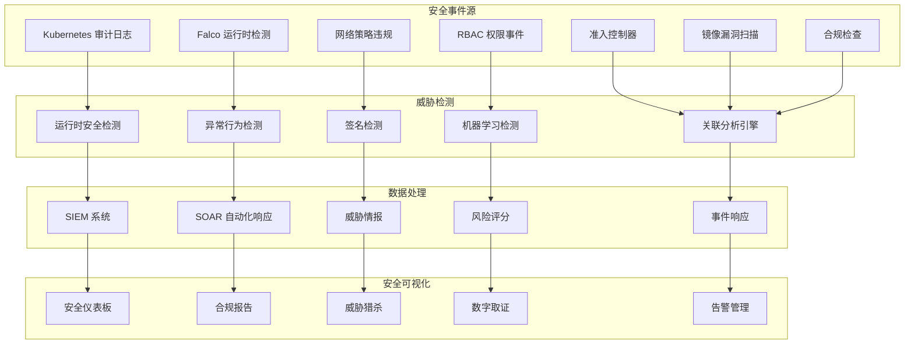

# Kubernetes 安全监控

## 概述

安全监控是 Kubernetes 可观测性的重要组成部分，通过实时监控和分析安全事件、威胁指标和合规状态，为集群安全提供全面的防护和检测能力。

### 安全监控架构



## 核心安全监控组件

### Kubernetes 审计日志

#### 审计策略配置

```yaml
# audit-policy.yaml
apiVersion: audit.k8s.io/v1
kind: Policy
rules:
  # 记录所有安全相关的操作
  - level: RequestResponse
    omitStages:
      - RequestReceived
    resources:
    - group: ""
      resources: ["secrets", "serviceaccounts"]
    - group: "rbac.authorization.k8s.io"
      resources: ["roles", "rolebindings", "clusterroles", "clusterrolebindings"]
    - group: "networking.k8s.io"
      resources: ["networkpolicies"]
    - group: "policy"
      resources: ["podsecuritypolicies"]
    - group: "admissionregistration.k8s.io"
      resources: ["*"]
    verbs: ["create", "delete", "update", "patch"]
    
  # 记录特权容器创建
  - level: RequestResponse
    omitStages:
      - RequestReceived
    resources:
    - group: ""
      resources: ["pods"]
    verbs: ["create", "update", "patch"]
    objectRef:
      apiVersion: "v1"
      kind: "Pod"
    namespaceSelector:
      matchLabels:
        security-monitoring: "enabled"
  
  # 记录 exec 和 attach 操作
  - level: Request
    omitStages:
      - RequestReceived
    resources:
    - group: ""
      resources: ["pods/exec", "pods/attach", "pods/portforward"]
    verbs: ["create"]
  
  # 记录认证失败
  - level: Request
    omitStages:
      - RequestReceived
    namespaceSelector: {}
    verbs: [""]
    resources: [""]
    userGroups: ["system:unauthenticated"]
  
  # 记录特权用户操作
  - level: RequestResponse
    omitStages:
      - RequestReceived
    users: ["system:admin", "admin"]
    verbs: ["create", "delete", "update", "patch"]
  
  # 记录节点操作
  - level: Request
    omitStages:
      - RequestReceived
    resources:
    - group: ""
      resources: ["nodes"]
    verbs: ["create", "delete", "update", "patch"]
  
  # 记录集群级别资源操作
  - level: Metadata
    omitStages:
      - RequestReceived
    resources:
    - group: ""
      resources: ["persistentvolumes"]
    - group: "storage.k8s.io"
      resources: ["storageclasses"]
    - group: "apiextensions.k8s.io"
      resources: ["customresourcedefinitions"]
    verbs: ["create", "delete", "update", "patch"]
  
  # 忽略系统组件的常规操作
  - level: None
    users: ["system:kube-proxy"]
    verbs: ["watch"]
    resources:
    - group: ""
      resources: ["endpoints", "services"]
  
  - level: None
    users: ["system:kube-controller-manager"]
    verbs: ["get", "list", "watch"]
  
  - level: None
    users: ["system:kube-scheduler"]
    verbs: ["get", "list", "watch"]
  
  # 忽略健康检查
  - level: None
    nonResourceURLs:
      - "/healthz*"
      - "/readyz*"
      - "/livez*"
      - "/version"
      - "/metrics"
```

#### 审计日志分析规则

```yaml
# 审计日志安全分析规则
audit_analysis_rules:
  privilege_escalation:
    description: "特权提升检测"
    pattern: |
      verb:"create" AND 
      objectRef.resource:"pods" AND 
      requestObject.spec.securityContext.privileged:true
    severity: "high"
    tags: ["privilege-escalation", "container-security"]
  
  secret_access:
    description: "敏感信息访问检测"
    pattern: |
      objectRef.resource:"secrets" AND 
      verb:("get" OR "list") AND 
      NOT user:"system:*"
    severity: "medium"
    tags: ["data-access", "secrets"]
  
  rbac_modification:
    description: "权限修改检测"
    pattern: |
      objectRef.apiGroup:"rbac.authorization.k8s.io" AND 
      verb:("create" OR "update" OR "delete") AND 
      NOT user:"system:*"
    severity: "high"
    tags: ["privilege-modification", "rbac"]
  
  pod_exec:
    description: "容器执行检测"
    pattern: |
      objectRef.resource:"pods/exec" AND 
      verb:"create"
    severity: "medium"
    tags: ["container-access", "exec"]
  
  authentication_failure:
    description: "认证失败检测"
    pattern: |
      user:"system:anonymous" OR 
      userGroups:"system:unauthenticated"
    severity: "medium"
    tags: ["authentication", "access-denied"]
  
  suspicious_namespace:
    description: "可疑命名空间操作"
    pattern: |
      objectRef.namespace:("kube-system" OR "kube-public") AND 
      verb:("create" OR "update" OR "delete") AND 
      NOT user:"system:*"
    severity: "high"
    tags: ["system-access", "namespace"]
```

### Falco 运行时检测

#### Falco 部署配置

```yaml
# falco-daemonset.yaml
apiVersion: apps/v1
kind: DaemonSet
metadata:
  name: falco
  namespace: security
  labels:
    app: falco
spec:
  selector:
    matchLabels:
      app: falco
  template:
    metadata:
      labels:
        app: falco
    spec:
      serviceAccountName: falco
      hostNetwork: true
      hostPID: true
      containers:
      - name: falco
        image: falcosecurity/falco:latest
        args:
          - /usr/bin/falco
          - --cri
          - /host/run/containerd/containerd.sock
          - -K
          - /var/run/secrets/kubernetes.io/serviceaccount/token
          - -k
          - https://$(KUBERNETES_SERVICE_HOST)
          - --k8s-node=$(FALCO_K8S_NODE_NAME)
          - -pk
        env:
        - name: FALCO_K8S_NODE_NAME
          valueFrom:
            fieldRef:
              fieldPath: spec.nodeName
        - name: FALCO_GRPC_ENABLED
          value: "true"
        - name: FALCO_GRPC_BIND_ADDRESS
          value: "0.0.0.0:5060"
        - name: FALCO_WEBSERVER_ENABLED
          value: "true"
        - name: FALCO_WEBSERVER_LISTEN_PORT
          value: "8765"
        securityContext:
          privileged: true
        resources:
          limits:
            memory: 512Mi
            cpu: 200m
          requests:
            memory: 256Mi
            cpu: 100m
        volumeMounts:
        - mountPath: /host/var/run/docker.sock
          name: docker-socket
          readOnly: true
        - mountPath: /host/run/containerd/containerd.sock
          name: containerd-socket
          readOnly: true
        - mountPath: /host/dev
          name: dev-fs
          readOnly: true
        - mountPath: /host/proc
          name: proc-fs
          readOnly: true
        - mountPath: /host/boot
          name: boot-fs
          readOnly: true
        - mountPath: /host/lib/modules
          name: lib-modules
          readOnly: true
        - mountPath: /host/usr
          name: usr-fs
          readOnly: true
        - mountPath: /host/etc
          name: etc-fs
          readOnly: true
        - mountPath: /etc/falco
          name: falco-config
        livenessProbe:
          httpGet:
            path: /healthz
            port: 8765
          initialDelaySeconds: 60
          periodSeconds: 15
          timeoutSeconds: 5
        readinessProbe:
          httpGet:
            path: /healthz
            port: 8765
          initialDelaySeconds: 30
          periodSeconds: 15
          timeoutSeconds: 5
      volumes:
      - name: docker-socket
        hostPath:
          path: /var/run/docker.sock
      - name: containerd-socket
        hostPath:
          path: /run/containerd/containerd.sock
      - name: dev-fs
        hostPath:
          path: /dev
      - name: proc-fs
        hostPath:
          path: /proc
      - name: boot-fs
        hostPath:
          path: /boot
      - name: lib-modules
        hostPath:
          path: /lib/modules
      - name: usr-fs
        hostPath:
          path: /usr
      - name: etc-fs
        hostPath:
          path: /etc
      - name: falco-config
        configMap:
          name: falco-config
      tolerations:
      - effect: NoSchedule
        key: node-role.kubernetes.io/master
      - effect: NoSchedule
        key: node-role.kubernetes.io/control-plane
```

#### Falco 安全规则

```yaml
# falco-rules-configmap.yaml
apiVersion: v1
kind: ConfigMap
metadata:
  name: falco-config
  namespace: security
data:
  falco.yaml: |
    rules_file:
      - /etc/falco/falco_rules.yaml
      - /etc/falco/falco_rules.local.yaml
      - /etc/falco/k8s_audit_rules.yaml
    
    time_format_iso_8601: true
    json_output: true
    json_include_output_property: true
    json_include_tags_property: true
    
    log_stderr: true
    log_syslog: false
    log_level: info
    
    priority: debug
    
    buffered_outputs: false
    
    syscall_event_drops:
      actions:
        - log
        - alert
      rate: 0.03333
      max_burst: 1000
    
    outputs:
      rate: 1
      max_burst: 1000
    
    syslog_output:
      enabled: false
    
    file_output:
      enabled: false
    
    stdout_output:
      enabled: true
    
    webserver:
      enabled: true
      listen_port: 8765
      k8s_healthz_endpoint: /healthz
      ssl_enabled: false
      ssl_certificate: /etc/falco/falco.pem
    
    grpc:
      enabled: true
      bind_address: "0.0.0.0:5060"
      threadiness: 8
    
    grpc_output:
      enabled: true
  
  falco_rules.local.yaml: |
    # 自定义安全检测规则
    
    # 检测特权容器启动
    - rule: Privileged Container Started
      desc: Detect privileged container startup
      condition: >
        spawned_process and container and
        (proc.vpid=1 or proc.vpid=0) and
        (container.privileged=true or
         proc.name in (systemd, init, kthreadd, ksoftirqd, migration, rcu_gp, rcu_par_gp, watchdog))
      output: >
        Privileged container started (user=%user.name user_loginuid=%user.loginuid
        command=%proc.cmdline pid=%proc.pid container_id=%container.id container_name=%container.name
        image=%container.image.repository:%container.image.tag)
      priority: WARNING
      tags: [container, privilege-escalation]
    
    # 检测敏感文件访问
    - rule: Sensitive File Access
      desc: Detect access to sensitive files
      condition: >
        open_read and
        fd.name in (/etc/passwd, /etc/shadow, /etc/hosts, /etc/hostname, /etc/ssh/sshd_config) and
        not proc.name in (sshd, systemd, NetworkManager)
      output: >
        Sensitive file access (user=%user.name command=%proc.cmdline file=%fd.name
        pid=%proc.pid container_id=%container.id)
      priority: WARNING
      tags: [filesystem, sensitive-files]
    
    # 检测网络连接异常
    - rule: Unexpected Outbound Connection
      desc: Detect unexpected outbound network connections
      condition: >
        outbound and
        fd.sip != "127.0.0.1" and
        not proc.name in (curl, wget, apt, yum, dnf, pip, npm, docker, containerd, kubelet) and
        not fd.sport in (53, 443, 80)
      output: >
        Unexpected outbound connection (user=%user.name command=%proc.cmdline
        connection=%fd.name pid=%proc.pid container_id=%container.id)
      priority: NOTICE
      tags: [network, outbound]
    
    # 检测容器逃逸尝试
    - rule: Container Escape Attempt
      desc: Detect potential container escape attempts
      condition: >
        spawned_process and container and
        (proc.name in (docker, runc, containerd, ctr) or
         proc.cmdline contains "nsenter" or
         proc.cmdline contains "unshare" or
         proc.cmdline contains "mount" and proc.cmdline contains "/proc")
      output: >
        Potential container escape attempt (user=%user.name command=%proc.cmdline
        pid=%proc.pid container_id=%container.id container_name=%container.name)
      priority: CRITICAL
      tags: [container, escape]
    
    # 检测加密挖矿活动
    - rule: Cryptocurrency Mining Activity
      desc: Detect potential cryptocurrency mining
      condition: >
        spawned_process and
        (proc.name in (xmrig, minergate, cpuminer, cgminer, bfgminer) or
         proc.cmdline contains "stratum+tcp" or
         proc.cmdline contains "cryptonight" or
         proc.cmdline contains "scrypt")
      output: >
        Cryptocurrency mining detected (user=%user.name command=%proc.cmdline
        pid=%proc.pid container_id=%container.id)
      priority: CRITICAL
      tags: [malware, mining]
    
    # 检测Shell访问
    - rule: Shell Access in Container
      desc: Detect shell access in container
      condition: >
        spawned_process and container and
        proc.name in (ash, bash, csh, ksh, sh, tcsh, zsh, dash) and
        not proc.pname in (ash, bash, csh, ksh, sh, tcsh, zsh, dash, make, fakeroot)
      output: >
        Shell spawned in container (user=%user.name shell=%proc.name parent=%proc.pname
        cmdline=%proc.cmdline pid=%proc.pid container_id=%container.id container_name=%container.name
        image=%container.image.repository:%container.image.tag)
      priority: NOTICE
      tags: [container, shell]
    
    # 检测文件系统挂载
    - rule: Filesystem Mount
      desc: Detect filesystem mount operations
      condition: >
        spawned_process and
        proc.name = mount and
        not proc.args contains "/proc/self/fd"
      output: >
        Filesystem mount detected (user=%user.name command=%proc.cmdline
        pid=%proc.pid container_id=%container.id)
      priority: WARNING
      tags: [filesystem, mount]
```

### 镜像安全扫描

#### Trivy 安全扫描配置

```yaml
# trivy-operator.yaml
apiVersion: apps/v1
kind: Deployment
metadata:
  name: trivy-operator
  namespace: security
spec:
  replicas: 1
  selector:
    matchLabels:
      app: trivy-operator
  template:
    metadata:
      labels:
        app: trivy-operator
    spec:
      serviceAccountName: trivy-operator
      containers:
      - name: trivy-operator
        image: aquasec/trivy-operator:latest
        env:
        - name: OPERATOR_NAMESPACE
          valueFrom:
            fieldRef:
              fieldPath: metadata.namespace
        - name: OPERATOR_TARGET_NAMESPACES
          value: ""
        - name: OPERATOR_EXCLUDE_NAMESPACES
          value: "kube-system,trivy-system"
        - name: OPERATOR_SERVICE_ACCOUNT
          valueFrom:
            fieldRef:
              fieldPath: spec.serviceAccountName
        - name: TRIVY_CACHE_DIR
          value: "/tmp/trivy/.cache"
        - name: TRIVY_DEBUG
          value: "false"
        - name: TRIVY_SEVERITY
          value: "UNKNOWN,LOW,MEDIUM,HIGH,CRITICAL"
        - name: TRIVY_SLOW
          value: "true"
        - name: TRIVY_IGNORE_UNFIXED
          value: "false"
        - name: TRIVY_OFFLINE_SCAN
          value: "false"
        - name: TRIVY_TIMEOUT
          value: "5m0s"
        resources:
          limits:
            cpu: 500m
            memory: 1Gi
          requests:
            cpu: 100m
            memory: 256Mi
        volumeMounts:
        - name: cache
          mountPath: /tmp/trivy/.cache
        securityContext:
          allowPrivilegeEscalation: false
          capabilities:
            drop:
            - ALL
          readOnlyRootFilesystem: true
          runAsNonRoot: true
          runAsUser: 10001
      volumes:
      - name: cache
        emptyDir: {}
```

#### 镜像安全策略

```yaml
# image-security-policy.yaml
apiVersion: v1
kind: ConfigMap
metadata:
  name: image-security-policy
  namespace: security
data:
  policy.yaml: |
    # 镜像安全策略配置
    image_policies:
      # 禁止使用的危险镜像
      blocked_images:
        - "docker.io/*:latest"  # 禁止使用 latest 标签
        - "quay.io/suspicious/*"
        - "*:master"
        - "*:main"
      
      # 允许的镜像仓库
      allowed_registries:
        - "docker.io"
        - "gcr.io"
        - "quay.io"
        - "registry.k8s.io"
        - "your-private-registry.com"
      
      # 漏洞扫描要求
      vulnerability_policies:
        max_critical: 0      # 不允许严重漏洞
        max_high: 2          # 最多2个高危漏洞
        max_medium: 10       # 最多10个中危漏洞
        ignore_unfixed: true # 忽略无修复方案的漏洞
      
      # 镜像签名验证
      signature_verification:
        enabled: true
        trusted_keys:
          - "cosign-public-key"
          - "notary-delegation-key"
        enforcement_mode: "warn"  # 模式：enforce, warn, disabled
      
      # 基础镜像安全要求
      base_image_requirements:
        scan_required: true
        max_age_days: 30
        security_updates_required: true
        distroless_preferred: true
      
      # 运行时安全配置
      runtime_security:
        run_as_non_root: true
        read_only_root_filesystem: true
        allow_privilege_escalation: false
        required_drop_capabilities:
          - "ALL"
        forbidden_capabilities:
          - "SYS_ADMIN"
          - "NET_ADMIN"
          - "SYS_TIME"
```

### 网络安全监控

#### 网络策略监控

```yaml
# network-policy-monitor.yaml
apiVersion: v1
kind: ConfigMap
metadata:
  name: network-security-rules
  namespace: security
data:
  rules.yaml: |
    # 网络安全监控规则
    network_security_rules:
      # 检测未授权的网络连接
      unauthorized_connections:
        description: "检测违反网络策略的连接"
        detection_methods:
          - "flow_logs_analysis"
          - "iptables_monitoring"
          - "ebpf_tracing"
        alert_conditions:
          - "connection_denied_by_policy"
          - "unexpected_external_communication"
          - "lateral_movement_attempts"
      
      # 检测 DNS 异常
      dns_anomalies:
        description: "检测异常 DNS 查询"
        monitored_patterns:
          - "dga_domains"          # 域生成算法
          - "tunneling_attempts"   # DNS 隧道
          - "exfiltration_domains" # 数据外泄域名
          - "c2_communications"    # 命令控制通信
        thresholds:
          max_unique_domains_per_hour: 100
          max_failed_queries_per_minute: 50
          suspicious_tld_threshold: 5
      
      # 检测端口扫描
      port_scanning:
        description: "检测端口扫描活动"
        detection_criteria:
          - unique_ports_accessed: 20
          - time_window: "5m"
          - failed_connection_ratio: 0.8
        severity_levels:
          low: 10-20
          medium: 21-50
          high: 51-100
          critical: ">100"
      
      # 检测流量异常
      traffic_anomalies:
        description: "检测异常网络流量"
        metrics:
          - "bytes_per_second"
          - "packets_per_second"
          - "connection_rate"
          - "bandwidth_usage"
        baseline_period: "7d"
        anomaly_threshold: "3_sigma"
```

#### 服务网格安全监控

```yaml
# istio-security-monitoring.yaml
apiVersion: v1
kind: ConfigMap
metadata:
  name: istio-security-config
  namespace: istio-system
data:
  security-rules.yaml: |
    # Istio 安全监控配置
    istio_security_monitoring:
      # mTLS 监控
      mtls_monitoring:
        enforce_mtls: true
        monitor_certificate_expiration: true
        alert_on_mtls_failures: true
        certificate_renewal_threshold: "30d"
      
      # 授权策略监控
      authz_policy_monitoring:
        monitor_policy_violations: true
        track_denied_requests: true
        analyze_access_patterns: true
        detect_privilege_escalation: true
      
      # JWT 令牌监控
      jwt_monitoring:
        validate_token_signatures: true
        monitor_token_expiration: true
        track_token_reuse: true
        detect_token_anomalies: true
      
      # 服务通信监控
      service_communication_monitoring:
        baseline_learning_period: "7d"
        detect_new_connections: true
        monitor_unusual_protocols: true
        track_external_communications: true
    
    security_telemetry:
      # 安全指标收集
      metrics:
        - name: "istio_request_total"
          labels: ["source_service", "destination_service", "response_code"]
        - name: "istio_requests_denied_total"
          labels: ["source_service", "destination_service", "reason"]
        - name: "istio_certificate_expiry_seconds"
          labels: ["service", "namespace"]
      
      # 访问日志配置
      access_logs:
        format: |
          {
            "timestamp": "%START_TIME%",
            "method": "%REQ(:METHOD)%",
            "url": "%REQ(X-ENVOY-ORIGINAL-PATH?:PATH)%",
            "protocol": "%PROTOCOL%",
            "response_code": "%RESPONSE_CODE%",
            "response_flags": "%RESPONSE_FLAGS%",
            "bytes_received": "%BYTES_RECEIVED%",
            "bytes_sent": "%BYTES_SENT%",
            "duration": "%DURATION%",
            "upstream_service_time": "%RESP(X-ENVOY-UPSTREAM-SERVICE-TIME)%",
            "x_forwarded_for": "%REQ(X-FORWARDED-FOR)%",
            "user_agent": "%REQ(USER-AGENT)%",
            "request_id": "%REQ(X-REQUEST-ID)%",
            "authority": "%REQ(:AUTHORITY)%",
            "upstream_host": "%UPSTREAM_HOST%",
            "source_address": "%DOWNSTREAM_REMOTE_ADDRESS%",
            "destination_service": "%REQ(X-DESTINATION-SERVICE)%",
            "source_service": "%REQ(X-SOURCE-SERVICE)%"
          }
        providers:
          - name: otel
            service: opentelemetry-collector.istio-system.svc.cluster.local
            port: 4317
```

## 威胁检测和响应

### 异常行为检测

#### 机器学习检测模型

```yaml
# ml-threat-detection.yaml
apiVersion: v1
kind: ConfigMap
metadata:
  name: ml-threat-detection
  namespace: security
data:
  detection-models.yaml: |
    # 机器学习威胁检测模型配置
    ml_models:
      # 用户行为分析
      user_behavior_analysis:
        model_type: "isolation_forest"
        features:
          - "login_frequency"
          - "access_time_patterns"
          - "resource_access_patterns"
          - "command_execution_patterns"
          - "network_communication_patterns"
        training_period: "30d"
        detection_threshold: 0.05
        retrain_interval: "7d"
      
      # 网络异常检测
      network_anomaly_detection:
        model_type: "autoencoder"
        features:
          - "connection_duration"
          - "bytes_transferred"
          - "packet_count"
          - "protocol_distribution"
          - "port_usage_patterns"
        window_size: "1h"
        anomaly_threshold: 0.02
      
      # 进程行为分析
      process_behavior_analysis:
        model_type: "lstm"
        features:
          - "process_creation_sequence"
          - "system_call_patterns"
          - "file_access_patterns"
          - "network_activity"
          - "resource_consumption"
        sequence_length: 100
        prediction_threshold: 0.8
      
      # 容器行为分析
      container_behavior_analysis:
        model_type: "random_forest"
        features:
          - "container_lifecycle_events"
          - "resource_usage_patterns"
          - "network_connections"
          - "filesystem_changes"
          - "security_context_violations"
        ensemble_size: 100
        confidence_threshold: 0.9
```

#### 威胁狩猎查询

```yaml
# threat-hunting-queries.yaml
threat_hunting_queries:
  # 检测横向移动
  lateral_movement:
    description: "检测集群内横向移动"
    query: |
      audit_logs
      | where verb == "create" and objectRef.resource == "pods/exec"
      | extend source_pod = objectRef.name
      | extend target_namespace = objectRef.namespace
      | join kind=inner (
          audit_logs
          | where verb == "create" and objectRef.resource == "pods/exec"
          | extend exec_time = timestamp
        ) on user.username
      | where datetime_diff('minute', timestamp, exec_time) <= 10
      | where target_namespace != source_namespace
      | summarize count() by user.username, source_pod, target_namespace
      | where count_ > 1
  
  # 检测特权提升
  privilege_escalation:
    description: "检测特权提升尝试"
    query: |
      union audit_logs, falco_alerts
      | where (
          (verb == "create" and objectRef.resource == "pods" and 
           requestObject.spec.securityContext.privileged == true) or
          (rule_name == "Privileged Container Started")
        )
      | extend escalation_method = case(
          verb == "create", "pod_creation",
          rule_name == "Privileged Container Started", "runtime_escalation",
          "unknown"
        )
      | summarize count() by user.username, escalation_method, bin(timestamp, 1h)
      | where count_ > 1
  
  # 检测数据外泄
  data_exfiltration:
    description: "检测潜在数据外泄"
    query: |
      network_logs
      | where direction == "outbound"
      | where bytes_out > 100MB
      | extend is_encrypted = case(
          destination_port in (443, 993, 995), true,
          false
        )
      | where is_encrypted == false
      | summarize total_bytes = sum(bytes_out) by source_pod, destination_ip, bin(timestamp, 1h)
      | where total_bytes > 1GB
      | join kind=inner (
          dns_logs
          | where query_type == "A"
          | summarize by query_name, destination_ip
        ) on destination_ip
      | project timestamp, source_pod, destination_ip, query_name, total_bytes
  
  # 检测恶意软件
  malware_detection:
    description: "检测恶意软件活动"
    query: |
      falco_alerts
      | where rule_name in (
          "Cryptocurrency Mining Activity",
          "Suspicious Binary Execution",
          "Reverse Shell Activity"
        )
      | extend threat_category = case(
          rule_name == "Cryptocurrency Mining Activity", "cryptomining",
          rule_name == "Suspicious Binary Execution", "malware",
          rule_name == "Reverse Shell Activity", "backdoor",
          "unknown"
        )
      | summarize count() by container_id, threat_category, bin(timestamp, 1h)
      | where count_ > 0
      | join kind=inner (
          container_info
          | project container_id, pod_name, namespace, image
        ) on container_id
```

### 自动化响应

#### SOAR 响应剧本

```yaml
# soar-playbooks.yaml
apiVersion: v1
kind: ConfigMap
metadata:
  name: soar-playbooks
  namespace: security
data:
  playbooks.yaml: |
    # SOAR 自动化响应剧本
    soar_playbooks:
      # 恶意容器隔离
      malicious_container_isolation:
        trigger:
          - "Cryptocurrency Mining Activity"
          - "Reverse Shell Activity"
          - "Suspicious Binary Execution"
        actions:
          - name: "isolate_container"
            type: "network_policy"
            parameters:
              policy_name: "isolate-{container_id}"
              deny_all_ingress: true
              deny_all_egress: true
          - name: "terminate_container"
            type: "kubernetes_action"
            parameters:
              action: "delete_pod"
              force: true
          - name: "create_incident"
            type: "incident_management"
            parameters:
              severity: "high"
              title: "Malicious container detected and isolated"
          - name: "notify_team"
            type: "notification"
            parameters:
              channel: "security-alerts"
              message: "Malicious container {container_id} isolated"
      
      # 特权提升响应
      privilege_escalation_response:
        trigger:
          - "Privileged Container Started"
          - "RBAC Modification"
          - "Service Account Token Abuse"
        actions:
          - name: "revoke_permissions"
            type: "rbac_action"
            parameters:
              action: "remove_cluster_role_binding"
              user: "{user.username}"
          - name: "audit_user_activity"
            type: "investigation"
            parameters:
              scope: "user_activity"
              timeframe: "24h"
              user: "{user.username}"
          - name: "require_mfa"
            type: "authentication"
            parameters:
              user: "{user.username}"
              require_mfa: true
          - name: "escalate_incident"
            type: "incident_management"
            parameters:
              severity: "critical"
              assign_to: "security_team"
      
      # 数据外泄响应
      data_exfiltration_response:
        trigger:
          - "Large Data Transfer"
          - "Unusual Network Activity"
          - "Sensitive Data Access"
        actions:
          - name: "block_external_access"
            type: "network_policy"
            parameters:
              deny_egress_to: "external"
              source_pod: "{source_pod}"
          - name: "snapshot_evidence"
            type: "forensics"
            parameters:
              target: "{source_pod}"
              include_memory: true
              include_filesystem: true
          - name: "classify_data"
            type: "data_classification"
            parameters:
              scan_target: "{source_pod}"
              identify_sensitive: true
          - name: "legal_hold"
            type: "compliance"
            parameters:
              preserve_evidence: true
              duration: "90d"
      
      # 合规违规响应
      compliance_violation_response:
        trigger:
          - "PCI DSS Violation"
          - "GDPR Violation"
          - "SOX Violation"
        actions:
          - name: "quarantine_workload"
            type: "isolation"
            parameters:
              target: "{violating_workload}"
              quarantine_duration: "24h"
          - name: "generate_compliance_report"
            type: "reporting"
            parameters:
              compliance_framework: "{framework}"
              incident_details: true
          - name: "notify_compliance_team"
            type: "notification"
            parameters:
              team: "compliance"
              urgency: "high"
          - name: "remediation_plan"
            type: "planning"
            parameters:
              auto_generate: true
              timeline: "immediate"
```

## 合规监控

### 合规框架监控

#### PCI DSS 合规监控

```yaml
# pci-dss-compliance.yaml
apiVersion: v1
kind: ConfigMap
metadata:
  name: pci-dss-compliance
  namespace: security
data:
  pci-requirements.yaml: |
    # PCI DSS 合规要求监控
    pci_dss_requirements:
      # 要求 1: 安装和维护防火墙配置
      requirement_1:
        description: "网络安全控制"
        controls:
          - name: "network_segmentation"
            check: "verify_network_policies_exist"
            critical: true
          - name: "firewall_rules"
            check: "validate_ingress_egress_rules"
            critical: true
          - name: "dmz_isolation"
            check: "verify_cardholder_data_isolation"
            critical: true
      
      # 要求 2: 不使用供应商提供的默认设置
      requirement_2:
        description: "配置安全"
        controls:
          - name: "default_passwords"
            check: "scan_for_default_credentials"
            critical: true
          - name: "unnecessary_services"
            check: "identify_unused_services"
            critical: false
          - name: "secure_configurations"
            check: "validate_security_hardening"
            critical: true
      
      # 要求 3: 保护存储的持卡人数据
      requirement_3:
        description: "数据保护"
        controls:
          - name: "data_encryption"
            check: "verify_encryption_at_rest"
            critical: true
          - name: "key_management"
            check: "validate_key_storage_security"
            critical: true
          - name: "data_retention"
            check: "enforce_data_retention_policies"
            critical: true
      
      # 要求 4: 在开放的公共网络上传输持卡人数据时进行加密
      requirement_4:
        description: "传输加密"
        controls:
          - name: "tls_encryption"
            check: "verify_tls_configuration"
            critical: true
          - name: "certificate_validation"
            check: "validate_ssl_certificates"
            critical: true
          - name: "secure_protocols"
            check: "disable_insecure_protocols"
            critical: true
      
      # 要求 8: 识别和验证对系统组件的访问
      requirement_8:
        description: "身份验证"
        controls:
          - name: "unique_user_ids"
            check: "verify_unique_user_identification"
            critical: true
          - name: "strong_authentication"
            check: "enforce_strong_authentication"
            critical: true
          - name: "mfa_requirements"
            check: "verify_mfa_implementation"
            critical: true
      
      # 要求 10: 跟踪和监控对网络资源和持卡人数据的所有访问
      requirement_10:
        description: "日志和监控"
        controls:
          - name: "audit_logging"
            check: "verify_comprehensive_logging"
            critical: true
          - name: "log_integrity"
            check: "validate_log_protection"
            critical: true
          - name: "daily_review"
            check: "ensure_daily_log_review"
            critical: false
```

#### GDPR 合规监控

```yaml
# gdpr-compliance.yaml
apiVersion: v1
kind: ConfigMap
metadata:
  name: gdpr-compliance
  namespace: security
data:
  gdpr-requirements.yaml: |
    # GDPR 合规要求监控
    gdpr_requirements:
      # 数据处理合法性
      lawfulness_of_processing:
        description: "确保数据处理的合法基础"
        controls:
          - name: "consent_tracking"
            check: "verify_consent_records"
            required: true
          - name: "purpose_limitation"
            check: "validate_processing_purposes"
            required: true
          - name: "data_minimization"
            check: "ensure_minimal_data_collection"
            required: true
      
      # 数据主体权利
      data_subject_rights:
        description: "保护数据主体权利"
        controls:
          - name: "access_rights"
            check: "verify_data_access_mechanisms"
            required: true
          - name: "rectification_rights"
            check: "enable_data_correction"
            required: true
          - name: "erasure_rights"
            check: "implement_right_to_be_forgotten"
            required: true
          - name: "portability_rights"
            check: "enable_data_portability"
            required: true
      
      # 数据保护设计
      privacy_by_design:
        description: "隐私设计和默认设置"
        controls:
          - name: "data_encryption"
            check: "verify_data_encryption"
            required: true
          - name: "access_controls"
            check: "implement_strict_access_controls"
            required: true
          - name: "privacy_settings"
            check: "default_privacy_protective_settings"
            required: true
      
      # 数据泄露通知
      breach_notification:
        description: "数据泄露检测和通知"
        controls:
          - name: "breach_detection"
            check: "implement_breach_detection"
            required: true
          - name: "notification_procedures"
            check: "verify_notification_processes"
            required: true
          - name: "documentation_requirements"
            check: "maintain_breach_records"
            required: true
      
      # 数据保护影响评估
      dpia_requirements:
        description: "数据保护影响评估"
        controls:
          - name: "risk_assessment"
            check: "conduct_privacy_risk_assessment"
            required: true
          - name: "mitigation_measures"
            check: "implement_risk_mitigation"
            required: true
          - name: "regular_review"
            check: "periodic_dpia_review"
            required: true
```

### 合规监控实施

#### 合规检查自动化

```yaml
# compliance-automation.yaml
apiVersion: batch/v1
kind: CronJob
metadata:
  name: compliance-checker
  namespace: security
spec:
  schedule: "0 2 * * *"  # 每天凌晨2点运行
  jobTemplate:
    spec:
      template:
        spec:
          serviceAccountName: compliance-checker
          containers:
          - name: compliance-checker
            image: compliance-scanner:latest
            env:
            - name: COMPLIANCE_FRAMEWORKS
              value: "PCI-DSS,GDPR,SOX,HIPAA"
            - name: SCAN_SCOPE
              value: "cluster-wide"
            - name: REPORT_FORMAT
              value: "json,pdf"
            - name: ELASTICSEARCH_URL
              valueFrom:
                secretKeyRef:
                  name: elasticsearch-credentials
                  key: url
            command:
            - "/bin/sh"
            - "-c"
            - |
              echo "Starting compliance scan..."
              
              # PCI DSS 检查
              echo "Running PCI DSS compliance checks..."
              compliance-scanner pci-dss \
                --config /etc/compliance/pci-dss.yaml \
                --output /tmp/reports/pci-dss-$(date +%Y%m%d).json
              
              # GDPR 检查
              echo "Running GDPR compliance checks..."
              compliance-scanner gdpr \
                --config /etc/compliance/gdpr.yaml \
                --output /tmp/reports/gdpr-$(date +%Y%m%d).json
              
              # SOX 检查
              echo "Running SOX compliance checks..."
              compliance-scanner sox \
                --config /etc/compliance/sox.yaml \
                --output /tmp/reports/sox-$(date +%Y%m%d).json
              
              # 生成综合报告
              echo "Generating compliance dashboard..."
              compliance-reporter \
                --input-dir /tmp/reports \
                --output /tmp/dashboard/compliance-$(date +%Y%m%d).html
              
              # 发送报告到 Elasticsearch
              echo "Uploading reports to Elasticsearch..."
              for report in /tmp/reports/*.json; do
                curl -X POST "$ELASTICSEARCH_URL/compliance-reports/_doc" \
                  -H "Content-Type: application/json" \
                  -d @"$report"
              done
              
              # 检查关键违规
              echo "Checking for critical violations..."
              violations=$(compliance-analyzer \
                --input-dir /tmp/reports \
                --severity critical \
                --format count)
              
              if [ "$violations" -gt 0 ]; then
                echo "Critical compliance violations detected: $violations"
                # 发送紧急通知
                curl -X POST https://hooks.slack.com/services/YOUR/SLACK/WEBHOOK \
                  -H 'Content-type: application/json' \
                  --data "{\"text\":\"🚨 Critical compliance violations detected: $violations\"}"
              fi
              
              echo "Compliance scan completed."
            volumeMounts:
            - name: compliance-config
              mountPath: /etc/compliance
            - name: reports-volume
              mountPath: /tmp/reports
            - name: dashboard-volume
              mountPath: /tmp/dashboard
          volumes:
          - name: compliance-config
            configMap:
              name: compliance-frameworks
          - name: reports-volume
            emptyDir: {}
          - name: dashboard-volume
            emptyDir: {}
          restartPolicy: OnFailure
```

## 安全可视化和报告

### 安全仪表板

#### Grafana 安全仪表板

```json
{
  "dashboard": {
    "title": "Kubernetes Security Overview",
    "panels": [
      {
        "title": "Security Alerts Summary",
        "type": "stat",
        "targets": [
          {
            "expr": "sum(increase(falco_alerts_total[24h])) by (severity)",
            "legendFormat": "{{severity}}"
          }
        ],
        "fieldConfig": {
          "unit": "short",
          "thresholds": {
            "steps": [
              {"color": "green", "value": 0},
              {"color": "yellow", "value": 10},
              {"color": "orange", "value": 50},
              {"color": "red", "value": 100}
            ]
          }
        }
      },
      {
        "title": "Vulnerability Distribution",
        "type": "piechart",
        "targets": [
          {
            "expr": "sum(trivy_image_vulnerabilities) by (severity)",
            "legendFormat": "{{severity}}"
          }
        ]
      },
      {
        "title": "Authentication Events",
        "type": "timeseries",
        "targets": [
          {
            "expr": "sum(rate(kubernetes_audit_total{verb=\"create\",objectRef_resource=\"tokenreviews\"}[5m])) by (user_username)",
            "legendFormat": "{{user_username}}"
          }
        ]
      },
      {
        "title": "Privileged Container Attempts",
        "type": "table",
        "targets": [
          {
            "expr": "sum(increase(falco_alerts_total{rule_name=\"Privileged Container Started\"}[1h])) by (container_name, namespace)"
          }
        ],
        "transformations": [
          {
            "id": "organize",
            "options": {
              "excludeByName": {},
              "indexByName": {},
              "renameByName": {
                "container_name": "Container",
                "namespace": "Namespace",
                "Value": "Attempts"
              }
            }
          }
        ]
      },
      {
        "title": "Network Policy Violations",
        "type": "bargauge",
        "targets": [
          {
            "expr": "sum(increase(kubernetes_audit_total{verb=\"create\",objectRef_resource=\"events\",requestObject_reason=\"NetworkPolicyViolation\"}[1h])) by (objectRef_namespace)"
          }
        ]
      },
      {
        "title": "Compliance Status",
        "type": "stat",
        "targets": [
          {
            "expr": "compliance_score{framework=\"PCI-DSS\"}",
            "legendFormat": "PCI DSS"
          },
          {
            "expr": "compliance_score{framework=\"GDPR\"}",
            "legendFormat": "GDPR"
          }
        ],
        "fieldConfig": {
          "unit": "percent",
          "min": 0,
          "max": 100
        }
      }
    ]
  }
}
```

### 安全报告自动化

#### 安全报告生成器

```yaml
# security-reporter.yaml
apiVersion: batch/v1
kind: CronJob
metadata:
  name: security-reporter
  namespace: security
spec:
  schedule: "0 8 * * 1"  # 每周一早上8点
  jobTemplate:
    spec:
      template:
        spec:
          containers:
          - name: security-reporter
            image: security-reporter:latest
            env:
            - name: REPORT_PERIOD
              value: "weekly"
            - name: STAKEHOLDERS
              value: "security-team@company.com,ciso@company.com"
            command:
            - "/bin/sh"
            - "-c"
            - |
              #!/bin/bash
              
              echo "Generating weekly security report..."
              
              # 生成安全摘要
              cat > /tmp/security-summary.md << 'EOF'
              # Weekly Security Report
              
              ## Executive Summary
              
              This report provides a comprehensive overview of the security posture 
              of our Kubernetes infrastructure for the week ending $(date +%Y-%m-%d).
              
              ## Key Metrics
              
              ### Security Alerts
              - **Critical**: $(prometheus-query 'sum(increase(falco_alerts_total{severity="critical"}[7d]))')
              - **High**: $(prometheus-query 'sum(increase(falco_alerts_total{severity="high"}[7d]))')
              - **Medium**: $(prometheus-query 'sum(increase(falco_alerts_total{severity="medium"}[7d]))')
              - **Low**: $(prometheus-query 'sum(increase(falco_alerts_total{severity="low"}[7d]))')
              
              ### Vulnerability Scan Results
              - **Critical Vulnerabilities**: $(trivy-query --severity CRITICAL --count)
              - **High Vulnerabilities**: $(trivy-query --severity HIGH --count)
              - **Images Scanned**: $(trivy-query --images-scanned --count)
              - **Compliance Rate**: $(compliance-check --overall-score)%
              
              ### Compliance Status
              - **PCI DSS**: $(compliance-check --framework PCI-DSS --score)%
              - **GDPR**: $(compliance-check --framework GDPR --score)%
              - **SOX**: $(compliance-check --framework SOX --score)%
              
              ## Incident Summary
              
              ### Security Incidents
              $(incident-summary --period 7d --format markdown)
              
              ### Top Security Risks
              $(risk-assessment --top 5 --format markdown)
              
              ## Recommendations
              
              ### Immediate Actions Required
              $(recommendations --priority critical --format markdown)
              
              ### Security Improvements
              $(recommendations --priority medium --format markdown)
              
              ## Trend Analysis
              
              ### Week-over-Week Changes
              - Alert Volume: $(trend-analysis --metric alerts --period 7d)%
              - Vulnerability Count: $(trend-analysis --metric vulnerabilities --period 7d)%
              - Compliance Score: $(trend-analysis --metric compliance --period 7d)%
              
              ### Monthly Trends
              $(trend-analysis --period 30d --format chart)
              
              ## Appendix
              
              ### Detailed Alert Breakdown
              $(alert-breakdown --period 7d --format table)
              
              ### Vulnerability Details
              $(vulnerability-details --severity HIGH,CRITICAL --format table)
              
              ---
              
              Report generated on $(date) by Kubernetes Security Monitoring System
              EOF
              
              # 转换为 HTML
              pandoc /tmp/security-summary.md -o /tmp/security-report.html \
                --css security-report.css \
                --standalone \
                --metadata title="Weekly Security Report"
              
              # 转换为 PDF
              wkhtmltopdf /tmp/security-report.html /tmp/security-report.pdf
              
              # 发送邮件报告
              mail -s "Weekly Security Report - $(date +%Y-%m-%d)" \
                -a /tmp/security-report.pdf \
                -a /tmp/security-report.html \
                "$STAKEHOLDERS" < /tmp/security-summary.md
              
              # 上传到存储
              aws s3 cp /tmp/security-report.pdf \
                s3://security-reports/$(date +%Y/%m/)/weekly-report-$(date +%Y%m%d).pdf
              
              echo "Security report generated and distributed successfully."
          restartPolicy: OnFailure
```

## 最佳实践

### 安全监控最佳实践

```yaml
# 安全监控最佳实践
security_monitoring_best_practices:
  detection_coverage:
    - "实施多层次检测策略"
    - "覆盖MITRE ATT&CK框架"
    - "结合签名和行为检测"
    - "定期更新检测规则"
    - "验证检测有效性"
  
  incident_response:
    - "建立标准化响应流程"
    - "实施自动化响应机制"
    - "定期演练应急预案"
    - "维护事件知识库"
    - "持续改进响应能力"
  
  compliance_management:
    - "自动化合规检查"
    - "实时合规状态监控"
    - "定期合规评估"
    - "维护审计证据"
    - "及时修复违规问题"
  
  threat_intelligence:
    - "集成威胁情报源"
    - "实时威胁指标更新"
    - "上下文化威胁信息"
    - "建立威胁狩猎能力"
    - "分享威胁情报"
  
  security_awareness:
    - "定期安全培训"
    - "建立安全文化"
    - "促进安全协作"
    - "分享安全知识"
    - "奖励安全行为"
```

## 总结

Kubernetes 安全监控是确保集群安全的关键能力，通过全面的威胁检测、实时响应和合规管理，为云原生环境提供强有力的安全保障。关键要点包括：

1. **全面检测**：实施多维度安全监控和威胁检测
2. **实时响应**：建立自动化安全事件响应机制
3. **合规管理**：确保持续满足法规和标准要求
4. **威胁情报**：集成外部威胁情报提升检测能力
5. **持续改进**：基于威胁态势持续优化安全策略

通过系统性的安全监控实践，能够实现对 Kubernetes 集群的全面安全可观测性，为业务安全运行提供坚实保障。
