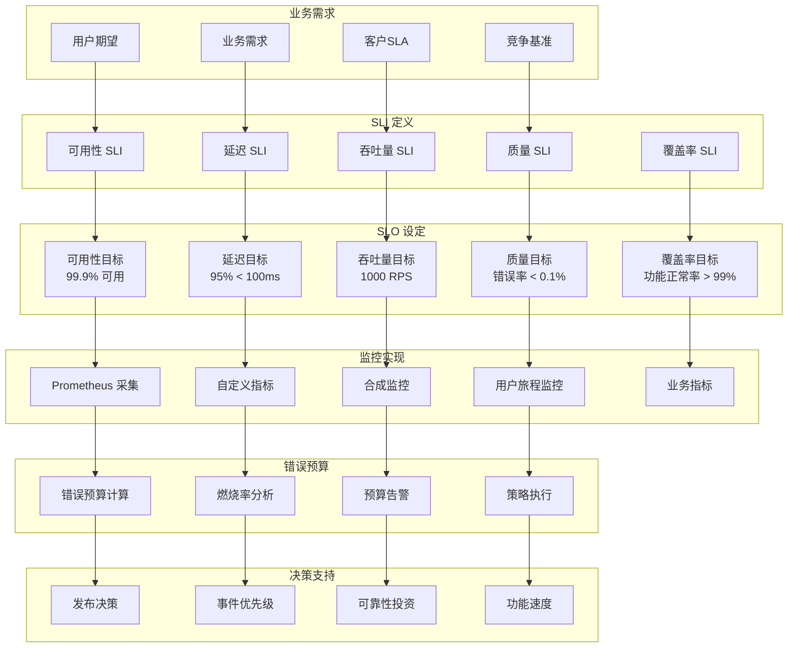

# Kubernetes SLI/SLO 监控与错误预算管理

## 概述

服务等级指标 (SLI) 和服务等级目标 (SLO) 是现代 SRE 实践的核心，通过量化服务质量和可靠性目标，为 Kubernetes 应用提供客观的性能衡量标准和改进指导。

### SLI/SLO 架构



## SLI 设计与实现

### SLI 类型和定义

```yaml
# sli-definitions.yaml
sli_categories:
  availability:
    description: "服务可用性指标"
    definition: "成功请求数 / 总请求数"
    measurement_methods:
      request_based: "基于请求成功率"
      time_based: "基于时间可用性"
      synthetic: "基于合成监控"
    
    examples:
      http_availability:
        formula: "sum(rate(http_requests_total{code!~\"5..\"}[5m])) / sum(rate(http_requests_total[5m]))"
        description: "HTTP 请求成功率"
        good_events: "HTTP 状态码非5xx的请求"
        total_events: "所有HTTP请求"
        
      service_uptime:
        formula: "(total_time - downtime) / total_time"
        description: "服务运行时间比例"
        good_events: "服务正常运行时间"
        total_events: "总时间"
  
  latency:
    description: "服务响应延迟指标"
    definition: "满足延迟要求的请求比例"
    measurement_methods:
      percentile_based: "基于百分位数"
      threshold_based: "基于阈值"
      distribution_based: "基于分布"
    
    examples:
      response_time_p95:
        formula: "histogram_quantile(0.95, sum(rate(http_request_duration_seconds_bucket[5m])) by (le))"
        description: "95%请求响应时间"
        threshold: "< 100ms"
        
      fast_requests_ratio:
        formula: "sum(rate(http_request_duration_seconds_bucket{le=\"0.1\"}[5m])) / sum(rate(http_request_duration_seconds_count[5m]))"
        description: "快速响应请求比例"
        good_events: "响应时间 ≤ 100ms 的请求"
        total_events: "所有请求"
  
  throughput:
    description: "服务吞吐量指标"
    definition: "系统处理请求的能力"
    measurement_methods:
      rate_based: "基于处理速率"
      capacity_based: "基于容量利用"
      queue_based: "基于队列性能"
    
    examples:
      request_rate:
        formula: "sum(rate(http_requests_total[5m]))"
        description: "请求处理速率"
        unit: "requests per second"
        
      successful_throughput:
        formula: "sum(rate(http_requests_total{code!~\"5..\"}[5m]))"
        description: "成功请求吞吐量"
        unit: "successful requests per second"
  
  quality:
    description: "服务质量指标"
    definition: "输出结果的正确性和完整性"
    measurement_methods:
      correctness_based: "基于正确性"
      completeness_based: "基于完整性"
      freshness_based: "基于数据新鲜度"
    
    examples:
      data_accuracy:
        formula: "correct_results / total_results"
        description: "数据准确率"
        good_events: "正确的计算结果"
        total_events: "所有计算结果"
        
      data_freshness:
        formula: "fresh_data_points / total_data_points"
        description: "数据新鲜度"
        good_events: "时效性满足要求的数据"
        total_events: "所有数据点"
  
  coverage:
    description: "服务覆盖度指标"
    definition: "功能或特性的可用性"
    measurement_methods:
      feature_based: "基于功能可用性"
      geographic_based: "基于地理覆盖"
      user_segment_based: "基于用户群体"
    
    examples:
      feature_availability:
        formula: "working_features / total_features"
        description: "功能可用性"
        good_events: "正常工作的功能"
        total_events: "所有功能"
        
      geographic_coverage:
        formula: "served_regions / total_regions"
        description: "地理覆盖率"
        good_events: "正常服务的地区"
        total_events: "所有服务地区"

sli_implementation_patterns:
  request_based_sli:
    description: "基于请求的SLI测量"
    advantages: ["直接反映用户体验", "容易理解和实现", "与业务指标关联"]
    challenges: ["需要区分好坏请求", "可能被异常流量影响"]
    best_for: ["API服务", "Web应用", "微服务"]
    
    implementation:
      data_collection: "在应用层或负载均衡器收集"
      storage: "时序数据库（如Prometheus）"
      calculation: "使用PromQL计算比率"
      
  time_based_sli:
    description: "基于时间的SLI测量"
    advantages: ["不受流量变化影响", "适合批处理系统", "简单直观"]
    challenges: ["可能掩盖间歇性问题", "需要明确定义可用状态"]
    best_for: ["批处理作业", "数据管道", "定时任务"]
    
    implementation:
      data_collection: "定期健康检查或探测"
      storage: "事件日志或状态记录"
      calculation: "计算时间比例"
      
  synthetic_sli:
    description: "基于合成监控的SLI"
    advantages: ["主动发现问题", "不依赖真实用户流量", "可控制测试场景"]
    challenges: ["可能与真实用户体验不符", "维护成本较高"]
    best_for: ["关键用户路径", "外部依赖监控", "端到端测试"]
    
    implementation:
      data_collection: "合成事务监控工具"
      storage: "监控系统数据库"
      calculation: "基于合成测试结果"
```

### SLI 实现示例

```yaml
# sli-prometheus-rules.yaml
groups:
  - name: api_service_sli
    interval: 30s
    rules:
      # 可用性 SLI
      - record: sli:api_availability:ratio_rate5m
        expr: |
          sum(rate(http_requests_total{job="api-service",code!~"5.."}[5m])) /
          sum(rate(http_requests_total{job="api-service"}[5m]))
        labels:
          sli_type: "availability"
          service: "api-service"
      
      # 延迟 SLI - 快速请求比例
      - record: sli:api_latency:good_ratio_rate5m
        expr: |
          sum(rate(http_request_duration_seconds_bucket{job="api-service",le="0.1"}[5m])) /
          sum(rate(http_request_duration_seconds_count{job="api-service"}[5m]))
        labels:
          sli_type: "latency"
          service: "api-service"
          threshold: "100ms"
      
      # 吞吐量 SLI
      - record: sli:api_throughput:rate5m
        expr: sum(rate(http_requests_total{job="api-service"}[5m]))
        labels:
          sli_type: "throughput"
          service: "api-service"
      
      # 错误率 SLI
      - record: sli:api_error_rate:ratio_rate5m
        expr: |
          sum(rate(http_requests_total{job="api-service",code=~"5.."}[5m])) /
          sum(rate(http_requests_total{job="api-service"}[5m]))
        labels:
          sli_type: "error_rate"
          service: "api-service"

  - name: database_sli
    interval: 30s
    rules:
      # 数据库连接成功率
      - record: sli:database_connection:success_ratio_rate5m
        expr: |
          sum(rate(database_connections_total{result="success"}[5m])) /
          sum(rate(database_connections_total[5m]))
        labels:
          sli_type: "availability"
          service: "database"
      
      # 查询性能 SLI
      - record: sli:database_query_latency:good_ratio_rate5m
        expr: |
          sum(rate(database_query_duration_seconds_bucket{le="0.05"}[5m])) /
          sum(rate(database_query_duration_seconds_count[5m]))
        labels:
          sli_type: "latency"
          service: "database"
          threshold: "50ms"

  - name: business_sli
    interval: 60s
    rules:
      # 订单处理成功率
      - record: sli:order_processing:success_ratio_rate5m
        expr: |
          sum(rate(orders_total{status="completed"}[5m])) /
          sum(rate(orders_total[5m]))
        labels:
          sli_type: "quality"
          service: "order-service"
      
      # 支付成功率
      - record: sli:payment_processing:success_ratio_rate5m
        expr: |
          sum(rate(payments_total{status="success"}[5m])) /
          sum(rate(payments_total[5m]))
        labels:
          sli_type: "quality"
          service: "payment-service"
      
      # 数据新鲜度
      - record: sli:data_freshness:ratio
        expr: |
          sum(data_points{age_minutes <= 5}) /
          sum(data_points)
        labels:
          sli_type: "freshness"
          service: "analytics-service"
          threshold: "5min"
```

## SLO 定义与管理

### SLO 设计原则

```yaml
# slo-design-principles.yaml
slo_design_principles:
  user_centric:
    principle: "以用户体验为中心"
    guidelines:
      - "基于用户可感知的服务质量定义SLO"
      - "区分不同用户群体和使用场景"
      - "考虑用户对延迟和可用性的不同敏感度"
      - "与业务关键路径对齐"
    
    example:
      user_type: "付费用户 vs 免费用户"
      slo_difference: "付费用户99.9%可用性，免费用户99%可用性"
      rationale: "付费用户对服务质量期望更高"
  
  achievable:
    principle: "设定可实现的目标"
    guidelines:
      - "基于历史性能数据设定现实目标"
      - "考虑系统架构和技术限制"
      - "预留改进空间但避免过于宽松"
      - "与团队能力和资源匹配"
    
    example:
      current_performance: "99.5%可用性"
      target_slo: "99.9%可用性"
      improvement_plan: "通过冗余和监控改进实现"
  
  meaningful:
    principle: "具有业务意义"
    guidelines:
      - "与业务目标和客户承诺对齐"
      - "能够指导技术决策和优先级"
      - "可以量化业务影响"
      - "支持风险评估和权衡"
    
    example:
      business_impact: "每1%可用性提升减少$10k月度损失"
      technical_cost: "需要额外$5k月度基础设施成本"
      decision: "ROI为正，值得投资"
  
  measurable:
    principle: "可准确测量"
    guidelines:
      - "基于可靠和准确的SLI"
      - "有明确的测量方法和工具"
      - "数据收集和计算过程透明"
      - "避免测量盲点和偏差"
    
    example:
      measurement_method: "基于负载均衡器日志"
      data_source: "HAProxy访问日志"
      calculation: "状态码2xx/3xx比例"
      coverage: "覆盖所有用户请求"

slo_specification_template:
  service_name: "服务名称"
  service_description: "服务功能描述"
  
  sli_definition:
    name: "SLI名称"
    description: "SLI描述"
    measurement: "测量方法"
    data_source: "数据来源"
    calculation: "计算公式"
  
  slo_target:
    threshold: "目标阈值"
    time_window: "时间窗口"
    measurement_period: "测量周期"
    compliance_period: "合规期间"
  
  error_budget:
    budget_calculation: "错误预算计算方法"
    budget_period: "预算周期"
    burn_rate_thresholds: "燃烧率阈值"
    alert_policies: "告警策略"
  
  stakeholders:
    service_owner: "服务负责人"
    sre_team: "SRE团队"
    business_owner: "业务负责人"
    customers: "客户群体"
  
  review_schedule:
    frequency: "审查频率"
    participants: "参与人员"
    criteria: "调整标准"
```

### SLO 配置示例

```yaml
# slo-configurations.yaml
slo_definitions:
  api_service_availability:
    metadata:
      name: "API服务可用性"
      service: "api-service"
      team: "backend-team"
      created: "2024-01-01"
      last_updated: "2024-01-15"
    
    sli:
      name: "HTTP请求成功率"
      type: "availability"
      description: "非5xx状态码的HTTP请求比例"
      query: "sli:api_availability:ratio_rate5m"
      data_source: "prometheus"
      unit: "ratio"
    
    slo:
      target: 0.999  # 99.9%
      time_window: "30d"  # 30天滚动窗口
      description: "99.9%的请求应该成功（非5xx状态码）"
    
    error_budget:
      budget_calculation: "time_based"
      total_budget_minutes: 43.2  # 30天 * 0.1% = 43.2分钟
      current_burn_rate: 0.5
      remaining_budget: 21.6  # 50%剩余
    
    alerting:
      burn_rate_alerts:
        - name: "fast_burn"
          burn_rate_threshold: 14.4
          time_window: "1h"
          severity: "critical"
          description: "1小时内消耗1天错误预算"
        - name: "moderate_burn"
          burn_rate_threshold: 6
          time_window: "6h"
          severity: "warning"
          description: "6小时内消耗1天错误预算"
    
    dependencies:
      - service: "database"
        impact: "high"
        description: "数据库故障直接影响API可用性"
      - service: "cache"
        impact: "medium"
        description: "缓存故障影响API性能但不影响可用性"

  api_service_latency:
    metadata:
      name: "API服务延迟"
      service: "api-service"
      team: "backend-team"
    
    sli:
      name: "95%请求延迟"
      type: "latency"
      description: "95%的请求响应时间小于100ms"
      query: "histogram_quantile(0.95, sum(rate(http_request_duration_seconds_bucket{job=\"api-service\"}[5m])) by (le))"
      unit: "seconds"
    
    slo:
      target: 0.1  # 100ms
      time_window: "7d"
      description: "95%的请求应在100ms内响应"
    
    error_budget:
      budget_calculation: "count_based"
      total_requests_budget: "5%慢请求预算"
      
  payment_service_quality:
    metadata:
      name: "支付服务质量"
      service: "payment-service"
      team: "payment-team"
    
    sli:
      name: "支付成功率"
      type: "quality"
      description: "支付处理成功的比例"
      query: "sli:payment_processing:success_ratio_rate5m"
      unit: "ratio"
    
    slo:
      target: 0.995  # 99.5%
      time_window: "30d"
      description: "99.5%的支付应该成功处理"
    
    error_budget:
      budget_calculation: "transaction_based"
      total_transactions: "月度交易总数"
      allowed_failures: "0.5%失败交易"

# SLO管理配置
slo_management:
  global_settings:
    default_time_window: "30d"
    default_evaluation_interval: "1m"
    default_burn_rate_windows: ["1h", "6h", "24h"]
    error_budget_policy: "strict"
  
  compliance_tracking:
    reporting_frequency: "weekly"
    stakeholder_notifications: "monthly"
    review_schedule: "quarterly"
    
  automation:
    slo_violation_actions:
      - action: "create_incident"
        condition: "error_budget < 10%"
        severity: "high"
      - action: "freeze_deployments"
        condition: "error_budget < 5%"
        approval_required: true
      - action: "escalate_to_management"
        condition: "error_budget < 1%"
```

## 错误预算管理

### 错误预算概念

```yaml
# error-budget-concepts.yaml
error_budget_fundamentals:
  definition:
    concept: "错误预算是SLO允许的最大错误量"
    formula: "错误预算 = (1 - SLO目标) × 时间窗口"
    purpose: "平衡可靠性和功能开发速度"
    
  calculation_methods:
    time_based:
      description: "基于时间的错误预算"
      formula: "允许故障时间 = (1 - SLO) × 总时间"
      example:
        slo: "99.9%可用性"
        time_window: "30天"
        error_budget: "43.2分钟 = (1 - 0.999) × 30天"
      use_case: "适用于可用性SLO"
    
    count_based:
      description: "基于计数的错误预算"
      formula: "允许错误数 = (1 - SLO) × 总请求数"
      example:
        slo: "99.9%成功率"
        total_requests: "1,000,000"
        error_budget: "1,000个错误 = (1 - 0.999) × 1,000,000"
      use_case: "适用于成功率SLO"
    
    latency_based:
      description: "基于延迟的错误预算"
      formula: "允许慢请求数 = (1 - SLO) × 总请求数"
      example:
        slo: "95%请求 < 100ms"
        total_requests: "1,000,000"
        error_budget: "50,000个慢请求 = (1 - 0.95) × 1,000,000"
      use_case: "适用于延迟SLO"

burn_rate_analysis:
  concept: "错误预算消耗速率"
  importance: "提前预警错误预算耗尽"
  
  calculation:
    formula: "燃烧率 = 实际错误率 ÷ SLO错误率"
    interpretation:
      burn_rate_1: "按SLO目标速度消耗预算"
      burn_rate_2: "2倍速度消耗，预算将提前50%耗尽"
      burn_rate_10: "10倍速度消耗，预算将提前90%耗尽"
  
  alert_thresholds:
    critical_burn:
      burn_rate: 14.4
      time_window: "1h"
      rationale: "1小时内消耗1天的错误预算"
      action: "立即响应"
    
    warning_burn:
      burn_rate: 6
      time_window: "6h"
      rationale: "6小时内消耗1天的错误预算"
      action: "关注和调查"
    
    moderate_burn:
      burn_rate: 3
      time_window: "24h"
      rationale: "24小时内消耗1天的错误预算"
      action: "监控趋势"

error_budget_policies:
  strict_policy:
    description: "严格的错误预算策略"
    rules:
      - "错误预算耗尽时停止新功能发布"
      - "专注于可靠性改进工作"
      - "需要管理层批准才能继续发布"
    pros: ["强制关注可靠性", "清晰的决策标准"]
    cons: ["可能影响业务灵活性", "需要严格执行"]
  
  flexible_policy:
    description: "灵活的错误预算策略"
    rules:
      - "错误预算低时增加可靠性工作比例"
      - "基于业务优先级做权衡决策"
      - "允许例外情况和特殊批准"
    pros: ["平衡可靠性和业务需求", "适应性强"]
    cons: ["可能执行不一致", "需要更多判断"]
  
  graduated_policy:
    description: "分级的错误预算策略"
    rules:
      budget_levels:
        healthy: "> 50%预算剩余"
        caution: "10-50%预算剩余"
        critical: "< 10%预算剩余"
        exhausted: "0%预算剩余"
      
      actions:
        healthy: "正常开发节奏"
        caution: "增加可靠性测试"
        critical: "暂停高风险变更"
        exhausted: "停止功能发布"
```

### 错误预算监控实现

```yaml
# error-budget-monitoring.yaml
groups:
  - name: error_budget_tracking
    interval: 60s
    rules:
      # API服务可用性错误预算
      - record: error_budget:api_availability:budget_remaining_ratio
        expr: |
          1 - (
            (1 - avg_over_time(sli:api_availability:ratio_rate5m[30d])) /
            (1 - 0.999)
          )
        labels:
          service: "api-service"
          slo_type: "availability"
          time_window: "30d"
      
      # 错误预算剩余时间（分钟）
      - record: error_budget:api_availability:budget_remaining_minutes
        expr: |
          error_budget:api_availability:budget_remaining_ratio *
          43.2  # 总错误预算43.2分钟
        labels:
          service: "api-service"
          slo_type: "availability"
      
      # 燃烧率计算
      - record: error_budget:api_availability:burn_rate_1h
        expr: |
          (1 - avg_over_time(sli:api_availability:ratio_rate5m[1h])) /
          (1 - 0.999) * 24 * 30  # 归一化到30天周期
        labels:
          service: "api-service"
          slo_type: "availability"
          window: "1h"
      
      - record: error_budget:api_availability:burn_rate_6h
        expr: |
          (1 - avg_over_time(sli:api_availability:ratio_rate5m[6h])) /
          (1 - 0.999) * 4 * 30  # 归一化到30天周期
        labels:
          service: "api-service"
          slo_type: "availability"
          window: "6h"
      
      # 延迟SLO错误预算
      - record: error_budget:api_latency:budget_remaining_ratio
        expr: |
          (avg_over_time(sli:api_latency:good_ratio_rate5m[7d]) - 0.95) /
          (1 - 0.95)
        labels:
          service: "api-service"
          slo_type: "latency"
          time_window: "7d"

  - name: error_budget_alerts
    rules:
      # 错误预算快速燃烧告警
      - alert: ErrorBudgetFastBurn
        expr: |
          error_budget:api_availability:burn_rate_1h > 14.4 and
          error_budget:api_availability:burn_rate_6h > 6
        for: 2m
        labels:
          severity: critical
          service: "api-service"
          slo_type: "availability"
        annotations:
          summary: "API服务错误预算快速燃烧"
          description: |
            API服务可用性错误预算正在快速燃烧。
            
            当前1小时燃烧率: {{ $value | printf "%.2f" }}
            当前6小时燃烧率: {{ with query "error_budget:api_availability:burn_rate_6h" }}{{ . | first | value | printf "%.2f" }}{{ end }}
            
            如果继续以此速度燃烧，错误预算将在几小时内耗尽。
            
            立即行动:
            1. 检查服务健康状态
            2. 确认是否有进行中的部署
            3. 考虑回滚最近的更改
            4. 暂停非关键的部署和实验
      
      # 错误预算低告警
      - alert: ErrorBudgetLow
        expr: error_budget:api_availability:budget_remaining_ratio < 0.1
        for: 5m
        labels:
          severity: warning
          service: "api-service"
          slo_type: "availability"
        annotations:
          summary: "API服务错误预算不足"
          description: |
            API服务可用性错误预算剩余不足10%。
            
            剩余预算比例: {{ $value | printf "%.2f%%" }}
            剩余预算时间: {{ with query "error_budget:api_availability:budget_remaining_minutes" }}{{ . | first | value | printf "%.1f" }}分钟{{ end }}
            
            建议行动:
            1. 审查最近的可靠性事件
            2. 推迟非关键功能发布
            3. 增加可靠性改进工作
            4. 考虑降低变更频率
      
      # 错误预算耗尽告警
      - alert: ErrorBudgetExhausted
        expr: error_budget:api_availability:budget_remaining_ratio <= 0
        for: 1m
        labels:
          severity: critical
          service: "api-service"
          slo_type: "availability"
        annotations:
          summary: "API服务错误预算已耗尽"
          description: |
            API服务可用性错误预算已完全耗尽。
            
            根据错误预算策略，应立即:
            1. 停止所有非紧急部署
            2. 专注于可靠性改进工作
            3. 通知相关利益相关者
            4. 制定恢复计划
```

### 错误预算报告

```python
# error_budget_reporter.py
import datetime
import requests
import json
from typing import Dict, List, Tuple

class ErrorBudgetReporter:
    def __init__(self, prometheus_url: str, grafana_url: str):
        self.prometheus_url = prometheus_url
        self.grafana_url = grafana_url
    
    def query_prometheus(self, query: str) -> float:
        """查询Prometheus获取指标值"""
        response = requests.get(
            f"{self.prometheus_url}/api/v1/query",
            params={"query": query}
        )
        result = response.json()
        if result["data"]["result"]:
            return float(result["data"]["result"][0]["value"][1])
        return 0.0
    
    def calculate_error_budget_status(self, service: str) -> Dict:
        """计算服务的错误预算状态"""
        # 查询SLI值
        availability_sli = self.query_prometheus(
            f'sli:api_availability:ratio_rate5m{{service="{service}"}}'
        )
        
        # 查询错误预算剩余
        budget_remaining = self.query_prometheus(
            f'error_budget:api_availability:budget_remaining_ratio{{service="{service}"}}'
        )
        
        # 查询燃烧率
        burn_rate_1h = self.query_prometheus(
            f'error_budget:api_availability:burn_rate_1h{{service="{service}"}}'
        )
        
        burn_rate_6h = self.query_prometheus(
            f'error_budget:api_availability:burn_rate_6h{{service="{service}"}}'
        )
        
        # 计算预计耗尽时间
        if burn_rate_1h > 0:
            days_to_exhaustion = budget_remaining / (burn_rate_1h / 24)
        else:
            days_to_exhaustion = float('inf')
        
        return {
            "service": service,
            "availability_sli": availability_sli,
            "slo_target": 0.999,
            "budget_remaining_ratio": budget_remaining,
            "burn_rate_1h": burn_rate_1h,
            "burn_rate_6h": burn_rate_6h,
            "days_to_exhaustion": days_to_exhaustion,
            "status": self._get_budget_status(budget_remaining),
            "timestamp": datetime.datetime.now().isoformat()
        }
    
    def _get_budget_status(self, budget_remaining: float) -> str:
        """确定错误预算状态"""
        if budget_remaining > 0.5:
            return "healthy"
        elif budget_remaining > 0.1:
            return "caution"
        elif budget_remaining > 0:
            return "critical"
        else:
            return "exhausted"
    
    def generate_weekly_report(self, services: List[str]) -> Dict:
        """生成周度错误预算报告"""
        report = {
            "report_date": datetime.datetime.now().strftime("%Y-%m-%d"),
            "report_period": "weekly",
            "services": [],
            "summary": {
                "total_services": len(services),
                "healthy_services": 0,
                "caution_services": 0,
                "critical_services": 0,
                "exhausted_services": 0
            }
        }
        
        for service in services:
            service_status = self.calculate_error_budget_status(service)
            report["services"].append(service_status)
            
            # 更新汇总统计
            status = service_status["status"]
            report["summary"][f"{status}_services"] += 1
        
        # 添加建议
        report["recommendations"] = self._generate_recommendations(report["services"])
        
        return report
    
    def _generate_recommendations(self, services: List[Dict]) -> List[str]:
        """基于错误预算状态生成建议"""
        recommendations = []
        
        critical_services = [s for s in services if s["status"] == "critical"]
        exhausted_services = [s for s in services if s["status"] == "exhausted"]
        
        if exhausted_services:
            recommendations.append(
                f"立即停止以下服务的功能发布: {', '.join([s['service'] for s in exhausted_services])}"
            )
            recommendations.append("专注于可靠性改进和错误预算恢复")
        
        if critical_services:
            recommendations.append(
                f"密切监控以下服务: {', '.join([s['service'] for s in critical_services])}"
            )
            recommendations.append("考虑降低变更频率和增加测试覆盖")
        
        high_burn_services = [s for s in services if s["burn_rate_1h"] > 5]
        if high_burn_services:
            recommendations.append(
                f"调查高燃烧率服务: {', '.join([s['service'] for s in high_burn_services])}"
            )
        
        return recommendations
    
    def send_slack_notification(self, report: Dict, webhook_url: str):
        """发送Slack通知"""
        summary = report["summary"]
        
        color = "good"
        if summary["critical_services"] > 0 or summary["exhausted_services"] > 0:
            color = "danger"
        elif summary["caution_services"] > 0:
            color = "warning"
        
        attachment = {
            "color": color,
            "title": f"错误预算周报 - {report['report_date']}",
            "fields": [
                {
                    "title": "服务状态汇总",
                    "value": f"""
健康: {summary['healthy_services']}
注意: {summary['caution_services']}
严重: {summary['critical_services']}
耗尽: {summary['exhausted_services']}
                    """.strip(),
                    "short": True
                }
            ]
        }
        
        if report["recommendations"]:
            attachment["fields"].append({
                "title": "建议行动",
                "value": "\n".join([f"• {rec}" for rec in report["recommendations"]]),
                "short": False
            })
        
        payload = {
            "text": "SLO错误预算报告",
            "attachments": [attachment]
        }
        
        requests.post(webhook_url, json=payload)

# 使用示例
if __name__ == "__main__":
    reporter = ErrorBudgetReporter(
        prometheus_url="http://prometheus:9090",
        grafana_url="http://grafana:3000"
    )
    
    services = ["api-service", "payment-service", "user-service"]
    report = reporter.generate_weekly_report(services)
    
    # 保存报告
    with open(f"error_budget_report_{report['report_date']}.json", "w") as f:
        json.dump(report, f, indent=2)
    
    # 发送Slack通知
    slack_webhook = "https://hooks.slack.com/services/YOUR/SLACK/WEBHOOK"
    reporter.send_slack_notification(report, slack_webhook)
    
    print("错误预算报告生成完成")
```

## SLO 决策框架

### 发布决策

```yaml
# release-decision-framework.yaml
release_decision_framework:
  decision_matrix:
    error_budget_healthy: "> 50% 剩余"
    actions:
      - "正常发布节奏"
      - "可以进行实验性功能"
      - "允许较高风险的变更"
      - "专注于新功能开发"
    
    error_budget_caution: "10-50% 剩余"
    actions:
      - "增加发布前测试"
      - "要求更严格的代码审查"
      - "优先修复已知问题"
      - "限制实验性功能"
    
    error_budget_critical: "< 10% 剩余"
    actions:
      - "仅允许关键安全修复"
      - "暂停功能发布"
      - "专注于可靠性改进"
      - "增加监控和告警"
    
    error_budget_exhausted: "0% 剩余"
    actions:
      - "完全停止功能发布"
      - "所有变更需要高级管理层批准"
      - "专注于故障修复和预防"
      - "制定错误预算恢复计划"

  decision_process:
    automated_checks:
      - name: "错误预算检查"
        condition: "error_budget_remaining > 10%"
        action: "允许发布"
        automation: "CI/CD流水线集成"
      
      - name: "燃烧率检查"
        condition: "burn_rate_1h < 2"
        action: "允许发布"
        automation: "发布前验证"
      
      - name: "SLO合规检查"
        condition: "sli_value > slo_target"
        action: "允许发布"
        automation: "实时监控"
    
    manual_review_triggers:
      - "错误预算 < 25%"
      - "最近24小时内有Sev1/Sev2事件"
      - "依赖服务SLO违规"
      - "重大架构变更"
    
    approval_levels:
      green_light: "自动批准"
      yellow_light: "团队负责人批准"
      red_light: "工程总监批准"
      stop: "不允许发布"

  risk_assessment:
    change_risk_factors:
      code_complexity:
        low: "简单配置变更"
        medium: "新功能添加"
        high: "架构重构"
      
      blast_radius:
        low: "影响单个组件"
        medium: "影响服务集群"
        high: "影响整个系统"
      
      rollback_difficulty:
        low: "可即时回滚"
        medium: "需要数据迁移"
        high: "不可逆变更"
    
    risk_mitigation:
      low_risk:
        - "标准发布流程"
        - "自动化测试"
        - "渐进式部署"
      
      medium_risk:
        - "金丝雀发布"
        - "增加监控"
        - "准备回滚计划"
        - "分阶段发布"
      
      high_risk:
        - "蓝绿部署"
        - "全面回归测试"
        - "实时监控"
        - "立即回滚能力"
```

### SLO 治理

```yaml
# slo-governance.yaml
slo_governance_framework:
  governance_structure:
    slo_committee:
      members:
        - "SRE技术负责人"
        - "产品负责人"
        - "工程总监"
        - "业务代表"
      responsibilities:
        - "审批SLO变更"
        - "解决SLO冲突"
        - "制定SLO策略"
        - "审查SLO合规性"
      meeting_frequency: "月度"
    
    service_owners:
      responsibilities:
        - "定义服务SLO"
        - "监控SLO合规"
        - "响应SLO违规"
        - "改进服务可靠性"
      reporting: "向SLO委员会汇报"
    
    sre_team:
      responsibilities:
        - "SLO技术实现"
        - "监控基础设施"
        - "SLO最佳实践"
        - "工具和流程支持"
      authority: "SLO技术决策"

  slo_lifecycle:
    definition_phase:
      activities:
        - "用户需求分析"
        - "SLI/SLO设计"
        - "错误预算策略"
        - "监控实现"
      deliverables:
        - "SLO规格说明"
        - "监控仪表板"
        - "告警配置"
        - "运维手册"
      approval_required: "SLO委员会"
    
    implementation_phase:
      activities:
        - "监控部署"
        - "基线测量"
        - "告警验证"
        - "团队培训"
      deliverables:
        - "生产监控"
        - "历史数据"
        - "响应流程"
        - "文档更新"
      duration: "2-4周"
    
    operation_phase:
      activities:
        - "持续监控"
        - "定期报告"
        - "违规响应"
        - "趋势分析"
      deliverables:
        - "月度报告"
        - "事件分析"
        - "改进建议"
        - "经验分享"
      review_frequency: "季度"
    
    evolution_phase:
      activities:
        - "SLO有效性评估"
        - "目标调整建议"
        - "监控优化"
        - "流程改进"
      triggers:
        - "业务需求变化"
        - "技术架构升级"
        - "用户反馈"
        - "竞争环境变化"
      approval_required: "SLO委员会"

  compliance_monitoring:
    automated_tracking:
      - "SLO合规率监控"
      - "错误预算使用监控"
      - "SLI数据质量检查"
      - "告警有效性验证"
    
    reporting_requirements:
      service_level:
        frequency: "实时仪表板"
        content: ["SLI当前值", "SLO合规状态", "错误预算剩余"]
        audience: "服务团队"
      
      management_level:
        frequency: "月度报告"
        content: ["SLO合规摘要", "趋势分析", "改进计划"]
        audience: "工程管理层"
      
      executive_level:
        frequency: "季度报告"
        content: ["业务影响分析", "可靠性投资ROI", "竞争对比"]
        audience: "高级管理层"
    
    non_compliance_handling:
      immediate_actions:
        - "告警通知相关团队"
        - "启动事件响应流程"
        - "记录违规详情"
        - "评估业务影响"
      
      follow_up_actions:
        - "根因分析"
        - "改进计划制定"
        - "SLO有效性评估"
        - "流程优化建议"
      
      escalation_criteria:
        - "连续违规 > 3次"
        - "严重业务影响"
        - "系统性问题"
        - "改进计划无效"
```

## 工具和实现

### SLO 监控工具

```yaml
# slo-monitoring-tools.yaml
slo_monitoring_platforms:
  sloth:
    description: "Prometheus SLO生成器"
    features:
      - "基于YAML配置生成SLO规则"
      - "多窗口多燃烧率告警"
      - "自动化SLI计算"
      - "错误预算跟踪"
    integration:
      - "Prometheus"
      - "Grafana"
      - "Alertmanager"
    configuration_example: |
      version: "prometheus/v1"
      service: "api-service"
      labels:
        team: "backend"
      slos:
        - name: "availability"
          objective: 99.9
          description: "API availability SLO"
          sli:
            events:
              error_query: 'sum(rate(http_requests_total{code=~"5.."}[5m]))'
              total_query: 'sum(rate(http_requests_total[5m]))'
          alerting:
            name: "ApiAvailability"
            page_alert:
              labels:
                severity: "critical"
  
  pyrra:
    description: "SLO监控和告警平台"
    features:
      - "SLO配置界面"
      - "错误预算可视化"
      - "多窗口告警"
      - "历史分析"
    integration:
      - "Prometheus"
      - "Kubernetes"
      - "Grafana"
    benefits:
      - "用户友好的界面"
      - "自动化配置生成"
      - "丰富的可视化"

  openslo:
    description: "开源SLO规范"
    features:
      - "标准化SLO定义"
      - "跨平台兼容"
      - "声明式配置"
      - "工具生态系统"
    specification_example: |
      apiVersion: openslo/v1
      kind: SLO
      metadata:
        name: api-availability
        displayName: API Availability
      spec:
        service: api-service
        indicator:
          ratioMetric:
            counter: true
            good:
              metricSource:
                spec:
                  query: 'sum(rate(http_requests_total{code!~"5.."}[5m]))'
            total:
              metricSource:
                spec:
                  query: 'sum(rate(http_requests_total[5m]))'
        objectives:
          - ratioMetric:
              threshold: 0.999
            target: 0.999
            timeWindow:
              - duration: 30d
                isRolling: true

custom_slo_implementation:
  prometheus_recording_rules: |
    groups:
      - name: slo.rules
        interval: 30s
        rules:
          # SLI rules
          - record: sli:api_availability:ratio_rate5m
            expr: |
              sum(rate(http_requests_total{job="api-service",code!~"5.."}[5m])) /
              sum(rate(http_requests_total{job="api-service"}[5m]))
          
          # SLO compliance
          - record: slo:api_availability:compliance_30d
            expr: avg_over_time(sli:api_availability:ratio_rate5m[30d])
          
          # Error budget
          - record: slo:api_availability:error_budget_remaining
            expr: |
              1 - ((1 - slo:api_availability:compliance_30d) / (1 - 0.999))
  
  grafana_dashboard_json: |
    {
      "dashboard": {
        "title": "SLO Dashboard",
        "panels": [
          {
            "title": "SLO Compliance",
            "type": "stat",
            "targets": [
              {
                "expr": "slo:api_availability:compliance_30d * 100",
                "legendFormat": "Availability %"
              }
            ],
            "fieldConfig": {
              "defaults": {
                "unit": "percent",
                "thresholds": {
                  "steps": [
                    {"color": "red", "value": 0},
                    {"color": "yellow", "value": 99.9},
                    {"color": "green", "value": 99.95}
                  ]
                }
              }
            }
          },
          {
            "title": "Error Budget",
            "type": "bargauge",
            "targets": [
              {
                "expr": "slo:api_availability:error_budget_remaining * 100",
                "legendFormat": "Remaining %"
              }
            ]
          }
        ]
      }
    }
```

## 最佳实践

### SLI/SLO 最佳实践

```yaml
# sli-slo-best-practices.yaml
best_practices:
  sli_design:
    user_focused:
      - "基于用户可感知的服务质量定义SLI"
      - "区分内部和外部用户的不同需求"
      - "考虑不同用户路径的重要性差异"
      - "避免技术指标与用户体验脱节"
    
    measurable:
      - "选择可靠和准确的数据源"
      - "确保测量覆盖所有重要路径"
      - "避免测量盲点和采样偏差"
      - "建立数据质量监控"
    
    actionable:
      - "SLI违规应该能够指导具体行动"
      - "建立SLI与系统组件的映射关系"
      - "确保有改进SLI的明确方法"
      - "避免无法控制的外部依赖"
  
  slo_setting:
    realistic_targets:
      - "基于历史数据和系统能力设定目标"
      - "考虑业务需求和技术约束的平衡"
      - "设定具有挑战性但可实现的目标"
      - "避免过于严格或宽松的标准"
    
    iterative_improvement:
      - "从宽松的目标开始，逐步收紧"
      - "定期评估和调整SLO目标"
      - "基于业务变化更新SLO"
      - "建立SLO演进的决策流程"
    
    stakeholder_alignment:
      - "确保所有利益相关者理解SLO含义"
      - "建立SLO与业务目标的关联"
      - "明确SLO违规的后果和应对措施"
      - "获得管理层对SLO策略的支持"
  
  error_budget_management:
    policy_clarity:
      - "明确定义错误预算策略和执行标准"
      - "建立不同预算水平下的行动指南"
      - "确保团队理解预算消耗的影响"
      - "制定预算耗尽时的应急预案"
    
    burn_rate_monitoring:
      - "设置多窗口燃烧率告警"
      - "根据燃烧率严重程度分级响应"
      - "建立燃烧率异常的调查流程"
      - "优化告警阈值减少噪音"
    
    decision_automation:
      - "自动化基于错误预算的发布决策"
      - "集成错误预算检查到CI/CD流水线"
      - "建立预算恢复的自动化流程"
      - "定期审核自动化决策的有效性"
  
  organizational_adoption:
    culture_change:
      - "培养数据驱动的可靠性文化"
      - "鼓励团队主动监控和改进SLO"
      - "建立SLO相关的学习和分享机制"
      - "将SLO纳入绩效评估体系"
    
    skill_development:
      - "培训团队SLI/SLO设计技能"
      - "提升数据分析和解读能力"
      - "建立SLO监控工具使用能力"
      - "培养系统可靠性工程思维"
    
    process_integration:
      - "将SLO集成到软件开发生命周期"
      - "建立SLO驱动的架构决策流程"
      - "制定基于SLO的容量规划方法"
      - "建立SLO违规的事后分析流程"

common_pitfalls:
  - name: "过多的SLO"
    description: "为每个可能的指标都设定SLO"
    solution: "专注于最重要的用户体验指标"
    
  - name: "不现实的目标"
    description: "设定过于严格或宽松的SLO"
    solution: "基于历史数据和业务需求平衡设定"
    
  - name: "忽视错误预算"
    description: "只关注SLO合规而不管理错误预算"
    solution: "建立错误预算策略和执行机制"
    
  - name: "技术导向的SLI"
    description: "基于技术指标而非用户体验定义SLI"
    solution: "从用户角度定义有意义的SLI"
    
  - name: "缺乏行动"
    description: "监控SLO但不采取改进行动"
    solution: "建立SLO违规的响应和改进流程"

success_metrics:
  - "SLO合规率趋势"
  - "错误预算利用效率"
  - "发布频率与可靠性平衡"
  - "客户满意度改善"
  - "事件响应时间缩短"
  - "团队可靠性意识提升"
```

## 总结

SLI/SLO 监控与错误预算管理是现代 SRE 实践的核心，通过量化服务质量目标和科学管理可靠性投资，为 Kubernetes 应用提供了可持续的可靠性保障机制。关键要点包括：

1. **用户中心**：基于用户体验定义有意义的 SLI 和 SLO
2. **数据驱动**：使用客观数据指导可靠性决策和投资
3. **平衡发展**：通过错误预算平衡功能开发速度和系统可靠性
4. **持续改进**：建立 SLO 生命周期管理和持续优化机制
5. **组织对齐**：确保技术目标与业务需求和用户期望一致

通过系统性的 SLI/SLO 实践，团队可以建立起以可靠性为核心的工程文化，实现业务目标和技术质量的有机统一。
