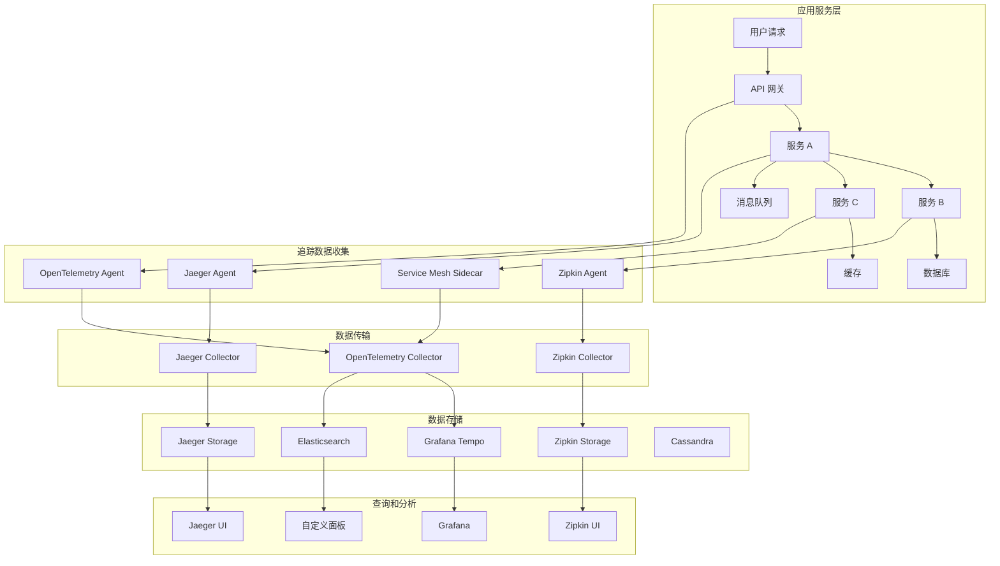

# Kubernetes 分布式链路追踪

## 概述

分布式链路追踪是现代微服务架构中的关键可观测性技术，通过跟踪请求在分布式系统中的完整执行路径，提供端到端的性能分析和故障定位能力。

### 链路追踪架构



## 核心概念

### 分布式追踪基础概念

#### Trace（链路）
一个 Trace 代表一个完整的请求执行路径，从用户发起请求到系统返回响应的整个过程。

```yaml
# Trace 示例结构
trace:
  trace_id: "abc123def456"
  operation_name: "checkout_process"
  start_time: "2023-01-01T00:00:00.000Z"
  end_time: "2023-01-01T00:00:02.500Z"
  duration: 2500  # 毫秒
  status: "success"
  tags:
    user_id: "12345"
    session_id: "session_abc"
    environment: "production"
    service_version: "v1.2.3"
  spans:
    - span_id: "span_001"
    - span_id: "span_002"
    - span_id: "span_003"
```

#### Span（跨度）
Span 是 Trace 的基本构成单元，代表一个操作或工作单元。

```yaml
# Span 示例结构
span:
  span_id: "span_001"
  trace_id: "abc123def456"
  parent_span_id: null  # 根 Span
  operation_name: "validate_user"
  start_time: "2023-01-01T00:00:00.100Z"
  end_time: "2023-01-01T00:00:00.200Z"
  duration: 100  # 毫秒
  status: "success"
  tags:
    component: "authentication"
    service_name: "auth-service"
    span_kind: "server"
    http_method: "POST"
    http_url: "/api/v1/auth/validate"
    http_status_code: 200
    user_id: "12345"
  logs:
    - timestamp: "2023-01-01T00:00:00.110Z"
      level: "info"
      message: "User authentication started"
    - timestamp: "2023-01-01T00:00:00.190Z"
      level: "info"
      message: "User authentication completed"
  references:
    - type: "child_of"
      span_id: "parent_span_id"
```

#### Span Context（跨度上下文）
Span Context 包含跨服务传播追踪信息所需的数据。

```yaml
# Span Context 结构
span_context:
  trace_id: "abc123def456"
  span_id: "span_001"
  trace_flags: "01"  # 采样标志
  trace_state: "vendor1=value1,vendor2=value2"
  baggage:
    user_tier: "premium"
    feature_flag: "new_checkout_enabled"
```

### 采样策略

#### 采样类型

```yaml
# 采样策略配置
sampling_strategies:
  # 固定比例采样
  probabilistic_sampling:
    type: "probabilistic"
    rate: 0.1  # 10% 采样率
    description: "随机采样 10% 的请求"
    use_case: "高并发场景下的基础监控"
  
  # 速率限制采样
  rate_limiting_sampling:
    type: "rateLimiting"
    max_traces_per_second: 100
    description: "每秒最多采样 100 条链路"
    use_case: "控制数据量和存储成本"
  
  # 自适应采样
  adaptive_sampling:
    type: "adaptive"
    target_samples_per_second: 50
    max_samples_per_second: 200
    adjustment_period: "1m"
    description: "根据负载自动调整采样率"
    use_case: "动态适应流量变化"
  
  # 服务级别采样
  per_service_sampling:
    type: "perService"
    default_strategy:
      type: "probabilistic"
      rate: 0.05
    strategies:
      - service: "critical-service"
        type: "probabilistic"
        rate: 0.5
      - service: "payment-service"
        type: "probabilistic"
        rate: 1.0  # 100% 采样
      - service: "log-service"
        type: "probabilistic"
        rate: 0.01  # 1% 采样
  
  # 操作级别采样
  per_operation_sampling:
    type: "perOperation"
    strategies:
      - operation: "health_check"
        type: "probabilistic"
        rate: 0.001  # 健康检查低采样率
      - operation: "user_login"
        type: "probabilistic"
        rate: 0.1
      - operation: "payment_process"
        type: "probabilistic"
        rate: 1.0  # 支付流程全采样
```

## 主要实现方案

### Jaeger

Jaeger 是 CNCF 的分布式追踪项目，提供完整的追踪解决方案。

#### Jaeger 部署

```yaml
# jaeger-operator.yaml
apiVersion: jaegertracing.io/v1
kind: Jaeger
metadata:
  name: jaeger
  namespace: tracing
spec:
  strategy: production
  collector:
    maxReplicas: 5
    resources:
      limits:
        cpu: 500m
        memory: 1Gi
      requests:
        cpu: 100m
        memory: 512Mi
    options:
      log-level: info
      kafka:
        producer:
          topic: jaeger-spans
          brokers: kafka:9092
        consumer:
          topic: jaeger-spans
          brokers: kafka:9092
  
  query:
    replicas: 2
    resources:
      limits:
        cpu: 500m
        memory: 1Gi
      requests:
        cpu: 100m
        memory: 512Mi
    options:
      log-level: info
      query:
        base-path: /jaeger
  
  storage:
    type: elasticsearch
    elasticsearch:
      nodeCount: 3
      storage:
        storageClassName: fast-ssd
        size: 100Gi
      resources:
        limits:
          cpu: 1
          memory: 2Gi
        requests:
          cpu: 500m
          memory: 1Gi
      redundancyPolicy: SingleRedundancy
    options:
      es:
        server-urls: http://elasticsearch:9200
        index-prefix: jaeger
        use-aliases: true
        create-index-templates: true
        version: 7
        max-doc-count: 10000000
        max-span-age: 168h  # 7 days
        num-shards: 3
        num-replicas: 1
  
  agent:
    strategy: DaemonSet
    resources:
      limits:
        cpu: 200m
        memory: 256Mi
      requests:
        cpu: 50m
        memory: 128Mi
    options:
      log-level: info
      collector:
        host-port: jaeger-collector:14267
  
  ingester:
    replicas: 3
    resources:
      limits:
        cpu: 500m
        memory: 1Gi
      requests:
        cpu: 100m
        memory: 512Mi
    options:
      log-level: info
      kafka:
        consumer:
          topic: jaeger-spans
          brokers: kafka:9092
          group-id: jaeger-ingester
```

#### Jaeger Agent 配置

```yaml
# jaeger-agent-configmap.yaml
apiVersion: v1
kind: ConfigMap
metadata:
  name: jaeger-agent-config
  namespace: tracing
data:
  agent.yaml: |
    reporter:
      logSpans: false
      localAgentHostPort: jaeger-agent:6831
      collectorEndpoint: http://jaeger-collector:14268/api/traces
      collectorUser: ""
      collectorPassword: ""
    
    sampler:
      type: remote
      samplingServerURL: http://jaeger-agent:5778/sampling
      maxTracesPerSecond: 100
      samplingRefreshInterval: 60s
    
    baggage_restrictions:
      denyBaggageOnInitializationFailure: false
      hostPort: jaeger-agent:5778
      refreshInterval: 60s
    
    throttler:
      hostPort: jaeger-agent:5778
      refreshInterval: 60s
      synchronousInitialization: false
```

### OpenTelemetry

OpenTelemetry 是云原生可观测性的统一标准，支持指标、日志和链路追踪。

#### OpenTelemetry Operator 部署

```yaml
# opentelemetry-operator.yaml
apiVersion: opentelemetry.io/v1alpha1
kind: OpenTelemetryCollector
metadata:
  name: otel-collector
  namespace: tracing
spec:
  mode: deployment
  replicas: 3
  
  resources:
    limits:
      cpu: 500m
      memory: 1Gi
    requests:
      cpu: 100m
      memory: 512Mi
  
  config: |
    receivers:
      otlp:
        protocols:
          grpc:
            endpoint: 0.0.0.0:4317
          http:
            endpoint: 0.0.0.0:4318
      
      jaeger:
        protocols:
          grpc:
            endpoint: 0.0.0.0:14250
          thrift_http:
            endpoint: 0.0.0.0:14268
          thrift_compact:
            endpoint: 0.0.0.0:6831
          thrift_binary:
            endpoint: 0.0.0.0:6832
      
      zipkin:
        endpoint: 0.0.0.0:9411
      
      prometheus:
        config:
          scrape_configs:
            - job_name: 'otel-collector'
              scrape_interval: 10s
              static_configs:
                - targets: ['0.0.0.0:8888']
    
    processors:
      batch:
        timeout: 1s
        send_batch_size: 1024
        send_batch_max_size: 2048
      
      memory_limiter:
        limit_mib: 400
        spike_limit_mib: 100
        check_interval: 5s
      
      resource:
        attributes:
          - key: environment
            value: production
            action: upsert
          - key: cluster
            value: kubernetes
            action: upsert
      
      probabilistic_sampler:
        sampling_percentage: 10.0
      
      span:
        name:
          to_attributes:
            rules:
              - ^\/api\/v(?P<version>\d+)\/.*$
          from_attributes: ["http.route"]
    
    exporters:
      jaeger:
        endpoint: jaeger-collector:14250
        tls:
          insecure: true
      
      prometheus:
        endpoint: "0.0.0.0:8889"
        namespace: "otel"
        const_labels:
          cluster: "kubernetes"
      
      logging:
        loglevel: info
      
      kafka:
        brokers:
          - kafka:9092
        topic: traces
        protocol_version: 2.6.0
        compression: gzip
    
    extensions:
      health_check:
        endpoint: 0.0.0.0:13133
      
      pprof:
        endpoint: 0.0.0.0:1777
      
      zpages:
        endpoint: 0.0.0.0:55679
    
    service:
      extensions: [health_check, pprof, zpages]
      pipelines:
        traces:
          receivers: [otlp, jaeger, zipkin]
          processors: [memory_limiter, resource, probabilistic_sampler, span, batch]
          exporters: [jaeger, logging]
        
        metrics:
          receivers: [prometheus]
          processors: [memory_limiter, batch]
          exporters: [prometheus, logging]
      
      telemetry:
        logs:
          level: "info"
        metrics:
          address: 0.0.0.0:8888
```

#### OpenTelemetry 自动注入

```yaml
# opentelemetry-instrumentation.yaml
apiVersion: opentelemetry.io/v1alpha1
kind: Instrumentation
metadata:
  name: default-instrumentation
  namespace: tracing
spec:
  exporter:
    endpoint: http://otel-collector:4318
  
  propagators:
    - tracecontext
    - baggage
    - b3
    - jaeger
  
  sampler:
    type: parentbased_traceidratio
    argument: "0.1"
  
  java:
    image: ghcr.io/open-telemetry/opentelemetry-operator/autoinstrumentation-java:latest
    env:
      - name: OTEL_EXPORTER_OTLP_ENDPOINT
        value: http://otel-collector:4318
      - name: OTEL_METRICS_EXPORTER
        value: none
      - name: OTEL_LOGS_EXPORTER
        value: none
  
  nodejs:
    image: ghcr.io/open-telemetry/opentelemetry-operator/autoinstrumentation-nodejs:latest
    env:
      - name: OTEL_EXPORTER_OTLP_ENDPOINT
        value: http://otel-collector:4318
  
  python:
    image: ghcr.io/open-telemetry/opentelemetry-operator/autoinstrumentation-python:latest
    env:
      - name: OTEL_EXPORTER_OTLP_ENDPOINT
        value: http://otel-collector:4318
  
  dotnet:
    image: ghcr.io/open-telemetry/opentelemetry-operator/autoinstrumentation-dotnet:latest
    env:
      - name: OTEL_EXPORTER_OTLP_ENDPOINT
        value: http://otel-collector:4318
```

### Grafana Tempo

Tempo 是 Grafana 的分布式追踪后端，专为大规模追踪数据设计。

#### Tempo 部署配置

```yaml
# tempo-deployment.yaml
apiVersion: apps/v1
kind: Deployment
metadata:
  name: tempo
  namespace: tracing
spec:
  replicas: 3
  selector:
    matchLabels:
      app: tempo
  template:
    metadata:
      labels:
        app: tempo
    spec:
      containers:
      - name: tempo
        image: grafana/tempo:latest
        ports:
        - containerPort: 3200
          name: http
        - containerPort: 9095
          name: grpc
        - containerPort: 6831
          name: jaeger-thrift
        - containerPort: 14268
          name: jaeger-http
        - containerPort: 9411
          name: zipkin
        - containerPort: 4317
          name: otlp-grpc
        - containerPort: 4318
          name: otlp-http
        args:
          - -config.file=/etc/tempo.yaml
        volumeMounts:
        - name: tempo-config
          mountPath: /etc
        - name: tempo-storage
          mountPath: /var/tempo
        resources:
          limits:
            cpu: 500m
            memory: 1Gi
          requests:
            cpu: 100m
            memory: 512Mi
      volumes:
      - name: tempo-config
        configMap:
          name: tempo-config
      - name: tempo-storage
        persistentVolumeClaim:
          claimName: tempo-pvc
```

#### Tempo 配置

```yaml
# tempo-config.yaml
apiVersion: v1
kind: ConfigMap
metadata:
  name: tempo-config
  namespace: tracing
data:
  tempo.yaml: |
    server:
      http_listen_port: 3200
      grpc_listen_port: 9095
      log_level: info
    
    distributor:
      receivers:
        jaeger:
          protocols:
            thrift_compact:
              endpoint: 0.0.0.0:6831
            thrift_http:
              endpoint: 0.0.0.0:14268
        zipkin:
          endpoint: 0.0.0.0:9411
        otlp:
          protocols:
            grpc:
              endpoint: 0.0.0.0:4317
            http:
              endpoint: 0.0.0.0:4318
    
    ingester:
      trace_idle_period: 30s
      max_block_bytes: 1048576
      max_block_duration: 5m
      complete_block_timeout: 1m
    
    compactor:
      compaction:
        block_retention: 24h
        compacted_block_retention: 1h
        retention_concurrency: 10
        max_block_bytes: 104857600
      ring:
        kvstore:
          store: memberlist
    
    storage:
      trace:
        backend: local
        local:
          path: /var/tempo/traces
        pool:
          max_workers: 100
          queue_depth: 10000
    
    querier:
      frontend_worker:
        frontend_address: tempo-query-frontend:9095
        grpc_client_config:
          max_send_msg_size: 104857600
    
    query_frontend:
      search:
        duration_slo: 5s
        throughput_bytes_slo: 1.073741824e+09
      trace_by_id:
        duration_slo: 5s
    
    memberlist:
      abort_if_cluster_join_fails: false
      join_members:
        - tempo-memberlist
    
    usage_report:
      reporting_enabled: false
```

## 应用程序集成

### 服务网格集成

#### Istio 集成配置

```yaml
# istio-tracing-config.yaml
apiVersion: install.istio.io/v1alpha1
kind: IstioOperator
metadata:
  name: istio-control-plane
spec:
  values:
    pilot:
      traceSampling: 1.0  # 100% 采样用于测试
    
    global:
      proxy:
        tracer: "jaeger"
      
      meshConfig:
        defaultConfig:
          tracing:
            sampling: 100.0
            max_path_tag_length: 256
            custom_tags:
              user_id:
                header:
                  name: "x-user-id"
              request_id:
                header:
                  name: "x-request-id"
              session_id:
                header:
                  name: "x-session-id"
      
      tracer:
        jaeger:
          address: jaeger-collector.tracing.svc.cluster.local:14268
        zipkin:
          address: zipkin-collector.tracing.svc.cluster.local:9411
  
  components:
    pilot:
      k8s:
        env:
          - name: PILOT_TRACE_SAMPLING
            value: "100"
          - name: PILOT_ENABLE_WORKLOAD_ENTRY_AUTOREGISTRATION
            value: true
---
apiVersion: v1
kind: ConfigMap
metadata:
  name: istio-tracing
  namespace: istio-system
data:
  mesh: |
    defaultConfig:
      proxyStatsMatcher:
        inclusionRegexps:
          - ".*outlier_detection.*"
          - ".*circuit_breakers.*"
          - ".*upstream_rq_retry.*"
          - ".*_cx_.*"
        exclusionRegexps:
          - ".*osconfig.*"
      tracing:
        sampling: 100.0
        custom_tags:
          environment:
            literal:
              value: "production"
          cluster:
            literal:
              value: "kubernetes"
          version:
            environment:
              name: "SERVICE_VERSION"
    extensionProviders:
      - name: jaeger
        envoyOtelAls:
          service: jaeger-collector.tracing.svc.cluster.local
          port: 4317
      - name: tempo
        envoyOtelAls:
          service: tempo.tracing.svc.cluster.local
          port: 4317
```

### 应用程序手动埋点

#### Java 应用埋点示例

```java
// Java OpenTelemetry 埋点示例
import io.opentelemetry.api.OpenTelemetry;
import io.opentelemetry.api.trace.Span;
import io.opentelemetry.api.trace.Tracer;
import io.opentelemetry.context.Scope;
import io.opentelemetry.api.trace.StatusCode;
import io.opentelemetry.api.common.Attributes;
import io.opentelemetry.api.common.AttributeKey;

@RestController
public class UserController {
    
    private static final Tracer tracer = OpenTelemetry.getGlobalTracer("user-service");
    
    @Autowired
    private UserService userService;
    
    @PostMapping("/api/users")
    public ResponseEntity<User> createUser(@RequestBody CreateUserRequest request) {
        Span span = tracer.spanBuilder("create_user")
            .setSpanKind(SpanKind.SERVER)
            .setAttribute("user.email", request.getEmail())
            .setAttribute("user.role", request.getRole())
            .setAttribute("http.method", "POST")
            .setAttribute("http.route", "/api/users")
            .startSpan();
        
        try (Scope scope = span.makeCurrent()) {
            // 添加事件
            span.addEvent("validation_started");
            
            // 验证用户输入
            validateUserInput(request);
            span.addEvent("validation_completed");
            
            // 创建用户
            span.addEvent("user_creation_started");
            User user = userService.createUser(request);
            span.addEvent("user_creation_completed");
            
            // 设置成功状态
            span.setStatus(StatusCode.OK);
            span.setAttribute("user.id", user.getId());
            
            return ResponseEntity.ok(user);
            
        } catch (ValidationException e) {
            span.setStatus(StatusCode.ERROR, "Validation failed");
            span.setAttribute("error.type", "validation");
            span.setAttribute("error.message", e.getMessage());
            throw e;
            
        } catch (Exception e) {
            span.setStatus(StatusCode.ERROR, "Internal server error");
            span.setAttribute("error.type", "internal");
            span.setAttribute("error.message", e.getMessage());
            span.recordException(e);
            throw e;
            
        } finally {
            span.end();
        }
    }
    
    private void validateUserInput(CreateUserRequest request) {
        Span childSpan = tracer.spanBuilder("validate_user_input")
            .setSpanKind(SpanKind.INTERNAL)
            .setAttribute("validation.fields", "email,password,role")
            .startSpan();
        
        try (Scope scope = childSpan.makeCurrent()) {
            // 验证逻辑
            if (request.getEmail() == null || !isValidEmail(request.getEmail())) {
                throw new ValidationException("Invalid email format");
            }
            
            if (request.getPassword() == null || request.getPassword().length() < 8) {
                throw new ValidationException("Password too short");
            }
            
            childSpan.setStatus(StatusCode.OK);
            
        } catch (Exception e) {
            childSpan.setStatus(StatusCode.ERROR, e.getMessage());
            throw e;
        } finally {
            childSpan.end();
        }
    }
}

@Service
public class UserService {
    
    private static final Tracer tracer = OpenTelemetry.getGlobalTracer("user-service");
    
    @Autowired
    private UserRepository userRepository;
    
    @Autowired
    private EmailService emailService;
    
    public User createUser(CreateUserRequest request) {
        Span span = tracer.spanBuilder("user_service.create_user")
            .setSpanKind(SpanKind.INTERNAL)
            .startSpan();
        
        try (Scope scope = span.makeCurrent()) {
            // 检查用户是否已存在
            Span checkSpan = tracer.spanBuilder("check_user_exists")
                .setAttribute("db.operation", "select")
                .setAttribute("db.table", "users")
                .startSpan();
            
            try (Scope checkScope = checkSpan.makeCurrent()) {
                boolean exists = userRepository.existsByEmail(request.getEmail());
                checkSpan.setAttribute("user.exists", exists);
                
                if (exists) {
                    throw new UserAlreadyExistsException("User already exists");
                }
                checkSpan.setStatus(StatusCode.OK);
            } finally {
                checkSpan.end();
            }
            
            // 创建用户
            Span createSpan = tracer.spanBuilder("create_user_record")
                .setAttribute("db.operation", "insert")
                .setAttribute("db.table", "users")
                .startSpan();
            
            User user;
            try (Scope createScope = createSpan.makeCurrent()) {
                user = new User();
                user.setEmail(request.getEmail());
                user.setPasswordHash(hashPassword(request.getPassword()));
                user.setRole(request.getRole());
                user = userRepository.save(user);
                
                createSpan.setAttribute("user.id", user.getId());
                createSpan.setStatus(StatusCode.OK);
            } finally {
                createSpan.end();
            }
            
            // 发送欢迎邮件（异步）
            Span emailSpan = tracer.spanBuilder("send_welcome_email")
                .setAttribute("email.type", "welcome")
                .setAttribute("email.recipient", user.getEmail())
                .startSpan();
            
            try (Scope emailScope = emailSpan.makeCurrent()) {
                emailService.sendWelcomeEmail(user);
                emailSpan.setStatus(StatusCode.OK);
            } catch (Exception e) {
                emailSpan.setStatus(StatusCode.ERROR, "Failed to send email");
                emailSpan.recordException(e);
                // 邮件发送失败不影响用户创建
            } finally {
                emailSpan.end();
            }
            
            span.setStatus(StatusCode.OK);
            return user;
            
        } catch (Exception e) {
            span.setStatus(StatusCode.ERROR, e.getMessage());
            span.recordException(e);
            throw e;
        } finally {
            span.end();
        }
    }
}
```

#### Python 应用埋点示例

```python
# Python OpenTelemetry 埋点示例
from opentelemetry import trace
from opentelemetry.trace import Status, StatusCode
from opentelemetry.trace.propagation.tracecontext import TraceContextTextMapPropagator
from flask import Flask, request, jsonify
import time
import logging

# 获取 tracer
tracer = trace.get_tracer("user-service", "1.0.0")

app = Flask(__name__)

@app.route('/api/users', methods=['POST'])
def create_user():
    # 从 HTTP 头中提取追踪上下文
    propagator = TraceContextTextMapPropagator()
    context = propagator.extract(request.headers)
    
    with tracer.start_as_current_span(
        "create_user",
        context=context,
        kind=trace.SpanKind.SERVER
    ) as span:
        try:
            # 设置 span 属性
            data = request.get_json()
            span.set_attributes({
                "user.email": data.get("email"),
                "user.role": data.get("role"),
                "http.method": request.method,
                "http.route": "/api/users",
                "http.url": request.url,
                "http.user_agent": request.headers.get("User-Agent")
            })
            
            # 添加事件
            span.add_event("validation_started")
            
            # 验证输入
            validate_user_input(data)
            span.add_event("validation_completed")
            
            # 创建用户
            span.add_event("user_creation_started")
            user = create_user_internal(data)
            span.add_event("user_creation_completed")
            
            # 设置成功状态
            span.set_status(Status(StatusCode.OK))
            span.set_attribute("user.id", user["id"])
            
            return jsonify(user), 201
            
        except ValidationError as e:
            span.set_status(Status(StatusCode.ERROR, str(e)))
            span.set_attributes({
                "error.type": "validation",
                "error.message": str(e)
            })
            return jsonify({"error": str(e)}), 400
            
        except Exception as e:
            span.set_status(Status(StatusCode.ERROR, str(e)))
            span.set_attributes({
                "error.type": "internal",
                "error.message": str(e)
            })
            span.record_exception(e)
            return jsonify({"error": "Internal server error"}), 500

def validate_user_input(data):
    with tracer.start_as_current_span(
        "validate_user_input",
        kind=trace.SpanKind.INTERNAL
    ) as span:
        span.set_attribute("validation.fields", "email,password,role")
        
        if not data.get("email") or not is_valid_email(data["email"]):
            raise ValidationError("Invalid email format")
        
        if not data.get("password") or len(data["password"]) < 8:
            raise ValidationError("Password too short")
        
        span.set_status(Status(StatusCode.OK))

def create_user_internal(data):
    with tracer.start_as_current_span(
        "user_service.create_user",
        kind=trace.SpanKind.INTERNAL
    ) as span:
        
        # 检查用户是否存在
        with tracer.start_as_current_span(
            "check_user_exists",
            attributes={
                "db.operation": "select",
                "db.table": "users",
                "db.system": "postgresql"
            }
        ) as check_span:
            exists = check_user_exists(data["email"])
            check_span.set_attribute("user.exists", exists)
            
            if exists:
                raise UserAlreadyExistsError("User already exists")
            
            check_span.set_status(Status(StatusCode.OK))
        
        # 创建用户记录
        with tracer.start_as_current_span(
            "create_user_record",
            attributes={
                "db.operation": "insert",
                "db.table": "users",
                "db.system": "postgresql"
            }
        ) as create_span:
            user_id = save_user_to_db(data)
            create_span.set_attribute("user.id", user_id)
            create_span.set_status(Status(StatusCode.OK))
        
        # 发送欢迎邮件
        with tracer.start_as_current_span(
            "send_welcome_email",
            attributes={
                "email.type": "welcome",
                "email.recipient": data["email"]
            }
        ) as email_span:
            try:
                send_welcome_email(data["email"])
                email_span.set_status(Status(StatusCode.OK))
            except Exception as e:
                email_span.set_status(Status(StatusCode.ERROR, "Failed to send email"))
                email_span.record_exception(e)
                # 邮件发送失败不影响用户创建
        
        span.set_status(Status(StatusCode.OK))
        return {"id": user_id, "email": data["email"], "role": data["role"]}

class ValidationError(Exception):
    pass

class UserAlreadyExistsError(Exception):
    pass
```

#### Node.js 应用埋点示例

```javascript
// Node.js OpenTelemetry 埋点示例
const { trace, context, SpanStatusCode, SpanKind } = require('@opentelemetry/api');
const express = require('express');

const tracer = trace.getTracer('user-service', '1.0.0');
const app = express();

app.use(express.json());

app.post('/api/users', async (req, res) => {
  const span = tracer.startSpan('create_user', {
    kind: SpanKind.SERVER,
    attributes: {
      'user.email': req.body.email,
      'user.role': req.body.role,
      'http.method': req.method,
      'http.route': '/api/users',
      'http.url': req.url,
      'http.user_agent': req.headers['user-agent']
    }
  });

  try {
    await context.with(trace.setSpan(context.active(), span), async () => {
      // 添加事件
      span.addEvent('validation_started');
      
      // 验证输入
      await validateUserInput(req.body);
      span.addEvent('validation_completed');
      
      // 创建用户
      span.addEvent('user_creation_started');
      const user = await createUserInternal(req.body);
      span.addEvent('user_creation_completed');
      
      // 设置成功状态
      span.setStatus({ code: SpanStatusCode.OK });
      span.setAttributes({
        'user.id': user.id
      });
      
      res.status(201).json(user);
    });
  } catch (error) {
    if (error instanceof ValidationError) {
      span.setStatus({
        code: SpanStatusCode.ERROR,
        message: error.message
      });
      span.setAttributes({
        'error.type': 'validation',
        'error.message': error.message
      });
      res.status(400).json({ error: error.message });
    } else {
      span.setStatus({
        code: SpanStatusCode.ERROR,
        message: error.message
      });
      span.setAttributes({
        'error.type': 'internal',
        'error.message': error.message
      });
      span.recordException(error);
      res.status(500).json({ error: 'Internal server error' });
    }
  } finally {
    span.end();
  }
});

async function validateUserInput(data) {
  const span = tracer.startSpan('validate_user_input', {
    kind: SpanKind.INTERNAL,
    attributes: {
      'validation.fields': 'email,password,role'
    }
  });

  try {
    await context.with(trace.setSpan(context.active(), span), async () => {
      if (!data.email || !isValidEmail(data.email)) {
        throw new ValidationError('Invalid email format');
      }
      
      if (!data.password || data.password.length < 8) {
        throw new ValidationError('Password too short');
      }
      
      span.setStatus({ code: SpanStatusCode.OK });
    });
  } catch (error) {
    span.setStatus({
      code: SpanStatusCode.ERROR,
      message: error.message
    });
    throw error;
  } finally {
    span.end();
  }
}

async function createUserInternal(data) {
  const span = tracer.startSpan('user_service.create_user', {
    kind: SpanKind.INTERNAL
  });

  try {
    return await context.with(trace.setSpan(context.active(), span), async () => {
      // 检查用户是否存在
      const checkSpan = tracer.startSpan('check_user_exists', {
        attributes: {
          'db.operation': 'select',
          'db.table': 'users',
          'db.system': 'postgresql'
        }
      });

      let userId;
      try {
        await context.with(trace.setSpan(context.active(), checkSpan), async () => {
          const exists = await checkUserExists(data.email);
          checkSpan.setAttributes({
            'user.exists': exists
          });
          
          if (exists) {
            throw new UserAlreadyExistsError('User already exists');
          }
          
          checkSpan.setStatus({ code: SpanStatusCode.OK });
        });
      } finally {
        checkSpan.end();
      }

      // 创建用户记录
      const createSpan = tracer.startSpan('create_user_record', {
        attributes: {
          'db.operation': 'insert',
          'db.table': 'users',
          'db.system': 'postgresql'
        }
      });

      try {
        await context.with(trace.setSpan(context.active(), createSpan), async () => {
          userId = await saveUserToDb(data);
          createSpan.setAttributes({
            'user.id': userId
          });
          createSpan.setStatus({ code: SpanStatusCode.OK });
        });
      } finally {
        createSpan.end();
      }

      // 发送欢迎邮件
      const emailSpan = tracer.startSpan('send_welcome_email', {
        attributes: {
          'email.type': 'welcome',
          'email.recipient': data.email
        }
      });

      try {
        await context.with(trace.setSpan(context.active(), emailSpan), async () => {
          await sendWelcomeEmail(data.email);
          emailSpan.setStatus({ code: SpanStatusCode.OK });
        });
      } catch (error) {
        emailSpan.setStatus({
          code: SpanStatusCode.ERROR,
          message: 'Failed to send email'
        });
        emailSpan.recordException(error);
        // 邮件发送失败不影响用户创建
      } finally {
        emailSpan.end();
      }

      span.setStatus({ code: SpanStatusCode.OK });
      return { id: userId, email: data.email, role: data.role };
    });
  } catch (error) {
    span.setStatus({
      code: SpanStatusCode.ERROR,
      message: error.message
    });
    span.recordException(error);
    throw error;
  } finally {
    span.end();
  }
}

class ValidationError extends Error {}
class UserAlreadyExistsError extends Error {}
```

## 链路分析和可视化

### 性能分析

#### 关键性能指标

```yaml
# 链路性能分析指标
performance_metrics:
  latency_analysis:
    p50_latency: "50th percentile response time"
    p95_latency: "95th percentile response time"
    p99_latency: "99th percentile response time"
    max_latency: "Maximum response time"
    
  throughput_analysis:
    requests_per_second: "Request rate"
    traces_per_second: "Trace generation rate"
    spans_per_trace: "Average spans per trace"
    
  error_analysis:
    error_rate: "Percentage of failed requests"
    error_types: "Distribution of error types"
    error_services: "Services with highest error rates"
    
  dependency_analysis:
    service_map: "Service dependency graph"
    critical_path: "Longest execution path"
    bottleneck_services: "Services causing delays"
    parallel_operations: "Concurrent operations"
```

#### 链路查询和过滤

```yaml
# 链路查询示例
trace_queries:
  high_latency_traces:
    description: "查找高延迟请求"
    query: |
      {
        "query": {
          "bool": {
            "must": [
              {
                "range": {
                  "duration": {
                    "gte": 5000  // 大于5秒
                  }
                }
              },
              {
                "term": {
                  "process.serviceName": "api-gateway"
                }
              }
            ]
          }
        },
        "sort": [
          {
            "duration": {
              "order": "desc"
            }
          }
        ]
      }
  
  error_traces:
    description: "查找错误请求"
    query: |
      {
        "query": {
          "bool": {
            "should": [
              {
                "term": {
                  "tag.error": true
                }
              },
              {
                "term": {
                  "tag.http.status_code": 500
                }
              }
            ]
          }
        }
      }
  
  specific_user_traces:
    description: "查找特定用户的请求"
    query: |
      {
        "query": {
          "term": {
            "tag.user.id": "12345"
          }
        },
        "sort": [
          {
            "startTime": {
              "order": "desc"
            }
          }
        ]
      }
  
  service_dependency_traces:
    description: "查找服务间调用链路"
    query: |
      {
        "query": {
          "bool": {
            "must": [
              {
                "term": {
                  "process.serviceName": "order-service"
                }
              },
              {
                "nested": {
                  "path": "spans",
                  "query": {
                    "term": {
                      "spans.process.serviceName": "payment-service"
                    }
                  }
                }
              }
            ]
          }
        }
      }
```

### 告警和监控

#### 链路告警规则

```yaml
# 链路告警配置
tracing_alerts:
  high_latency_alert:
    name: "High Latency Alert"
    description: "服务响应时间过高"
    query: |
      avg_over_time(
        histogram_quantile(0.95, 
          sum(rate(traces_duration_seconds_bucket[5m])) by (service_name, le)
        )[5m:]
      ) > 2
    threshold: 2000  # 2秒
    severity: "warning"
    notification:
      - slack: "#ops-alerts"
      - email: "ops-team@company.com"
  
  error_rate_alert:
    name: "High Error Rate Alert"
    description: "服务错误率过高"
    query: |
      sum(rate(traces_total{status="error"}[5m])) by (service_name) /
      sum(rate(traces_total[5m])) by (service_name) > 0.05
    threshold: 0.05  # 5%
    severity: "critical"
    notification:
      - pagerduty: "ops-team"
      - slack: "#critical-alerts"
  
  service_down_alert:
    name: "Service Down Alert"
    description: "服务无响应"
    query: |
      absent_over_time(
        sum(rate(traces_total[5m])) by (service_name)[10m:]
      )
    severity: "critical"
    notification:
      - pagerduty: "ops-team"
      - slack: "#critical-alerts"
  
  dependency_failure_alert:
    name: "Dependency Failure Alert"
    description: "依赖服务调用失败"
    query: |
      sum(rate(traces_total{
        operation_name=~".*client.*",
        status="error"
      }[5m])) by (service_name, dependency_service) > 0
    severity: "warning"
    notification:
      - slack: "#ops-alerts"
```

### 自定义仪表板

#### Grafana 仪表板配置

```json
{
  "dashboard": {
    "title": "Distributed Tracing Overview",
    "panels": [
      {
        "title": "Request Rate",
        "type": "stat",
        "targets": [
          {
            "expr": "sum(rate(traces_total[5m]))",
            "legendFormat": "Requests/sec"
          }
        ],
        "fieldConfig": {
          "unit": "reqps"
        }
      },
      {
        "title": "Average Latency",
        "type": "stat",
        "targets": [
          {
            "expr": "histogram_quantile(0.5, sum(rate(traces_duration_seconds_bucket[5m])) by (le))",
            "legendFormat": "P50"
          },
          {
            "expr": "histogram_quantile(0.95, sum(rate(traces_duration_seconds_bucket[5m])) by (le))",
            "legendFormat": "P95"
          }
        ],
        "fieldConfig": {
          "unit": "s"
        }
      },
      {
        "title": "Error Rate",
        "type": "stat",
        "targets": [
          {
            "expr": "sum(rate(traces_total{status=\"error\"}[5m])) / sum(rate(traces_total[5m]))",
            "legendFormat": "Error Rate"
          }
        ],
        "fieldConfig": {
          "unit": "percentunit",
          "thresholds": {
            "steps": [
              {"color": "green", "value": 0},
              {"color": "yellow", "value": 0.01},
              {"color": "red", "value": 0.05}
            ]
          }
        }
      },
      {
        "title": "Service Map",
        "type": "nodeGraph",
        "targets": [
          {
            "expr": "sum(rate(traces_total[5m])) by (service_name, dependency_service)"
          }
        ]
      },
      {
        "title": "Latency Heatmap",
        "type": "heatmap",
        "targets": [
          {
            "expr": "sum(rate(traces_duration_seconds_bucket[5m])) by (le, service_name)"
          }
        ]
      },
      {
        "title": "Top Slowest Operations",
        "type": "table",
        "targets": [
          {
            "expr": "topk(10, histogram_quantile(0.95, sum(rate(traces_duration_seconds_bucket[5m])) by (operation_name, le)))"
          }
        ]
      }
    ]
  }
}
```

## 性能优化

### 采样优化

#### 智能采样策略

```yaml
# 智能采样配置
adaptive_sampling:
  # 基于服务重要性的采样
  service_priority_sampling:
    critical_services:
      - name: "payment-service"
        sampling_rate: 1.0  # 100% 采样
      - name: "auth-service"
        sampling_rate: 0.5  # 50% 采样
      - name: "user-service"
        sampling_rate: 0.3  # 30% 采样
    
    normal_services:
      default_sampling_rate: 0.1  # 10% 采样
    
    background_services:
      - name: "log-processor"
        sampling_rate: 0.01  # 1% 采样
      - name: "metrics-collector"
        sampling_rate: 0.01  # 1% 采样
  
  # 基于操作类型的采样
  operation_based_sampling:
    high_priority_operations:
      - pattern: ".*payment.*"
        sampling_rate: 1.0
      - pattern: ".*login.*"
        sampling_rate: 0.5
    
    low_priority_operations:
      - pattern: ".*health.*"
        sampling_rate: 0.001
      - pattern: ".*metrics.*"
        sampling_rate: 0.001
  
  # 基于错误状态的采样
  error_based_sampling:
    error_traces: 1.0  # 错误请求 100% 采样
    slow_traces: 0.8   # 慢请求 80% 采样
    normal_traces: 0.1 # 正常请求 10% 采样
  
  # 动态采样调整
  dynamic_sampling:
    target_traces_per_second: 1000
    adjustment_interval: "1m"
    min_sampling_rate: 0.001
    max_sampling_rate: 1.0
```

### 存储优化

#### 数据生命周期管理

```yaml
# 追踪数据生命周期管理
data_lifecycle:
  # 热数据
  hot_data:
    retention_period: "24h"
    storage_type: "ssd"
    query_performance: "high"
    compression: "none"
    
  # 温数据
  warm_data:
    retention_period: "7d"
    storage_type: "ssd"
    query_performance: "medium"
    compression: "lz4"
    
  # 冷数据
  cold_data:
    retention_period: "30d"
    storage_type: "hdd"
    query_performance: "low"
    compression: "gzip"
    
  # 归档数据
  archived_data:
    retention_period: "1y"
    storage_type: "object_storage"
    query_performance: "very_low"
    compression: "snappy"
    
  # 删除策略
  deletion_policy:
    automatic_deletion: true
    deletion_threshold: "90d"
    keep_error_traces: "1y"
    keep_critical_traces: "2y"
```

## 故障排查

### 常见问题诊断

#### 追踪数据丢失

```bash
# 检查追踪数据收集
kubectl logs -n tracing jaeger-agent-xxxxx
kubectl logs -n tracing otel-collector-xxxxx

# 检查追踪数据存储
kubectl logs -n tracing jaeger-collector-xxxxx
curl http://jaeger-query:16686/api/services

# 检查应用程序埋点
kubectl logs -n app-namespace app-pod-xxxxx | grep -i trace
kubectl logs -n app-namespace app-pod-xxxxx | grep -i span

# 检查网络连接
kubectl exec -n app-namespace app-pod-xxxxx -- nc -zv jaeger-agent 6831
kubectl exec -n app-namespace app-pod-xxxxx -- nc -zv otel-collector 4317
```

#### 性能问题

```bash
# 检查采样率
curl http://jaeger-agent:5778/sampling?service=your-service

# 检查存储性能
curl http://jaeger-query:16686/api/traces?limit=1

# 检查收集器性能
kubectl top pods -n tracing
kubectl describe pod jaeger-collector-xxxxx -n tracing
```

### 调试工具

#### 追踪验证工具

```bash
# 使用 jaeger-client 发送测试追踪
jaeger-client -s your-service -o test-operation

# 使用 curl 测试 OpenTelemetry 收集器
curl -X POST http://otel-collector:4318/v1/traces \
  -H "Content-Type: application/json" \
  -d '{
    "resourceSpans": [{
      "resource": {
        "attributes": [{
          "key": "service.name",
          "value": {"stringValue": "test-service"}
        }]
      },
      "instrumentationLibrarySpans": [{
        "spans": [{
          "traceId": "1234567890abcdef1234567890abcdef",
          "spanId": "1234567890abcdef",
          "name": "test-span",
          "kind": 1,
          "startTimeUnixNano": 1609459200000000000,
          "endTimeUnixNano": 1609459201000000000
        }]
      }]
    }]
  }'

# 验证追踪数据
curl "http://jaeger-query:16686/api/traces?service=test-service&limit=10"
```

## 最佳实践

### 链路追踪最佳实践

```yaml
# 链路追踪最佳实践
best_practices:
  instrumentation:
    - "在关键业务路径上添加追踪"
    - "避免在高频操作中过度追踪"
    - "使用有意义的 span 名称和标签"
    - "正确设置 span 的父子关系"
    - "记录重要的业务事件和错误"
  
  performance:
    - "合理配置采样率"
    - "使用异步数据发送"
    - "避免在关键路径上同步发送"
    - "定期清理历史数据"
    - "监控追踪系统自身性能"
  
  data_management:
    - "设计合理的数据保留策略"
    - "使用标签进行数据分类"
    - "避免在 span 中存储敏感信息"
    - "定期备份重要追踪数据"
    - "实施数据访问控制"
  
  troubleshooting:
    - "建立追踪数据质量监控"
    - "设置关键指标告警"
    - "定期验证追踪数据完整性"
    - "维护追踪系统文档"
    - "培训团队使用追踪工具"
```

## 总结

分布式链路追踪是现代微服务架构中不可或缺的可观测性技术。通过合理的架构设计、工具选择和实施策略，可以构建出高效、可靠的链路追踪系统。关键要点包括：

1. **标准化埋点**：使用 OpenTelemetry 等标准化工具
2. **智能采样**：平衡数据质量和系统性能
3. **高效存储**：优化数据存储和查询性能
4. **深入分析**：构建有效的查询和可视化方案
5. **持续优化**：基于追踪数据持续改进系统架构

通过系统性的分布式链路追踪实践，能够实现对复杂微服务系统的全面可观测性，为性能优化和故障排查提供强有力的支撑。
