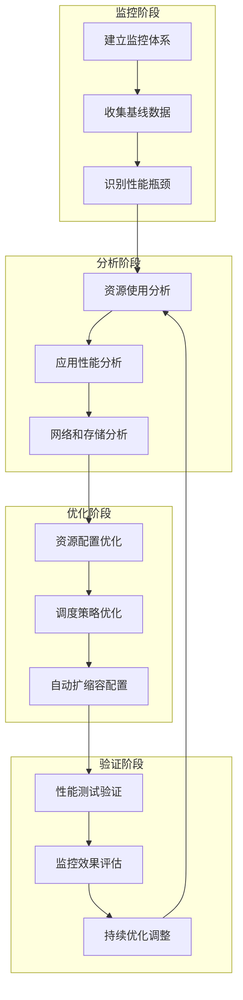

# Kubernetes 性能优化完整指南

本目录包含 Kubernetes 集群和应用性能优化的全面指南，涵盖从基础监控到高级调优的各个方面。

## 📋 目录结构

### 基础监控与分析
- **[应用监控 (application-monitoring.md)](./application-monitoring.md)** - 应用性能监控策略和工具配置
- **[性能基准测试 (performance-benchmarking.md)](./performance-benchmarking.md)** - 系统性能基准测试方法和工具
- **[资源分析 (resource-analysis.md)](./resource-analysis.md)** - 集群资源使用分析和优化建议
- **[瓶颈识别 (bottleneck-identification.md)](./bottleneck-identification.md)** - 性能瓶颈识别和诊断方法

### 资源优化
- **[CPU 优化 (cpu-optimization.md)](./cpu-optimization.md)** - CPU 资源优化策略和配置
- **[内存优化 (memory-optimization.md)](./memory-optimization.md)** - 内存管理和优化最佳实践
- **[存储优化 (storage-optimization.md)](./storage-optimization.md)** - 存储性能优化和配置策略
- **[网络优化 (network-optimization.md)](./network-optimization.md)** - 网络性能优化和故障排查

### 调度与扩缩容
- **[调度优化 (scheduling-optimization.md)](./scheduling-optimization.md)** - Pod 调度策略和节点亲和性配置
- **[HPA 最佳实践 (hpa-best-practices.md)](./hpa-best-practices.md)** - 水平 Pod 自动扩缩容配置和调优
- **[VPA 配置 (vpa-configuration.md)](./vpa-configuration.md)** - 垂直 Pod 自动扩缩容设置和管理
- **[集群自动扩展 (cluster-autoscaling.md)](./cluster-autoscaling.md)** - 集群节点自动扩缩容策略

## 🚀 快速开始

### 1. 建立监控基础
首先建立完善的监控体系：
```bash
# 部署 Prometheus 和 Grafana
kubectl apply -f monitoring/prometheus/
kubectl apply -f monitoring/grafana/

# 配置应用监控
kubectl apply -f monitoring/application-monitoring.yaml
```

### 2. 进行性能基准测试
建立性能基线：
```bash
# 运行系统性能测试
kubectl apply -f benchmarks/system-benchmark.yaml

# 运行应用性能测试
kubectl apply -f benchmarks/application-benchmark.yaml
```

### 3. 实施资源优化
根据监控结果优化资源配置：
```bash
# 应用 CPU 优化配置
kubectl apply -f optimizations/cpu-optimization.yaml

# 应用内存优化配置
kubectl apply -f optimizations/memory-optimization.yaml
```

### 4. 配置自动扩缩容
实现自动化资源管理：
```bash
# 部署 HPA
kubectl apply -f autoscaling/hpa-configs.yaml

# 部署 VPA
kubectl apply -f autoscaling/vpa-configs.yaml

# 部署 Cluster Autoscaler
kubectl apply -f autoscaling/cluster-autoscaler.yaml
```

## 📊 性能优化流程



## 🎯 优化重点领域

### 应用层优化
- **资源请求和限制**：合理设置 CPU 和内存的 requests/limits
- **健康检查**：优化 liveness 和 readiness 探针配置
- **优雅终止**：实现应用的优雅启动和关闭
- **并发控制**：优化应用的并发处理能力

### 平台层优化
- **节点调度**：使用亲和性和反亲和性优化 Pod 分布
- **资源隔离**：通过 QoS 类别实现资源优先级管理
- **网络优化**：选择合适的 CNI 插件和网络策略
- **存储优化**：根据应用特性选择存储类型和配置

### 集群层优化
- **自动扩缩容**：实现 Pod 和节点的自动伸缩
- **成本优化**：使用 Spot 实例和混合节点组
- **多可用区**：实现跨可用区的高可用部署
- **容量规划**：基于监控数据进行容量规划

## 📈 性能指标体系

### 核心性能指标
| 类别 | 指标 | 目标值 | 监控工具 |
|------|------|--------|----------|
| **延迟** | P95 响应时间 | < 100ms | Prometheus + Grafana |
| **吞吐量** | QPS | > 1000 | 应用监控 |
| **可用性** | 服务可用率 | > 99.9% | 健康检查 |
| **资源** | CPU 利用率 | 60-80% | Metrics Server |
| **资源** | 内存利用率 | 60-80% | Metrics Server |
| **网络** | 网络延迟 | < 10ms | 网络监控 |
| **存储** | 磁盘 IOPS | > 3000 | 存储监控 |

### 业务指标
- **用户体验**：页面加载时间、API 响应时间
- **系统稳定性**：错误率、重启次数、OOM 事件
- **成本效率**：单位请求成本、资源利用率
- **扩展性**：支持的并发用户数、峰值处理能力

## 🛠️ 常用优化工具

### 监控工具
- **Prometheus + Grafana**：指标收集和可视化
- **Jaeger/Zipkin**：分布式链路追踪
- **ELK Stack**：日志收集和分析
- **K9s/Lens**：集群管理和监控

### 测试工具
- **K6/Artillery**：负载测试
- **Sysbench**：系统性能测试
- **FIO**：存储性能测试
- **iperf3**：网络性能测试

### 优化工具
- **Vertical Pod Autoscaler**：垂直扩缩容
- **Horizontal Pod Autoscaler**：水平扩缩容
- **Cluster Autoscaler**：集群自动扩展
- **Descheduler**：Pod 重新调度

## 📚 最佳实践总结

### 设计原则
1. **可观测性优先**：完善的监控和日志是优化的基础
2. **渐进式优化**：从测试环境开始，逐步应用到生产环境
3. **数据驱动**：基于监控数据和测试结果进行优化决策
4. **成本意识**：在性能和成本之间寻找平衡点

### 实施策略
1. **建立基线**：优化前先建立性能基线
2. **分阶段实施**：按优先级分阶段实施优化措施
3. **持续监控**：优化后持续监控效果
4. **定期评估**：定期评估和调整优化策略

### 注意事项
- **避免过度优化**：不要为了优化而优化
- **兼顾稳定性**：优化不能以牺牲稳定性为代价
- **文档记录**：记录优化过程和效果
- **团队协作**：确保团队成员了解优化策略

## 🔧 故障排查指南

### 性能问题诊断流程
1. **确认问题**：明确性能问题的症状和影响范围
2. **收集数据**：收集相关的监控数据和日志
3. **分析原因**：使用工具分析可能的原因
4. **制定方案**：制定优化或修复方案
5. **验证效果**：验证方案的有效性
6. **总结经验**：总结经验并更新文档

### 常见问题及解决方案
- **CPU 使用率过高**：参考 [CPU 优化指南](./cpu-optimization.md)
- **内存不足或泄漏**：参考 [内存优化指南](./memory-optimization.md)
- **存储 I/O 瓶颈**：参考 [存储优化指南](./storage-optimization.md)
- **网络延迟过高**：参考 [网络优化指南](./network-optimization.md)
- **Pod 调度失败**：参考 [调度优化指南](./scheduling-optimization.md)

## 📞 获取帮助

如果在性能优化过程中遇到问题，可以：

1. **查阅相关文档**：本目录下的详细指南
2. **检查监控数据**：Prometheus、Grafana 仪表板
3. **分析日志信息**：应用和系统日志
4. **社区资源**：Kubernetes 官方文档和社区论坛

## 🔄 持续改进

性能优化是一个持续的过程，建议：

- **定期审查**：每季度审查性能指标和优化策略
- **技术更新**：关注 Kubernetes 新特性和最佳实践
- **经验分享**：在团队内分享优化经验和案例
- **工具升级**：定期评估和升级监控、测试工具

---

通过系统性地应用本指南中的优化策略，可以显著提升 Kubernetes 集群和应用的性能，同时优化资源利用率和成本效益。记住，优化是一个持续的过程，需要根据业务需求和技术发展不断调整和改进。
