# Kubernetes 性能优化

## 优化概述

Kubernetes 性能优化是一个系统性工程，需要从多个维度进行分析和改进。优化目标包括提升应用性能、降低资源消耗、改善用户体验和控制运营成本。

**核心优化维度**：
- **性能优化**：提升应用响应速度和吞吐量
- **资源优化**：提高资源利用率和降低成本
- **可用性优化**：增强系统稳定性和容错能力
- **扩展性优化**：支持业务快速增长和弹性伸缩

## 优化架构体系

```mermaid
graph TB
    subgraph "应用层优化"
        direction TB
        APP_CODE[代码优化] --> ALGO_OPT[算法优化]
        APP_CODE --> CONCURRENCY[并发优化]
        APP_CODE --> MEMORY_OPT[内存优化]
        
        APP_ARCH[架构优化] --> MICROSERVICE[微服务设计]
        APP_ARCH --> CACHE_STRATEGY[缓存策略]
        APP_ARCH --> DB_OPT[数据库优化]
        
        CONTAINER_OPT[容器优化] --> IMAGE_OPT[镜像优化]
        CONTAINER_OPT --> RESOURCE_LIMIT[资源配置]
        CONTAINER_OPT --> HEALTH_CHECK[健康检查]
    end
    
    subgraph "Kubernetes 层优化"
        direction TB
        SCHEDULING[调度优化] --> NODE_AFFINITY[节点亲和性]
        SCHEDULING --> RESOURCE_REQ[资源请求]
        SCHEDULING --> POD_PRIORITY[Pod 优先级]
        
        NETWORKING[网络优化] --> CNI_OPT[CNI 优化]
        NETWORKING --> SERVICE_MESH[服务网格]
        NETWORKING --> INGRESS_OPT[Ingress 优化]
        
        STORAGE[存储优化] --> PV_OPT[持久卷优化]
        STORAGE --> CSI_OPT[CSI 优化]
        STORAGE --> STORAGE_CLASS[存储类配置]
    end
    
    subgraph "集群层优化"
        direction TB
        CLUSTER_CONFIG[集群配置] --> ETCD_OPT[etcd 优化]
        CLUSTER_CONFIG --> API_SERVER_OPT[API Server 优化]
        CLUSTER_CONFIG --> CONTROLLER_OPT[控制器优化]
        
        NODE_OPT[节点优化] --> OS_TUNING[操作系统调优]
        NODE_OPT --> KERNEL_PARAM[内核参数]
        NODE_OPT --> RESOURCE_MGMT[资源管理]
        
        SCALING[扩展优化] --> HPA[水平扩缩容]
        SCALING --> VPA[垂直扩缩容]
        SCALING --> CA[集群自动扩展]
    end
    
    subgraph "基础设施层优化"
        direction TB
        HARDWARE[硬件优化] --> CPU_OPT[CPU 优化]
        HARDWARE --> MEMORY_SIZING[内存配置]
        HARDWARE --> STORAGE_PERF[存储性能]
        HARDWARE --> NETWORK_PERF[网络性能]
        
        CLOUD_OPT[云资源优化] --> INSTANCE_TYPE[实例类型]
        CLOUD_OPT --> SPOT_INSTANCE[竞价实例]
        CLOUD_OPT --> RESERVED_INSTANCE[预留实例]
        
        MULTI_ZONE[多可用区] --> ZONE_BALANCE[区域平衡]
        MULTI_ZONE --> CROSS_ZONE[跨区域优化]
    end
    
    %% 连接关系
    APP_CODE --> CONTAINER_OPT
    CONTAINER_OPT --> SCHEDULING
    SCHEDULING --> CLUSTER_CONFIG
    CLUSTER_CONFIG --> HARDWARE
    
    %% 样式定义
    classDef application fill:#e3f2fd,stroke:#1976d2,stroke-width:2px
    classDef kubernetes fill:#f3e5f5,stroke:#7b1fa2,stroke-width:2px
    classDef cluster fill:#e8f5e8,stroke:#388e3c,stroke-width:2px
    classDef infrastructure fill:#fff3e0,stroke:#f57c00,stroke-width:2px
    
    class APP_CODE,ALGO_OPT,CONCURRENCY,MEMORY_OPT,APP_ARCH,MICROSERVICE,CACHE_STRATEGY,DB_OPT,CONTAINER_OPT,IMAGE_OPT,RESOURCE_LIMIT,HEALTH_CHECK application
    class SCHEDULING,NODE_AFFINITY,RESOURCE_REQ,POD_PRIORITY,NETWORKING,CNI_OPT,SERVICE_MESH,INGRESS_OPT,STORAGE,PV_OPT,CSI_OPT,STORAGE_CLASS kubernetes
    class CLUSTER_CONFIG,ETCD_OPT,API_SERVER_OPT,CONTROLLER_OPT,NODE_OPT,OS_TUNING,KERNEL_PARAM,RESOURCE_MGMT,SCALING,HPA,VPA,CA cluster
    class HARDWARE,CPU_OPT,MEMORY_SIZING,STORAGE_PERF,NETWORK_PERF,CLOUD_OPT,INSTANCE_TYPE,SPOT_INSTANCE,RESERVED_INSTANCE,MULTI_ZONE,ZONE_BALANCE,CROSS_ZONE infrastructure
```



## 资源优化策略

### CPU 和内存优化

**资源请求和限制配置**：
```yaml
# 合理的资源配置示例
apiVersion: v1
kind: Pod
metadata:
  name: optimized-app
spec:
  containers:
  - name: app-container
    image: myapp:latest
    resources:
      requests:
        cpu: 100m          # 启动所需的最小 CPU
        memory: 128Mi      # 启动所需的最小内存
      limits:
        cpu: 500m          # 最大 CPU 限制
        memory: 512Mi      # 最大内存限制
    env:
    - name: JAVA_OPTS
      value: "-Xms128m -Xmx256m -XX:+UseG1GC -XX:MaxGCPauseMillis=200"
```

**资源配额和限制范围**：
```yaml
# 命名空间资源配额
apiVersion: v1
kind: ResourceQuota
metadata:
  name: namespace-quota
  namespace: production
spec:
  hard:
    requests.cpu: "20"
    requests.memory: 40Gi
    limits.cpu: "40"
    limits.memory: 80Gi
    persistentvolumeclaims: "10"
    pods: "50"

---
# 默认资源限制
apiVersion: v1
kind: LimitRange
metadata:
  name: default-limits
  namespace: production
spec:
  limits:
  - default:
      cpu: 200m
      memory: 256Mi
    defaultRequest:
      cpu: 100m
      memory: 128Mi
    type: Container
  - max:
      cpu: 2
      memory: 4Gi
    min:
      cpu: 10m
      memory: 16Mi
    type: Container
```

### 容器镜像优化

**多阶段构建优化**：
```dockerfile
# 多阶段构建减少镜像大小
FROM maven:3.8-openjdk-17 AS builder
WORKDIR /app
COPY pom.xml .
COPY src ./src
RUN mvn clean package -DskipTests

FROM openjdk:17-jre-slim
WORKDIR /app
COPY --from=builder /app/target/app.jar .
RUN groupadd -r appuser && useradd -r -g appuser appuser
USER appuser
EXPOSE 8080
ENTRYPOINT ["java", "-jar", "app.jar"]
```

**镜像层优化策略**：
```dockerfile
# 优化后的 Dockerfile
FROM node:18-alpine AS base
WORKDIR /app

# 分离依赖安装层（利用缓存）
COPY package*.json ./
RUN npm ci --only=production && npm cache clean --force

# 应用代码层
COPY . .
RUN npm run build

# 最终运行镜像
FROM node:18-alpine
WORKDIR /app
COPY --from=base /app/dist ./dist
COPY --from=base /app/node_modules ./node_modules
COPY package.json .

# 安全和性能优化
RUN addgroup -g 1001 -S nodejs
RUN adduser -S nextjs -u 1001
USER nextjs

EXPOSE 3000
CMD ["npm", "start"]
```

## 调度和亲和性优化

### 节点亲和性配置

**节点选择器优化**：
```yaml
# 基于节点特性的调度
apiVersion: apps/v1
kind: Deployment
metadata:
  name: compute-intensive-app
spec:
  replicas: 3
  selector:
    matchLabels:
      app: compute-app
  template:
    metadata:
      labels:
        app: compute-app
    spec:
      # 硬性节点亲和性
      affinity:
        nodeAffinity:
          requiredDuringSchedulingIgnoredDuringExecution:
            nodeSelectorTerms:
            - matchExpressions:
              - key: node-type
                operator: In
                values: ["compute-optimized"]
              - key: kubernetes.io/arch
                operator: In
                values: ["amd64"]
          # 软性节点亲和性
          preferredDuringSchedulingIgnoredDuringExecution:
          - weight: 100
            preference:
              matchExpressions:
              - key: zone
                operator: In
                values: ["us-west-1a"]
          - weight: 50
            preference:
              matchExpressions:
              - key: instance-type
                operator: In
                values: ["c5.xlarge", "c5.2xlarge"]
      containers:
      - name: app
        image: compute-app:latest
        resources:
          requests:
            cpu: 1000m
            memory: 2Gi
          limits:
            cpu: 2000m
            memory: 4Gi
```

**Pod 反亲和性配置**：
```yaml
# Pod 反亲和性避免单点故障
apiVersion: apps/v1
kind: Deployment
metadata:
  name: high-availability-app
spec:
  replicas: 3
  selector:
    matchLabels:
      app: ha-app
  template:
    metadata:
      labels:
        app: ha-app
    spec:
      affinity:
        podAntiAffinity:
          # 硬性反亲和性 - 不在同一节点
          requiredDuringSchedulingIgnoredDuringExecution:
          - labelSelector:
              matchExpressions:
              - key: app
                operator: In
                values: ["ha-app"]
            topologyKey: "kubernetes.io/hostname"
          # 软性反亲和性 - 尽量不在同一可用区
          preferredDuringSchedulingIgnoredDuringExecution:
          - weight: 100
            podAffinityTerm:
              labelSelector:
                matchExpressions:
                - key: app
                  operator: In
                  values: ["ha-app"]
              topologyKey: "topology.kubernetes.io/zone"
      containers:
      - name: app
        image: ha-app:latest
```

### 污点和容忍度

**专用节点配置**：
```yaml
# 污点配置（在节点上执行）
kubectl taint nodes node1 dedicated=database:NoSchedule

# 容忍度配置
apiVersion: apps/v1
kind: StatefulSet
metadata:
  name: database
spec:
  serviceName: database
  replicas: 3
  selector:
    matchLabels:
      app: database
  template:
    metadata:
      labels:
        app: database
    spec:
      tolerations:
      - key: dedicated
        operator: Equal
        value: database
        effect: NoSchedule
      - key: dedicated
        operator: Equal
        value: database
        effect: NoExecute
        tolerationSeconds: 300
      containers:
      - name: database
        image: postgres:13
        resources:
          requests:
            cpu: 2000m
            memory: 4Gi
          limits:
            cpu: 4000m
            memory: 8Gi
```

## 网络性能优化

### CNI 网络优化

**Calico 性能调优**：
```yaml
# Calico 配置优化
apiVersion: projectcalico.org/v3
kind: FelixConfiguration
metadata:
  name: default
spec:
  # 启用 eBPF 数据平面
  bpfEnabled: true
  bpfLogLevel: "Off"
  
  # 路由优化
  routeRefreshInterval: 10s
  routeTableRange: [1, 250]
  
  # 性能调优
  reportingInterval: 60s
  reportingTTL: 3600s
  
  # 网络策略优化
  policySyncPathPrefix: "/var/lib/calico/policy"
  
  # 日志级别
  logSeverityScreen: Warning
  logSeverityFile: Error

---
# IP Pool 配置
apiVersion: projectcalico.org/v3
kind: IPPool
metadata:
  name: default-ipv4-ippool
spec:
  cidr: 192.168.0.0/16
  ipipMode: Never
  vxlanMode: CrossSubnet  # 跨子网使用 VXLAN
  natOutgoing: true
  nodeSelector: all()
```

**Cilium 优化配置**：
```yaml
# Cilium ConfigMap 优化
apiVersion: v1
kind: ConfigMap
metadata:
  name: cilium-config
  namespace: kube-system
data:
  # 启用 eBPF 主机路由
  enable-host-routing: "true"
  
  # 禁用不必要的功能
  disable-cnp-status-updates: "true"
  
  # 性能优化
  enable-bandwidth-manager: "true"
  enable-local-redirect-policy: "true"
  
  # 监控优化
  prometheus-serve-addr: ":9962"
  operator-prometheus-serve-addr: ":9963"
  
  # 负载均衡
  enable-session-affinity: "true"
  
  # 安全优化
  enable-runtime-security: "false"  # 如不需要可禁用
```

### Service 网络优化

**kube-proxy 模式优化**：
```yaml
# kube-proxy IPVS 模式配置
apiVersion: v1
kind: ConfigMap
metadata:
  name: kube-proxy
  namespace: kube-system
data:
  config.conf: |
    apiVersion: kubeproxy.config.k8s.io/v1alpha1
    kind: KubeProxyConfiguration
    mode: "ipvs"
    ipvs:
      algorithm: "rr"  # 轮询算法
      syncPeriod: 30s
      minSyncPeriod: 5s
      scheduler: "rr"
      excludeCIDRs: []
      strictARP: false
      tcpTimeout: 0s
      tcpFinTimeout: 0s
      udpTimeout: 0s
    iptables:
      masqueradeAll: false
      masqueradeBit: 14
      minSyncPeriod: 0s
      syncPeriod: 30s
    nodePortAddresses: []
    oomScoreAdj: -999
    portRange: ""
    udpIdleTimeout: 250ms
    conntrack:
      maxPerCore: 32768
      min: 131072
      tcpEstablishedTimeout: 86400s
      tcpCloseWaitTimeout: 3600s
```

**高性能 Service 配置**：
```yaml
# 优化的 Service 配置
apiVersion: v1
kind: Service
metadata:
  name: high-performance-service
  annotations:
    # 会话亲和性
    service.beta.kubernetes.io/aws-load-balancer-type: "nlb"
    # 跨可用区负载均衡禁用（减少延迟）
    service.beta.kubernetes.io/aws-load-balancer-cross-zone-load-balancing-enabled: "false"
    # 启用代理协议
    service.beta.kubernetes.io/aws-load-balancer-proxy-protocol: "*"
spec:
  type: LoadBalancer
  # 会话亲和性
  sessionAffinity: ClientIP
  sessionAffinityConfig:
    clientIP:
      timeoutSeconds: 300
  # 外部流量策略
  externalTrafficPolicy: Local  # 避免额外跳转
  ports:
  - port: 80
    targetPort: 8080
    protocol: TCP
  selector:
    app: high-performance-app
```

## 存储性能优化

### 持久卷优化

**高性能存储类配置**：
```yaml
# SSD 存储类配置
apiVersion: storage.k8s.io/v1
kind: StorageClass
metadata:
  name: fast-ssd
  annotations:
    storageclass.kubernetes.io/is-default-class: "false"
provisioner: ebs.csi.aws.com
parameters:
  type: gp3
  iops: "3000"
  throughput: "125"
  encrypted: "true"
allowVolumeExpansion: true
volumeBindingMode: WaitForFirstConsumer
reclaimPolicy: Delete

---
# 内存存储类配置
apiVersion: storage.k8s.io/v1
kind: StorageClass
metadata:
  name: memory-storage
provisioner: kubernetes.io/no-provisioner
parameters:
  type: "tmpfs"
volumeBindingMode: Immediate
```

**PVC 优化配置**：
```yaml
# 优化的 PVC 配置
apiVersion: v1
kind: PersistentVolumeClaim
metadata:
  name: database-storage
  annotations:
    # 预分配空间
    volume.beta.kubernetes.io/storage-provisioner: ebs.csi.aws.com
spec:
  accessModes:
    - ReadWriteOnce
  storageClassName: fast-ssd
  resources:
    requests:
      storage: 100Gi
  # 卷模式
  volumeMode: Filesystem

---
# 应用挂载优化
apiVersion: apps/v1
kind: StatefulSet
metadata:
  name: database
spec:
  serviceName: database
  replicas: 3
  selector:
    matchLabels:
      app: database
  template:
    metadata:
      labels:
        app: database
    spec:
      containers:
      - name: database
        image: postgres:13
        volumeMounts:
        - name: data
          mountPath: /var/lib/postgresql/data
          # 性能优化挂载选项
          mountPropagation: None
        env:
        - name: PGDATA
          value: /var/lib/postgresql/data/pgdata
  volumeClaimTemplates:
  - metadata:
      name: data
    spec:
      accessModes: ["ReadWriteOnce"]
      storageClassName: fast-ssd
      resources:
        requests:
          storage: 100Gi
```

## 自动扩缩容优化

### 水平 Pod 自动扩缩容（HPA）

**基于多指标的 HPA**：
```yaml
# 多指标 HPA 配置
apiVersion: autoscaling/v2
kind: HorizontalPodAutoscaler
metadata:
  name: multi-metric-hpa
spec:
  scaleTargetRef:
    apiVersion: apps/v1
    kind: Deployment
    name: web-app
  minReplicas: 3
  maxReplicas: 50
  metrics:
  # CPU 指标
  - type: Resource
    resource:
      name: cpu
      target:
        type: Utilization
        averageUtilization: 70
  # 内存指标
  - type: Resource
    resource:
      name: memory
      target:
        type: Utilization
        averageUtilization: 80
  # 自定义指标 - QPS
  - type: Pods
    pods:
      metric:
        name: http_requests_per_second
      target:
        type: AverageValue
        averageValue: "100"
  # 外部指标 - SQS 队列长度
  - type: External
    external:
      metric:
        name: sqs_queue_length
        selector:
          matchLabels:
            queue_name: "work-queue"
      target:
        type: Value
        value: "30"
  behavior:
    scaleDown:
      stabilizationWindowSeconds: 300
      policies:
      - type: Percent
        value: 10
        periodSeconds: 60
    scaleUp:
      stabilizationWindowSeconds: 60
      policies:
      - type: Percent
        value: 50
        periodSeconds: 60
      - type: Pods
        value: 5
        periodSeconds: 60
      selectPolicy: Max
```

### 垂直 Pod 自动扩缩容（VPA）

**VPA 配置优化**：
```yaml
# VPA 配置
apiVersion: autoscaling.k8s.io/v1
kind: VerticalPodAutoscaler
metadata:
  name: app-vpa
spec:
  targetRef:
    apiVersion: apps/v1
    kind: Deployment
    name: resource-variable-app
  updatePolicy:
    updateMode: "Auto"  # 自动更新资源配置
  resourcePolicy:
    containerPolicies:
    - containerName: app
      minAllowed:
        cpu: 100m
        memory: 128Mi
      maxAllowed:
        cpu: 2000m
        memory: 4Gi
      controlledResources: ["cpu", "memory"]
      controlledValues: RequestsAndLimits
```

### 集群自动扩展（CA）

**集群自动扩展配置**：
```yaml
# Cluster Autoscaler 配置
apiVersion: apps/v1
kind: Deployment
metadata:
  name: cluster-autoscaler
  namespace: kube-system
spec:
  replicas: 1
  selector:
    matchLabels:
      app: cluster-autoscaler
  template:
    metadata:
      labels:
        app: cluster-autoscaler
    spec:
      containers:
      - image: k8s.gcr.io/autoscaling/cluster-autoscaler:v1.21.0
        name: cluster-autoscaler
        resources:
          limits:
            cpu: 100m
            memory: 300Mi
          requests:
            cpu: 100m
            memory: 300Mi
        command:
        - ./cluster-autoscaler
        - --v=4
        - --stderrthreshold=info
        - --cloud-provider=aws
        - --skip-nodes-with-local-storage=false
        - --expander=least-waste
        - --node-group-auto-discovery=asg:tag=k8s.io/cluster-autoscaler/enabled,k8s.io/cluster-autoscaler/kubernetes-cluster-name
        - --balance-similar-node-groups
        - --scale-down-enabled=true
        - --scale-down-delay-after-add=10m
        - --scale-down-unneeded-time=10m
        - --scale-down-delay-after-delete=10s
        - --scale-down-delay-after-failure=3m
        - --scale-down-utilization-threshold=0.5
        - --max-node-provision-time=15m
```

## 应用性能优化

### JVM 应用优化

**JVM 参数调优**：
```yaml
# Java 应用优化配置
apiVersion: apps/v1
kind: Deployment
metadata:
  name: java-app-optimized
spec:
  replicas: 3
  selector:
    matchLabels:
      app: java-app
  template:
    metadata:
      labels:
        app: java-app
    spec:
      containers:
      - name: app
        image: openjdk:17-jre
        env:
        - name: JAVA_OPTS
          value: >-
            -Xms2g
            -Xmx4g
            -XX:+UseG1GC
            -XX:MaxGCPauseMillis=200
            -XX:+UseStringDeduplication
            -XX:+OptimizeStringConcat
            -XX:+UseCompressedOops
            -XX:+UseCompressedClassPointers
            -Djava.security.egd=file:/dev/./urandom
            -Dspring.backgroundpreinitializer.ignore=true
        - name: JVM_MEMORY_OPTS
          value: "-XX:InitialRAMPercentage=50 -XX:MaxRAMPercentage=75"
        resources:
          requests:
            cpu: 1000m
            memory: 2Gi
          limits:
            cpu: 2000m
            memory: 4Gi
        # 启动探针优化
        startupProbe:
          httpGet:
            path: /actuator/health
            port: 8080
          initialDelaySeconds: 30
          periodSeconds: 10
          timeoutSeconds: 5
          failureThreshold: 30
        # 就绪探针优化
        readinessProbe:
          httpGet:
            path: /actuator/health/readiness
            port: 8080
          initialDelaySeconds: 10
          periodSeconds: 5
          timeoutSeconds: 3
          failureThreshold: 3
        # 存活探针优化
        livenessProbe:
          httpGet:
            path: /actuator/health/liveness
            port: 8080
          initialDelaySeconds: 60
          periodSeconds: 30
          timeoutSeconds: 5
          failureThreshold: 3
```

### 缓存优化策略

**Redis 集群优化**：
```yaml
# Redis 集群配置
apiVersion: apps/v1
kind: StatefulSet
metadata:
  name: redis-cluster
spec:
  serviceName: redis-cluster
  replicas: 6
  selector:
    matchLabels:
      app: redis-cluster
  template:
    metadata:
      labels:
        app: redis-cluster
    spec:
      containers:
      - name: redis
        image: redis:7-alpine
        command:
        - redis-server
        - /etc/redis/redis.conf
        - --cluster-enabled
        - yes
        - --cluster-config-file
        - nodes.conf
        - --cluster-node-timeout
        - "5000"
        - --appendonly
        - yes
        - --maxmemory
        - 1gb
        - --maxmemory-policy
        - allkeys-lru
        ports:
        - containerPort: 6379
          name: client
        - containerPort: 16379
          name: gossip
        resources:
          requests:
            cpu: 200m
            memory: 1Gi
          limits:
            cpu: 500m
            memory: 1.5Gi
        volumeMounts:
        - name: conf
          mountPath: /etc/redis
        - name: data
          mountPath: /data
      volumes:
      - name: conf
        configMap:
          name: redis-config
  volumeClaimTemplates:
  - metadata:
      name: data
    spec:
      accessModes: ["ReadWriteOnce"]
      storageClassName: fast-ssd
      resources:
        requests:
          storage: 10Gi
```

## 监控和成本优化

### 资源使用监控

**成本优化监控面板**：
```yaml
# 资源成本监控配置
apiVersion: v1
kind: ConfigMap
metadata:
  name: cost-monitoring
data:
  prometheus-rules.yml: |
    groups:
    - name: cost-optimization
      rules:
      # 未使用的 PVC 监控
      - alert: UnusedPVC
        expr: |
          kube_persistentvolumeclaim_info unless on(persistentvolumeclaim, namespace)
          kube_pod_spec_volumes_persistentvolumeclaim_info
        for: 24h
        labels:
          severity: warning
        annotations:
          summary: "PVC {{ $labels.persistentvolumeclaim }} 在命名空间 {{ $labels.namespace }} 24小时未使用"
      
      # 过度分配资源监控
      - alert: OverProvisionedPods
        expr: |
          (
            avg_over_time(rate(container_cpu_usage_seconds_total[5m])[24h:5m]) * 100 /
            on(pod, namespace) group_left() kube_pod_container_resource_requests{resource="cpu"}
          ) < 10
        for: 1h
        labels:
          severity: info
        annotations:
          summary: "Pod {{ $labels.pod }} CPU 使用率过低，建议调整资源请求"
      
      # 内存使用率过低
      - alert: LowMemoryUtilization
        expr: |
          (
            avg_over_time(container_memory_working_set_bytes[24h]) * 100 /
            on(pod, namespace) group_left() kube_pod_container_resource_requests{resource="memory"}
          ) < 50
        for: 2h
        labels:
          severity: info
        annotations:
          summary: "Pod {{ $labels.pod }} 内存使用率过低，建议调整资源请求"
```

### 自动化成本优化

**基于使用率的资源调整**：
```yaml
# Keda 基于队列长度的扩缩容
apiVersion: keda.sh/v1alpha1
kind: ScaledObject
metadata:
  name: queue-scaler
spec:
  scaleTargetRef:
    name: worker-deployment
  minReplicaCount: 1
  maxReplicaCount: 30
  triggers:
  - type: aws-sqs-queue
    metadata:
      queueURL: https://sqs.us-east-1.amazonaws.com/123456789/work-queue
      queueLength: "5"
      awsRegion: "us-east-1"
      identityOwner: pod
  - type: prometheus
    metadata:
      serverAddress: http://prometheus:9090
      metricName: worker_queue_depth
      threshold: "10"
      query: sum(worker_queue_depth)
```

## 文档导航

### 性能分析和监控
- [性能基准测试](./performance-benchmarking.md) - 系统性能基准测试方法
- [资源使用分析](./resource-analysis.md) - 资源使用情况分析和优化
- [性能瓶颈识别](./bottleneck-identification.md) - 性能瓶颈的识别和定位
- [应用性能监控](./application-monitoring.md) - 应用层面的性能监控

### 资源优化配置
- [CPU 优化策略](./cpu-optimization.md) - CPU 资源优化最佳实践
- [内存优化策略](./memory-optimization.md) - 内存资源优化和调优
- [存储性能优化](./storage-optimization.md) - 存储系统性能优化
- [网络性能优化](./network-optimization.md) - 网络层性能优化

### 调度和扩缩容
- [调度策略优化](./scheduling-optimization.md) - Pod 调度策略优化
- [HPA 最佳实践](./hpa-best-practices.md) - 水平自动扩缩容配置
- [VPA 配置指南](./vpa-configuration.md) - 垂直自动扩缩容配置
- [集群自动扩展](./cluster-autoscaling.md) - 集群节点自动扩展

### 应用层优化
- [容器镜像优化](./container-optimization.md) - 容器镜像构建和优化
- [JVM 应用调优](./jvm-tuning.md) - Java 应用性能调优
- [数据库优化](./database-optimization.md) - 数据库性能优化
- [缓存策略优化](./caching-strategies.md) - 缓存系统优化策略

### 成本控制和管理
- [成本监控分析](./cost-monitoring.md) - 资源成本监控和分析
- [云资源优化](./cloud-optimization.md) - 云平台资源优化策略
- [自动化成本控制](./automated-cost-control.md) - 自动化成本控制机制
- [容量规划](./capacity-planning.md) - 基于数据的容量规划

通过系统性的性能优化，可以显著提升 Kubernetes 集群的资源利用率、应用性能和成本效益，为业务发展提供强有力的技术支撑。
