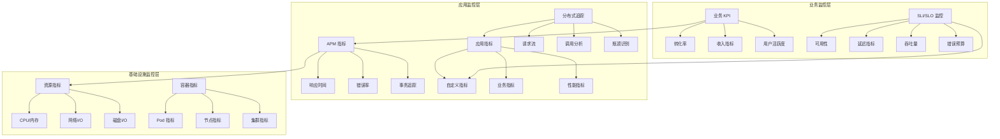
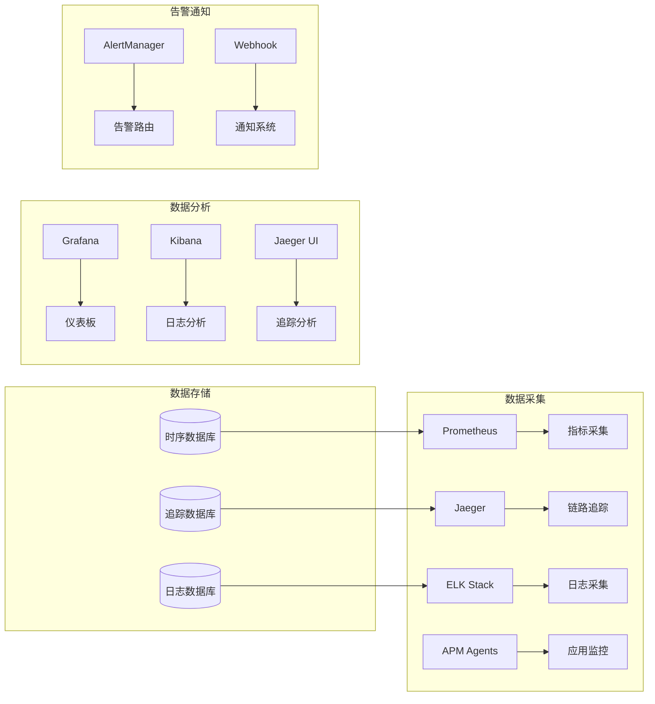

# Kubernetes 应用性能监控

## 应用监控概述

应用性能监控（APM）是确保 Kubernetes 集群中应用高效运行的关键环节，通过全面监控应用的性能指标、用户体验和业务指标，实现主动的性能管理和优化。

## 监控体系架构

### 三层监控模型



### 监控技术栈



## 应用指标监控

### 核心应用指标

**黄金指标监控配置**：
```yaml
# 应用黄金指标监控规则
apiVersion: v1
kind: ConfigMap
metadata:
  name: golden-signals-rules
data:
  golden-signals.yml: |
    groups:
    - name: golden-signals
      rules:
      # 延迟指标 (Latency)
      - record: app:http_request_duration_seconds:mean5m
        expr: |
          rate(http_request_duration_seconds_sum[5m]) /
          rate(http_request_duration_seconds_count[5m])
      
      - record: app:http_request_duration_seconds:p95
        expr: |
          histogram_quantile(0.95, 
            rate(http_request_duration_seconds_bucket[5m])
          )
      
      - record: app:http_request_duration_seconds:p99
        expr: |
          histogram_quantile(0.99, 
            rate(http_request_duration_seconds_bucket[5m])
          )
      
      # 流量指标 (Traffic)
      - record: app:http_requests:rate5m
        expr: |
          rate(http_requests_total[5m])
      
      - record: app:http_requests:rate1h
        expr: |
          rate(http_requests_total[1h])
      
      # 错误指标 (Errors)
      - record: app:http_request_error_rate:rate5m
        expr: |
          (
            rate(http_requests_total{status=~"4..|5.."}[5m]) /
            rate(http_requests_total[5m])
          ) * 100
      
      - record: app:http_request_5xx_rate:rate5m
        expr: |
          rate(http_requests_total{status=~"5.."}[5m]) /
          rate(http_requests_total[5m])
      
      # 饱和度指标 (Saturation)
      - record: app:resource_saturation:cpu
        expr: |
          (
            rate(container_cpu_usage_seconds_total[5m]) /
            container_spec_cpu_quota * container_spec_cpu_period
          ) * 100
      
      - record: app:resource_saturation:memory
        expr: |
          (
            container_memory_working_set_bytes /
            container_spec_memory_limit_bytes
          ) * 100
```

**应用性能监控告警**：
```yaml
# 应用性能告警规则
apiVersion: v1
kind: ConfigMap
metadata:
  name: app-performance-alerts
data:
  app-alerts.yml: |
    groups:
    - name: application-performance
      rules:
      # 响应时间告警
      - alert: HighResponseTime
        expr: |
          app:http_request_duration_seconds:p95 > 1.0
        for: 2m
        labels:
          severity: warning
          component: application
        annotations:
          summary: "应用 {{ $labels.service }} 响应时间过高"
          description: "95% 响应时间: {{ $value }}s，超过 1 秒阈值"
          dashboard: "http://grafana.example.com/d/app-performance"
      
      - alert: CriticalResponseTime
        expr: |
          app:http_request_duration_seconds:p95 > 3.0
        for: 1m
        labels:
          severity: critical
          component: application
        annotations:
          summary: "应用 {{ $labels.service }} 响应时间严重超标"
          description: "95% 响应时间: {{ $value }}s，超过 3 秒严重阈值"
      
      # 错误率告警
      - alert: HighErrorRate
        expr: |
          app:http_request_error_rate:rate5m > 5
        for: 2m
        labels:
          severity: warning
          component: application
        annotations:
          summary: "应用 {{ $labels.service }} 错误率过高"
          description: "错误率: {{ $value }}%，超过 5% 阈值"
      
      - alert: CriticalErrorRate
        expr: |
          app:http_request_error_rate:rate5m > 10
        for: 1m
        labels:
          severity: critical
          component: application
        annotations:
          summary: "应用 {{ $labels.service }} 错误率严重超标"
          description: "错误率: {{ $value }}%，超过 10% 严重阈值"
      
      # 流量异常告警
      - alert: TrafficDrop
        expr: |
          (
            app:http_requests:rate5m /
            app:http_requests:rate1h
          ) < 0.5
        for: 5m
        labels:
          severity: warning
          component: application
        annotations:
          summary: "应用 {{ $labels.service }} 流量大幅下降"
          description: "当前流量相比小时均值下降超过 50%"
      
      - alert: TrafficSpike
        expr: |
          (
            app:http_requests:rate5m /
            app:http_requests:rate1h
          ) > 3.0
        for: 2m
        labels:
          severity: warning
          component: application
        annotations:
          summary: "应用 {{ $labels.service }} 流量激增"
          description: "当前流量相比小时均值增长超过 300%"
      
      # 资源饱和度告警
      - alert: HighCPUSaturation
        expr: |
          app:resource_saturation:cpu > 90
        for: 5m
        labels:
          severity: warning
          component: application
        annotations:
          summary: "应用 {{ $labels.pod }} CPU 饱和度过高"
          description: "CPU 使用率: {{ $value }}%"
      
      - alert: HighMemorySaturation
        expr: |
          app:resource_saturation:memory > 90
        for: 3m
        labels:
          severity: critical
          component: application
        annotations:
          summary: "应用 {{ $labels.pod }} 内存饱和度过高"
          description: "内存使用率: {{ $value }}%"
```

### 自定义业务指标

**业务指标监控配置**：
```yaml
# 自定义业务指标监控
apiVersion: v1
kind: ConfigMap
metadata:
  name: business-metrics-config
data:
  business-rules.yml: |
    groups:
    - name: business-metrics
      rules:
      # 用户登录成功率
      - record: business:login_success_rate:rate5m
        expr: |
          (
            rate(user_login_total{status="success"}[5m]) /
            rate(user_login_total[5m])
          ) * 100
      
      # 订单完成率
      - record: business:order_completion_rate:rate5m
        expr: |
          (
            rate(order_events_total{status="completed"}[5m]) /
            rate(order_events_total{status="created"}[5m])
          ) * 100
      
      # 支付成功率
      - record: business:payment_success_rate:rate5m
        expr: |
          (
            rate(payment_events_total{status="success"}[5m]) /
            rate(payment_events_total[5m])
          ) * 100
      
      # 平均订单价值
      - record: business:average_order_value:rate5m
        expr: |
          rate(order_value_total[5m]) /
          rate(order_events_total{status="completed"}[5m])
      
      # 用户活跃度
      - record: business:active_users:5m
        expr: |
          count by (service) (
            rate(user_activity_total[5m]) > 0
          )

---
# 业务指标告警规则
apiVersion: v1
kind: ConfigMap
metadata:
  name: business-alerts
data:
  business-alerts.yml: |
    groups:
    - name: business-alerts
      rules:
      # 登录成功率过低
      - alert: LowLoginSuccessRate
        expr: |
          business:login_success_rate:rate5m < 95
        for: 3m
        labels:
          severity: warning
          type: business
        annotations:
          summary: "用户登录成功率过低"
          description: "登录成功率: {{ $value }}%，低于 95% 阈值"
      
      # 订单完成率异常
      - alert: LowOrderCompletionRate
        expr: |
          business:order_completion_rate:rate5m < 80
        for: 5m
        labels:
          severity: critical
          type: business
        annotations:
          summary: "订单完成率异常"
          description: "订单完成率: {{ $value }}%，低于 80% 阈值"
      
      # 支付成功率过低
      - alert: LowPaymentSuccessRate
        expr: |
          business:payment_success_rate:rate5m < 98
        for: 2m
        labels:
          severity: critical
          type: business
        annotations:
          summary: "支付成功率过低"
          description: "支付成功率: {{ $value }}%，低于 98% 阈值"
      
      # 平均订单价值异常下降
      - alert: AverageOrderValueDrop
        expr: |
          (
            business:average_order_value:rate5m /
            business:average_order_value:rate5m offset 24h
          ) < 0.8
        for: 10m
        labels:
          severity: warning
          type: business
        annotations:
          summary: "平均订单价值异常下降"
          description: "相比昨日同期下降超过 20%"
```

## APM 工具集成

### Jaeger 分布式追踪

**Jaeger 部署配置**：
```yaml
# Jaeger All-in-One 部署
apiVersion: apps/v1
kind: Deployment
metadata:
  name: jaeger
  namespace: monitoring
spec:
  replicas: 1
  selector:
    matchLabels:
      app: jaeger
  template:
    metadata:
      labels:
        app: jaeger
    spec:
      containers:
      - name: jaeger
        image: jaegertracing/all-in-one:1.35
        ports:
        - containerPort: 16686
          name: ui
        - containerPort: 14268
          name: collector-http
        - containerPort: 14250
          name: collector-grpc
        - containerPort: 6831
          name: agent-compact
          protocol: UDP
        - containerPort: 6832
          name: agent-binary
          protocol: UDP
        env:
        - name: COLLECTOR_OTLP_ENABLED
          value: "true"
        - name: COLLECTOR_ZIPKIN_HOST_PORT
          value: ":9411"
        resources:
          requests:
            cpu: 200m
            memory: 512Mi
          limits:
            cpu: 500m
            memory: 1Gi
        readinessProbe:
          httpGet:
            path: /
            port: 16686
          initialDelaySeconds: 10
        livenessProbe:
          httpGet:
            path: /
            port: 16686
          initialDelaySeconds: 30

---
# Jaeger Service
apiVersion: v1
kind: Service
metadata:
  name: jaeger
  namespace: monitoring
spec:
  selector:
    app: jaeger
  ports:
  - name: ui
    port: 16686
    targetPort: 16686
  - name: collector-http
    port: 14268
    targetPort: 14268
  - name: collector-grpc
    port: 14250
    targetPort: 14250
  - name: agent-compact
    port: 6831
    targetPort: 6831
    protocol: UDP
  - name: agent-binary
    port: 6832
    targetPort: 6832
    protocol: UDP
  type: ClusterIP
```

**应用集成 Jaeger 配置**：
```yaml
# 带 Jaeger 追踪的应用部署
apiVersion: apps/v1
kind: Deployment
metadata:
  name: traced-app
spec:
  replicas: 3
  selector:
    matchLabels:
      app: traced-app
  template:
    metadata:
      labels:
        app: traced-app
    spec:
      containers:
      - name: app
        image: traced-app:latest
        ports:
        - containerPort: 8080
        env:
        # Jaeger 配置
        - name: JAEGER_AGENT_HOST
          value: "jaeger.monitoring.svc.cluster.local"
        - name: JAEGER_AGENT_PORT
          value: "6831"
        - name: JAEGER_SERVICE_NAME
          value: "traced-app"
        - name: JAEGER_SAMPLER_TYPE
          value: "const"
        - name: JAEGER_SAMPLER_PARAM
          value: "1"
        - name: JAEGER_REPORTER_LOG_SPANS
          value: "true"
        # OpenTelemetry 配置
        - name: OTEL_EXPORTER_JAEGER_ENDPOINT
          value: "http://jaeger.monitoring.svc.cluster.local:14268/api/traces"
        - name: OTEL_SERVICE_NAME
          value: "traced-app"
        - name: OTEL_RESOURCE_ATTRIBUTES
          value: "service.version=1.0.0,deployment.environment=production"
        resources:
          requests:
            cpu: 200m
            memory: 256Mi
          limits:
            cpu: 500m
            memory: 512Mi
```

### Prometheus 应用监控

**应用 Prometheus 指标暴露**：
```yaml
# 应用监控配置
apiVersion: v1
kind: ConfigMap
metadata:
  name: app-monitoring-config
data:
  prometheus.yml: |
    # Prometheus 配置
    global:
      scrape_interval: 15s
      evaluation_interval: 15s
    
    scrape_configs:
    # 应用指标采集
    - job_name: 'kubernetes-apps'
      kubernetes_sd_configs:
      - role: pod
      relabel_configs:
      # 只采集有 prometheus.io/scrape 注解的 Pod
      - source_labels: [__meta_kubernetes_pod_annotation_prometheus_io_scrape]
        action: keep
        regex: true
      - source_labels: [__meta_kubernetes_pod_annotation_prometheus_io_path]
        action: replace
        target_label: __metrics_path__
        regex: (.+)
      - source_labels: [__address__, __meta_kubernetes_pod_annotation_prometheus_io_port]
        action: replace
        regex: ([^:]+)(?::\d+)?;(\d+)
        replacement: $1:$2
        target_label: __address__
      - action: labelmap
        regex: __meta_kubernetes_pod_label_(.+)
      - source_labels: [__meta_kubernetes_namespace]
        action: replace
        target_label: kubernetes_namespace
      - source_labels: [__meta_kubernetes_pod_name]
        action: replace
        target_label: kubernetes_pod_name
    
    # JVM 应用指标采集
    - job_name: 'jvm-applications'
      kubernetes_sd_configs:
      - role: pod
      relabel_configs:
      - source_labels: [__meta_kubernetes_pod_annotation_prometheus_io_scrape_jvm]
        action: keep
        regex: true
      - source_labels: [__meta_kubernetes_pod_annotation_prometheus_io_jvm_path]
        action: replace
        target_label: __metrics_path__
        regex: (.+)
        replacement: ${1}
      - source_labels: [__address__, __meta_kubernetes_pod_annotation_prometheus_io_jvm_port]
        action: replace
        regex: ([^:]+)(?::\d+)?;(\d+)
        replacement: $1:$2
        target_label: __address__

---
# 应用指标暴露示例
apiVersion: apps/v1
kind: Deployment
metadata:
  name: monitored-app
spec:
  replicas: 3
  selector:
    matchLabels:
      app: monitored-app
  template:
    metadata:
      labels:
        app: monitored-app
      annotations:
        # Prometheus 监控注解
        prometheus.io/scrape: "true"
        prometheus.io/port: "8080"
        prometheus.io/path: "/metrics"
        # JVM 监控注解
        prometheus.io/scrape_jvm: "true"
        prometheus.io/jvm_port: "8081"
        prometheus.io/jvm_path: "/actuator/prometheus"
    spec:
      containers:
      - name: app
        image: monitored-app:latest
        ports:
        - containerPort: 8080
          name: http
        - containerPort: 8081
          name: metrics
        env:
        - name: MANAGEMENT_ENDPOINTS_WEB_EXPOSURE_INCLUDE
          value: "health,info,metrics,prometheus"
        - name: MANAGEMENT_ENDPOINT_METRICS_ENABLED
          value: "true"
        - name: MANAGEMENT_ENDPOINT_PROMETHEUS_ENABLED
          value: "true"
        resources:
          requests:
            cpu: 200m
            memory: 512Mi
          limits:
            cpu: 500m
            memory: 1Gi
```

## 应用性能分析

### 性能分析工具

**应用性能分析 Pod**：
```yaml
# Java 应用性能分析工具
apiVersion: v1
kind: Pod
metadata:
  name: java-profiler
  namespace: monitoring
spec:
  containers:
  - name: profiler
    image: openjdk:17-jdk
    command: ['sleep', '3600']
    resources:
      requests:
        cpu: 200m
        memory: 512Mi
      limits:
        cpu: 500m
        memory: 1Gi
    volumeMounts:
    - name: profiler-tools
      mountPath: /tools
    - name: app-data
      mountPath: /app-data
  volumes:
  - name: profiler-tools
    configMap:
      name: profiler-scripts
      defaultMode: 0755
  - name: app-data
    emptyDir: {}

---
# 性能分析脚本
apiVersion: v1
kind: ConfigMap
metadata:
  name: profiler-scripts
data:
  jvm-analysis.sh: |
    #!/bin/bash
    # JVM 性能分析脚本
    
    APP_POD=$1
    NAMESPACE=${2:-default}
    
    if [ -z "$APP_POD" ]; then
        echo "用法: $0 <pod-name> [namespace]"
        exit 1
    fi
    
    echo "=== JVM 性能分析: $NAMESPACE/$APP_POD ==="
    
    # 获取 JVM 进程信息
    echo "1. JVM 进程信息:"
    kubectl exec -n $NAMESPACE $APP_POD -- jps -v
    
    # 堆内存分析
    echo -e "\n2. 堆内存使用情况:"
    kubectl exec -n $NAMESPACE $APP_POD -- jstat -gc 1
    
    # 线程分析
    echo -e "\n3. 线程状态分析:"
    kubectl exec -n $NAMESPACE $APP_POD -- jstack 1 | grep -E "java.lang.Thread.State:|at " | head -20
    
    # GC 分析
    echo -e "\n4. GC 统计信息:"
    kubectl exec -n $NAMESPACE $APP_POD -- jstat -gcutil 1 1
    
    # 内存区域分析
    echo -e "\n5. 内存区域使用:"
    kubectl exec -n $NAMESPACE $APP_POD -- jcmd 1 VM.memory_map | head -20
    
    echo -e "\n分析完成！"
  
  app-metrics.sh: |
    #!/bin/bash
    # 应用指标分析脚本
    
    NAMESPACE=${1:-default}
    
    echo "=== 应用性能指标分析 ==="
    
    # 获取高资源使用的 Pod
    echo "1. 高资源使用 Pod:"
    kubectl top pods -n $NAMESPACE --sort-by=cpu | head -10
    
    # 检查应用健康状态
    echo -e "\n2. 应用健康检查:"
    kubectl get pods -n $NAMESPACE -o custom-columns="NAME:.metadata.name,READY:.status.containerStatuses[0].ready,RESTARTS:.status.containerStatuses[0].restartCount,STATUS:.status.phase"
    
    # 检查应用日志错误
    echo -e "\n3. 最近错误日志:"
    for pod in $(kubectl get pods -n $NAMESPACE -o jsonpath='{.items[*].metadata.name}'); do
        echo "检查 Pod: $pod"
        kubectl logs -n $NAMESPACE $pod --tail=100 | grep -i error | head -5
    done
    
    echo -e "\n分析完成！"
```

### 性能基准建立

**应用性能基准测试**：
```yaml
# 应用性能基准测试作业
apiVersion: batch/v1
kind: Job
metadata:
  name: app-performance-baseline
  namespace: monitoring
spec:
  template:
    spec:
      containers:
      - name: benchmark
        image: peterevans/vegeta
        command:
        - sh
        - -c
        - |
          # 定义测试目标
          cat > targets.txt << EOF
          GET http://monitored-app.default.svc.cluster.local:8080/api/users
          GET http://monitored-app.default.svc.cluster.local:8080/api/products
          POST http://monitored-app.default.svc.cluster.local:8080/api/orders
          @body.json
          EOF
          
          # 定义请求体
          cat > body.json << EOF
          {
            "userId": 123,
            "productId": 456,
            "quantity": 1
          }
          EOF
          
          echo "=== 应用性能基准测试 ==="
          
          # 轻负载测试
          echo "1. 轻负载测试 (10 QPS, 60s):"
          vegeta attack -targets=targets.txt -rate=10 -duration=60s | \
            vegeta report -type=text
          
          # 中等负载测试
          echo -e "\n2. 中等负载测试 (50 QPS, 120s):"
          vegeta attack -targets=targets.txt -rate=50 -duration=120s | \
            vegeta report -type=text
          
          # 高负载测试
          echo -e "\n3. 高负载测试 (100 QPS, 180s):"
          vegeta attack -targets=targets.txt -rate=100 -duration=180s | \
            vegeta report -type=text
          
          # 压力测试
          echo -e "\n4. 压力测试 (200 QPS, 60s):"
          vegeta attack -targets=targets.txt -rate=200 -duration=60s | \
            vegeta report -type=text
          
          echo -e "\n基准测试完成！"
        resources:
          requests:
            cpu: 200m
            memory: 256Mi
          limits:
            cpu: 500m
            memory: 512Mi
      restartPolicy: Never
  backoffLimit: 1
```

## 监控仪表板

### Grafana 仪表板配置

**应用性能仪表板**：
```yaml
# Grafana 应用监控仪表板配置
apiVersion: v1
kind: ConfigMap
metadata:
  name: app-dashboard-config
data:
  app-performance-dashboard.json: |
    {
      "dashboard": {
        "id": null,
        "title": "应用性能监控",
        "tags": ["kubernetes", "application", "performance"],
        "timezone": "browser",
        "panels": [
          {
            "id": 1,
            "title": "请求响应时间",
            "type": "graph",
            "targets": [
              {
                "expr": "app:http_request_duration_seconds:mean5m",
                "legendFormat": "平均响应时间"
              },
              {
                "expr": "app:http_request_duration_seconds:p95",
                "legendFormat": "95% 响应时间"
              },
              {
                "expr": "app:http_request_duration_seconds:p99",
                "legendFormat": "99% 响应时间"
              }
            ],
            "yAxes": [
              {
                "label": "时间 (秒)",
                "min": 0
              }
            ],
            "gridPos": {
              "h": 8,
              "w": 12,
              "x": 0,
              "y": 0
            }
          },
          {
            "id": 2,
            "title": "请求量和错误率",
            "type": "graph",
            "targets": [
              {
                "expr": "app:http_requests:rate5m",
                "legendFormat": "请求量 (QPS)"
              },
              {
                "expr": "app:http_request_error_rate:rate5m",
                "legendFormat": "错误率 (%)"
              }
            ],
            "gridPos": {
              "h": 8,
              "w": 12,
              "x": 12,
              "y": 0
            }
          },
          {
            "id": 3,
            "title": "资源使用情况",
            "type": "graph",
            "targets": [
              {
                "expr": "app:resource_saturation:cpu",
                "legendFormat": "CPU 使用率 (%)"
              },
              {
                "expr": "app:resource_saturation:memory",
                "legendFormat": "内存使用率 (%)"
              }
            ],
            "gridPos": {
              "h": 8,
              "w": 12,
              "x": 0,
              "y": 8
            }
          },
          {
            "id": 4,
            "title": "业务指标",
            "type": "singlestat",
            "targets": [
              {
                "expr": "business:login_success_rate:rate5m",
                "legendFormat": "登录成功率"
              },
              {
                "expr": "business:order_completion_rate:rate5m",
                "legendFormat": "订单完成率"
              },
              {
                "expr": "business:payment_success_rate:rate5m",
                "legendFormat": "支付成功率"
              }
            ],
            "gridPos": {
              "h": 8,
              "w": 12,
              "x": 12,
              "y": 8
            }
          }
        ],
        "time": {
          "from": "now-1h",
          "to": "now"
        },
        "refresh": "30s"
      }
    }
```

### SLI/SLO 监控配置

**SLI/SLO 定义和监控**：
```yaml
# SLI/SLO 监控配置
apiVersion: v1
kind: ConfigMap
metadata:
  name: sli-slo-config
data:
  sli-slo-rules.yml: |
    groups:
    - name: sli-slo-monitoring
      rules:
      # 可用性 SLI (99.9% 可用性目标)
      - record: sli:availability:rate5m
        expr: |
          (
            rate(http_requests_total{status!~"5.."}[5m]) /
            rate(http_requests_total[5m])
          ) * 100
      
      # 延迟 SLI (95% 请求 < 500ms)
      - record: sli:latency:rate5m
        expr: |
          (
            rate(http_request_duration_seconds_bucket{le="0.5"}[5m]) /
            rate(http_request_duration_seconds_count[5m])
          ) * 100
      
      # 吞吐量 SLI
      - record: sli:throughput:rate5m
        expr: |
          rate(http_requests_total[5m])
      
      # 错误预算计算 (月度)
      - record: slo:error_budget:30d
        expr: |
          (
            1 - (
              (rate(http_requests_total{status!~"5.."}[30d]) /
               rate(http_requests_total[30d])) /
              0.999  # 99.9% 可用性目标
            )
          ) * 100
      
      # SLO 违反告警
      - alert: SLOAvailabilityBreach
        expr: |
          sli:availability:rate5m < 99.9
        for: 1m
        labels:
          severity: critical
          type: slo-breach
        annotations:
          summary: "可用性 SLO 违反"
          description: "当前可用性: {{ $value }}%，低于 99.9% 目标"
      
      - alert: SLOLatencyBreach
        expr: |
          sli:latency:rate5m < 95
        for: 2m
        labels:
          severity: warning
          type: slo-breach
        annotations:
          summary: "延迟 SLO 违反"
          description: "当前延迟达标率: {{ $value }}%，低于 95% 目标"
      
      - alert: ErrorBudgetExhaustion
        expr: |
          slo:error_budget:30d < 10
        for: 5m
        labels:
          severity: critical
          type: error-budget
        annotations:
          summary: "错误预算即将耗尽"
          description: "剩余错误预算: {{ $value }}%"
```

## 监控最佳实践

### 监控策略

1. **分层监控**：建立业务-应用-基础设施三层监控体系
2. **关键指标**：专注于黄金信号（延迟、流量、错误、饱和度）
3. **用户体验**：以用户体验为中心设计监控指标
4. **主动监控**：建立预警机制，实现问题的主动发现
5. **持续优化**：基于监控数据持续优化应用性能

### 告警策略

1. **告警分级**：按照影响程度设置不同级别的告警
2. **告警聚合**：避免告警风暴，合理聚合相关告警
3. **静默机制**：在维护期间合理使用告警静默
4. **告警验证**：确保告警的准确性和及时性
5. **值班流程**：建立完善的告警响应和处理流程

通过完善的应用性能监控体系，可以全面掌握应用运行状况，及时发现和解决性能问题，确保用户体验和业务连续性。
