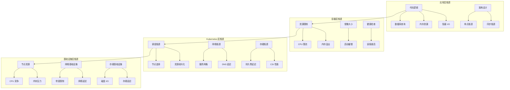
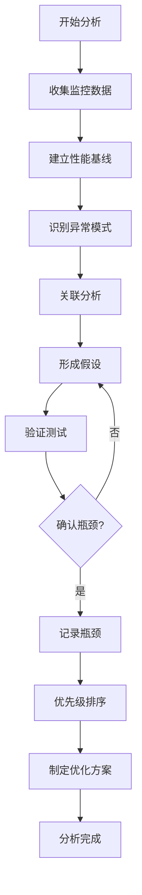

# Kubernetes 性能瓶颈识别

## 瓶颈识别概述

性能瓶颈识别是系统优化的关键步骤，通过系统性的分析方法，识别制约系统性能的关键因素，为针对性优化提供明确方向。

## 瓶颈分析方法论

### 分层分析模型



### 瓶颈分析流程



## CPU 瓶颈识别

### CPU 性能指标分析

**关键 CPU 监控指标**：
```yaml
# CPU 瓶颈监控规则
apiVersion: v1
kind: ConfigMap
metadata:
  name: cpu-bottleneck-rules
data:
  cpu-rules.yml: |
    groups:
    - name: cpu-bottleneck-detection
      rules:
      # CPU 使用率过高
      - alert: HighCPUUsage
        expr: |
          (
            100 - (avg by (instance) (
              rate(node_cpu_seconds_total{mode="idle"}[5m])
            ) * 100)
          ) > 80
        for: 5m
        labels:
          severity: warning
          type: cpu-bottleneck
        annotations:
          summary: "节点 {{ $labels.instance }} CPU 使用率过高"
          description: "CPU 使用率: {{ $value }}%"
      
      # CPU 限流严重
      - alert: CPUThrottlingHigh
        expr: |
          rate(container_cpu_cfs_throttled_seconds_total[5m]) /
          rate(container_cpu_cfs_periods_total[5m]) > 0.5
        for: 2m
        labels:
          severity: critical
          type: cpu-bottleneck
        annotations:
          summary: "容器 {{ $labels.container }} 在 Pod {{ $labels.pod }} 中 CPU 限流严重"
          description: "限流比例: {{ $value | humanizePercentage }}"
      
      # 负载均衡不佳
      - alert: CPULoadImbalance
        expr: |
          (
            max by (cluster) (node:cpu_utilization:rate5m) -
            min by (cluster) (node:cpu_utilization:rate5m)
          ) > 50
        for: 10m
        labels:
          severity: warning
          type: cpu-bottleneck
        annotations:
          summary: "集群 CPU 负载不均衡"
          description: "最大最小 CPU 使用率差异: {{ $value }}%"
      
      # 上下文切换过多
      - alert: HighContextSwitches
        expr: |
          rate(node_context_switches_total[5m]) > 100000
        for: 5m
        labels:
          severity: warning
          type: cpu-bottleneck
        annotations:
          summary: "节点 {{ $labels.instance }} 上下文切换频繁"
          description: "上下文切换率: {{ $value }} 次/秒"
```

**CPU 瓶颈诊断脚本**：
```bash
#!/bin/bash
# CPU 瓶颈诊断脚本

echo "=== CPU 瓶颈识别分析 ==="

# 1. 检查节点 CPU 使用率
echo "1. 节点 CPU 使用情况:"
kubectl top nodes --sort-by=cpu
echo ""

# 2. 识别高 CPU 使用的 Pod
echo "2. 高 CPU 使用 Pod (Top 15):"
kubectl top pods --all-namespaces --sort-by=cpu | head -16
echo ""

# 3. 检查 CPU 限流情况
echo "3. CPU 限流检查:"
for namespace in $(kubectl get namespaces -o jsonpath='{.items[*].metadata.name}'); do
    for pod in $(kubectl get pods -n $namespace -o jsonpath='{.items[*].metadata.name}'); do
        # 检查 CPU 限流指标
        throttled=$(kubectl exec -n $namespace $pod -- cat /sys/fs/cgroup/cpu/cpu.stat 2>/dev/null | grep throttled_time | awk '{print $2}' 2>/dev/null)
        if [[ $throttled -gt 1000000000 ]]; then  # 超过1秒的限流
            echo "  限流检测: $namespace/$pod - 限流时间: ${throttled}ns"
        fi
    done 2>/dev/null
done
echo ""

# 4. 分析 CPU 请求和限制配置
echo "4. CPU 资源配置分析:"
kubectl get pods --all-namespaces -o custom-columns="NAMESPACE:.metadata.namespace,NAME:.metadata.name,CPU_REQ:.spec.containers[*].resources.requests.cpu,CPU_LIMIT:.spec.containers[*].resources.limits.cpu" | \
    awk 'NR>1 && ($3=="" || $4=="") {print $1"/"$2 " - 缺少 CPU 配置"}'
echo ""

# 5. 检查节点负载分布
echo "5. 节点负载分布分析:"
kubectl describe nodes | grep -A5 "Allocated resources" | grep -E "(cpu|memory)" | \
    awk '{print "Node load: " $0}'
echo ""

# 6. CPU 密集型工作负载识别
echo "6. CPU 密集型工作负载识别:"
kubectl get pods --all-namespaces -o json | jq -r '
    .items[] | 
    select(.spec.containers[].resources.requests.cpu != null) |
    select(.spec.containers[].resources.requests.cpu | test("^[0-9]+$|^[0-9]+m$")) |
    select((.spec.containers[].resources.requests.cpu | rtrimstr("m") | tonumber) > 1000) |
    "\(.metadata.namespace)/\(.metadata.name): \(.spec.containers[].resources.requests.cpu)"
'

echo ""
echo "=== CPU 瓶颈分析建议 ==="
echo "1. 检查 CPU 使用率超过 80% 的节点和应用"
echo "2. 优化高 CPU 使用的应用算法和代码"
echo "3. 调整 CPU 请求和限制配置"
echo "4. 考虑节点扩容或负载重新分布"
echo "5. 使用 CPU 亲和性优化调度"
```

### CPU 性能分析工具

**性能分析 Pod 配置**：
```yaml
# CPU 性能分析工具 Pod
apiVersion: v1
kind: Pod
metadata:
  name: cpu-profiler
  namespace: monitoring
spec:
  hostPID: true
  hostNetwork: true
  securityContext:
    privileged: true
  containers:
  - name: profiler
    image: ubuntu:20.04
    command: ['sleep', '3600']
    resources:
      requests:
        cpu: 100m
        memory: 256Mi
      limits:
        cpu: 500m
        memory: 512Mi
    volumeMounts:
    - name: proc
      mountPath: /host/proc
      readOnly: true
    - name: sys
      mountPath: /host/sys
      readOnly: true
    securityContext:
      privileged: true
  volumes:
  - name: proc
    hostPath:
      path: /proc
  - name: sys
    hostPath:
      path: /sys
  restartPolicy: Never

---
# CPU 分析作业
apiVersion: batch/v1
kind: Job
metadata:
  name: cpu-analysis
  namespace: monitoring
spec:
  template:
    spec:
      containers:
      - name: analyzer
        image: brendangregg/perf-tools
        command:
        - sh
        - -c
        - |
          # 系统级 CPU 分析
          echo "=== 系统 CPU 使用分析 ==="
          cat /proc/stat | head -1
          
          # 进程级 CPU 分析
          echo -e "\n=== 高 CPU 使用进程 ==="
          ps aux --sort=-%cpu | head -20
          
          # CPU 频率分析
          echo -e "\n=== CPU 频率信息 ==="
          cat /proc/cpuinfo | grep MHz
          
          # 中断分析
          echo -e "\n=== 中断统计 ==="
          cat /proc/interrupts | head -10
          
          sleep 60
        resources:
          requests:
            cpu: 100m
            memory: 128Mi
        securityContext:
          privileged: true
        volumeMounts:
        - name: proc
          mountPath: /proc
          readOnly: true
      volumes:
      - name: proc
        hostPath:
          path: /proc
      restartPolicy: Never
```

## 内存瓶颈识别

### 内存泄漏检测

**内存监控和分析**：
```yaml
# 内存瓶颈监控规则
apiVersion: v1
kind: ConfigMap
metadata:
  name: memory-bottleneck-rules
data:
  memory-rules.yml: |
    groups:
    - name: memory-bottleneck-detection
      rules:
      # 内存使用率过高
      - alert: HighMemoryUsage
        expr: |
          (
            1 - (
              node_memory_MemAvailable_bytes /
              node_memory_MemTotal_bytes
            )
          ) * 100 > 85
        for: 5m
        labels:
          severity: warning
          type: memory-bottleneck
        annotations:
          summary: "节点 {{ $labels.instance }} 内存使用率过高"
          description: "内存使用率: {{ $value }}%"
      
      # 内存泄漏检测
      - alert: MemoryLeakDetected
        expr: |
          increase(container_memory_working_set_bytes[1h]) > 100*1024*1024
        for: 0m
        labels:
          severity: critical
          type: memory-bottleneck
        annotations:
          summary: "检测到内存泄漏: {{ $labels.pod }}"
          description: "1小时内内存增长: {{ $value | humanizeBytes }}"
      
      # OOM 事件频繁
      - alert: FrequentOOMKills
        expr: |
          increase(kube_pod_container_status_restarts_total{reason="OOMKilled"}[1h]) > 3
        for: 0m
        labels:
          severity: critical
          type: memory-bottleneck
        annotations:
          summary: "频繁 OOM 终止: {{ $labels.pod }}"
          description: "1小时内 OOM 次数: {{ $value }}"
      
      # 内存碎片化
      - alert: MemoryFragmentation
        expr: |
          (
            node_memory_MemFree_bytes +
            node_memory_Cached_bytes +
            node_memory_Buffers_bytes
          ) / node_memory_MemTotal_bytes < 0.1
        for: 10m
        labels:
          severity: warning
          type: memory-bottleneck
        annotations:
          summary: "节点 {{ $labels.instance }} 内存碎片化严重"
          description: "可用内存比例: {{ $value | humanizePercentage }}"
```

**内存分析脚本**：
```bash
#!/bin/bash
# 内存瓶颈诊断脚本

echo "=== 内存瓶颈识别分析 ==="

# 1. 节点内存使用情况
echo "1. 节点内存使用情况:"
kubectl top nodes --sort-by=memory
echo ""

# 2. 高内存使用 Pod
echo "2. 高内存使用 Pod (Top 15):"
kubectl top pods --all-namespaces --sort-by=memory | head -16
echo ""

# 3. OOM 事件检查
echo "3. 最近的 OOM 事件:"
kubectl get events --all-namespaces --field-selector reason=OOMKilling \
    --sort-by='.lastTimestamp' | tail -10
echo ""

# 4. 内存配置分析
echo "4. 内存资源配置检查:"
kubectl get pods --all-namespaces -o custom-columns="NAMESPACE:.metadata.namespace,NAME:.metadata.name,MEM_REQ:.spec.containers[*].resources.requests.memory,MEM_LIMIT:.spec.containers[*].resources.limits.memory" | \
    awk 'NR>1 && ($3=="" || $4=="") {print $1"/"$2 " - 缺少内存配置"}'
echo ""

# 5. 内存使用趋势分析
echo "5. 容器重启统计 (可能的内存问题):"
kubectl get pods --all-namespaces -o json | jq -r '
    .items[] | 
    select(.status.containerStatuses != null) |
    select(.status.containerStatuses[].restartCount > 0) |
    "\(.metadata.namespace)/\(.metadata.name): 重启 \(.status.containerStatuses[0].restartCount) 次"
' | sort -k3 -nr | head -10
echo ""

# 6. 内存限制和实际使用对比
echo "6. 内存配置vs实际使用分析:"
for namespace in $(kubectl get namespaces -o jsonpath='{.items[*].metadata.name}'); do
    kubectl get pods -n $namespace -o json | jq -r --arg ns "$namespace" '
        .items[] |
        select(.spec.containers[].resources.limits.memory != null) |
        "\($ns)/\(.metadata.name): 限制 \(.spec.containers[0].resources.limits.memory)"
    '
done 2>/dev/null | head -10

echo ""
echo "=== 内存瓶颈分析建议 ==="
echo "1. 检查内存使用率超过 85% 的节点"
echo "2. 排查频繁重启和 OOM 的 Pod"
echo "3. 调整内存请求和限制配置"
echo "4. 优化应用内存使用模式"
echo "5. 考虑使用内存分析工具进行深度分析"
```

## 网络瓶颈识别

### 网络性能分析

**网络瓶颈监控**：
```yaml
# 网络瓶颈监控规则
apiVersion: v1
kind: ConfigMap
metadata:
  name: network-bottleneck-rules
data:
  network-rules.yml: |
    groups:
    - name: network-bottleneck-detection
      rules:
      # 网络带宽使用率过高
      - alert: HighNetworkUsage
        expr: |
          (
            rate(node_network_receive_bytes_total{device!="lo"}[5m]) +
            rate(node_network_transmit_bytes_total{device!="lo"}[5m])
          ) / (100 * 1024 * 1024) > 80  # 假设 100MB/s 带宽
        for: 5m
        labels:
          severity: warning
          type: network-bottleneck
        annotations:
          summary: "节点 {{ $labels.instance }} 网络使用率过高"
          description: "网络流量: {{ $value }} MB/s"
      
      # 网络错误率过高
      - alert: HighNetworkErrors
        expr: |
          (
            rate(node_network_receive_errs_total[5m]) +
            rate(node_network_transmit_errs_total[5m])
          ) / (
            rate(node_network_receive_packets_total[5m]) +
            rate(node_network_transmit_packets_total[5m])
          ) > 0.01
        for: 2m
        labels:
          severity: critical
          type: network-bottleneck
        annotations:
          summary: "节点 {{ $labels.instance }} 网络错误率过高"
          description: "错误率: {{ $value | humanizePercentage }}"
      
      # DNS 解析延迟过高
      - alert: HighDNSLatency
        expr: |
          histogram_quantile(0.95, 
            rate(coredns_dns_request_duration_seconds_bucket[5m])
          ) > 0.1
        for: 2m
        labels:
          severity: warning
          type: network-bottleneck
        annotations:
          summary: "DNS 解析延迟过高"
          description: "95% DNS 请求延迟: {{ $value }}s"
      
      # 连接数过多
      - alert: TooManyConnections
        expr: |
          node_netstat_Tcp_CurrEstab > 10000
        for: 5m
        labels:
          severity: warning
          type: network-bottleneck
        annotations:
          summary: "节点 {{ $labels.instance }} TCP 连接数过多"
          description: "当前连接数: {{ $value }}"
```

**网络诊断工具**：
```yaml
# 网络诊断 Pod
apiVersion: v1
kind: Pod
metadata:
  name: network-diagnostics
  namespace: monitoring
spec:
  hostNetwork: true
  containers:
  - name: nettools
    image: nicolaka/netshoot
    command: ['sleep', '3600']
    resources:
      requests:
        cpu: 100m
        memory: 128Mi
      limits:
        cpu: 500m
        memory: 256Mi
    securityContext:
      capabilities:
        add: ["NET_ADMIN", "NET_RAW"]
  restartPolicy: Never

---
# 网络性能测试作业
apiVersion: batch/v1
kind: Job
metadata:
  name: network-perf-test
  namespace: monitoring
spec:
  template:
    spec:
      containers:
      - name: netperf
        image: nicolaka/netshoot
        command:
        - sh
        - -c
        - |
          echo "=== 网络连接状态 ==="
          netstat -tuln | head -20
          
          echo -e "\n=== DNS 解析测试 ==="
          for service in kubernetes.default.svc.cluster.local google.com; do
            echo "测试 $service:"
            time nslookup $service
          done
          
          echo -e "\n=== 网络接口统计 ==="
          cat /proc/net/dev
          
          echo -e "\n=== 路由表 ==="
          route -n
          
          sleep 30
        resources:
          requests:
            cpu: 100m
            memory: 128Mi
      restartPolicy: Never
```

## 存储瓶颈识别

### 存储 I/O 分析

**存储瓶颈监控**：
```yaml
# 存储瓶颈监控规则
apiVersion: v1
kind: ConfigMap
metadata:
  name: storage-bottleneck-rules
data:
  storage-rules.yml: |
    groups:
    - name: storage-bottleneck-detection
      rules:
      # 磁盘 I/O 使用率过高
      - alert: HighDiskIOUsage
        expr: |
          rate(node_disk_io_time_seconds_total[5m]) * 100 > 80
        for: 5m
        labels:
          severity: warning
          type: storage-bottleneck
        annotations:
          summary: "节点 {{ $labels.instance }} 磁盘 I/O 使用率过高"
          description: "I/O 使用率: {{ $value }}%"
      
      # 磁盘延迟过高
      - alert: HighDiskLatency
        expr: |
          (
            rate(node_disk_read_time_seconds_total[5m]) /
            rate(node_disk_reads_completed_total[5m])
          ) > 0.1
        for: 2m
        labels:
          severity: critical
          type: storage-bottleneck
        annotations:
          summary: "节点 {{ $labels.instance }} 磁盘读取延迟过高"
          description: "平均读取延迟: {{ $value }}s"
      
      # 持久卷使用率过高
      - alert: HighPVUsage
        expr: |
          (
            kubelet_volume_stats_used_bytes /
            kubelet_volume_stats_capacity_bytes
          ) * 100 > 85
        for: 5m
        labels:
          severity: warning
          type: storage-bottleneck
        annotations:
          summary: "持久卷 {{ $labels.persistentvolumeclaim }} 使用率过高"
          description: "使用率: {{ $value }}%"
      
      # 磁盘队列深度过大
      - alert: HighDiskQueueDepth
        expr: |
          rate(node_disk_io_time_weighted_seconds_total[5m]) /
          rate(node_disk_io_time_seconds_total[5m]) > 10
        for: 5m
        labels:
          severity: warning
          type: storage-bottleneck
        annotations:
          summary: "节点 {{ $labels.instance }} 磁盘队列深度过大"
          description: "平均队列深度: {{ $value }}"
```

**存储性能分析脚本**：
```bash
#!/bin/bash
# 存储瓶颈诊断脚本

echo "=== 存储瓶颈识别分析 ==="

# 1. 检查 PV 使用情况
echo "1. 持久卷使用情况:"
kubectl get pv -o custom-columns="NAME:.metadata.name,CAPACITY:.spec.capacity.storage,STATUS:.status.phase,CLAIM:.spec.claimRef.name" | head -10
echo ""

# 2. 检查 PVC 使用情况
echo "2. PVC 使用情况:"
kubectl get pvc --all-namespaces -o custom-columns="NAMESPACE:.metadata.namespace,NAME:.metadata.name,STATUS:.status.phase,VOLUME:.spec.volumeName,CAPACITY:.status.capacity.storage" | head -10
echo ""

# 3. 检查存储类配置
echo "3. 存储类配置:"
kubectl get storageclass -o custom-columns="NAME:.metadata.name,PROVISIONER:.provisioner,PARAMETERS:.parameters"
echo ""

# 4. 查找高磁盘使用的节点
echo "4. 节点磁盘使用情况:"
kubectl get nodes -o wide
echo ""

# 5. 检查存储相关事件
echo "5. 存储相关事件:"
kubectl get events --all-namespaces --field-selector reason=FailedMount,reason=FailedAttach,reason=VolumeFailedMount | head -10
echo ""

# 6. 分析存储性能配置
echo "6. 存储性能配置分析:"
kubectl get pods --all-namespaces -o json | jq -r '
    .items[] |
    select(.spec.volumes[]?.persistentVolumeClaim) |
    "\(.metadata.namespace)/\(.metadata.name): 使用 PVC \(.spec.volumes[] | select(.persistentVolumeClaim) | .persistentVolumeClaim.claimName)"
' | head -10

echo ""
echo "=== 存储瓶颈分析建议 ==="
echo "1. 检查磁盘 I/O 使用率和延迟"
echo "2. 优化存储类型和性能参数"
echo "3. 清理未使用的 PV 和 PVC"
echo "4. 考虑存储分层和缓存策略"
echo "5. 监控存储容量使用趋势"
```

## 应用层瓶颈识别

### 应用性能分析

**应用瓶颈监控**：
```yaml
# 应用层瓶颈监控
apiVersion: v1
kind: ConfigMap
metadata:
  name: application-bottleneck-rules
data:
  app-rules.yml: |
    groups:
    - name: application-bottleneck-detection
      rules:
      # 应用响应时间过长
      - alert: HighResponseTime
        expr: |
          histogram_quantile(0.95,
            rate(http_request_duration_seconds_bucket[5m])
          ) > 1.0
        for: 2m
        labels:
          severity: warning
          type: application-bottleneck
        annotations:
          summary: "应用 {{ $labels.service }} 响应时间过长"
          description: "95% 响应时间: {{ $value }}s"
      
      # 错误率过高
      - alert: HighErrorRate
        expr: |
          (
            rate(http_requests_total{status=~"5.."}[5m]) /
            rate(http_requests_total[5m])
          ) > 0.05
        for: 2m
        labels:
          severity: critical
          type: application-bottleneck
        annotations:
          summary: "应用 {{ $labels.service }} 错误率过高"
          description: "错误率: {{ $value | humanizePercentage }}"
      
      # 线程池耗尽
      - alert: ThreadPoolExhaustion
        expr: |
          jvm_threads_current / jvm_threads_max > 0.9
        for: 1m
        labels:
          severity: critical
          type: application-bottleneck
        annotations:
          summary: "应用 {{ $labels.service }} 线程池即将耗尽"
          description: "线程使用率: {{ $value | humanizePercentage }}"
      
      # 数据库连接池耗尽
      - alert: DatabaseConnectionPoolExhaustion
        expr: |
          hikaricp_connections_active / hikaricp_connections_max > 0.9
        for: 1m
        labels:
          severity: critical
          type: application-bottleneck
        annotations:
          summary: "数据库连接池即将耗尽"
          description: "连接使用率: {{ $value | humanizePercentage }}"
```

## 瓶颈分析报告生成

### 自动化瓶颈分析

**综合瓶颈分析脚本**：
```bash
#!/bin/bash
# 综合瓶颈分析报告生成器

ANALYSIS_DIR="./bottleneck-analysis-$(date +%Y%m%d-%H%M%S)"
mkdir -p $ANALYSIS_DIR

echo "正在执行综合瓶颈分析..."

# 生成报告头部
{
echo "# Kubernetes 性能瓶颈分析报告"
echo "生成时间: $(date)"
echo "分析范围: 集群整体性能瓶颈识别"
echo ""
} > $ANALYSIS_DIR/bottleneck-report.md

# CPU 瓶颈分析
{
echo "## CPU 瓶颈分析"
echo ""
echo "### 高 CPU 使用节点"
echo '```'
kubectl top nodes --sort-by=cpu | head -5
echo '```'
echo ""

echo "### 高 CPU 使用 Pod"
echo '```'
kubectl top pods --all-namespaces --sort-by=cpu | head -10
echo '```'
echo ""

# CPU 限流检查
CPU_THROTTLED_PODS=$(kubectl get pods --all-namespaces -o json | jq -r '
    .items[] | 
    select(.status.containerStatuses != null) |
    select(.metadata.annotations["kubernetes.io/limit-ranger"] != null) |
    "\(.metadata.namespace)/\(.metadata.name)"
' 2>/dev/null | head -5)

if [ ! -z "$CPU_THROTTLED_PODS" ]; then
    echo "### 可能存在 CPU 限流的 Pod"
    echo '```'
    echo "$CPU_THROTTLED_PODS"
    echo '```'
    echo ""
fi

} >> $ANALYSIS_DIR/bottleneck-report.md

# 内存瓶颈分析
{
echo "## 内存瓶颈分析"
echo ""
echo "### 高内存使用节点"
echo '```'
kubectl top nodes --sort-by=memory | head -5
echo '```'
echo ""

echo "### 高内存使用 Pod"
echo '```'
kubectl top pods --all-namespaces --sort-by=memory | head -10
echo '```'
echo ""

# OOM 事件检查
OOM_EVENTS=$(kubectl get events --all-namespaces --field-selector reason=OOMKilling --sort-by='.lastTimestamp' 2>/dev/null | tail -5)
if [ ! -z "$OOM_EVENTS" ]; then
    echo "### 最近的 OOM 事件"
    echo '```'
    echo "$OOM_EVENTS"
    echo '```'
    echo ""
fi

} >> $ANALYSIS_DIR/bottleneck-report.md

# 网络瓶颈分析
{
echo "## 网络瓶颈分析"
echo ""

# 检查服务数量
SERVICE_COUNT=$(kubectl get services --all-namespaces --no-headers | wc -l)
echo "### 集群服务概览"
echo "- 总服务数量: $SERVICE_COUNT"
echo ""

# 检查网络策略
NETPOL_COUNT=$(kubectl get networkpolicies --all-namespaces --no-headers 2>/dev/null | wc -l)
echo "- 网络策略数量: $NETPOL_COUNT"
echo ""

} >> $ANALYSIS_DIR/bottleneck-report.md

# 存储瓶颈分析
{
echo "## 存储瓶颈分析"
echo ""
echo "### 持久卷状态"
echo '```'
kubectl get pv -o custom-columns="NAME:.metadata.name,CAPACITY:.spec.capacity.storage,STATUS:.status.phase" | head -10
echo '```'
echo ""

echo "### PVC 使用情况"
echo '```'
kubectl get pvc --all-namespaces -o custom-columns="NAMESPACE:.metadata.namespace,NAME:.metadata.name,STATUS:.status.phase,CAPACITY:.status.capacity.storage" | head -10
echo '```'
echo ""

} >> $ANALYSIS_DIR/bottleneck-report.md

# 生成优化建议
{
echo "## 瓶颈优化建议"
echo ""

# 基于分析结果生成建议
HIGH_CPU_NODES=$(kubectl top nodes --sort-by=cpu --no-headers | head -3 | awk '$3 > 80 {print $1}')
HIGH_MEM_NODES=$(kubectl top nodes --sort-by=memory --no-headers | head -3 | awk '$4 > 80 {print $1}')

if [ ! -z "$HIGH_CPU_NODES" ]; then
    echo "### CPU 优化建议"
    echo "- 高 CPU 使用节点: $HIGH_CPU_NODES"
    echo "- 建议: 检查应用 CPU 使用模式，考虑代码优化或扩容"
    echo ""
fi

if [ ! -z "$HIGH_MEM_NODES" ]; then
    echo "### 内存优化建议"
    echo "- 高内存使用节点: $HIGH_MEM_NODES"
    echo "- 建议: 检查内存泄漏，优化内存配置"
    echo ""
fi

echo "### 通用优化建议"
echo "1. **资源配置**: 确保所有 Pod 都配置了适当的资源请求和限制"
echo "2. **监控告警**: 建立完善的性能监控和告警体系"
echo "3. **定期分析**: 建立定期的性能瓶颈分析机制"
echo "4. **容量规划**: 基于历史数据进行容量规划"
echo "5. **自动扩缩容**: 使用 HPA/VPA/CA 实现自动化资源管理"
echo ""

echo "### 下一步行动"
echo "1. 针对识别的瓶颈制定具体的优化计划"
echo "2. 实施优化措施并监控效果"
echo "3. 建立性能基线和持续监控机制"
echo "4. 定期重新评估系统性能状况"

} >> $ANALYSIS_DIR/bottleneck-report.md

# 生成 Prometheus 查询文件
{
echo "# 瓶颈监控 Prometheus 查询"
echo ""
echo "## CPU 瓶颈查询"
echo '- 高 CPU 使用率: `(100 - (avg by (instance) (rate(node_cpu_seconds_total{mode="idle"}[5m])) * 100)) > 80`'
echo '- CPU 限流: `rate(container_cpu_cfs_throttled_seconds_total[5m]) / rate(container_cpu_cfs_periods_total[5m]) > 0.5`'
echo ""
echo "## 内存瓶颈查询"
echo '- 高内存使用: `(1 - (node_memory_MemAvailable_bytes / node_memory_MemTotal_bytes)) * 100 > 85`'
echo '- 内存泄漏: `increase(container_memory_working_set_bytes[1h]) > 100*1024*1024`'
echo ""
echo "## 网络瓶颈查询"
echo '- 高网络使用: `rate(node_network_receive_bytes_total[5m]) + rate(node_network_transmit_bytes_total[5m])`'
echo '- 网络错误: `rate(node_network_receive_errs_total[5m]) + rate(node_network_transmit_errs_total[5m])`'
echo ""
echo "## 存储瓶颈查询"
echo '- 高磁盘 I/O: `rate(node_disk_io_time_seconds_total[5m]) * 100 > 80`'
echo '- PV 使用率: `(kubelet_volume_stats_used_bytes / kubelet_volume_stats_capacity_bytes) * 100 > 85`'
} > $ANALYSIS_DIR/prometheus-queries.md

echo "瓶颈分析报告已生成: $ANALYSIS_DIR/"
echo "报告文件:"
echo "- bottleneck-report.md: 综合瓶颈分析报告"
echo "- prometheus-queries.md: 瓶颈监控查询"
```

通过系统性的瓶颈识别方法，可以快速定位系统性能制约因素，为后续的优化工作提供明确的方向和重点。建议结合监控数据和实际业务场景，制定针对性的优化策略。
