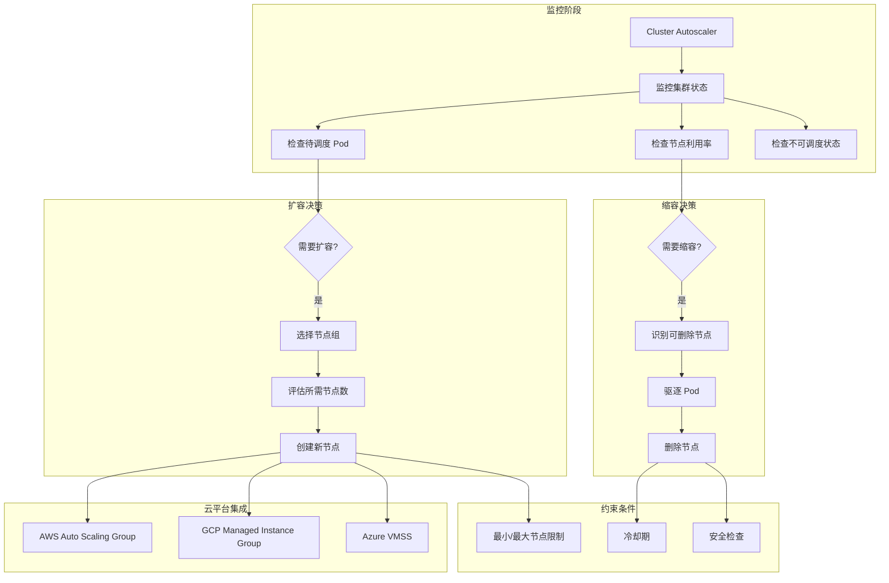

# Kubernetes 集群自动扩展

## 集群自动扩展概述

集群自动扩展（Cluster Autoscaler）是 Kubernetes 生态系统中用于自动管理集群节点数量的重要组件。它通过监控集群中 Pod 的调度状态和节点的资源利用率，自动添加或删除节点，确保集群能够高效地处理工作负载变化，同时优化成本。

## 集群自动扩展架构

### 工作原理



### 扩缩容触发条件

**扩容触发条件**：
1. 存在因资源不足而无法调度的 Pod
2. 待调度的 Pod 超过配置的阈值时间
3. 节点组未达到最大节点数限制

**缩容触发条件**：
1. 节点上的 Pod 可以重新调度到其他节点
2. 节点利用率低于配置阈值
3. 节点空闲时间超过缩容延迟时间

## Cluster Autoscaler 部署

### AWS 环境部署

**AWS Auto Scaling Group 配置**：
```bash
#!/bin/bash
# AWS Auto Scaling Group 配置脚本

# 创建启动模板
aws ec2 create-launch-template \
  --launch-template-name k8s-worker-template \
  --launch-template-data '{
    "ImageId": "ami-0abcdef1234567890",
    "InstanceType": "m5.large",
    "SecurityGroupIds": ["sg-12345678"],
    "IamInstanceProfile": {
      "Name": "K8sWorkerNodeInstanceProfile"
    },
    "UserData": "IyEvYmluL2Jhc2gKL2V0Yy9la3MvYm9vdHN0cmFwLnNoIG15LWNsdXN0ZXI=",
    "TagSpecifications": [{
      "ResourceType": "instance",
      "Tags": [
        {"Key": "Name", "Value": "k8s-worker-node"},
        {"Key": "kubernetes.io/cluster/my-cluster", "Value": "owned"},
        {"Key": "k8s.io/cluster-autoscaler/enabled", "Value": "true"},
        {"Key": "k8s.io/cluster-autoscaler/my-cluster", "Value": "owned"}
      ]
    }]
  }'

# 创建 Auto Scaling Group
aws autoscaling create-auto-scaling-group \
  --auto-scaling-group-name k8s-worker-asg \
  --launch-template LaunchTemplateName=k8s-worker-template,Version='$Latest' \
  --min-size 1 \
  --max-size 20 \
  --desired-capacity 3 \
  --vpc-zone-identifier "subnet-12345678,subnet-87654321" \
  --tags "Key=Name,Value=k8s-worker-asg,PropagateAtLaunch=true" \
         "Key=kubernetes.io/cluster/my-cluster,Value=owned,PropagateAtLaunch=true" \
         "Key=k8s.io/cluster-autoscaler/enabled,Value=true,PropagateAtLaunch=true" \
         "Key=k8s.io/cluster-autoscaler/my-cluster,Value=owned,PropagateAtLaunch=true"
```

**Cluster Autoscaler 部署配置**：
```yaml
# AWS Cluster Autoscaler 部署
apiVersion: apps/v1
kind: Deployment
metadata:
  name: cluster-autoscaler
  namespace: kube-system
  labels:
    app: cluster-autoscaler
spec:
  selector:
    matchLabels:
      app: cluster-autoscaler
  template:
    metadata:
      labels:
        app: cluster-autoscaler
      annotations:
        prometheus.io/scrape: 'true'
        prometheus.io/port: '8085'
    spec:
      priorityClassName: system-cluster-critical
      securityContext:
        runAsNonRoot: true
        runAsUser: 65534
        fsGroup: 65534
      serviceAccountName: cluster-autoscaler
      containers:
      - image: k8s.gcr.io/autoscaling/cluster-autoscaler:v1.25.0
        name: cluster-autoscaler
        resources:
          limits:
            cpu: 100m
            memory: 600Mi
          requests:
            cpu: 100m
            memory: 600Mi
        command:
        - ./cluster-autoscaler
        - --v=4
        - --stderrthreshold=info
        - --cloud-provider=aws
        - --skip-nodes-with-local-storage=false
        - --expander=least-waste
        - --node-group-auto-discovery=asg:tag=k8s.io/cluster-autoscaler/enabled,k8s.io/cluster-autoscaler/my-cluster
        - --balance-similar-node-groups
        - --scale-down-enabled=true
        - --scale-down-delay-after-add=10m
        - --scale-down-unneeded-time=10m
        - --scale-down-delay-after-delete=10s
        - --scale-down-delay-after-failure=3m
        - --scale-down-utilization-threshold=0.5
        - --scale-down-gpu-utilization-threshold=0.5
        - --scale-down-non-empty-candidates-count=30
        - --max-node-provision-time=15m
        - --max-graceful-termination-sec=600
        - --max-total-unready-percentage=45
        - --max-nodes-total=100
        - --cores-total=0:320
        - --memory-total=0:1280
        - --ok-total-unready-count=3
        env:
        - name: AWS_REGION
          value: us-west-2
        - name: AWS_STS_REGIONAL_ENDPOINTS
          value: regional
        volumeMounts:
        - name: ssl-certs
          mountPath: /etc/ssl/certs/ca-certificates.crt
          readOnly: true
        imagePullPolicy: "Always"
      volumes:
      - name: ssl-certs
        hostPath:
          path: "/etc/ssl/certs/ca-bundle.crt"
      nodeSelector:
        kubernetes.io/os: linux
        kubernetes.io/arch: amd64
        node-role.kubernetes.io/control-plane: ""
      tolerations:
      - effect: NoSchedule
        key: node-role.kubernetes.io/control-plane
      - effect: NoSchedule
        key: node-role.kubernetes.io/master

---
# Cluster Autoscaler Service Account
apiVersion: v1
kind: ServiceAccount
metadata:
  labels:
    k8s-addon: cluster-autoscaler.addons.k8s.io
    k8s-app: cluster-autoscaler
  name: cluster-autoscaler
  namespace: kube-system
  annotations:
    eks.amazonaws.com/role-arn: arn:aws:iam::123456789012:role/cluster-autoscaler-role

---
# Cluster Autoscaler ClusterRole
apiVersion: rbac.authorization.k8s.io/v1
kind: ClusterRole
metadata:
  name: cluster-autoscaler
  labels:
    k8s-addon: cluster-autoscaler.addons.k8s.io
    k8s-app: cluster-autoscaler
rules:
- apiGroups: [""]
  resources: ["events", "endpoints"]
  verbs: ["create", "patch"]
- apiGroups: [""]
  resources: ["pods/eviction"]
  verbs: ["create"]
- apiGroups: [""]
  resources: ["pods/status"]
  verbs: ["update"]
- apiGroups: [""]
  resources: ["endpoints"]
  resourceNames: ["cluster-autoscaler"]
  verbs: ["get", "update"]
- apiGroups: [""]
  resources: ["nodes"]
  verbs: ["watch", "list", "get", "update"]
- apiGroups: [""]
  resources: ["namespaces", "pods", "services", "replicationcontrollers", "persistentvolumeclaims", "persistentvolumes"]
  verbs: ["watch", "list", "get"]
- apiGroups: ["extensions"]
  resources: ["replicasets", "daemonsets"]
  verbs: ["watch", "list", "get"]
- apiGroups: ["policy"]
  resources: ["poddisruptionbudgets"]
  verbs: ["watch", "list"]
- apiGroups: ["apps"]
  resources: ["statefulsets", "replicasets", "daemonsets"]
  verbs: ["watch", "list", "get"]
- apiGroups: ["storage.k8s.io"]
  resources: ["storageclasses", "csinodes", "csidrivers", "csistoragecapacities"]
  verbs: ["watch", "list", "get"]
- apiGroups: ["batch", "extensions"]
  resources: ["jobs"]
  verbs: ["get", "list", "watch", "patch"]
- apiGroups: ["coordination.k8s.io"]
  resources: ["leases"]
  verbs: ["create"]
- apiGroups: ["coordination.k8s.io"]
  resourceNames: ["cluster-autoscaler"]
  resources: ["leases"]
  verbs: ["get", "update"]

---
# Cluster Autoscaler ClusterRoleBinding
apiVersion: rbac.authorization.k8s.io/v1
kind: ClusterRoleBinding
metadata:
  name: cluster-autoscaler
  labels:
    k8s-addon: cluster-autoscaler.addons.k8s.io
    k8s-app: cluster-autoscaler
roleRef:
  apiGroup: rbac.authorization.k8s.io
  kind: ClusterRole
  name: cluster-autoscaler
subjects:
- kind: ServiceAccount
  name: cluster-autoscaler
  namespace: kube-system
```

### GCP 环境部署

**GCP Managed Instance Group 配置**：
```bash
#!/bin/bash
# GCP Managed Instance Group 配置

# 创建实例模板
gcloud compute instance-templates create k8s-worker-template \
  --machine-type=n1-standard-2 \
  --image-family=gke-node \
  --image-project=gke-node-images \
  --boot-disk-size=100GB \
  --boot-disk-type=pd-standard \
  --network=default \
  --subnet=default \
  --scopes=https://www.googleapis.com/auth/cloud-platform \
  --tags=k8s-worker \
  --metadata=cluster-name=my-cluster \
  --labels=cluster=my-cluster

# 创建实例组
gcloud compute instance-groups managed create k8s-worker-group \
  --template=k8s-worker-template \
  --size=3 \
  --zone=us-central1-a

# 设置自动扩缩容
gcloud compute instance-groups managed set-autoscaling k8s-worker-group \
  --max-num-replicas=20 \
  --min-num-replicas=1 \
  --target-cpu-utilization=0.6 \
  --zone=us-central1-a
```

**GCP Cluster Autoscaler 配置**：
```yaml
# GCP Cluster Autoscaler 部署
apiVersion: apps/v1
kind: Deployment
metadata:
  name: cluster-autoscaler
  namespace: kube-system
spec:
  selector:
    matchLabels:
      app: cluster-autoscaler
  template:
    metadata:
      labels:
        app: cluster-autoscaler
    spec:
      serviceAccountName: cluster-autoscaler
      containers:
      - image: k8s.gcr.io/autoscaling/cluster-autoscaler:v1.25.0
        name: cluster-autoscaler
        resources:
          limits:
            cpu: 100m
            memory: 300Mi
          requests:
            cpu: 100m
            memory: 300Mi
        command:
        - ./cluster-autoscaler
        - --v=4
        - --stderrthreshold=info
        - --cloud-provider=gce
        - --skip-nodes-with-local-storage=false
        - --expander=random
        - --node-group-auto-discovery=mig:name=k8s-worker-group,min=1,max=20
        - --balance-similar-node-groups
        - --scale-down-enabled=true
        - --scale-down-delay-after-add=10m
        - --scale-down-unneeded-time=10m
        - --scale-down-utilization-threshold=0.5
        - --max-node-provision-time=15m
        env:
        - name: GOOGLE_APPLICATION_CREDENTIALS
          value: /etc/gcp/service-account.json
        volumeMounts:
        - name: gcp-credentials
          mountPath: /etc/gcp
          readOnly: true
      volumes:
      - name: gcp-credentials
        secret:
          secretName: gcp-service-account
      nodeSelector:
        kubernetes.io/os: linux
```

## 高级配置选项

### 多节点组配置

**混合节点组设置**：
```yaml
# 多节点组 Cluster Autoscaler 配置
apiVersion: apps/v1
kind: Deployment
metadata:
  name: cluster-autoscaler
  namespace: kube-system
spec:
  selector:
    matchLabels:
      app: cluster-autoscaler
  template:
    metadata:
      labels:
        app: cluster-autoscaler
    spec:
      serviceAccountName: cluster-autoscaler
      containers:
      - name: cluster-autoscaler
        image: k8s.gcr.io/autoscaling/cluster-autoscaler:v1.25.0
        command:
        - ./cluster-autoscaler
        - --v=4
        - --cloud-provider=aws
        - --skip-nodes-with-local-storage=false
        - --expander=priority
        - --balance-similar-node-groups
        # 通用节点组
        - --nodes=1:10:k8s-general-workers
        # CPU 优化节点组
        - --nodes=0:5:k8s-compute-workers
        # 内存优化节点组
        - --nodes=0:3:k8s-memory-workers
        # GPU 节点组
        - --nodes=0:2:k8s-gpu-workers
        # Spot 实例节点组
        - --nodes=0:20:k8s-spot-workers
        # 扩容策略配置
        - --scale-down-enabled=true
        - --scale-down-delay-after-add=10m
        - --scale-down-unneeded-time=10m
        - --scale-down-utilization-threshold=0.5
        - --skip-nodes-with-system-pods=false
        - --new-pod-scale-up-delay=0s
        - --max-node-provision-time=15m
        - --max-graceful-termination-sec=600
        - --max-empty-bulk-delete=10
        - --max-total-unready-percentage=45
        # 节点组优先级配置
        env:
        - name: CLUSTER_AUTOSCALER_PRIORITY_CONFIG
          value: |
            10:
              - k8s-general-workers
            20:
              - k8s-compute-workers
            30:
              - k8s-memory-workers
            40:
              - k8s-gpu-workers
            50:
              - k8s-spot-workers

---
# 节点组优先级配置
apiVersion: v1
kind: ConfigMap
metadata:
  name: cluster-autoscaler-priority-expander
  namespace: kube-system
data:
  priorities: |
    10:
      - .*general.*
    20:
      - .*compute.*
    30:
      - .*memory.*
    40:
      - .*gpu.*
    50:
      - .*spot.*
```

### 智能扩容策略

**成本优化扩容器配置**：
```yaml
# 成本优化的 Cluster Autoscaler 配置
apiVersion: v1
kind: ConfigMap
metadata:
  name: cluster-autoscaler-config
  namespace: kube-system
data:
  # Expander 策略配置
  expander-config: |
    # 优先级扩容器 - 按成本优先级选择节点组
    priority:
      priorities:
        10: ["spot-.*"]           # 最高优先级：Spot 实例
        20: ["burstable-.*"]      # 中等优先级：突发性能实例
        30: ["general-.*"]        # 普通优先级：通用实例
        40: ["compute-.*"]        # 低优先级：计算优化实例
    
    # 最少浪费扩容器 - 选择资源浪费最少的节点组
    least-waste:
      # 配置参数
      max-nodes-total: 1000
      memory-utilization-threshold: 0.5
      cpu-utilization-threshold: 0.5
    
    # 随机扩容器 - 随机选择节点组
    random:
      # 适用于测试环境
      enabled: false

---
# 高级 Cluster Autoscaler 部署
apiVersion: apps/v1
kind: Deployment
metadata:
  name: cluster-autoscaler
  namespace: kube-system
spec:
  selector:
    matchLabels:
      app: cluster-autoscaler
  template:
    metadata:
      labels:
        app: cluster-autoscaler
    spec:
      serviceAccountName: cluster-autoscaler
      containers:
      - name: cluster-autoscaler
        image: k8s.gcr.io/autoscaling/cluster-autoscaler:v1.25.0
        command:
        - ./cluster-autoscaler
        - --v=4
        - --cloud-provider=aws
        - --expander=least-waste,priority
        - --balance-similar-node-groups
        - --skip-nodes-with-local-storage=false
        - --skip-nodes-with-system-pods=false
        # 智能缩容配置
        - --scale-down-enabled=true
        - --scale-down-delay-after-add=10m
        - --scale-down-unneeded-time=10m
        - --scale-down-delay-after-delete=10s
        - --scale-down-delay-after-failure=3m
        - --scale-down-utilization-threshold=0.5
        - --scale-down-gpu-utilization-threshold=0.5
        - --scale-down-non-empty-candidates-count=30
        - --max-empty-bulk-delete=10
        # 扩容限制
        - --max-node-provision-time=15m
        - --max-nodes-total=100
        - --cores-total=0:320
        - --memory-total=0:1280GiB
        - --max-autoprovisioned-node-group-count=15
        # 健康检查配置
        - --ok-total-unready-count=3
        - --max-total-unready-percentage=45
        - --node-deletion-batching-enabled=true
        # 成本优化
        - --estimator=binpacking
        - --expendable-pods-priority-cutoff=0
        - --ignore-daemonsets-utilization=false
        - --ignore-mirror-pods-utilization=false
        # 日志和监控
        - --logtostderr=true
        - --stderrthreshold=info
        - --write-status-configmap
        - --leader-elect=false
        - --leader-elect-lease-duration=15s
        - --leader-elect-renew-deadline=10s
        - --leader-elect-retry-period=2s
        # ConfigMap 配置
        volumeMounts:
        - name: expander-config
          mountPath: /etc/cluster-autoscaler
        env:
        - name: AWS_REGION
          value: us-west-2
        resources:
          requests:
            cpu: 100m
            memory: 300Mi
          limits:
            cpu: 200m
            memory: 600Mi
      volumes:
      - name: expander-config
        configMap:
          name: cluster-autoscaler-config
```

## 节点标签和污点策略

### 节点差异化配置

**不同类型节点的标签策略**：
```yaml
# 节点标签配置策略
apiVersion: v1
kind: ConfigMap
metadata:
  name: node-labeling-strategy
data:
  node-labels.yaml: |
    # 通用工作节点
    general-nodes:
      labels:
        node-type: general
        workload-type: standard
        cost-tier: medium
      taints: []
    
    # 计算优化节点
    compute-nodes:
      labels:
        node-type: compute-optimized
        workload-type: cpu-intensive
        cost-tier: high
        instance-family: c5
      taints:
      - key: workload-type
        value: compute-intensive
        effect: NoSchedule
    
    # 内存优化节点
    memory-nodes:
      labels:
        node-type: memory-optimized
        workload-type: memory-intensive
        cost-tier: high
        instance-family: r5
      taints:
      - key: workload-type
        value: memory-intensive
        effect: NoSchedule
    
    # GPU 节点
    gpu-nodes:
      labels:
        node-type: gpu
        workload-type: ai-ml
        cost-tier: premium
        accelerator: nvidia-tesla-v100
      taints:
      - key: workload-type
        value: gpu
        effect: NoSchedule
    
    # Spot 实例节点
    spot-nodes:
      labels:
        node-type: spot
        workload-type: fault-tolerant
        cost-tier: low
        lifecycle: spot
      taints:
      - key: lifecycle
        value: spot
        effect: NoSchedule

---
# 节点初始化脚本
apiVersion: v1
kind: ConfigMap
metadata:
  name: node-initialization
data:
  init-script.sh: |
    #!/bin/bash
    # 节点初始化脚本
    
    # 检测实例类型并设置标签
    INSTANCE_TYPE=$(curl -s http://169.254.169.254/latest/meta-data/instance-type)
    INSTANCE_FAMILY=$(echo $INSTANCE_TYPE | cut -d'.' -f1)
    
    # 根据实例类型设置标签
    case $INSTANCE_FAMILY in
      c5*|c6i*)
        kubectl label node $NODE_NAME node-type=compute-optimized
        kubectl label node $NODE_NAME workload-type=cpu-intensive
        kubectl taint node $NODE_NAME workload-type=compute-intensive:NoSchedule
        ;;
      r5*|r6i*)
        kubectl label node $NODE_NAME node-type=memory-optimized
        kubectl label node $NODE_NAME workload-type=memory-intensive
        kubectl taint node $NODE_NAME workload-type=memory-intensive:NoSchedule
        ;;
      p3*|p4*|g4*)
        kubectl label node $NODE_NAME node-type=gpu
        kubectl label node $NODE_NAME workload-type=ai-ml
        kubectl taint node $NODE_NAME workload-type=gpu:NoSchedule
        ;;
      *)
        kubectl label node $NODE_NAME node-type=general
        kubectl label node $NODE_NAME workload-type=standard
        ;;
    esac
    
    # 检测 Spot 实例
    LIFECYCLE=$(curl -s http://169.254.169.254/latest/meta-data/instance-life-cycle)
    if [ "$LIFECYCLE" = "spot" ]; then
      kubectl label node $NODE_NAME lifecycle=spot
      kubectl taint node $NODE_NAME lifecycle=spot:NoSchedule
    fi
```

### 工作负载亲和性配置

**针对不同节点类型的工作负载调度**：
```yaml
# CPU 密集型工作负载
apiVersion: apps/v1
kind: Deployment
metadata:
  name: cpu-intensive-app
spec:
  replicas: 3
  selector:
    matchLabels:
      app: cpu-intensive
  template:
    metadata:
      labels:
        app: cpu-intensive
    spec:
      affinity:
        nodeAffinity:
          requiredDuringSchedulingIgnoredDuringExecution:
            nodeSelectorTerms:
            - matchExpressions:
              - key: node-type
                operator: In
                values: ["compute-optimized"]
          preferredDuringSchedulingIgnoredDuringExecution:
          - weight: 100
            preference:
              matchExpressions:
              - key: instance-family
                operator: In
                values: ["c5", "c6i"]
      tolerations:
      - key: workload-type
        operator: Equal
        value: compute-intensive
        effect: NoSchedule
      containers:
      - name: app
        image: cpu-intensive-app:latest
        resources:
          requests:
            cpu: 4000m
            memory: 8Gi
          limits:
            cpu: 8000m
            memory: 16Gi

---
# GPU 工作负载
apiVersion: apps/v1
kind: Deployment
metadata:
  name: ai-training-job
spec:
  replicas: 2
  selector:
    matchLabels:
      app: ai-training
  template:
    metadata:
      labels:
        app: ai-training
    spec:
      affinity:
        nodeAffinity:
          requiredDuringSchedulingIgnoredDuringExecution:
            nodeSelectorTerms:
            - matchExpressions:
              - key: node-type
                operator: In
                values: ["gpu"]
      tolerations:
      - key: workload-type
        operator: Equal
        value: gpu
        effect: NoSchedule
      containers:
      - name: training
        image: tensorflow/tensorflow:2.8.0-gpu
        resources:
          requests:
            nvidia.com/gpu: 1
            cpu: 4000m
            memory: 16Gi
          limits:
            nvidia.com/gpu: 1
            cpu: 8000m
            memory: 32Gi

---
# 容错性工作负载（适合 Spot 实例）
apiVersion: apps/v1
kind: Deployment
metadata:
  name: batch-processing
spec:
  replicas: 10
  selector:
    matchLabels:
      app: batch-processing
  template:
    metadata:
      labels:
        app: batch-processing
    spec:
      affinity:
        nodeAffinity:
          preferredDuringSchedulingIgnoredDuringExecution:
          - weight: 100
            preference:
              matchExpressions:
              - key: lifecycle
                operator: In
                values: ["spot"]
      tolerations:
      - key: lifecycle
        operator: Equal
        value: spot
        effect: NoSchedule
      containers:
      - name: processor
        image: batch-processor:latest
        resources:
          requests:
            cpu: 1000m
            memory: 2Gi
```

## 监控和故障排查

### Cluster Autoscaler 监控

**监控指标配置**：
```yaml
# Cluster Autoscaler 监控规则
apiVersion: v1
kind: ConfigMap
metadata:
  name: cluster-autoscaler-monitoring
data:
  ca-rules.yml: |
    groups:
    - name: cluster-autoscaler
      rules:
      # 集群节点总数
      - record: cluster_autoscaler:nodes_total
        expr: cluster_autoscaler_nodes_count
      
      # 不可调度的 Pod 数量
      - record: cluster_autoscaler:unschedulable_pods
        expr: cluster_autoscaler_unscheduled_pods_count
      
      # 扩容事件频率
      - record: cluster_autoscaler:scale_up_events:rate1h
        expr: increase(cluster_autoscaler_scaled_up_nodes_total[1h])
      
      # 缩容事件频率
      - record: cluster_autoscaler:scale_down_events:rate1h
        expr: increase(cluster_autoscaler_scaled_down_nodes_total[1h])
      
      # 扩容延迟
      - record: cluster_autoscaler:scale_up_duration:p95
        expr: histogram_quantile(0.95, rate(cluster_autoscaler_function_duration_seconds_bucket{function="scale_up"}[5m]))
      
      # 节点组状态
      - record: cluster_autoscaler:node_group_size
        expr: cluster_autoscaler_node_group_size
      
      # 错误率
      - record: cluster_autoscaler:errors:rate5m
        expr: rate(cluster_autoscaler_errors_total[5m])

---
# Cluster Autoscaler 告警
apiVersion: v1
kind: ConfigMap
metadata:
  name: cluster-autoscaler-alerts
data:
  ca-alerts.yml: |
    groups:
    - name: cluster-autoscaler-alerts
      rules:
      # Cluster Autoscaler 不可用
      - alert: ClusterAutoscalerDown
        expr: up{job="cluster-autoscaler"} == 0
        for: 5m
        labels:
          severity: critical
        annotations:
          summary: "Cluster Autoscaler 不可用"
          description: "Cluster Autoscaler 已停止工作超过 5 分钟"
      
      # 长时间存在不可调度的 Pod
      - alert: UnschedulablePodsHigh
        expr: cluster_autoscaler:unschedulable_pods > 0
        for: 10m
        labels:
          severity: warning
        annotations:
          summary: "存在长时间不可调度的 Pod"
          description: "{{ $value }} 个 Pod 无法调度超过 10 分钟"
      
      # 扩容失败
      - alert: ClusterAutoscalerScaleUpFailed
        expr: increase(cluster_autoscaler_failed_scale_ups_total[1h]) > 3
        for: 5m
        labels:
          severity: warning
        annotations:
          summary: "Cluster Autoscaler 扩容失败"
          description: "1小时内扩容失败 {{ $value }} 次"
      
      # 节点数接近上限
      - alert: ClusterNodesNearMaximum
        expr: cluster_autoscaler:nodes_total / 100 > 0.9
        for: 15m
        labels:
          severity: warning
        annotations:
          summary: "集群节点数接近上限"
          description: "当前节点数 {{ $value }}，接近配置上限"
      
      # 错误率过高
      - alert: ClusterAutoscalerHighErrorRate
        expr: cluster_autoscaler:errors:rate5m > 0.1
        for: 10m
        labels:
          severity: warning
        annotations:
          summary: "Cluster Autoscaler 错误率过高"
          description: "错误率: {{ $value | humanizePercentage }}"
```

### 故障排查工具

**Cluster Autoscaler 诊断脚本**：
```bash
#!/bin/bash
# Cluster Autoscaler 故障排查脚本

# 函数：检查 Cluster Autoscaler 状态
check_ca_status() {
    echo "=== Cluster Autoscaler 状态检查 ==="
    
    # 检查 Pod 状态
    echo "1. Cluster Autoscaler Pod 状态:"
    kubectl get pods -n kube-system -l app=cluster-autoscaler -o wide
    
    # 检查最近日志
    echo -e "\n2. 最近日志:"
    kubectl logs -n kube-system -l app=cluster-autoscaler --tail=20
    
    # 检查配置
    echo -e "\n3. 配置检查:"
    kubectl describe deployment -n kube-system cluster-autoscaler | grep -A20 "Args:"
}

# 函数：检查节点状态
check_node_status() {
    echo -e "\n=== 节点状态检查 ==="
    
    # 检查节点总数和状态
    echo "1. 节点状态统计:"
    kubectl get nodes --no-headers | awk '{print $2}' | sort | uniq -c
    
    # 检查节点标签
    echo -e "\n2. 节点标签分布:"
    kubectl get nodes -o json | jq -r '.items[] | "\(.metadata.name) \(.metadata.labels["node-type"]// "unknown") \(.metadata.labels["instance-type"]// "unknown")"' | column -t
    
    # 检查污点配置
    echo -e "\n3. 节点污点检查:"
    kubectl get nodes -o json | jq -r '.items[] | select(.spec.taints != null) | "\(.metadata.name): \(.spec.taints | map(.key + "=" + .value + ":" + .effect) | join(", "))"'
}

# 函数：检查不可调度的 Pod
check_unschedulable_pods() {
    echo -e "\n=== 不可调度 Pod 检查 ==="
    
    # 检查 Pending 状态的 Pod
    echo "1. Pending Pod 列表:"
    kubectl get pods --all-namespaces --field-selector=status.phase=Pending -o wide
    
    # 检查 Pod 事件
    echo -e "\n2. Pod 调度失败事件:"
    kubectl get events --all-namespaces --field-selector=reason=FailedScheduling --sort-by='.lastTimestamp' | tail -10
    
    # 分析资源需求
    echo -e "\n3. Pending Pod 资源需求分析:"
    kubectl get pods --all-namespaces --field-selector=status.phase=Pending -o json | \
        jq -r '.items[] | "\(.metadata.namespace)/\(.metadata.name): CPU=\(.spec.containers[0].resources.requests.cpu//"-") Memory=\(.spec.containers[0].resources.requests.memory//"-")"'
}

# 函数：检查 Auto Scaling Group 状态
check_asg_status() {
    echo -e "\n=== Auto Scaling Group 状态检查 ==="
    
    # 检查 AWS ASG 状态（如果在 AWS 环境）
    if command -v aws &> /dev/null; then
        echo "1. AWS Auto Scaling Groups:"
        aws autoscaling describe-auto-scaling-groups \
            --query 'AutoScalingGroups[?contains(Tags[?Key==`k8s.io/cluster-autoscaler/enabled`].Value, `true`)].[AutoScalingGroupName,MinSize,MaxSize,DesiredCapacity,Instances[].InstanceId]' \
            --output table 2>/dev/null || echo "无法获取 ASG 信息或未配置 AWS CLI"
        
        echo -e "\n2. 实例状态:"
        aws autoscaling describe-auto-scaling-groups \
            --query 'AutoScalingGroups[?contains(Tags[?Key==`k8s.io/cluster-autoscaler/enabled`].Value, `true`)].Instances[].[InstanceId,LifecycleState,HealthStatus]' \
            --output table 2>/dev/null || echo "无法获取实例信息"
    else
        echo "AWS CLI 未安装，跳过 ASG 检查"
    fi
}

# 函数：性能优化建议
ca_optimization_recommendations() {
    echo -e "\n=== Cluster Autoscaler 优化建议 ==="
    
    # 检查配置参数
    echo "1. 配置优化检查:"
    
    # 检查扩容延迟配置
    echo "  - 检查扩容延迟设置"
    kubectl describe deployment -n kube-system cluster-autoscaler | grep -E "(scale-down-delay|scale-down-unneeded-time)"
    
    # 检查节点组标签
    echo -e "\n2. 节点组标签检查:"
    kubectl get nodes -o json | jq -r '.items[] | select(.metadata.labels["k8s.io/cluster-autoscaler/enabled"] == null) | .metadata.name' | \
        while read node; do
            echo "  警告: 节点 $node 缺少 cluster-autoscaler 标签"
        done
    
    # 优化建议
    echo -e "\n3. 通用优化建议:"
    echo "   - 确保节点组有正确的标签和注解"
    echo "   - 调整扩缩容延迟参数优化响应速度"
    echo "   - 使用节点亲和性优化 Pod 调度"
    echo "   - 监控扩缩容事件和成本变化"
    echo "   - 设置合理的资源请求避免过度扩容"
    echo "   - 使用多个节点组实现成本优化"
}

# 主函数
main() {
    echo "Kubernetes Cluster Autoscaler 故障排查工具"
    echo "=========================================="
    
    check_ca_status
    check_node_status
    check_unschedulable_pods
    check_asg_status
    ca_optimization_recommendations
    
    echo -e "\n故障排查完成！"
}

# 执行主函数
main
```

## 成本优化策略

### Spot 实例集成

**Spot 实例节点组配置**：
```yaml
# Spot 实例处理器
apiVersion: apps/v1
kind: DaemonSet
metadata:
  name: spot-instance-handler
  namespace: kube-system
spec:
  selector:
    matchLabels:
      app: spot-instance-handler
  template:
    metadata:
      labels:
        app: spot-instance-handler
    spec:
      hostNetwork: true
      containers:
      - name: handler
        image: spot-instance-handler:latest
        command:
        - /bin/sh
        - -c
        - |
          # 监控 Spot 实例中断信号
          while true; do
            # 检查 Spot 实例中断通知
            TOKEN=$(curl -X PUT "http://169.254.169.254/latest/api/token" -H "X-aws-ec2-metadata-token-ttl-seconds: 21600" 2>/dev/null)
            RESPONSE=$(curl -H "X-aws-ec2-metadata-token: $TOKEN" -s http://169.254.169.254/latest/meta-data/spot/instance-action 2>/dev/null)
            
            if [ $? -eq 0 ] && [ "$RESPONSE" != "" ]; then
              echo "收到 Spot 实例中断通知，开始优雅关闭..."
              
              # 标记节点为不可调度
              kubectl cordon $NODE_NAME
              
              # 驱逐 Pod
              kubectl drain $NODE_NAME --ignore-daemonsets --delete-emptydir-data --force --grace-period=300
              
              echo "节点准备关闭"
              break
            fi
            
            sleep 5
          done
        env:
        - name: NODE_NAME
          valueFrom:
            fieldRef:
              fieldPath: spec.nodeName
        securityContext:
          privileged: true
        resources:
          requests:
            cpu: 10m
            memory: 32Mi
      tolerations:
      - operator: Exists
      nodeSelector:
        lifecycle: spot

---
# Spot 实例容错应用配置
apiVersion: apps/v1
kind: Deployment
metadata:
  name: fault-tolerant-app
spec:
  replicas: 10
  selector:
    matchLabels:
      app: fault-tolerant
  template:
    metadata:
      labels:
        app: fault-tolerant
    spec:
      affinity:
        nodeAffinity:
          preferredDuringSchedulingIgnoredDuringExecution:
          - weight: 100
            preference:
              matchExpressions:
              - key: lifecycle
                operator: In
                values: ["spot"]
        podAntiAffinity:
          preferredDuringSchedulingIgnoredDuringExecution:
          - weight: 100
            podAffinityTerm:
              labelSelector:
                matchLabels:
                  app: fault-tolerant
              topologyKey: kubernetes.io/hostname
      tolerations:
      - key: lifecycle
        operator: Equal
        value: spot
        effect: NoSchedule
      containers:
      - name: app
        image: fault-tolerant-app:latest
        # 实现优雅关闭
        lifecycle:
          preStop:
            exec:
              command:
              - /bin/sh
              - -c
              - |
                echo "开始优雅关闭..."
                # 保存状态到持久存储
                /app/save-state.sh
                # 等待处理完成
                sleep 30
                echo "优雅关闭完成"
        resources:
          requests:
            cpu: 500m
            memory: 1Gi
```

### 成本监控和分析

**成本分析工具**：
```bash
#!/bin/bash
# Kubernetes 集群成本分析脚本

# 函数：分析节点成本
analyze_node_costs() {
    echo "=== 节点成本分析 ==="
    
    # 获取节点信息
    echo "1. 节点类型分布:"
    kubectl get nodes -o json | \
        jq -r '.items[] | "\(.metadata.labels["node.kubernetes.io/instance-type"]//"-") \(.metadata.labels["lifecycle"]//"-")"' | \
        sort | uniq -c | column -t
    
    # 分析 Spot vs On-Demand 比例
    echo -e "\n2. Spot vs On-Demand 节点比例:"
    total_nodes=$(kubectl get nodes --no-headers | wc -l)
    spot_nodes=$(kubectl get nodes -l lifecycle=spot --no-headers | wc -l)
    ondemand_nodes=$((total_nodes - spot_nodes))
    
    echo "  总节点数: $total_nodes"
    echo "  Spot 节点: $spot_nodes ($(( spot_nodes * 100 / total_nodes ))%)"
    echo "  On-Demand 节点: $ondemand_nodes ($(( ondemand_nodes * 100 / total_nodes ))%)"
}

# 函数：分析资源利用率
analyze_resource_utilization() {
    echo -e "\n=== 资源利用率分析 ==="
    
    # CPU 利用率
    echo "1. CPU 利用率:"
    kubectl top nodes | awk 'NR>1 {print $1, $3}' | while read node cpu; do
        cpu_num=$(echo $cpu | sed 's/%//')
        if [ $cpu_num -lt 50 ]; then
            echo "  $node: $cpu (偏低)"
        elif [ $cpu_num -lt 80 ]; then
            echo "  $node: $cpu (正常)"
        else
            echo "  $node: $cpu (较高)"
        fi
    done
    
    # 内存利用率
    echo -e "\n2. 内存利用率:"
    kubectl top nodes | awk 'NR>1 {print $1, $5}' | while read node memory; do
        memory_num=$(echo $memory | sed 's/%//')
        if [ $memory_num -lt 50 ]; then
            echo "  $node: $memory (偏低)"
        elif [ $memory_num -lt 80 ]; then
            echo "  $node: $memory (正常)"
        else
            echo "  $node: $memory (较高)"
        fi
    done
}

# 函数：成本优化建议
cost_optimization_recommendations() {
    echo -e "\n=== 成本优化建议 ==="
    
    echo "1. 立即优化建议:"
    
    # 检查低利用率节点
    echo "  - 检查低利用率节点:"
    kubectl top nodes | awk 'NR>1 && ($3+0 < 30 && $5+0 < 30) {print "    节点 " $1 " 利用率过低: CPU " $3 " 内存 " $5}'
    
    # 检查可以使用 Spot 实例的工作负载
    echo "  - 可考虑迁移到 Spot 实例的工作负载:"
    kubectl get deployments --all-namespaces -o json | \
        jq -r '.items[] | select(.spec.template.spec.tolerations[]?.key != "lifecycle") | "\(.metadata.namespace)/\(.metadata.name)"' | \
        head -5 | while read deployment; do
            echo "    $deployment"
        done
    
    echo -e "\n2. 长期优化策略:"
    echo "   - 增加 Spot 实例比例（目标：70%+）"
    echo "   - 实施应用垂直扩缩容（VPA）"
    echo "   - 优化应用资源请求配置"
    echo "   - 使用定时扩缩容策略"
    echo "   - 实施多区域部署降低成本"
}

# 主函数
main() {
    echo "Kubernetes 集群成本分析工具"
    echo "=========================="
    
    analyze_node_costs
    analyze_resource_utilization
    cost_optimization_recommendations
    
    echo -e "\n成本分析完成！"
}

# 执行主函数
main
```

通过合理配置和使用 Cluster Autoscaler，可以实现集群资源的动态调整，在保证应用性能的同时显著降低基础设施成本。建议结合业务特点和成本预算，制定适合的自动扩展策略。
