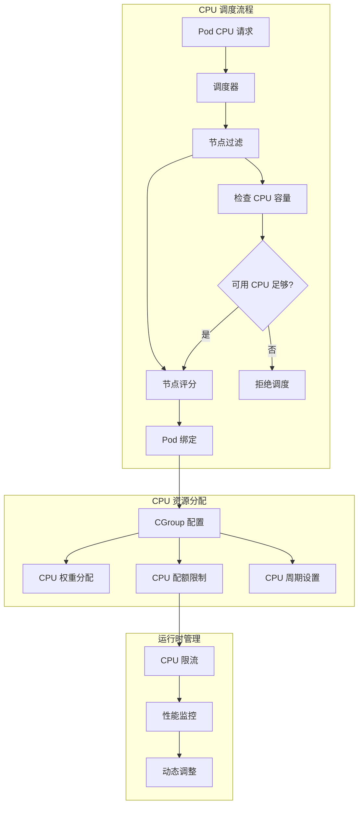

# Kubernetes CPU 优化策略

## CPU 优化概述

CPU 是 Kubernetes 集群中最关键的资源之一，合理的 CPU 优化策略可以显著提升应用性能、降低成本、改善用户体验。CPU 优化需要从应用层、容器层、调度层和节点层多个维度进行系统性考虑。

## CPU 资源管理基础

### CPU 资源单位和配置

**CPU 资源单位**：
- **CPU 核心**：1 个 CPU 核心 = 1000m (millicores)
- **毫核心**：1m = 0.001 个 CPU 核心
- **配置示例**：500m = 0.5 个 CPU 核心

**资源配置最佳实践**：
```yaml
# CPU 资源配置示例
apiVersion: v1
kind: Pod
metadata:
  name: cpu-optimized-app
spec:
  containers:
  - name: app
    image: myapp:latest
    resources:
      requests:
        cpu: 200m        # 保证的最小 CPU 资源
        memory: 256Mi
      limits:
        cpu: 1000m       # 最大可使用的 CPU 资源
        memory: 512Mi
    env:
    - name: GOMAXPROCS
      valueFrom:
        resourceFieldRef:
          resource: limits.cpu
```

### CPU 调度原理



## CPU 性能优化策略

### 应用层 CPU 优化

**多线程应用优化**：
```yaml
# 多线程应用 CPU 优化配置
apiVersion: apps/v1
kind: Deployment
metadata:
  name: multithreaded-app
spec:
  replicas: 3
  selector:
    matchLabels:
      app: multithreaded-app
  template:
    metadata:
      labels:
        app: multithreaded-app
    spec:
      containers:
      - name: app
        image: cpu-intensive-app:latest
        resources:
          requests:
            cpu: 2000m      # 2 个 CPU 核心
            memory: 4Gi
          limits:
            cpu: 4000m      # 最大 4 个 CPU 核心
            memory: 8Gi
        env:
        # Go 应用优化
        - name: GOMAXPROCS
          valueFrom:
            resourceFieldRef:
              resource: limits.cpu
        # Java 应用优化
        - name: JAVA_OPTS
          value: "-XX:ActiveProcessorCount=4 -XX:+UseG1GC"
        # Python 应用优化
        - name: OMP_NUM_THREADS
          value: "4"
        # Node.js 应用优化
        - name: UV_THREADPOOL_SIZE
          value: "4"
        # 设置 CPU 亲和性
        securityContext:
          capabilities:
            add: ["SYS_NICE"]
```

**CPU 密集型应用优化**：
```yaml
# CPU 密集型应用专用配置
apiVersion: apps/v1
kind: Deployment
metadata:
  name: cpu-intensive-workload
spec:
  replicas: 2
  selector:
    matchLabels:
      app: cpu-intensive
  template:
    metadata:
      labels:
        app: cpu-intensive
    spec:
      # 节点亲和性：选择高性能 CPU 节点
      affinity:
        nodeAffinity:
          requiredDuringSchedulingIgnoredDuringExecution:
            nodeSelectorTerms:
            - matchExpressions:
              - key: node-type
                operator: In
                values: ["compute-optimized"]
              - key: kubernetes.io/arch
                operator: In
                values: ["amd64"]
          preferredDuringSchedulingIgnoredDuringExecution:
          - weight: 100
            preference:
              matchExpressions:
              - key: cpu-generation
                operator: In
                values: ["skylake", "cascade-lake", "ice-lake"]
      # Pod 反亲和性：避免多个 CPU 密集型 Pod 在同一节点
      podAntiAffinity:
        preferredDuringSchedulingIgnoredDuringExecution:
        - weight: 100
          podAffinityTerm:
            labelSelector:
              matchExpressions:
              - key: app
                operator: In
                values: ["cpu-intensive"]
            topologyKey: "kubernetes.io/hostname"
      containers:
      - name: app
        image: cpu-intensive:latest
        resources:
          requests:
            cpu: 3000m
            memory: 6Gi
          limits:
            cpu: 4000m
            memory: 8Gi
        # 专用 CPU 配置
        env:
        - name: CPU_OPTIMIZATION
          value: "enabled"
        - name: NUMA_POLICY
          value: "strict"
```

### 容器层 CPU 优化

**QoS 类别优化**：
```yaml
# Guaranteed QoS 类别配置
apiVersion: v1
kind: Pod
metadata:
  name: guaranteed-qos-pod
spec:
  containers:
  - name: app
    image: critical-app:latest
    resources:
      requests:
        cpu: 1000m
        memory: 2Gi
      limits:
        cpu: 1000m        # requests == limits 确保 Guaranteed QoS
        memory: 2Gi
---
# Burstable QoS 类别配置
apiVersion: v1
kind: Pod
metadata:
  name: burstable-qos-pod
spec:
  containers:
  - name: app
    image: flexible-app:latest
    resources:
      requests:
        cpu: 500m
        memory: 1Gi
      limits:
        cpu: 2000m        # limits > requests 实现 Burstable QoS
        memory: 4Gi
---
# Best Effort QoS 类别配置
apiVersion: v1
kind: Pod
metadata:
  name: best-effort-qos-pod
spec:
  containers:
  - name: app
    image: batch-job:latest
    # 无 resources 配置，实现 Best Effort QoS
```

**CPU 管理策略**：
```yaml
# Kubelet CPU 管理配置
apiVersion: v1
kind: ConfigMap
metadata:
  name: kubelet-config
  namespace: kube-system
data:
  kubelet-config.yaml: |
    apiVersion: kubelet.config.k8s.io/v1beta1
    kind: KubeletConfiguration
    # CPU 管理策略
    cpuManagerPolicy: "static"  # 或 "none"
    cpuManagerReconcilePeriod: "10s"
    
    # 拓扑管理策略
    topologyManagerPolicy: "best-effort"  # none, best-effort, restricted, single-numa-node
    
    # 系统预留资源
    systemReserved:
      cpu: "200m"
      memory: "512Mi"
      ephemeral-storage: "1Gi"
    
    # Kubernetes 组件预留资源
    kubeReserved:
      cpu: "200m"
      memory: "512Mi"
      ephemeral-storage: "1Gi"
    
    # 强制执行节点资源预留
    enforceNodeAllocatable: ["pods", "system-reserved", "kube-reserved"]
```

### 调度层 CPU 优化

**智能调度策略**：
```yaml
# CPU 感知调度配置
apiVersion: scheduling.k8s.io/v1
kind: PriorityClass
metadata:
  name: high-cpu-priority
value: 1000
globalDefault: false
description: "高 CPU 优先级类别"

---
# 使用优先级类别的 Deployment
apiVersion: apps/v1
kind: Deployment
metadata:
  name: high-priority-cpu-app
spec:
  replicas: 3
  selector:
    matchLabels:
      app: high-priority-app
  template:
    metadata:
      labels:
        app: high-priority-app
    spec:
      priorityClassName: high-cpu-priority
      containers:
      - name: app
        image: priority-app:latest
        resources:
          requests:
            cpu: 1000m
            memory: 2Gi
          limits:
            cpu: 2000m
            memory: 4Gi
```

**节点标签和选择器优化**：
```yaml
# 节点标签管理
# 为高性能 CPU 节点添加标签
kubectl label nodes high-cpu-node-1 cpu-type=high-performance
kubectl label nodes high-cpu-node-1 cpu-generation=ice-lake
kubectl label nodes high-cpu-node-1 node-role=compute

# CPU 优化的 Pod 调度
apiVersion: v1
kind: Pod
metadata:
  name: optimized-cpu-pod
spec:
  nodeSelector:
    cpu-type: high-performance
    cpu-generation: ice-lake
  tolerations:
  - key: "dedicated"
    operator: "Equal"
    value: "compute"
    effect: "NoSchedule"
  containers:
  - name: app
    image: compute-app:latest
    resources:
      requests:
        cpu: 2000m
        memory: 4Gi
      limits:
        cpu: 4000m
        memory: 8Gi
```

## CPU 性能监控和分析

### CPU 使用率监控

**Prometheus 监控配置**：
```yaml
# CPU 性能监控规则
apiVersion: v1
kind: ConfigMap
metadata:
  name: cpu-monitoring-rules
data:
  cpu-rules.yml: |
    groups:
    - name: cpu-performance
      rules:
      # 节点 CPU 使用率
      - record: node:cpu_utilization:rate5m
        expr: |
          (
            1 - avg by (instance) (
              rate(node_cpu_seconds_total{mode="idle"}[5m])
            )
          ) * 100
      
      # Pod CPU 使用率
      - record: pod:cpu_utilization:rate5m
        expr: |
          rate(container_cpu_usage_seconds_total{container!="POD",container!=""}[5m]) * 100
      
      # CPU 限流比例
      - record: pod:cpu_throttled:rate5m
        expr: |
          rate(container_cpu_cfs_throttled_seconds_total[5m]) /
          rate(container_cpu_cfs_periods_total[5m]) * 100
      
      # CPU 效率指标
      - record: pod:cpu_efficiency:rate5m
        expr: |
          rate(container_cpu_usage_seconds_total[5m]) /
          on(pod, namespace) group_left()
          (kube_pod_container_resource_requests{resource="cpu"} / 1000) * 100
      
      # 节点 CPU 负载
      - record: node:cpu_load:avg5m
        expr: |
          node_load5 / on(instance) group_left()
          count by (instance) (node_cpu_seconds_total{mode="idle"})
```

**CPU 性能告警**：
```yaml
# CPU 性能告警规则
apiVersion: v1
kind: ConfigMap
metadata:
  name: cpu-performance-alerts
data:
  cpu-alerts.yml: |
    groups:
    - name: cpu-performance-alerts
      rules:
      # 节点 CPU 使用率过高
      - alert: HighNodeCPUUsage
        expr: |
          node:cpu_utilization:rate5m > 80
        for: 5m
        labels:
          severity: warning
          component: node
        annotations:
          summary: "节点 {{ $labels.instance }} CPU 使用率过高"
          description: "CPU 使用率: {{ $value }}%，超过 80% 阈值"
      
      # Pod CPU 限流严重
      - alert: HighCPUThrottling
        expr: |
          pod:cpu_throttled:rate5m > 25
        for: 2m
        labels:
          severity: critical
          component: pod
        annotations:
          summary: "Pod {{ $labels.pod }} CPU 限流严重"
          description: "CPU 限流比例: {{ $value }}%，超过 25% 阈值"
      
      # CPU 效率过低
      - alert: LowCPUEfficiency
        expr: |
          pod:cpu_efficiency:rate5m < 50
        for: 10m
        labels:
          severity: warning
          component: pod
        annotations:
          summary: "Pod {{ $labels.pod }} CPU 效率过低"
          description: "CPU 效率: {{ $value }}%，低于 50% 阈值"
      
      # 节点负载过高
      - alert: HighNodeLoad
        expr: |
          node:cpu_load:avg5m > 2.0
        for: 5m
        labels:
          severity: warning
          component: node
        annotations:
          summary: "节点 {{ $labels.instance }} 负载过高"
          description: "5分钟负载: {{ $value }}，超过 2.0 阈值"
```

### CPU 性能分析工具

**性能分析脚本**：
```bash
#!/bin/bash
# CPU 性能分析工具

# 函数：分析节点 CPU 使用情况
analyze_node_cpu() {
    echo "=== 节点 CPU 使用分析 ==="
    
    # 获取节点 CPU 使用情况
    echo "1. 节点 CPU 使用率排行："
    kubectl top nodes --sort-by=cpu | head -10
    
    # 分析节点 CPU 容量和分配
    echo -e "\n2. 节点 CPU 容量分析："
    kubectl describe nodes | grep -A5 "Allocated resources" | grep -E "(cpu|Requests|Limits)"
    
    # 检查 CPU 限流情况
    echo -e "\n3. CPU 限流检查："
    for node in $(kubectl get nodes -o jsonpath='{.items[*].metadata.name}'); do
        echo "节点: $node"
        kubectl describe node $node | grep -A10 "Non-terminated Pods" | grep -E "(cpu|CPU)"
    done
}

# 函数：分析 Pod CPU 使用情况
analyze_pod_cpu() {
    echo -e "\n=== Pod CPU 使用分析 ==="
    
    # 高 CPU 使用的 Pod
    echo "1. 高 CPU 使用 Pod："
    kubectl top pods --all-namespaces --sort-by=cpu | head -15
    
    # CPU 资源配置分析
    echo -e "\n2. CPU 资源配置分析："
    kubectl get pods --all-namespaces -o custom-columns="NAMESPACE:.metadata.namespace,NAME:.metadata.name,CPU_REQ:.spec.containers[*].resources.requests.cpu,CPU_LIMIT:.spec.containers[*].resources.limits.cpu" | \
        grep -v "<none>" | head -10
    
    # 检查 QoS 类别分布
    echo -e "\n3. QoS 类别分布："
    kubectl get pods --all-namespaces -o custom-columns="NAMESPACE:.metadata.namespace,NAME:.metadata.name,QOS:.status.qosClass" | \
        sort -k3 | uniq -c -f2
}

# 函数：CPU 优化建议
cpu_optimization_recommendations() {
    echo -e "\n=== CPU 优化建议 ==="
    
    # 检查未设置资源请求的 Pod
    echo "1. 未设置 CPU 资源请求的 Pod："
    kubectl get pods --all-namespaces -o json | jq -r '
        .items[] | 
        select(.spec.containers[].resources.requests.cpu == null) |
        "\(.metadata.namespace)/\(.metadata.name)"
    ' | head -10
    
    # 检查 CPU 超分配的节点
    echo -e "\n2. CPU 超分配节点检查："
    kubectl describe nodes | grep -A3 -B1 "Allocated resources" | grep -A2 -B1 "cpu.*%"
    
    # 优化建议
    echo -e "\n3. 优化建议："
    echo "   - 为所有 Pod 设置合理的 CPU requests 和 limits"
    echo "   - 使用 VPA 自动调整 CPU 资源配置"
    echo "   - 根据应用特性选择合适的 QoS 类别"
    echo "   - 监控 CPU 限流情况，避免性能瓶颈"
    echo "   - 使用节点亲和性优化高 CPU 应用调度"
}

# 主函数
main() {
    echo "Kubernetes CPU 性能分析工具"
    echo "============================="
    
    analyze_node_cpu
    analyze_pod_cpu
    cpu_optimization_recommendations
    
    echo -e "\n分析完成！"
}

# 执行主函数
main
```

## CPU 调优最佳实践

### 应用级优化

**Go 应用 CPU 优化**：
```go
// Go 应用 CPU 优化示例
package main

import (
    "fmt"
    "runtime"
    "strconv"
    "os"
)

func init() {
    // 从容器资源限制设置 GOMAXPROCS
    if cpuLimit := os.Getenv("CPU_LIMIT"); cpuLimit != "" {
        if limit, err := strconv.ParseFloat(cpuLimit, 64); err == nil {
            runtime.GOMAXPROCS(int(limit))
        }
    }
    
    // 设置 GC 目标百分比
    runtime.SetGCPercent(100)
}

func main() {
    fmt.Printf("GOMAXPROCS: %d\n", runtime.GOMAXPROCS(-1))
    fmt.Printf("NumCPU: %d\n", runtime.NumCPU())
}
```

**Java 应用 CPU 优化**：
```yaml
# Java 应用 CPU 优化环境变量
apiVersion: apps/v1
kind: Deployment
metadata:
  name: java-cpu-optimized
spec:
  template:
    spec:
      containers:
      - name: app
        image: openjdk:17-jre
        env:
        # JVM CPU 优化参数
        - name: JAVA_OPTS
          value: >-
            -XX:ActiveProcessorCount=4
            -XX:+UseG1GC
            -XX:MaxGCPauseMillis=200
            -XX:+UseStringDeduplication
            -XX:+OptimizeStringConcat
            -XX:+TieredCompilation
            -XX:TieredStopAtLevel=1
            -XX:+UseCompressedOops
            -XX:+UseCompressedClassPointers
        # 容器感知的内存配置
        - name: JVM_MEMORY_OPTS
          value: "-XX:InitialRAMPercentage=50 -XX:MaxRAMPercentage=75"
        resources:
          requests:
            cpu: 2000m
            memory: 4Gi
          limits:
            cpu: 4000m
            memory: 8Gi
```

### 容器级优化

**多阶段构建优化**：
```dockerfile
# CPU 优化的多阶段构建
FROM golang:1.19-alpine AS builder
WORKDIR /app
COPY go.mod go.sum ./
RUN go mod download
COPY . .
# 针对目标 CPU 架构优化编译
RUN CGO_ENABLED=0 GOOS=linux GOARCH=amd64 \
    go build -ldflags="-w -s" -o app .

FROM alpine:latest
# 安装 CPU 性能分析工具
RUN apk --no-cache add ca-certificates htop
WORKDIR /root/
COPY --from=builder /app/app .
# 设置 CPU 亲和性
ENV GOMAXPROCS=4
CMD ["./app"]
```

### 集群级优化

**节点 CPU 调优**：
```bash
#!/bin/bash
# 节点 CPU 性能调优脚本

# 设置 CPU 调度器
echo "performance" > /sys/devices/system/cpu/cpu*/cpufreq/scaling_governor

# 禁用 CPU 频率调节
echo "1" > /sys/devices/system/cpu/intel_pstate/no_turbo

# 设置 NUMA 策略
echo "interleave" > /proc/sys/kernel/numa_balancing

# 调整 CPU 缓存策略
echo "1" > /proc/sys/vm/zone_reclaim_mode

# 优化中断处理
echo "2" > /proc/irq/default_smp_affinity

# 设置进程调度策略
echo "1" > /proc/sys/kernel/sched_migration_cost_ns
```

**CPU 隔离配置**：
```yaml
# CPU 隔离的 Pod 配置
apiVersion: v1
kind: Pod
metadata:
  name: cpu-isolated-pod
  annotations:
    cpu-manager.alpha.kubernetes.io/cpuset: "2-3"  # 指定 CPU 核心
spec:
  containers:
  - name: app
    image: cpu-isolated-app:latest
    resources:
      requests:
        cpu: 2000m
        memory: 4Gi
      limits:
        cpu: 2000m        # 精确匹配，确保独占 CPU
        memory: 4Gi
    securityContext:
      capabilities:
        add: ["SYS_NICE"]   # 允许调整进程优先级
  nodeSelector:
    node-type: "cpu-isolated"
  tolerations:
  - key: "dedicated"
    operator: "Equal"
    value: "cpu-isolated"
    effect: "NoSchedule"
```

## 故障排查和性能调优

### 常见 CPU 问题诊断

**CPU 限流问题排查**：
```bash
#!/bin/bash
# CPU 限流诊断脚本

check_cpu_throttling() {
    echo "=== CPU 限流检查 ==="
    
    for namespace in $(kubectl get namespaces -o jsonpath='{.items[*].metadata.name}'); do
        for pod in $(kubectl get pods -n $namespace -o jsonpath='{.items[*].metadata.name}'); do
            echo "检查 Pod: $namespace/$pod"
            
            # 检查 CPU 限流统计
            kubectl exec -n $namespace $pod -- cat /sys/fs/cgroup/cpu/cpu.stat 2>/dev/null | grep throttled
            
            # 检查 CPU 使用情况
            kubectl top pod -n $namespace $pod 2>/dev/null
            
            echo "---"
        done
    done
}

check_cpu_throttling
```

**性能瓶颈分析**：
```yaml
# CPU 性能分析 DaemonSet
apiVersion: apps/v1
kind: DaemonSet
metadata:
  name: cpu-perf-analyzer
  namespace: kube-system
spec:
  selector:
    matchLabels:
      name: cpu-perf-analyzer
  template:
    metadata:
      labels:
        name: cpu-perf-analyzer
    spec:
      hostPID: true
      hostNetwork: true
      containers:
      - name: analyzer
        image: brendangregg/perf-tools
        command: ["/bin/sh"]
        args: ["-c", "while true; do perf top -n 1; sleep 60; done"]
        securityContext:
          privileged: true
        volumeMounts:
        - name: proc
          mountPath: /host/proc
          readOnly: true
        - name: sys
          mountPath: /host/sys
          readOnly: true
      volumes:
      - name: proc
        hostPath:
          path: /proc
      - name: sys
        hostPath:
          path: /sys
      tolerations:
      - operator: Exists
```

### 自动化优化

**VPA 自动 CPU 调优**：
```yaml
# CPU 自动调优 VPA 配置
apiVersion: autoscaling.k8s.io/v1
kind: VerticalPodAutoscaler
metadata:
  name: cpu-auto-tuning-vpa
spec:
  targetRef:
    apiVersion: apps/v1
    kind: Deployment
    name: cpu-variable-app
  updatePolicy:
    updateMode: "Auto"
  resourcePolicy:
    containerPolicies:
    - containerName: app
      minAllowed:
        cpu: 100m
        memory: 128Mi
      maxAllowed:
        cpu: 4000m
        memory: 8Gi
      controlledResources: ["cpu"]
      controlledValues: RequestsAndLimits
```

通过系统性的 CPU 优化策略，可以显著提升 Kubernetes 集群的 CPU 资源利用率和应用性能，实现更好的成本效益和用户体验。建议根据实际应用特性和业务需求，选择合适的优化策略并持续监控效果。
