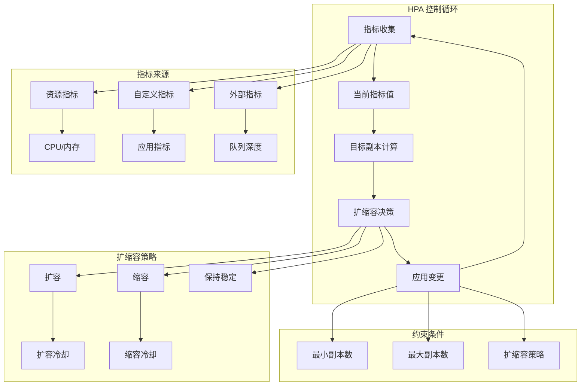

# Kubernetes HPA 最佳实践

## HPA 概述

水平 Pod 自动扩缩容（Horizontal Pod Autoscaler，HPA）是 Kubernetes 中实现自动化资源管理的核心功能，通过监控应用的资源使用情况和性能指标，自动调整 Pod 副本数量，确保应用在不同负载条件下的稳定运行和资源优化。

## HPA 工作原理

### HPA 控制循环



### HPA 算法

**副本计算公式**：
```
期望副本数 = ceil[当前副本数 * (当前指标值 / 期望指标值)]
```

**稳定性机制**：
- **扩容延迟**：避免频繁扩容造成的资源浪费
- **缩容延迟**：避免频繁缩容导致的性能抖动
- **容忍度**：在指标波动范围内保持稳定

## 基础 HPA 配置

### 基于 CPU 和内存的 HPA

**基本资源指标 HPA**：
```yaml
# 基于 CPU 的 HPA
apiVersion: autoscaling/v2
kind: HorizontalPodAutoscaler
metadata:
  name: web-app-hpa
  namespace: production
spec:
  scaleTargetRef:
    apiVersion: apps/v1
    kind: Deployment
    name: web-app
  minReplicas: 3
  maxReplicas: 20
  metrics:
  - type: Resource
    resource:
      name: cpu
      target:
        type: Utilization
        averageUtilization: 70  # 目标 CPU 使用率 70%
  behavior:
    scaleUp:
      stabilizationWindowSeconds: 300    # 扩容稳定窗口 5 分钟
      policies:
      - type: Percent
        value: 100    # 每次最多扩容 100%
        periodSeconds: 60
      - type: Pods
        value: 4      # 每次最多增加 4 个 Pod
        periodSeconds: 60
      selectPolicy: Min    # 选择最小值
    scaleDown:
      stabilizationWindowSeconds: 300    # 缩容稳定窗口 5 分钟
      policies:
      - type: Percent
        value: 50     # 每次最多缩容 50%
        periodSeconds: 60
      - type: Pods
        value: 2      # 每次最多减少 2 个 Pod
        periodSeconds: 60
      selectPolicy: Max    # 选择最大值（更保守）

---
# 基于多指标的 HPA
apiVersion: autoscaling/v2
kind: HorizontalPodAutoscaler
metadata:
  name: api-service-hpa
  namespace: production
spec:
  scaleTargetRef:
    apiVersion: apps/v1
    kind: Deployment
    name: api-service
  minReplicas: 2
  maxReplicas: 50
  metrics:
  # CPU 指标
  - type: Resource
    resource:
      name: cpu
      target:
        type: Utilization
        averageUtilization: 80
  # 内存指标
  - type: Resource
    resource:
      name: memory
      target:
        type: Utilization
        averageUtilization: 85
  behavior:
    scaleUp:
      stabilizationWindowSeconds: 180
      policies:
      - type: Percent
        value: 50
        periodSeconds: 60
      - type: Pods
        value: 10
        periodSeconds: 60
      selectPolicy: Max
    scaleDown:
      stabilizationWindowSeconds: 600    # 缩容更保守，10 分钟窗口
      policies:
      - type: Percent
        value: 10     # 每次最多缩容 10%
        periodSeconds: 120
      selectPolicy: Min
```

### 目标 Deployment 配置要求

**HPA 兼容的 Deployment 配置**：
```yaml
# 支持 HPA 的 Deployment
apiVersion: apps/v1
kind: Deployment
metadata:
  name: web-app
  namespace: production
spec:
  replicas: 3    # 初始副本数
  selector:
    matchLabels:
      app: web-app
  template:
    metadata:
      labels:
        app: web-app
    spec:
      containers:
      - name: web
        image: nginx:alpine
        ports:
        - containerPort: 80
        # 关键：必须设置资源请求
        resources:
          requests:
            cpu: 200m      # HPA 基于此值计算使用率
            memory: 256Mi
          limits:
            cpu: 500m
            memory: 512Mi
        # 健康检查确保 Pod 就绪
        readinessProbe:
          httpGet:
            path: /health
            port: 80
          initialDelaySeconds: 10
          periodSeconds: 5
        livenessProbe:
          httpGet:
            path: /health
            port: 80
          initialDelaySeconds: 30
          periodSeconds: 10
        # 优雅终止
        lifecycle:
          preStop:
            exec:
              command: ["/bin/sh", "-c", "sleep 15"]
      # 终止宽限期
      terminationGracePeriodSeconds: 30
```

## 自定义指标 HPA

### 基于应用指标的 HPA

**自定义指标 HPA 配置**：
```yaml
# 基于 QPS 的 HPA
apiVersion: autoscaling/v2
kind: HorizontalPodAutoscaler
metadata:
  name: high-traffic-api-hpa
  namespace: production
spec:
  scaleTargetRef:
    apiVersion: apps/v1
    kind: Deployment
    name: high-traffic-api
  minReplicas: 5
  maxReplicas: 100
  metrics:
  # 基于请求速率的扩缩容
  - type: Pods
    pods:
      metric:
        name: http_requests_per_second
      target:
        type: AverageValue
        averageValue: "100"    # 每个 Pod 处理 100 RPS
  # 基于响应时间的扩缩容
  - type: Pods
    pods:
      metric:
        name: http_request_duration_p95
      target:
        type: AverageValue
        averageValue: "500m"   # P95 响应时间 500ms
  # 基于错误率的扩缩容
  - type: Pods
    pods:
      metric:
        name: http_error_rate
      target:
        type: AverageValue
        averageValue: "0.01"   # 错误率 1%
  behavior:
    scaleUp:
      stabilizationWindowSeconds: 120
      policies:
      - type: Percent
        value: 100
        periodSeconds: 30    # 快速响应流量突增
      - type: Pods
        value: 10
        periodSeconds: 30
      selectPolicy: Max
    scaleDown:
      stabilizationWindowSeconds: 900    # 15 分钟稳定窗口
      policies:
      - type: Percent
        value: 20
        periodSeconds: 300   # 5 分钟周期
      selectPolicy: Min

---
# 基于业务指标的 HPA
apiVersion: autoscaling/v2
kind: HorizontalPodAutoscaler
metadata:
  name: order-processor-hpa
  namespace: production
spec:
  scaleTargetRef:
    apiVersion: apps/v1
    kind: Deployment
    name: order-processor
  minReplicas: 3
  maxReplicas: 30
  metrics:
  # 基于队列长度
  - type: Pods
    pods:
      metric:
        name: pending_orders_queue_length
      target:
        type: AverageValue
        averageValue: "10"     # 每个 Pod 处理 10 个待处理订单
  # 基于处理延迟
  - type: Pods
    pods:
      metric:
        name: order_processing_duration
      target:
        type: AverageValue
        averageValue: "30s"    # 平均处理时间 30 秒
  behavior:
    scaleUp:
      stabilizationWindowSeconds: 60
      policies:
      - type: Pods
        value: 5
        periodSeconds: 60
    scaleDown:
      stabilizationWindowSeconds: 300
      policies:
      - type: Pods
        value: 1
        periodSeconds: 120
```

### Prometheus Adapter 配置

**自定义指标适配器配置**：
```yaml
# Prometheus Adapter 配置
apiVersion: v1
kind: ConfigMap
metadata:
  name: adapter-config
  namespace: monitoring
data:
  config.yaml: |
    rules:
    # HTTP 请求速率指标
    - seriesQuery: 'http_requests_total{namespace!="",pod!=""}'
      seriesFilters: []
      resources:
        overrides:
          namespace:
            resource: namespace
          pod:
            resource: pod
      name:
        matches: ^http_requests_total
        as: "http_requests_per_second"
      metricsQuery: 'rate(<<.Series>>{<<.LabelMatchers>>}[2m])'
    
    # HTTP 请求延迟指标
    - seriesQuery: 'http_request_duration_seconds{namespace!="",pod!=""}'
      seriesFilters: []
      resources:
        overrides:
          namespace:
            resource: namespace
          pod:
            resource: pod
      name:
        matches: ^http_request_duration_seconds
        as: "http_request_duration_p95"
      metricsQuery: 'histogram_quantile(0.95, rate(<<.Series>>_bucket{<<.LabelMatchers>>}[2m]))'
    
    # 错误率指标
    - seriesQuery: 'http_requests_total{namespace!="",pod!="",status=~"5.."}'
      seriesFilters: []
      resources:
        overrides:
          namespace:
            resource: namespace
          pod:
            resource: pod
      name:
        matches: ^http_requests_total
        as: "http_error_rate"
      metricsQuery: |
        (
          rate(http_requests_total{status=~"5..",<<.LabelMatchers>>}[2m]) /
          rate(http_requests_total{<<.LabelMatchers>>}[2m])
        )
    
    # 队列长度指标
    - seriesQuery: 'queue_length{namespace!="",pod!=""}'
      seriesFilters: []
      resources:
        overrides:
          namespace:
            resource: namespace
          pod:
            resource: pod
      name:
        matches: ^queue_length
        as: "pending_orders_queue_length"
      metricsQuery: '<<.Series>>{<<.LabelMatchers>>}'

---
# Prometheus Adapter 部署
apiVersion: apps/v1
kind: Deployment
metadata:
  name: prometheus-adapter
  namespace: monitoring
spec:
  replicas: 1
  selector:
    matchLabels:
      app: prometheus-adapter
  template:
    metadata:
      labels:
        app: prometheus-adapter
    spec:
      containers:
      - name: prometheus-adapter
        image: k8s.gcr.io/prometheus-adapter/prometheus-adapter:v0.11.0
        args:
        - --cert-dir=/var/run/serving-cert
        - --config=/etc/adapter/config.yaml
        - --logtostderr=true
        - --prometheus-url=http://prometheus.monitoring.svc:9090/
        - --metrics-relist-interval=1m
        - --v=4
        - --secure-port=6443
        ports:
        - containerPort: 6443
        volumeMounts:
        - mountPath: /etc/adapter/
          name: config
          readOnly: true
        - mountPath: /var/run/serving-cert
          name: volume-serving-cert
          readOnly: true
        resources:
          requests:
            cpu: 100m
            memory: 128Mi
          limits:
            cpu: 250m
            memory: 256Mi
      volumes:
      - name: config
        configMap:
          name: adapter-config
      - name: volume-serving-cert
        secret:
          secretName: prometheus-adapter-certs
```

## 外部指标 HPA

### 基于外部服务的 HPA

**基于 SQS 队列的 HPA**：
```yaml
# 基于 AWS SQS 队列的 HPA
apiVersion: autoscaling/v2
kind: HorizontalPodAutoscaler
metadata:
  name: queue-worker-hpa
  namespace: production
spec:
  scaleTargetRef:
    apiVersion: apps/v1
    kind: Deployment
    name: queue-worker
  minReplicas: 1
  maxReplicas: 50
  metrics:
  - type: External
    external:
      metric:
        name: sqs_queue_length
        selector:
          matchLabels:
            queue_name: "work-queue"
            region: "us-west-2"
      target:
        type: Value
        value: "5"    # 每个 Pod 处理 5 个队列消息
  behavior:
    scaleUp:
      stabilizationWindowSeconds: 60
      policies:
      - type: Percent
        value: 200    # 快速扩容以处理队列积压
        periodSeconds: 60
      - type: Pods
        value: 10
        periodSeconds: 60
      selectPolicy: Max
    scaleDown:
      stabilizationWindowSeconds: 300
      policies:
      - type: Pods
        value: 1
        periodSeconds: 180   # 缓慢缩容避免队列再次积压
      selectPolicy: Min

---
# 基于 Redis 连接数的 HPA
apiVersion: autoscaling/v2
kind: HorizontalPodAutoscaler
metadata:
  name: redis-proxy-hpa
  namespace: production
spec:
  scaleTargetRef:
    apiVersion: apps/v1
    kind: Deployment
    name: redis-proxy
  minReplicas: 2
  maxReplicas: 20
  metrics:
  - type: External
    external:
      metric:
        name: redis_connected_clients
        selector:
          matchLabels:
            redis_instance: "main-cache"
      target:
        type: Value
        value: "100"   # Redis 连接数超过 100 时扩容
  behavior:
    scaleUp:
      stabilizationWindowSeconds: 120
      policies:
      - type: Pods
        value: 2
        periodSeconds: 60
    scaleDown:
      stabilizationWindowSeconds: 600
      policies:
      - type: Pods
        value: 1
        periodSeconds: 300
```

### KEDA 集成

**KEDA ScaledObject 配置**：
```yaml
# KEDA ScaledObject 用于复杂外部指标
apiVersion: keda.sh/v1alpha1
kind: ScaledObject
metadata:
  name: rabbitmq-consumer-scaler
  namespace: production
spec:
  scaleTargetRef:
    name: rabbitmq-consumer
    kind: Deployment
  minReplicaCount: 1
  maxReplicaCount: 30
  pollingInterval: 30
  cooldownPeriod: 300
  triggers:
  # RabbitMQ 队列长度触发器
  - type: rabbitmq
    metadata:
      host: amqp://rabbitmq.messaging.svc.cluster.local:5672
      queueName: work-queue
      queueLength: "5"    # 队列长度超过 5 时扩容
  # Prometheus 指标触发器
  - type: prometheus
    metadata:
      serverAddress: http://prometheus.monitoring.svc:9090
      metricName: rabbitmq_queue_processing_rate
      threshold: '10'
      query: rate(rabbitmq_messages_delivered_total[1m])
  # 定时扩缩容
  - type: cron
    metadata:
      timezone: Asia/Shanghai
      start: "0 8 * * 1-5"     # 工作日 8 点扩容
      end: "0 18 * * 1-5"      # 工作日 18 点缩容
      desiredReplicas: "10"

---
# 基于多种云服务指标的 KEDA 配置
apiVersion: keda.sh/v1alpha1
kind: ScaledObject
metadata:
  name: cloud-native-scaler
  namespace: production
spec:
  scaleTargetRef:
    name: cloud-worker
  minReplicaCount: 2
  maxReplicaCount: 100
  triggers:
  # AWS SQS 触发器
  - type: aws-sqs-queue
    metadata:
      queueURL: https://sqs.us-east-1.amazonaws.com/123456789/work-queue
      queueLength: "10"
      awsRegion: us-east-1
      identityOwner: pod
  # Azure Service Bus 触发器
  - type: azure-servicebus
    metadata:
      queueName: processing-queue
      messageCount: "5"
      connectionFromEnv: AZURE_SERVICEBUS_CONNECTION_STRING
  # Google Pub/Sub 触发器
  - type: gcp-pubsub
    metadata:
      subscriptionName: work-subscription
      value: "8"
      credentialsFromEnv: GOOGLE_APPLICATION_CREDENTIALS
```

## HPA 高级配置

### 复杂行为策略

**精细化扩缩容策略**：
```yaml
# 高级 HPA 行为配置
apiVersion: autoscaling/v2
kind: HorizontalPodAutoscaler
metadata:
  name: advanced-behavior-hpa
  namespace: production
spec:
  scaleTargetRef:
    apiVersion: apps/v1
    kind: Deployment
    name: microservice
  minReplicas: 5
  maxReplicas: 200
  metrics:
  - type: Resource
    resource:
      name: cpu
      target:
        type: Utilization
        averageUtilization: 75
  - type: Pods
    pods:
      metric:
        name: http_requests_per_second
      target:
        type: AverageValue
        averageValue: "200"
  behavior:
    scaleUp:
      # 扩容稳定窗口
      stabilizationWindowSeconds: 180
      policies:
      # 快速响应阶段：第一分钟内可以快速扩容
      - type: Percent
        value: 100
        periodSeconds: 60
      # 中等响应阶段：第二分钟内适度扩容
      - type: Percent
        value: 50
        periodSeconds: 120
      # 保守响应阶段：后续时间内保守扩容
      - type: Pods
        value: 5
        periodSeconds: 180
      selectPolicy: Max    # 选择最大值，快速响应
    scaleDown:
      # 缩容稳定窗口更长，避免频繁变动
      stabilizationWindowSeconds: 900
      policies:
      # 渐进式缩容策略
      - type: Percent
        value: 10    # 每次最多缩容 10%
        periodSeconds: 300
      - type: Pods
        value: 2     # 每次最多减少 2 个 Pod
        periodSeconds: 180
      selectPolicy: Min    # 选择最小值，保守缩容

---
# 基于时间窗口的动态 HPA
apiVersion: autoscaling/v2
kind: HorizontalPodAutoscaler
metadata:
  name: time-aware-hpa
  namespace: production
spec:
  scaleTargetRef:
    apiVersion: apps/v1
    kind: Deployment
    name: business-app
  minReplicas: 3
  maxReplicas: 50
  metrics:
  - type: Resource
    resource:
      name: cpu
      target:
        type: Utilization
        averageUtilization: 70
  # 基于一天中的时间调整策略
  behavior:
    scaleUp:
      stabilizationWindowSeconds: 300
      policies:
      # 工作时间快速扩容
      - type: Percent
        value: 100
        periodSeconds: 60
      selectPolicy: Max
    scaleDown:
      stabilizationWindowSeconds: 600
      policies:
      # 非工作时间可以更激进地缩容
      - type: Percent
        value: 30
        periodSeconds: 300
      selectPolicy: Min
```

### 预测性扩缩容

**VPA + HPA 组合策略**：
```yaml
# VPA 配置用于垂直扩缩容
apiVersion: autoscaling.k8s.io/v1
kind: VerticalPodAutoscaler
metadata:
  name: microservice-vpa
  namespace: production
spec:
  targetRef:
    apiVersion: apps/v1
    kind: Deployment
    name: microservice
  updatePolicy:
    updateMode: "Auto"
  resourcePolicy:
    containerPolicies:
    - containerName: microservice
      minAllowed:
        cpu: 100m
        memory: 128Mi
      maxAllowed:
        cpu: 2000m
        memory: 4Gi
      controlledResources: ["cpu", "memory"]
      controlledValues: RequestsAndLimits

---
# 预测性 HPA 配置
apiVersion: autoscaling/v2
kind: HorizontalPodAutoscaler
metadata:
  name: predictive-hpa
  namespace: production
spec:
  scaleTargetRef:
    apiVersion: apps/v1
    kind: Deployment
    name: microservice
  minReplicas: 5
  maxReplicas: 100
  metrics:
  # 基于历史模式的预测指标
  - type: External
    external:
      metric:
        name: predicted_load
        selector:
          matchLabels:
            service: "microservice"
            prediction_horizon: "5m"
      target:
        type: Value
        value: "80"    # 预测负载超过 80% 时提前扩容
  # 传统指标作为保险
  - type: Resource
    resource:
      name: cpu
      target:
        type: Utilization
        averageUtilization: 85
  behavior:
    scaleUp:
      stabilizationWindowSeconds: 60    # 预测性扩容响应更快
      policies:
      - type: Percent
        value: 50
        periodSeconds: 60
    scaleDown:
      stabilizationWindowSeconds: 1200  # 缩容更保守
      policies:
      - type: Percent
        value: 25
        periodSeconds: 600
```

## HPA 监控和调优

### HPA 性能监控

**HPA 监控指标配置**：
```yaml
# HPA 监控规则
apiVersion: v1
kind: ConfigMap
metadata:
  name: hpa-monitoring-rules
data:
  hpa-rules.yml: |
    groups:
    - name: hpa-performance
      rules:
      # HPA 决策延迟
      - record: hpa:decision_latency:rate5m
        expr: |
          rate(hpa_controller_hpa_decision_duration_seconds_sum[5m]) /
          rate(hpa_controller_hpa_decision_duration_seconds_count[5m])
      
      # HPA 扩缩容频率
      - record: hpa:scaling_events:rate1h
        expr: |
          increase(hpa_controller_scaling_events_total[1h])
      
      # HPA 目标 vs 实际副本数差异
      - record: hpa:replica_deviation:current
        expr: |
          abs(
            kube_horizontalpodautoscaler_status_current_replicas -
            kube_horizontalpodautoscaler_status_desired_replicas
          )
      
      # HPA 指标获取成功率
      - record: hpa:metrics_success_rate:rate5m
        expr: |
          rate(hpa_controller_metrics_query_success_total[5m]) /
          rate(hpa_controller_metrics_query_total[5m]) * 100
      
      # HPA 限制达到频率
      - record: hpa:limit_reached:rate1h
        expr: |
          increase(hpa_controller_limit_reached_total[1h])

---
# HPA 告警规则
apiVersion: v1
kind: ConfigMap
metadata:
  name: hpa-alerts
data:
  hpa-alerts.yml: |
    groups:
    - name: hpa-alerts
      rules:
      # HPA 决策延迟过高
      - alert: HPAHighDecisionLatency
        expr: |
          hpa:decision_latency:rate5m > 5
        for: 5m
        labels:
          severity: warning
          component: hpa
        annotations:
          summary: "HPA {{ $labels.horizontalpodautoscaler }} 决策延迟过高"
          description: "HPA 决策延迟: {{ $value }}s，超过 5 秒阈值"
      
      # HPA 频繁扩缩容
      - alert: HPAFrequentScaling
        expr: |
          hpa:scaling_events:rate1h > 10
        for: 10m
        labels:
          severity: warning
          component: hpa
        annotations:
          summary: "HPA {{ $labels.horizontalpodautoscaler }} 扩缩容过于频繁"
          description: "1小时内扩缩容 {{ $value }} 次，可能需要调整策略"
      
      # HPA 副本数偏差
      - alert: HPAReplicaDeviation
        expr: |
          hpa:replica_deviation:current > 5
        for: 15m
        labels:
          severity: warning
          component: hpa
        annotations:
          summary: "HPA {{ $labels.horizontalpodautoscaler }} 副本数偏差过大"
          description: "目标副本数与实际副本数差异: {{ $value }}"
      
      # HPA 指标获取失败
      - alert: HPAMetricsFailure
        expr: |
          hpa:metrics_success_rate:rate5m < 90
        for: 5m
        labels:
          severity: critical
          component: hpa
        annotations:
          summary: "HPA {{ $labels.horizontalpodautoscaler }} 指标获取失败率过高"
          description: "指标获取成功率: {{ $value }}%，低于 90% 阈值"
      
      # HPA 达到副本数限制
      - alert: HPAReplicaLimitReached
        expr: |
          kube_horizontalpodautoscaler_status_current_replicas == 
          kube_horizontalpodautoscaler_spec_max_replicas
        for: 10m
        labels:
          severity: warning
          component: hpa
        annotations:
          summary: "HPA {{ $labels.horizontalpodautoscaler }} 达到最大副本数限制"
          description: "当前副本数已达到最大限制，可能需要调整上限或优化应用"
```

### HPA 调优脚本

**HPA 分析和调优工具**：
```bash
#!/bin/bash
# HPA 性能分析和调优脚本

# 函数：分析 HPA 状态
analyze_hpa_status() {
    echo "=== HPA 状态分析 ==="
    
    # 获取所有 HPA 配置
    echo "1. 当前 HPA 配置:"
    kubectl get hpa --all-namespaces -o wide
    
    # 分析 HPA 详细状态
    echo -e "\n2. HPA 详细状态:"
    for hpa in $(kubectl get hpa --all-namespaces -o jsonpath='{range .items[*]}{.metadata.namespace}{" "}{.metadata.name}{"\n"}{end}'); do
        namespace=$(echo $hpa | awk '{print $1}')
        name=$(echo $hpa | awk '{print $2}')
        
        echo "HPA: $namespace/$name"
        kubectl describe hpa -n $namespace $name | grep -E "(Metrics|Current|Target|Min|Max)"
        echo "---"
    done
}

# 函数：分析扩缩容历史
analyze_scaling_history() {
    echo -e "\n=== 扩缩容历史分析 ==="
    
    # 获取最近的扩缩容事件
    echo "1. 最近的扩缩容事件:"
    kubectl get events --all-namespaces --field-selector reason=SuccessfulRescale \
        --sort-by='.lastTimestamp' | tail -20
    
    # 分析扩缩容频率
    echo -e "\n2. 扩缩容频率分析:"
    kubectl get events --all-namespaces --field-selector reason=SuccessfulRescale -o json | \
        jq -r '.items[] | "\(.firstTimestamp) \(.involvedObject.name) \(.message)"' | \
        tail -50 | awk '{print $3}' | sort | uniq -c
}

# 函数：检查指标可用性
check_metrics_availability() {
    echo -e "\n=== 指标可用性检查 ==="
    
    # 检查 metrics-server
    echo "1. Metrics Server 状态:"
    kubectl get pods -n kube-system -l k8s-app=metrics-server
    
    # 检查自定义指标 API
    echo -e "\n2. 自定义指标 API 可用性:"
    kubectl get apiservices | grep -E "(metrics|custom)"
    
    # 测试指标查询
    echo -e "\n3. 测试指标查询:"
    kubectl top nodes 2>/dev/null || echo "节点指标不可用"
    kubectl top pods --all-namespaces | head -5 2>/dev/null || echo "Pod 指标不可用"
}

# 函数：HPA 性能建议
hpa_optimization_recommendations() {
    echo -e "\n=== HPA 优化建议 ==="
    
    # 检查没有设置资源请求的 Pod
    echo "1. 检查 HPA 目标 Deployment 的资源配置:"
    for hpa in $(kubectl get hpa --all-namespaces -o jsonpath='{range .items[*]}{.metadata.namespace}{" "}{.metadata.name}{" "}{.spec.scaleTargetRef.name}{"\n"}{end}'); do
        namespace=$(echo $hpa | awk '{print $1}')
        hpa_name=$(echo $hpa | awk '{print $2}')
        target=$(echo $hpa | awk '{print $3}')
        
        echo "检查 HPA: $namespace/$hpa_name -> $target"
        
        # 检查目标 Deployment 的资源配置
        has_requests=$(kubectl get deployment -n $namespace $target -o jsonpath='{.spec.template.spec.containers[0].resources.requests}' 2>/dev/null)
        if [ -z "$has_requests" ] || [ "$has_requests" = "null" ]; then
            echo "  ⚠️  警告: Deployment $target 未设置资源请求，HPA 可能无法正常工作"
        else
            echo "  ✅  Deployment $target 已设置资源请求"
        fi
    done
    
    # 分析 HPA 配置合理性
    echo -e "\n2. HPA 配置合理性分析:"
    kubectl get hpa --all-namespaces -o json | jq -r '
        .items[] | 
        select(.spec.minReplicas > .spec.maxReplicas/2) |
        "\(.metadata.namespace)/\(.metadata.name): 最小副本数可能过高 (min: \(.spec.minReplicas), max: \(.spec.maxReplicas))"
    '
    
    # 优化建议
    echo -e "\n3. 通用优化建议:"
    echo "   - 确保所有目标 Deployment 设置了资源请求"
    echo "   - 使用合适的稳定窗口避免频繁扩缩容"
    echo "   - 结合多个指标提高扩缩容准确性"
    echo "   - 设置合理的扩缩容策略和限制"
    echo "   - 监控 HPA 性能并定期调优"
}

# 主函数
main() {
    echo "Kubernetes HPA 性能分析工具"
    echo "=========================="
    
    analyze_hpa_status
    analyze_scaling_history
    check_metrics_availability
    hpa_optimization_recommendations
    
    echo -e "\n分析完成！"
}

# 执行主函数
main
```

## HPA 最佳实践总结

### 配置最佳实践

1. **资源请求设置**：确保所有 Pod 都设置了准确的资源请求
2. **多指标组合**：使用 CPU、内存和自定义指标组合提高准确性
3. **合理阈值**：设置适当的目标使用率，避免过于敏感或迟钝
4. **稳定窗口**：配置合适的稳定窗口避免频繁扩缩容
5. **扩缩容策略**：设计渐进式扩缩容策略，扩容快速、缩容保守

### 运维最佳实践

1. **监控告警**：建立完善的 HPA 性能监控和告警体系
2. **定期优化**：根据业务模式和负载特征定期调整 HPA 配置
3. **测试验证**：在生产环境部署前充分测试 HPA 行为
4. **文档记录**：记录 HPA 配置决策和调优历史
5. **故障预案**：制定 HPA 故障时的手动干预预案

### 故障排查指南

1. **指标问题**：检查 metrics-server 和自定义指标 API 状态
2. **权限问题**：验证 HPA controller 的 RBAC 权限
3. **配置问题**：检查目标 Deployment 的资源配置
4. **性能问题**：分析扩缩容历史和决策延迟
5. **业务影响**：评估 HPA 行为对业务的实际影响

通过遵循这些最佳实践，可以充分发挥 HPA 的优势，实现应用的自动化资源管理和性能优化。
