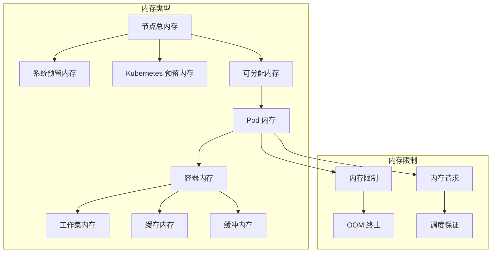

# Kubernetes 内存优化策略

## 内存优化概述

内存是 Kubernetes 集群中的关键资源，合理的内存优化策略对于确保应用稳定运行、避免 OOM 终止、提升系统性能至关重要。内存优化需要从应用设计、容器配置、资源管理和集群调优等多个层面进行系统性优化。

## 内存管理基础

### 内存资源单位和类型

**内存资源单位**：
- **字节单位**：Byte, Ki (1024), Mi (1024²), Gi (1024³), Ti (1024⁴)
- **十进制单位**：K (1000), M (1000²), G (1000³), T (1000⁴)
- **推荐使用**：二进制单位 (Ki, Mi, Gi) 更精确

**内存类型分析**：


### 内存 QoS 类别

**QoS 类别配置**：
```yaml
# Guaranteed QoS - 最高优先级
apiVersion: v1
kind: Pod
metadata:
  name: guaranteed-memory-pod
spec:
  containers:
  - name: app
    image: memory-app:latest
    resources:
      requests:
        memory: 2Gi
        cpu: 1000m
      limits:
        memory: 2Gi      # requests == limits
        cpu: 1000m

---
# Burstable QoS - 中等优先级
apiVersion: v1
kind: Pod
metadata:
  name: burstable-memory-pod
spec:
  containers:
  - name: app
    image: memory-app:latest
    resources:
      requests:
        memory: 1Gi
        cpu: 500m
      limits:
        memory: 4Gi      # limits > requests
        cpu: 2000m

---
# BestEffort QoS - 最低优先级
apiVersion: v1
kind: Pod
metadata:
  name: besteffort-memory-pod
spec:
  containers:
  - name: app
    image: memory-app:latest
    # 无资源配置
```

## 内存优化策略

### 应用层内存优化

**JVM 内存优化**：
```yaml
# Java 应用内存优化配置
apiVersion: apps/v1
kind: Deployment
metadata:
  name: java-memory-optimized
spec:
  replicas: 3
  selector:
    matchLabels:
      app: java-app
  template:
    metadata:
      labels:
        app: java-app
    spec:
      containers:
      - name: app
        image: openjdk:17-jre
        env:
        # JVM 堆内存配置
        - name: JAVA_OPTS
          value: >-
            -Xms1g
            -Xmx3g
            -XX:+UseG1GC
            -XX:MaxGCPauseMillis=200
            -XX:+UseStringDeduplication
            -XX:MaxMetaspaceSize=256m
            -XX:CompressedClassSpaceSize=64m
            -XX:+PrintGC
            -XX:+PrintGCDetails
            -XX:+PrintGCTimeStamps
            -XX:+HeapDumpOnOutOfMemoryError
            -XX:HeapDumpPath=/tmp/heapdump.hprof
        # 容器感知的内存配置
        - name: JVM_MEMORY_OPTS
          value: "-XX:InitialRAMPercentage=25 -XX:MaxRAMPercentage=75"
        # 内存泄漏检测
        - name: JAVA_TOOL_OPTIONS
          value: "-XX:+ExitOnOutOfMemoryError"
        resources:
          requests:
            cpu: 500m
            memory: 1.5Gi
          limits:
            cpu: 2000m
            memory: 4Gi       # 为 JVM 堆外内存预留空间
        # 内存相关探针
        livenessProbe:
          httpGet:
            path: /actuator/health
            port: 8080
          initialDelaySeconds: 120
          periodSeconds: 30
          timeoutSeconds: 10
        readinessProbe:
          httpGet:
            path: /actuator/health/readiness
            port: 8080
          initialDelaySeconds: 30
          periodSeconds: 10
        # 优雅终止
        lifecycle:
          preStop:
            exec:
              command: ["/bin/sh", "-c", "sleep 10"]
```

**Node.js 内存优化**：
```yaml
# Node.js 应用内存优化
apiVersion: apps/v1
kind: Deployment
metadata:
  name: nodejs-memory-optimized
spec:
  replicas: 3
  selector:
    matchLabels:
      app: nodejs-app
  template:
    metadata:
      labels:
        app: nodejs-app
    spec:
      containers:
      - name: app
        image: node:18-alpine
        env:
        # Node.js 内存配置
        - name: NODE_OPTIONS
          value: "--max-old-space-size=1536"  # 设置 V8 堆内存限制
        - name: UV_THREADPOOL_SIZE
          value: "4"
        # 内存监控和调试
        - name: NODE_ENV
          value: "production"
        - name: DEBUG
          value: ""
        command: ["node"]
        args: ["--inspect=0.0.0.0:9229", "app.js"]
        resources:
          requests:
            cpu: 200m
            memory: 512Mi
          limits:
            cpu: 1000m
            memory: 2Gi
        ports:
        - containerPort: 3000
          name: http
        - containerPort: 9229
          name: debug
```

**Python 内存优化**：
```yaml
# Python 应用内存优化
apiVersion: apps/v1
kind: Deployment
metadata:
  name: python-memory-optimized
spec:
  replicas: 3
  selector:
    matchLabels:
      app: python-app
  template:
    metadata:
      labels:
        app: python-app
    spec:
      containers:
      - name: app
        image: python:3.11-slim
        env:
        # Python 内存优化参数
        - name: PYTHONUNBUFFERED
          value: "1"
        - name: PYTHONDONTWRITEBYTECODE
          value: "1"
        - name: MALLOC_ARENA_MAX
          value: "2"              # 限制 malloc arena 数量
        - name: PYTHONHASHSEED
          value: "random"
        # 内存分析工具
        - name: PYTHONTRACEMALLOC
          value: "1"
        command: ["python"]
        args: ["-m", "gunicorn", "--bind", "0.0.0.0:8000", "--workers", "4", "app:app"]
        resources:
          requests:
            cpu: 200m
            memory: 256Mi
          limits:
            cpu: 1000m
            memory: 1Gi
```

### 容器层内存优化

**容器镜像内存优化**：
```dockerfile
# 内存优化的多阶段构建
FROM node:18-alpine AS builder
WORKDIR /app
# 只复制必要的文件
COPY package*.json ./
RUN npm ci --only=production && npm cache clean --force

FROM node:18-alpine AS production
WORKDIR /app

# 添加非 root 用户
RUN addgroup -g 1001 -S nodejs
RUN adduser -S nextjs -u 1001

# 只复制必要的文件
COPY --from=builder /app/node_modules ./node_modules
COPY --chown=nextjs:nodejs . .

# 清理不必要的文件
RUN rm -rf .git .gitignore README.md tests/

USER nextjs
EXPOSE 3000

# 优化启动命令
CMD ["node", "--max-old-space-size=512", "server.js"]
```

**内存限制和监控**：
```yaml
# 内存监控和限制配置
apiVersion: v1
kind: Pod
metadata:
  name: memory-monitored-pod
spec:
  containers:
  - name: app
    image: memory-app:latest
    resources:
      requests:
        memory: 512Mi
      limits:
        memory: 1Gi
    # 内存使用情况监控
    env:
    - name: MEMORY_LIMIT
      valueFrom:
        resourceFieldRef:
          resource: limits.memory
    - name: MEMORY_REQUEST
      valueFrom:
        resourceFieldRef:
          resource: requests.memory
    # 内存告警脚本
    lifecycle:
      postStart:
        exec:
          command:
          - /bin/sh
          - -c
          - |
            echo "Memory limit: $MEMORY_LIMIT"
            echo "Memory request: $MEMORY_REQUEST"
    # 内存泄漏检测
    livenessProbe:
      exec:
        command:
        - /bin/sh
        - -c
        - |
          MEMORY_USAGE=$(cat /sys/fs/cgroup/memory/memory.usage_in_bytes)
          MEMORY_LIMIT=$(cat /sys/fs/cgroup/memory/memory.limit_in_bytes)
          USAGE_PERCENT=$((MEMORY_USAGE * 100 / MEMORY_LIMIT))
          if [ $USAGE_PERCENT -gt 90 ]; then
            exit 1
          fi
      initialDelaySeconds: 60
      periodSeconds: 30
```

### 集群层内存优化

**节点内存管理**：
```yaml
# Kubelet 内存管理配置
apiVersion: v1
kind: ConfigMap
metadata:
  name: kubelet-memory-config
  namespace: kube-system
data:
  kubelet-config.yaml: |
    apiVersion: kubelet.config.k8s.io/v1beta1
    kind: KubeletConfiguration
    
    # 内存管理策略
    memoryManagerPolicy: "Static"  # 或 "None"
    
    # 系统预留内存
    systemReserved:
      memory: "1Gi"
      cpu: "200m"
      ephemeral-storage: "2Gi"
    
    # Kubernetes 组件预留内存
    kubeReserved:
      memory: "1Gi"
      cpu: "200m"
      ephemeral-storage: "1Gi"
    
    # 强制执行资源预留
    enforceNodeAllocatable: ["pods", "system-reserved", "kube-reserved"]
    
    # 驱逐策略
    evictionHard:
      memory.available: "200Mi"
      nodefs.available: "10%"
      imagefs.available: "15%"
    
    evictionSoft:
      memory.available: "500Mi"
      nodefs.available: "15%"
      imagefs.available: "20%"
    
    evictionSoftGracePeriod:
      memory.available: "1m30s"
      nodefs.available: "1m30s"
      imagefs.available: "1m30s"
    
    # 驱逐最大 Pod 优雅终止期
    evictionMaxPodGracePeriod: 60
    
    # 内存压力检测
    evictionPressureTransitionPeriod: "5m"
```

**内存资源配额**：
```yaml
# 命名空间内存配额
apiVersion: v1
kind: ResourceQuota
metadata:
  name: memory-quota
  namespace: production
spec:
  hard:
    requests.memory: "50Gi"
    limits.memory: "100Gi"
    persistentvolumeclaims: "10"
    pods: "50"

---
# 内存限制范围
apiVersion: v1
kind: LimitRange
metadata:
  name: memory-limit-range
  namespace: production
spec:
  limits:
  # 容器级别限制
  - type: Container
    default:
      memory: "512Mi"
      cpu: "500m"
    defaultRequest:
      memory: "256Mi"
      cpu: "200m"
    max:
      memory: "8Gi"
      cpu: "4000m"
    min:
      memory: "64Mi"
      cpu: "100m"
  # Pod 级别限制
  - type: Pod
    max:
      memory: "16Gi"
      cpu: "8000m"
  # PVC 限制
  - type: PersistentVolumeClaim
    max:
      storage: "100Gi"
    min:
      storage: "1Gi"
```

## 内存监控和分析

### 内存使用监控

**Prometheus 内存监控规则**：
```yaml
# 内存监控规则配置
apiVersion: v1
kind: ConfigMap
metadata:
  name: memory-monitoring-rules
data:
  memory-rules.yml: |
    groups:
    - name: memory-performance
      rules:
      # 节点内存使用率
      - record: node:memory_utilization:ratio
        expr: |
          (
            1 - (
              node_memory_MemAvailable_bytes /
              node_memory_MemTotal_bytes
            )
          ) * 100
      
      # Pod 内存使用率
      - record: pod:memory_utilization:ratio
        expr: |
          (
            container_memory_working_set_bytes{container!="POD",container!=""} /
            on(pod, namespace) group_left()
            kube_pod_container_resource_limits{resource="memory"}
          ) * 100
      
      # 内存效率指标
      - record: pod:memory_efficiency:ratio
        expr: |
          (
            container_memory_working_set_bytes{container!="POD",container!=""} /
            on(pod, namespace) group_left()
            kube_pod_container_resource_requests{resource="memory"}
          ) * 100
      
      # 内存泄漏检测
      - record: pod:memory_growth:rate1h
        expr: |
          increase(container_memory_working_set_bytes{container!="POD",container!=""}[1h])
      
      # 节点内存压力
      - record: node:memory_pressure:ratio
        expr: |
          (
            node_memory_MemTotal_bytes - node_memory_MemAvailable_bytes
          ) / node_memory_MemTotal_bytes * 100
```

**内存告警规则**：
```yaml
# 内存性能告警
apiVersion: v1
kind: ConfigMap
metadata:
  name: memory-performance-alerts
data:
  memory-alerts.yml: |
    groups:
    - name: memory-performance-alerts
      rules:
      # 节点内存使用率过高
      - alert: HighNodeMemoryUsage
        expr: |
          node:memory_utilization:ratio > 85
        for: 5m
        labels:
          severity: warning
          component: node
        annotations:
          summary: "节点 {{ $labels.instance }} 内存使用率过高"
          description: "内存使用率: {{ $value }}%，超过 85% 阈值"
      
      # Pod 内存使用率过高
      - alert: HighPodMemoryUsage
        expr: |
          pod:memory_utilization:ratio > 90
        for: 3m
        labels:
          severity: critical
          component: pod
        annotations:
          summary: "Pod {{ $labels.pod }} 内存使用率过高"
          description: "内存使用率: {{ $value }}%，超过 90% 阈值，可能发生 OOM"
      
      # 内存泄漏检测
      - alert: MemoryLeakDetected
        expr: |
          pod:memory_growth:rate1h > 100 * 1024 * 1024  # 100MB/hour
        for: 0m
        labels:
          severity: warning
          component: pod
        annotations:
          summary: "检测到内存泄漏: {{ $labels.pod }}"
          description: "1小时内内存增长: {{ $value | humanizeBytes }}"
      
      # OOM 事件频繁
      - alert: FrequentOOMKills
        expr: |
          increase(kube_pod_container_status_restarts_total{reason="OOMKilled"}[1h]) > 3
        for: 0m
        labels:
          severity: critical
          component: pod
        annotations:
          summary: "频繁 OOM 终止: {{ $labels.pod }}"
          description: "1小时内 OOM 次数: {{ $value }}"
      
      # 内存效率过低
      - alert: LowMemoryEfficiency
        expr: |
          pod:memory_efficiency:ratio < 30
        for: 15m
        labels:
          severity: info
          component: pod
        annotations:
          summary: "Pod {{ $labels.pod }} 内存效率过低"
          description: "内存使用效率: {{ $value }}%，低于 30% 阈值"
```

### 内存分析工具

**内存分析脚本**：
```bash
#!/bin/bash
# 内存使用分析工具

# 函数：分析节点内存使用情况
analyze_node_memory() {
    echo "=== 节点内存使用分析 ==="
    
    # 获取节点内存使用情况
    echo "1. 节点内存使用率排行："
    kubectl top nodes --sort-by=memory | head -10
    
    # 分析节点内存容量和分配
    echo -e "\n2. 节点内存容量分析："
    kubectl describe nodes | grep -A5 "Allocated resources" | grep -E "(memory|Requests|Limits)"
    
    # 检查节点内存压力
    echo -e "\n3. 节点内存压力检查："
    kubectl get nodes -o custom-columns="NAME:.metadata.name,MEMORY_PRESSURE:.status.conditions[?(@.type=='MemoryPressure')].status"
}

# 函数：分析 Pod 内存使用情况
analyze_pod_memory() {
    echo -e "\n=== Pod 内存使用分析 ==="
    
    # 高内存使用的 Pod
    echo "1. 高内存使用 Pod："
    kubectl top pods --all-namespaces --sort-by=memory | head -15
    
    # 内存资源配置分析
    echo -e "\n2. 内存资源配置分析："
    kubectl get pods --all-namespaces -o custom-columns="NAMESPACE:.metadata.namespace,NAME:.metadata.name,MEM_REQ:.spec.containers[*].resources.requests.memory,MEM_LIMIT:.spec.containers[*].resources.limits.memory" | \
        grep -v "<none>" | head -10
    
    # OOM 事件检查
    echo -e "\n3. 最近的 OOM 事件："
    kubectl get events --all-namespaces --field-selector reason=OOMKilling \
        --sort-by='.lastTimestamp' | tail -10
}

# 函数：内存优化建议
memory_optimization_recommendations() {
    echo -e "\n=== 内存优化建议 ==="
    
    # 检查未设置内存请求的 Pod
    echo "1. 未设置内存资源请求的 Pod："
    kubectl get pods --all-namespaces -o json | jq -r '
        .items[] | 
        select(.spec.containers[].resources.requests.memory == null) |
        "\(.metadata.namespace)/\(.metadata.name)"
    ' | head -10
    
    # 检查内存超分配的节点
    echo -e "\n2. 内存超分配节点检查："
    kubectl describe nodes | grep -A3 -B1 "Allocated resources" | grep -A2 -B1 "memory.*%"
    
    # 检查频繁重启的 Pod
    echo -e "\n3. 频繁重启的 Pod (可能的内存问题)："
    kubectl get pods --all-namespaces -o json | jq -r '
        .items[] | 
        select(.status.containerStatuses != null) |
        select(.status.containerStatuses[].restartCount > 5) |
        "\(.metadata.namespace)/\(.metadata.name): 重启 \(.status.containerStatuses[0].restartCount) 次"
    ' | head -10
    
    # 优化建议
    echo -e "\n4. 优化建议："
    echo "   - 为所有 Pod 设置合理的内存 requests 和 limits"
    echo "   - 监控和调整 JVM 堆内存配置"
    echo "   - 使用内存分析工具识别内存泄漏"
    echo "   - 实施内存驱逐策略避免节点内存压力"
    echo "   - 定期检查和清理不必要的缓存"
}

# 主函数
main() {
    echo "Kubernetes 内存使用分析工具"
    echo "=========================="
    
    analyze_node_memory
    analyze_pod_memory
    memory_optimization_recommendations
    
    echo -e "\n分析完成！"
}

# 执行主函数
main
```

## 内存故障排查

### OOM 问题诊断

**OOM 分析工具**：
```yaml
# OOM 分析 DaemonSet
apiVersion: apps/v1
kind: DaemonSet
metadata:
  name: oom-analyzer
  namespace: kube-system
spec:
  selector:
    matchLabels:
      name: oom-analyzer
  template:
    metadata:
      labels:
        name: oom-analyzer
    spec:
      hostPID: true
      containers:
      - name: analyzer
        image: alpine:latest
        command: ["/bin/sh"]
        args:
        - -c
        - |
          while true; do
            # 检查系统日志中的 OOM 信息
            dmesg | grep -i "killed process" | tail -5
            
            # 检查内存使用情况
            cat /proc/meminfo | grep -E "(MemTotal|MemFree|MemAvailable|Cached|Buffers)"
            
            # 检查 cgroup 内存使用
            find /sys/fs/cgroup/memory -name "memory.usage_in_bytes" -exec cat {} \; 2>/dev/null | head -10
            
            sleep 60
          done
        securityContext:
          privileged: true
        volumeMounts:
        - name: proc
          mountPath: /host/proc
          readOnly: true
        - name: sys
          mountPath: /host/sys
          readOnly: true
      volumes:
      - name: proc
        hostPath:
          path: /proc
      - name: sys
        hostPath:
          path: /sys
      tolerations:
      - operator: Exists
```

**内存泄漏检测**：
```bash
#!/bin/bash
# 内存泄漏检测脚本

detect_memory_leaks() {
    echo "=== 内存泄漏检测 ==="
    
    NAMESPACE=${1:-default}
    
    # 检查内存使用趋势
    echo "1. 检查内存使用趋势："
    for pod in $(kubectl get pods -n $NAMESPACE -o jsonpath='{.items[*].metadata.name}'); do
        echo "Pod: $pod"
        
        # 获取当前内存使用
        CURRENT_MEM=$(kubectl top pod -n $NAMESPACE $pod --no-headers 2>/dev/null | awk '{print $3}')
        
        if [ ! -z "$CURRENT_MEM" ]; then
            echo "  当前内存使用: $CURRENT_MEM"
            
            # 检查重启次数
            RESTARTS=$(kubectl get pod -n $NAMESPACE $pod -o jsonpath='{.status.containerStatuses[0].restartCount}')
            echo "  重启次数: $RESTARTS"
            
            # 检查上次重启原因
            LAST_STATE=$(kubectl get pod -n $NAMESPACE $pod -o jsonpath='{.status.containerStatuses[0].lastState.terminated.reason}')
            if [ "$LAST_STATE" = "OOMKilled" ]; then
                echo "  ⚠️  上次因 OOM 被终止"
            fi
        fi
        echo ""
    done
}

# 执行检测
detect_memory_leaks $1
```

## 内存优化最佳实践

### 应用级优化技巧

**内存池化技术**：
```java
// Java 内存池化示例
public class MemoryOptimizedService {
    // 对象池减少 GC 压力
    private final ObjectPool<ByteBuffer> bufferPool = 
        new GenericObjectPool<>(new ByteBufferFactory());
    
    // 使用 WeakReference 避免内存泄漏
    private final Map<String, WeakReference<CachedData>> cache = 
        new ConcurrentHashMap<>();
    
    public void processData(byte[] data) {
        ByteBuffer buffer = null;
        try {
            buffer = bufferPool.borrowObject();
            // 处理数据
            processWithBuffer(buffer, data);
        } finally {
            if (buffer != null) {
                bufferPool.returnObject(buffer);
            }
        }
    }
    
    // 定期清理弱引用
    @Scheduled(fixedRate = 300000) // 5分钟
    public void cleanupCache() {
        cache.entrySet().removeIf(entry -> 
            entry.getValue().get() == null);
    }
}
```

**Go 内存优化**：
```go
// Go 内存优化示例
package main

import (
    "runtime"
    "sync"
    "time"
)

// 对象池减少 GC 压力
var bufferPool = sync.Pool{
    New: func() interface{} {
        return make([]byte, 4096)
    },
}

func processData(data []byte) {
    // 从池中获取缓冲区
    buffer := bufferPool.Get().([]byte)
    defer bufferPool.Put(buffer[:0]) // 重置并归还
    
    // 处理数据
    copy(buffer, data)
    // ... 处理逻辑
}

func init() {
    // 设置 GC 目标百分比
    runtime.SetGCPercent(100)
    
    // 定期触发 GC
    go func() {
        ticker := time.NewTicker(5 * time.Minute)
        defer ticker.Stop()
        
        for range ticker.C {
            runtime.GC()
        }
    }()
}
```

### 容器级优化

**多阶段构建内存优化**：
```dockerfile
# 内存优化的 Python 应用
FROM python:3.11-slim AS builder

WORKDIR /app

# 安装依赖并清理缓存
COPY requirements.txt .
RUN pip install --no-cache-dir --user -r requirements.txt

FROM python:3.11-slim AS production

# 创建非 root 用户
RUN groupadd -r appuser && useradd -r -g appuser appuser

WORKDIR /app

# 只复制必要的文件
COPY --from=builder /root/.local /home/appuser/.local
COPY --chown=appuser:appuser . .

# 环境变量优化
ENV PATH=/home/appuser/.local/bin:$PATH
ENV PYTHONUNBUFFERED=1
ENV PYTHONDONTWRITEBYTECODE=1
ENV MALLOC_ARENA_MAX=2

USER appuser

# 优化启动命令
CMD ["python", "-O", "app.py"]
```

### 自动化内存管理

**VPA 内存自动调优**：
```yaml
# 内存自动调优 VPA
apiVersion: autoscaling.k8s.io/v1
kind: VerticalPodAutoscaler
metadata:
  name: memory-auto-tuning-vpa
spec:
  targetRef:
    apiVersion: apps/v1
    kind: Deployment
    name: memory-variable-app
  updatePolicy:
    updateMode: "Auto"
  resourcePolicy:
    containerPolicies:
    - containerName: app
      minAllowed:
        memory: 128Mi
        cpu: 100m
      maxAllowed:
        memory: 8Gi
        cpu: 2000m
      controlledResources: ["memory"]
      controlledValues: RequestsAndLimits
```

**内存清理 CronJob**：
```yaml
# 定期内存清理作业
apiVersion: batch/v1
kind: CronJob
metadata:
  name: memory-cleanup
spec:
  schedule: "0 2 * * *"  # 每天凌晨2点执行
  jobTemplate:
    spec:
      template:
        spec:
          containers:
          - name: cleanup
            image: alpine:latest
            command:
            - /bin/sh
            - -c
            - |
              echo "开始内存清理..."
              
              # 清理系统缓存（在特权容器中）
              sync
              echo 3 > /proc/sys/vm/drop_caches
              
              # 清理临时文件
              find /tmp -type f -atime +1 -delete
              
              echo "内存清理完成"
            securityContext:
              privileged: true
            volumeMounts:
            - name: proc
              mountPath: /proc
          volumes:
          - name: proc
            hostPath:
              path: /proc
          restartPolicy: OnFailure
          tolerations:
          - operator: Exists
```

通过系统性的内存优化策略，可以显著提升 Kubernetes 集群的内存利用效率，减少 OOM 事件，提高应用稳定性和性能。建议根据应用特性选择合适的优化方案，并建立完善的监控和告警机制。
