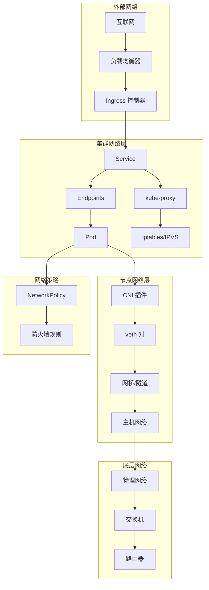

# Kubernetes 网络性能优化

## 网络优化概述

网络性能是 Kubernetes 集群中影响应用通信效率和用户体验的关键因素。合理的网络优化策略可以显著降低延迟、提升吞吐量、减少网络开销，为微服务架构提供高效的通信基础。

## 网络架构分析

### Kubernetes 网络模型



### 网络性能瓶颈点

**常见瓶颈分析**：
1. **CNI 插件开销**：不同 CNI 插件的性能差异
2. **Service 代理模式**：iptables vs IPVS 性能对比
3. **跨节点通信**：隧道封装和解封装开销
4. **DNS 解析延迟**：CoreDNS 配置和缓存策略
5. **负载均衡算法**：会话亲和性和负载分布

## CNI 网络优化

### 高性能 CNI 插件配置

**Calico 性能优化**：
```yaml
# Calico 高性能配置
apiVersion: projectcalico.org/v3
kind: FelixConfiguration
metadata:
  name: default
spec:
  # 启用 eBPF 数据平面
  bpfEnabled: true
  bpfLogLevel: "Off"
  
  # 路由模式优化
  routeRefreshInterval: 10s
  routeTableRange: [1, 250]
  
  # 性能调优参数
  reportingInterval: 60s
  reportingTTL: 3600s
  
  # 网络策略优化
  policySyncPathPrefix: "/var/lib/calico/policy"
  
  # 日志级别优化
  logSeverityScreen: Warning
  logSeverityFile: Error
  
  # 数据平面优化
  chainInsertMode: Insert
  defaultEndpointToHostAction: ACCEPT
  genericXDPEnabled: true
  
  # 连接追踪优化
  conntrackUpdateInterval: 60
  
  # MTU 优化
  vxlanMTU: 1440
  wireguardMTU: 1420

---
# Calico IP Pool 优化配置
apiVersion: projectcalico.org/v3
kind: IPPool
metadata:
  name: default-ipv4-ippool
spec:
  cidr: 192.168.0.0/16
  # 跨子网使用 VXLAN，同子网直接路由
  ipipMode: Never
  vxlanMode: CrossSubnet
  natOutgoing: true
  nodeSelector: all()
  blockSize: 26  # 优化地址分配粒度
  
---
# BGP 配置优化
apiVersion: projectcalico.org/v3
kind: BGPConfiguration
metadata:
  name: default
spec:
  logSeverityScreen: Info
  nodeToNodeMeshEnabled: true
  asNumber: 64512
```

**Cilium 优化配置**：
```yaml
# Cilium 高性能配置
apiVersion: v1
kind: ConfigMap
metadata:
  name: cilium-config
  namespace: kube-system
data:
  # 启用 eBPF 主机路由
  enable-host-routing: "true"
  
  # 禁用不必要的功能以提升性能
  disable-cnp-status-updates: "true"
  
  # 性能优化
  enable-bandwidth-manager: "true"
  enable-local-redirect-policy: "true"
  enable-session-affinity: "true"
  
  # 监控优化
  prometheus-serve-addr: ":9962"
  operator-prometheus-serve-addr: ":9963"
  
  # 安全优化（根据需求禁用）
  enable-runtime-security: "false"
  
  # 负载均衡优化
  enable-service-topology: "true"
  
  # 网络策略优化
  enable-policy: "default"
  policy-map-max-entries: "16384"
  
  # 连接追踪优化
  ct-global-max-entries-tcp: "524288"
  ct-global-max-entries-other: "262144"
  
  # MTU 配置
  tunnel-mtu: "1450"
  
  # CPU 优化
  limit-table-max: "65536"
  limit-table-min: "1024"

---
# Cilium 网络策略优化
apiVersion: cilium.io/v2
kind: CiliumNetworkPolicy
metadata:
  name: optimized-policy
spec:
  endpointSelector:
    matchLabels:
      app: web-app
  ingress:
  - fromEndpoints:
    - matchLabels:
        app: frontend
    toPorts:
    - ports:
      - port: "8080"
        protocol: TCP
  egress:
  - toEndpoints:
    - matchLabels:
        app: database
    toPorts:
    - ports:
      - port: "5432"
        protocol: TCP
```

### 网络模式选择

**直接路由 vs 隧道模式**：
```yaml
# Flannel 直接路由配置
apiVersion: v1
kind: ConfigMap
metadata:
  name: kube-flannel-cfg
  namespace: kube-system
data:
  cni-conf.json: |
    {
      "name": "cbr0",
      "cniVersion": "0.3.1",
      "plugins": [
        {
          "type": "flannel",
          "delegate": {
            "hairpinMode": true,
            "isDefaultGateway": true
          }
        },
        {
          "type": "portmap",
          "capabilities": {
            "portMappings": true
          }
        }
      ]
    }
  net-conf.json: |
    {
      "Network": "10.244.0.0/16",
      "Backend": {
        "Type": "host-gw"  # 直接路由模式，性能最佳
      }
    }

---
# Calico 直接路由配置
apiVersion: projectcalico.org/v3
kind: IPPool
metadata:
  name: direct-routing-pool
spec:
  cidr: 10.244.0.0/16
  ipipMode: Never      # 禁用 IP-in-IP 隧道
  vxlanMode: Never     # 禁用 VXLAN 隧道
  natOutgoing: true
  nodeSelector: all()
```

## Service 网络优化

### kube-proxy 模式优化

**IPVS 模式配置**：
```yaml
# kube-proxy IPVS 高性能配置
apiVersion: v1
kind: ConfigMap
metadata:
  name: kube-proxy
  namespace: kube-system
data:
  config.conf: |
    apiVersion: kubeproxy.config.k8s.io/v1alpha1
    kind: KubeProxyConfiguration
    # 使用 IPVS 模式
    mode: "ipvs"
    ipvs:
      algorithm: "rr"      # 轮询算法
      syncPeriod: 30s
      minSyncPeriod: 5s
      scheduler: "rr"      # 调度算法：rr, lc, dh, sh, sed, nq
      excludeCIDRs: []
      strictARP: false
      tcpTimeout: 0s
      tcpFinTimeout: 0s
      udpTimeout: 0s
    
    # iptables 模式配置（备用）
    iptables:
      masqueradeAll: false
      masqueradeBit: 14
      minSyncPeriod: 0s
      syncPeriod: 30s
    
    # 性能优化配置
    nodePortAddresses: []
    oomScoreAdj: -999
    portRange: ""
    udpIdleTimeout: 250ms
    
    # 连接追踪优化
    conntrack:
      maxPerCore: 32768
      min: 131072
      tcpEstablishedTimeout: 86400s
      tcpCloseWaitTimeout: 3600s

---
# IPVS 依赖模块加载
apiVersion: apps/v1
kind: DaemonSet
metadata:
  name: ipvs-module-loader
  namespace: kube-system
spec:
  selector:
    matchLabels:
      name: ipvs-module-loader
  template:
    metadata:
      labels:
        name: ipvs-module-loader
    spec:
      hostPID: true
      containers:
      - name: module-loader
        image: alpine:latest
        command:
        - /bin/sh
        - -c
        - |
          # 加载 IPVS 内核模块
          modprobe ip_vs
          modprobe ip_vs_rr
          modprobe ip_vs_wrr
          modprobe ip_vs_sh
          modprobe ip_vs_lc
          modprobe ip_vs_lblc
          modprobe ip_vs_lblcr
          modprobe ip_vs_dh
          modprobe ip_vs_sed
          modprobe ip_vs_nq
          modprobe nf_conntrack
          
          # 持续运行
          while true; do sleep 3600; done
        securityContext:
          privileged: true
        volumeMounts:
        - name: lib-modules
          mountPath: /lib/modules
          readOnly: true
      volumes:
      - name: lib-modules
        hostPath:
          path: /lib/modules
      tolerations:
      - operator: Exists
```

### 高性能 Service 配置

**优化的 Service 配置**：
```yaml
# 高性能 Web Service
apiVersion: v1
kind: Service
metadata:
  name: high-performance-web
  annotations:
    # AWS 负载均衡器优化
    service.beta.kubernetes.io/aws-load-balancer-type: "nlb"
    service.beta.kubernetes.io/aws-load-balancer-backend-protocol: "tcp"
    service.beta.kubernetes.io/aws-load-balancer-cross-zone-load-balancing-enabled: "true"
    service.beta.kubernetes.io/aws-load-balancer-proxy-protocol: "*"
    
    # 性能优化注解
    service.beta.kubernetes.io/aws-load-balancer-connection-idle-timeout: "60"
    service.beta.kubernetes.io/aws-load-balancer-healthcheck-interval: "10"
    service.beta.kubernetes.io/aws-load-balancer-healthcheck-timeout: "5"
    service.beta.kubernetes.io/aws-load-balancer-healthy-threshold: "2"
    service.beta.kubernetes.io/aws-load-balancer-unhealthy-threshold: "2"
spec:
  type: LoadBalancer
  # 会话亲和性优化
  sessionAffinity: ClientIP
  sessionAffinityConfig:
    clientIP:
      timeoutSeconds: 300
  # 外部流量策略：避免额外跳转
  externalTrafficPolicy: Local
  ports:
  - port: 80
    targetPort: 8080
    protocol: TCP
    name: http
  - port: 443
    targetPort: 8443
    protocol: TCP
    name: https
  selector:
    app: web-app

---
# 内部高性能 Service
apiVersion: v1
kind: Service
metadata:
  name: internal-api-service
  annotations:
    # 内部流量优化
    service.alpha.kubernetes.io/tolerate-unready-endpoints: "true"
spec:
  type: ClusterIP
  # 禁用会话亲和性以获得更好的负载分布
  sessionAffinity: None
  # 内部流量策略
  internalTrafficPolicy: Local
  ports:
  - port: 8080
    targetPort: 8080
    protocol: TCP
  selector:
    app: api-server

---
# 无头服务优化配置
apiVersion: v1
kind: Service
metadata:
  name: stateful-service
spec:
  clusterIP: None  # 无头服务
  # 发布未就绪的端点
  publishNotReadyAddresses: true
  ports:
  - port: 3306
    targetPort: 3306
    protocol: TCP
  selector:
    app: mysql-cluster
```

## DNS 优化

### CoreDNS 性能调优

**CoreDNS 优化配置**：
```yaml
# CoreDNS 高性能配置
apiVersion: v1
kind: ConfigMap
metadata:
  name: coredns
  namespace: kube-system
data:
  Corefile: |
    .:53 {
        errors
        health {
           lameduck 5s
        }
        ready
        kubernetes cluster.local in-addr.arpa ip6.arpa {
           pods insecure
           fallthrough in-addr.arpa ip6.arpa
           ttl 30
        }
        prometheus :9153
        # DNS 缓存优化
        cache 30 {
            success 8192 3600 300
            denial 2048 600 60
            prefetch 512 60s 10%
        }
        # 上游 DNS 优化
        forward . 8.8.8.8 8.8.4.4 1.1.1.1 {
           max_concurrent 1000
           except cluster.local
           policy sequential
           health_check 5s
        }
        # 循环检测
        loop
        # 重新加载配置
        reload
        # 负载均衡
        loadbalance
        # 日志优化
        log . {
            class error
        }
    }

---
# CoreDNS 高可用部署
apiVersion: apps/v1
kind: Deployment
metadata:
  name: coredns
  namespace: kube-system
spec:
  replicas: 3  # 增加副本数
  strategy:
    type: RollingUpdate
    rollingUpdate:
      maxUnavailable: 1
      maxSurge: 25%
  selector:
    matchLabels:
      k8s-app: kube-dns
  template:
    metadata:
      labels:
        k8s-app: kube-dns
    spec:
      # 调度优化
      affinity:
        podAntiAffinity:
          preferredDuringSchedulingIgnoredDuringExecution:
          - weight: 100
            podAffinityTerm:
              labelSelector:
                matchExpressions:
                - key: k8s-app
                  operator: In
                  values: ["kube-dns"]
              topologyKey: kubernetes.io/hostname
      containers:
      - name: coredns
        image: coredns/coredns:1.10.1
        imagePullPolicy: IfNotPresent
        resources:
          limits:
            memory: 512Mi
            cpu: 500m
          requests:
            cpu: 100m
            memory: 128Mi
        args: [ "-conf", "/etc/coredns/Corefile" ]
        volumeMounts:
        - name: config-volume
          mountPath: /etc/coredns
          readOnly: true
        ports:
        - containerPort: 53
          name: dns
          protocol: UDP
        - containerPort: 53
          name: dns-tcp
          protocol: TCP
        - containerPort: 9153
          name: metrics
          protocol: TCP
        # 健康检查优化
        livenessProbe:
          httpGet:
            path: /health
            port: 8080
            scheme: HTTP
          initialDelaySeconds: 60
          timeoutSeconds: 5
          successThreshold: 1
          failureThreshold: 5
        readinessProbe:
          httpGet:
            path: /ready
            port: 8181
            scheme: HTTP
          initialDelaySeconds: 10
          timeoutSeconds: 5
          successThreshold: 1
          failureThreshold: 3
        securityContext:
          allowPrivilegeEscalation: false
          capabilities:
            add:
            - NET_BIND_SERVICE
            drop:
            - all
          readOnlyRootFilesystem: true
      volumes:
      - name: config-volume
        configMap:
          name: coredns
          items:
          - key: Corefile
            path: Corefile
      dnsPolicy: Default
      tolerations:
      - key: CriticalAddonsOnly
        operator: Exists
      - effect: NoSchedule
        key: node-role.kubernetes.io/master
```

### DNS 缓存优化

**NodeLocal DNSCache 配置**：
```yaml
# NodeLocal DNSCache 部署
apiVersion: apps/v1
kind: DaemonSet
metadata:
  name: node-local-dns
  namespace: kube-system
spec:
  updateStrategy:
    rollingUpdate:
      maxUnavailable: 10%
  selector:
    matchLabels:
      k8s-app: node-local-dns
  template:
    metadata:
      labels:
        k8s-app: node-local-dns
    spec:
      hostNetwork: true
      dnsPolicy: Default
      tolerations:
      - operator: Exists
        effect: NoExecute
      - operator: Exists
        effect: NoSchedule
      containers:
      - name: node-cache
        image: k8s.gcr.io/dns/k8s-dns-node-cache:1.22.20
        resources:
          requests:
            cpu: 25m
            memory: 5Mi
          limits:
            cpu: 100m
            memory: 100Mi
        args:
        - -localip
        - 169.254.20.10,10.0.0.10
        - -conf
        - /etc/Corefile
        - -upstreamsvc
        - kube-dns-upstream
        securityContext:
          privileged: true
        ports:
        - containerPort: 53
          name: dns
          protocol: UDP
        - containerPort: 53
          name: dns-tcp
          protocol: TCP
        - containerPort: 9253
          name: metrics
          protocol: TCP
        livenessProbe:
          httpGet:
            host: 169.254.20.10
            path: /health
            port: 8080
          initialDelaySeconds: 60
          timeoutSeconds: 5
        volumeMounts:
        - mountPath: /run/xtables.lock
          name: xtables-lock
          readOnly: false
        - name: config-volume
          mountPath: /etc/coredns
        - name: kube-dns-config
          mountPath: /etc/kube-dns
      volumes:
      - name: xtables-lock
        hostPath:
          path: /run/xtables.lock
          type: FileOrCreate
      - name: kube-dns-config
        configMap:
          name: kube-dns
          optional: true
      - name: config-volume
        configMap:
          name: node-local-dns
          items:
          - key: Corefile
            path: Corefile.base

---
# NodeLocal DNS 配置
apiVersion: v1
kind: ConfigMap
metadata:
  name: node-local-dns
  namespace: kube-system
data:
  Corefile: |
    cluster.local:53 {
        errors
        cache {
            success 9984 30
            denial 9984 5
        }
        reload
        loop
        bind 169.254.20.10 10.0.0.10
        forward . __PILLAR__CLUSTER__DNS__ {
            force_tcp
        }
        prometheus :9253
        health 169.254.20.10:8080
        }
    in-addr.arpa:53 {
        errors
        cache 30
        reload
        loop
        bind 169.254.20.10 10.0.0.10
        forward . __PILLAR__CLUSTER__DNS__ {
            force_tcp
        }
        prometheus :9253
        }
    ip6.arpa:53 {
        errors
        cache 30
        reload
        loop
        bind 169.254.20.10 10.0.0.10
        forward . __PILLAR__CLUSTER__DNS__ {
            force_tcp
        }
        prometheus :9253
        }
    .:53 {
        errors
        cache 30
        reload
        loop
        bind 169.254.20.10 10.0.0.10
        forward . __PILLAR__UPSTREAM__SERVERS__ {
            force_tcp
        }
        prometheus :9253
        }
```

## Ingress 网络优化

### NGINX Ingress 优化

**高性能 NGINX Ingress 配置**：
```yaml
# NGINX Ingress 控制器优化配置
apiVersion: v1
kind: ConfigMap
metadata:
  name: nginx-configuration
  namespace: ingress-nginx
data:
  # 性能优化配置
  worker-processes: "auto"
  worker-connections: "65536"
  worker-rlimit-nofile: "131072"
  
  # 连接优化
  keep-alive: "32"
  keep-alive-requests: "10000"
  upstream-keepalive-connections: "100"
  upstream-keepalive-timeout: "60"
  
  # 缓冲区优化
  client-body-buffer-size: "128k"
  client-header-buffer-size: "4k"
  large-client-header-buffers: "4 16k"
  proxy-buffer-size: "4k"
  proxy-buffers: "8 4k"
  proxy-busy-buffers-size: "8k"
  
  # 超时优化
  proxy-connect-timeout: "5"
  proxy-send-timeout: "60"
  proxy-read-timeout: "60"
  client-header-timeout: "60"
  client-body-timeout: "60"
  
  # 压缩优化
  enable-gzip: "true"
  gzip-level: "6"
  gzip-min-length: "1024"
  gzip-types: "text/plain text/css application/json application/javascript text/xml application/xml application/xml+rss text/javascript application/octet-stream"
  
  # SSL 优化
  ssl-protocols: "TLSv1.2 TLSv1.3"
  ssl-ciphers: "ECDHE-ECDSA-AES128-GCM-SHA256:ECDHE-RSA-AES128-GCM-SHA256:ECDHE-ECDSA-AES256-GCM-SHA384:ECDHE-RSA-AES256-GCM-SHA384"
  ssl-session-cache: "shared:SSL:10m"
  ssl-session-timeout: "10m"
  ssl-session-tickets: "false"
  
  # 日志优化
  log-format-escape-json: "true"
  access-log-path: "/var/log/nginx/access.log"
  error-log-path: "/var/log/nginx/error.log"
  
  # 限流配置
  rate-limit-rpm: "1000"
  rate-limit-connections: "20"

---
# NGINX Ingress 部署优化
apiVersion: apps/v1
kind: Deployment
metadata:
  name: nginx-ingress-controller
  namespace: ingress-nginx
spec:
  replicas: 3
  strategy:
    type: RollingUpdate
    rollingUpdate:
      maxUnavailable: 1
      maxSurge: 1
  selector:
    matchLabels:
      app.kubernetes.io/name: ingress-nginx
  template:
    metadata:
      labels:
        app.kubernetes.io/name: ingress-nginx
    spec:
      # 调度优化
      affinity:
        podAntiAffinity:
          requiredDuringSchedulingIgnoredDuringExecution:
          - labelSelector:
              matchExpressions:
              - key: app.kubernetes.io/name
                operator: In
                values: [ingress-nginx]
            topologyKey: "kubernetes.io/hostname"
      containers:
      - name: controller
        image: k8s.gcr.io/ingress-nginx/controller:v1.5.1
        lifecycle:
          preStop:
            exec:
              command:
              - /wait-shutdown
        args:
        - /nginx-ingress-controller
        - --configmap=$(POD_NAMESPACE)/nginx-configuration
        - --publish-service=$(POD_NAMESPACE)/ingress-nginx-controller
        - --annotations-prefix=nginx.ingress.kubernetes.io
        - --default-backend-service=$(POD_NAMESPACE)/default-http-backend
        - --enable-ssl-passthrough
        - --enable-ssl-chain-completion=false
        - --default-ssl-certificate=$(POD_NAMESPACE)/default-server-secret
        securityContext:
          capabilities:
            drop:
            - ALL
            add:
            - NET_BIND_SERVICE
          runAsUser: 101
        env:
        - name: POD_NAME
          valueFrom:
            fieldRef:
              fieldPath: metadata.name
        - name: POD_NAMESPACE
          valueFrom:
            fieldRef:
              fieldPath: metadata.namespace
        - name: LD_PRELOAD
          value: /usr/local/lib/libmimalloc.so
        ports:
        - name: http
          containerPort: 80
          protocol: TCP
        - name: https
          containerPort: 443
          protocol: TCP
        - name: webhook
          containerPort: 8443
          protocol: TCP
        livenessProbe:
          httpGet:
            path: /healthz
            port: 10254
            scheme: HTTP
          initialDelaySeconds: 10
          periodSeconds: 10
          timeoutSeconds: 1
          successThreshold: 1
          failureThreshold: 5
        readinessProbe:
          httpGet:
            path: /healthz
            port: 10254
            scheme: HTTP
          initialDelaySeconds: 10
          periodSeconds: 1
          timeoutSeconds: 1
          successThreshold: 1
          failureThreshold: 3
        resources:
          requests:
            cpu: 500m
            memory: 512Mi
          limits:
            cpu: 2000m
            memory: 2Gi
```

### Ingress 路由优化

**高性能 Ingress 路由配置**：
```yaml
# 优化的 Ingress 路由
apiVersion: networking.k8s.io/v1
kind: Ingress
metadata:
  name: high-performance-ingress
  annotations:
    # NGINX 特定优化
    nginx.ingress.kubernetes.io/rewrite-target: /
    nginx.ingress.kubernetes.io/ssl-redirect: "true"
    nginx.ingress.kubernetes.io/force-ssl-redirect: "true"
    
    # 连接优化
    nginx.ingress.kubernetes.io/upstream-keepalive-connections: "100"
    nginx.ingress.kubernetes.io/upstream-keepalive-timeout: "60"
    
    # 缓存优化
    nginx.ingress.kubernetes.io/proxy-cache-valid: "200 302 10m"
    nginx.ingress.kubernetes.io/proxy-cache-valid: "404 1m"
    
    # 限流保护
    nginx.ingress.kubernetes.io/rate-limit-rpm: "1000"
    nginx.ingress.kubernetes.io/rate-limit-connections: "20"
    
    # 压缩优化
    nginx.ingress.kubernetes.io/enable-gzip: "true"
    nginx.ingress.kubernetes.io/gzip-level: "6"
    
    # SSL 优化
    nginx.ingress.kubernetes.io/ssl-ciphers: "ECDHE-ECDSA-AES128-GCM-SHA256,ECDHE-RSA-AES128-GCM-SHA256"
    nginx.ingress.kubernetes.io/ssl-protocols: "TLSv1.2 TLSv1.3"
    
    # 后端优化
    nginx.ingress.kubernetes.io/proxy-body-size: "10m"
    nginx.ingress.kubernetes.io/proxy-connect-timeout: "5"
    nginx.ingress.kubernetes.io/proxy-send-timeout: "60"
    nginx.ingress.kubernetes.io/proxy-read-timeout: "60"
    
    # 负载均衡
    nginx.ingress.kubernetes.io/load-balance: "ewma"
    nginx.ingress.kubernetes.io/upstream-hash-by: "$request_uri"
spec:
  ingressClassName: nginx
  tls:
  - hosts:
    - api.example.com
    secretName: api-tls-secret
  rules:
  - host: api.example.com
    http:
      paths:
      - path: /api/v1
        pathType: Prefix
        backend:
          service:
            name: api-service
            port:
              number: 8080
      - path: /static
        pathType: Prefix
        backend:
          service:
            name: static-service
            port:
              number: 80
```

## 网络监控和性能分析

### 网络性能指标

**Prometheus 网络监控规则**：
```yaml
# 网络性能监控规则
apiVersion: v1
kind: ConfigMap
metadata:
  name: network-monitoring-rules
data:
  network-rules.yml: |
    groups:
    - name: network-performance
      rules:
      # 网络接口流量
      - record: node:network_receive_bytes:rate5m
        expr: |
          rate(node_network_receive_bytes_total{device!="lo"}[5m])
      
      - record: node:network_transmit_bytes:rate5m
        expr: |
          rate(node_network_transmit_bytes_total{device!="lo"}[5m])
      
      # 网络错误率
      - record: node:network_error_rate:rate5m
        expr: |
          (
            rate(node_network_receive_errs_total[5m]) +
            rate(node_network_transmit_errs_total[5m])
          ) / (
            rate(node_network_receive_packets_total[5m]) +
            rate(node_network_transmit_packets_total[5m])
          ) * 100
      
      # 网络连接数
      - record: node:network_connections:count
        expr: |
          node_netstat_Tcp_CurrEstab
      
      # Pod 网络流量
      - record: pod:network_receive_bytes:rate5m
        expr: |
          rate(container_network_receive_bytes_total{container!="POD"}[5m])
      
      - record: pod:network_transmit_bytes:rate5m
        expr: |
          rate(container_network_transmit_bytes_total{container!="POD"}[5m])
      
      # DNS 查询延迟
      - record: coredns:dns_request_duration:p95
        expr: |
          histogram_quantile(0.95, 
            rate(coredns_dns_request_duration_seconds_bucket[5m])
          )
      
      # Ingress 响应时间
      - record: ingress:request_duration:p95
        expr: |
          histogram_quantile(0.95,
            rate(nginx_ingress_controller_request_duration_seconds_bucket[5m])
          )
```

**网络性能告警**：
```yaml
# 网络性能告警规则
apiVersion: v1
kind: ConfigMap
metadata:
  name: network-performance-alerts
data:
  network-alerts.yml: |
    groups:
    - name: network-performance-alerts
      rules:
      # 网络带宽使用率过高
      - alert: HighNetworkBandwidth
        expr: |
          (
            node:network_receive_bytes:rate5m +
            node:network_transmit_bytes:rate5m
          ) / (100 * 1024 * 1024) > 80  # 假设 100MB/s 带宽
        for: 5m
        labels:
          severity: warning
          component: network
        annotations:
          summary: "节点 {{ $labels.instance }} 网络带宽使用率过高"
          description: "网络流量: {{ $value }} MB/s，超过 80MB/s 阈值"
      
      # 网络错误率过高
      - alert: HighNetworkErrorRate
        expr: |
          node:network_error_rate:rate5m > 1
        for: 2m
        labels:
          severity: critical
          component: network
        annotations:
          summary: "节点 {{ $labels.instance }} 网络错误率过高"
          description: "网络错误率: {{ $value }}%，超过 1% 阈值"
      
      # DNS 解析延迟过高
      - alert: HighDNSLatency
        expr: |
          coredns:dns_request_duration:p95 > 0.1
        for: 2m
        labels:
          severity: warning
          component: dns
        annotations:
          summary: "DNS 解析延迟过高"
          description: "95% DNS 请求延迟: {{ $value }}s，超过 100ms 阈值"
      
      # Ingress 响应时间过长
      - alert: HighIngressLatency
        expr: |
          ingress:request_duration:p95 > 1.0
        for: 5m
        labels:
          severity: warning
          component: ingress
        annotations:
          summary: "Ingress 响应时间过长"
          description: "95% 请求响应时间: {{ $value }}s，超过 1 秒阈值"
      
      # TCP 连接数过多
      - alert: TooManyTCPConnections
        expr: |
          node:network_connections:count > 50000
        for: 5m
        labels:
          severity: warning
          component: network
        annotations:
          summary: "节点 {{ $labels.instance }} TCP 连接数过多"
          description: "当前连接数: {{ $value }}，超过 50000 阈值"
```

### 网络性能测试

**网络性能测试工具**：
```yaml
# iperf3 网络性能测试
apiVersion: v1
kind: Pod
metadata:
  name: iperf3-server
  labels:
    app: iperf3-server
spec:
  containers:
  - name: iperf3-server
    image: networkstatic/iperf3
    args: ['-s']
    ports:
    - containerPort: 5201
    resources:
      requests:
        cpu: 500m
        memory: 128Mi
      limits:
        cpu: 1000m
        memory: 256Mi

---
apiVersion: v1
kind: Service
metadata:
  name: iperf3-server
spec:
  selector:
    app: iperf3-server
  ports:
  - port: 5201
    targetPort: 5201
  type: ClusterIP

---
# 网络性能测试客户端
apiVersion: batch/v1
kind: Job
metadata:
  name: network-performance-test
spec:
  template:
    spec:
      containers:
      - name: iperf3-client
        image: networkstatic/iperf3
        command:
        - /bin/sh
        - -c
        - |
          echo "开始网络性能测试..."
          
          # TCP 吞吐量测试
          echo "=== TCP 吞吐量测试 ==="
          iperf3 -c iperf3-server -t 60 -P 4
          
          # UDP 吞吐量测试
          echo "=== UDP 吞吐量测试 ==="
          iperf3 -c iperf3-server -u -b 1G -t 60
          
          # 延迟测试
          echo "=== 延迟测试 ==="
          ping -c 100 iperf3-server
          
          echo "网络性能测试完成"
        resources:
          requests:
            cpu: 500m
            memory: 128Mi
          limits:
            cpu: 1000m
            memory: 256Mi
      restartPolicy: Never
```

通过系统性的网络优化策略，可以显著提升 Kubernetes 集群的网络性能，降低延迟，提高吞吐量，为微服务应用提供高效的通信基础。建议根据具体的网络环境和应用需求选择合适的优化方案。
