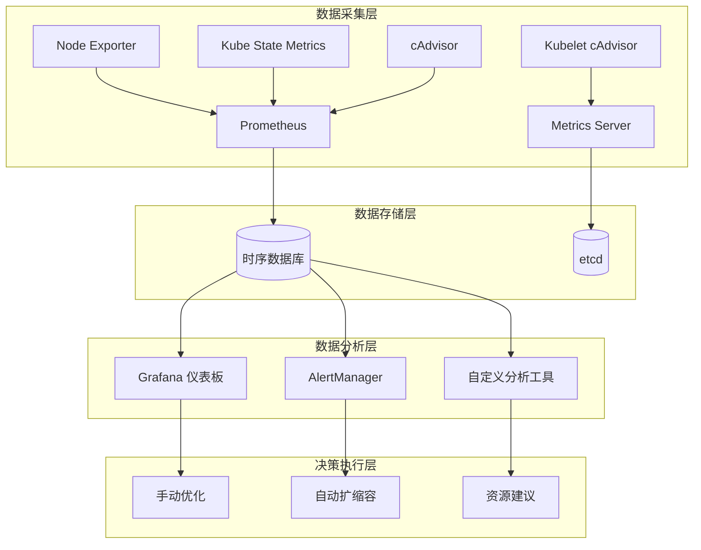

# Kubernetes 资源使用分析

## 资源分析概述

资源使用分析是 Kubernetes 性能优化的基础，通过深入分析 CPU、内存、存储和网络资源的使用情况，识别资源瓶颈、优化资源配置、提高集群利用率。

## 资源监控体系

### 监控架构



### 核心监控组件

**Metrics Server 配置**：
```yaml
# Metrics Server 高可用配置
apiVersion: apps/v1
kind: Deployment
metadata:
  name: metrics-server
  namespace: kube-system
spec:
  replicas: 2
  selector:
    matchLabels:
      k8s-app: metrics-server
  template:
    metadata:
      labels:
        k8s-app: metrics-server
    spec:
      containers:
      - name: metrics-server
        image: k8s.gcr.io/metrics-server/metrics-server:v0.6.1
        args:
        - --cert-dir=/tmp
        - --secure-port=4443
        - --kubelet-preferred-address-types=InternalIP,ExternalIP,Hostname
        - --kubelet-use-node-status-port
        - --metric-resolution=15s
        - --kubelet-insecure-tls
        resources:
          requests:
            cpu: 100m
            memory: 200Mi
          limits:
            cpu: 500m
            memory: 500Mi
        ports:
        - containerPort: 4443
          name: https
          protocol: TCP
        readinessProbe:
          httpGet:
            path: /readyz
            port: https
            scheme: HTTPS
          periodSeconds: 10
        livenessProbe:
          httpGet:
            path: /livez
            port: https
            scheme: HTTPS
          periodSeconds: 10
        securityContext:
          readOnlyRootFilesystem: true
          runAsNonRoot: true
          runAsUser: 1000
```

**Prometheus 监控配置**：
```yaml
# Prometheus 资源监控规则
apiVersion: v1
kind: ConfigMap
metadata:
  name: prometheus-resource-rules
data:
  resource-rules.yml: |
    groups:
    - name: resource-utilization
      rules:
      # 节点 CPU 使用率
      - record: node:cpu_utilization:rate5m
        expr: |
          (
            1 - avg by (instance) (
              rate(node_cpu_seconds_total{mode="idle"}[5m])
            )
          ) * 100
      
      # 节点内存使用率
      - record: node:memory_utilization:ratio
        expr: |
          (
            1 - (
              node_memory_MemAvailable_bytes /
              node_memory_MemTotal_bytes
            )
          ) * 100
      
      # Pod CPU 使用率
      - record: pod:cpu_utilization:rate5m
        expr: |
          rate(container_cpu_usage_seconds_total{container!="POD",container!=""}[5m]) * 100
      
      # Pod 内存使用率
      - record: pod:memory_utilization:ratio
        expr: |
          container_memory_working_set_bytes{container!="POD",container!=""} /
          on(pod, namespace) group_left()
          kube_pod_container_resource_limits{resource="memory"} * 100
      
      # 集群资源分配率
      - record: cluster:resource_allocation:ratio
        expr: |
          sum(kube_pod_container_resource_requests{resource="cpu"}) /
          sum(kube_node_status_allocatable{resource="cpu"}) * 100
```

## CPU 资源分析

### CPU 使用模式分析

**CPU 使用率分析查询**：
```promql
# 节点 CPU 使用率趋势
node:cpu_utilization:rate5m

# 按模式分析 CPU 使用
rate(node_cpu_seconds_total[5m]) * 100

# 高 CPU 使用的 Pod 识别
topk(10, pod:cpu_utilization:rate5m)

# CPU 限流分析
rate(container_cpu_cfs_throttled_seconds_total[5m])

# CPU 上下文切换分析
rate(node_context_switches_total[5m])
```

**CPU 性能分析脚本**：
```bash
#!/bin/bash
# CPU 资源分析脚本

echo "=== CPU 资源使用情况分析 ==="

# 获取节点 CPU 使用情况
echo "节点 CPU 使用率:"
kubectl top nodes --sort-by=cpu

# 获取高 CPU 使用的 Pod
echo -e "\n高 CPU 使用 Pod (Top 10):"
kubectl top pods --all-namespaces --sort-by=cpu | head -11

# CPU 请求和限制分析
echo -e "\nCPU 资源配置分析:"
kubectl get pods --all-namespaces -o custom-columns="NAMESPACE:.metadata.namespace,NAME:.metadata.name,CPU_REQ:.spec.containers[*].resources.requests.cpu,CPU_LIMIT:.spec.containers[*].resources.limits.cpu" | grep -v "<none>"

# CPU 限流情况检查
echo -e "\nCPU 限流情况检查:"
for pod in $(kubectl get pods --all-namespaces -o jsonpath='{range .items[*]}{.metadata.namespace}{" "}{.metadata.name}{"\n"}{end}'); do
  namespace=$(echo $pod | cut -d' ' -f1)
  name=$(echo $pod | cut -d' ' -f2)
  throttled=$(kubectl exec -n $namespace $name -c $(kubectl get pod -n $namespace $name -o jsonpath='{.spec.containers[0].name}') -- cat /sys/fs/cgroup/cpu/cpu.stat 2>/dev/null | grep throttled_time | awk '{print $2}')
  if [[ $throttled -gt 0 ]]; then
    echo "  $namespace/$name: CPU 限流时间 ${throttled}ns"
  fi
done 2>/dev/null

echo -e "\n=== CPU 优化建议 ==="
echo "1. 检查 CPU 使用率超过 80% 的节点和 Pod"
echo "2. 调整过度分配或不足的 CPU 请求和限制"
echo "3. 优化高 CPU 使用的应用代码"
echo "4. 考虑使用 VPA 自动调整 CPU 配置"
```

### CPU 性能优化配置

**CPU 亲和性优化**：
```yaml
# CPU 密集型应用配置
apiVersion: apps/v1
kind: Deployment
metadata:
  name: cpu-intensive-app
spec:
  replicas: 3
  selector:
    matchLabels:
      app: cpu-intensive-app
  template:
    metadata:
      labels:
        app: cpu-intensive-app
    spec:
      affinity:
        nodeAffinity:
          requiredDuringSchedulingIgnoredDuringExecution:
            nodeSelectorTerms:
            - matchExpressions:
              - key: node-type
                operator: In
                values: ["compute-optimized"]
      containers:
      - name: app
        image: cpu-app:latest
        resources:
          requests:
            cpu: 2000m      # 2 个 CPU 核心
            memory: 4Gi
          limits:
            cpu: 4000m      # 最大 4 个 CPU 核心
            memory: 8Gi
        env:
        - name: OMP_NUM_THREADS
          value: "4"        # 优化多线程应用
        - name: GOMAXPROCS
          valueFrom:
            resourceFieldRef:
              resource: limits.cpu
```

## 内存资源分析

### 内存使用模式分析

**内存分析 Prometheus 查询**：
```promql
# 节点内存使用率
node:memory_utilization:ratio

# Pod 内存使用情况
pod:memory_utilization:ratio

# 内存泄漏检测
increase(container_memory_working_set_bytes[1h])

# OOM 事件统计
increase(kube_pod_container_status_restarts_total[1h])

# 内存缓存使用
node_memory_Cached_bytes + node_memory_Buffers_bytes
```

**内存分析脚本**：
```bash
#!/bin/bash
# 内存资源分析脚本

echo "=== 内存资源使用情况分析 ==="

# 节点内存使用情况
echo "节点内存使用率:"
kubectl top nodes --sort-by=memory

# 高内存使用的 Pod
echo -e "\n高内存使用 Pod (Top 10):"
kubectl top pods --all-namespaces --sort-by=memory | head -11

# 内存 OOM 事件检查
echo -e "\n最近的 OOM 事件:"
kubectl get events --all-namespaces --field-selector reason=OOMKilling --sort-by='.lastTimestamp' | tail -10

# Pod 内存配置分析
echo -e "\n内存资源配置分析:"
kubectl get pods --all-namespaces -o custom-columns="NAMESPACE:.metadata.namespace,NAME:.metadata.name,MEM_REQ:.spec.containers[*].resources.requests.memory,MEM_LIMIT:.spec.containers[*].resources.limits.memory" | grep -v "<none>"

# 检查内存使用趋势
echo -e "\n内存使用趋势分析:"
kubectl get --all-namespaces pods -o json | jq -r '.items[] | select(.status.phase=="Running") | "\(.metadata.namespace)/\(.metadata.name) \(.status.containerStatuses[0].restartCount)"' | awk '$2>0 {print $1 " 重启次数: " $2}'

echo -e "\n=== 内存优化建议 ==="
echo "1. 检查内存使用率超过 85% 的节点和 Pod"
echo "2. 调整内存请求和限制配置"
echo "3. 排查内存泄漏问题"
echo "4. 优化应用内存使用模式"
```

### 内存优化配置

**JVM 内存优化**：
```yaml
# Java 应用内存优化
apiVersion: apps/v1
kind: Deployment
metadata:
  name: java-memory-optimized
spec:
  replicas: 3
  selector:
    matchLabels:
      app: java-app
  template:
    metadata:
      labels:
        app: java-app
    spec:
      containers:
      - name: app
        image: openjdk:17-jre
        env:
        - name: JAVA_OPTS
          value: >-
            -Xms1g
            -Xmx2g
            -XX:+UseG1GC
            -XX:MaxGCPauseMillis=200
            -XX:+UseStringDeduplication
            -XX:MaxMetaspaceSize=256m
            -XX:CompressedClassSpaceSize=64m
            -XX:+PrintGCDetails
            -XX:+PrintGCTimeStamps
        - name: JVM_MEMORY_OPTS
          value: "-XX:InitialRAMPercentage=25 -XX:MaxRAMPercentage=75"
        resources:
          requests:
            cpu: 500m
            memory: 1.5Gi
          limits:
            cpu: 2000m
            memory: 3Gi
        livenessProbe:
          httpGet:
            path: /actuator/health
            port: 8080
          initialDelaySeconds: 90
          periodSeconds: 30
        readinessProbe:
          httpGet:
            path: /actuator/health
            port: 8080
          initialDelaySeconds: 30
          periodSeconds: 10
```

## 存储资源分析

### 存储 I/O 分析

**存储性能监控**：
```yaml
# 存储性能监控配置
apiVersion: v1
kind: ConfigMap
metadata:
  name: storage-monitoring
data:
  storage-rules.yml: |
    groups:
    - name: storage-performance
      rules:
      # 磁盘 I/O 使用率
      - record: node:disk_io_utilization:rate5m
        expr: |
          rate(node_disk_io_time_seconds_total[5m]) * 100
      
      # 磁盘读写速率
      - record: node:disk_read_bytes:rate5m
        expr: |
          rate(node_disk_read_bytes_total[5m])
      
      - record: node:disk_write_bytes:rate5m
        expr: |
          rate(node_disk_written_bytes_total[5m])
      
      # PV 使用率
      - record: pv:usage_ratio
        expr: |
          (
            kubelet_volume_stats_used_bytes /
            kubelet_volume_stats_capacity_bytes
          ) * 100
      
      # 存储延迟分析
      - record: node:disk_read_latency:rate5m
        expr: |
          rate(node_disk_read_time_seconds_total[5m]) /
          rate(node_disk_reads_completed_total[5m])
```

**存储分析脚本**：
```bash
#!/bin/bash
# 存储资源分析脚本

echo "=== 存储资源使用情况分析 ==="

# PV 使用情况
echo "持久卷使用情况:"
kubectl get pv -o custom-columns="NAME:.metadata.name,CAPACITY:.spec.capacity.storage,ACCESS:.spec.accessModes,STATUS:.status.phase,CLAIM:.spec.claimRef.name"

# PVC 使用情况
echo -e "\nPVC 使用情况:"
kubectl get pvc --all-namespaces -o custom-columns="NAMESPACE:.metadata.namespace,NAME:.metadata.name,STATUS:.status.phase,VOLUME:.spec.volumeName,CAPACITY:.status.capacity.storage"

# 检查存储类配置
echo -e "\n存储类配置:"
kubectl get storageclass -o custom-columns="NAME:.metadata.name,PROVISIONER:.provisioner,RECLAIM:.reclaimPolicy,BINDING:.volumeBindingMode"

# 查找未使用的 PV
echo -e "\n未使用的持久卷:"
kubectl get pv -o json | jq -r '.items[] | select(.status.phase=="Available") | .metadata.name'

# 存储使用率告警
echo -e "\n存储使用率检查:"
kubectl get pods --all-namespaces -o json | jq -r '
  .items[] | 
  select(.spec.volumes[]?.persistentVolumeClaim) | 
  "\(.metadata.namespace)/\(.metadata.name) 使用 PVC: \(.spec.volumes[] | select(.persistentVolumeClaim) | .persistentVolumeClaim.claimName)"
'

echo -e "\n=== 存储优化建议 ==="
echo "1. 清理未使用的 PV 和 PVC"
echo "2. 使用适当的存储类型和性能级别"
echo "3. 定期备份重要数据"
echo "4. 监控存储使用率和 I/O 性能"
```

### 存储性能优化

**高性能存储配置**：
```yaml
# 高性能存储类配置
apiVersion: storage.k8s.io/v1
kind: StorageClass
metadata:
  name: high-performance-ssd
  annotations:
    storageclass.kubernetes.io/is-default-class: "false"
provisioner: ebs.csi.aws.com
parameters:
  type: gp3
  iops: "16000"
  throughput: "1000"
  encrypted: "true"
allowVolumeExpansion: true
volumeBindingMode: WaitForFirstConsumer
reclaimPolicy: Delete

---
# 数据库存储优化配置
apiVersion: apps/v1
kind: StatefulSet
metadata:
  name: database-optimized
spec:
  serviceName: database
  replicas: 3
  selector:
    matchLabels:
      app: database
  template:
    metadata:
      labels:
        app: database
    spec:
      containers:
      - name: database
        image: postgres:13
        env:
        - name: POSTGRES_DB
          value: "testdb"
        - name: POSTGRES_USER
          value: "postgres"
        - name: POSTGRES_PASSWORD
          value: "password"
        resources:
          requests:
            cpu: 2000m
            memory: 4Gi
          limits:
            cpu: 4000m
            memory: 8Gi
        volumeMounts:
        - name: data
          mountPath: /var/lib/postgresql/data
        - name: config
          mountPath: /etc/postgresql/postgresql.conf
          subPath: postgresql.conf
      volumes:
      - name: config
        configMap:
          name: postgres-config
  volumeClaimTemplates:
  - metadata:
      name: data
    spec:
      accessModes: ["ReadWriteOnce"]
      storageClassName: high-performance-ssd
      resources:
        requests:
          storage: 500Gi

---
# PostgreSQL 性能优化配置
apiVersion: v1
kind: ConfigMap
metadata:
  name: postgres-config
data:
  postgresql.conf: |
    # 内存配置
    shared_buffers = 2GB
    effective_cache_size = 6GB
    work_mem = 64MB
    maintenance_work_mem = 512MB
    
    # 检查点配置
    checkpoint_completion_target = 0.9
    checkpoint_timeout = 15min
    
    # 写入优化
    synchronous_commit = off
    wal_buffers = 64MB
    wal_writer_delay = 200ms
    
    # 连接配置
    max_connections = 200
    shared_preload_libraries = 'pg_stat_statements'
```

## 网络资源分析

### 网络性能监控

**网络监控指标**：
```yaml
# 网络性能监控规则
apiVersion: v1
kind: ConfigMap
metadata:
  name: network-monitoring
data:
  network-rules.yml: |
    groups:
    - name: network-performance
      rules:
      # 网络接口流量
      - record: node:network_receive_bytes:rate5m
        expr: |
          rate(node_network_receive_bytes_total{device!="lo"}[5m])
      
      - record: node:network_transmit_bytes:rate5m
        expr: |
          rate(node_network_transmit_bytes_total{device!="lo"}[5m])
      
      # 网络错误率
      - record: node:network_error_rate:rate5m
        expr: |
          rate(node_network_receive_errs_total[5m]) +
          rate(node_network_transmit_errs_total[5m])
      
      # 网络连接数
      - record: node:network_connections:count
        expr: |
          node_netstat_Tcp_CurrEstab
      
      # Pod 网络流量
      - record: pod:network_receive_bytes:rate5m
        expr: |
          rate(container_network_receive_bytes_total{container!="POD"}[5m])
      
      - record: pod:network_transmit_bytes:rate5m
        expr: |
          rate(container_network_transmit_bytes_total{container!="POD"}[5m])
```

### 网络性能优化

**CNI 网络优化**：
```yaml
# Calico 网络性能优化配置
apiVersion: projectcalico.org/v3
kind: FelixConfiguration
metadata:
  name: default
spec:
  # 启用 eBPF 数据平面
  bpfEnabled: true
  bpfLogLevel: "Off"
  
  # 路由优化
  routeRefreshInterval: 10s
  routeTableRange: [1, 250]
  
  # 性能调优参数
  reportingInterval: 60s
  reportingTTL: 3600s
  
  # 网络策略优化
  policySyncPathPrefix: "/var/lib/calico/policy"
  
  # 日志优化
  logSeverityScreen: Warning
  logSeverityFile: Error
  
  # 数据平面优化
  chainInsertMode: Insert
  defaultEndpointToHostAction: ACCEPT
  genericXDPEnabled: true

---
# IP Pool 优化配置
apiVersion: projectcalico.org/v3
kind: IPPool
metadata:
  name: default-ipv4-ippool
spec:
  cidr: 192.168.0.0/16
  # 跨子网使用 VXLAN，同子网直接路由
  ipipMode: Never
  vxlanMode: CrossSubnet
  natOutgoing: true
  nodeSelector: all()
  blockSize: 26  # 优化地址分配
```

## 资源使用报告和建议

### 自动化资源分析

**资源使用报告生成器**：
```bash
#!/bin/bash
# 资源使用情况综合报告生成器

REPORT_DIR="./resource-analysis-$(date +%Y%m%d-%H%M%S)"
mkdir -p $REPORT_DIR

echo "正在生成资源使用情况报告..."

# 集群概览
{
echo "# Kubernetes 集群资源使用分析报告"
echo "生成时间: $(date)"
echo ""
echo "## 集群概览"
echo "- 节点总数: $(kubectl get nodes --no-headers | wc -l)"
echo "- Pod 总数: $(kubectl get pods --all-namespaces --no-headers | wc -l)"
echo "- 服务总数: $(kubectl get services --all-namespaces --no-headers | wc -l)"
echo ""
} > $REPORT_DIR/resource-report.md

# CPU 使用情况
{
echo "## CPU 资源使用情况"
echo ""
echo "### 节点 CPU 使用率"
echo '```'
kubectl top nodes --sort-by=cpu
echo '```'
echo ""
echo "### 高 CPU 使用 Pod (Top 10)"
echo '```'
kubectl top pods --all-namespaces --sort-by=cpu | head -11
echo '```'
echo ""
} >> $REPORT_DIR/resource-report.md

# 内存使用情况
{
echo "## 内存资源使用情况"
echo ""
echo "### 节点内存使用率"
echo '```'
kubectl top nodes --sort-by=memory
echo '```'
echo ""
echo "### 高内存使用 Pod (Top 10)"
echo '```'
kubectl top pods --all-namespaces --sort-by=memory | head -11
echo '```'
echo ""
} >> $REPORT_DIR/resource-report.md

# 存储使用情况
{
echo "## 存储资源使用情况"
echo ""
echo "### 持久卷状态"
echo '```'
kubectl get pv -o wide
echo '```'
echo ""
echo "### PVC 使用情况"
echo '```'
kubectl get pvc --all-namespaces
echo '```'
echo ""
} >> $REPORT_DIR/resource-report.md

# 生成优化建议
{
echo "## 资源优化建议"
echo ""

# 检查资源配置不当的 Pod
UNOPTIMIZED_PODS=$(kubectl get pods --all-namespaces -o json | jq -r '.items[] | select(.spec.containers[].resources.requests == null or .spec.containers[].resources.limits == null) | "\(.metadata.namespace)/\(.metadata.name)"')

if [ ! -z "$UNOPTIMIZED_PODS" ]; then
    echo "### 缺少资源配置的 Pod:"
    echo '```'
    echo "$UNOPTIMIZED_PODS"
    echo '```'
fi

echo ""
echo "### 通用优化建议:"
echo "1. **资源配置**: 为所有 Pod 设置适当的 requests 和 limits"
echo "2. **监控告警**: 建立完善的资源使用监控和告警机制"
echo "3. **自动扩缩容**: 使用 HPA/VPA 实现资源的动态调整"
echo "4. **资源回收**: 定期清理未使用的资源和过期数据"
echo "5. **性能调优**: 基于监控数据持续优化应用性能"
echo ""
} >> $REPORT_DIR/resource-report.md

# 生成 Prometheus 查询文件
{
echo "# 资源监控 Prometheus 查询"
echo ""
echo "## CPU 相关查询"
echo '- 节点 CPU 使用率: `node:cpu_utilization:rate5m`'
echo '- Pod CPU 使用率: `pod:cpu_utilization:rate5m`'
echo '- CPU 限流情况: `rate(container_cpu_cfs_throttled_seconds_total[5m])`'
echo ""
echo "## 内存相关查询"
echo '- 节点内存使用率: `node:memory_utilization:ratio`'
echo '- Pod 内存使用: `container_memory_working_set_bytes`'
echo '- 内存泄漏检测: `increase(container_memory_working_set_bytes[1h])`'
echo ""
echo "## 存储相关查询"
echo '- 磁盘 I/O 使用率: `node:disk_io_utilization:rate5m`'
echo '- PV 使用率: `pv:usage_ratio`'
echo '- 存储延迟: `node:disk_read_latency:rate5m`'
echo ""
echo "## 网络相关查询"
echo '- 网络流量: `node:network_receive_bytes:rate5m`'
echo '- 网络错误: `node:network_error_rate:rate5m`'
echo '- 网络连接数: `node:network_connections:count`'
} > $REPORT_DIR/prometheus-queries.md

echo "资源分析报告已生成: $REPORT_DIR/"
echo "报告文件:"
echo "- resource-report.md: 综合资源使用报告"
echo "- prometheus-queries.md: Prometheus 监控查询"
```

### 资源优化建议引擎

**智能资源建议系统**：
```python
#!/usr/bin/env python3
# 资源优化建议生成器

import json
import subprocess
import sys
from datetime import datetime

class ResourceAnalyzer:
    def __init__(self):
        self.recommendations = []
    
    def analyze_cpu_usage(self):
        """分析 CPU 使用情况并生成建议"""
        try:
            # 获取高 CPU 使用的 Pod
            result = subprocess.run([
                'kubectl', 'top', 'pods', '--all-namespaces', 
                '--sort-by=cpu', '--no-headers'
            ], capture_output=True, text=True)
            
            lines = result.stdout.strip().split('\n')[:10]
            
            for line in lines:
                parts = line.split()
                if len(parts) >= 3:
                    namespace, pod, cpu = parts[0], parts[1], parts[2]
                    cpu_value = int(cpu.rstrip('m')) if 'm' in cpu else int(cpu) * 1000
                    
                    if cpu_value > 1000:  # 超过 1 CPU 核心
                        self.recommendations.append({
                            'type': 'CPU_HIGH_USAGE',
                            'resource': f'{namespace}/{pod}',
                            'current_value': cpu,
                            'recommendation': '考虑增加 CPU 限制或优化应用代码',
                            'priority': 'HIGH'
                        })
        except Exception as e:
            print(f"CPU 分析错误: {e}")
    
    def analyze_memory_usage(self):
        """分析内存使用情况并生成建议"""
        try:
            result = subprocess.run([
                'kubectl', 'top', 'pods', '--all-namespaces', 
                '--sort-by=memory', '--no-headers'
            ], capture_output=True, text=True)
            
            lines = result.stdout.strip().split('\n')[:10]
            
            for line in lines:
                parts = line.split()
                if len(parts) >= 4:
                    namespace, pod, cpu, memory = parts[0], parts[1], parts[2], parts[3]
                    memory_value = int(memory.rstrip('Mi')) if 'Mi' in memory else int(memory.rstrip('Gi')) * 1024
                    
                    if memory_value > 2048:  # 超过 2GB
                        self.recommendations.append({
                            'type': 'MEMORY_HIGH_USAGE',
                            'resource': f'{namespace}/{pod}',
                            'current_value': memory,
                            'recommendation': '检查内存泄漏，考虑增加内存限制',
                            'priority': 'HIGH'
                        })
        except Exception as e:
            print(f"内存分析错误: {e}")
    
    def analyze_resource_requests(self):
        """分析资源请求配置"""
        try:
            result = subprocess.run([
                'kubectl', 'get', 'pods', '--all-namespaces', '-o', 'json'
            ], capture_output=True, text=True)
            
            data = json.loads(result.stdout)
            
            for pod in data['items']:
                namespace = pod['metadata']['namespace']
                name = pod['metadata']['name']
                
                for container in pod['spec'].get('containers', []):
                    resources = container.get('resources', {})
                    
                    if not resources.get('requests'):
                        self.recommendations.append({
                            'type': 'MISSING_RESOURCE_REQUESTS',
                            'resource': f'{namespace}/{name}',
                            'recommendation': '添加资源请求配置以确保调度质量',
                            'priority': 'MEDIUM'
                        })
                    
                    if not resources.get('limits'):
                        self.recommendations.append({
                            'type': 'MISSING_RESOURCE_LIMITS',
                            'resource': f'{namespace}/{name}',
                            'recommendation': '添加资源限制以防止资源争用',
                            'priority': 'MEDIUM'
                        })
        except Exception as e:
            print(f"资源配置分析错误: {e}")
    
    def generate_report(self):
        """生成优化建议报告"""
        print("# Kubernetes 资源优化建议报告")
        print(f"生成时间: {datetime.now().strftime('%Y-%m-%d %H:%M:%S')}")
        print()
        
        # 按优先级分组
        high_priority = [r for r in self.recommendations if r['priority'] == 'HIGH']
        medium_priority = [r for r in self.recommendations if r['priority'] == 'MEDIUM']
        
        if high_priority:
            print("## 高优先级建议")
            for rec in high_priority:
                print(f"- **{rec['type']}**: {rec['resource']}")
                print(f"  - 当前值: {rec.get('current_value', 'N/A')}")
                print(f"  - 建议: {rec['recommendation']}")
                print()
        
        if medium_priority:
            print("## 中优先级建议")
            for rec in medium_priority:
                print(f"- **{rec['type']}**: {rec['resource']}")
                print(f"  - 建议: {rec['recommendation']}")
                print()
        
        print("## 总结")
        print(f"- 高优先级问题: {len(high_priority)} 个")
        print(f"- 中优先级问题: {len(medium_priority)} 个")
        print(f"- 总建议数: {len(self.recommendations)} 个")

if __name__ == "__main__":
    analyzer = ResourceAnalyzer()
    analyzer.analyze_cpu_usage()
    analyzer.analyze_memory_usage()
    analyzer.analyze_resource_requests()
    analyzer.generate_report()
```

通过系统性的资源使用分析，可以深入了解集群的资源使用模式，识别优化机会，提高资源利用率和应用性能。建议定期执行资源分析，建立持续优化的机制。
