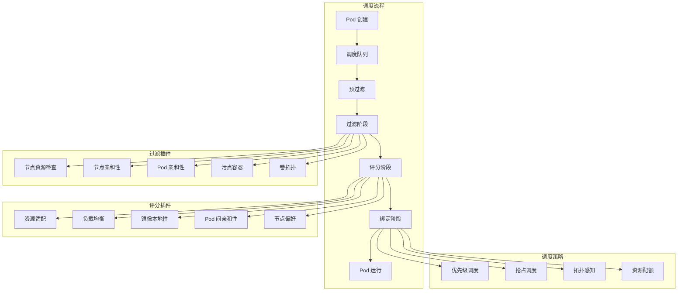

# Kubernetes 调度策略优化

## 调度优化概述

Kubernetes 调度器负责将 Pod 分配到最合适的节点上运行，调度策略的优化直接影响集群资源利用率、应用性能和系统稳定性。通过合理的调度配置，可以实现资源的最优分配、负载的均衡分布和应用的高效运行。

## 调度器架构和工作原理

### 调度流程分析



### 调度决策因素

**调度考虑因素优先级**：
1. **硬约束**：资源需求、节点选择器、亲和性规则
2. **软约束**：偏好设置、负载均衡、资源优化
3. **性能因素**：镜像本地性、网络拓扑、存储位置
4. **策略因素**：优先级、抢占、公平性

## 节点亲和性优化

### 节点选择策略

**硬性节点亲和性配置**：
```yaml
# 基于节点特性的精确调度
apiVersion: apps/v1
kind: Deployment
metadata:
  name: compute-intensive-app
spec:
  replicas: 3
  selector:
    matchLabels:
      app: compute-app
  template:
    metadata:
      labels:
        app: compute-app
    spec:
      affinity:
        nodeAffinity:
          # 必须满足的条件
          requiredDuringSchedulingIgnoredDuringExecution:
            nodeSelectorTerms:
            - matchExpressions:
              - key: node-type
                operator: In
                values: ["compute-optimized"]
              - key: kubernetes.io/arch
                operator: In
                values: ["amd64"]
              - key: zone
                operator: NotIn
                values: ["zone-maintenance"]
          # 偏好条件（加权）
          preferredDuringSchedulingIgnoredDuringExecution:
          - weight: 100
            preference:
              matchExpressions:
              - key: instance-type
                operator: In
                values: ["c5.xlarge", "c5.2xlarge"]
          - weight: 80
            preference:
              matchExpressions:
              - key: cpu-generation
                operator: In
                values: ["skylake", "cascade-lake"]
          - weight: 60
            preference:
              matchExpressions:
              - key: network-performance
                operator: In
                values: ["high", "enhanced"]
      containers:
      - name: app
        image: compute-app:latest
        resources:
          requests:
            cpu: 2000m
            memory: 4Gi
          limits:
            cpu: 4000m
            memory: 8Gi

---
# 存储感知的节点调度
apiVersion: apps/v1
kind: StatefulSet
metadata:
  name: database-cluster
spec:
  serviceName: database
  replicas: 3
  selector:
    matchLabels:
      app: database
  template:
    metadata:
      labels:
        app: database
    spec:
      affinity:
        nodeAffinity:
          requiredDuringSchedulingIgnoredDuringExecution:
            nodeSelectorTerms:
            - matchExpressions:
              - key: storage-type
                operator: In
                values: ["ssd", "nvme"]
              - key: storage-tier
                operator: In
                values: ["high-performance"]
          preferredDuringSchedulingIgnoredDuringExecution:
          - weight: 100
            preference:
              matchExpressions:
              - key: local-storage
                operator: In
                values: ["available"]
      containers:
      - name: database
        image: postgres:15
        volumeMounts:
        - name: data
          mountPath: /var/lib/postgresql/data
  volumeClaimTemplates:
  - metadata:
      name: data
    spec:
      accessModes: ["ReadWriteOnce"]
      storageClassName: fast-ssd
      resources:
        requests:
          storage: 100Gi
```

### 动态节点标签管理

**节点标签自动化管理**：
```yaml
# 节点标签控制器
apiVersion: apps/v1
kind: DaemonSet
metadata:
  name: node-labeler
  namespace: kube-system
spec:
  selector:
    matchLabels:
      name: node-labeler
  template:
    metadata:
      labels:
        name: node-labeler
    spec:
      hostPID: true
      containers:
      - name: labeler
        image: alpine:latest
        command:
        - /bin/sh
        - -c
        - |
          # 检测节点硬件特性并打标签
          NODE_NAME=${NODE_NAME}
          
          # 检测 CPU 类型
          CPU_MODEL=$(cat /proc/cpuinfo | grep "model name" | head -1 | awk -F: '{print $2}' | xargs)
          if echo $CPU_MODEL | grep -q "Intel"; then
            kubectl label node $NODE_NAME cpu-vendor=intel --overwrite
          elif echo $CPU_MODEL | grep -q "AMD"; then
            kubectl label node $NODE_NAME cpu-vendor=amd --overwrite
          fi
          
          # 检测内存容量
          MEMORY_GB=$(cat /proc/meminfo | grep MemTotal | awk '{print int($2/1024/1024)}')
          if [ $MEMORY_GB -gt 64 ]; then
            kubectl label node $NODE_NAME memory-tier=high --overwrite
          elif [ $MEMORY_GB -gt 32 ]; then
            kubectl label node $NODE_NAME memory-tier=medium --overwrite
          else
            kubectl label node $NODE_NAME memory-tier=low --overwrite
          fi
          
          # 检测存储类型
          if lsblk | grep -q nvme; then
            kubectl label node $NODE_NAME storage-type=nvme --overwrite
          elif lsblk | grep -q ssd; then
            kubectl label node $NODE_NAME storage-type=ssd --overwrite
          else
            kubectl label node $NODE_NAME storage-type=hdd --overwrite
          fi
          
          # 检测网络性能
          NETWORK_SPEED=$(ethtool eth0 2>/dev/null | grep Speed | awk '{print $2}' | tr -d 'Mb/s')
          if [ "$NETWORK_SPEED" -ge 10000 ]; then
            kubectl label node $NODE_NAME network-performance=high --overwrite
          elif [ "$NETWORK_SPEED" -ge 1000 ]; then
            kubectl label node $NODE_NAME network-performance=medium --overwrite
          else
            kubectl label node $NODE_NAME network-performance=low --overwrite
          fi
          
          # 持续监控
          sleep 3600
        env:
        - name: NODE_NAME
          valueFrom:
            fieldRef:
              fieldPath: spec.nodeName
        securityContext:
          privileged: true
        volumeMounts:
        - name: proc
          mountPath: /proc
          readOnly: true
        - name: sys
          mountPath: /sys
          readOnly: true
      volumes:
      - name: proc
        hostPath:
          path: /proc
      - name: sys
        hostPath:
          path: /sys
      tolerations:
      - operator: Exists
      serviceAccountName: node-labeler

---
# 节点标签管理 RBAC
apiVersion: v1
kind: ServiceAccount
metadata:
  name: node-labeler
  namespace: kube-system

---
apiVersion: rbac.authorization.k8s.io/v1
kind: ClusterRole
metadata:
  name: node-labeler
rules:
- apiGroups: [""]
  resources: ["nodes"]
  verbs: ["get", "list", "patch", "update"]

---
apiVersion: rbac.authorization.k8s.io/v1
kind: ClusterRoleBinding
metadata:
  name: node-labeler
roleRef:
  apiGroup: rbac.authorization.k8s.io
  kind: ClusterRole
  name: node-labeler
subjects:
- kind: ServiceAccount
  name: node-labeler
  namespace: kube-system
```

## Pod 亲和性和反亲和性

### 高可用性调度配置

**Pod 反亲和性确保高可用**：
```yaml
# 高可用服务部署
apiVersion: apps/v1
kind: Deployment
metadata:
  name: high-availability-service
spec:
  replicas: 5
  selector:
    matchLabels:
      app: ha-service
  template:
    metadata:
      labels:
        app: ha-service
        version: v1
    spec:
      affinity:
        # Pod 反亲和性：避免单点故障
        podAntiAffinity:
          # 硬性反亲和性：绝对不在同一节点
          requiredDuringSchedulingIgnoredDuringExecution:
          - labelSelector:
              matchExpressions:
              - key: app
                operator: In
                values: ["ha-service"]
            topologyKey: "kubernetes.io/hostname"
          # 软性反亲和性：尽量分散到不同可用区
          preferredDuringSchedulingIgnoredDuringExecution:
          - weight: 100
            podAffinityTerm:
              labelSelector:
                matchExpressions:
                - key: app
                  operator: In
                  values: ["ha-service"]
              topologyKey: "topology.kubernetes.io/zone"
          - weight: 50
            podAffinityTerm:
              labelSelector:
                matchExpressions:
                - key: app
                  operator: In
                  values: ["ha-service"]
              topologyKey: "node-role.kubernetes.io/worker"
      containers:
      - name: service
        image: ha-service:v1
        ports:
        - containerPort: 8080
        resources:
          requests:
            cpu: 500m
            memory: 1Gi
          limits:
            cpu: 1000m
            memory: 2Gi

---
# 微服务亲和性配置
apiVersion: apps/v1
kind: Deployment
metadata:
  name: frontend-service
spec:
  replicas: 3
  selector:
    matchLabels:
      app: frontend
  template:
    metadata:
      labels:
        app: frontend
        tier: web
    spec:
      affinity:
        # Pod 亲和性：与后端服务部署在一起
        podAffinity:
          preferredDuringSchedulingIgnoredDuringExecution:
          - weight: 100
            podAffinityTerm:
              labelSelector:
                matchExpressions:
                - key: app
                  operator: In
                  values: ["backend-api"]
              topologyKey: "kubernetes.io/hostname"
        # Pod 反亲和性：前端服务实例分散部署
        podAntiAffinity:
          preferredDuringSchedulingIgnoredDuringExecution:
          - weight: 80
            podAffinityTerm:
              labelSelector:
                matchExpressions:
                - key: app
                  operator: In
                  values: ["frontend"]
              topologyKey: "kubernetes.io/hostname"
      containers:
      - name: frontend
        image: frontend:latest
        ports:
        - containerPort: 3000
```

### 拓扑感知调度

**拓扑分布约束**：
```yaml
# 拓扑感知的分布式部署
apiVersion: apps/v1
kind: Deployment
metadata:
  name: distributed-cache
spec:
  replicas: 6
  selector:
    matchLabels:
      app: redis-cache
  template:
    metadata:
      labels:
        app: redis-cache
    spec:
      # 拓扑分布约束
      topologySpreadConstraints:
      # 在可用区间均匀分布
      - maxSkew: 1
        topologyKey: topology.kubernetes.io/zone
        whenUnsatisfiable: DoNotSchedule
        labelSelector:
          matchLabels:
            app: redis-cache
      # 在节点间均匀分布
      - maxSkew: 2
        topologyKey: kubernetes.io/hostname
        whenUnsatisfiable: ScheduleAnyway
        labelSelector:
          matchLabels:
            app: redis-cache
      containers:
      - name: redis
        image: redis:7-alpine
        ports:
        - containerPort: 6379
        resources:
          requests:
            cpu: 200m
            memory: 512Mi
          limits:
            cpu: 500m
            memory: 1Gi

---
# 区域感知的数据库集群
apiVersion: apps/v1
kind: StatefulSet
metadata:
  name: database-cluster
spec:
  serviceName: database
  replicas: 3
  selector:
    matchLabels:
      app: database
  template:
    metadata:
      labels:
        app: database
    spec:
      topologySpreadConstraints:
      # 确保每个可用区至少有一个副本
      - maxSkew: 0
        topologyKey: topology.kubernetes.io/zone
        whenUnsatisfiable: DoNotSchedule
        labelSelector:
          matchLabels:
            app: database
      affinity:
        podAntiAffinity:
          requiredDuringSchedulingIgnoredDuringExecution:
          - labelSelector:
              matchLabels:
                app: database
            topologyKey: kubernetes.io/hostname
      containers:
      - name: database
        image: postgres:15
        env:
        - name: POSTGRES_DB
          value: "app_db"
        - name: POSTGRES_USER
          value: "postgres"
        - name: POSTGRES_PASSWORD
          valueFrom:
            secretKeyRef:
              name: postgres-secret
              key: password
  volumeClaimTemplates:
  - metadata:
      name: data
    spec:
      accessModes: ["ReadWriteOnce"]
      storageClassName: zone-aware-ssd
      resources:
        requests:
          storage: 100Gi
```

## 污点和容忍度优化

### 专用节点配置

**污点策略实施**：
```bash
#!/bin/bash
# 节点污点管理脚本

# 为 GPU 节点添加污点
kubectl taint nodes gpu-node-1 dedicated=gpu:NoSchedule
kubectl taint nodes gpu-node-2 dedicated=gpu:NoSchedule

# 为存储节点添加污点
kubectl taint nodes storage-node-1 dedicated=storage:NoSchedule
kubectl taint nodes storage-node-2 dedicated=storage:NoSchedule

# 为计算节点添加污点
kubectl taint nodes compute-node-1 dedicated=compute:NoSchedule
kubectl taint nodes compute-node-2 dedicated=compute:NoSchedule

# 为系统组件节点添加污点
kubectl taint nodes master-node node-role.kubernetes.io/master:NoSchedule

# 为维护节点添加污点
kubectl taint nodes maintenance-node maintenance=true:NoSchedule
```

**容忍度配置**：
```yaml
# GPU 工作负载配置
apiVersion: apps/v1
kind: Deployment
metadata:
  name: ml-training-job
spec:
  replicas: 2
  selector:
    matchLabels:
      app: ml-training
  template:
    metadata:
      labels:
        app: ml-training
    spec:
      tolerations:
      # 容忍 GPU 节点污点
      - key: dedicated
        operator: Equal
        value: gpu
        effect: NoSchedule
      # 容忍 GPU 节点驱逐
      - key: dedicated
        operator: Equal
        value: gpu
        effect: NoExecute
        tolerationSeconds: 300
      nodeSelector:
        accelerator: nvidia-tesla-v100
      containers:
      - name: training
        image: tensorflow/tensorflow:2.8.0-gpu
        resources:
          requests:
            nvidia.com/gpu: 1
            cpu: 4000m
            memory: 8Gi
          limits:
            nvidia.com/gpu: 1
            cpu: 8000m
            memory: 16Gi

---
# 存储密集型应用配置
apiVersion: apps/v1
kind: StatefulSet
metadata:
  name: big-data-storage
spec:
  serviceName: big-data
  replicas: 3
  selector:
    matchLabels:
      app: big-data
  template:
    metadata:
      labels:
        app: big-data
    spec:
      tolerations:
      # 容忍存储节点污点
      - key: dedicated
        operator: Equal
        value: storage
        effect: NoSchedule
      - key: dedicated
        operator: Equal
        value: storage
        effect: NoExecute
      nodeSelector:
        storage-tier: high-capacity
      containers:
      - name: storage
        image: big-data-storage:latest
        volumeMounts:
        - name: data
          mountPath: /data
  volumeClaimTemplates:
  - metadata:
      name: data
    spec:
      accessModes: ["ReadWriteOnce"]
      storageClassName: high-capacity-hdd
      resources:
        requests:
          storage: 10Ti

---
# 系统组件容忍配置
apiVersion: apps/v1
kind: DaemonSet
metadata:
  name: system-monitor
  namespace: kube-system
spec:
  selector:
    matchLabels:
      app: system-monitor
  template:
    metadata:
      labels:
        app: system-monitor
    spec:
      tolerations:
      # 容忍所有污点以在所有节点运行
      - operator: Exists
        effect: NoSchedule
      - operator: Exists
        effect: NoExecute
      - operator: Exists
        effect: PreferNoSchedule
      containers:
      - name: monitor
        image: system-monitor:latest
        securityContext:
          privileged: true
```

## 优先级和抢占调度

### 优先级类配置

**优先级类定义**：
```yaml
# 系统关键组件优先级
apiVersion: scheduling.k8s.io/v1
kind: PriorityClass
metadata:
  name: system-critical
value: 2000000000
globalDefault: false
description: "系统关键组件优先级"

---
# 业务关键应用优先级
apiVersion: scheduling.k8s.io/v1
kind: PriorityClass
metadata:
  name: business-critical
value: 1000000000
globalDefault: false
description: "业务关键应用优先级"

---
# 高优先级应用
apiVersion: scheduling.k8s.io/v1
kind: PriorityClass
metadata:
  name: high-priority
value: 1000000
globalDefault: false
description: "高优先级应用"

---
# 普通优先级应用
apiVersion: scheduling.k8s.io/v1
kind: PriorityClass
metadata:
  name: normal-priority
value: 1000
globalDefault: true
description: "普通优先级应用"

---
# 低优先级应用
apiVersion: scheduling.k8s.io/v1
kind: PriorityClass
metadata:
  name: low-priority
value: 100
globalDefault: false
description: "低优先级应用，可被抢占"
```

**优先级应用部署**：
```yaml
# 关键业务应用
apiVersion: apps/v1
kind: Deployment
metadata:
  name: critical-api-service
spec:
  replicas: 3
  selector:
    matchLabels:
      app: critical-api
  template:
    metadata:
      labels:
        app: critical-api
    spec:
      priorityClassName: business-critical
      containers:
      - name: api
        image: critical-api:latest
        resources:
          requests:
            cpu: 1000m
            memory: 2Gi
          limits:
            cpu: 2000m
            memory: 4Gi
        livenessProbe:
          httpGet:
            path: /health
            port: 8080
          initialDelaySeconds: 30
          periodSeconds: 10
        readinessProbe:
          httpGet:
            path: /ready
            port: 8080
          initialDelaySeconds: 10
          periodSeconds: 5

---
# 批处理任务（低优先级）
apiVersion: batch/v1
kind: Job
metadata:
  name: batch-processing-job
spec:
  template:
    spec:
      priorityClassName: low-priority
      # 允许被抢占时的优雅终止时间
      terminationGracePeriodSeconds: 300
      containers:
      - name: batch-processor
        image: batch-processor:latest
        env:
        - name: CHECKPOINT_ENABLED
          value: "true"
        - name: CHECKPOINT_INTERVAL
          value: "300"
        resources:
          requests:
            cpu: 500m
            memory: 1Gi
          limits:
            cpu: 2000m
            memory: 4Gi
        # 实现检查点机制
        lifecycle:
          preStop:
            exec:
              command:
              - /bin/sh
              - -c
              - |
                echo "收到终止信号，保存检查点..."
                /app/save-checkpoint.sh
                echo "检查点保存完成"
      restartPolicy: OnFailure
```

## 自定义调度器

### 调度器扩展配置

**调度框架插件配置**：
```yaml
# 自定义调度器配置
apiVersion: v1
kind: ConfigMap
metadata:
  name: custom-scheduler-config
  namespace: kube-system
data:
  config.yaml: |
    apiVersion: kubescheduler.config.k8s.io/v1beta3
    kind: KubeSchedulerConfiguration
    profiles:
    - schedulerName: custom-scheduler
      plugins:
        # 过滤阶段插件
        filter:
          enabled:
          - name: NodeUnschedulable
          - name: NodeResourcesFit
          - name: NodeAffinity
          - name: NodePorts
          - name: PodTopologySpread
          - name: TaintToleration
          - name: VolumeBinding
          - name: VolumeRestrictions
          - name: VolumeZone
          disabled:
          - name: NodeResourcesLeastAllocated
        # 评分阶段插件
        score:
          enabled:
          - name: NodeResourcesFit
            weight: 100
          - name: NodeAffinity
            weight: 80
          - name: PodTopologySpread
            weight: 60
          - name: TaintToleration
            weight: 50
          - name: ImageLocality
            weight: 40
          - name: InterPodAffinity
            weight: 30
      pluginConfig:
      # 资源适配插件配置
      - name: NodeResourcesFit
        args:
          scoringStrategy:
            type: LeastAllocated
            resources:
            - name: cpu
              weight: 1
            - name: memory
              weight: 1
      # 拓扑分布插件配置
      - name: PodTopologySpread
        args:
          defaultConstraints:
          - maxSkew: 1
            topologyKey: "topology.kubernetes.io/zone"
            whenUnsatisfiable: ScheduleAnyway
          - maxSkew: 2
            topologyKey: "kubernetes.io/hostname"
            whenUnsatisfiable: ScheduleAnyway

---
# 自定义调度器部署
apiVersion: apps/v1
kind: Deployment
metadata:
  name: custom-scheduler
  namespace: kube-system
spec:
  replicas: 1
  selector:
    matchLabels:
      app: custom-scheduler
  template:
    metadata:
      labels:
        app: custom-scheduler
    spec:
      serviceAccountName: custom-scheduler
      containers:
      - name: kube-scheduler
        image: k8s.gcr.io/kube-scheduler:v1.25.0
        command:
        - kube-scheduler
        - --config=/etc/kubernetes/scheduler-config.yaml
        - --v=2
        resources:
          requests:
            cpu: 100m
            memory: 128Mi
          limits:
            cpu: 500m
            memory: 512Mi
        volumeMounts:
        - name: config
          mountPath: /etc/kubernetes
        livenessProbe:
          httpGet:
            path: /healthz
            port: 10259
            scheme: HTTPS
          initialDelaySeconds: 15
        readinessProbe:
          httpGet:
            path: /healthz
            port: 10259
            scheme: HTTPS
      volumes:
      - name: config
        configMap:
          name: custom-scheduler-config
```

## 调度性能优化

### 调度器性能调优

**调度器性能配置**：
```yaml
# 高性能调度器配置
apiVersion: v1
kind: ConfigMap
metadata:
  name: high-performance-scheduler-config
  namespace: kube-system
data:
  config.yaml: |
    apiVersion: kubescheduler.config.k8s.io/v1beta3
    kind: KubeSchedulerConfiguration
    # 性能优化配置
    parallelism: 16  # 并行度
    percentageOfNodesToScore: 50  # 评分节点百分比
    
    profiles:
    - schedulerName: high-performance-scheduler
      plugins:
        queueSort:
          enabled:
          - name: PrioritySort
        preFilter:
          enabled:
          - name: NodeResourcesFit
          - name: NodeAffinity
          - name: NodePorts
          - name: PodTopologySpread
        filter:
          enabled:
          - name: NodeUnschedulable
          - name: NodeResourcesFit
          - name: NodeAffinity
          - name: NodePorts
          - name: PodTopologySpread
          - name: TaintToleration
          - name: VolumeBinding
        postFilter:
          enabled:
          - name: DefaultPreemption
        preScore:
          enabled:
          - name: InterPodAffinity
          - name: PodTopologySpread
          - name: TaintToleration
        score:
          enabled:
          - name: NodeResourcesFit
            weight: 100
          - name: NodeAffinity
            weight: 50
          - name: PodTopologySpread
            weight: 30
          - name: InterPodAffinity
            weight: 20
          - name: ImageLocality
            weight: 10
        reserve:
          enabled:
          - name: VolumeBinding
        permit: {}
        preBind:
          enabled:
          - name: VolumeBinding
        bind:
          enabled:
          - name: DefaultBinder
        postBind: {}
      
      pluginConfig:
      # 资源适配优化
      - name: NodeResourcesFit
        args:
          scoringStrategy:
            type: LeastAllocated
            resources:
            - name: cpu
              weight: 1
            - name: memory
              weight: 1
            - name: nvidia.com/gpu
              weight: 5
      
      # 节点亲和性优化
      - name: NodeAffinity
        args:
          addedAffinity:
            requiredDuringSchedulingIgnoredDuringExecution:
              nodeSelectorTerms:
              - matchExpressions:
                - key: node.kubernetes.io/instance-type
                  operator: NotIn
                  values: ["spot"]
      
      # 抢占优化
      - name: DefaultPreemption
        args:
          minCandidateNodesPercentage: 10
          minCandidateNodesAbsolute: 100
```

### 调度性能监控

**调度器监控配置**：
```yaml
# 调度器性能监控
apiVersion: v1
kind: ConfigMap
metadata:
  name: scheduler-monitoring-rules
data:
  scheduler-rules.yml: |
    groups:
    - name: scheduler-performance
      rules:
      # 调度延迟
      - record: scheduler:scheduling_duration:p95
        expr: |
          histogram_quantile(0.95,
            rate(scheduler_scheduling_duration_seconds_bucket[5m])
          )
      
      # 调度队列大小
      - record: scheduler:pending_pods:count
        expr: |
          scheduler_pending_pods
      
      # 调度成功率
      - record: scheduler:scheduling_attempts:rate
        expr: |
          rate(scheduler_scheduling_attempts_total[5m])
      
      # 抢占事件
      - record: scheduler:preemption_events:rate
        expr: |
          rate(scheduler_preemption_attempts_total[5m])
      
      # 调度器错误率
      - record: scheduler:errors:rate
        expr: |
          rate(scheduler_scheduling_attempts_total{result="error"}[5m]) /
          rate(scheduler_scheduling_attempts_total[5m])

---
# 调度器性能告警
apiVersion: v1
kind: ConfigMap
metadata:
  name: scheduler-performance-alerts
data:
  scheduler-alerts.yml: |
    groups:
    - name: scheduler-performance-alerts
      rules:
      # 调度延迟过高
      - alert: HighSchedulingLatency
        expr: |
          scheduler:scheduling_duration:p95 > 1.0
        for: 5m
        labels:
          severity: warning
          component: scheduler
        annotations:
          summary: "调度器延迟过高"
          description: "95% 调度延迟: {{ $value }}s，超过 1 秒阈值"
      
      # 调度队列积压
      - alert: HighPendingPods
        expr: |
          scheduler:pending_pods:count > 100
        for: 5m
        labels:
          severity: warning
          component: scheduler
        annotations:
          summary: "调度队列积压严重"
          description: "待调度 Pod 数量: {{ $value }}，超过 100 个阈值"
      
      # 调度失败率过高
      - alert: HighSchedulingErrorRate
        expr: |
          scheduler:errors:rate > 0.1
        for: 2m
        labels:
          severity: critical
          component: scheduler
        annotations:
          summary: "调度失败率过高"
          description: "调度失败率: {{ $value | humanizePercentage }}，超过 10% 阈值"
```

## 调度策略最佳实践

### 应用类型调度策略

**不同应用类型的调度配置**：
```yaml
# Web 前端应用调度策略
apiVersion: apps/v1
kind: Deployment
metadata:
  name: web-frontend
spec:
  replicas: 6
  selector:
    matchLabels:
      app: web-frontend
  template:
    metadata:
      labels:
        app: web-frontend
        tier: frontend
    spec:
      # 拓扑分布确保高可用
      topologySpreadConstraints:
      - maxSkew: 1
        topologyKey: topology.kubernetes.io/zone
        whenUnsatisfiable: DoNotSchedule
        labelSelector:
          matchLabels:
            app: web-frontend
      # 节点亲和性：选择边缘节点
      affinity:
        nodeAffinity:
          preferredDuringSchedulingIgnoredDuringExecution:
          - weight: 100
            preference:
              matchExpressions:
              - key: node-location
                operator: In
                values: ["edge", "cdn"]
      containers:
      - name: frontend
        image: nginx:alpine
        resources:
          requests:
            cpu: 100m
            memory: 128Mi
          limits:
            cpu: 500m
            memory: 512Mi

---
# 数据分析应用调度策略
apiVersion: apps/v1
kind: Deployment
metadata:
  name: data-analytics
spec:
  replicas: 3
  selector:
    matchLabels:
      app: data-analytics
  template:
    metadata:
      labels:
        app: data-analytics
        workload-type: compute-intensive
    spec:
      # 节点亲和性：选择计算优化节点
      affinity:
        nodeAffinity:
          requiredDuringSchedulingIgnoredDuringExecution:
            nodeSelectorTerms:
            - matchExpressions:
              - key: node-type
                operator: In
                values: ["compute-optimized"]
              - key: cpu-generation
                operator: In
                values: ["skylake", "cascade-lake", "ice-lake"]
      # 容忍计算节点污点
      tolerations:
      - key: dedicated
        operator: Equal
        value: compute
        effect: NoSchedule
      containers:
      - name: analytics
        image: data-analytics:latest
        resources:
          requests:
            cpu: 4000m
            memory: 8Gi
          limits:
            cpu: 8000m
            memory: 16Gi

---
# 缓存应用调度策略
apiVersion: apps/v1
kind: StatefulSet
metadata:
  name: redis-cache
spec:
  serviceName: redis-cache
  replicas: 3
  selector:
    matchLabels:
      app: redis-cache
  template:
    metadata:
      labels:
        app: redis-cache
        workload-type: memory-intensive
    spec:
      # 节点亲和性：选择内存优化节点
      affinity:
        nodeAffinity:
          preferredDuringSchedulingIgnoredDuringExecution:
          - weight: 100
            preference:
              matchExpressions:
              - key: memory-tier
                operator: In
                values: ["high"]
        # Pod 反亲和性：分散部署
        podAntiAffinity:
          requiredDuringSchedulingIgnoredDuringExecution:
          - labelSelector:
              matchLabels:
                app: redis-cache
            topologyKey: kubernetes.io/hostname
      containers:
      - name: redis
        image: redis:7-alpine
        resources:
          requests:
            cpu: 500m
            memory: 4Gi
          limits:
            cpu: 1000m
            memory: 8Gi
```

通过系统性的调度策略优化，可以显著提升 Kubernetes 集群的资源利用率和应用性能，实现更好的负载分布和故障容错能力。建议根据具体的应用特性和集群环境选择合适的调度策略。
