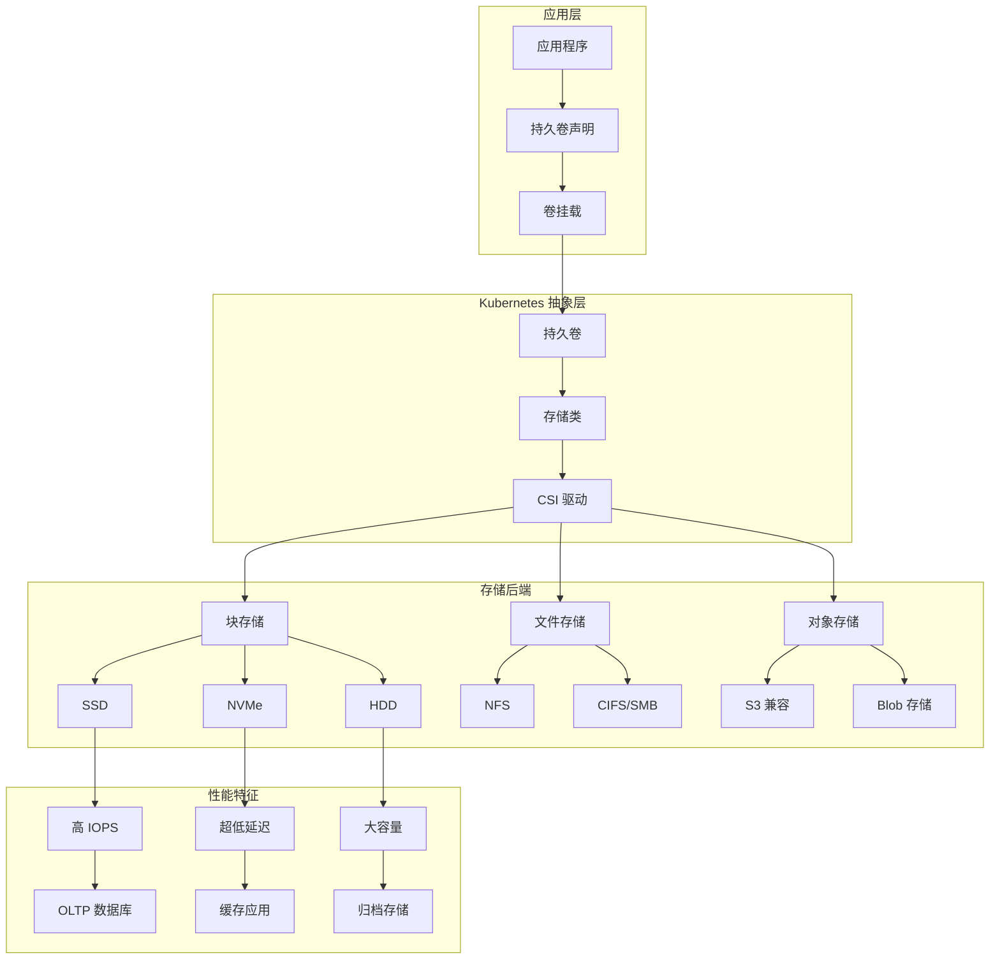

# Kubernetes 存储性能优化

## 存储优化概述

存储性能是 Kubernetes 集群中影响应用响应速度和数据可靠性的关键因素。合理的存储优化策略可以显著提升 I/O 性能、降低延迟、确保数据持久性，为有状态应用提供高性能的存储支撑。

## 存储架构和类型

### 存储层次结构



### 存储性能分类

**按性能特征分类**：
- **高 IOPS 存储**：适用于数据库、缓存等随机读写密集型应用
- **高吞吐量存储**：适用于大数据分析、流媒体等顺序读写应用
- **低延迟存储**：适用于实时处理、高频交易等延迟敏感应用
- **大容量存储**：适用于日志归档、备份等成本敏感应用

## 存储类优化配置

### 高性能存储类

**SSD 存储类配置**：
```yaml
# 高性能 SSD 存储类
apiVersion: storage.k8s.io/v1
kind: StorageClass
metadata:
  name: fast-ssd
  annotations:
    storageclass.kubernetes.io/is-default-class: "false"
provisioner: ebs.csi.aws.com
parameters:
  type: gp3
  iops: "16000"           # 高 IOPS 配置
  throughput: "1000"      # 高吞吐量 MB/s
  encrypted: "true"
  fsType: ext4
allowVolumeExpansion: true
volumeBindingMode: WaitForFirstConsumer
reclaimPolicy: Delete

---
# 超高性能 NVMe 存储类
apiVersion: storage.k8s.io/v1
kind: StorageClass
metadata:
  name: nvme-ultra
provisioner: ebs.csi.aws.com
parameters:
  type: io2
  iops: "64000"           # 超高 IOPS
  throughput: "2000"      # 超高吞吐量
  encrypted: "true"
  fsType: ext4
allowVolumeExpansion: true
volumeBindingMode: Immediate
reclaimPolicy: Retain      # 保留重要数据

---
# 成本优化存储类
apiVersion: storage.k8s.io/v1
kind: StorageClass
metadata:
  name: cost-optimized
provisioner: ebs.csi.aws.com
parameters:
  type: gp2
  encrypted: "true"
  fsType: ext4
allowVolumeExpansion: true
volumeBindingMode: WaitForFirstConsumer
reclaimPolicy: Delete
```

**本地存储优化**：
```yaml
# 本地 SSD 存储类
apiVersion: storage.k8s.io/v1
kind: StorageClass
metadata:
  name: local-ssd
provisioner: kubernetes.io/no-provisioner
volumeBindingMode: WaitForFirstConsumer
reclaimPolicy: Delete

---
# 本地存储持久卷
apiVersion: v1
kind: PersistentVolume
metadata:
  name: local-ssd-pv
spec:
  capacity:
    storage: 1Ti
  volumeMode: Filesystem
  accessModes:
  - ReadWriteOnce
  persistentVolumeReclaimPolicy: Delete
  storageClassName: local-ssd
  local:
    path: /mnt/fast-ssd
  nodeAffinity:
    required:
      nodeSelectorTerms:
      - matchExpressions:
        - key: kubernetes.io/hostname
          operator: In
          values:
          - node-with-ssd

---
# 内存文件系统存储类
apiVersion: storage.k8s.io/v1
kind: StorageClass
metadata:
  name: memory-storage
provisioner: kubernetes.io/no-provisioner
volumeBindingMode: Immediate

---
# 内存文件系统 PV
apiVersion: v1
kind: PersistentVolume
metadata:
  name: tmpfs-pv
spec:
  capacity:
    storage: 10Gi
  accessModes:
  - ReadWriteOnce
  hostPath:
    path: /tmp/tmpfs
  storageClassName: memory-storage
```

### 应用特定存储优化

**数据库存储优化**：
```yaml
# 数据库专用存储配置
apiVersion: apps/v1
kind: StatefulSet
metadata:
  name: database-optimized
spec:
  serviceName: database
  replicas: 3
  selector:
    matchLabels:
      app: database
  template:
    metadata:
      labels:
        app: database
    spec:
      containers:
      - name: postgres
        image: postgres:15
        env:
        - name: POSTGRES_DB
          value: "proddb"
        - name: POSTGRES_USER
          value: "postgres"
        - name: POSTGRES_PASSWORD
          valueFrom:
            secretKeyRef:
              name: postgres-secret
              key: password
        - name: PGDATA
          value: /var/lib/postgresql/data/pgdata
        resources:
          requests:
            cpu: 2000m
            memory: 4Gi
          limits:
            cpu: 4000m
            memory: 8Gi
        volumeMounts:
        - name: postgres-data
          mountPath: /var/lib/postgresql/data
        - name: postgres-config
          mountPath: /etc/postgresql/postgresql.conf
          subPath: postgresql.conf
        - name: postgres-wal
          mountPath: /var/lib/postgresql/wal
        # 存储优化配置
        lifecycle:
          postStart:
            exec:
              command:
              - /bin/bash
              - -c
              - |
                # 优化文件系统挂载选项
                mount -o remount,noatime,nodiratime /var/lib/postgresql/data
      volumes:
      - name: postgres-config
        configMap:
          name: postgres-config
  volumeClaimTemplates:
  - metadata:
      name: postgres-data
    spec:
      accessModes: ["ReadWriteOnce"]
      storageClassName: fast-ssd
      resources:
        requests:
          storage: 500Gi
  - metadata:
      name: postgres-wal
    spec:
      accessModes: ["ReadWriteOnce"]
      storageClassName: nvme-ultra    # WAL 使用最高性能存储
      resources:
        requests:
          storage: 100Gi

---
# PostgreSQL 性能优化配置
apiVersion: v1
kind: ConfigMap
metadata:
  name: postgres-config
data:
  postgresql.conf: |
    # 内存配置
    shared_buffers = 2GB
    effective_cache_size = 6GB
    work_mem = 64MB
    maintenance_work_mem = 512MB
    
    # 存储优化配置
    checkpoint_completion_target = 0.9
    checkpoint_timeout = 15min
    max_wal_size = 4GB
    min_wal_size = 1GB
    
    # I/O 优化
    wal_buffers = 64MB
    wal_writer_delay = 200ms
    commit_delay = 100000
    commit_siblings = 10
    
    # 异步提交优化（根据需求）
    synchronous_commit = on
    fsync = on
    full_page_writes = on
    
    # 连接配置
    max_connections = 200
    shared_preload_libraries = 'pg_stat_statements'
```

**缓存存储优化**：
```yaml
# Redis 集群存储优化
apiVersion: apps/v1
kind: StatefulSet
metadata:
  name: redis-cluster
spec:
  serviceName: redis-cluster
  replicas: 6
  selector:
    matchLabels:
      app: redis-cluster
  template:
    metadata:
      labels:
        app: redis-cluster
    spec:
      containers:
      - name: redis
        image: redis:7-alpine
        command:
        - redis-server
        - /etc/redis/redis.conf
        args:
        - --cluster-enabled
        - "yes"
        - --cluster-config-file
        - "nodes.conf"
        - --cluster-node-timeout
        - "5000"
        - --appendonly
        - "yes"
        - --save
        - "900 1"
        - --save
        - "300 10"
        - --save
        - "60 10000"
        ports:
        - containerPort: 6379
          name: client
        - containerPort: 16379
          name: gossip
        resources:
          requests:
            cpu: 500m
            memory: 2Gi
          limits:
            cpu: 1000m
            memory: 4Gi
        volumeMounts:
        - name: redis-data
          mountPath: /data
        - name: redis-conf
          mountPath: /etc/redis
        # 存储性能优化
        securityContext:
          runAsUser: 999
          fsGroup: 999
      volumes:
      - name: redis-conf
        configMap:
          name: redis-config
  volumeClaimTemplates:
  - metadata:
      name: redis-data
    spec:
      accessModes: ["ReadWriteOnce"]
      storageClassName: fast-ssd
      resources:
        requests:
          storage: 100Gi

---
# Redis 存储优化配置
apiVersion: v1
kind: ConfigMap
metadata:
  name: redis-config
data:
  redis.conf: |
    # 内存优化
    maxmemory 3gb
    maxmemory-policy allkeys-lru
    
    # 持久化优化
    save 900 1
    save 300 10
    save 60 10000
    
    # AOF 配置
    appendonly yes
    appendfsync everysec
    no-appendfsync-on-rewrite no
    auto-aof-rewrite-percentage 100
    auto-aof-rewrite-min-size 64mb
    
    # 网络优化
    tcp-keepalive 300
    timeout 0
    
    # 日志级别
    loglevel notice
```

## 存储 I/O 优化

### 文件系统优化

**文件系统选择和调优**：
```yaml
# 文件系统优化的 Pod 配置
apiVersion: v1
kind: Pod
metadata:
  name: storage-optimized-pod
spec:
  initContainers:
  - name: fs-optimizer
    image: alpine:latest
    command:
    - /bin/sh
    - -c
    - |
      # 检查并优化文件系统
      if [ -b /dev/sdb ]; then
        # 格式化为 ext4 并优化
        mkfs.ext4 -F -E lazy_itable_init=0,lazy_journal_init=0 /dev/sdb
        
        # 调整文件系统参数
        tune2fs -o journal_data_writeback /dev/sdb
        tune2fs -O ^has_journal /dev/sdb
      fi
    securityContext:
      privileged: true
    volumeMounts:
    - name: raw-storage
      mountPath: /dev/sdb
  containers:
  - name: app
    image: myapp:latest
    volumeMounts:
    - name: optimized-storage
      mountPath: /data
      mountPropagation: None
    # 应用级 I/O 优化
    env:
    - name: DB_SYNC_MODE
      value: "async"
    - name: BUFFER_SIZE
      value: "64KB"
  volumes:
  - name: raw-storage
    hostPath:
      path: /dev/sdb
  - name: optimized-storage
    persistentVolumeClaim:
      claimName: optimized-pvc

---
# 优化的 PVC 配置
apiVersion: v1
kind: PersistentVolumeClaim
metadata:
  name: optimized-pvc
  annotations:
    volume.beta.kubernetes.io/storage-provisioner: ebs.csi.aws.com
    volume.kubernetes.io/storage-provisioner: ebs.csi.aws.com
spec:
  accessModes:
    - ReadWriteOnce
  storageClassName: fast-ssd
  resources:
    requests:
      storage: 1Ti
```

### I/O 调度优化

**I/O 调度器配置**：
```yaml
# I/O 优化 DaemonSet
apiVersion: apps/v1
kind: DaemonSet
metadata:
  name: io-optimizer
  namespace: kube-system
spec:
  selector:
    matchLabels:
      name: io-optimizer
  template:
    metadata:
      labels:
        name: io-optimizer
    spec:
      hostPID: true
      containers:
      - name: optimizer
        image: alpine:latest
        command:
        - /bin/sh
        - -c
        - |
          # 设置 I/O 调度器
          for disk in /sys/block/sd*; do
            if [ -d "$disk" ]; then
              echo mq-deadline > $disk/queue/scheduler
              echo 2 > $disk/queue/read_ahead_kb
              echo 512 > $disk/queue/nr_requests
            fi
          done
          
          # 设置 NVMe 优化
          for nvme in /sys/block/nvme*; do
            if [ -d "$nvme" ]; then
              echo none > $nvme/queue/scheduler
              echo 1 > $nvme/queue/read_ahead_kb
              echo 1024 > $nvme/queue/nr_requests
            fi
          done
          
          # 持续监控
          while true; do
            sleep 3600
          done
        securityContext:
          privileged: true
        volumeMounts:
        - name: sys
          mountPath: /sys
      volumes:
      - name: sys
        hostPath:
          path: /sys
      tolerations:
      - operator: Exists
```

## 存储监控和性能分析

### 存储性能指标

**Prometheus 存储监控规则**：
```yaml
# 存储性能监控规则
apiVersion: v1
kind: ConfigMap
metadata:
  name: storage-monitoring-rules
data:
  storage-rules.yml: |
    groups:
    - name: storage-performance
      rules:
      # 磁盘 I/O 使用率
      - record: node:disk_io_utilization:rate5m
        expr: |
          rate(node_disk_io_time_seconds_total[5m]) * 100
      
      # 磁盘读写速率
      - record: node:disk_read_bytes:rate5m
        expr: |
          rate(node_disk_read_bytes_total[5m])
      
      - record: node:disk_write_bytes:rate5m
        expr: |
          rate(node_disk_written_bytes_total[5m])
      
      # 磁盘 IOPS
      - record: node:disk_read_iops:rate5m
        expr: |
          rate(node_disk_reads_completed_total[5m])
      
      - record: node:disk_write_iops:rate5m
        expr: |
          rate(node_disk_writes_completed_total[5m])
      
      # 磁盘延迟
      - record: node:disk_read_latency:rate5m
        expr: |
          rate(node_disk_read_time_seconds_total[5m]) /
          rate(node_disk_reads_completed_total[5m])
      
      - record: node:disk_write_latency:rate5m
        expr: |
          rate(node_disk_write_time_seconds_total[5m]) /
          rate(node_disk_writes_completed_total[5m])
      
      # PV 使用率
      - record: pv:usage_ratio
        expr: |
          (
            kubelet_volume_stats_used_bytes /
            kubelet_volume_stats_capacity_bytes
          ) * 100
      
      # 磁盘队列深度
      - record: node:disk_avg_queue_size:rate5m
        expr: |
          rate(node_disk_io_time_weighted_seconds_total[5m]) /
          rate(node_disk_io_time_seconds_total[5m])
```

**存储性能告警**：
```yaml
# 存储性能告警规则
apiVersion: v1
kind: ConfigMap
metadata:
  name: storage-performance-alerts
data:
  storage-alerts.yml: |
    groups:
    - name: storage-performance-alerts
      rules:
      # 磁盘 I/O 使用率过高
      - alert: HighDiskIOUsage
        expr: |
          node:disk_io_utilization:rate5m > 80
        for: 5m
        labels:
          severity: warning
          component: storage
        annotations:
          summary: "节点 {{ $labels.instance }} 磁盘 I/O 使用率过高"
          description: "I/O 使用率: {{ $value }}%，超过 80% 阈值"
      
      # 磁盘延迟过高
      - alert: HighDiskLatency
        expr: |
          node:disk_read_latency:rate5m > 0.1 or 
          node:disk_write_latency:rate5m > 0.1
        for: 2m
        labels:
          severity: critical
          component: storage
        annotations:
          summary: "节点 {{ $labels.instance }} 磁盘延迟过高"
          description: "磁盘延迟: {{ $value }}s，超过 100ms 阈值"
      
      # PV 使用率过高
      - alert: HighPVUsage
        expr: |
          pv:usage_ratio > 85
        for: 5m
        labels:
          severity: warning
          component: storage
        annotations:
          summary: "PV {{ $labels.persistentvolumeclaim }} 使用率过高"
          description: "使用率: {{ $value }}%，超过 85% 阈值"
      
      # 磁盘空间即将耗尽
      - alert: DiskSpaceRunningOut
        expr: |
          pv:usage_ratio > 95
        for: 1m
        labels:
          severity: critical
          component: storage
        annotations:
          summary: "PV {{ $labels.persistentvolumeclaim }} 空间即将耗尽"
          description: "使用率: {{ $value }}%，超过 95% 危险阈值"
      
      # 磁盘队列深度过大
      - alert: HighDiskQueueDepth
        expr: |
          node:disk_avg_queue_size:rate5m > 10
        for: 5m
        labels:
          severity: warning
          component: storage
        annotations:
          summary: "节点 {{ $labels.instance }} 磁盘队列深度过大"
          description: "平均队列深度: {{ $value }}，超过 10 的阈值"
```

### 存储性能分析工具

**存储性能测试作业**：
```yaml
# FIO 存储性能测试
apiVersion: batch/v1
kind: Job
metadata:
  name: storage-performance-test
spec:
  template:
    spec:
      containers:
      - name: fio
        image: ljishen/fio:latest
        command:
        - fio
        - --name=randwrite
        - --ioengine=libaio
        - --iodepth=32
        - --rw=randwrite
        - --bs=4k
        - --direct=1
        - --size=10G
        - --numjobs=4
        - --runtime=300
        - --group_reporting
        - --filename=/data/testfile
        - --output-format=json
        - --output=/results/fio-results.json
        volumeMounts:
        - name: test-storage
          mountPath: /data
        - name: results
          mountPath: /results
        resources:
          requests:
            cpu: 1000m
            memory: 1Gi
          limits:
            cpu: 2000m
            memory: 2Gi
      volumes:
      - name: test-storage
        persistentVolumeClaim:
          claimName: storage-test-pvc
      - name: results
        emptyDir: {}
      restartPolicy: Never

---
# 测试用 PVC
apiVersion: v1
kind: PersistentVolumeClaim
metadata:
  name: storage-test-pvc
spec:
  accessModes:
    - ReadWriteOnce
  storageClassName: fast-ssd
  resources:
    requests:
      storage: 50Gi
```

**存储分析脚本**：
```bash
#!/bin/bash
# 存储性能分析工具

# 函数：分析节点存储性能
analyze_node_storage() {
    echo "=== 节点存储性能分析 ==="
    
    # 获取磁盘使用情况
    echo "1. 磁盘使用情况："
    kubectl get nodes -o custom-columns="NAME:.metadata.name,STORAGE:.status.capacity.ephemeral-storage"
    
    # 检查磁盘 I/O 状态
    echo -e "\n2. 磁盘 I/O 状态检查："
    for node in $(kubectl get nodes -o jsonpath='{.items[*].metadata.name}'); do
        echo "节点: $node"
        kubectl describe node $node | grep -A5 "Allocated resources" | grep -E "(ephemeral-storage|storage)"
    done
}

# 函数：分析 PV/PVC 使用情况
analyze_pv_pvc() {
    echo -e "\n=== PV/PVC 使用情况分析 ==="
    
    # PV 状态统计
    echo "1. PV 状态统计："
    kubectl get pv -o custom-columns="NAME:.metadata.name,CAPACITY:.spec.capacity.storage,STATUS:.status.phase,CLAIM:.spec.claimRef.name,STORAGECLASS:.spec.storageClassName"
    
    # PVC 使用情况
    echo -e "\n2. PVC 使用情况："
    kubectl get pvc --all-namespaces -o custom-columns="NAMESPACE:.metadata.namespace,NAME:.metadata.name,STATUS:.status.phase,VOLUME:.spec.volumeName,CAPACITY:.status.capacity.storage,STORAGECLASS:.spec.storageClassName"
    
    # 未绑定的 PVC
    echo -e "\n3. 未绑定的 PVC："
    kubectl get pvc --all-namespaces --field-selector=status.phase=Pending
}

# 函数：存储优化建议
storage_optimization_recommendations() {
    echo -e "\n=== 存储优化建议 ==="
    
    # 检查未使用的 PV
    echo "1. 未使用的 PV："
    kubectl get pv -o json | jq -r '.items[] | select(.status.phase=="Available") | .metadata.name'
    
    # 检查存储类使用情况
    echo -e "\n2. 存储类使用统计："
    kubectl get pvc --all-namespaces -o json | jq -r '.items[] | .spec.storageClassName' | sort | uniq -c
    
    # 优化建议
    echo -e "\n3. 优化建议："
    echo "   - 清理未使用的 PV 和 PVC"
    echo "   - 根据应用特性选择合适的存储类"
    echo "   - 监控存储使用率，及时扩容"
    echo "   - 定期进行存储性能测试"
    echo "   - 使用本地存储提升高 I/O 应用性能"
}

# 主函数
main() {
    echo "Kubernetes 存储性能分析工具"
    echo "=========================="
    
    analyze_node_storage
    analyze_pv_pvc
    storage_optimization_recommendations
    
    echo -e "\n分析完成！"
}

# 执行主函数
main
```

## 存储备份和恢复优化

### 高效备份策略

**快照备份配置**：
```yaml
# 卷快照类配置
apiVersion: snapshot.storage.k8s.io/v1
kind: VolumeSnapshotClass
metadata:
  name: csi-snapclass
driver: ebs.csi.aws.com
deletionPolicy: Delete
parameters:
  tagSpecification_1: "Name=*"
  tagSpecification_2: "Environment=production"

---
# 定期快照 CronJob
apiVersion: batch/v1
kind: CronJob
metadata:
  name: volume-snapshot
spec:
  schedule: "0 2 * * *"  # 每天凌晨2点
  jobTemplate:
    spec:
      template:
        spec:
          containers:
          - name: snapshot-creator
            image: kubectl:latest
            command:
            - /bin/sh
            - -c
            - |
              # 创建数据库快照
              kubectl apply -f - <<EOF
              apiVersion: snapshot.storage.k8s.io/v1
              kind: VolumeSnapshot
              metadata:
                name: db-snapshot-$(date +%Y%m%d-%H%M%S)
                namespace: production
              spec:
                volumeSnapshotClassName: csi-snapclass
                source:
                  persistentVolumeClaimName: database-pvc
              EOF
              
              # 清理旧快照（保留7天）
              kubectl get volumesnapshots -n production -o json | \
                jq -r '.items[] | select(.metadata.creationTimestamp < "'$(date -d '7 days ago' -Iseconds)'") | .metadata.name' | \
                xargs -r kubectl delete volumesnapshot -n production
          restartPolicy: OnFailure
```

### 存储迁移优化

**零停机存储迁移**：
```yaml
# 存储迁移作业
apiVersion: batch/v1
kind: Job
metadata:
  name: storage-migration
spec:
  template:
    spec:
      containers:
      - name: migrator
        image: rclone/rclone:latest
        command:
        - /bin/sh
        - -c
        - |
          # 配置源和目标存储
          rclone config create source s3 provider AWS
          rclone config create target s3 provider AWS
          
          # 执行增量同步
          rclone sync source:old-bucket target:new-bucket \
            --progress \
            --transfers 8 \
            --checkers 16 \
            --fast-list
        env:
        - name: AWS_ACCESS_KEY_ID
          valueFrom:
            secretKeyRef:
              name: aws-credentials
              key: access-key-id
        - name: AWS_SECRET_ACCESS_KEY
          valueFrom:
            secretKeyRef:
              name: aws-credentials
              key: secret-access-key
        resources:
          requests:
            cpu: 1000m
            memory: 2Gi
          limits:
            cpu: 2000m
            memory: 4Gi
      restartPolicy: Never
```

## 存储成本优化

### 存储分层策略

**自动存储分层配置**：
```yaml
# 存储生命周期管理
apiVersion: v1
kind: ConfigMap
metadata:
  name: storage-lifecycle-policy
data:
  policy.json: |
    {
      "rules": [
        {
          "id": "HotToWarm",
          "status": "Enabled",
          "transitions": [
            {
              "days": 30,
              "storageClass": "STANDARD_IA"
            },
            {
              "days": 90,
              "storageClass": "GLACIER"
            },
            {
              "days": 365,
              "storageClass": "DEEP_ARCHIVE"
            }
          ]
        }
      ]
    }

---
# 成本优化的存储类
apiVersion: storage.k8s.io/v1
kind: StorageClass
metadata:
  name: cost-optimized-tier
provisioner: ebs.csi.aws.com
parameters:
  type: gp2
  encrypted: "true"
  # 启用存储优化
  volumeBinding: WaitForFirstConsumer
allowVolumeExpansion: true
reclaimPolicy: Delete

---
# 归档存储类
apiVersion: storage.k8s.io/v1
kind: StorageClass
metadata:
  name: archive-storage
provisioner: s3.csi.aws.com
parameters:
  bucket: archive-bucket
  storageClass: GLACIER
allowVolumeExpansion: false
reclaimPolicy: Retain
```

### 存储清理自动化

**存储清理 CronJob**：
```yaml
# 存储清理作业
apiVersion: batch/v1
kind: CronJob
metadata:
  name: storage-cleanup
spec:
  schedule: "0 3 * * 0"  # 每周日凌晨3点
  jobTemplate:
    spec:
      template:
        spec:
          containers:
          - name: cleaner
            image: alpine:latest
            command:
            - /bin/sh
            - -c
            - |
              echo "开始存储清理..."
              
              # 清理临时文件
              find /tmp -type f -atime +7 -delete
              find /var/tmp -type f -atime +7 -delete
              
              # 清理日志文件
              find /var/log -name "*.log" -mtime +30 -delete
              find /var/log -name "*.gz" -mtime +7 -delete
              
              # 清理镜像缓存
              docker system prune -af --filter "until=168h"
              
              echo "存储清理完成"
            volumeMounts:
            - name: host-tmp
              mountPath: /tmp
            - name: host-var-tmp
              mountPath: /var/tmp
            - name: host-var-log
              mountPath: /var/log
            - name: docker-sock
              mountPath: /var/run/docker.sock
          volumes:
          - name: host-tmp
            hostPath:
              path: /tmp
          - name: host-var-tmp
            hostPath:
              path: /var/tmp
          - name: host-var-log
            hostPath:
              path: /var/log
          - name: docker-sock
            hostPath:
              path: /var/run/docker.sock
          restartPolicy: OnFailure
```

通过系统性的存储优化策略，可以显著提升 Kubernetes 集群的存储性能，降低延迟，提高数据可靠性，同时优化存储成本。建议根据应用特性选择合适的存储方案，并建立完善的监控和备份机制。
