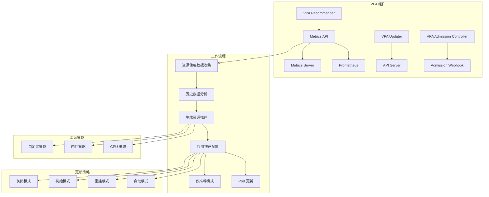

# Kubernetes VPA 配置指南

## VPA 概述

垂直 Pod 自动扩缩容（Vertical Pod Autoscaler，VPA）是 Kubernetes 中用于自动调整 Pod 资源请求和限制的重要组件。VPA 通过分析 Pod 的历史资源使用情况，自动推荐和调整 CPU 和内存的资源配置，帮助优化资源利用率和降低成本。

## VPA 架构和组件

### VPA 组件架构



### VPA 工作原理

**资源推荐算法**：
1. **数据收集**：从 Metrics API 收集历史资源使用数据
2. **统计分析**：分析不同时间窗口的资源使用模式
3. **推荐计算**：基于统计模型生成资源推荐值
4. **策略应用**：根据配置的策略应用推荐值

## VPA 安装和配置

### VPA 组件部署

**VPA 安装脚本**：
```bash
#!/bin/bash
# VPA 安装脚本

# 创建 VPA 命名空间
kubectl create namespace vpa-system

# 下载 VPA manifests
git clone https://github.com/kubernetes/autoscaler.git
cd autoscaler/vertical-pod-autoscaler

# 生成证书和密钥
./hack/vpa-up.sh

# 或者使用 Helm 安装
helm repo add fairwinds-stable https://charts.fairwinds.com/stable
helm install vpa fairwinds-stable/vpa --namespace vpa-system \
  --set recommender.enabled=true \
  --set updater.enabled=true \
  --set admissionController.enabled=true
```

**VPA Recommender 配置**：
```yaml
# VPA Recommender 部署
apiVersion: apps/v1
kind: Deployment
metadata:
  name: vpa-recommender
  namespace: vpa-system
spec:
  replicas: 1
  selector:
    matchLabels:
      app: vpa-recommender
  template:
    metadata:
      labels:
        app: vpa-recommender
    spec:
      serviceAccountName: vpa-recommender
      containers:
      - name: recommender
        image: k8s.gcr.io/autoscaling/vpa-recommender:0.13.0
        command:
        - ./recommender
        - --v=4
        - --stderrthreshold=info
        - --pod-recommendation-min-cpu-millicores=25
        - --pod-recommendation-min-memory-mb=250
        - --target-cpu-percentile=0.9
        - --recommendation-margin-fraction=0.15
        - --recommender-interval=1m
        resources:
          requests:
            cpu: 50m
            memory: 500Mi
          limits:
            cpu: 200m
            memory: 1000Mi
        ports:
        - containerPort: 8080
          name: metrics
        livenessProbe:
          httpGet:
            path: /health-check
            port: 8080
          initialDelaySeconds: 60
          periodSeconds: 5
        readinessProbe:
          httpGet:
            path: /health-check
            port: 8080
          initialDelaySeconds: 5
          periodSeconds: 5

---
# VPA Updater 配置
apiVersion: apps/v1
kind: Deployment
metadata:
  name: vpa-updater
  namespace: vpa-system
spec:
  replicas: 1
  selector:
    matchLabels:
      app: vpa-updater
  template:
    metadata:
      labels:
        app: vpa-updater
    spec:
      serviceAccountName: vpa-updater
      containers:
      - name: updater
        image: k8s.gcr.io/autoscaling/vpa-updater:0.13.0
        command:
        - ./updater
        - --v=4
        - --stderrthreshold=info
        - --min-replicas=2
        - --updater-interval=1m
        - --eviction-tolerance=0.5
        resources:
          requests:
            cpu: 50m
            memory: 500Mi
          limits:
            cpu: 200m
            memory: 1000Mi
        ports:
        - containerPort: 8080
          name: metrics

---
# VPA Admission Controller 配置
apiVersion: apps/v1
kind: Deployment
metadata:
  name: vpa-admission-controller
  namespace: vpa-system
spec:
  replicas: 1
  selector:
    matchLabels:
      app: vpa-admission-controller
  template:
    metadata:
      labels:
        app: vpa-admission-controller
    spec:
      serviceAccountName: vpa-admission-controller
      containers:
      - name: admission-controller
        image: k8s.gcr.io/autoscaling/vpa-admission-controller:0.13.0
        command:
        - ./admission-controller
        - --v=4
        - --stderrthreshold=info
        - --client-ca-file=/etc/tls-certs/caCert.pem
        - --tls-cert-file=/etc/tls-certs/serverCert.pem
        - --tls-private-key=/etc/tls-certs/serverKey.pem
        - --webhook-timeout-seconds=30
        env:
        - name: NAMESPACE
          valueFrom:
            fieldRef:
              fieldPath: metadata.namespace
        volumeMounts:
        - name: tls-certs
          mountPath: /etc/tls-certs
          readOnly: true
        resources:
          requests:
            cpu: 50m
            memory: 200Mi
          limits:
            cpu: 200m
            memory: 500Mi
        ports:
        - containerPort: 8000
          name: webhook
        - containerPort: 8080
          name: metrics
      volumes:
      - name: tls-certs
        secret:
          secretName: vpa-tls-certs
```

## VPA 基础配置

### 基本 VPA 资源配置

**推荐模式 VPA**：
```yaml
# 推荐模式 VPA - 仅提供建议，不自动更新
apiVersion: autoscaling.k8s.io/v1
kind: VerticalPodAutoscaler
metadata:
  name: web-app-vpa-recommend
  namespace: production
spec:
  targetRef:
    apiVersion: apps/v1
    kind: Deployment
    name: web-app
  updatePolicy:
    updateMode: "Off"    # 仅推荐模式
  resourcePolicy:
    containerPolicies:
    - containerName: web-container
      # 最小资源限制
      minAllowed:
        cpu: 100m
        memory: 128Mi
      # 最大资源限制
      maxAllowed:
        cpu: 2000m
        memory: 4Gi
      # 控制的资源类型
      controlledResources: ["cpu", "memory"]
      # 控制的值类型
      controlledValues: RequestsAndLimits

---
# 自动模式 VPA
apiVersion: autoscaling.k8s.io/v1
kind: VerticalPodAutoscaler
metadata:
  name: api-service-vpa-auto
  namespace: production
spec:
  targetRef:
    apiVersion: apps/v1
    kind: Deployment
    name: api-service
  updatePolicy:
    updateMode: "Auto"    # 自动更新模式
  resourcePolicy:
    containerPolicies:
    - containerName: api-container
      minAllowed:
        cpu: 200m
        memory: 256Mi
      maxAllowed:
        cpu: 4000m
        memory: 8Gi
      controlledResources: ["cpu", "memory"]
      controlledValues: RequestsAndLimits
    # 排除 sidecar 容器
    - containerName: logging-sidecar
      mode: "Off"

---
# 初始模式 VPA - 仅在 Pod 创建时设置资源
apiVersion: autoscaling.k8s.io/v1
kind: VerticalPodAutoscaler
metadata:
  name: batch-job-vpa-initial
  namespace: production
spec:
  targetRef:
    apiVersion: batch/v1
    kind: Job
    name: data-processing-job
  updatePolicy:
    updateMode: "Initial"    # 仅初始设置
  resourcePolicy:
    containerPolicies:
    - containerName: processor
      minAllowed:
        cpu: 500m
        memory: 1Gi
      maxAllowed:
        cpu: 8000m
        memory: 16Gi
      controlledResources: ["cpu", "memory"]
```

### 高级 VPA 配置

**多容器 VPA 配置**：
```yaml
# 多容器应用的 VPA 配置
apiVersion: autoscaling.k8s.io/v1
kind: VerticalPodAutoscaler
metadata:
  name: microservice-vpa
  namespace: production
spec:
  targetRef:
    apiVersion: apps/v1
    kind: Deployment
    name: microservice
  updatePolicy:
    updateMode: "Auto"
  resourcePolicy:
    containerPolicies:
    # 主应用容器
    - containerName: app
      minAllowed:
        cpu: 200m
        memory: 512Mi
      maxAllowed:
        cpu: 4000m
        memory: 8Gi
      controlledResources: ["cpu", "memory"]
      controlledValues: RequestsAndLimits
    # 数据库代理容器
    - containerName: db-proxy
      minAllowed:
        cpu: 100m
        memory: 256Mi
      maxAllowed:
        cpu: 1000m
        memory: 2Gi
      controlledResources: ["cpu", "memory"]
      controlledValues: RequestsOnly
    # 监控 sidecar - 禁用 VPA
    - containerName: metrics-exporter
      mode: "Off"
    # 日志 sidecar - 仅控制 CPU
    - containerName: log-collector
      controlledResources: ["cpu"]
      minAllowed:
        cpu: 50m
      maxAllowed:
        cpu: 500m

---
# 有状态应用的 VPA 配置
apiVersion: autoscaling.k8s.io/v1
kind: VerticalPodAutoscaler
metadata:
  name: database-vpa
  namespace: production
spec:
  targetRef:
    apiVersion: apps/v1
    kind: StatefulSet
    name: postgresql
  updatePolicy:
    updateMode: "Auto"
    # 有状态应用的更新策略
    minReplicas: 1    # 确保至少保留一个副本
  resourcePolicy:
    containerPolicies:
    - containerName: postgresql
      minAllowed:
        cpu: 500m
        memory: 2Gi
      maxAllowed:
        cpu: 8000m
        memory: 32Gi
      controlledResources: ["cpu", "memory"]
      controlledValues: RequestsAndLimits
```

## VPA 更新策略详解

### 更新模式对比

**不同更新模式的特点**：
```yaml
# 更新模式配置示例
apiVersion: v1
kind: ConfigMap
metadata:
  name: vpa-update-modes-guide
data:
  update-modes.yaml: |
    # Off 模式 - 仅推荐
    # 特点：
    # - 不会自动更新 Pod
    # - 提供资源推荐值
    # - 适用于生产环境观察
    updateMode: "Off"
    
    # Initial 模式 - 仅在创建时设置
    # 特点：
    # - 仅在 Pod 创建时应用推荐
    # - 不会重启现有 Pod
    # - 适用于新部署的应用
    updateMode: "Initial"
    
    # Auto 模式 - 自动更新
    # 特点：
    # - 自动应用推荐值
    # - 会重启 Pod 以应用新配置
    # - 适用于无状态应用
    updateMode: "Auto"
    
    # Recreate 模式 - 强制重建
    # 特点：
    # - 强制重建 Pod
    # - 立即应用推荐值
    # - 可能造成服务中断
    updateMode: "Recreate"

---
# 渐进式更新策略
apiVersion: autoscaling.k8s.io/v1
kind: VerticalPodAutoscaler
metadata:
  name: gradual-update-vpa
  namespace: production
spec:
  targetRef:
    apiVersion: apps/v1
    kind: Deployment
    name: web-service
  updatePolicy:
    updateMode: "Auto"
    # 最小副本数确保服务可用性
    minReplicas: 2
  resourcePolicy:
    containerPolicies:
    - containerName: web
      minAllowed:
        cpu: 100m
        memory: 128Mi
      maxAllowed:
        cpu: 2000m
        memory: 4Gi
      controlledResources: ["cpu", "memory"]
      controlledValues: RequestsAndLimits
```

### 安全更新配置

**生产环境安全更新策略**：
```yaml
# 生产环境 VPA 安全配置
apiVersion: autoscaling.k8s.io/v1
kind: VerticalPodAutoscaler
metadata:
  name: production-safe-vpa
  namespace: production
  annotations:
    vpa.autoscaling.k8s.io/safe-to-evict: "true"
spec:
  targetRef:
    apiVersion: apps/v1
    kind: Deployment
    name: critical-service
  updatePolicy:
    updateMode: "Auto"
    # 设置最小副本数保证可用性
    minReplicas: 3
  resourcePolicy:
    containerPolicies:
    - containerName: service
      # 保守的资源范围
      minAllowed:
        cpu: 500m
        memory: 1Gi
      maxAllowed:
        cpu: 4000m
        memory: 8Gi
      # 仅控制请求值，保持限制值不变
      controlledValues: RequestsOnly
      controlledResources: ["cpu", "memory"]

---
# 目标 Deployment 配置要求
apiVersion: apps/v1
kind: Deployment
metadata:
  name: critical-service
  namespace: production
spec:
  replicas: 5    # 足够的副本数
  strategy:
    type: RollingUpdate
    rollingUpdate:
      maxUnavailable: 1    # 限制不可用副本数
      maxSurge: 1
  selector:
    matchLabels:
      app: critical-service
  template:
    metadata:
      labels:
        app: critical-service
      annotations:
        # 允许 VPA 驱逐此 Pod
        cluster-autoscaler.kubernetes.io/safe-to-evict: "true"
    spec:
      containers:
      - name: service
        image: critical-service:latest
        # 初始资源配置
        resources:
          requests:
            cpu: 1000m
            memory: 2Gi
          limits:
            cpu: 3000m
            memory: 6Gi
        # Pod 中断预算
        readinessProbe:
          httpGet:
            path: /health
            port: 8080
          initialDelaySeconds: 10
          periodSeconds: 5
        livenessProbe:
          httpGet:
            path: /health
            port: 8080
          initialDelaySeconds: 30
          periodSeconds: 10
        # 优雅终止
        lifecycle:
          preStop:
            exec:
              command: ["/bin/sh", "-c", "sleep 15"]
      terminationGracePeriodSeconds: 30
```

## VPA 与 HPA 协同

### VPA + HPA 组合配置

**VPA 和 HPA 同时使用**：
```yaml
# VPA 配置 - 负责垂直扩缩容
apiVersion: autoscaling.k8s.io/v1
kind: VerticalPodAutoscaler
metadata:
  name: app-vpa
  namespace: production
spec:
  targetRef:
    apiVersion: apps/v1
    kind: Deployment
    name: scalable-app
  updatePolicy:
    updateMode: "Auto"
  resourcePolicy:
    containerPolicies:
    - containerName: app
      minAllowed:
        cpu: 100m
        memory: 128Mi
      maxAllowed:
        cpu: 2000m
        memory: 4Gi
      # 只控制内存，让 HPA 控制 CPU
      controlledResources: ["memory"]
      controlledValues: RequestsAndLimits

---
# HPA 配置 - 负责水平扩缩容
apiVersion: autoscaling/v2
kind: HorizontalPodAutoscaler
metadata:
  name: app-hpa
  namespace: production
spec:
  scaleTargetRef:
    apiVersion: apps/v1
    kind: Deployment
    name: scalable-app
  minReplicas: 3
  maxReplicas: 20
  metrics:
  - type: Resource
    resource:
      name: cpu
      target:
        type: Utilization
        averageUtilization: 70
  # 自定义指标
  - type: Pods
    pods:
      metric:
        name: http_requests_per_second
      target:
        type: AverageValue
        averageValue: "100"
  behavior:
    scaleUp:
      stabilizationWindowSeconds: 300
      policies:
      - type: Percent
        value: 50
        periodSeconds: 60
    scaleDown:
      stabilizationWindowSeconds: 600
      policies:
      - type: Percent
        value: 25
        periodSeconds: 300

---
# 目标应用部署
apiVersion: apps/v1
kind: Deployment
metadata:
  name: scalable-app
  namespace: production
spec:
  replicas: 5
  selector:
    matchLabels:
      app: scalable-app
  template:
    metadata:
      labels:
        app: scalable-app
    spec:
      containers:
      - name: app
        image: scalable-app:latest
        resources:
          requests:
            cpu: 200m
            memory: 256Mi
          limits:
            cpu: 1000m
            memory: 2Gi
        ports:
        - containerPort: 8080
```

### 避免冲突的最佳实践

**VPA 和 HPA 协调配置**：
```yaml
# 协调配置示例
apiVersion: v1
kind: ConfigMap
metadata:
  name: vpa-hpa-coordination-guide
data:
  best-practices.yaml: |
    # VPA 和 HPA 协调使用的最佳实践：
    
    # 1. 资源分离策略
    # - VPA 控制内存资源
    # - HPA 控制 CPU 相关的水平扩缩容
    vpa_controlled_resources: ["memory"]
    hpa_controlled_metrics: ["cpu", "custom_metrics"]
    
    # 2. 更新策略配置
    # - VPA 使用较保守的更新策略
    # - HPA 使用较长的稳定窗口
    vpa_update_mode: "Auto"
    hpa_stabilization_window: "10m"
    
    # 3. 资源范围设置
    # - 设置合理的 VPA 资源范围
    # - 避免 VPA 推荐值影响 HPA 决策
    vpa_min_memory: "256Mi"
    vpa_max_memory: "8Gi"
    
    # 4. 监控和调优
    # - 监控 VPA 和 HPA 的决策冲突
    # - 定期调整策略避免相互干扰
    monitoring_metrics:
      - vpa_recommendation_changes
      - hpa_scaling_events
      - resource_utilization_trends
```

## VPA 监控和故障排查

### VPA 性能监控

**VPA 监控指标配置**：
```yaml
# VPA 监控规则
apiVersion: v1
kind: ConfigMap
metadata:
  name: vpa-monitoring-rules
data:
  vpa-rules.yml: |
    groups:
    - name: vpa-performance
      rules:
      # VPA 推荐准确性
      - record: vpa:recommendation_accuracy:ratio
        expr: |
          (
            vpa_pod_recommendation_cpu_target /
            container_spec_cpu_quota * container_spec_cpu_period
          )
      
      # VPA 更新频率
      - record: vpa:update_frequency:rate1h
        expr: |
          increase(vpa_updater_evictions_total[1h])
      
      # VPA 推荐值变化
      - record: vpa:recommendation_change:rate1h
        expr: |
          increase(vpa_recommender_recommendations_total[1h])
      
      # VPA 覆盖率
      - record: vpa:coverage:ratio
        expr: |
          count(kube_verticalpodautoscaler_status_recommendation) /
          count(kube_deployment_status_replicas)
      
      # VPA 组件健康状态
      - record: vpa:component_health:up
        expr: |
          up{job=~"vpa-.*"}

---
# VPA 告警规则
apiVersion: v1
kind: ConfigMap
metadata:
  name: vpa-alerts
data:
  vpa-alerts.yml: |
    groups:
    - name: vpa-alerts
      rules:
      # VPA 组件不可用
      - alert: VPAComponentDown
        expr: |
          vpa:component_health:up == 0
        for: 5m
        labels:
          severity: critical
          component: vpa
        annotations:
          summary: "VPA 组件 {{ $labels.job }} 不可用"
          description: "VPA 组件已停止工作超过 5 分钟"
      
      # VPA 推荐值异常
      - alert: VPAAbnormalRecommendation
        expr: |
          vpa_pod_recommendation_cpu_target > 10 or
          vpa_pod_recommendation_memory_target > 50 * 1024 * 1024 * 1024
        for: 10m
        labels:
          severity: warning
          component: vpa
        annotations:
          summary: "VPA 推荐值异常高"
          description: "VPA 推荐的资源值可能异常：CPU {{ $value }} 核或内存过高"
      
      # VPA 更新过于频繁
      - alert: VPAFrequentUpdates
        expr: |
          vpa:update_frequency:rate1h > 10
        for: 15m
        labels:
          severity: warning
          component: vpa
        annotations:
          summary: "VPA 更新过于频繁"
          description: "1小时内 VPA 更新了 {{ $value }} 次，可能存在配置问题"
      
      # VPA 推荐值无变化
      - alert: VPANoRecommendationUpdates
        expr: |
          increase(vpa_recommender_recommendations_total[24h]) == 0
        for: 1h
        labels:
          severity: warning
          component: vpa
        annotations:
          summary: "VPA 24小时无推荐更新"
          description: "VPA 可能存在数据收集或计算问题"
```

### VPA 故障排查

**VPA 诊断脚本**：
```bash
#!/bin/bash
# VPA 故障排查脚本

# 函数：检查 VPA 组件状态
check_vpa_components() {
    echo "=== VPA 组件状态检查 ==="
    
    # 检查 VPA 组件 Pod
    echo "1. VPA 组件 Pod 状态:"
    kubectl get pods -n vpa-system -l app.kubernetes.io/name=vpa
    
    # 检查 VPA CRD
    echo -e "\n2. VPA CRD 状态:"
    kubectl get crd verticalpodautoscalers.autoscaling.k8s.io
    
    # 检查 VPA Webhook 配置
    echo -e "\n3. VPA Webhook 配置:"
    kubectl get mutatingwebhookconfiguration vpa-webhook-config
    
    # 检查 VPA 组件日志
    echo -e "\n4. VPA 组件日志检查:"
    for component in recommender updater admission-controller; do
        echo "--- VPA $component 日志 ---"
        kubectl logs -n vpa-system -l app=vpa-$component --tail=10
    done
}

# 函数：分析 VPA 配置
analyze_vpa_configs() {
    echo -e "\n=== VPA 配置分析 ==="
    
    # 获取所有 VPA 配置
    echo "1. 当前 VPA 配置:"
    kubectl get vpa --all-namespaces -o wide
    
    # 分析 VPA 详细状态
    echo -e "\n2. VPA 详细状态:"
    for vpa in $(kubectl get vpa --all-namespaces -o jsonpath='{range .items[*]}{.metadata.namespace}{" "}{.metadata.name}{"\n"}{end}'); do
        namespace=$(echo $vpa | awk '{print $1}')
        name=$(echo $vpa | awk '{print $2}')
        
        echo "VPA: $namespace/$name"
        kubectl describe vpa -n $namespace $name | grep -A20 "Status:"
        echo "---"
    done
}

# 函数：检查目标应用状态
check_target_apps() {
    echo -e "\n=== 目标应用状态检查 ==="
    
    # 检查 VPA 目标应用
    echo "1. VPA 目标应用状态:"
    kubectl get vpa --all-namespaces -o json | jq -r '
        .items[] | 
        "\(.metadata.namespace) \(.metadata.name) \(.spec.targetRef.kind) \(.spec.targetRef.name)"
    ' | while read namespace vpa_name kind target_name; do
        echo "检查 VPA: $namespace/$vpa_name -> $kind/$target_name"
        
        case $kind in
            "Deployment")
                kubectl get deployment -n $namespace $target_name -o jsonpath='{.metadata.name}{" "}{.status.replicas}{" "}{.status.readyReplicas}{"\n"}' 2>/dev/null || echo "  目标 Deployment 不存在"
                ;;
            "StatefulSet")
                kubectl get statefulset -n $namespace $target_name -o jsonpath='{.metadata.name}{" "}{.status.replicas}{" "}{.status.readyReplicas}{"\n"}' 2>/dev/null || echo "  目标 StatefulSet 不存在"
                ;;
            *)
                echo "  未知的目标类型: $kind"
                ;;
        esac
    done
}

# 函数：检查指标可用性
check_metrics_availability() {
    echo -e "\n=== 指标可用性检查 ==="
    
    # 检查 metrics-server
    echo "1. Metrics Server 状态:"
    kubectl get pods -n kube-system -l k8s-app=metrics-server
    
    # 检查指标查询
    echo -e "\n2. 测试指标查询:"
    kubectl top nodes 2>/dev/null || echo "节点指标不可用"
    kubectl top pods --all-namespaces | head -5 2>/dev/null || echo "Pod 指标不可用"
    
    # 检查 VPA 指标
    echo -e "\n3. VPA 内部指标:"
    for component in recommender updater admission-controller; do
        pod=$(kubectl get pods -n vpa-system -l app=vpa-$component -o jsonpath='{.items[0].metadata.name}' 2>/dev/null)
        if [ ! -z "$pod" ]; then
            echo "VPA $component 指标端点:"
            kubectl exec -n vpa-system $pod -- wget -qO- http://localhost:8080/metrics 2>/dev/null | head -5 || echo "  指标不可用"
        fi
    done
}

# 函数：VPA 优化建议
vpa_optimization_recommendations() {
    echo -e "\n=== VPA 优化建议 ==="
    
    # 检查 VPA 配置问题
    echo "1. VPA 配置检查:"
    kubectl get vpa --all-namespaces -o json | jq -r '
        .items[] | 
        select(.spec.resourcePolicy.containerPolicies[]?.minAllowed.cpu == .spec.resourcePolicy.containerPolicies[]?.maxAllowed.cpu) |
        "\(.metadata.namespace)/\(.metadata.name): CPU 范围配置可能过窄"
    '
    
    # 检查更新模式
    echo -e "\n2. 更新模式分析:"
    kubectl get vpa --all-namespaces -o json | jq -r '
        .items[] | 
        "\(.metadata.namespace)/\(.metadata.name): \(.spec.updatePolicy.updateMode // "未设置")"
    '
    
    # 优化建议
    echo -e "\n3. 通用优化建议:"
    echo "   - 确保 VPA 组件正常运行"
    echo "   - 检查目标应用的资源使用历史"
    echo "   - 设置合理的资源范围避免推荐值过大"
    echo "   - 在生产环境先使用 'Off' 模式观察推荐值"
    echo "   - 避免 VPA 和 HPA 在同一资源上冲突"
    echo "   - 定期检查和调整 VPA 配置"
}

# 主函数
main() {
    echo "Kubernetes VPA 故障排查工具"
    echo "========================="
    
    check_vpa_components
    analyze_vpa_configs
    check_target_apps
    check_metrics_availability
    vpa_optimization_recommendations
    
    echo -e "\n故障排查完成！"
}

# 执行主函数
main
```

## VPA 最佳实践

### 配置最佳实践

**1. 渐进式部署策略**：
```yaml
# 阶段 1: 观察模式
apiVersion: autoscaling.k8s.io/v1
kind: VerticalPodAutoscaler
metadata:
  name: app-vpa-observe
spec:
  targetRef:
    apiVersion: apps/v1
    kind: Deployment
    name: my-app
  updatePolicy:
    updateMode: "Off"    # 先观察推荐值

---
# 阶段 2: 初始模式
apiVersion: autoscaling.k8s.io/v1
kind: VerticalPodAutoscaler
metadata:
  name: app-vpa-initial
spec:
  targetRef:
    apiVersion: apps/v1
    kind: Deployment
    name: my-app
  updatePolicy:
    updateMode: "Initial"    # 仅新 Pod 应用推荐

---
# 阶段 3: 自动模式
apiVersion: autoscaling.k8s.io/v1
kind: VerticalPodAutoscaler
metadata:
  name: app-vpa-auto
spec:
  targetRef:
    apiVersion: apps/v1
    kind: Deployment
    name: my-app
  updatePolicy:
    updateMode: "Auto"    # 完全自动化
```

**2. 安全配置指南**：
- 设置合理的资源范围，避免推荐值过大
- 在生产环境使用保守的更新策略
- 确保足够的副本数维持服务可用性
- 配置适当的 Pod 中断预算
- 监控 VPA 行为和推荐准确性

**3. 性能调优建议**：
- 调整 VPA 组件的资源配置
- 优化指标收集频率和保留期
- 配置适当的推荐计算参数
- 使用标签选择器精确控制 VPA 作用范围

通过遵循这些最佳实践，可以充分发挥 VPA 的优势，实现应用资源的自动化优化和成本控制。
