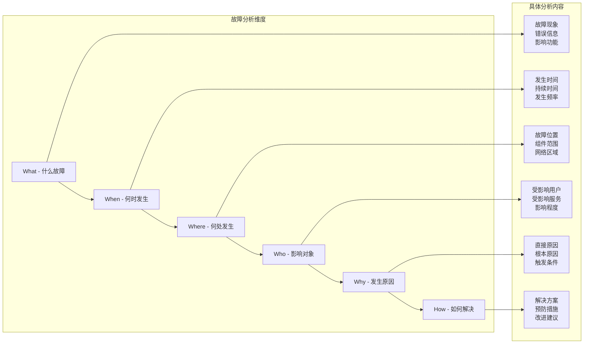

# Kubernetes 故障排查

## 故障排查概述

Kubernetes 故障排查是确保集群稳定运行的关键能力。通过系统化的排查方法、有效的工具使用和丰富的实践经验，可以快速定位和解决各种故障问题。

**故障排查原则**：
- **系统性方法**：遵循结构化的排查流程和方法论
- **分层分析**：从应用层到基础设施层逐层排查
- **数据驱动**：基于监控数据和日志信息进行分析
- **快速响应**：优先恢复服务，后续深入分析根因

## 故障排查体系架构

```mermaid
graph TB
    subgraph "故障发现层"
        direction TB
        MONITORING[监控告警] --> ALERT_MANAGER[Alertmanager]
        USER_FEEDBACK[用户反馈] --> SUPPORT_TICKET[工单系统]
        HEALTH_CHECK[健康检查] --> PROBE_FAILURE[探针失败]
        AUTO_DETECTION[自动检测] --> ANOMALY[异常检测]
        
        ALERT_MANAGER --> INCIDENT[事件触发]
        SUPPORT_TICKET --> INCIDENT
        PROBE_FAILURE --> INCIDENT
        ANOMALY --> INCIDENT
    end
    
    subgraph "故障分析层"
        direction TB
        INCIDENT --> TRIAGE[故障分类]
        TRIAGE --> SEVERITY[严重性评估]
        SEVERITY --> IMPACT[影响范围分析]
        IMPACT --> DATA_COLLECTION[数据收集]
        
        DATA_COLLECTION --> LOGS[日志分析]
        DATA_COLLECTION --> METRICS[指标分析]
        DATA_COLLECTION --> TRACES[链路追踪]
        DATA_COLLECTION --> CONFIG[配置检查]
    end
    
    subgraph "故障定位层"
        direction TB
        LOGS --> LOG_ANALYSIS[日志分析]
        METRICS --> METRIC_ANALYSIS[指标分析]
        TRACES --> TRACE_ANALYSIS[链路分析]
        CONFIG --> CONFIG_ANALYSIS[配置分析]
        
        LOG_ANALYSIS --> ROOT_CAUSE[根因分析]
        METRIC_ANALYSIS --> ROOT_CAUSE
        TRACE_ANALYSIS --> ROOT_CAUSE
        CONFIG_ANALYSIS --> ROOT_CAUSE
        
        ROOT_CAUSE --> HYPOTHESIS[假设验证]
        HYPOTHESIS --> REPRODUCE[故障复现]
    end
    
    subgraph "故障解决层"
        direction TB
        REPRODUCE --> MITIGATION[缓解措施]
        MITIGATION --> WORKAROUND[临时方案]
        WORKAROUND --> PERMANENT_FIX[永久修复]
        PERMANENT_FIX --> VERIFICATION[修复验证]
        
        VERIFICATION --> ROLLBACK[回滚准备]
        VERIFICATION --> MONITORING_POST[修复后监控]
        ROLLBACK --> MONITORING_POST
    end
    
    subgraph "故障预防层"
        direction TB
        MONITORING_POST --> POSTMORTEM[故障复盘]
        POSTMORTEM --> LESSONS_LEARNED[经验总结]
        LESSONS_LEARNED --> PROCESS_IMPROVEMENT[流程改进]
        PROCESS_IMPROVEMENT --> PREVENTION[预防措施]
        
        PREVENTION --> MONITORING_RULES[监控规则]
        PREVENTION --> AUTOMATION[自动化]
        PREVENTION --> DOCUMENTATION[文档更新]
        PREVENTION --> TRAINING[团队培训]
    end
    
    %% 样式定义
    classDef discovery fill:#e3f2fd,stroke:#1976d2,stroke-width:2px
    classDef analysis fill:#f3e5f5,stroke:#7b1fa2,stroke-width:2px
    classDef location fill:#e8f5e8,stroke:#388e3c,stroke-width:2px
    classDef resolution fill:#fff3e0,stroke:#f57c00,stroke-width:2px
    classDef prevention fill:#fce4ec,stroke:#c2185b,stroke-width:2px
    
    class MONITORING,ALERT_MANAGER,USER_FEEDBACK,SUPPORT_TICKET,HEALTH_CHECK,PROBE_FAILURE,AUTO_DETECTION,ANOMALY,INCIDENT discovery
    class TRIAGE,SEVERITY,IMPACT,DATA_COLLECTION,LOGS,METRICS,TRACES,CONFIG analysis
    class LOG_ANALYSIS,METRIC_ANALYSIS,TRACE_ANALYSIS,CONFIG_ANALYSIS,ROOT_CAUSE,HYPOTHESIS,REPRODUCE location
    class MITIGATION,WORKAROUND,PERMANENT_FIX,VERIFICATION,ROLLBACK,MONITORING_POST resolution
    class POSTMORTEM,LESSONS_LEARNED,PROCESS_IMPROVEMENT,PREVENTION,MONITORING_RULES,AUTOMATION,DOCUMENTATION,TRAINING prevention
```



## 诊断方法论

### 系统性故障排查流程

**5W1H 分析法**：


**故障分类和优先级**：
```yaml
# 故障严重性分级
severity_levels:
  P0_Critical:
    description: "核心业务完全不可用"
    response_time: "15分钟内"
    escalation: "立即通知所有相关人员"
    examples:
      - "整个集群宕机"
      - "核心API服务不可用"
      - "数据丢失或损坏"
  
  P1_High:
    description: "重要功能受到严重影响"
    response_time: "1小时内"
    escalation: "通知值班工程师和团队负责人"
    examples:
      - "部分节点故障"
      - "重要服务性能严重下降"
      - "安全漏洞"
  
  P2_Medium:
    description: "功能部分受限但有替代方案"
    response_time: "4小时内"
    escalation: "通知相关开发团队"
    examples:
      - "非核心服务异常"
      - "监控告警"
      - "容量不足警告"
  
  P3_Low:
    description: "轻微影响或潜在问题"
    response_time: "下一个工作日"
    escalation: "记录到问题跟踪系统"
    examples:
      - "性能优化建议"
      - "配置不一致"
      - "文档更新需求"
```

## 常见故障类型和解决方案

### Pod 故障排查

**Pod 状态异常**：
```bash
# 检查 Pod 状态和事件
kubectl get pods -o wide
kubectl describe pod <pod-name>
kubectl get events --sort-by=.metadata.creationTimestamp

# Pod 状态分析
case $POD_STATUS in
  "Pending")
    echo "Pod 调度问题："
    echo "1. 检查资源是否充足"
    echo "2. 检查节点亲和性配置"
    echo "3. 检查污点和容忍度"
    kubectl top nodes
    kubectl describe node <node-name>
    ;;
  "ImagePullBackOff"|"ErrImagePull")
    echo "镜像拉取问题："
    echo "1. 检查镜像名称和标签"
    echo "2. 检查镜像仓库访问权限"
    echo "3. 检查网络连接"
    kubectl describe pod <pod-name> | grep -A 5 "Events"
    ;;
  "CrashLoopBackOff")
    echo "容器启动失败："
    echo "1. 检查应用日志"
    echo "2. 检查健康检查配置"
    echo "3. 检查资源限制"
    kubectl logs <pod-name> --previous
    ;;
  "Running")
    echo "Pod 运行正常，检查应用层面问题"
    kubectl exec -it <pod-name> -- /bin/bash
    ;;
esac
```

**容器重启频繁**：
```yaml
# 优化健康检查配置
apiVersion: v1
kind: Pod
metadata:
  name: debug-app
spec:
  containers:
  - name: app
    image: nginx
    # 启动探针 - 给应用足够的启动时间
    startupProbe:
      httpGet:
        path: /health
        port: 8080
      initialDelaySeconds: 30
      periodSeconds: 10
      timeoutSeconds: 5
      failureThreshold: 30  # 5分钟启动时间
    # 存活探针 - 检测应用是否需要重启
    livenessProbe:
      httpGet:
        path: /health
        port: 8080
      initialDelaySeconds: 60
      periodSeconds: 30
      timeoutSeconds: 5
      failureThreshold: 3
    # 就绪探针 - 检测应用是否准备好接收流量
    readinessProbe:
      httpGet:
        path: /ready
        port: 8080
      initialDelaySeconds: 10
      periodSeconds: 5
      timeoutSeconds: 3
      failureThreshold: 3
    resources:
      requests:
        cpu: 100m
        memory: 128Mi
      limits:
        cpu: 500m
        memory: 512Mi
```

### 网络故障排查

**Service 连接问题**：
```bash
#!/bin/bash
# Service 网络排查脚本

SERVICE_NAME=$1
NAMESPACE=${2:-default}

echo "=== Service 网络排查 ==="
echo "Service: $SERVICE_NAME"
echo "Namespace: $NAMESPACE"

# 1. 检查 Service 配置
echo -e "\n1. Service 配置："
kubectl get service $SERVICE_NAME -n $NAMESPACE -o yaml

# 2. 检查 Endpoints
echo -e "\n2. Endpoints 检查："
kubectl get endpoints $SERVICE_NAME -n $NAMESPACE
kubectl describe endpoints $SERVICE_NAME -n $NAMESPACE

# 3. 检查后端 Pod
echo -e "\n3. 后端 Pod 状态："
SELECTOR=$(kubectl get service $SERVICE_NAME -n $NAMESPACE -o jsonpath='{.spec.selector}' | tr -d '{}' | tr ',' '\n')
echo "Selector: $SELECTOR"
kubectl get pods -n $NAMESPACE -l "$(echo $SELECTOR | tr '\n' ',' | sed 's/,$//')"

# 4. 网络连通性测试
echo -e "\n4. 网络连通性测试："
SERVICE_IP=$(kubectl get service $SERVICE_NAME -n $NAMESPACE -o jsonpath='{.spec.clusterIP}')
SERVICE_PORT=$(kubectl get service $SERVICE_NAME -n $NAMESPACE -o jsonpath='{.spec.ports[0].port}')

# 创建测试 Pod
kubectl run network-test --image=busybox --rm -i --tty --restart=Never -- sh -c "
echo 'Testing connectivity to $SERVICE_IP:$SERVICE_PORT'
nc -zv $SERVICE_IP $SERVICE_PORT
nslookup $SERVICE_NAME.$NAMESPACE.svc.cluster.local
"

# 5. DNS 解析测试
echo -e "\n5. DNS 解析测试："
kubectl run dns-test --image=busybox --rm -i --tty --restart=Never -- nslookup $SERVICE_NAME.$NAMESPACE.svc.cluster.local

# 6. kube-proxy 状态检查
echo -e "\n6. kube-proxy 状态："
kubectl get pods -n kube-system -l k8s-app=kube-proxy
```

**DNS 解析问题**：
```bash
# CoreDNS 故障排查
echo "=== CoreDNS 故障排查 ==="

# 1. 检查 CoreDNS Pod 状态
kubectl get pods -n kube-system -l k8s-app=kube-dns

# 2. 检查 CoreDNS 配置
kubectl get configmap coredns -n kube-system -o yaml

# 3. 检查 CoreDNS 日志
kubectl logs -n kube-system -l k8s-app=kube-dns

# 4. DNS 性能测试
kubectl apply -f - <<EOF
apiVersion: v1
kind: Pod
metadata:
  name: dns-test
spec:
  containers:
  - name: dns-test
    image: busybox
    command: ['sleep', '3600']
EOF

# 等待 Pod 就绪
kubectl wait --for=condition=Ready pod/dns-test

# 执行 DNS 测试
kubectl exec dns-test -- nslookup kubernetes.default.svc.cluster.local
kubectl exec dns-test -- dig +short kubernetes.default.svc.cluster.local
kubectl exec dns-test -- cat /etc/resolv.conf

# 清理测试 Pod
kubectl delete pod dns-test
```

### 存储故障排查

**PV/PVC 绑定问题**：
```bash
#!/bin/bash
# 存储故障排查脚本

PVC_NAME=$1
NAMESPACE=${2:-default}

echo "=== 存储故障排查 ==="
echo "PVC: $PVC_NAME"
echo "Namespace: $NAMESPACE"

# 1. 检查 PVC 状态
echo -e "\n1. PVC 状态："
kubectl get pvc $PVC_NAME -n $NAMESPACE
kubectl describe pvc $PVC_NAME -n $NAMESPACE

# 2. 检查可用的 PV
echo -e "\n2. 可用 PV："
kubectl get pv

# 3. 检查 StorageClass
STORAGE_CLASS=$(kubectl get pvc $PVC_NAME -n $NAMESPACE -o jsonpath='{.spec.storageClassName}')
if [ "$STORAGE_CLASS" != "null" ] && [ "$STORAGE_CLASS" != "" ]; then
    echo -e "\n3. StorageClass 配置："
    kubectl describe storageclass $STORAGE_CLASS
else
    echo -e "\n3. 未指定 StorageClass"
fi

# 4. 检查 CSI Driver
echo -e "\n4. CSI Driver 状态："
kubectl get csidriver
kubectl get pods -n kube-system | grep csi

# 5. 检查节点存储状态
echo -e "\n5. 节点存储状态："
kubectl get nodes -o custom-columns="NAME:.metadata.name,STATUS:.status.conditions[?(@.type=='Ready')].status,STORAGE:.status.allocatable.ephemeral-storage"

# 6. 检查存储事件
echo -e "\n6. 存储相关事件："
kubectl get events -n $NAMESPACE --field-selector involvedObject.kind=PersistentVolumeClaim,involvedObject.name=$PVC_NAME
```

**存储性能问题**：
```yaml
# 存储性能测试 Job
apiVersion: batch/v1
kind: Job
metadata:
  name: storage-benchmark
spec:
  template:
    spec:
      containers:
      - name: fio-test
        image: dmonakhov/fio
        command: ["/bin/sh"]
        args:
        - -c
        - |
          echo "=== 存储性能测试 ==="
          
          # 顺序读写测试
          echo "1. 顺序写测试："
          fio --name=seqwrite --rw=write --bs=1M --size=1G --numjobs=1 --filename=/data/testfile
          
          echo "2. 顺序读测试："
          fio --name=seqread --rw=read --bs=1M --size=1G --numjobs=1 --filename=/data/testfile
          
          # 随机读写测试
          echo "3. 随机写测试："
          fio --name=randwrite --rw=randwrite --bs=4k --size=1G --numjobs=4 --filename=/data/testfile2
          
          echo "4. 随机读测试："
          fio --name=randread --rw=randread --bs=4k --size=1G --numjobs=4 --filename=/data/testfile2
          
          # 清理测试文件
          rm -f /data/testfile*
        volumeMounts:
        - name: test-volume
          mountPath: /data
      volumes:
      - name: test-volume
        persistentVolumeClaim:
          claimName: storage-test-pvc
      restartPolicy: Never
```

## 集群级别故障排查

### 控制平面故障

**API Server 故障排查**：
```bash
#!/bin/bash
# API Server 故障排查

echo "=== API Server 故障排查 ==="

# 1. 检查 API Server Pod 状态
echo "1. API Server Pod 状态："
kubectl get pods -n kube-system | grep kube-apiserver

# 2. 检查 API Server 日志
echo -e "\n2. API Server 日志："
kubectl logs -n kube-system kube-apiserver-$(hostname) --tail=50

# 3. 检查 API Server 连接
echo -e "\n3. API Server 连接测试："
curl -k https://localhost:6443/healthz
curl -k https://localhost:6443/version

# 4. 检查 etcd 连接
echo -e "\n4. etcd 连接状态："
kubectl get componentstatuses

# 5. 检查证书有效性
echo -e "\n5. 证书检查："
openssl x509 -in /etc/kubernetes/pki/apiserver.crt -text -noout | grep -A 2 "Validity"

# 6. 检查负载均衡器（如果使用）
echo -e "\n6. 负载均衡器状态："
# 这里需要根据实际环境调整
# kubectl get endpoints kubernetes -o yaml
```

**etcd 故障排查**：
```bash
#!/bin/bash
# etcd 故障排查

echo "=== etcd 故障排查 ==="

# 1. 检查 etcd 集群状态
echo "1. etcd 集群成员："
ETCDCTL_API=3 etcdctl \
  --endpoints=localhost:2379 \
  --cacert=/etc/kubernetes/pki/etcd/ca.crt \
  --cert=/etc/kubernetes/pki/etcd/server.crt \
  --key=/etc/kubernetes/pki/etcd/server.key \
  member list

# 2. 检查 etcd 健康状态
echo -e "\n2. etcd 健康检查："
ETCDCTL_API=3 etcdctl \
  --endpoints=localhost:2379 \
  --cacert=/etc/kubernetes/pki/etcd/ca.crt \
  --cert=/etc/kubernetes/pki/etcd/server.crt \
  --key=/etc/kubernetes/pki/etcd/server.key \
  endpoint health

# 3. 检查 etcd 性能
echo -e "\n3. etcd 性能检查："
ETCDCTL_API=3 etcdctl \
  --endpoints=localhost:2379 \
  --cacert=/etc/kubernetes/pki/etcd/ca.crt \
  --cert=/etc/kubernetes/pki/etcd/server.crt \
  --key=/etc/kubernetes/pki/etcd/server.key \
  check perf

# 4. 检查 etcd 日志
echo -e "\n4. etcd 日志："
kubectl logs -n kube-system etcd-$(hostname) --tail=20

# 5. 检查磁盘空间
echo -e "\n5. etcd 数据目录磁盘使用："
du -sh /var/lib/etcd/
df -h /var/lib/etcd/
```

### 节点故障排查

**节点状态异常**：
```bash
#!/bin/bash
# 节点故障排查脚本

NODE_NAME=$1

echo "=== 节点故障排查 ==="
echo "节点: $NODE_NAME"

# 1. 检查节点状态
echo -e "\n1. 节点状态："
kubectl get node $NODE_NAME -o wide
kubectl describe node $NODE_NAME

# 2. 检查节点资源使用
echo -e "\n2. 节点资源使用："
kubectl top node $NODE_NAME

# 3. 检查节点上的 Pod
echo -e "\n3. 节点上的 Pod："
kubectl get pods --all-namespaces --field-selector spec.nodeName=$NODE_NAME

# 4. 检查 kubelet 状态
echo -e "\n4. kubelet 状态："
ssh $NODE_NAME "systemctl status kubelet"

# 5. 检查 kubelet 日志
echo -e "\n5. kubelet 日志："
ssh $NODE_NAME "journalctl -u kubelet -n 20"

# 6. 检查容器运行时
echo -e "\n6. 容器运行时状态："
ssh $NODE_NAME "systemctl status containerd"

# 7. 检查磁盘空间
echo -e "\n7. 磁盘空间："
ssh $NODE_NAME "df -h"

# 8. 检查网络连接
echo -e "\n8. 网络连接："
ssh $NODE_NAME "ping -c 3 8.8.8.8"

# 9. 检查系统负载
echo -e "\n9. 系统负载："
ssh $NODE_NAME "uptime && free -h"
```

## 排查工具和命令

### 基础诊断命令

**Pod 调试命令集**：
```bash
# Pod 基础信息
kubectl get pods -o wide --show-labels
kubectl describe pod <pod-name>
kubectl get events --sort-by='.lastTimestamp'

# Pod 日志查看
kubectl logs <pod-name>                    # 当前日志
kubectl logs <pod-name> --previous         # 前一个容器的日志
kubectl logs <pod-name> -c <container>     # 多容器 Pod 指定容器
kubectl logs <pod-name> --tail=100         # 最后100行
kubectl logs <pod-name> --since=1h         # 最近1小时
kubectl logs -f <pod-name>                 # 实时跟踪

# Pod 执行命令
kubectl exec -it <pod-name> -- /bin/bash
kubectl exec -it <pod-name> -c <container> -- /bin/bash
kubectl exec <pod-name> -- cat /etc/resolv.conf

# Pod 文件拷贝
kubectl cp <pod-name>:/path/to/file ./local-file
kubectl cp ./local-file <pod-name>:/path/to/file

# Pod 端口转发
kubectl port-forward <pod-name> 8080:80
kubectl port-forward service/<service-name> 8080:80
```

**集群诊断命令**：
```bash
# 集群状态
kubectl cluster-info
kubectl get componentstatuses
kubectl get nodes
kubectl version

# 资源使用情况
kubectl top nodes
kubectl top pods --all-namespaces
kubectl top pods --sort-by=cpu
kubectl top pods --sort-by=memory

# 集群资源
kubectl get all --all-namespaces
kubectl get events --all-namespaces --sort-by='.lastTimestamp'
kubectl api-resources
kubectl api-versions

# 权限检查
kubectl auth can-i create pods
kubectl auth can-i create pods --as=system:serviceaccount:default:default
kubectl auth whoami
```

### 高级调试技术

**临时调试 Pod**：
```yaml
# 调试专用 Pod
apiVersion: v1
kind: Pod
metadata:
  name: debug-tools
spec:
  containers:
  - name: debug
    image: nicolaka/netshoot  # 包含网络调试工具
    # image: busybox           # 轻量级调试
    # image: ubuntu:latest     # 完整 Linux 环境
    command: ['sleep', '3600']
    # 主机网络模式（用于网络调试）
    # hostNetwork: true
    # 特权模式（用于系统级调试）
    # securityContext:
    #   privileged: true
    volumeMounts:
    - name: host-root
      mountPath: /host
      readOnly: true
  volumes:
  - name: host-root
    hostPath:
      path: /
  # 绑定到特定节点
  nodeName: worker-node-1
  restartPolicy: Never
```

**网络调试工具**：
```bash
# 在调试 Pod 中执行网络诊断
kubectl exec -it debug-tools -- bash

# 网络连通性测试
ping google.com
curl -I http://kubernetes.default.svc.cluster.local
telnet <service-ip> <port>
nc -zv <host> <port>

# DNS 解析测试
nslookup kubernetes.default.svc.cluster.local
dig +short kubernetes.default.svc.cluster.local
host kubernetes.default.svc.cluster.local

# 网络路由检查
ip route
netstat -rn
ss -tuln

# 网络抓包
tcpdump -i eth0 port 80
tcpdump -i any -w capture.pcap
```

### 性能分析工具

**资源使用分析**：
```bash
#!/bin/bash
# 资源使用分析脚本

echo "=== Kubernetes 资源使用分析 ==="

# 1. 节点资源使用 TOP 10
echo -e "\n1. CPU 使用率最高的节点："
kubectl top nodes --sort-by=cpu | head -11

echo -e "\n2. 内存使用率最高的节点："
kubectl top nodes --sort-by=memory | head -11

# 3. Pod 资源使用 TOP 10
echo -e "\n3. CPU 使用率最高的 Pod："
kubectl top pods --all-namespaces --sort-by=cpu | head -11

echo -e "\n4. 内存使用率最高的 Pod："
kubectl top pods --all-namespaces --sort-by=memory | head -11

# 5. 资源配额使用情况
echo -e "\n5. 资源配额使用情况："
kubectl get resourcequota --all-namespaces

# 6. 存储使用情况
echo -e "\n6. PVC 使用情况："
kubectl get pvc --all-namespaces

# 7. 服务和端点状态
echo -e "\n7. 服务状态概览："
kubectl get services --all-namespaces | grep -v ClusterIP | head -10

# 8. 异常 Pod 统计
echo -e "\n8. 异常 Pod 统计："
kubectl get pods --all-namespaces --field-selector=status.phase!=Running,status.phase!=Succeeded
```

## 自动化故障处理

### 故障自动恢复

**自愈 DaemonSet**：
```yaml
# 自动清理失败 Pod 的 DaemonSet
apiVersion: apps/v1
kind: DaemonSet
metadata:
  name: node-problem-detector
  namespace: kube-system
spec:
  selector:
    matchLabels:
      app: node-problem-detector
  template:
    metadata:
      labels:
        app: node-problem-detector
    spec:
      containers:
      - name: node-problem-detector
        image: k8s.gcr.io/node-problem-detector:v0.8.7
        command:
        - /node-problem-detector
        - --logtostderr
        - --system-log-monitors=/config/kernel-monitor.json,/config/docker-monitor.json
        - --custom-plugin-monitors=/config/custom-plugin-monitor.json
        env:
        - name: NODE_NAME
          valueFrom:
            fieldRef:
              fieldPath: spec.nodeName
        volumeMounts:
        - name: log
          mountPath: /var/log
          readOnly: true
        - name: localtime
          mountPath: /etc/localtime
          readOnly: true
        - name: config
          mountPath: /config
          readOnly: true
        resources:
          requests:
            cpu: 20m
            memory: 20Mi
          limits:
            cpu: 200m
            memory: 100Mi
      volumes:
      - name: log
        hostPath:
          path: /var/log/
      - name: localtime
        hostPath:
          path: /etc/localtime
          type: File
      - name: config
        configMap:
          name: node-problem-detector-config
      tolerations:
      - operator: Exists
        effect: NoSchedule
```

**自动扩容配置**：
```yaml
# 基于 CPU 和内存的自动扩容
apiVersion: autoscaling/v2
kind: HorizontalPodAutoscaler
metadata:
  name: app-hpa
spec:
  scaleTargetRef:
    apiVersion: apps/v1
    kind: Deployment
    name: my-app
  minReplicas: 2
  maxReplicas: 10
  metrics:
  - type: Resource
    resource:
      name: cpu
      target:
        type: Utilization
        averageUtilization: 70
  - type: Resource
    resource:
      name: memory
      target:
        type: Utilization
        averageUtilization: 80
  behavior:
    scaleDown:
      stabilizationWindowSeconds: 300
      policies:
      - type: Percent
        value: 10
        periodSeconds: 60
    scaleUp:
      stabilizationWindowSeconds: 60
      policies:
      - type: Percent
        value: 50
        periodSeconds: 30
```

## 故障预防和监控

### 主动监控配置

**关键服务监控告警**：
```yaml
# Prometheus 告警规则
groups:
- name: kubernetes-critical
  rules:
  # API Server 可用性
  - alert: KubernetesAPIServerDown
    expr: up{job="kubernetes-apiservers"} == 0
    for: 5m
    labels:
      severity: critical
    annotations:
      summary: "Kubernetes API Server is down"
      description: "API Server has been down for more than 5 minutes"

  # etcd 可用性
  - alert: EtcdDown
    expr: up{job="etcd"} == 0
    for: 5m
    labels:
      severity: critical
    annotations:
      summary: "etcd is down"
      description: "etcd has been down for more than 5 minutes"

  # 节点状态
  - alert: NodeNotReady
    expr: kube_node_status_condition{condition="Ready",status="true"} == 0
    for: 10m
    labels:
      severity: warning
    annotations:
      summary: "Node {{ $labels.node }} is not ready"
      description: "Node {{ $labels.node }} has been not ready for more than 10 minutes"

  # Pod 重启频繁
  - alert: PodRestartingTooMuch
    expr: increase(kube_pod_container_status_restarts_total[1h]) > 5
    for: 5m
    labels:
      severity: warning
    annotations:
      summary: "Pod {{ $labels.namespace }}/{{ $labels.pod }} restarting too much"
      description: "Pod {{ $labels.namespace }}/{{ $labels.pod }} has restarted {{ $value }} times in the last hour"

  # 磁盘空间告警
  - alert: NodeDiskSpaceRunningOut
    expr: (node_filesystem_avail_bytes{mountpoint="/"} / node_filesystem_size_bytes{mountpoint="/"}) * 100 < 10
    for: 5m
    labels:
      severity: critical
    annotations:
      summary: "Node {{ $labels.instance }} disk space running out"
      description: "Node {{ $labels.instance }} has less than 10% disk space available"
```

### 故障演练和测试

**Chaos Engineering 实践**：
```yaml
# Chaos Mesh 故障注入示例
apiVersion: chaos-mesh.org/v1alpha1
kind: PodChaos
metadata:
  name: pod-failure-test
spec:
  action: pod-failure
  mode: fixed
  value: "1"
  duration: "30s"
  selector:
    namespaces:
      - default
    labelSelectors:
      app: web-server
  scheduler:
    cron: "@every 1h"

---
# 网络延迟注入
apiVersion: chaos-mesh.org/v1alpha1
kind: NetworkChaos
metadata:
  name: network-delay-test
spec:
  action: delay
  mode: fixed
  value: "1"
  delay:
    latency: "100ms"
    correlation: "100"
    jitter: "0ms"
  duration: "5m"
  selector:
    namespaces:
      - default
    labelSelectors:
      app: api-server
```

## 文档导航

### 故障排查方法论
- [诊断流程指南](./diagnostic-methodology.md) - 系统性故障诊断方法
- [根因分析技术](./root-cause-analysis.md) - 深入的根因分析方法
- [故障分类标准](./incident-classification.md) - 故障严重性和分类标准
- [应急响应流程](./emergency-response.md) - 故障应急处理流程

### 常见故障解决
- [Pod 故障排查](./pod-troubleshooting.md) - Pod 相关故障的诊断和解决
- [网络故障排查](./network-troubleshooting.md) - 网络连接和 DNS 问题
- [存储故障排查](./storage-troubleshooting.md) - 存储和持久卷问题
- [应用故障排查](./application-troubleshooting.md) - 应用层面的故障分析

### 集群级别故障
- [控制平面故障](./control-plane-issues.md) - API Server、etcd、Scheduler 故障
- [节点故障处理](./node-troubleshooting.md) - 节点异常和 kubelet 问题
- [集群网络问题](./cluster-networking.md) - 集群级别的网络故障
- [证书和认证问题](./certificate-issues.md) - 证书过期和认证问题

### 调试工具和技术
- [命令行工具](./kubectl-debugging.md) - kubectl 调试命令大全
- [调试容器技术](./debug-containers.md) - 容器调试的高级技术
- [性能分析工具](./performance-debugging.md) - 性能问题的分析工具
- [日志分析技巧](./log-analysis.md) - 日志收集和分析方法

### 自动化和预防
- [自动故障恢复](./automated-recovery.md) - 自动化故障检测和恢复
- [监控告警配置](./monitoring-alerts.md) - 全面的监控告警配置
- [故障演练实践](./chaos-engineering.md) - Chaos Engineering 实践
- [预防性维护](./preventive-maintenance.md) - 预防性维护和健康检查

通过系统性的故障排查方法和丰富的实践经验，可以快速定位和解决 Kubernetes 集群中的各种问题，确保系统的稳定性和可靠性。
