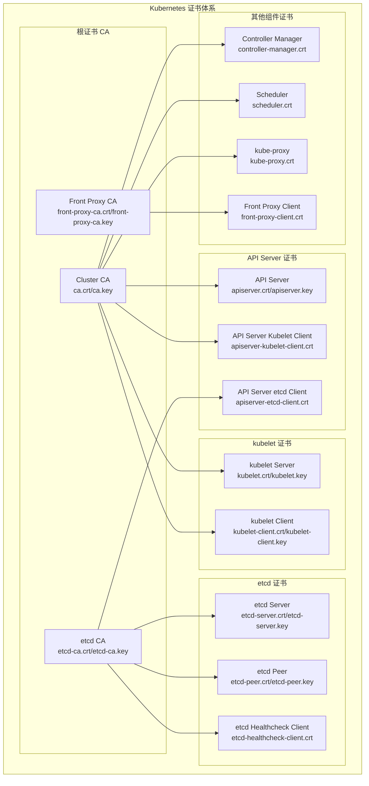

# Kubernetes 证书和认证问题排查

## 概述

Kubernetes 集群中的证书和认证是保障集群安全的核心机制。证书问题会导致组件无法正常通信，是常见但关键的故障类型。

## 证书体系架构

### Kubernetes 证书结构



## 证书故障诊断

### 证书状态检查脚本

```bash
#!/bin/bash
# Kubernetes 证书状态检查脚本

CERT_DIR="/etc/kubernetes/pki"

echo "=== Kubernetes 证书状态检查 ==="

# 1. 检查证书文件存在性
echo "1. 证书文件检查："
echo "证书目录: $CERT_DIR"

# 必需的证书文件
REQUIRED_CERTS=(
    "ca.crt"
    "ca.key"
    "apiserver.crt"
    "apiserver.key"
    "apiserver-kubelet-client.crt"
    "apiserver-kubelet-client.key"
    "front-proxy-ca.crt"
    "front-proxy-ca.key"
    "front-proxy-client.crt"
    "front-proxy-client.key"
    "etcd/ca.crt"
    "etcd/ca.key"
    "etcd/server.crt"
    "etcd/server.key"
    "etcd/peer.crt"
    "etcd/peer.key"
    "etcd/healthcheck-client.crt"
    "etcd/healthcheck-client.key"
    "apiserver-etcd-client.crt"
    "apiserver-etcd-client.key"
)

for cert in "${REQUIRED_CERTS[@]}"; do
    if [ -f "$CERT_DIR/$cert" ]; then
        echo "✓ $cert 存在"
    else
        echo "✗ $cert 缺失"
    fi
done

# 2. 检查证书有效期
echo -e "\n2. 证书有效期检查："
check_cert_expiry() {
    local cert_file=$1
    local cert_name=$2
    
    if [ -f "$cert_file" ]; then
        local expiry_date=$(openssl x509 -in "$cert_file" -noout -enddate | cut -d= -f2)
        local expiry_timestamp=$(date -d "$expiry_date" +%s 2>/dev/null || echo 0)
        local current_timestamp=$(date +%s)
        local days_left=$(( (expiry_timestamp - current_timestamp) / 86400 ))
        
        if [ $days_left -lt 0 ]; then
            echo "⚠️  $cert_name: 已过期 ($expiry_date)"
        elif [ $days_left -lt 30 ]; then
            echo "⚠️  $cert_name: $days_left 天后过期 ($expiry_date)"
        else
            echo "✓ $cert_name: $days_left 天后过期 ($expiry_date)"
        fi
    else
        echo "✗ $cert_name: 文件不存在"
    fi
}

check_cert_expiry "$CERT_DIR/ca.crt" "Cluster CA"
check_cert_expiry "$CERT_DIR/apiserver.crt" "API Server"
check_cert_expiry "$CERT_DIR/apiserver-kubelet-client.crt" "API Server Kubelet Client"
check_cert_expiry "$CERT_DIR/etcd/ca.crt" "etcd CA"
check_cert_expiry "$CERT_DIR/etcd/server.crt" "etcd Server"
check_cert_expiry "$CERT_DIR/front-proxy-ca.crt" "Front Proxy CA"

# 3. 检查证书详细信息
echo -e "\n3. 证书详细信息："
if [ -f "$CERT_DIR/apiserver.crt" ]; then
    echo "API Server 证书信息："
    openssl x509 -in "$CERT_DIR/apiserver.crt" -noout -text | grep -E "(Subject|Issuer|DNS|IP Address|Not Before|Not After)"
fi

# 4. 验证证书链
echo -e "\n4. 证书链验证："
if [ -f "$CERT_DIR/apiserver.crt" ] && [ -f "$CERT_DIR/ca.crt" ]; then
    openssl verify -CAfile "$CERT_DIR/ca.crt" "$CERT_DIR/apiserver.crt" && echo "✓ API Server 证书链验证成功" || echo "✗ API Server 证书链验证失败"
fi

if [ -f "$CERT_DIR/etcd/server.crt" ] && [ -f "$CERT_DIR/etcd/ca.crt" ]; then
    openssl verify -CAfile "$CERT_DIR/etcd/ca.crt" "$CERT_DIR/etcd/server.crt" && echo "✓ etcd Server 证书链验证成功" || echo "✗ etcd Server 证书链验证失败"
fi

# 5. 检查证书权限
echo -e "\n5. 证书文件权限："
ls -la "$CERT_DIR"/*.crt "$CERT_DIR"/*.key 2>/dev/null | head -10
ls -la "$CERT_DIR/etcd"/*.crt "$CERT_DIR/etcd"/*.key 2>/dev/null | head -10
```

### kubelet 证书诊断

```bash
#!/bin/bash
# kubelet 证书故障诊断脚本

NODE_NAME=${1:-$(hostname)}
KUBELET_DIR="/var/lib/kubelet/pki"

echo "=== kubelet 证书故障诊断 ==="
echo "节点: $NODE_NAME"

# 1. 检查 kubelet 证书文件
echo "1. kubelet 证书文件："
if [ -d "$KUBELET_DIR" ]; then
    ls -la "$KUBELET_DIR"/
else
    echo "kubelet 证书目录不存在: $KUBELET_DIR"
fi

# 2. 检查 kubelet 当前证书
echo -e "\n2. kubelet 当前证书状态："
CURRENT_CERT="$KUBELET_DIR/kubelet-client-current.pem"
if [ -f "$CURRENT_CERT" ]; then
    echo "当前证书文件: $CURRENT_CERT"
    
    # 检查证书有效期
    expiry_date=$(openssl x509 -in "$CURRENT_CERT" -noout -enddate | cut -d= -f2)
    echo "证书到期时间: $expiry_date"
    
    # 检查证书主体
    subject=$(openssl x509 -in "$CURRENT_CERT" -noout -subject)
    echo "证书主体: $subject"
    
    # 检查证书颁发者
    issuer=$(openssl x509 -in "$CURRENT_CERT" -noout -issuer)
    echo "证书颁发者: $issuer"
else
    echo "当前证书文件不存在: $CURRENT_CERT"
fi

# 3. 检查 kubelet 配置中的证书设置
echo -e "\n3. kubelet 证书配置："
KUBELET_CONFIG="/var/lib/kubelet/config.yaml"
if [ -f "$KUBELET_CONFIG" ]; then
    echo "kubelet 配置文件: $KUBELET_CONFIG"
    grep -E "(clientCAFile|tlsCertFile|tlsPrivateKeyFile)" "$KUBELET_CONFIG" || echo "未找到证书相关配置"
else
    echo "kubelet 配置文件不存在: $KUBELET_CONFIG"
fi

# 4. 检查 kubelet 服务状态
echo -e "\n4. kubelet 服务状态："
systemctl status kubelet | grep -E "(Active|Main PID)"

# 5. 检查 kubelet 日志中的证书错误
echo -e "\n5. kubelet 证书相关日志："
journalctl -u kubelet -n 50 --no-pager | grep -i -E "(certificate|tls|x509|expired)" | tail -10

# 6. 测试 kubelet API 连接
echo -e "\n6. kubelet API 连接测试："
curl -k https://localhost:10250/healthz 2>&1 | head -3

# 7. 检查 kubelet 证书轮换配置
echo -e "\n7. kubelet 证书轮换配置："
grep -E "(rotateCertificates|serverTLSBootstrap)" "$KUBELET_CONFIG" 2>/dev/null || echo "未配置证书轮换"

# 8. 检查 CSR 状态
echo -e "\n8. 证书签名请求状态："
kubectl get csr | grep "$NODE_NAME" | head -5
```

## 常见证书问题解决

### 证书过期处理

```bash
#!/bin/bash
# 证书过期处理脚本

CERT_DIR="/etc/kubernetes/pki"
BACKUP_DIR="/etc/kubernetes/pki-backup-$(date +%Y%m%d-%H%M%S)"

echo "=== 证书过期处理 ==="

# 1. 备份现有证书
echo "1. 备份现有证书到 $BACKUP_DIR..."
mkdir -p "$BACKUP_DIR"
cp -r "$CERT_DIR"/* "$BACKUP_DIR/"
echo "证书备份完成"

# 2. 检查哪些证书即将过期
echo -e "\n2. 检查即将过期的证书："
check_and_renew_cert() {
    local cert_file=$1
    local cert_name=$2
    
    if [ -f "$cert_file" ]; then
        local expiry_date=$(openssl x509 -in "$cert_file" -noout -enddate | cut -d= -f2)
        local expiry_timestamp=$(date -d "$expiry_date" +%s 2>/dev/null || echo 0)
        local current_timestamp=$(date +%s)
        local days_left=$(( (expiry_timestamp - current_timestamp) / 86400 ))
        
        if [ $days_left -lt 30 ]; then
            echo "⚠️  $cert_name 需要更新 (剩余 $days_left 天)"
            return 1
        else
            echo "✓ $cert_name 正常 (剩余 $days_left 天)"
            return 0
        fi
    else
        echo "✗ $cert_name 文件不存在"
        return 1
    fi
}

# 检查主要证书
NEED_RENEWAL=false
check_and_renew_cert "$CERT_DIR/apiserver.crt" "API Server" || NEED_RENEWAL=true
check_and_renew_cert "$CERT_DIR/apiserver-kubelet-client.crt" "API Server Kubelet Client" || NEED_RENEWAL=true
check_and_renew_cert "$CERT_DIR/front-proxy-client.crt" "Front Proxy Client" || NEED_RENEWAL=true

# 3. 使用 kubeadm 更新证书
if [ "$NEED_RENEWAL" = true ]; then
    echo -e "\n3. 使用 kubeadm 更新证书..."
    
    # 检查 kubeadm 版本
    kubeadm version
    
    # 更新所有证书
    echo "更新所有证书..."
    kubeadm certs renew all
    
    # 验证更新结果
    echo -e "\n4. 验证证书更新结果："
    kubeadm certs check-expiration
    
    # 重启控制平面组件
    echo -e "\n5. 重启控制平面组件..."
    
    # 重启 API Server
    docker ps | grep kube-apiserver | awk '{print $1}' | xargs docker restart
    
    # 重启 Controller Manager
    docker ps | grep kube-controller-manager | awk '{print $1}' | xargs docker restart
    
    # 重启 Scheduler
    docker ps | grep kube-scheduler | awk '{print $1}' | xargs docker restart
    
    echo "控制平面组件重启完成"
    
    # 等待组件启动
    echo "等待组件启动..."
    sleep 30
    
    # 验证集群状态
    echo -e "\n6. 验证集群状态："
    kubectl get componentstatuses
    kubectl get nodes
    
else
    echo -e "\n3. 所有证书状态正常，无需更新"
fi
```

### 手动生成证书

```bash
#!/bin/bash
# 手动生成 Kubernetes 证书脚本

CERT_DIR="/etc/kubernetes/pki"
MASTER_IP="192.168.1.100"  # 修改为实际的 Master IP
CLUSTER_NAME="kubernetes"

echo "=== 手动生成 Kubernetes 证书 ==="

# 1. 创建证书目录
mkdir -p "$CERT_DIR/etcd"

# 2. 生成 CA 证书
echo "1. 生成 Cluster CA 证书..."
openssl genrsa -out "$CERT_DIR/ca.key" 2048

cat > "$CERT_DIR/ca.conf" << EOF
[req]
distinguished_name = req_distinguished_name
x509_extensions = v3_ca
prompt = no

[req_distinguished_name]
CN = kubernetes

[v3_ca]
basicConstraints = critical,CA:TRUE
keyUsage = critical,digitalSignature,keyEncipherment,keyCertSign
EOF

openssl req -new -x509 -key "$CERT_DIR/ca.key" -out "$CERT_DIR/ca.crt" -days 3650 -config "$CERT_DIR/ca.conf"

# 3. 生成 API Server 证书
echo "2. 生成 API Server 证书..."
openssl genrsa -out "$CERT_DIR/apiserver.key" 2048

cat > "$CERT_DIR/apiserver.conf" << EOF
[req]
distinguished_name = req_distinguished_name
req_extensions = v3_req
prompt = no

[req_distinguished_name]
CN = kube-apiserver

[v3_req]
basicConstraints = CA:FALSE
keyUsage = nonRepudiation,digitalSignature,keyEncipherment
subjectAltName = @alt_names

[alt_names]
DNS.1 = kubernetes
DNS.2 = kubernetes.default
DNS.3 = kubernetes.default.svc
DNS.4 = kubernetes.default.svc.cluster.local
DNS.5 = localhost
IP.1 = 127.0.0.1
IP.2 = 10.96.0.1
IP.3 = $MASTER_IP
EOF

openssl req -new -key "$CERT_DIR/apiserver.key" -out "$CERT_DIR/apiserver.csr" -config "$CERT_DIR/apiserver.conf"
openssl x509 -req -in "$CERT_DIR/apiserver.csr" -CA "$CERT_DIR/ca.crt" -CAkey "$CERT_DIR/ca.key" -CAcreateserial -out "$CERT_DIR/apiserver.crt" -days 365 -extensions v3_req -extfile "$CERT_DIR/apiserver.conf"

# 4. 生成 API Server Kubelet Client 证书
echo "3. 生成 API Server Kubelet Client 证书..."
openssl genrsa -out "$CERT_DIR/apiserver-kubelet-client.key" 2048

cat > "$CERT_DIR/apiserver-kubelet-client.conf" << EOF
[req]
distinguished_name = req_distinguished_name
prompt = no

[req_distinguished_name]
CN = kube-apiserver-kubelet-client
O = system:masters
EOF

openssl req -new -key "$CERT_DIR/apiserver-kubelet-client.key" -out "$CERT_DIR/apiserver-kubelet-client.csr" -config "$CERT_DIR/apiserver-kubelet-client.conf"
openssl x509 -req -in "$CERT_DIR/apiserver-kubelet-client.csr" -CA "$CERT_DIR/ca.crt" -CAkey "$CERT_DIR/ca.key" -CAcreateserial -out "$CERT_DIR/apiserver-kubelet-client.crt" -days 365

# 5. 生成 etcd CA 证书
echo "4. 生成 etcd CA 证书..."
openssl genrsa -out "$CERT_DIR/etcd/ca.key" 2048

cat > "$CERT_DIR/etcd/ca.conf" << EOF
[req]
distinguished_name = req_distinguished_name
x509_extensions = v3_ca
prompt = no

[req_distinguished_name]
CN = etcd-ca

[v3_ca]
basicConstraints = critical,CA:TRUE
keyUsage = critical,digitalSignature,keyEncipherment,keyCertSign
EOF

openssl req -new -x509 -key "$CERT_DIR/etcd/ca.key" -out "$CERT_DIR/etcd/ca.crt" -days 3650 -config "$CERT_DIR/etcd/ca.conf"

# 6. 生成 etcd Server 证书
echo "5. 生成 etcd Server 证书..."
openssl genrsa -out "$CERT_DIR/etcd/server.key" 2048

cat > "$CERT_DIR/etcd/server.conf" << EOF
[req]
distinguished_name = req_distinguished_name
req_extensions = v3_req
prompt = no

[req_distinguished_name]
CN = etcd-server

[v3_req]
basicConstraints = CA:FALSE
keyUsage = nonRepudiation,digitalSignature,keyEncipherment
subjectAltName = @alt_names

[alt_names]
DNS.1 = localhost
IP.1 = 127.0.0.1
IP.2 = $MASTER_IP
EOF

openssl req -new -key "$CERT_DIR/etcd/server.key" -out "$CERT_DIR/etcd/server.csr" -config "$CERT_DIR/etcd/server.conf"
openssl x509 -req -in "$CERT_DIR/etcd/server.csr" -CA "$CERT_DIR/etcd/ca.crt" -CAkey "$CERT_DIR/etcd/ca.key" -CAcreateserial -out "$CERT_DIR/etcd/server.crt" -days 365 -extensions v3_req -extfile "$CERT_DIR/etcd/server.conf"

# 7. 设置证书文件权限
echo "6. 设置证书文件权限..."
chmod 600 "$CERT_DIR"/*.key
chmod 644 "$CERT_DIR"/*.crt
chmod 600 "$CERT_DIR/etcd"/*.key
chmod 644 "$CERT_DIR/etcd"/*.crt

# 8. 验证生成的证书
echo "7. 验证生成的证书..."
openssl verify -CAfile "$CERT_DIR/ca.crt" "$CERT_DIR/apiserver.crt"
openssl verify -CAfile "$CERT_DIR/etcd/ca.crt" "$CERT_DIR/etcd/server.crt"

echo "证书生成完成！"
```

## 认证问题排查

### RBAC 权限诊断

```bash
#!/bin/bash
# RBAC 权限诊断脚本

USER_OR_SA=$1
NAMESPACE=${2:-default}

if [ -z "$USER_OR_SA" ]; then
    echo "用法: $0 <user-or-serviceaccount> [namespace]"
    echo "示例: $0 system:serviceaccount:default:my-sa"
    echo "示例: $0 my-user"
    exit 1
fi

echo "=== RBAC 权限诊断 ==="
echo "用户/服务账户: $USER_OR_SA"
echo "命名空间: $NAMESPACE"

# 1. 检查用户的角色绑定
echo -e "\n1. 检查角色绑定："
echo "ClusterRoleBindings:"
kubectl get clusterrolebinding -o json | jq -r '.items[] | select(.subjects[]?.name == "'$USER_OR_SA'" or .subjects[]?.name == "system:serviceaccount:'$NAMESPACE':'$USER_OR_SA'") | .metadata.name'

echo -e "\nRoleBindings in $NAMESPACE:"
kubectl get rolebinding -n "$NAMESPACE" -o json | jq -r '.items[] | select(.subjects[]?.name == "'$USER_OR_SA'" or .subjects[]?.name == "system:serviceaccount:'$NAMESPACE':'$USER_OR_SA'") | .metadata.name'

# 2. 检查权限
echo -e "\n2. 权限检查："
test_permissions() {
    local resource=$1
    local verb=$2
    local namespace_param=""
    
    if [ "$NAMESPACE" != "default" ] && [ "$resource" != "nodes" ] && [ "$resource" != "namespaces" ]; then
        namespace_param="--namespace=$NAMESPACE"
    fi
    
    local result=$(kubectl auth can-i "$verb" "$resource" --as="$USER_OR_SA" $namespace_param 2>/dev/null)
    
    if [ "$result" = "yes" ]; then
        echo "✓ $verb $resource"
    else
        echo "✗ $verb $resource"
    fi
}

# 测试常见权限
echo "测试常见权限："
test_permissions "pods" "get"
test_permissions "pods" "list"
test_permissions "pods" "create"
test_permissions "pods" "delete"
test_permissions "services" "get"
test_permissions "services" "create"
test_permissions "deployments" "get"
test_permissions "deployments" "create"
test_permissions "nodes" "get"
test_permissions "namespaces" "get"

# 3. 详细检查角色定义
echo -e "\n3. 详细角色权限："
# 获取用户绑定的 ClusterRole
CLUSTER_ROLES=$(kubectl get clusterrolebinding -o json | jq -r '.items[] | select(.subjects[]?.name == "'$USER_OR_SA'" or .subjects[]?.name == "system:serviceaccount:'$NAMESPACE':'$USER_OR_SA'") | .roleRef.name')

for role in $CLUSTER_ROLES; do
    echo "ClusterRole: $role"
    kubectl describe clusterrole "$role" | grep -A 20 "Rules:"
done

# 获取用户绑定的 Role
ROLES=$(kubectl get rolebinding -n "$NAMESPACE" -o json | jq -r '.items[] | select(.subjects[]?.name == "'$USER_OR_SA'" or .subjects[]?.name == "system:serviceaccount:'$NAMESPACE':'$USER_OR_SA'") | .roleRef.name')

for role in $ROLES; do
    echo "Role: $role (namespace: $NAMESPACE)"
    kubectl describe role "$role" -n "$NAMESPACE" | grep -A 20 "Rules:"
done

# 4. 检查 ServiceAccount
if [[ "$USER_OR_SA" == system:serviceaccount:* ]]; then
    SA_NAME=$(echo "$USER_OR_SA" | cut -d: -f4)
    SA_NAMESPACE=$(echo "$USER_OR_SA" | cut -d: -f3)
    
    echo -e "\n4. ServiceAccount 详情："
    kubectl describe serviceaccount "$SA_NAME" -n "$SA_NAMESPACE"
    
    echo -e "\nServiceAccount Secrets:"
    kubectl get serviceaccount "$SA_NAME" -n "$SA_NAMESPACE" -o jsonpath='{.secrets[*].name}'
fi
```

### Token 认证问题

```bash
#!/bin/bash
# Token 认证问题诊断脚本

SERVICE_ACCOUNT=$1
NAMESPACE=${2:-default}

if [ -z "$SERVICE_ACCOUNT" ]; then
    echo "用法: $0 <service-account> [namespace]"
    exit 1
fi

echo "=== Token 认证问题诊断 ==="
echo "ServiceAccount: $SERVICE_ACCOUNT"
echo "Namespace: $NAMESPACE"

# 1. 检查 ServiceAccount 存在性
echo "1. 检查 ServiceAccount："
kubectl get serviceaccount "$SERVICE_ACCOUNT" -n "$NAMESPACE" -o yaml

# 2. 检查 ServiceAccount 的 Secret
echo -e "\n2. 检查 ServiceAccount Token Secret："
SECRET_NAME=$(kubectl get serviceaccount "$SERVICE_ACCOUNT" -n "$NAMESPACE" -o jsonpath='{.secrets[0].name}')

if [ "$SECRET_NAME" != "" ]; then
    echo "Token Secret: $SECRET_NAME"
    kubectl describe secret "$SECRET_NAME" -n "$NAMESPACE"
    
    # 3. 验证 Token
    echo -e "\n3. Token 验证："
    TOKEN=$(kubectl get secret "$SECRET_NAME" -n "$NAMESPACE" -o jsonpath='{.data.token}' | base64 -d)
    
    # 检查 Token 格式
    if [[ "$TOKEN" =~ ^eyJ ]]; then
        echo "✓ Token 格式正确 (JWT)"
        
        # 解码 Token Header
        echo -e "\nToken Header:"
        echo "$TOKEN" | cut -d. -f1 | base64 -d 2>/dev/null | jq . 2>/dev/null || echo "无法解码 Header"
        
        # 解码 Token Payload
        echo -e "\nToken Payload:"
        echo "$TOKEN" | cut -d. -f2 | base64 -d 2>/dev/null | jq . 2>/dev/null || echo "无法解码 Payload"
    else
        echo "✗ Token 格式不正确"
    fi
    
    # 4. 测试 Token 认证
    echo -e "\n4. 测试 Token 认证："
    
    # 获取 API Server 地址
    API_SERVER=$(kubectl config view --minify -o jsonpath='{.clusters[0].cluster.server}')
    
    # 测试认证
    curl -k -H "Authorization: Bearer $TOKEN" "$API_SERVER/api/v1/namespaces/$NAMESPACE/pods" 2>/dev/null | jq '.kind' 2>/dev/null && echo "✓ Token 认证成功" || echo "✗ Token 认证失败"
    
else
    echo "✗ 未找到 Token Secret"
    
    # 5. 创建 Token Secret（Kubernetes 1.24+）
    echo -e "\n5. 尝试创建 Token Secret："
    
    cat << EOF | kubectl apply -f -
apiVersion: v1
kind: Secret
metadata:
  name: ${SERVICE_ACCOUNT}-token
  namespace: $NAMESPACE
  annotations:
    kubernetes.io/service-account.name: $SERVICE_ACCOUNT
type: kubernetes.io/service-account-token
EOF

    # 等待 Token 生成
    sleep 5
    
    echo "检查新创建的 Secret："
    kubectl describe secret "${SERVICE_ACCOUNT}-token" -n "$NAMESPACE"
fi

# 6. 检查 ServiceAccount 的 ImagePullSecrets
echo -e "\n6. 检查 ImagePullSecrets："
kubectl get serviceaccount "$SERVICE_ACCOUNT" -n "$NAMESPACE" -o jsonpath='{.imagePullSecrets[*].name}' | tr ' ' '\n' | while read secret; do
    if [ "$secret" != "" ]; then
        echo "ImagePullSecret: $secret"
        kubectl describe secret "$secret" -n "$NAMESPACE"
    fi
done || echo "无 ImagePullSecrets"

# 7. 检查 ServiceAccount 的 RBAC 绑定
echo -e "\n7. 检查 RBAC 绑定："
echo "ClusterRoleBindings:"
kubectl get clusterrolebinding -o json | jq -r '.items[] | select(.subjects[]?.name == "'$SERVICE_ACCOUNT'" and .subjects[]?.namespace == "'$NAMESPACE'") | .metadata.name'

echo -e "\nRoleBindings:"
kubectl get rolebinding -n "$NAMESPACE" -o json | jq -r '.items[] | select(.subjects[]?.name == "'$SERVICE_ACCOUNT'") | .metadata.name'
```

## 证书轮换和自动化

### 自动证书轮换配置

```yaml
# kubelet 证书轮换配置
apiVersion: kubelet.config.k8s.io/v1beta1
kind: KubeletConfiguration
serverTLSBootstrap: true
rotateCertificates: true
rotateServerCertificates: true
authentication:
  webhook:
    enabled: true
    cacheTTL: 2m0s
  anonymous:
    enabled: false
authorization:
  mode: Webhook
  webhook:
    cacheAuthorizedTTL: 5m0s
    cacheUnauthorizedTTL: 30s
```

### 证书监控脚本

```bash
#!/bin/bash
# 证书监控和告警脚本

CERT_DIR="/etc/kubernetes/pki"
ALERT_DAYS=30  # 证书即将过期的天数阈值

echo "=== 证书监控和告警 ==="

monitor_cert() {
    local cert_file=$1
    local cert_name=$2
    
    if [ ! -f "$cert_file" ]; then
        echo "CRITICAL: $cert_name 证书文件不存在: $cert_file"
        return 2
    fi
    
    local expiry_date=$(openssl x509 -in "$cert_file" -noout -enddate | cut -d= -f2)
    local expiry_timestamp=$(date -d "$expiry_date" +%s 2>/dev/null || echo 0)
    local current_timestamp=$(date +%s)
    local days_left=$(( (expiry_timestamp - current_timestamp) / 86400 ))
    
    if [ $days_left -lt 0 ]; then
        echo "CRITICAL: $cert_name 证书已过期 ($expiry_date)"
        return 2
    elif [ $days_left -lt $ALERT_DAYS ]; then
        echo "WARNING: $cert_name 证书将在 $days_left 天后过期 ($expiry_date)"
        return 1
    else
        echo "OK: $cert_name 证书正常，$days_left 天后过期"
        return 0
    fi
}

# 监控主要证书
CRITICAL_COUNT=0
WARNING_COUNT=0

# 控制平面证书
monitor_cert "$CERT_DIR/ca.crt" "Cluster CA"
case $? in
    1) WARNING_COUNT=$((WARNING_COUNT + 1)) ;;
    2) CRITICAL_COUNT=$((CRITICAL_COUNT + 1)) ;;
esac

monitor_cert "$CERT_DIR/apiserver.crt" "API Server"
case $? in
    1) WARNING_COUNT=$((WARNING_COUNT + 1)) ;;
    2) CRITICAL_COUNT=$((CRITICAL_COUNT + 1)) ;;
esac

monitor_cert "$CERT_DIR/apiserver-kubelet-client.crt" "API Server Kubelet Client"
case $? in
    1) WARNING_COUNT=$((WARNING_COUNT + 1)) ;;
    2) CRITICAL_COUNT=$((CRITICAL_COUNT + 1)) ;;
esac

# etcd 证书
monitor_cert "$CERT_DIR/etcd/ca.crt" "etcd CA"
case $? in
    1) WARNING_COUNT=$((WARNING_COUNT + 1)) ;;
    2) CRITICAL_COUNT=$((CRITICAL_COUNT + 1)) ;;
esac

monitor_cert "$CERT_DIR/etcd/server.crt" "etcd Server"
case $? in
    1) WARNING_COUNT=$((WARNING_COUNT + 1)) ;;
    2) CRITICAL_COUNT=$((CRITICAL_COUNT + 1)) ;;
esac

# Front Proxy 证书
monitor_cert "$CERT_DIR/front-proxy-ca.crt" "Front Proxy CA"
case $? in
    1) WARNING_COUNT=$((WARNING_COUNT + 1)) ;;
    2) CRITICAL_COUNT=$((CRITICAL_COUNT + 1)) ;;
esac

# 汇总结果
echo -e "\n=== 监控汇总 ==="
echo "关键问题: $CRITICAL_COUNT"
echo "警告问题: $WARNING_COUNT"

if [ $CRITICAL_COUNT -gt 0 ]; then
    echo "状态: CRITICAL - 有证书已过期或即将过期"
    exit 2
elif [ $WARNING_COUNT -gt 0 ]; then
    echo "状态: WARNING - 有证书即将过期"
    exit 1
else
    echo "状态: OK - 所有证书正常"
    exit 0
fi
```

通过系统性的证书和认证问题排查，可以快速识别和解决 Kubernetes 集群中的安全认证问题，确保集群的安全性和稳定性。
