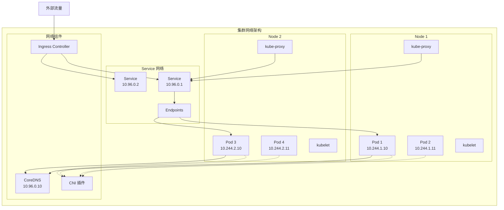

# Kubernetes 集群网络问题排查

## 概述

Kubernetes 集群网络是一个复杂的系统，涉及 Pod 网络、Service 网络、Ingress、DNS 解析等多个层面。网络问题往往影响面广，需要系统性的排查方法。

## 网络架构概览

### Kubernetes 网络模型



## 网络故障分类

### 故障层级分析

```yaml
# 网络故障分层诊断
network_troubleshooting_layers:
  layer_1_physical:
    description: "物理网络层"
    issues:
      - "网络接口故障"
      - "网线连接问题"
      - "交换机端口故障"
    diagnosis:
      - "检查网络接口状态"
      - "测试网络连通性"
      - "检查硬件状态"
      
  layer_2_container:
    description: "容器网络层"
    issues:
      - "CNI 插件故障"
      - "网桥配置错误"
      - "VLAN 配置问题"
    diagnosis:
      - "检查 CNI 配置"
      - "验证网桥状态"
      - "检查网络命名空间"
      
  layer_3_pod:
    description: "Pod 网络层"
    issues:
      - "Pod IP 分配失败"
      - "Pod 间通信故障"
      - "路由配置错误"
    diagnosis:
      - "检查 Pod IP 分配"
      - "测试 Pod 间连通性"
      - "检查路由表"
      
  layer_4_service:
    description: "Service 网络层"
    issues:
      - "Service 发现失败"
      - "负载均衡异常"
      - "端点更新延迟"
    diagnosis:
      - "检查 Service 配置"
      - "验证 Endpoints"
      - "检查 kube-proxy"
      
  layer_5_dns:
    description: "DNS 解析层"
    issues:
      - "DNS 解析失败"
      - "DNS 响应慢"
      - "DNS 记录错误"
    diagnosis:
      - "检查 CoreDNS 状态"
      - "测试 DNS 解析"
      - "检查 DNS 配置"
      
  layer_6_ingress:
    description: "Ingress 层"
    issues:
      - "Ingress 路由失败"
      - "TLS 证书问题"
      - "负载均衡器故障"
    diagnosis:
      - "检查 Ingress 配置"
      - "验证证书有效性"
      - "检查负载均衡器状态"
```

## Pod 网络故障排查

### Pod 间通信诊断

```bash
#!/bin/bash
# Pod 间网络连通性测试脚本

echo "=== Pod 间网络连通性测试 ==="

# 1. 创建测试 Pod
echo "1. 创建测试 Pod..."
kubectl apply -f - <<EOF
apiVersion: v1
kind: Pod
metadata:
  name: network-test-client
  labels:
    app: network-test
spec:
  containers:
  - name: client
    image: nicolaka/netshoot
    command: ['sleep', '3600']
---
apiVersion: v1
kind: Pod
metadata:
  name: network-test-server
  labels:
    app: network-test
spec:
  containers:
  - name: server
    image: nginx:alpine
    ports:
    - containerPort: 80
EOF

# 等待 Pod 启动
echo "2. 等待 Pod 启动..."
kubectl wait --for=condition=Ready pod/network-test-client --timeout=60s
kubectl wait --for=condition=Ready pod/network-test-server --timeout=60s

# 获取 Pod IP
CLIENT_IP=$(kubectl get pod network-test-client -o jsonpath='{.status.podIP}')
SERVER_IP=$(kubectl get pod network-test-server -o jsonpath='{.status.podIP}')

echo "客户端 Pod IP: $CLIENT_IP"
echo "服务端 Pod IP: $SERVER_IP"

# 3. 测试网络连通性
echo -e "\n3. 测试 Pod 间网络连通性..."

# ICMP 连通性
echo "测试 ICMP 连通性："
kubectl exec network-test-client -- ping -c 3 $SERVER_IP

# TCP 连通性
echo -e "\n测试 TCP 连通性（HTTP）："
kubectl exec network-test-client -- wget -qO- http://$SERVER_IP:80 --timeout=5

# 端口扫描
echo -e "\n端口扫描："
kubectl exec network-test-client -- nmap -p 80 $SERVER_IP

# 4. 测试跨节点通信
echo -e "\n4. 检查 Pod 节点分布："
kubectl get pods -o wide | grep network-test

# 5. 测试 DNS 解析
echo -e "\n5. 测试集群内 DNS 解析："
kubectl exec network-test-client -- nslookup kubernetes.default.svc.cluster.local

# 6. 清理测试资源
echo -e "\n6. 清理测试资源..."
kubectl delete pod network-test-client network-test-server --force --grace-period=0
```

### CNI 网络插件诊断

```bash
#!/bin/bash
# CNI 网络插件诊断脚本

echo "=== CNI 网络插件诊断 ==="

# 1. 检查 CNI 插件安装
echo "1. CNI 插件文件："
ls -la /opt/cni/bin/

# 2. 检查 CNI 配置
echo -e "\n2. CNI 配置文件："
find /etc/cni/net.d/ -name "*.conf" -o -name "*.conflist" 2>/dev/null | head -3 | while read file; do
    echo "=== $file ==="
    cat "$file"
    echo
done

# 3. 检查网络插件 Pod
echo -e "\n3. 网络插件 Pod 状态："
kubectl get pods -n kube-system | grep -E "(calico|flannel|weave|cilium|antrea)"

# 4. 检查网络插件日志
echo -e "\n4. 网络插件日志："
NETWORK_POD=$(kubectl get pods -n kube-system | grep -E "(calico|flannel|weave|cilium|antrea)" | head -1 | awk '{print $1}')
if [ "$NETWORK_POD" != "" ]; then
    echo "网络插件: $NETWORK_POD"
    kubectl logs -n kube-system $NETWORK_POD --tail=20
fi

# 5. 检查节点网络接口
echo -e "\n5. 节点网络接口："
ip addr show | grep -E "(cali|flannel|weave|cilium|veth)"

# 6. 检查网络路由
echo -e "\n6. 网络路由表："
ip route | head -20

# 7. 检查网桥信息
echo -e "\n7. 网桥信息："
brctl show 2>/dev/null || echo "brctl 命令不可用"

# 8. 检查 iptables 规则
echo -e "\n8. iptables 规则统计："
echo "Filter 表规则数: $(iptables -L | wc -l)"
echo "NAT 表规则数: $(iptables -t nat -L | wc -l)"

# 9. 检查网络命名空间
echo -e "\n9. 网络命名空间："
ip netns list | head -10
```

## Service 网络故障排查

### Service 发现和负载均衡

```bash
#!/bin/bash
# Service 网络故障排查脚本

SERVICE_NAME=$1
NAMESPACE=${2:-default}

if [ -z "$SERVICE_NAME" ]; then
    echo "用法: $0 <service-name> [namespace]"
    exit 1
fi

echo "=== Service 网络故障排查 ==="
echo "Service: $SERVICE_NAME"
echo "Namespace: $NAMESPACE"

# 1. 检查 Service 基本信息
echo -e "\n1. Service 基本信息："
kubectl get service $SERVICE_NAME -n $NAMESPACE -o wide

# 2. 检查 Service 详细配置
echo -e "\n2. Service 详细配置："
kubectl describe service $SERVICE_NAME -n $NAMESPACE

# 3. 检查 Endpoints
echo -e "\n3. Endpoints 检查："
kubectl get endpoints $SERVICE_NAME -n $NAMESPACE -o wide
kubectl describe endpoints $SERVICE_NAME -n $NAMESPACE

# 4. 检查后端 Pod
echo -e "\n4. 后端 Pod 状态："
SELECTOR=$(kubectl get service $SERVICE_NAME -n $NAMESPACE -o jsonpath='{.spec.selector}')
echo "Label Selector: $SELECTOR"

if [ "$SELECTOR" != "null" ] && [ "$SELECTOR" != "" ]; then
    # 将 selector 转换为 kubectl 可用的格式
    LABEL_SELECTOR=$(echo $SELECTOR | sed 's/[{}]//g' | tr ' ' '\n' | grep ':' | tr '\n' ',' | sed 's/,$//')
    kubectl get pods -n $NAMESPACE -l "$LABEL_SELECTOR" -o wide
fi

# 5. 测试 Service 连通性
echo -e "\n5. Service 连通性测试："
SERVICE_IP=$(kubectl get service $SERVICE_NAME -n $NAMESPACE -o jsonpath='{.spec.clusterIP}')
SERVICE_PORT=$(kubectl get service $SERVICE_NAME -n $NAMESPACE -o jsonpath='{.spec.ports[0].port}')

echo "Service IP: $SERVICE_IP"
echo "Service Port: $SERVICE_PORT"

# 创建测试 Pod 进行连通性测试
kubectl run svc-test --image=busybox --rm -i --tty --restart=Never -- sh -c "
echo 'Testing Service connectivity...'
nc -zv $SERVICE_IP $SERVICE_PORT
echo 'Testing DNS resolution...'
nslookup $SERVICE_NAME.$NAMESPACE.svc.cluster.local
echo 'Testing HTTP connectivity (if applicable)...'
wget -qO- http://$SERVICE_IP:$SERVICE_PORT --timeout=5 2>/dev/null || echo 'HTTP test failed or not applicable'
"

# 6. 检查 kube-proxy 状态
echo -e "\n6. kube-proxy 状态："
kubectl get pods -n kube-system -l k8s-app=kube-proxy
kubectl get ds -n kube-system kube-proxy

# 7. 检查 Service 相关事件
echo -e "\n7. Service 相关事件："
kubectl get events -n $NAMESPACE --field-selector involvedObject.name=$SERVICE_NAME

# 8. 检查 iptables 规则（在节点上执行）
echo -e "\n8. 相关 iptables 规则："
echo "检查 KUBE-SERVICES 链..."
iptables -t nat -L KUBE-SERVICES | grep $SERVICE_NAME || echo "未找到相关规则"
```

### kube-proxy 故障诊断

```bash
#!/bin/bash
# kube-proxy 故障诊断脚本

echo "=== kube-proxy 故障诊断 ==="

# 1. 检查 kube-proxy DaemonSet
echo "1. kube-proxy DaemonSet 状态："
kubectl get daemonset -n kube-system kube-proxy

echo -e "\nkube-proxy Pod 状态："
kubectl get pods -n kube-system -l k8s-app=kube-proxy -o wide

# 2. 检查 kube-proxy 配置
echo -e "\n2. kube-proxy 配置："
kubectl get configmap -n kube-system kube-proxy -o yaml

# 3. 检查 kube-proxy 日志
echo -e "\n3. kube-proxy 日志："
PROXY_POD=$(kubectl get pods -n kube-system -l k8s-app=kube-proxy | tail -1 | awk '{print $1}')
if [ "$PROXY_POD" != "" ]; then
    kubectl logs -n kube-system $PROXY_POD --tail=30
fi

# 4. 检查 kube-proxy 模式
echo -e "\n4. kube-proxy 运行模式："
kubectl logs -n kube-system $PROXY_POD | grep -i "using.*mode" | tail -1

# 5. 检查 iptables 规则
echo -e "\n5. iptables 规则统计："
echo "KUBE-SERVICES 规则数: $(iptables -t nat -L KUBE-SERVICES | wc -l)"
echo "KUBE-NODEPORTS 规则数: $(iptables -t nat -L KUBE-NODEPORTS 2>/dev/null | wc -l)"
echo "KUBE-POSTROUTING 规则数: $(iptables -t nat -L KUBE-POSTROUTING 2>/dev/null | wc -l)"

# 6. 检查 IPVS 规则（如果使用 IPVS 模式）
echo -e "\n6. IPVS 规则（如果适用）："
if command -v ipvsadm &> /dev/null; then
    echo "IPVS 虚拟服务数: $(ipvsadm -L -n | grep "TCP\|UDP" | wc -l)"
    ipvsadm -L -n | head -20
else
    echo "IPVS 不可用或未安装"
fi

# 7. 检查网络接口
echo -e "\n7. 网络接口状态："
ip addr show | grep -E "(kube-ipvs|dummy)" || echo "未找到 IPVS 相关接口"

# 8. 测试 Service 解析
echo -e "\n8. 测试 Service 解析："
kubectl get svc kubernetes -o wide
nslookup kubernetes.default.svc.cluster.local 127.0.0.1 || echo "DNS 解析测试失败"
```

## DNS 解析故障排查

### CoreDNS 诊断

```bash
#!/bin/bash
# CoreDNS 故障诊断脚本

echo "=== CoreDNS 故障诊断 ==="

# 1. 检查 CoreDNS Pod 状态
echo "1. CoreDNS Pod 状态："
kubectl get pods -n kube-system -l k8s-app=kube-dns -o wide

# 2. 检查 CoreDNS Service
echo -e "\n2. CoreDNS Service："
kubectl get svc -n kube-system kube-dns

# 3. 检查 CoreDNS 配置
echo -e "\n3. CoreDNS 配置："
kubectl get configmap -n kube-system coredns -o yaml

# 4. 检查 CoreDNS 日志
echo -e "\n4. CoreDNS 日志："
COREDNS_POD=$(kubectl get pods -n kube-system -l k8s-app=kube-dns | tail -1 | awk '{print $1}')
if [ "$COREDNS_POD" != "" ]; then
    kubectl logs -n kube-system $COREDNS_POD --tail=30
fi

# 5. DNS 解析测试
echo -e "\n5. DNS 解析测试："

# 创建测试 Pod
kubectl apply -f - <<EOF
apiVersion: v1
kind: Pod
metadata:
  name: dns-test
spec:
  containers:
  - name: dns-test
    image: busybox
    command: ['sleep', '3600']
  restartPolicy: Never
EOF

# 等待 Pod 启动
kubectl wait --for=condition=Ready pod/dns-test --timeout=60s

echo "测试集群内 DNS 解析："
kubectl exec dns-test -- nslookup kubernetes.default.svc.cluster.local
kubectl exec dns-test -- nslookup kube-dns.kube-system.svc.cluster.local

echo -e "\n测试外部 DNS 解析："
kubectl exec dns-test -- nslookup google.com

echo -e "\n检查 Pod 的 DNS 配置："
kubectl exec dns-test -- cat /etc/resolv.conf

# 6. DNS 性能测试
echo -e "\n6. DNS 性能测试："
kubectl exec dns-test -- time nslookup kubernetes.default.svc.cluster.local

# 7. 检查 DNS 策略
echo -e "\n7. DNS 策略检查："
kubectl describe pod dns-test | grep -A 5 "DNS Policy"

# 8. 清理测试 Pod
kubectl delete pod dns-test --force --grace-period=0

# 9. 检查节点 DNS 配置
echo -e "\n9. 节点 DNS 配置："
cat /etc/resolv.conf
```

### DNS 缓存和性能优化

```yaml
# DNS 性能优化配置
apiVersion: v1
kind: ConfigMap
metadata:
  name: coredns
  namespace: kube-system
data:
  Corefile: |
    .:53 {
        errors
        health {
            lameduck 5s
        }
        ready
        kubernetes cluster.local in-addr.arpa ip6.arpa {
            pods insecure
            fallthrough in-addr.arpa ip6.arpa
            ttl 30
        }
        prometheus :9153
        forward . /etc/resolv.conf {
            max_concurrent 1000
            policy random
        }
        cache 30 {
            success 10000
            denial 5000
        }
        loop
        reload
        loadbalance
    }
---
# DNS 缓存 DaemonSet
apiVersion: apps/v1
kind: DaemonSet
metadata:
  name: node-local-dns
  namespace: kube-system
spec:
  selector:
    matchLabels:
      k8s-app: node-local-dns
  template:
    metadata:
      labels:
        k8s-app: node-local-dns
    spec:
      hostNetwork: true
      dnsPolicy: Default
      containers:
      - name: node-cache
        image: k8s.gcr.io/dns/k8s-dns-node-cache:1.21.1
        args:
        - -localip
        - 169.254.20.10,10.96.0.10
        - -conf
        - /etc/Corefile
        - -upstreamsvc
        - kube-dns-upstream
        volumeMounts:
        - name: config-volume
          mountPath: /etc
        ports:
        - containerPort: 53
          name: dns
          protocol: UDP
        - containerPort: 53
          name: dns-tcp
          protocol: TCP
        - containerPort: 9253
          name: metrics
          protocol: TCP
      volumes:
      - name: config-volume
        configMap:
          name: node-local-dns
          items:
          - key: Corefile
            path: Corefile
```

## Ingress 网络故障排查

### Ingress Controller 诊断

```bash
#!/bin/bash
# Ingress Controller 故障诊断脚本

INGRESS_NAME=$1
NAMESPACE=${2:-default}

echo "=== Ingress Controller 故障诊断 ==="

# 1. 检查 Ingress Controller Pod
echo "1. Ingress Controller Pod 状态："
kubectl get pods -n ingress-nginx -l app.kubernetes.io/component=controller

# 2. 检查 Ingress 资源
if [ "$INGRESS_NAME" != "" ]; then
    echo -e "\n2. Ingress 资源详情："
    kubectl describe ingress $INGRESS_NAME -n $NAMESPACE
else
    echo -e "\n2. 所有 Ingress 资源："
    kubectl get ingress --all-namespaces
fi

# 3. 检查 Ingress Controller 日志
echo -e "\n3. Ingress Controller 日志："
INGRESS_POD=$(kubectl get pods -n ingress-nginx -l app.kubernetes.io/component=controller -o name | head -1)
if [ "$INGRESS_POD" != "" ]; then
    kubectl logs -n ingress-nginx $INGRESS_POD --tail=30
fi

# 4. 检查 Ingress Service
echo -e "\n4. Ingress Controller Service："
kubectl get svc -n ingress-nginx

# 5. 检查负载均衡器状态
echo -e "\n5. 负载均衡器状态："
kubectl get svc -n ingress-nginx | grep LoadBalancer

# 6. 测试 Ingress 连通性
if [ "$INGRESS_NAME" != "" ]; then
    echo -e "\n6. Ingress 连通性测试："
    
    # 获取 Ingress IP
    INGRESS_IP=$(kubectl get ingress $INGRESS_NAME -n $NAMESPACE -o jsonpath='{.status.loadBalancer.ingress[0].ip}')
    if [ "$INGRESS_IP" == "" ]; then
        INGRESS_IP=$(kubectl get svc -n ingress-nginx ingress-nginx-controller -o jsonpath='{.status.loadBalancer.ingress[0].ip}')
    fi
    
    echo "Ingress IP: $INGRESS_IP"
    
    if [ "$INGRESS_IP" != "" ]; then
        # 测试 HTTP 连接
        curl -I http://$INGRESS_IP --timeout=10
        
        # 测试 HTTPS 连接
        curl -I https://$INGRESS_IP --timeout=10 --insecure
    fi
fi

# 7. 检查 TLS 证书
if [ "$INGRESS_NAME" != "" ]; then
    echo -e "\n7. TLS 证书检查："
    kubectl describe ingress $INGRESS_NAME -n $NAMESPACE | grep -A 10 "TLS:"
    
    # 检查相关的 Secret
    TLS_SECRET=$(kubectl get ingress $INGRESS_NAME -n $NAMESPACE -o jsonpath='{.spec.tls[0].secretName}')
    if [ "$TLS_SECRET" != "" ]; then
        echo "TLS Secret: $TLS_SECRET"
        kubectl describe secret $TLS_SECRET -n $NAMESPACE
    fi
fi

# 8. 检查网络策略
echo -e "\n8. 网络策略检查："
kubectl get networkpolicy -n $NAMESPACE
kubectl get networkpolicy -n ingress-nginx
```

### SSL/TLS 证书故障

```bash
#!/bin/bash
# SSL/TLS 证书故障排查脚本

DOMAIN=$1
NAMESPACE=${2:-default}

if [ -z "$DOMAIN" ]; then
    echo "用法: $0 <domain> [namespace]"
    exit 1
fi

echo "=== SSL/TLS 证书故障排查 ==="
echo "域名: $DOMAIN"

# 1. 检查证书 Secret
echo "1. 查找证书 Secret："
kubectl get secrets -n $NAMESPACE --field-selector type=kubernetes.io/tls

# 2. 检查 Ingress TLS 配置
echo -e "\n2. Ingress TLS 配置："
kubectl get ingress -n $NAMESPACE -o yaml | grep -A 10 -B 5 "$DOMAIN"

# 3. 在线证书检查
echo -e "\n3. 在线证书检查："
echo | openssl s_client -servername $DOMAIN -connect $DOMAIN:443 2>/dev/null | openssl x509 -noout -dates

# 4. 证书详细信息
echo -e "\n4. 证书详细信息："
echo | openssl s_client -servername $DOMAIN -connect $DOMAIN:443 2>/dev/null | openssl x509 -noout -text | grep -E "(Subject|Issuer|DNS|Not Before|Not After)"

# 5. 检查证书链
echo -e "\n5. 证书链验证："
echo | openssl s_client -servername $DOMAIN -connect $DOMAIN:443 -verify_return_error 2>/dev/null

# 6. 检查 cert-manager（如果使用）
echo -e "\n6. cert-manager 状态（如果使用）："
kubectl get pods -n cert-manager 2>/dev/null || echo "cert-manager 未安装"
kubectl get certificates -n $NAMESPACE 2>/dev/null || echo "未找到 Certificate 资源"
kubectl get certificaterequests -n $NAMESPACE 2>/dev/null || echo "未找到 CertificateRequest 资源"

# 7. 检查 ACME 挑战（Let's Encrypt）
echo -e "\n7. ACME 挑战检查："
kubectl get challenges -n $NAMESPACE 2>/dev/null || echo "未找到 Challenge 资源"

# 8. 测试 HTTPS 连接
echo -e "\n8. HTTPS 连接测试："
curl -I https://$DOMAIN --timeout=10 2>&1 | head -5
```

## 网络策略故障排查

### NetworkPolicy 诊断

```bash
#!/bin/bash
# NetworkPolicy 故障排查脚本

NAMESPACE=${1:-default}

echo "=== NetworkPolicy 故障排查 ==="
echo "命名空间: $NAMESPACE"

# 1. 检查 NetworkPolicy 资源
echo "1. NetworkPolicy 资源："
kubectl get networkpolicy -n $NAMESPACE

# 2. 详细显示 NetworkPolicy
echo -e "\n2. NetworkPolicy 详细配置："
kubectl get networkpolicy -n $NAMESPACE -o yaml

# 3. 检查网络插件是否支持 NetworkPolicy
echo -e "\n3. 网络插件检查："
kubectl get pods -n kube-system | grep -E "(calico|cilium|weave)"

# 4. 测试网络策略效果
echo -e "\n4. 网络策略测试："

# 创建测试 Pod
kubectl apply -f - <<EOF
apiVersion: v1
kind: Pod
metadata:
  name: netpol-test-client
  namespace: $NAMESPACE
  labels:
    app: client
spec:
  containers:
  - name: client
    image: busybox
    command: ['sleep', '3600']
---
apiVersion: v1
kind: Pod
metadata:
  name: netpol-test-server
  namespace: $NAMESPACE
  labels:
    app: server
spec:
  containers:
  - name: server
    image: nginx:alpine
    ports:
    - containerPort: 80
EOF

# 等待 Pod 启动
kubectl wait --for=condition=Ready pod/netpol-test-client -n $NAMESPACE --timeout=60s
kubectl wait --for=condition=Ready pod/netpol-test-server -n $NAMESPACE --timeout=60s

# 获取服务器 Pod IP
SERVER_IP=$(kubectl get pod netpol-test-server -n $NAMESPACE -o jsonpath='{.status.podIP}')

# 测试连接
echo "测试客户端到服务器的连接（服务器 IP: $SERVER_IP）："
kubectl exec -n $NAMESPACE netpol-test-client -- wget -qO- http://$SERVER_IP:80 --timeout=5 2>/dev/null && echo "连接成功" || echo "连接失败"

# 5. 清理测试资源
kubectl delete pod netpol-test-client netpol-test-server -n $NAMESPACE --force --grace-period=0

# 6. 检查相关日志
echo -e "\n6. 网络插件日志（与 NetworkPolicy 相关）："
NETWORK_POD=$(kubectl get pods -n kube-system | grep -E "(calico|cilium)" | head -1 | awk '{print $1}')
if [ "$NETWORK_POD" != "" ]; then
    kubectl logs -n kube-system $NETWORK_POD --tail=20 | grep -i "policy\|network\|deny\|allow" || echo "未找到相关日志"
fi
```

## 网络性能故障排查

### 网络性能测试

```bash
#!/bin/bash
# 网络性能测试脚本

echo "=== Kubernetes 网络性能测试 ==="

# 1. 创建性能测试 Pod
echo "1. 创建性能测试 Pod..."
kubectl apply -f - <<EOF
apiVersion: v1
kind: Pod
metadata:
  name: netperf-server
  labels:
    app: netperf
spec:
  containers:
  - name: netperf
    image: networkstatic/netperf
    ports:
    - containerPort: 12865
---
apiVersion: v1
kind: Pod
metadata:
  name: netperf-client
  labels:
    app: netperf
spec:
  containers:
  - name: netperf
    image: networkstatic/netperf
    command: ['sleep', '3600']
EOF

# 等待 Pod 启动
kubectl wait --for=condition=Ready pod/netperf-server --timeout=60s
kubectl wait --for=condition=Ready pod/netperf-client --timeout=60s

# 获取服务器 IP
SERVER_IP=$(kubectl get pod netperf-server -o jsonpath='{.status.podIP}')
echo "服务器 IP: $SERVER_IP"

# 2. TCP 吞吐量测试
echo -e "\n2. TCP 吞吐量测试："
kubectl exec netperf-client -- netperf -H $SERVER_IP -t TCP_STREAM -l 10

# 3. UDP 吞吐量测试
echo -e "\n3. UDP 吞吐量测试："
kubectl exec netperf-client -- netperf -H $SERVER_IP -t UDP_STREAM -l 10

# 4. TCP 延迟测试
echo -e "\n4. TCP 延迟测试："
kubectl exec netperf-client -- netperf -H $SERVER_IP -t TCP_RR -l 10

# 5. 简单的带宽测试
echo -e "\n5. 简单带宽测试（使用 iperf3）："
kubectl run iperf3-server --image=networkstatic/iperf3 --port=5201 -- iperf3 -s
kubectl wait --for=condition=Ready pod/iperf3-server --timeout=60s

IPERF_SERVER_IP=$(kubectl get pod iperf3-server -o jsonpath='{.status.podIP}')
kubectl run iperf3-client --image=networkstatic/iperf3 --rm -i --tty --restart=Never -- iperf3 -c $IPERF_SERVER_IP -t 10

# 6. 清理测试资源
echo -e "\n6. 清理测试资源..."
kubectl delete pod netperf-server netperf-client iperf3-server --force --grace-period=0
```

## 监控和告警

### 网络监控脚本

```bash
#!/bin/bash
# 网络监控脚本

echo "=== Kubernetes 网络监控 ==="

while true; do
    echo "=== $(date) - 网络状态报告 ==="
    
    # 1. Pod 网络状态
    echo "1. Pod 网络状态："
    kubectl get pods --all-namespaces | grep -E "(Error|CrashLoopBackOff|ImagePullBackOff)" | wc -l | xargs echo "异常 Pod 数量:"
    
    # 2. Service 状态
    echo "2. Service 状态："
    kubectl get svc --all-namespaces | tail -n +2 | wc -l | xargs echo "总 Service 数量:"
    
    # 3. Ingress 状态
    echo "3. Ingress 状态："
    kubectl get ingress --all-namespaces | tail -n +2 | wc -l | xargs echo "总 Ingress 数量:"
    
    # 4. DNS 响应时间
    echo "4. DNS 响应时间："
    kubectl run dns-check --image=busybox --rm -i --tty --restart=Never -- sh -c "time nslookup kubernetes.default.svc.cluster.local" 2>&1 | grep real
    
    # 5. 网络插件状态
    echo "5. 网络插件状态："
    kubectl get pods -n kube-system | grep -E "(calico|flannel|weave|cilium)" | grep Running | wc -l | xargs echo "正常运行的网络插件 Pod:"
    
    echo "---"
    sleep 60
done
```

通过系统性的集群网络故障排查，可以快速定位和解决各种网络相关问题，确保集群网络的稳定性和性能。
