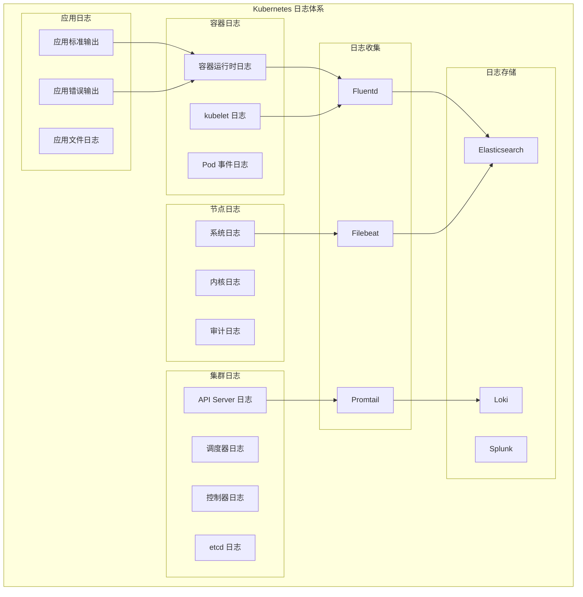

# 日志收集和分析方法

## 概述

日志分析是 Kubernetes 故障排查的重要手段。通过系统化的日志收集、存储和分析，可以快速定位问题根因，监控系统健康状况。

## 日志架构体系

### Kubernetes 日志层次



## 基础日志查看

### kubectl 日志命令

```bash
# 基础日志查看
kubectl logs <pod-name>
kubectl logs <pod-name> -n <namespace>

# 多容器 Pod 日志
kubectl logs <pod-name> -c <container-name>
kubectl logs <pod-name> --all-containers=true

# 实时日志跟踪
kubectl logs -f <pod-name>
kubectl logs -f <pod-name> -c <container-name>

# 历史日志
kubectl logs <pod-name> --previous
kubectl logs <pod-name> --previous -c <container-name>

# 日志时间范围
kubectl logs <pod-name> --since=1h
kubectl logs <pod-name> --since-time='2023-01-01T00:00:00Z'
kubectl logs <pod-name> --tail=100

# 多 Pod 日志聚合
kubectl logs -l app=nginx --prefix=true
kubectl logs -l app=nginx -f --max-log-requests=10
```

### 系统组件日志

```bash
# API Server 日志
kubectl logs -n kube-system kube-apiserver-$(hostname)

# Controller Manager 日志
kubectl logs -n kube-system kube-controller-manager-$(hostname)

# Scheduler 日志
kubectl logs -n kube-system kube-scheduler-$(hostname)

# etcd 日志
kubectl logs -n kube-system etcd-$(hostname)

# kubelet 日志（在节点上执行）
journalctl -u kubelet -f

# 容器运行时日志
journalctl -u containerd -f
journalctl -u docker -f  # 如果使用 Docker
```

## 日志分析技术

### 日志过滤和搜索

```bash
# 错误日志过滤
kubectl logs <pod-name> | grep -i error
kubectl logs <pod-name> | grep -i "exception\|error\|fail"

# 警告日志过滤
kubectl logs <pod-name> | grep -i "warn\|warning"

# 特定时间段日志
kubectl logs <pod-name> --since=1h | grep "$(date -d '30 minutes ago' '+%Y-%m-%d %H:%M')"

# 日志统计
kubectl logs <pod-name> | grep -c "ERROR"
kubectl logs <pod-name> | grep "ERROR" | wc -l

# 使用 awk 分析日志
kubectl logs <pod-name> | awk '/ERROR/ {count++} END {print "Total errors:", count+0}'
```

### 日志格式化分析

```bash
# JSON 日志解析
kubectl logs <pod-name> | jq 'select(.level == "error")'
kubectl logs <pod-name> | jq 'select(.timestamp > "2023-01-01T00:00:00Z")'

# 结构化日志分析脚本
#!/bin/bash
analyze_json_logs() {
    local pod_name=$1
    
    echo "=== JSON 日志分析 ==="
    
    # 错误级别统计
    echo "错误级别统计："
    kubectl logs $pod_name | jq -r '.level' | sort | uniq -c
    
    # 最近错误
    echo -e "\n最近错误："
    kubectl logs $pod_name | jq 'select(.level == "error")' | tail -5
    
    # HTTP 状态码统计
    echo -e "\nHTTP 状态码统计："
    kubectl logs $pod_name | jq -r '.status_code' | sort | uniq -c
}

# 调用函数
analyze_json_logs <pod-name>
```

### 日志聚合分析

```bash
#!/bin/bash
# 多 Pod 日志聚合分析脚本

NAMESPACE=${1:-default}
LABEL_SELECTOR=${2:-app}

echo "=== 多 Pod 日志聚合分析 ==="
echo "命名空间: $NAMESPACE"
echo "标签选择器: $LABEL_SELECTOR"

# 获取所有匹配的 Pod
PODS=$(kubectl get pods -n $NAMESPACE -l $LABEL_SELECTOR -o jsonpath='{.items[*].metadata.name}')

# 聚合错误统计
echo -e "\n错误统计："
for pod in $PODS; do
    error_count=$(kubectl logs $pod -n $NAMESPACE | grep -ci error)
    echo "$pod: $error_count errors"
done

# 聚合最近活动
echo -e "\n最近活动时间线："
for pod in $PODS; do
    echo "=== $pod ==="
    kubectl logs $pod -n $NAMESPACE --tail=5 --timestamps=true
done
```

## 日志收集架构

### Fluentd 日志收集

```yaml
# Fluentd DaemonSet 配置
apiVersion: apps/v1
kind: DaemonSet
metadata:
  name: fluentd
  namespace: kube-system
spec:
  selector:
    matchLabels:
      name: fluentd
  template:
    metadata:
      labels:
        name: fluentd
    spec:
      serviceAccount: fluentd
      containers:
      - name: fluentd
        image: fluent/fluentd-kubernetes-daemonset:v1-debian-elasticsearch
        env:
        - name: FLUENT_ELASTICSEARCH_HOST
          value: "elasticsearch.logging.svc.cluster.local"
        - name: FLUENT_ELASTICSEARCH_PORT
          value: "9200"
        - name: FLUENT_ELASTICSEARCH_SCHEME
          value: "http"
        volumeMounts:
        - name: varlog
          mountPath: /var/log
        - name: varlibdockercontainers
          mountPath: /var/lib/docker/containers
          readOnly: true
        - name: config-volume
          mountPath: /fluentd/etc
      volumes:
      - name: varlog
        hostPath:
          path: /var/log
      - name: varlibdockercontainers
        hostPath:
          path: /var/lib/docker/containers
      - name: config-volume
        configMap:
          name: fluentd-config
```

### Filebeat 日志收集

```yaml
# Filebeat DaemonSet 配置
apiVersion: apps/v1
kind: DaemonSet
metadata:
  name: filebeat
  namespace: kube-system
spec:
  selector:
    matchLabels:
      name: filebeat
  template:
    metadata:
      labels:
        name: filebeat
    spec:
      containers:
      - name: filebeat
        image: elastic/filebeat:7.10.0
        args: [
          "-c", "/etc/filebeat.yml",
          "-e"
        ]
        env:
        - name: ELASTICSEARCH_HOST
          value: elasticsearch.logging.svc.cluster.local
        - name: ELASTICSEARCH_PORT
          value: "9200"
        volumeMounts:
        - name: config
          mountPath: /etc/filebeat.yml
          subPath: filebeat.yml
        - name: data
          mountPath: /usr/share/filebeat/data
        - name: varlog
          mountPath: /var/log
          readOnly: true
        - name: varlibdockercontainers
          mountPath: /var/lib/docker/containers
          readOnly: true
      volumes:
      - name: config
        configMap:
          name: filebeat-config
      - name: data
        hostPath:
          path: /var/lib/filebeat-data
          type: DirectoryOrCreate
      - name: varlog
        hostPath:
          path: /var/log
      - name: varlibdockercontainers
        hostPath:
          path: /var/lib/docker/containers
```

### Promtail + Loki 日志收集

```yaml
# Promtail DaemonSet 配置
apiVersion: apps/v1
kind: DaemonSet
metadata:
  name: promtail
  namespace: loki-system
spec:
  selector:
    matchLabels:
      name: promtail
  template:
    metadata:
      labels:
        name: promtail
    spec:
      containers:
      - name: promtail
        image: grafana/promtail:2.3.0
        args:
        - -config.file=/etc/promtail/config.yml
        volumeMounts:
        - name: config
          mountPath: /etc/promtail
        - name: varlog
          mountPath: /var/log
          readOnly: true
        - name: varlibdockercontainers
          mountPath: /var/lib/docker/containers
          readOnly: true
        ports:
        - containerPort: 3101
          name: http-metrics
      volumes:
      - name: config
        configMap:
          name: promtail-config
      - name: varlog
        hostPath:
          path: /var/log
      - name: varlibdockercontainers
        hostPath:
          path: /var/lib/docker/containers
```

## 日志存储和查询

### Elasticsearch 查询

```bash
# Elasticsearch 基本查询
curl -X GET "elasticsearch:9200/_search" -H 'Content-Type: application/json' -d'
{
  "query": {
    "match": {
      "kubernetes.pod_name": "my-app"
    }
  },
  "sort": [
    {
      "@timestamp": {
        "order": "desc"
      }
    }
  ]
}'

# 复杂查询示例
curl -X GET "elasticsearch:9200/_search" -H 'Content-Type: application/json' -d'
{
  "query": {
    "bool": {
      "must": [
        {
          "match": {
            "kubernetes.namespace_name": "production"
          }
        },
        {
          "match": {
            "level": "error"
          }
        }
      ],
      "filter": [
        {
          "range": {
            "@timestamp": {
              "gte": "now-1h"
            }
          }
        }
      ]
    }
  }
}'
```

### Loki 查询语言 (LogQL)

```bash
# 基本 LogQL 查询
{job="kubernetes-pods"} |= "error"

# 按命名空间过滤
{job="kubernetes-pods", namespace="production"} |= "error"

# 正则表达式过滤
{job="kubernetes-pods"} |~ "error|exception|fail"

# 时间范围查询
{job="kubernetes-pods"}[1h] |= "error"

# 聚合查询
sum(rate({job="kubernetes-pods"} |= "error" [5m])) by (pod)

# 复杂查询示例
{job="kubernetes-pods", namespace="production"} 
|= "error" 
| json 
| level="error" 
| line_format "{{.timestamp}} {{.level}} {{.message}}"
```

## 日志分析工具

### 日志分析脚本

```bash
#!/bin/bash
# Kubernetes 日志分析工具

analyze_pod_logs() {
    local pod_name=$1
    local namespace=${2:-default}
    local time_range=${3:-1h}
    
    echo "=== Pod 日志分析 ==="
    echo "Pod: $pod_name"
    echo "Namespace: $namespace"
    echo "时间范围: $time_range"
    
    # 1. 基本统计
    echo -e "\n1. 日志基本统计："
    local total_lines=$(kubectl logs $pod_name -n $namespace --since=$time_range | wc -l)
    local error_lines=$(kubectl logs $pod_name -n $namespace --since=$time_range | grep -ci error)
    local warn_lines=$(kubectl logs $pod_name -n $namespace --since=$time_range | grep -ci warn)
    
    echo "总行数: $total_lines"
    echo "错误行数: $error_lines"
    echo "警告行数: $warn_lines"
    
    # 2. 错误分析
    echo -e "\n2. 错误分析："
    kubectl logs $pod_name -n $namespace --since=$time_range | grep -i error | head -5
    
    # 3. 频繁错误模式
    echo -e "\n3. 频繁错误模式："
    kubectl logs $pod_name -n $namespace --since=$time_range | grep -i error | awk '{print $NF}' | sort | uniq -c | sort -nr | head -5
    
    # 4. 时间线分析
    echo -e "\n4. 最近活动时间线："
    kubectl logs $pod_name -n $namespace --since=10m --timestamps=true | tail -10
}

# 使用示例
analyze_pod_logs "my-app-pod" "default" "2h"
```

### 日志模式识别

```bash
#!/bin/bash
# 日志模式识别和异常检测

detect_log_patterns() {
    local pod_name=$1
    local namespace=${2:-default}
    
    echo "=== 日志模式识别 ==="
    
    # HTTP 状态码统计
    echo "HTTP 状态码分布："
    kubectl logs $pod_name -n $namespace | grep -o 'HTTP [0-9]\{3\}' | sort | uniq -c
    
    # 响应时间分析
    echo -e "\n响应时间分析："
    kubectl logs $pod_name -n $namespace | grep -o 'took [0-9]\+ms' | awk '{print $2}' | sed 's/ms//' | sort -n | tail -10
    
    # 内存使用模式
    echo -e "\n内存使用模式："
    kubectl logs $pod_name -n $namespace | grep -o 'memory: [0-9]\+MB' | awk '{print $2}' | sed 's/MB//' | sort -n | tail -10
    
    # 异常堆栈跟踪
    echo -e "\n异常堆栈跟踪："
    kubectl logs $pod_name -n $namespace | grep -A 5 "Exception\|Error" | head -20
}
```

## 日志告警和监控

### 基于日志的告警规则

```yaml
# Prometheus 日志告警规则
groups:
- name: log-based-alerts
  rules:
  - alert: HighErrorRate
    expr: |
      (
        sum(rate(fluentd_output_status_num_records_total{status="retry"}[5m])) /
        sum(rate(fluentd_output_status_num_records_total[5m]))
      ) > 0.1
    for: 2m
    labels:
      severity: warning
    annotations:
      summary: "High log error rate detected"
      description: "Error rate is {{ $value | humanizePercentage }}"

  - alert: LogVolumeSpike
    expr: |
      sum(rate(fluentd_output_status_num_records_total[5m])) >
      sum(rate(fluentd_output_status_num_records_total[5m] offset 1h)) * 2
    for: 5m
    labels:
      severity: warning
    annotations:
      summary: "Log volume spike detected"
      description: "Log volume increased significantly"

  - alert: ApplicationErrors
    expr: |
      increase(
        sum by (pod) (
          fluentd_output_status_num_records_total{
            status=~".*error.*"
          }
        )[5m:]
      ) > 10
    for: 1m
    labels:
      severity: critical
    annotations:
      summary: "High application error count"
      description: "Pod {{ $labels.pod }} has {{ $value }} errors in the last 5 minutes"
```

### 日志监控仪表板

```json
{
  "dashboard": {
    "title": "Kubernetes 日志监控",
    "panels": [
      {
        "title": "日志错误率",
        "type": "graph",
        "targets": [
          {
            "expr": "sum(rate(fluentd_output_status_num_records_total{status=\"retry\"}[5m])) / sum(rate(fluentd_output_status_num_records_total[5m]))",
            "legendFormat": "错误率"
          }
        ]
      },
      {
        "title": "日志量趋势",
        "type": "graph",
        "targets": [
          {
            "expr": "sum(rate(fluentd_output_status_num_records_total[5m]))",
            "legendFormat": "日志条数/秒"
          }
        ]
      },
      {
        "title": "Top 错误 Pod",
        "type": "table",
        "targets": [
          {
            "expr": "topk(10, sum by (pod) (rate(fluentd_output_status_num_records_total{status=~\".*error.*\"}[5m])))",
            "format": "table"
          }
        ]
      }
    ]
  }
}
```

## 日志最佳实践

### 结构化日志实践

```yaml
# 应用日志配置示例
apiVersion: v1
kind: ConfigMap
metadata:
  name: app-logging-config
data:
  logback.xml: |
    <configuration>
      <appender name="STDOUT" class="ch.qos.logback.core.ConsoleAppender">
        <encoder class="net.logstash.logback.encoder.LoggingEventCompositeJsonEncoder">
          <providers>
            <timestamp/>
            <logLevel/>
            <loggerName/>
            <mdc/>
            <message/>
          </providers>
        </encoder>
      </appender>
      <root level="INFO">
        <appender-ref ref="STDOUT"/>
      </root>
    </configuration>
```

### 日志轮转和清理

```bash
#!/bin/bash
# 日志清理脚本

cleanup_old_logs() {
    local retention_days=${1:-7}
    
    echo "=== 日志清理 ==="
    echo "保留天数: $retention_days"
    
    # 清理节点上的容器日志
    find /var/log/pods -name "*.log" -mtime +$retention_days -delete
    find /var/lib/docker/containers -name "*-json.log" -mtime +$retention_days -delete
    
    # 清理系统日志
    journalctl --vacuum-time=${retention_days}d
    
    echo "日志清理完成"
}

# 定期执行清理
cleanup_old_logs 7
```

### 日志性能优化

```yaml
# 优化的 Fluentd 配置
apiVersion: v1
kind: ConfigMap
metadata:
  name: fluentd-config
data:
  fluent.conf: |
    <source>
      @type tail
      path /var/log/containers/*.log
      pos_file /var/log/fluentd-containers.log.pos
      tag kubernetes.*
      read_from_head true
      <parse>
        @type json
        time_format %Y-%m-%dT%H:%M:%S.%NZ
      </parse>
    </source>
    
    <filter kubernetes.**>
      @type kubernetes_metadata
    </filter>
    
    # 添加缓冲区优化
    <match **>
      @type elasticsearch
      host elasticsearch.logging.svc.cluster.local
      port 9200
      index_name fluentd
      type_name fluentd
      
      # 性能优化配置
      <buffer>
        @type file
        path /var/log/fluentd-buffers/kubernetes.system.buffer
        flush_mode interval
        retry_type exponential_backoff
        flush_thread_count 2
        flush_interval 5s
        retry_forever
        retry_max_interval 30
        chunk_limit_size 2M
        total_limit_size 500M
      </buffer>
    </match>
```

通过系统化的日志收集、分析和监控，可以有效提升 Kubernetes 集群的可观测性和故障排查能力。
