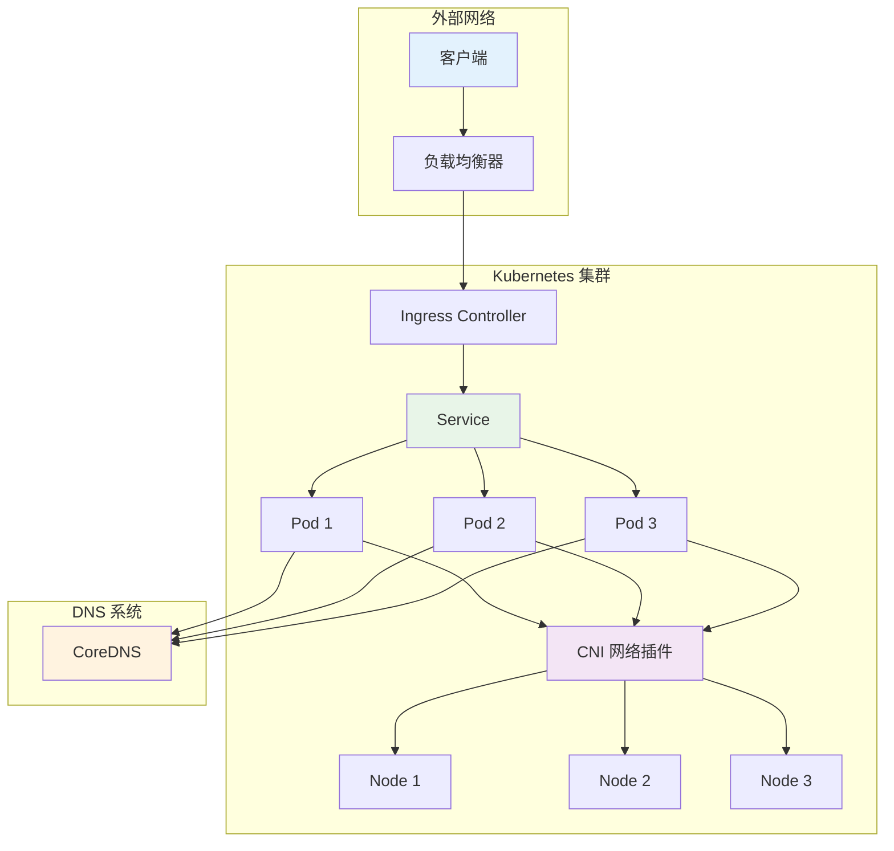

# Kubernetes 网络故障排查

## 网络故障排查概述

Kubernetes 网络故障是集群中最复杂的问题之一，涉及多个层面：Pod 网络、Service 网络、DNS 解析、Ingress 控制器和外部网络连接。有效的网络故障排查需要理解 Kubernetes 网络模型和各组件的工作原理。

### Kubernetes 网络模型



## 常见网络故障类型

### 1. Pod 间网络连通性问题

**故障特征**：Pod 之间无法相互通信

**排查脚本**：
```bash
#!/bin/bash
# Pod 网络连通性排查

diagnose_pod_connectivity() {
    local SOURCE_POD=$1
    local TARGET_POD=$2
    local SOURCE_NS=${3:-default}
    local TARGET_NS=${4:-default}
    
    echo "=== Pod 网络连通性诊断 ==="
    echo "源 Pod: $SOURCE_POD (命名空间: $SOURCE_NS)"
    echo "目标 Pod: $TARGET_POD (命名空间: $TARGET_NS)"
    echo ""
    
    # 1. 获取 Pod IP 信息
    echo "1. Pod IP 信息："
    SOURCE_IP=$(kubectl get pod $SOURCE_POD -n $SOURCE_NS -o jsonpath='{.status.podIP}')
    TARGET_IP=$(kubectl get pod $TARGET_POD -n $TARGET_NS -o jsonpath='{.status.podIP}')
    SOURCE_NODE=$(kubectl get pod $SOURCE_POD -n $SOURCE_NS -o jsonpath='{.spec.nodeName}')
    TARGET_NODE=$(kubectl get pod $TARGET_POD -n $TARGET_NS -o jsonpath='{.spec.nodeName}')
    
    echo "源 Pod IP: $SOURCE_IP (节点: $SOURCE_NODE)"
    echo "目标 Pod IP: $TARGET_IP (节点: $TARGET_NODE)"
    
    # 2. 基础网络测试
    echo -e "\n2. 基础连通性测试："
    test_pod_connectivity $SOURCE_POD $SOURCE_NS $TARGET_IP
    
    # 3. 检查网络策略
    echo -e "\n3. 网络策略检查："
    check_network_policies $SOURCE_NS $TARGET_NS
    
    # 4. 检查 CNI 插件状态
    echo -e "\n4. CNI 插件状态："
    check_cni_status
    
    # 5. 检查节点网络配置
    echo -e "\n5. 节点网络配置："
    check_node_network $SOURCE_NODE $TARGET_NODE
    
    # 6. 路由表检查
    echo -e "\n6. 路由表检查："
    check_routing_table $SOURCE_POD $SOURCE_NS
    
    # 7. 提供解决建议
    echo -e "\n7. 解决建议："
    suggest_connectivity_solutions $SOURCE_NODE $TARGET_NODE
}

test_pod_connectivity() {
    local SOURCE_POD=$1
    local SOURCE_NS=$2
    local TARGET_IP=$3
    
    echo "执行 ping 测试:"
    kubectl exec $SOURCE_POD -n $SOURCE_NS -- ping -c 3 $TARGET_IP 2>/dev/null && echo "✓ ping 成功" || echo "❌ ping 失败"
    
    echo "执行 telnet 测试 (80端口):"
    kubectl exec $SOURCE_POD -n $SOURCE_NS -- timeout 5 telnet $TARGET_IP 80 2>/dev/null && echo "✓ 端口 80 可达" || echo "❌ 端口 80 不可达"
    
    echo "执行网络追踪:"
    kubectl exec $SOURCE_POD -n $SOURCE_NS -- traceroute $TARGET_IP 2>/dev/null | head -5 || echo "traceroute 不可用"
}

check_network_policies() {
    local SOURCE_NS=$1
    local TARGET_NS=$2
    
    echo "检查源命名空间的网络策略:"
    kubectl get networkpolicy -n $SOURCE_NS
    
    echo -e "\n检查目标命名空间的网络策略:"
    kubectl get networkpolicy -n $TARGET_NS
    
    # 检查是否有拒绝策略
    DENY_POLICIES=$(kubectl get networkpolicy --all-namespaces -o json | jq -r '.items[] | select(.spec.policyTypes[]? == "Ingress" or .spec.policyTypes[]? == "Egress") | "\(.metadata.namespace)/\(.metadata.name)"')
    
    if [ -n "$DENY_POLICIES" ]; then
        echo -e "\n发现限制性网络策略:"
        echo "$DENY_POLICIES"
    fi
}

check_cni_status() {
    echo "CNI 插件 Pod 状态:"
    kubectl get pods -n kube-system | grep -E "(calico|flannel|weave|cilium|antrea)" || echo "未找到标准 CNI 插件"
    
    echo -e "\nCNI 配置检查:"
    kubectl get nodes -o json | jq -r '.items[0].status.nodeInfo.containerRuntimeVersion'
}

check_node_network() {
    local SOURCE_NODE=$1
    local TARGET_NODE=$2
    
    echo "节点网络状态:"
    echo "源节点: $SOURCE_NODE"
    echo "目标节点: $TARGET_NODE"
    
    # 检查节点间连通性（需要节点访问权限）
    if [ "$SOURCE_NODE" != "$TARGET_NODE" ]; then
        echo "跨节点通信场景"
        # 实际环境中需要 SSH 访问权限
        # ssh $SOURCE_NODE "ping -c 3 $TARGET_NODE_IP"
    else
        echo "同节点通信场景"
    fi
}

check_routing_table() {
    local SOURCE_POD=$1
    local SOURCE_NS=$2
    
    echo "Pod 路由表:"
    kubectl exec $SOURCE_POD -n $SOURCE_NS -- route -n 2>/dev/null || kubectl exec $SOURCE_POD -n $SOURCE_NS -- ip route 2>/dev/null || echo "无法获取路由信息"
    
    echo -e "\nPod 网络接口:"
    kubectl exec $SOURCE_POD -n $SOURCE_NS -- ip addr 2>/dev/null || echo "无法获取网络接口信息"
}

suggest_connectivity_solutions() {
    local SOURCE_NODE=$1
    local TARGET_NODE=$2
    
    echo "常见解决方案:"
    echo "1. 检查网络策略配置"
    echo "   - 确保没有阻止流量的策略"
    echo "   - 验证 ingress/egress 规则"
    
    echo "2. 检查 CNI 插件状态"
    echo "   - 重启 CNI 插件 Pod"
    echo "   - 检查 CNI 配置文件"
    
    echo "3. 检查节点网络"
    echo "   - 验证节点间网络连通性"
    echo "   - 检查防火墙规则"
    
    if [ "$SOURCE_NODE" != "$TARGET_NODE" ]; then
        echo "4. 跨节点网络特殊检查"
        echo "   - 检查 VXLAN/隧道配置"
        echo "   - 验证路由表配置"
        echo "   - 检查 BGP 配置（如使用 Calico）"
    fi
    
    echo "5. 临时解决方案"
    echo "   - 重启相关 Pod"
    echo "   - 重启 CNI 插件"
    echo "   - 检查集群 DNS 配置"
}

# 使用示例
# diagnose_pod_connectivity "pod1" "pod2" "namespace1" "namespace2"
```

### 2. Service 发现和访问问题

**故障特征**：无法通过 Service 访问后端 Pod

**排查脚本**：
```bash
#!/bin/bash
# Service 故障排查

diagnose_service_issues() {
    local SERVICE_NAME=$1
    local NAMESPACE=${2:-default}
    
    echo "=== Service 故障诊断 ==="
    echo "Service: $SERVICE_NAME"
    echo "Namespace: $NAMESPACE"
    echo ""
    
    # 1. 检查 Service 基本信息
    echo "1. Service 基本信息："
    kubectl get service $SERVICE_NAME -n $NAMESPACE -o wide
    
    # 2. 检查 Service 详细配置
    echo -e "\n2. Service 详细配置："
    kubectl describe service $SERVICE_NAME -n $NAMESPACE
    
    # 3. 检查 Endpoints
    echo -e "\n3. Endpoints 检查："
    check_service_endpoints $SERVICE_NAME $NAMESPACE
    
    # 4. 检查后端 Pod
    echo -e "\n4. 后端 Pod 状态："
    check_backend_pods $SERVICE_NAME $NAMESPACE
    
    # 5. 测试 Service 连通性
    echo -e "\n5. Service 连通性测试："
    test_service_connectivity $SERVICE_NAME $NAMESPACE
    
    # 6. 检查 kube-proxy 状态
    echo -e "\n6. kube-proxy 状态："
    check_kube_proxy_status
    
    # 7. 检查 iptables 规则
    echo -e "\n7. iptables 规则检查："
    check_iptables_rules $SERVICE_NAME $NAMESPACE
    
    # 8. 提供解决建议
    echo -e "\n8. 解决建议："
    suggest_service_solutions $SERVICE_NAME $NAMESPACE
}

check_service_endpoints() {
    local SERVICE_NAME=$1
    local NAMESPACE=$2
    
    kubectl get endpoints $SERVICE_NAME -n $NAMESPACE
    
    ENDPOINT_COUNT=$(kubectl get endpoints $SERVICE_NAME -n $NAMESPACE -o jsonpath='{.subsets[0].addresses}' | jq length 2>/dev/null || echo "0")
    
    if [ "$ENDPOINT_COUNT" = "0" ] || [ "$ENDPOINT_COUNT" = "null" ]; then
        echo "❌ 发现问题: Service 没有可用的 Endpoints"
        echo "可能原因:"
        echo "- Pod 标签与 Service 选择器不匹配"
        echo "- Pod 未处于 Ready 状态"
        echo "- Pod 端口配置错误"
    else
        echo "✓ Service 有 $ENDPOINT_COUNT 个可用 Endpoints"
    fi
}

check_backend_pods() {
    local SERVICE_NAME=$1
    local NAMESPACE=$2
    
    # 获取 Service 选择器
    SELECTOR=$(kubectl get service $SERVICE_NAME -n $NAMESPACE -o jsonpath='{.spec.selector}' | jq -r 'to_entries[] | "\(.key)=\(.value)"' | tr '\n' ',' | sed 's/,$//')
    
    if [ -n "$SELECTOR" ] && [ "$SELECTOR" != "null" ]; then
        echo "Service 选择器: $SELECTOR"
        echo "匹配的 Pod:"
        kubectl get pods -n $NAMESPACE -l "$SELECTOR" -o wide
        
        echo -e "\nPod 就绪状态:"
        kubectl get pods -n $NAMESPACE -l "$SELECTOR" -o custom-columns="NAME:.metadata.name,READY:.status.conditions[?(@.type=='Ready')].status,STATUS:.status.phase"
    else
        echo "❌ Service 没有配置选择器"
    fi
}

test_service_connectivity() {
    local SERVICE_NAME=$1
    local NAMESPACE=$2
    
    SERVICE_IP=$(kubectl get service $SERVICE_NAME -n $NAMESPACE -o jsonpath='{.spec.clusterIP}')
    SERVICE_PORT=$(kubectl get service $SERVICE_NAME -n $NAMESPACE -o jsonpath='{.spec.ports[0].port}')
    
    echo "Service ClusterIP: $SERVICE_IP"
    echo "Service Port: $SERVICE_PORT"
    
    # 创建测试 Pod 进行连通性测试
    echo "执行连通性测试:"
    kubectl run service-test-$(date +%s) --image=busybox --rm -i --tty --restart=Never -- sh -c "
    echo '测试 Service IP 连通性:'
    nc -zv $SERVICE_IP $SERVICE_PORT
    echo '测试 Service DNS 解析:'
    nslookup $SERVICE_NAME.$NAMESPACE.svc.cluster.local
    echo '测试 HTTP 连接:'
    wget -qO- --timeout=5 http://$SERVICE_IP:$SERVICE_PORT/ || echo 'HTTP 连接失败'
    " 2>/dev/null || echo "连通性测试失败"
}

check_kube_proxy_status() {
    echo "kube-proxy Pod 状态:"
    kubectl get pods -n kube-system -l k8s-app=kube-proxy
    
    echo -e "\nkube-proxy 日志 (最近10行):"
    kubectl logs -n kube-system -l k8s-app=kube-proxy --tail=10 | head -10
    
    echo -e "\nkube-proxy 配置模式:"
    kubectl get configmap kube-proxy -n kube-system -o yaml | grep mode || echo "未找到配置模式"
}

check_iptables_rules() {
    local SERVICE_NAME=$1
    local NAMESPACE=$2
    
    SERVICE_IP=$(kubectl get service $SERVICE_NAME -n $NAMESPACE -o jsonpath='{.spec.clusterIP}')
    
    echo "检查与 Service $SERVICE_IP 相关的 iptables 规则:"
    echo "注意: 需要节点访问权限才能查看完整 iptables 规则"
    
    # 在实际环境中，需要在节点上执行
    # ssh node "iptables -t nat -L | grep $SERVICE_IP"
    # ssh node "ipvsadm -ln | grep $SERVICE_IP"  # 如果使用 IPVS 模式
    
    echo "检查项目:"
    echo "- KUBE-SERVICES 链中的 Service 规则"
    echo "- KUBE-SVC-* 链中的负载均衡规则"
    echo "- KUBE-SEP-* 链中的 Endpoint 规则"
}

suggest_service_solutions() {
    local SERVICE_NAME=$1
    local NAMESPACE=$2
    
    echo "常见解决方案:"
    
    # 检查 Endpoints 状态
    ENDPOINT_COUNT=$(kubectl get endpoints $SERVICE_NAME -n $NAMESPACE -o jsonpath='{.subsets[0].addresses}' | jq length 2>/dev/null || echo "0")
    
    if [ "$ENDPOINT_COUNT" = "0" ] || [ "$ENDPOINT_COUNT" = "null" ]; then
        echo "1. 解决 Endpoints 问题:"
        echo "   - 检查 Pod 标签是否与 Service 选择器匹配"
        echo "   - 确保 Pod 处于 Running 和 Ready 状态"
        echo "   - 验证 Pod 监听的端口与 Service 端口配置一致"
        echo ""
        echo "   标签检查命令:"
        echo "   kubectl get service $SERVICE_NAME -n $NAMESPACE -o yaml | grep -A 5 selector"
        echo "   kubectl get pods -n $NAMESPACE --show-labels"
    fi
    
    echo "2. 网络层面解决方案:"
    echo "   - 重启 kube-proxy"
    echo "   - 检查 CNI 插件状态"
    echo "   - 验证节点防火墙配置"
    
    echo "3. Service 配置检查:"
    echo "   - 验证端口配置"
    echo "   - 检查 Service 类型 (ClusterIP/NodePort/LoadBalancer)"
    echo "   - 确认 targetPort 与 Pod 实际监听端口一致"
    
    echo "4. 调试命令:"
    echo "   kubectl get endpoints $SERVICE_NAME -n $NAMESPACE -o yaml"
    echo "   kubectl describe service $SERVICE_NAME -n $NAMESPACE"
    echo "   kubectl logs -n kube-system -l k8s-app=kube-proxy"
}

# 使用示例
# diagnose_service_issues "my-service" "default"
```

### 3. DNS 解析问题

**故障特征**：Pod 无法解析服务名或外部域名

**排查脚本**：
```bash
#!/bin/bash
# DNS 解析问题排查

diagnose_dns_issues() {
    local POD_NAME=$1
    local NAMESPACE=${2:-default}
    
    echo "=== DNS 解析问题诊断 ==="
    echo "Pod: $POD_NAME"
    echo "Namespace: $NAMESPACE"
    echo ""
    
    # 1. 检查 CoreDNS 状态
    echo "1. CoreDNS 服务状态："
    check_coredns_status
    
    # 2. 检查 Pod DNS 配置
    echo -e "\n2. Pod DNS 配置："
    check_pod_dns_config $POD_NAME $NAMESPACE
    
    # 3. 执行 DNS 解析测试
    echo -e "\n3. DNS 解析测试："
    test_dns_resolution $POD_NAME $NAMESPACE
    
    # 4. 检查 DNS 服务发现
    echo -e "\n4. Service DNS 解析测试："
    test_service_dns $POD_NAME $NAMESPACE
    
    # 5. 检查 DNS 性能
    echo -e "\n5. DNS 性能测试："
    test_dns_performance $POD_NAME $NAMESPACE
    
    # 6. 检查 DNS 配置文件
    echo -e "\n6. DNS 配置检查："
    check_dns_configuration
    
    # 7. 提供解决建议
    echo -e "\n7. 解决建议："
    suggest_dns_solutions
}

check_coredns_status() {
    echo "CoreDNS Pod 状态:"
    kubectl get pods -n kube-system -l k8s-app=kube-dns
    
    echo -e "\nCoreDNS Service 状态:"
    kubectl get service -n kube-system kube-dns
    
    echo -e "\nCoreDNS 日志 (最近10行):"
    kubectl logs -n kube-system -l k8s-app=kube-dns --tail=10 | head -10
    
    # 检查 CoreDNS 配置
    echo -e "\nCoreDNS 配置:"
    kubectl get configmap coredns -n kube-system -o yaml | grep -A 20 "Corefile:"
}

check_pod_dns_config() {
    local POD_NAME=$1
    local NAMESPACE=$2
    
    echo "Pod DNS 策略:"
    kubectl get pod $POD_NAME -n $NAMESPACE -o jsonpath='{.spec.dnsPolicy}'
    
    echo -e "\nPod /etc/resolv.conf 内容:"
    kubectl exec $POD_NAME -n $NAMESPACE -- cat /etc/resolv.conf 2>/dev/null || echo "无法读取 resolv.conf"
    
    echo -e "\nPod /etc/hosts 内容:"
    kubectl exec $POD_NAME -n $NAMESPACE -- cat /etc/hosts 2>/dev/null || echo "无法读取 hosts 文件"
}

test_dns_resolution() {
    local POD_NAME=$1
    local NAMESPACE=$2
    
    echo "外部域名解析测试:"
    kubectl exec $POD_NAME -n $NAMESPACE -- nslookup google.com 2>/dev/null && echo "✓ 外部域名解析成功" || echo "❌ 外部域名解析失败"
    
    echo -e "\nKubernetes API 解析测试:"
    kubectl exec $POD_NAME -n $NAMESPACE -- nslookup kubernetes.default.svc.cluster.local 2>/dev/null && echo "✓ Kubernetes API 解析成功" || echo "❌ Kubernetes API 解析失败"
    
    echo -e "\nCoreDNS 服务解析测试:"
    kubectl exec $POD_NAME -n $NAMESPACE -- nslookup kube-dns.kube-system.svc.cluster.local 2>/dev/null && echo "✓ CoreDNS 解析成功" || echo "❌ CoreDNS 解析失败"
}

test_service_dns() {
    local POD_NAME=$1
    local NAMESPACE=$2
    
    echo "Service DNS 解析测试:"
    
    # 获取当前命名空间的服务
    SERVICES=$(kubectl get services -n $NAMESPACE --no-headers | awk '{print $1}' | head -3)
    
    for service in $SERVICES; do
        echo "测试服务: $service"
        kubectl exec $POD_NAME -n $NAMESPACE -- nslookup $service 2>/dev/null && echo "✓ $service 解析成功" || echo "❌ $service 解析失败"
        kubectl exec $POD_NAME -n $NAMESPACE -- nslookup $service.$NAMESPACE.svc.cluster.local 2>/dev/null && echo "✓ $service FQDN 解析成功" || echo "❌ $service FQDN 解析失败"
    done
}

test_dns_performance() {
    local POD_NAME=$1
    local NAMESPACE=$2
    
    echo "DNS 性能测试:"
    
    # 使用 dig 进行性能测试
    kubectl exec $POD_NAME -n $NAMESPACE -- sh -c "
    if command -v dig >/dev/null; then
        echo '使用 dig 进行性能测试:'
        time dig @$(grep nameserver /etc/resolv.conf | head -1 | awk '{print \$2}') kubernetes.default.svc.cluster.local
    else
        echo 'dig 命令不可用，使用 nslookup:'
        time nslookup kubernetes.default.svc.cluster.local
    fi
    " 2>/dev/null || echo "DNS 性能测试失败"
}

check_dns_configuration() {
    echo "集群 DNS 配置:"
    kubectl get service kube-dns -n kube-system -o jsonpath='{.spec.clusterIP}'
    
    echo -e "\nCoreDNS ConfigMap:"
    kubectl get configmap coredns -n kube-system -o yaml
    
    echo -e "\nkubelet DNS 配置:"
    # 需要节点访问权限
    # ssh node "ps aux | grep kubelet | grep cluster-dns"
    echo "检查 kubelet 启动参数中的 --cluster-dns 和 --cluster-domain"
}

suggest_dns_solutions() {
    echo "常见 DNS 问题解决方案:"
    
    echo "1. CoreDNS 相关问题:"
    echo "   - 重启 CoreDNS Pod"
    echo "   - 检查 CoreDNS 配置"
    echo "   - 验证 CoreDNS 服务和端点"
    echo "   命令: kubectl rollout restart deployment/coredns -n kube-system"
    
    echo "2. Pod DNS 配置问题:"
    echo "   - 检查 Pod DNS 策略设置"
    echo "   - 验证 /etc/resolv.conf 配置"
    echo "   - 检查自定义 DNS 配置"
    
    echo "3. 网络连通性问题:"
    echo "   - 验证 Pod 到 CoreDNS 的网络连通性"
    echo "   - 检查 53 端口是否可达"
    echo "   - 验证网络策略是否阻止 DNS 流量"
    
    echo "4. 上游 DNS 问题:"
    echo "   - 检查外部 DNS 服务器配置"
    echo "   - 验证集群网络出口配置"
    echo "   - 检查防火墙规则"
    
    echo "5. 性能优化:"
    echo "   - 调整 CoreDNS 副本数"
    echo "   - 优化 CoreDNS 缓存配置"
    echo "   - 使用 NodeLocal DNSCache"
    
    echo "6. 调试命令:"
    echo "   kubectl run dns-debug --image=busybox --rm -it --restart=Never -- sh"
    echo "   kubectl exec -it dns-debug -- nslookup kubernetes.default"
    echo "   kubectl logs -n kube-system -l k8s-app=kube-dns"
}

# 使用示例
# diagnose_dns_issues "my-pod" "default"
```

### 4. Ingress 控制器问题

**故障特征**：外部无法访问集群内服务

**排查脚本**：
```bash
#!/bin/bash
# Ingress 控制器问题排查

diagnose_ingress_issues() {
    local INGRESS_NAME=$1
    local NAMESPACE=${2:-default}
    
    echo "=== Ingress 故障诊断 ==="
    echo "Ingress: $INGRESS_NAME"
    echo "Namespace: $NAMESPACE"
    echo ""
    
    # 1. 检查 Ingress 资源
    echo "1. Ingress 资源状态："
    check_ingress_resource $INGRESS_NAME $NAMESPACE
    
    # 2. 检查 Ingress 控制器
    echo -e "\n2. Ingress 控制器状态："
    check_ingress_controller
    
    # 3. 检查后端服务
    echo -e "\n3. 后端服务检查："
    check_ingress_backend_services $INGRESS_NAME $NAMESPACE
    
    # 4. 检查 TLS 配置
    echo -e "\n4. TLS 配置检查："
    check_ingress_tls $INGRESS_NAME $NAMESPACE
    
    # 5. 测试 Ingress 连通性
    echo -e "\n5. Ingress 连通性测试："
    test_ingress_connectivity $INGRESS_NAME $NAMESPACE
    
    # 6. 检查 DNS 和证书
    echo -e "\n6. DNS 和证书检查："
    check_ingress_dns_cert $INGRESS_NAME $NAMESPACE
    
    # 7. 提供解决建议
    echo -e "\n7. 解决建议："
    suggest_ingress_solutions
}

check_ingress_resource() {
    local INGRESS_NAME=$1
    local NAMESPACE=$2
    
    echo "Ingress 基本信息:"
    kubectl get ingress $INGRESS_NAME -n $NAMESPACE -o wide
    
    echo -e "\nIngress 详细配置:"
    kubectl describe ingress $INGRESS_NAME -n $NAMESPACE
    
    echo -e "\nIngress 状态检查:"
    ADDRESS=$(kubectl get ingress $INGRESS_NAME -n $NAMESPACE -o jsonpath='{.status.loadBalancer.ingress[0].ip}')
    if [ -z "$ADDRESS" ]; then
        ADDRESS=$(kubectl get ingress $INGRESS_NAME -n $NAMESPACE -o jsonpath='{.status.loadBalancer.ingress[0].hostname}')
    fi
    
    if [ -n "$ADDRESS" ]; then
        echo "✓ Ingress 地址已分配: $ADDRESS"
    else
        echo "❌ Ingress 地址未分配"
    fi
}

check_ingress_controller() {
    echo "常见 Ingress 控制器检查:"
    
    # NGINX Ingress Controller
    NGINX_PODS=$(kubectl get pods -n ingress-nginx -l app.kubernetes.io/name=ingress-nginx --no-headers 2>/dev/null | wc -l)
    if [ $NGINX_PODS -gt 0 ]; then
        echo "NGINX Ingress Controller:"
        kubectl get pods -n ingress-nginx -l app.kubernetes.io/name=ingress-nginx
        kubectl get service -n ingress-nginx
    fi
    
    # Traefik Ingress Controller
    TRAEFIK_PODS=$(kubectl get pods -n kube-system -l app=traefik --no-headers 2>/dev/null | wc -l)
    if [ $TRAEFIK_PODS -gt 0 ]; then
        echo "Traefik Ingress Controller:"
        kubectl get pods -n kube-system -l app=traefik
    fi
    
    # Istio Gateway
    ISTIO_PODS=$(kubectl get pods -n istio-system -l app=istio-ingressgateway --no-headers 2>/dev/null | wc -l)
    if [ $ISTIO_PODS -gt 0 ]; then
        echo "Istio Ingress Gateway:"
        kubectl get pods -n istio-system -l app=istio-ingressgateway
    fi
    
    if [ $NGINX_PODS -eq 0 ] && [ $TRAEFIK_PODS -eq 0 ] && [ $ISTIO_PODS -eq 0 ]; then
        echo "❌ 未找到常见的 Ingress 控制器"
    fi
}

check_ingress_backend_services() {
    local INGRESS_NAME=$1
    local NAMESPACE=$2
    
    echo "检查 Ingress 后端服务:"
    
    # 获取 Ingress 规则中的服务
    SERVICES=$(kubectl get ingress $INGRESS_NAME -n $NAMESPACE -o json | jq -r '.spec.rules[]?.http.paths[]?.backend.service.name' 2>/dev/null)
    
    for service in $SERVICES; do
        if [ "$service" != "null" ] && [ -n "$service" ]; then
            echo "检查服务: $service"
            kubectl get service $service -n $NAMESPACE
            kubectl get endpoints $service -n $NAMESPACE
            
            ENDPOINT_COUNT=$(kubectl get endpoints $service -n $NAMESPACE -o jsonpath='{.subsets[0].addresses}' | jq length 2>/dev/null || echo "0")
            if [ "$ENDPOINT_COUNT" = "0" ] || [ "$ENDPOINT_COUNT" = "null" ]; then
                echo "❌ 服务 $service 没有可用的 Endpoints"
            else
                echo "✓ 服务 $service 有 $ENDPOINT_COUNT 个 Endpoints"
            fi
        fi
    done
}

check_ingress_tls() {
    local INGRESS_NAME=$1
    local NAMESPACE=$2
    
    echo "TLS 配置检查:"
    
    TLS_SECRETS=$(kubectl get ingress $INGRESS_NAME -n $NAMESPACE -o json | jq -r '.spec.tls[]?.secretName' 2>/dev/null)
    
    if [ -n "$TLS_SECRETS" ] && [ "$TLS_SECRETS" != "null" ]; then
        for secret in $TLS_SECRETS; do
            echo "检查 TLS Secret: $secret"
            kubectl get secret $secret -n $NAMESPACE
            
            # 检查证书有效期
            kubectl get secret $secret -n $NAMESPACE -o jsonpath='{.data.tls\.crt}' | base64 -d | openssl x509 -noout -dates 2>/dev/null || echo "无法解析证书日期"
        done
    else
        echo "未配置 TLS"
    fi
}

test_ingress_connectivity() {
    local INGRESS_NAME=$1
    local NAMESPACE=$2
    
    echo "Ingress 连通性测试:"
    
    # 获取 Ingress 地址
    ADDRESS=$(kubectl get ingress $INGRESS_NAME -n $NAMESPACE -o jsonpath='{.status.loadBalancer.ingress[0].ip}')
    if [ -z "$ADDRESS" ]; then
        ADDRESS=$(kubectl get ingress $INGRESS_NAME -n $NAMESPACE -o jsonpath='{.status.loadBalancer.ingress[0].hostname}')
    fi
    
    if [ -z "$ADDRESS" ]; then
        echo "❌ 无法获取 Ingress 地址"
        return
    fi
    
    # 获取主机名和路径
    HOSTS=$(kubectl get ingress $INGRESS_NAME -n $NAMESPACE -o json | jq -r '.spec.rules[]?.host' 2>/dev/null)
    
    for host in $HOSTS; do
        if [ "$host" != "null" ] && [ -n "$host" ]; then
            echo "测试主机: $host"
            
            # HTTP 测试
            curl -H "Host: $host" -s -o /dev/null -w "HTTP 状态码: %{http_code}, 响应时间: %{time_total}s\n" http://$ADDRESS/ || echo "HTTP 连接失败"
            
            # HTTPS 测试（如果配置了 TLS）
            TLS_ENABLED=$(kubectl get ingress $INGRESS_NAME -n $NAMESPACE -o jsonpath='{.spec.tls}')
            if [ -n "$TLS_ENABLED" ] && [ "$TLS_ENABLED" != "null" ]; then
                curl -H "Host: $host" -s -o /dev/null -w "HTTPS 状态码: %{http_code}, 响应时间: %{time_total}s\n" https://$ADDRESS/ -k || echo "HTTPS 连接失败"
            fi
        fi
    done
}

check_ingress_dns_cert() {
    local INGRESS_NAME=$1
    local NAMESPACE=$2
    
    echo "DNS 和证书检查:"
    
    HOSTS=$(kubectl get ingress $INGRESS_NAME -n $NAMESPACE -o json | jq -r '.spec.rules[]?.host' 2>/dev/null)
    
    for host in $HOSTS; do
        if [ "$host" != "null" ] && [ -n "$host" ]; then
            echo "检查主机: $host"
            
            # DNS 解析检查
            nslookup $host 2>/dev/null && echo "✓ DNS 解析正常" || echo "❌ DNS 解析失败"
            
            # 证书检查
            echo | openssl s_client -servername $host -connect $host:443 2>/dev/null | openssl x509 -noout -dates 2>/dev/null && echo "✓ 证书可访问" || echo "❌ 证书不可访问"
        fi
    done
}

suggest_ingress_solutions() {
    echo "常见 Ingress 问题解决方案:"
    
    echo "1. Ingress 控制器问题:"
    echo "   - 确保 Ingress 控制器已安装并运行"
    echo "   - 检查控制器日志"
    echo "   - 验证控制器服务配置"
    echo "   命令: kubectl logs -n ingress-nginx -l app.kubernetes.io/name=ingress-nginx"
    
    echo "2. Ingress 资源配置问题:"
    echo "   - 检查 Ingress 规则语法"
    echo "   - 验证主机名和路径配置"
    echo "   - 确保后端服务存在"
    
    echo "3. 后端服务问题:"
    echo "   - 检查服务是否有可用 Endpoints"
    echo "   - 验证服务端口配置"
    echo "   - 测试服务内部连通性"
    
    echo "4. TLS/证书问题:"
    echo "   - 检查 TLS Secret 是否存在"
    echo "   - 验证证书是否有效"
    echo "   - 检查证书域名匹配"
    
    echo "5. DNS 问题:"
    echo "   - 验证域名 DNS 解析"
    echo "   - 检查 DNS 记录指向"
    echo "   - 确认 CDN 配置（如果使用）"
    
    echo "6. 网络问题:"
    echo "   - 检查防火墙规则"
    echo "   - 验证负载均衡器配置"
    echo "   - 检查网络策略"
    
    echo "7. 调试命令:"
    echo "   kubectl describe ingress $INGRESS_NAME -n $NAMESPACE"
    echo "   kubectl get events -n $NAMESPACE"
    echo "   kubectl logs -n ingress-nginx -l app.kubernetes.io/name=ingress-nginx"
}

# 使用示例
# diagnose_ingress_issues "my-ingress" "default"
```

## 网络故障排查工具箱

### 综合网络诊断

```bash
#!/bin/bash
# 综合网络诊断工具

network_health_check() {
    local NAMESPACE=${1:-default}
    
    echo "=== Kubernetes 网络健康诊断 ==="
    echo "命名空间: $NAMESPACE"
    echo "检查时间: $(date)"
    echo ""
    
    # 1. CNI 插件状态
    echo "1. CNI 插件状态："
    check_cni_plugins
    
    # 2. CoreDNS 状态
    echo -e "\n2. CoreDNS 状态："
    check_coredns_health
    
    # 3. kube-proxy 状态
    echo -e "\n3. kube-proxy 状态："
    check_kube_proxy_health
    
    # 4. Service 网络检查
    echo -e "\n4. Service 网络检查："
    check_service_network $NAMESPACE
    
    # 5. Pod 网络检查
    echo -e "\n5. Pod 网络检查："
    check_pod_network $NAMESPACE
    
    # 6. Ingress 检查
    echo -e "\n6. Ingress 检查："
    check_ingress_health $NAMESPACE
    
    # 7. 网络策略检查
    echo -e "\n7. 网络策略检查："
    check_network_policies $NAMESPACE
    
    # 8. 网络性能测试
    echo -e "\n8. 网络性能测试："
    network_performance_test
    
    # 9. 生成网络健康报告
    echo -e "\n9. 网络健康评分："
    calculate_network_health_score
}

check_cni_plugins() {
    echo "CNI 插件 Pod 状态:"
    kubectl get pods -n kube-system | grep -E "(calico|flannel|weave|cilium|antrea)" || echo "未找到标准 CNI 插件"
    
    echo -e "\n节点网络状态:"
    kubectl get nodes -o custom-columns="NAME:.metadata.name,READY:.status.conditions[?(@.type=='Ready')].status,INTERNAL-IP:.status.addresses[?(@.type=='InternalIP')].address"
}

check_coredns_health() {
    DNS_PODS=$(kubectl get pods -n kube-system -l k8s-app=kube-dns --no-headers | wc -l)
    DNS_READY=$(kubectl get pods -n kube-system -l k8s-app=kube-dns --no-headers | grep Running | wc -l)
    
    echo "CoreDNS Pod 状态: $DNS_READY/$DNS_PODS 就绪"
    
    if [ $DNS_READY -gt 0 ]; then
        echo "✓ CoreDNS 服务正常"
    else
        echo "❌ CoreDNS 服务异常"
    fi
}

check_kube_proxy_health() {
    PROXY_PODS=$(kubectl get pods -n kube-system -l k8s-app=kube-proxy --no-headers | wc -l)
    PROXY_READY=$(kubectl get pods -n kube-system -l k8s-app=kube-proxy --no-headers | grep Running | wc -l)
    
    echo "kube-proxy Pod 状态: $PROXY_READY/$PROXY_PODS 就绪"
    
    if [ $PROXY_READY -gt 0 ]; then
        echo "✓ kube-proxy 服务正常"
    else
        echo "❌ kube-proxy 服务异常"
    fi
}

check_service_network() {
    local NAMESPACE=$1
    
    SERVICES=$(kubectl get services -n $NAMESPACE --no-headers | wc -l)
    SERVICES_WITH_ENDPOINTS=$(kubectl get endpoints -n $NAMESPACE --no-headers | awk '$2 != "<none>" {count++} END {print count+0}')
    
    echo "服务统计: $SERVICES_WITH_ENDPOINTS/$SERVICES 个服务有可用 Endpoints"
    
    if [ $SERVICES -gt 0 ] && [ $SERVICES_WITH_ENDPOINTS -gt 0 ]; then
        echo "✓ Service 网络基本正常"
    elif [ $SERVICES -gt 0 ]; then
        echo "❌ 部分 Service 没有可用 Endpoints"
    else
        echo "ℹ️ 命名空间中没有 Service"
    fi
}

check_pod_network() {
    local NAMESPACE=$1
    
    PODS=$(kubectl get pods -n $NAMESPACE --no-headers | wc -l)
    PODS_WITH_IP=$(kubectl get pods -n $NAMESPACE -o jsonpath='{.items[*].status.podIP}' | wc -w)
    
    echo "Pod 网络统计: $PODS_WITH_IP/$PODS 个 Pod 已分配 IP"
    
    if [ $PODS -gt 0 ] && [ $PODS_WITH_IP -eq $PODS ]; then
        echo "✓ Pod 网络正常"
    elif [ $PODS -gt 0 ]; then
        echo "❌ 部分 Pod 未分配 IP 地址"
    else
        echo "ℹ️ 命名空间中没有 Pod"
    fi
}

check_ingress_health() {
    local NAMESPACE=$1
    
    INGRESS_COUNT=$(kubectl get ingress -n $NAMESPACE --no-headers 2>/dev/null | wc -l)
    
    if [ $INGRESS_COUNT -gt 0 ]; then
        INGRESS_WITH_ADDRESS=$(kubectl get ingress -n $NAMESPACE -o json | jq -r '.items[] | select(.status.loadBalancer.ingress[0].ip != null or .status.loadBalancer.ingress[0].hostname != null) | .metadata.name' | wc -l)
        echo "Ingress 统计: $INGRESS_WITH_ADDRESS/$INGRESS_COUNT 个 Ingress 已分配地址"
        
        if [ $INGRESS_WITH_ADDRESS -eq $INGRESS_COUNT ]; then
            echo "✓ Ingress 配置正常"
        else
            echo "❌ 部分 Ingress 未分配地址"
        fi
    else
        echo "ℹ️ 命名空间中没有 Ingress"
    fi
}

check_network_policies() {
    local NAMESPACE=$1
    
    NP_COUNT=$(kubectl get networkpolicy -n $NAMESPACE --no-headers 2>/dev/null | wc -l)
    
    if [ $NP_COUNT -gt 0 ]; then
        echo "网络策略: 发现 $NP_COUNT 个网络策略"
        kubectl get networkpolicy -n $NAMESPACE
    else
        echo "网络策略: 未配置网络策略（默认允许所有流量）"
    fi
}

network_performance_test() {
    echo "执行基础网络性能测试..."
    
    # 创建测试 Pod
    kubectl run network-perf-test --image=busybox --rm -i --tty --restart=Never --command -- sh -c "
    echo 'DNS 解析性能测试:'
    time nslookup kubernetes.default.svc.cluster.local
    
    echo '网络延迟测试:'
    ping -c 3 kubernetes.default.svc.cluster.local
    " 2>/dev/null || echo "网络性能测试失败"
}

calculate_network_health_score() {
    local SCORE=0
    local MAX_SCORE=100
    
    # CNI 插件检查 (25分)
    CNI_PODS=$(kubectl get pods -n kube-system | grep -E "(calico|flannel|weave|cilium|antrea)" | wc -l)
    if [ $CNI_PODS -gt 0 ]; then
        SCORE=$((SCORE + 25))
    fi
    
    # CoreDNS 检查 (25分)
    DNS_READY=$(kubectl get pods -n kube-system -l k8s-app=kube-dns --no-headers | grep Running | wc -l)
    if [ $DNS_READY -gt 0 ]; then
        SCORE=$((SCORE + 25))
    fi
    
    # kube-proxy 检查 (25分)
    PROXY_READY=$(kubectl get pods -n kube-system -l k8s-app=kube-proxy --no-headers | grep Running | wc -l)
    if [ $PROXY_READY -gt 0 ]; then
        SCORE=$((SCORE + 25))
    fi
    
    # 节点网络检查 (25分)
    READY_NODES=$(kubectl get nodes --no-headers | grep " Ready " | wc -l)
    TOTAL_NODES=$(kubectl get nodes --no-headers | wc -l)
    if [ $TOTAL_NODES -gt 0 ] && [ $READY_NODES -eq $TOTAL_NODES ]; then
        SCORE=$((SCORE + 25))
    fi
    
    echo "网络健康评分: $SCORE/$MAX_SCORE"
    
    if [ $SCORE -ge 90 ]; then
        echo "网络状态: 优秀 ✓"
    elif [ $SCORE -ge 70 ]; then
        echo "网络状态: 良好 ⚠"
    elif [ $SCORE -ge 50 ]; then
        echo "网络状态: 一般 ⚠"
    else
        echo "网络状态: 需要关注 ❌"
    fi
}

# 使用示例
# network_health_check "default"
```

通过这些全面的网络故障排查工具和方法，可以快速识别和解决 Kubernetes 环境中的各种网络问题，确保集群网络的稳定性和可靠性。
