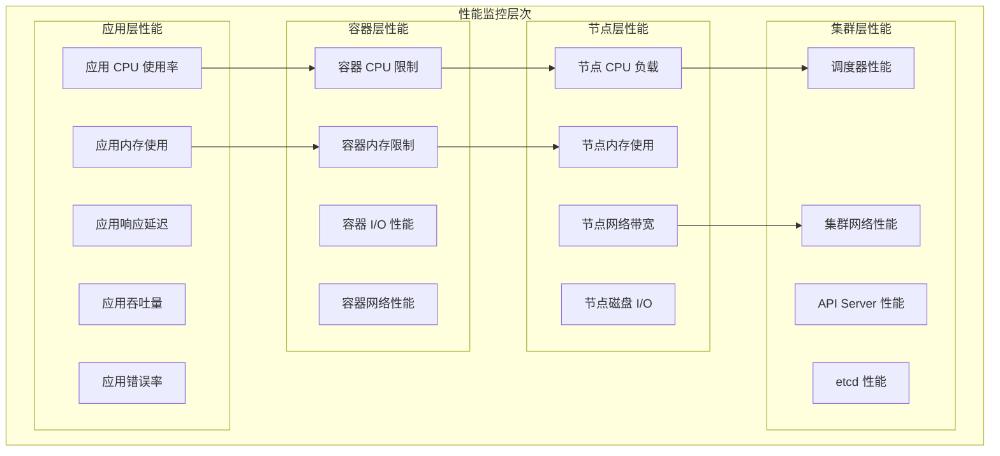

# 性能问题的分析工具

## 概述

Kubernetes 集群性能问题可能涉及多个层面：应用层、容器层、节点层和集群层。本文档介绍了各种性能分析工具和技术，帮助快速定位和解决性能瓶颈。

## 性能监控体系

### 性能指标层次



## 基础性能监控

### kubectl 内置性能工具

```bash
# 节点资源使用
kubectl top nodes
kubectl top nodes --sort-by=cpu
kubectl top nodes --sort-by=memory

# Pod 资源使用
kubectl top pods --all-namespaces
kubectl top pods --sort-by=cpu
kubectl top pods --sort-by=memory
kubectl top pods --containers

# 实时监控
watch kubectl top nodes
watch kubectl top pods --all-namespaces

# 资源配额使用
kubectl describe quota --all-namespaces
```

### 节点性能分析

```bash
#!/bin/bash
# 节点性能分析脚本

NODE_NAME=${1:-$(hostname)}

echo "=== 节点性能分析 ==="
echo "节点: $NODE_NAME"

# 1. 基础系统信息
echo "1. 系统信息："
kubectl describe node $NODE_NAME | grep -E "(Kernel|OS Image|Container Runtime|Kubelet)"

# 2. 资源分配情况
echo -e "\n2. 资源分配："
kubectl describe node $NODE_NAME | grep -A 15 "Allocated resources"

# 3. 当前负载
echo -e "\n3. 当前负载："
kubectl top node $NODE_NAME

# 4. 节点条件
echo -e "\n4. 节点条件："
kubectl get node $NODE_NAME -o jsonpath='{.status.conditions[*].type}' && echo
kubectl get node $NODE_NAME -o jsonpath='{.status.conditions[*].status}' && echo

# 5. 运行中的 Pod
echo -e "\n5. 运行中的 Pod："
kubectl get pods --all-namespaces --field-selector spec.nodeName=$NODE_NAME
```

## 系统性能分析工具

### 使用 top 和 htop

```bash
# 创建性能监控 Pod
kubectl apply -f - <<EOF
apiVersion: v1
kind: Pod
metadata:
  name: perf-monitor
spec:
  hostNetwork: true
  hostPID: true
  containers:
  - name: monitor
    image: ubuntu:latest
    command: ['sleep', '3600']
    securityContext:
      privileged: true
    volumeMounts:
    - name: host-root
      mountPath: /host
  volumes:
  - name: host-root
    hostPath:
      path: /
EOF

# 进入监控容器
kubectl exec -it perf-monitor -- bash

# 安装监控工具
apt update && apt install -y htop iotop sysstat procps

# 系统负载监控
htop
top -d 1

# I/O 监控
iotop

# 网络监控
ss -tuln
netstat -i
```

### 使用 sysstat 工具集

```bash
# 在监控容器中安装 sysstat
apt install -y sysstat

# CPU 使用统计
sar -u 1 10    # 每秒显示 CPU 使用率，共10次

# 内存使用统计
sar -r 1 10    # 每秒显示内存使用情况

# I/O 统计
iostat -x 1 10  # 每秒显示详细 I/O 统计

# 网络统计
sar -n DEV 1 10  # 每秒显示网络设备统计

# 完整系统报告
sar -A 1 5      # 显示所有可用统计信息
```

## 应用性能分析

### JVM 应用性能分析

```yaml
# Java 应用性能监控配置
apiVersion: v1
kind: Pod
metadata:
  name: java-app-profiling
spec:
  containers:
  - name: java-app
    image: openjdk:11-jre
    env:
    - name: JAVA_OPTS
      value: "-XX:+PrintGCDetails -XX:+PrintGCTimeStamps -Xloggc:/tmp/gc.log"
    command: ['java']
    args: ['-jar', '/app/myapp.jar']
    ports:
    - containerPort: 8080
    - containerPort: 9999  # JMX 端口
    volumeMounts:
    - name: gc-logs
      mountPath: /tmp
  volumes:
  - name: gc-logs
    emptyDir: {}
```

```bash
# JVM 性能分析命令
kubectl exec java-app-profiling -- jstack <pid>    # 线程栈信息
kubectl exec java-app-profiling -- jmap -histo <pid>  # 堆内存统计
kubectl exec java-app-profiling -- jstat -gc <pid> 1s  # GC 统计
```

### Go 应用性能分析

```yaml
# Go 应用 pprof 配置
apiVersion: v1
kind: Pod
metadata:
  name: go-app-profiling
spec:
  containers:
  - name: go-app
    image: golang:1.19
    ports:
    - containerPort: 8080
    - containerPort: 6060  # pprof 端口
    env:
    - name: GOMAXPROCS
      value: "2"
    command: ['/app/myapp']
    args: ['--pprof-addr=:6060']
```

```bash
# Go 应用性能分析
kubectl port-forward go-app-profiling 6060:6060

# 在本地使用 go tool pprof
go tool pprof http://localhost:6060/debug/pprof/profile
go tool pprof http://localhost:6060/debug/pprof/heap
go tool pprof http://localhost:6060/debug/pprof/goroutine
```

## 网络性能分析

### 网络吞吐量测试

```bash
# 创建 iperf3 测试
kubectl apply -f - <<EOF
apiVersion: v1
kind: Pod
metadata:
  name: iperf3-server
spec:
  containers:
  - name: iperf3
    image: networkstatic/iperf3
    args: ["-s"]
    ports:
    - containerPort: 5201
---
apiVersion: v1
kind: Service
metadata:
  name: iperf3-server
spec:
  selector:
    app: iperf3-server
  ports:
  - port: 5201
    targetPort: 5201
EOF

# 运行客户端测试
kubectl run iperf3-client --image=networkstatic/iperf3 --rm -it --restart=Never \
  -- iperf3 -c iperf3-server -t 30 -P 4

# 网络延迟测试
kubectl run ping-test --image=busybox --rm -it --restart=Never \
  -- ping -c 100 iperf3-server
```

### 网络抓包分析

```bash
# 创建网络抓包 Pod
kubectl apply -f - <<EOF
apiVersion: v1
kind: Pod
metadata:
  name: tcpdump-analyzer
spec:
  hostNetwork: true
  containers:
  - name: tcpdump
    image: nicolaka/netshoot
    command: ['sleep', '3600']
    securityContext:
      privileged: true
EOF

# 进行网络抓包
kubectl exec -it tcpdump-analyzer -- tcpdump -i any -w /tmp/capture.pcap host 10.244.1.5

# 分析抓包结果
kubectl exec -it tcpdump-analyzer -- tcpdump -r /tmp/capture.pcap -n
```

## 存储性能分析

### 磁盘 I/O 性能测试

```bash
# 创建 FIO 性能测试 Job
kubectl apply -f - <<EOF
apiVersion: batch/v1
kind: Job
metadata:
  name: storage-performance-test
spec:
  template:
    spec:
      containers:
      - name: fio
        image: dmonakhov/fio
        command: ["/bin/sh"]
        args:
        - -c
        - |
          echo "=== 存储性能测试 ==="
          
          # 顺序读写测试
          fio --name=seq-read --rw=read --bs=1M --size=1G --numjobs=1 --filename=/data/testfile --direct=1
          fio --name=seq-write --rw=write --bs=1M --size=1G --numjobs=1 --filename=/data/testfile --direct=1
          
          # 随机读写测试
          fio --name=rand-read --rw=randread --bs=4k --size=1G --numjobs=4 --filename=/data/testfile --direct=1
          fio --name=rand-write --rw=randwrite --bs=4k --size=1G --numjobs=4 --filename=/data/testfile --direct=1
          
          # IOPS 测试
          fio --name=iops-test --rw=randread --bs=4k --size=1G --numjobs=8 --runtime=60 --time_based --filename=/data/testfile --direct=1
        volumeMounts:
        - name: test-volume
          mountPath: /data
      volumes:
      - name: test-volume
        persistentVolumeClaim:
          claimName: perf-test-pvc
      restartPolicy: Never
EOF
```

### 存储延迟分析

```bash
# 创建存储延迟测试
kubectl run storage-latency --image=busybox --rm -it --restart=Never \
  --overrides='{"spec":{"containers":[{"name":"test","image":"busybox","command":["sh","-c","while true; do time dd if=/dev/zero of=/tmp/test bs=1M count=1 oflag=direct; sleep 1; done"],"volumeMounts":[{"name":"test-vol","mountPath":"/tmp"}]}],"volumes":[{"name":"test-vol","emptyDir":{}}]}}'
```

## 集群性能分析

### API Server 性能监控

```bash
# API Server 指标
kubectl get --raw /metrics | grep apiserver_request_duration_seconds

# API Server 审计日志分析
kubectl logs -n kube-system kube-apiserver-$(hostname) | grep audit

# 请求速率统计
kubectl get --raw /metrics | grep apiserver_request_total
```

### etcd 性能分析

```bash
# etcd 性能指标
ETCDCTL_API=3 etcdctl \
  --endpoints=https://127.0.0.1:2379 \
  --cacert=/etc/kubernetes/pki/etcd/ca.crt \
  --cert=/etc/kubernetes/pki/etcd/server.crt \
  --key=/etc/kubernetes/pki/etcd/server.key \
  check perf

# etcd 延迟监控
curl -k https://127.0.0.1:2379/metrics | grep etcd_disk_wal_fsync_duration_seconds
```

### 调度器性能分析

```bash
# 调度延迟分析
kubectl get events --all-namespaces | grep "Successfully assigned"

# 调度队列长度
kubectl get --raw /metrics | grep scheduler_queue_incoming_workqueue_depth
```

## 性能监控工具集成

### Prometheus + Grafana 监控

```yaml
# Node Exporter DaemonSet
apiVersion: apps/v1
kind: DaemonSet
metadata:
  name: node-exporter
  namespace: monitoring
spec:
  selector:
    matchLabels:
      name: node-exporter
  template:
    metadata:
      labels:
        name: node-exporter
    spec:
      hostNetwork: true
      hostPID: true
      containers:
      - name: node-exporter
        image: prom/node-exporter:latest
        ports:
        - containerPort: 9100
        volumeMounts:
        - name: proc
          mountPath: /host/proc
          readOnly: true
        - name: sys
          mountPath: /host/sys
          readOnly: true
        - name: rootfs
          mountPath: /rootfs
          readOnly: true
        args:
        - --path.procfs=/host/proc
        - --path.sysfs=/host/sys
        - --collector.filesystem.ignored-mount-points
        - '^/(dev|proc|sys|var/lib/docker/.+)($|/)'
      volumes:
      - name: proc
        hostPath:
          path: /proc
      - name: sys
        hostPath:
          path: /sys
      - name: rootfs
        hostPath:
          path: /
```

### cAdvisor 容器监控

```yaml
# cAdvisor DaemonSet
apiVersion: apps/v1
kind: DaemonSet
metadata:
  name: cadvisor
  namespace: monitoring
spec:
  selector:
    matchLabels:
      name: cadvisor
  template:
    metadata:
      labels:
        name: cadvisor
    spec:
      hostNetwork: true
      containers:
      - name: cadvisor
        image: gcr.io/cadvisor/cadvisor:latest
        ports:
        - containerPort: 8080
        volumeMounts:
        - name: rootfs
          mountPath: /rootfs
          readOnly: true
        - name: var-run
          mountPath: /var/run
          readOnly: true
        - name: sys
          mountPath: /sys
          readOnly: true
        - name: docker
          mountPath: /var/lib/docker
          readOnly: true
        - name: disk
          mountPath: /dev/disk
          readOnly: true
      volumes:
      - name: rootfs
        hostPath:
          path: /
      - name: var-run
        hostPath:
          path: /var/run
      - name: sys
        hostPath:
          path: /sys
      - name: docker
        hostPath:
          path: /var/lib/docker
      - name: disk
        hostPath:
          path: /dev/disk
```

## 性能调优建议

### 资源限制优化

```bash
# 分析资源使用模式
kubectl top pods --containers --sort-by=cpu | head -20
kubectl top pods --containers --sort-by=memory | head -20

# 检查资源配置
kubectl get pods -o jsonpath='{range .items[*]}{.metadata.name}{"\t"}{.spec.containers[0].resources}{"\n"}{end}'
```

### 应用性能优化脚本

```bash
#!/bin/bash
# 应用性能优化建议脚本

NAMESPACE=${1:-default}

echo "=== 应用性能优化建议 ==="
echo "命名空间: $NAMESPACE"

# 1. 检查资源使用效率
echo -e "\n1. 资源使用效率分析："
kubectl top pods -n $NAMESPACE --containers | awk '
NR>1 {
    if ($3 ~ /m$/) cpu = substr($3, 1, length($3)-1)
    else cpu = $3 * 1000
    if ($4 ~ /Mi$/) mem = substr($4, 1, length($4)-2)
    else if ($4 ~ /Gi$/) mem = substr($4, 1, length($4)-2) * 1024
    
    print $1 "\t" cpu "m\t" mem "Mi"
}'

# 2. 检查资源配置
echo -e "\n2. 资源配置检查："
kubectl get pods -n $NAMESPACE -o custom-columns=NAME:.metadata.name,CPU-REQ:.spec.containers[0].resources.requests.cpu,MEM-REQ:.spec.containers[0].resources.requests.memory,CPU-LIM:.spec.containers[0].resources.limits.cpu,MEM-LIM:.spec.containers[0].resources.limits.memory

# 3. 检查重启次数
echo -e "\n3. 重启次数统计："
kubectl get pods -n $NAMESPACE -o custom-columns=NAME:.metadata.name,RESTARTS:.status.containerStatuses[0].restartCount --sort-by=.status.containerStatuses[0].restartCount

# 4. 性能建议
echo -e "\n4. 性能优化建议："
echo "- 设置合适的资源请求和限制"
echo "- 使用 HPA 进行自动扩缩容"
echo "- 优化应用启动时间"
echo "- 使用就绪探针避免过早接收流量"
echo "- 考虑使用资源配额管理"
```

## 性能基准测试

### 集群性能基准

```bash
#!/bin/bash
# Kubernetes 集群性能基准测试

echo "=== Kubernetes 集群性能基准测试 ==="

# 1. 节点性能基准
echo "1. 节点性能基准："
kubectl run cpu-benchmark --image=progrium/stress --rm -it --restart=Never \
  -- stress --cpu 2 --timeout 60s

# 2. 网络性能基准
echo "2. 网络性能基准："
kubectl apply -f - <<EOF
apiVersion: v1
kind: Pod
metadata:
  name: netperf-server
spec:
  containers:
  - name: netperf
    image: networkstatic/netperf
    ports:
    - containerPort: 12865
EOF

sleep 30

kubectl run netperf-client --image=networkstatic/netperf --rm -it --restart=Never \
  -- netperf -H netperf-server -t TCP_STREAM -l 30

# 3. 存储性能基准
echo "3. 存储性能基准："
kubectl run fio-benchmark --image=dmonakhov/fio --rm -it --restart=Never \
  -- fio --name=randwrite --ioengine=libaio --iodepth=1 --rw=randwrite --bs=4k --direct=0 --size=512M --numjobs=2 --runtime=60 --group_reporting

# 清理
kubectl delete pod netperf-server --force --grace-period=0
```

通过这些性能分析工具和技术，可以全面监控和优化 Kubernetes 集群的性能表现。
