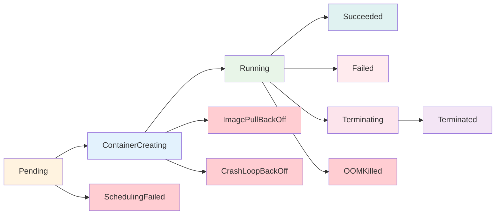

# Kubernetes Pod 故障排查

## Pod 故障排查概述

Pod 是 Kubernetes 中最小的可部署单元，Pod 故障是最常见的问题类型。有效的 Pod 故障排查需要理解 Pod 生命周期、状态转换和常见故障模式。

### Pod 生命周期状态



## 常见 Pod 故障类型

### 1. Pending 状态故障

**故障特征**：Pod 长时间处于 Pending 状态，无法被调度到节点上

**排查脚本**：
```bash
#!/bin/bash
# Pod Pending 状态排查

diagnose_pending_pod() {
    local POD_NAME=$1
    local NAMESPACE=${2:-default}
    
    echo "=== Pod Pending 状态诊断 ==="
    echo "Pod: $POD_NAME"
    echo "Namespace: $NAMESPACE"
    echo ""
    
    # 1. 检查 Pod 详细信息
    echo "1. Pod 详细信息："
    kubectl describe pod $POD_NAME -n $NAMESPACE
    
    # 2. 检查调度事件
    echo -e "\n2. 调度相关事件："
    kubectl get events -n $NAMESPACE --field-selector involvedObject.name=$POD_NAME --sort-by=.metadata.creationTimestamp
    
    # 3. 检查节点资源
    echo -e "\n3. 节点资源状态："
    kubectl top nodes
    
    # 4. 检查节点可调度性
    echo -e "\n4. 节点可调度状态："
    kubectl get nodes -o custom-columns="NAME:.metadata.name,STATUS:.status.conditions[?(@.type=='Ready')].status,SCHEDULABLE:.spec.unschedulable"
    
    # 5. 分析 Pod 资源需求
    echo -e "\n5. Pod 资源需求："
    kubectl get pod $POD_NAME -n $NAMESPACE -o json | jq '.spec.containers[].resources'
    
    # 6. 检查污点和容忍度
    echo -e "\n6. 节点污点检查："
    kubectl get nodes -o json | jq '.items[] | {name: .metadata.name, taints: .spec.taints}'
    
    echo -e "\n7. Pod 容忍度检查："
    kubectl get pod $POD_NAME -n $NAMESPACE -o json | jq '.spec.tolerations'
    
    # 8. 提供解决建议
    echo -e "\n8. 解决建议："
    suggest_pending_solutions $POD_NAME $NAMESPACE
}

suggest_pending_solutions() {
    local POD_NAME=$1
    local NAMESPACE=$2
    
    # 检查资源不足
    echo "检查可能的解决方案："
    
    # 检查 CPU 和内存需求
    CPU_REQUEST=$(kubectl get pod $POD_NAME -n $NAMESPACE -o jsonpath='{.spec.containers[0].resources.requests.cpu}' 2>/dev/null)
    MEMORY_REQUEST=$(kubectl get pod $POD_NAME -n $NAMESPACE -o jsonpath='{.spec.containers[0].resources.requests.memory}' 2>/dev/null)
    
    if [ -n "$CPU_REQUEST" ] || [ -n "$MEMORY_REQUEST" ]; then
        echo "1. 检查节点资源是否充足："
        echo "   Pod 请求 CPU: ${CPU_REQUEST:-未设置}, Memory: ${MEMORY_REQUEST:-未设置}"
        echo "   建议：检查 kubectl top nodes 确认节点资源"
    fi
    
    # 检查亲和性
    AFFINITY=$(kubectl get pod $POD_NAME -n $NAMESPACE -o jsonpath='{.spec.affinity}' 2>/dev/null)
    if [ -n "$AFFINITY" ] && [ "$AFFINITY" != "null" ]; then
        echo "2. Pod 设置了亲和性规则："
        echo "   建议：检查亲和性配置是否过于严格"
    fi
    
    # 检查污点
    TOLERATIONS=$(kubectl get pod $POD_NAME -n $NAMESPACE -o jsonpath='{.spec.tolerations}' 2>/dev/null)
    echo "3. 检查节点污点和 Pod 容忍度匹配"
    
    echo "4. 常见解决方案："
    echo "   - 增加集群节点"
    echo "   - 调整 Pod 资源请求"
    echo "   - 修改亲和性和反亲和性配置"
    echo "   - 添加适当的容忍度"
}

# 使用示例
# diagnose_pending_pod "my-pod" "default"
```

### 2. ImagePullBackOff 故障

**故障特征**：Pod 无法拉取容器镜像

**排查脚本**：
```bash
#!/bin/bash
# ImagePullBackOff 故障排查

diagnose_image_pull_error() {
    local POD_NAME=$1
    local NAMESPACE=${2:-default}
    
    echo "=== ImagePullBackOff 故障诊断 ==="
    echo "Pod: $POD_NAME"
    echo "Namespace: $NAMESPACE"
    echo ""
    
    # 1. 获取镜像信息
    echo "1. 容器镜像信息："
    kubectl get pod $POD_NAME -n $NAMESPACE -o json | jq -r '.spec.containers[] | "容器: \(.name), 镜像: \(.image)"'
    
    # 2. 检查镜像拉取错误详情
    echo -e "\n2. 镜像拉取错误详情："
    kubectl describe pod $POD_NAME -n $NAMESPACE | grep -A 10 -B 5 "Failed to pull image"
    
    # 3. 检查镜像拉取策略
    echo -e "\n3. 镜像拉取策略："
    kubectl get pod $POD_NAME -n $NAMESPACE -o json | jq -r '.spec.containers[] | "容器: \(.name), 拉取策略: \(.imagePullPolicy // "默认")"'
    
    # 4. 检查镜像仓库凭证
    echo -e "\n4. 镜像拉取凭证："
    kubectl get pod $POD_NAME -n $NAMESPACE -o json | jq -r '.spec.imagePullSecrets[]?.name // "无拉取凭证"'
    
    # 5. 测试镜像可访问性
    echo -e "\n5. 镜像可访问性测试："
    test_image_accessibility $POD_NAME $NAMESPACE
    
    # 6. 检查节点 Docker/containerd 状态
    echo -e "\n6. 容器运行时状态："
    NODE_NAME=$(kubectl get pod $POD_NAME -n $NAMESPACE -o jsonpath='{.spec.nodeName}')
    if [ -n "$NODE_NAME" ]; then
        echo "Pod 调度到节点: $NODE_NAME"
        # 注意：以下命令需要节点访问权限
        # ssh $NODE_NAME "systemctl status containerd"
    fi
    
    # 7. 提供解决方案
    echo -e "\n7. 解决方案："
    suggest_image_pull_solutions $POD_NAME $NAMESPACE
}

test_image_accessibility() {
    local POD_NAME=$1
    local NAMESPACE=$2
    
    # 获取镜像列表
    IMAGES=$(kubectl get pod $POD_NAME -n $NAMESPACE -o json | jq -r '.spec.containers[].image')
    
    echo "测试镜像可访问性："
    for image in $IMAGES; do
        echo "测试镜像: $image"
        
        # 在集群中创建测试 Pod
        kubectl run image-test-$(date +%s) --image=$image --restart=Never --rm -i --tty --command -- echo "镜像拉取成功" 2>/dev/null && echo "✓ 镜像可访问" || echo "❌ 镜像无法访问"
    done
}

suggest_image_pull_solutions() {
    local POD_NAME=$1
    local NAMESPACE=$2
    
    echo "常见解决方案："
    echo "1. 检查镜像名称和标签是否正确"
    echo "2. 验证镜像仓库的网络连通性"
    echo "3. 检查镜像仓库认证凭证"
    echo "4. 确认镜像是否存在于指定仓库"
    echo "5. 检查容器运行时配置"
    
    # 检查是否是私有仓库
    IMAGE=$(kubectl get pod $POD_NAME -n $NAMESPACE -o jsonpath='{.spec.containers[0].image}')
    if [[ $IMAGE == *"private"* ]] || [[ $IMAGE == *"registry"* ]]; then
        echo ""
        echo "私有仓库镜像解决步骤："
        echo "1. 创建镜像拉取凭证："
        echo "   kubectl create secret docker-registry myregistrykey \\"
        echo "     --docker-server=your-registry-server \\"
        echo "     --docker-username=your-username \\"
        echo "     --docker-password=your-password \\"
        echo "     --docker-email=your-email"
        echo ""
        echo "2. 在 Pod 规范中添加 imagePullSecrets："
        echo "   spec:"
        echo "     imagePullSecrets:"
        echo "     - name: myregistrykey"
    fi
}

# 使用示例
# diagnose_image_pull_error "my-pod" "default"
```

### 3. CrashLoopBackOff 故障

**故障特征**：容器启动后立即退出，Kubernetes 不断重启容器

**排查脚本**：
```bash
#!/bin/bash
# CrashLoopBackOff 故障排查

diagnose_crashloop() {
    local POD_NAME=$1
    local NAMESPACE=${2:-default}
    
    echo "=== CrashLoopBackOff 故障诊断 ==="
    echo "Pod: $POD_NAME"
    echo "Namespace: $NAMESPACE"
    echo ""
    
    # 1. 检查 Pod 状态和重启次数
    echo "1. Pod 状态和重启信息："
    kubectl get pod $POD_NAME -n $NAMESPACE -o custom-columns="NAME:.metadata.name,STATUS:.status.phase,RESTARTS:.status.containerStatuses[0].restartCount,AGE:.metadata.creationTimestamp"
    
    # 2. 检查容器退出码
    echo -e "\n2. 容器退出信息："
    kubectl get pod $POD_NAME -n $NAMESPACE -o json | jq -r '.status.containerStatuses[] | "容器: \(.name), 退出码: \(.lastState.terminated.exitCode // "运行中"), 原因: \(.lastState.terminated.reason // "N/A")"'
    
    # 3. 检查当前日志
    echo -e "\n3. 当前容器日志："
    kubectl logs $POD_NAME -n $NAMESPACE --tail=50
    
    # 4. 检查前一个容器的日志
    echo -e "\n4. 前一个容器日志："
    kubectl logs $POD_NAME -n $NAMESPACE --previous --tail=50 2>/dev/null || echo "无前一个容器日志"
    
    # 5. 检查容器配置
    echo -e "\n5. 容器配置检查："
    check_container_config $POD_NAME $NAMESPACE
    
    # 6. 检查资源限制
    echo -e "\n6. 资源限制检查："
    kubectl get pod $POD_NAME -n $NAMESPACE -o json | jq '.spec.containers[] | {name: .name, resources: .resources}'
    
    # 7. 检查健康检查配置
    echo -e "\n7. 健康检查配置："
    kubectl get pod $POD_NAME -n $NAMESPACE -o json | jq '.spec.containers[] | {name: .name, livenessProbe: .livenessProbe, readinessProbe: .readinessProbe}'
    
    # 8. 提供解决建议
    echo -e "\n8. 解决建议："
    suggest_crashloop_solutions $POD_NAME $NAMESPACE
}

check_container_config() {
    local POD_NAME=$1
    local NAMESPACE=$2
    
    echo "容器启动命令和参数："
    kubectl get pod $POD_NAME -n $NAMESPACE -o json | jq -r '.spec.containers[] | "容器: \(.name)\n  命令: \(.command // ["默认"])\n  参数: \(.args // ["默认"])\n  工作目录: \(.workingDir // "默认")"'
    
    echo -e "\n环境变量："
    kubectl get pod $POD_NAME -n $NAMESPACE -o json | jq -r '.spec.containers[] | "容器: \(.name)", (.env[]? | "  \(.name)=\(.value // (.valueFrom | tostring))")'
    
    echo -e "\n挂载卷："
    kubectl get pod $POD_NAME -n $NAMESPACE -o json | jq -r '.spec.containers[] | "容器: \(.name)", (.volumeMounts[]? | "  \(.mountPath) <- \(.name)")'
}

suggest_crashloop_solutions() {
    local POD_NAME=$1
    local NAMESPACE=$2
    
    # 分析退出码
    EXIT_CODE=$(kubectl get pod $POD_NAME -n $NAMESPACE -o jsonpath='{.status.containerStatuses[0].lastState.terminated.exitCode}' 2>/dev/null)
    
    echo "基于退出码的解决建议："
    case $EXIT_CODE in
        "0")
            echo "- 退出码 0: 容器正常退出，可能是程序执行完成"
            echo "  解决方案: 检查程序逻辑，确保服务持续运行"
            ;;
        "1")
            echo "- 退出码 1: 一般性错误"
            echo "  解决方案: 检查应用日志，查找具体错误原因"
            ;;
        "125")
            echo "- 退出码 125: Docker daemon 错误"
            echo "  解决方案: 检查容器配置和 Docker 状态"
            ;;
        "126")
            echo "- 退出码 126: 容器命令不可执行"
            echo "  解决方案: 检查命令路径和权限"
            ;;
        "127")
            echo "- 退出码 127: 容器命令未找到"
            echo "  解决方案: 检查命令是否存在于容器中"
            ;;
        "137")
            echo "- 退出码 137: 容器被 SIGKILL 信号终止 (OOM 或强制终止)"
            echo "  解决方案: 增加内存限制或优化应用内存使用"
            ;;
        "143")
            echo "- 退出码 143: 容器被 SIGTERM 信号终止"
            echo "  解决方案: 检查容器优雅关闭处理"
            ;;
        *)
            echo "- 退出码 $EXIT_CODE: 应用特定错误"
            echo "  解决方案: 查看应用文档了解错误含义"
            ;;
    esac
    
    echo ""
    echo "通用解决方案："
    echo "1. 检查应用启动脚本和配置文件"
    echo "2. 验证依赖服务是否可用"
    echo "3. 检查资源限制是否合理"
    echo "4. 调整健康检查配置"
    echo "5. 检查文件权限和用户配置"
    echo "6. 验证环境变量和挂载卷"
    
    # 检查是否可能是 OOM
    MEMORY_LIMIT=$(kubectl get pod $POD_NAME -n $NAMESPACE -o jsonpath='{.spec.containers[0].resources.limits.memory}' 2>/dev/null)
    if [ -n "$MEMORY_LIMIT" ] && [ "$EXIT_CODE" = "137" ]; then
        echo ""
        echo "OOM (内存不足) 专项建议："
        echo "- 当前内存限制: ${MEMORY_LIMIT}"
        echo "- 建议增加内存限制或优化应用内存使用"
        echo "- 使用 kubectl top pod 监控内存使用情况"
    fi
}

# 使用示例
# diagnose_crashloop "my-pod" "default"
```

### 4. 资源相关故障

**OOMKilled (内存不足被杀死)**：
```bash
#!/bin/bash
# OOM 故障排查

diagnose_oom() {
    local POD_NAME=$1
    local NAMESPACE=${2:-default}
    
    echo "=== OOM 故障诊断 ==="
    echo "Pod: $POD_NAME"
    echo "Namespace: $NAMESPACE"
    echo ""
    
    # 1. 检查 OOM 事件
    echo "1. OOM 相关事件："
    kubectl get events -n $NAMESPACE --field-selector reason=OOMKilling,involvedObject.name=$POD_NAME
    
    # 2. 检查内存使用和限制
    echo -e "\n2. 内存配置："
    kubectl get pod $POD_NAME -n $NAMESPACE -o json | jq '.spec.containers[] | {name: .name, memory_request: .resources.requests.memory, memory_limit: .resources.limits.memory}'
    
    # 3. 当前内存使用情况
    echo -e "\n3. 当前内存使用："
    kubectl top pod $POD_NAME -n $NAMESPACE --containers 2>/dev/null || echo "Metrics Server 不可用"
    
    # 4. 检查节点内存压力
    echo -e "\n4. 节点内存状态："
    NODE_NAME=$(kubectl get pod $POD_NAME -n $NAMESPACE -o jsonpath='{.spec.nodeName}')
    if [ -n "$NODE_NAME" ]; then
        kubectl describe node $NODE_NAME | grep -A 10 "Conditions:\|Allocated resources:"
    fi
    
    # 5. 分析应用内存使用模式
    echo -e "\n5. 内存使用分析："
    analyze_memory_usage $POD_NAME $NAMESPACE
    
    # 6. 提供优化建议
    echo -e "\n6. 优化建议："
    suggest_memory_optimization $POD_NAME $NAMESPACE
}

analyze_memory_usage() {
    local POD_NAME=$1
    local NAMESPACE=$2
    
    echo "应用内存使用模式分析："
    
    # 检查应用类型
    IMAGE=$(kubectl get pod $POD_NAME -n $NAMESPACE -o jsonpath='{.spec.containers[0].image}')
    echo "应用镜像: $IMAGE"
    
    # 基于镜像推测应用类型和内存特点
    case $IMAGE in
        *java*|*openjdk*|*jre*)
            echo "Java 应用内存特点:"
            echo "- 堆内存配置: 检查 -Xmx 和 -Xms 参数"
            echo "- GC 配置: 考虑 G1GC 或 ZGC"
            echo "- 建议内存限制: 堆内存 + 1GB (用于非堆内存)"
            ;;
        *node*|*npm*)
            echo "Node.js 应用内存特点:"
            echo "- V8 堆限制: 默认约 1.4GB"
            echo "- 检查 --max-old-space-size 参数"
            echo "- 注意内存泄漏和闭包使用"
            ;;
        *python*)
            echo "Python 应用内存特点:"
            echo "- 检查大对象和循环引用"
            echo "- 考虑使用 __slots__ 优化对象内存"
            echo "- 注意第三方库的内存使用"
            ;;
        *)
            echo "通用内存分析:"
            echo "- 检查应用是否有内存泄漏"
            echo "- 分析峰值内存使用场景"
            echo "- 考虑内存缓存策略"
            ;;
    esac
}

suggest_memory_optimization() {
    local POD_NAME=$1
    local NAMESPACE=$2
    
    CURRENT_LIMIT=$(kubectl get pod $POD_NAME -n $NAMESPACE -o jsonpath='{.spec.containers[0].resources.limits.memory}' 2>/dev/null)
    CURRENT_REQUEST=$(kubectl get pod $POD_NAME -n $NAMESPACE -o jsonpath='{.spec.containers[0].resources.requests.memory}' 2>/dev/null)
    
    echo "内存优化建议："
    echo "1. 短期解决方案："
    echo "   - 增加内存限制: 当前限制 ${CURRENT_LIMIT:-未设置}"
    if [ -n "$CURRENT_LIMIT" ]; then
        # 简单的内存增加建议
        echo "   - 建议临时增加到 $(echo $CURRENT_LIMIT | sed 's/[0-9]*[A-Za-z]*/&x1.5/')"
    fi
    echo "   - 重启 Pod 清理内存状态"
    
    echo ""
    echo "2. 长期解决方案："
    echo "   - 分析应用内存使用模式"
    echo "   - 优化代码中的内存使用"
    echo "   - 实施内存监控和告警"
    echo "   - 考虑水平扩展而非垂直扩展"
    
    echo ""
    echo "3. 监控和预防："
    echo "   - 设置内存告警阈值 (80%)"
    echo "   - 定期进行负载测试"
    echo "   - 实施 VPA (Vertical Pod Autoscaler)"
    
    echo ""
    echo "4. 配置示例："
    cat <<EOF
resources:
  requests:
    memory: "${CURRENT_REQUEST:-256Mi}"
  limits:
    memory: "${CURRENT_LIMIT:-512Mi}"
EOF
}

# 使用示例
# diagnose_oom "my-pod" "default"
```

## Pod 故障排查工具箱

### 综合诊断脚本

```bash
#!/bin/bash
# Pod 综合故障诊断工具

pod_health_check() {
    local POD_NAME=$1
    local NAMESPACE=${2:-default}
    
    echo "=== Pod 健康诊断工具 ==="
    echo "Pod: $POD_NAME"
    echo "Namespace: $NAMESPACE"
    echo "诊断时间: $(date)"
    echo ""
    
    # 1. 基础信息
    echo "1. Pod 基础信息："
    kubectl get pod $POD_NAME -n $NAMESPACE -o wide
    
    # 2. Pod 状态详情
    echo -e "\n2. Pod 状态详情："
    kubectl describe pod $POD_NAME -n $NAMESPACE | head -30
    
    # 3. 容器状态
    echo -e "\n3. 容器状态："
    kubectl get pod $POD_NAME -n $NAMESPACE -o json | jq '.status.containerStatuses[] | {name: .name, ready: .ready, restartCount: .restartCount, state: .state}'
    
    # 4. 自动问题检测
    echo -e "\n4. 自动问题检测："
    auto_detect_issues $POD_NAME $NAMESPACE
    
    # 5. 性能指标
    echo -e "\n5. 资源使用情况："
    kubectl top pod $POD_NAME -n $NAMESPACE --containers 2>/dev/null || echo "Metrics Server 不可用"
    
    # 6. 网络连通性
    echo -e "\n6. 网络连通性："
    check_pod_network $POD_NAME $NAMESPACE
    
    # 7. 日志摘要
    echo -e "\n7. 最近日志 (最后10行)："
    kubectl logs $POD_NAME -n $NAMESPACE --tail=10 2>/dev/null || echo "无法获取日志"
    
    # 8. 诊断建议
    echo -e "\n8. 诊断建议："
    generate_recommendations $POD_NAME $NAMESPACE
}

auto_detect_issues() {
    local POD_NAME=$1
    local NAMESPACE=$2
    
    # 检查 Pod 阶段
    PHASE=$(kubectl get pod $POD_NAME -n $NAMESPACE -o jsonpath='{.status.phase}')
    echo "Pod 阶段: $PHASE"
    
    case $PHASE in
        "Pending")
            echo "❌ 发现问题: Pod 处于 Pending 状态"
            echo "   建议运行: diagnose_pending_pod $POD_NAME $NAMESPACE"
            ;;
        "Running")
            # 检查容器状态
            READY=$(kubectl get pod $POD_NAME -n $NAMESPACE -o jsonpath='{.status.containerStatuses[0].ready}')
            RESTART_COUNT=$(kubectl get pod $POD_NAME -n $NAMESPACE -o jsonpath='{.status.containerStatuses[0].restartCount}')
            
            if [ "$READY" != "true" ]; then
                echo "⚠️  发现问题: 容器未就绪"
            fi
            
            if [ "$RESTART_COUNT" -gt 5 ]; then
                echo "⚠️  发现问题: 容器重启次数过多 ($RESTART_COUNT 次)"
                echo "   建议运行: diagnose_crashloop $POD_NAME $NAMESPACE"
            fi
            ;;
        "Failed")
            echo "❌ 发现问题: Pod 处于 Failed 状态"
            EXIT_CODE=$(kubectl get pod $POD_NAME -n $NAMESPACE -o jsonpath='{.status.containerStatuses[0].state.terminated.exitCode}')
            echo "   容器退出码: $EXIT_CODE"
            ;;
        "Unknown")
            echo "❌ 发现问题: Pod 状态未知"
            echo "   可能的节点通信问题"
            ;;
    esac
    
    # 检查镜像拉取问题
    IMAGE_PULL_ERRORS=$(kubectl describe pod $POD_NAME -n $NAMESPACE | grep -c "Failed to pull image\|ImagePullBackOff\|ErrImagePull")
    if [ $IMAGE_PULL_ERRORS -gt 0 ]; then
        echo "❌ 发现问题: 镜像拉取失败"
        echo "   建议运行: diagnose_image_pull_error $POD_NAME $NAMESPACE"
    fi
    
    # 检查 OOM
    OOM_EVENTS=$(kubectl get events -n $NAMESPACE --field-selector reason=OOMKilling,involvedObject.name=$POD_NAME --no-headers | wc -l)
    if [ $OOM_EVENTS -gt 0 ]; then
        echo "❌ 发现问题: 检测到 OOM 事件"
        echo "   建议运行: diagnose_oom $POD_NAME $NAMESPACE"
    fi
}

check_pod_network() {
    local POD_NAME=$1
    local NAMESPACE=$2
    
    POD_IP=$(kubectl get pod $POD_NAME -n $NAMESPACE -o jsonpath='{.status.podIP}')
    echo "Pod IP: ${POD_IP:-未分配}"
    
    if [ -n "$POD_IP" ]; then
        echo "网络连通性测试:"
        # 简单的网络连通性测试
        kubectl run network-test-$(date +%s) --image=busybox --rm -i --tty --restart=Never -- ping -c 1 $POD_IP >/dev/null 2>&1 && echo "✓ Pod 网络可达" || echo "❌ Pod 网络不可达"
    fi
}

generate_recommendations() {
    local POD_NAME=$1
    local NAMESPACE=$2
    
    echo "基于当前状态的建议:"
    
    # 基于 Pod 状态生成建议
    PHASE=$(kubectl get pod $POD_NAME -n $NAMESPACE -o jsonpath='{.status.phase}')
    RESTART_COUNT=$(kubectl get pod $POD_NAME -n $NAMESPACE -o jsonpath='{.status.containerStatuses[0].restartCount}' 2>/dev/null || echo "0")
    
    if [ "$PHASE" = "Running" ] && [ "$RESTART_COUNT" -eq 0 ]; then
        echo "✓ Pod 状态良好"
        echo "  - 继续监控资源使用情况"
        echo "  - 定期检查应用日志"
    else
        echo "建议执行以下操作:"
        echo "1. 查看详细日志: kubectl logs $POD_NAME -n $NAMESPACE"
        echo "2. 查看事件: kubectl get events -n $NAMESPACE"
        echo "3. 检查资源使用: kubectl top pod $POD_NAME -n $NAMESPACE"
        echo "4. 如果问题持续，考虑重启: kubectl delete pod $POD_NAME -n $NAMESPACE"
    fi
    
    echo ""
    echo "预防措施:"
    echo "- 设置适当的资源请求和限制"
    echo "- 配置健康检查 (liveness/readiness probe)"
    echo "- 实施监控和告警"
    echo "- 定期更新镜像和依赖"
}

# 使用示例
# pod_health_check "my-pod" "default"
```

### 批量 Pod 检查

```bash
#!/bin/bash
# 批量 Pod 健康检查

batch_pod_check() {
    local NAMESPACE=${1:-default}
    
    echo "=== 批量 Pod 健康检查 ==="
    echo "命名空间: $NAMESPACE"
    echo "检查时间: $(date)"
    echo ""
    
    # 1. 概览统计
    echo "1. Pod 状态统计:"
    kubectl get pods -n $NAMESPACE --no-headers | awk '{print $3}' | sort | uniq -c
    
    # 2. 问题 Pod 识别
    echo -e "\n2. 问题 Pod 识别:"
    
    # Pending Pods
    PENDING_PODS=$(kubectl get pods -n $NAMESPACE --field-selector=status.phase=Pending --no-headers | wc -l)
    if [ $PENDING_PODS -gt 0 ]; then
        echo "❌ $PENDING_PODS 个 Pod 处于 Pending 状态:"
        kubectl get pods -n $NAMESPACE --field-selector=status.phase=Pending --no-headers | awk '{print "  - " $1}'
    fi
    
    # Failed Pods
    FAILED_PODS=$(kubectl get pods -n $NAMESPACE --field-selector=status.phase=Failed --no-headers | wc -l)
    if [ $FAILED_PODS -gt 0 ]; then
        echo "❌ $FAILED_PODS 个 Pod 处于 Failed 状态:"
        kubectl get pods -n $NAMESPACE --field-selector=status.phase=Failed --no-headers | awk '{print "  - " $1}'
    fi
    
    # 高重启次数 Pod
    echo -e "\n高重启次数 Pod (>5次):"
    kubectl get pods -n $NAMESPACE --no-headers | awk '$4 > 5 {print "❌ " $1 " - 重启 " $4 " 次"}'
    
    # 3. 资源使用 TOP 5
    echo -e "\n3. 资源使用 TOP 5:"
    echo "内存使用最高:"
    kubectl top pods -n $NAMESPACE --sort-by=memory 2>/dev/null | head -6 || echo "Metrics Server 不可用"
    
    echo -e "\nCPU 使用最高:"
    kubectl top pods -n $NAMESPACE --sort-by=cpu 2>/dev/null | head -6 || echo "Metrics Server 不可用"
    
    # 4. 最近错误事件
    echo -e "\n4. 最近错误事件 (最近10条):"
    kubectl get events -n $NAMESPACE --field-selector type=Warning --sort-by=.metadata.creationTimestamp | tail -10
    
    # 5. 健康度评分
    echo -e "\n5. 命名空间健康度评分:"
    calculate_namespace_health_score $NAMESPACE
}

calculate_namespace_health_score() {
    local NAMESPACE=$1
    
    TOTAL_PODS=$(kubectl get pods -n $NAMESPACE --no-headers | wc -l)
    RUNNING_PODS=$(kubectl get pods -n $NAMESPACE --field-selector=status.phase=Running --no-headers | wc -l)
    READY_PODS=$(kubectl get pods -n $NAMESPACE --no-headers | awk '$2 ~ /^([0-9]+)\/\1$/ {count++} END {print count+0}')
    
    if [ $TOTAL_PODS -eq 0 ]; then
        echo "命名空间中无 Pod"
        return
    fi
    
    RUNNING_PERCENTAGE=$((RUNNING_PODS * 100 / TOTAL_PODS))
    READY_PERCENTAGE=$((READY_PODS * 100 / TOTAL_PODS))
    
    # 计算健康度评分 (0-100)
    HEALTH_SCORE=$(((RUNNING_PERCENTAGE + READY_PERCENTAGE) / 2))
    
    echo "总 Pod 数: $TOTAL_PODS"
    echo "运行中: $RUNNING_PODS ($RUNNING_PERCENTAGE%)"
    echo "就绪: $READY_PODS ($READY_PERCENTAGE%)"
    echo "健康度评分: $HEALTH_SCORE/100"
    
    if [ $HEALTH_SCORE -ge 90 ]; then
        echo "状态: 优秀 ✓"
    elif [ $HEALTH_SCORE -ge 70 ]; then
        echo "状态: 良好 ⚠"
    elif [ $HEALTH_SCORE -ge 50 ]; then
        echo "状态: 一般 ⚠"
    else
        echo "状态: 需要关注 ❌"
    fi
}

# 使用示例
# batch_pod_check "production"
```

通过这些综合的 Pod 故障排查工具和方法，可以快速识别和解决各种 Pod 相关问题，确保应用的稳定运行。
