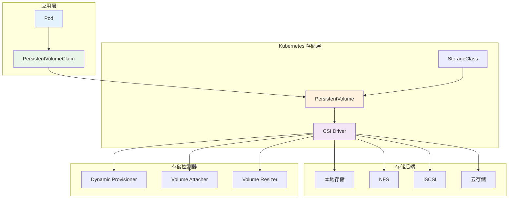

# Kubernetes 存储故障排查

## 存储故障排查概述

Kubernetes 存储系统包括多个组件：PersistentVolume (PV)、PersistentVolumeClaim (PVC)、StorageClass、CSI 驱动程序等。存储故障通常涉及卷挂载失败、数据访问问题、性能问题和容量管理问题。

### Kubernetes 存储架构



## 常见存储故障类型

### 1. PVC 绑定问题

**故障特征**：PVC 长时间处于 Pending 状态，无法绑定到 PV

**排查脚本**：
```bash
#!/bin/bash
# PVC 绑定问题排查

diagnose_pvc_binding() {
    local PVC_NAME=$1
    local NAMESPACE=${2:-default}
    
    echo "=== PVC 绑定问题诊断 ==="
    echo "PVC: $PVC_NAME"
    echo "Namespace: $NAMESPACE"
    echo ""
    
    # 1. 检查 PVC 状态
    echo "1. PVC 状态检查："
    check_pvc_status $PVC_NAME $NAMESPACE
    
    # 2. 检查可用的 PV
    echo -e "\n2. 可用 PV 检查："
    check_available_pvs $PVC_NAME $NAMESPACE
    
    # 3. 检查 StorageClass
    echo -e "\n3. StorageClass 检查："
    check_storage_class $PVC_NAME $NAMESPACE
    
    # 4. 检查动态配置
    echo -e "\n4. 动态配置检查："
    check_dynamic_provisioning $PVC_NAME $NAMESPACE
    
    # 5. 检查存储事件
    echo -e "\n5. 存储事件检查："
    check_storage_events $PVC_NAME $NAMESPACE
    
    # 6. 检查 CSI 驱动程序
    echo -e "\n6. CSI 驱动程序检查："
    check_csi_drivers
    
    # 7. 提供解决建议
    echo -e "\n7. 解决建议："
    suggest_pvc_binding_solutions $PVC_NAME $NAMESPACE
}

check_pvc_status() {
    local PVC_NAME=$1
    local NAMESPACE=$2
    
    echo "PVC 基本信息："
    kubectl get pvc $PVC_NAME -n $NAMESPACE -o wide
    
    echo -e "\nPVC 详细状态："
    kubectl describe pvc $PVC_NAME -n $NAMESPACE
    
    # 检查 PVC 状态
    STATUS=$(kubectl get pvc $PVC_NAME -n $NAMESPACE -o jsonpath='{.status.phase}')
    echo -e "\n当前状态: $STATUS"
    
    case $STATUS in
        "Pending")
            echo "❌ PVC 处于 Pending 状态，未能绑定到 PV"
            ;;
        "Bound")
            echo "✓ PVC 已成功绑定"
            BOUND_PV=$(kubectl get pvc $PVC_NAME -n $NAMESPACE -o jsonpath='{.spec.volumeName}')
            echo "绑定的 PV: $BOUND_PV"
            ;;
        "Lost")
            echo "❌ PVC 处于 Lost 状态，绑定的 PV 不可用"
            ;;
        *)
            echo "⚠️ 未知状态: $STATUS"
            ;;
    esac
}

check_available_pvs() {
    local PVC_NAME=$1
    local NAMESPACE=$2
    
    # 获取 PVC 的容量和访问模式要求
    PVC_SIZE=$(kubectl get pvc $PVC_NAME -n $NAMESPACE -o jsonpath='{.spec.resources.requests.storage}')
    PVC_ACCESS_MODES=$(kubectl get pvc $PVC_NAME -n $NAMESPACE -o jsonpath='{.spec.accessModes[*]}')
    PVC_STORAGE_CLASS=$(kubectl get pvc $PVC_NAME -n $NAMESPACE -o jsonpath='{.spec.storageClassName}')
    
    echo "PVC 要求："
    echo "- 容量: $PVC_SIZE"
    echo "- 访问模式: $PVC_ACCESS_MODES"
    echo "- 存储类: ${PVC_STORAGE_CLASS:-默认}"
    
    echo -e "\n可用的 PV："
    kubectl get pv
    
    echo -e "\n未绑定的 PV："
    kubectl get pv --no-headers | awk '$5=="Available" {print $1}'
    
    # 检查是否有匹配的 PV
    AVAILABLE_PVS=$(kubectl get pv --no-headers | awk '$5=="Available"' | wc -l)
    if [ $AVAILABLE_PVS -eq 0 ]; then
        echo "❌ 没有可用的 PV"
    else
        echo "✓ 发现 $AVAILABLE_PVS 个可用的 PV"
    fi
}

check_storage_class() {
    local PVC_NAME=$1
    local NAMESPACE=$2
    
    STORAGE_CLASS=$(kubectl get pvc $PVC_NAME -n $NAMESPACE -o jsonpath='{.spec.storageClassName}')
    
    if [ -n "$STORAGE_CLASS" ] && [ "$STORAGE_CLASS" != "null" ]; then
        echo "PVC 指定的 StorageClass: $STORAGE_CLASS"
        
        # 检查 StorageClass 是否存在
        if kubectl get storageclass $STORAGE_CLASS >/dev/null 2>&1; then
            echo "✓ StorageClass 存在"
            kubectl describe storageclass $STORAGE_CLASS
        else
            echo "❌ StorageClass 不存在"
        fi
    else
        echo "PVC 未指定 StorageClass，将使用默认 StorageClass"
        
        # 检查默认 StorageClass
        DEFAULT_SC=$(kubectl get storageclass -o json | jq -r '.items[] | select(.metadata.annotations["storageclass.kubernetes.io/is-default-class"]=="true") | .metadata.name')
        if [ -n "$DEFAULT_SC" ]; then
            echo "✓ 默认 StorageClass: $DEFAULT_SC"
        else
            echo "❌ 未配置默认 StorageClass"
        fi
    fi
}

check_dynamic_provisioning() {
    local PVC_NAME=$1
    local NAMESPACE=$2
    
    STORAGE_CLASS=$(kubectl get pvc $PVC_NAME -n $NAMESPACE -o jsonpath='{.spec.storageClassName}')
    
    if [ -n "$STORAGE_CLASS" ] && [ "$STORAGE_CLASS" != "null" ]; then
        echo "检查动态配置能力："
        
        PROVISIONER=$(kubectl get storageclass $STORAGE_CLASS -o jsonpath='{.provisioner}' 2>/dev/null)
        if [ -n "$PROVISIONER" ]; then
            echo "配置器: $PROVISIONER"
            
            # 检查配置器 Pod
            echo "配置器 Pod 状态："
            kubectl get pods --all-namespaces | grep -i "$PROVISIONER" || echo "未找到配置器 Pod"
        else
            echo "❌ StorageClass 未配置 provisioner"
        fi
    else
        echo "未使用动态配置"
    fi
}

check_storage_events() {
    local PVC_NAME=$1
    local NAMESPACE=$2
    
    echo "PVC 相关事件："
    kubectl get events -n $NAMESPACE --field-selector involvedObject.name=$PVC_NAME --sort-by=.metadata.creationTimestamp
    
    echo -e "\n存储相关事件："
    kubectl get events --all-namespaces --field-selector reason=FailedBinding,reason=ProvisioningFailed,reason=FailedMount --sort-by=.metadata.creationTimestamp | tail -10
}

check_csi_drivers() {
    echo "CSI 驱动程序状态："
    kubectl get csidriver
    
    echo -e "\nCSI 控制器 Pod："
    kubectl get pods --all-namespaces | grep -E "(csi|provisioner|attacher|resizer)" | grep -v Terminating
    
    echo -e "\nCSI 节点 Pod："
    kubectl get pods --all-namespaces | grep csi-node | grep -v Terminating
}

suggest_pvc_binding_solutions() {
    local PVC_NAME=$1
    local NAMESPACE=$2
    
    STATUS=$(kubectl get pvc $PVC_NAME -n $NAMESPACE -o jsonpath='{.status.phase}')
    
    echo "基于当前状态的解决建议："
    
    if [ "$STATUS" = "Pending" ]; then
        echo "1. 检查可用 PV："
        echo "   - 确保有足够容量的 PV 可用"
        echo "   - 验证访问模式匹配"
        echo "   - 检查标签选择器匹配"
        
        echo "2. 检查 StorageClass："
        echo "   - 验证 StorageClass 存在"
        echo "   - 检查动态配置器运行状态"
        echo "   - 确认配置器权限"
        
        echo "3. 检查资源配额："
        echo "   - 验证命名空间资源配额"
        echo "   - 检查存储资源限制"
        
        echo "4. 检查 CSI 驱动程序："
        echo "   - 确保 CSI 控制器运行正常"
        echo "   - 检查 CSI 驱动程序日志"
        echo "   - 验证存储后端连接"
    fi
    
    echo "5. 常用调试命令："
    echo "   kubectl describe pvc $PVC_NAME -n $NAMESPACE"
    echo "   kubectl get events -n $NAMESPACE"
    echo "   kubectl logs -n kube-system -l app=csi-provisioner"
    
    echo "6. 临时解决方案："
    echo "   - 手动创建匹配的 PV"
    echo "   - 调整 PVC 资源要求"
    echo "   - 使用不同的 StorageClass"
}

# 使用示例
# diagnose_pvc_binding "my-pvc" "default"
```

### 2. 卷挂载失败

**故障特征**：Pod 无法挂载存储卷，处于 ContainerCreating 状态

**排查脚本**：
```bash
#!/bin/bash
# 卷挂载失败排查

diagnose_volume_mount_failure() {
    local POD_NAME=$1
    local NAMESPACE=${2:-default}
    
    echo "=== 卷挂载失败诊断 ==="
    echo "Pod: $POD_NAME"
    echo "Namespace: $NAMESPACE"
    echo ""
    
    # 1. 检查 Pod 状态
    echo "1. Pod 状态检查："
    check_pod_mount_status $POD_NAME $NAMESPACE
    
    # 2. 检查卷配置
    echo -e "\n2. 卷配置检查："
    check_volume_configuration $POD_NAME $NAMESPACE
    
    # 3. 检查 PVC 状态
    echo -e "\n3. PVC 状态检查："
    check_pod_pvcs $POD_NAME $NAMESPACE
    
    # 4. 检查节点存储状态
    echo -e "\n4. 节点存储状态："
    check_node_storage_status $POD_NAME $NAMESPACE
    
    # 5. 检查卷挂载事件
    echo -e "\n5. 卷挂载事件："
    check_mount_events $POD_NAME $NAMESPACE
    
    # 6. 检查 CSI 节点驱动
    echo -e "\n6. CSI 节点驱动检查："
    check_csi_node_driver $POD_NAME $NAMESPACE
    
    # 7. 提供解决建议
    echo -e "\n7. 解决建议："
    suggest_mount_failure_solutions $POD_NAME $NAMESPACE
}

check_pod_mount_status() {
    local POD_NAME=$1
    local NAMESPACE=$2
    
    echo "Pod 基本状态："
    kubectl get pod $POD_NAME -n $NAMESPACE -o wide
    
    echo -e "\nPod 详细状态："
    kubectl describe pod $POD_NAME -n $NAMESPACE | grep -A 20 "Conditions:\|Events:"
    
    # 检查容器状态
    CONTAINER_STATUS=$(kubectl get pod $POD_NAME -n $NAMESPACE -o jsonpath='{.status.containerStatuses[0].state}')
    echo -e "\n容器状态：$CONTAINER_STATUS"
    
    # 检查是否有挂载相关的错误
    MOUNT_ERRORS=$(kubectl describe pod $POD_NAME -n $NAMESPACE | grep -c "FailedMount\|MountVolume.SetUp failed")
    if [ $MOUNT_ERRORS -gt 0 ]; then
        echo "❌ 发现卷挂载错误"
    else
        echo "✓ 未发现明显的挂载错误"
    fi
}

check_volume_configuration() {
    local POD_NAME=$1
    local NAMESPACE=$2
    
    echo "Pod 卷配置："
    kubectl get pod $POD_NAME -n $NAMESPACE -o json | jq '.spec.volumes[]'
    
    echo -e "\n容器卷挂载配置："
    kubectl get pod $POD_NAME -n $NAMESPACE -o json | jq '.spec.containers[].volumeMounts[]?'
    
    # 检查卷类型
    VOLUME_TYPES=$(kubectl get pod $POD_NAME -n $NAMESPACE -o json | jq -r '.spec.volumes[] | keys[]' | sort | uniq)
    echo -e "\n使用的卷类型: $VOLUME_TYPES"
}

check_pod_pvcs() {
    local POD_NAME=$1
    local NAMESPACE=$2
    
    # 获取 Pod 使用的 PVC
    PVCS=$(kubectl get pod $POD_NAME -n $NAMESPACE -o json | jq -r '.spec.volumes[]?.persistentVolumeClaim.claimName // empty')
    
    if [ -n "$PVCS" ]; then
        echo "Pod 使用的 PVC："
        for pvc in $PVCS; do
            echo "检查 PVC: $pvc"
            kubectl get pvc $pvc -n $NAMESPACE
            kubectl describe pvc $pvc -n $NAMESPACE | grep -E "Status:|Volume:|StorageClass:|Events:"
        done
    else
        echo "Pod 未使用 PVC"
    fi
}

check_node_storage_status() {
    local POD_NAME=$1
    local NAMESPACE=$2
    
    NODE_NAME=$(kubectl get pod $POD_NAME -n $NAMESPACE -o jsonpath='{.spec.nodeName}')
    
    if [ -n "$NODE_NAME" ]; then
        echo "Pod 调度到节点: $NODE_NAME"
        
        echo "节点存储信息："
        kubectl describe node $NODE_NAME | grep -A 10 "Allocated resources:\|Capacity:"
        
        echo -e "\n节点附加的卷："
        kubectl get volumeattachment -o custom-columns="NAME:.metadata.name,NODE:.spec.nodeName,ATTACHED:.status.attached" | grep $NODE_NAME || echo "未找到附加的卷"
        
        # 检查节点上的 CSI 插件
        echo -e "\n节点 CSI 插件状态："
        kubectl get pods --all-namespaces --field-selector spec.nodeName=$NODE_NAME | grep csi
    else
        echo "❌ Pod 未调度到任何节点"
    fi
}

check_mount_events() {
    local POD_NAME=$1
    local NAMESPACE=$2
    
    echo "挂载相关事件："
    kubectl get events -n $NAMESPACE --field-selector involvedObject.name=$POD_NAME,reason=FailedMount --sort-by=.metadata.creationTimestamp
    
    echo -e "\n卷附加事件："
    kubectl get events --all-namespaces --field-selector reason=FailedAttachVolume,reason=AttachVolume --sort-by=.metadata.creationTimestamp | tail -10
    
    echo -e "\n最近的挂载失败事件："
    kubectl get events --all-namespaces --field-selector reason=FailedMount --sort-by=.metadata.creationTimestamp | tail -5
}

check_csi_node_driver() {
    local POD_NAME=$1
    local NAMESPACE=$2
    
    NODE_NAME=$(kubectl get pod $POD_NAME -n $NAMESPACE -o jsonpath='{.spec.nodeName}')
    
    if [ -n "$NODE_NAME" ]; then
        echo "节点 $NODE_NAME 上的 CSI 驱动程序："
        kubectl get pods --all-namespaces --field-selector spec.nodeName=$NODE_NAME | grep csi-node
        
        echo -e "\nCSI 驱动程序日志 (最近10行)："
        CSI_NODE_PODS=$(kubectl get pods --all-namespaces --field-selector spec.nodeName=$NODE_NAME --no-headers | grep csi-node | awk '{print $1 " " $2}')
        
        if [ -n "$CSI_NODE_PODS" ]; then
            echo "$CSI_NODE_PODS" | while read ns pod; do
                echo "[$ns/$pod]:"
                kubectl logs $pod -n $ns --tail=10 | head -5
            done
        else
            echo "未找到 CSI 节点驱动程序"
        fi
    fi
}

suggest_mount_failure_solutions() {
    local POD_NAME=$1
    local NAMESPACE=$2
    
    echo "常见挂载失败解决方案："
    
    echo "1. PVC 相关问题："
    echo "   - 确保 PVC 处于 Bound 状态"
    echo "   - 检查 PV 和存储后端可用性"
    echo "   - 验证访问模式兼容性"
    
    echo "2. 节点和 CSI 驱动问题："
    echo "   - 检查 CSI 节点驱动程序运行状态"
    echo "   - 验证节点存储权限"
    echo "   - 检查存储后端网络连接"
    
    echo "3. 卷附加问题："
    echo "   - 检查 VolumeAttachment 对象状态"
    echo "   - 验证 CSI 控制器运行正常"
    echo "   - 检查存储后端附加限制"
    
    echo "4. 文件系统问题："
    echo "   - 检查文件系统类型支持"
    echo "   - 验证挂载点权限"
    echo "   - 检查磁盘空间和 inode"
    
    echo "5. 网络和权限问题："
    echo "   - 验证存储后端网络连接"
    echo "   - 检查存储认证凭据"
    echo "   - 确认防火墙和安全组设置"
    
    echo "6. 调试命令："
    echo "   kubectl describe pod $POD_NAME -n $NAMESPACE"
    echo "   kubectl get volumeattachment"
    echo "   kubectl logs -n kube-system -l app=csi-attacher"
    
    echo "7. 临时解决方案："
    echo "   - 重新创建 Pod"
    echo "   - 重启 CSI 驱动程序"
    echo "   - 检查和修复存储后端"
}

# 使用示例
# diagnose_volume_mount_failure "my-pod" "default"
```

### 3. 存储性能问题

**故障特征**：存储 I/O 响应缓慢，影响应用性能

**排查脚本**：
```bash
#!/bin/bash
# 存储性能问题排查

diagnose_storage_performance() {
    local POD_NAME=$1
    local NAMESPACE=${2:-default}
    
    echo "=== 存储性能问题诊断 ==="
    echo "Pod: $POD_NAME"
    echo "Namespace: $NAMESPACE"
    echo ""
    
    # 1. 检查基础 I/O 性能
    echo "1. 基础 I/O 性能测试："
    test_basic_io_performance $POD_NAME $NAMESPACE
    
    # 2. 检查存储卷信息
    echo -e "\n2. 存储卷信息："
    check_volume_info $POD_NAME $NAMESPACE
    
    # 3. 检查节点存储性能
    echo -e "\n3. 节点存储性能："
    check_node_storage_performance $POD_NAME $NAMESPACE
    
    # 4. 检查存储后端状态
    echo -e "\n4. 存储后端状态："
    check_storage_backend_status $POD_NAME $NAMESPACE
    
    # 5. 检查网络延迟
    echo -e "\n5. 网络延迟检查："
    check_storage_network_latency $POD_NAME $NAMESPACE
    
    # 6. 分析存储 QoS
    echo -e "\n6. 存储 QoS 分析："
    analyze_storage_qos $POD_NAME $NAMESPACE
    
    # 7. 提供性能优化建议
    echo -e "\n7. 性能优化建议："
    suggest_performance_optimization $POD_NAME $NAMESPACE
}

test_basic_io_performance() {
    local POD_NAME=$1
    local NAMESPACE=$2
    
    echo "执行基础 I/O 性能测试："
    
    # 检查 Pod 中是否有挂载的存储卷
    MOUNT_PATHS=$(kubectl get pod $POD_NAME -n $NAMESPACE -o json | jq -r '.spec.containers[0].volumeMounts[]?.mountPath // empty')
    
    if [ -n "$MOUNT_PATHS" ]; then
        FIRST_MOUNT=$(echo "$MOUNT_PATHS" | head -1)
        echo "测试挂载点: $FIRST_MOUNT"
        
        # 简单的 I/O 测试
        kubectl exec $POD_NAME -n $NAMESPACE -- sh -c "
        cd $FIRST_MOUNT || exit 1
        echo '=== 磁盘空间检查 ==='
        df -h .
        
        echo '=== 写入性能测试 ==='
        time dd if=/dev/zero of=test_write.tmp bs=1M count=100 2>/dev/null
        
        echo '=== 读取性能测试 ==='
        time dd if=test_write.tmp of=/dev/null bs=1M 2>/dev/null
        
        echo '=== 随机I/O测试 ==='
        time dd if=/dev/zero of=test_random.tmp bs=4k count=1000 oflag=direct 2>/dev/null
        
        echo '=== 清理测试文件 ==='
        rm -f test_write.tmp test_random.tmp
        " 2>/dev/null || echo "I/O 性能测试失败"
    else
        echo "❌ Pod 没有挂载存储卷"
    fi
}

check_volume_info() {
    local POD_NAME=$1
    local NAMESPACE=$2
    
    # 获取 Pod 使用的 PVC
    PVCS=$(kubectl get pod $POD_NAME -n $NAMESPACE -o json | jq -r '.spec.volumes[]?.persistentVolumeClaim.claimName // empty')
    
    if [ -n "$PVCS" ]; then
        for pvc in $PVCS; do
            echo "PVC: $pvc"
            
            # 获取 PV 信息
            PV_NAME=$(kubectl get pvc $pvc -n $NAMESPACE -o jsonpath='{.spec.volumeName}')
            if [ -n "$PV_NAME" ]; then
                echo "  关联的 PV: $PV_NAME"
                
                # 获取存储类和配置
                STORAGE_CLASS=$(kubectl get pv $PV_NAME -o jsonpath='{.spec.storageClassName}')
                CAPACITY=$(kubectl get pv $PV_NAME -o jsonpath='{.spec.capacity.storage}')
                ACCESS_MODES=$(kubectl get pv $PV_NAME -o jsonpath='{.spec.accessModes[*]}')
                
                echo "  存储类: $STORAGE_CLASS"
                echo "  容量: $CAPACITY"
                echo "  访问模式: $ACCESS_MODES"
                
                # 获取 CSI 驱动信息
                CSI_DRIVER=$(kubectl get pv $PV_NAME -o jsonpath='{.spec.csi.driver}' 2>/dev/null)
                if [ -n "$CSI_DRIVER" ]; then
                    echo "  CSI 驱动: $CSI_DRIVER"
                    
                    # 检查存储类的性能参数
                    kubectl get storageclass $STORAGE_CLASS -o yaml 2>/dev/null | grep -E "(iops|throughput|performance|type)" || echo "  未找到性能参数"
                fi
            fi
        done
    else
        echo "Pod 未使用 PVC"
    fi
}

check_node_storage_performance() {
    local POD_NAME=$1
    local NAMESPACE=$2
    
    NODE_NAME=$(kubectl get pod $POD_NAME -n $NAMESPACE -o jsonpath='{.spec.nodeName}')
    
    if [ -n "$NODE_NAME" ]; then
        echo "节点: $NODE_NAME"
        
        echo "节点存储使用情况："
        kubectl describe node $NODE_NAME | grep -A 5 "Allocated resources:"
        
        echo -e "\n节点上运行的存储相关 Pod："
        kubectl get pods --all-namespaces --field-selector spec.nodeName=$NODE_NAME | grep -E "(csi|storage|provisioner)"
        
        # 检查节点存储压力
        echo -e "\n节点存储压力检查："
        kubectl describe node $NODE_NAME | grep -A 3 "Conditions:" | grep -E "(DiskPressure|PIDPressure)"
    else
        echo "❌ Pod 未调度到节点"
    fi
}

check_storage_backend_status() {
    local POD_NAME=$1
    local NAMESPACE=$2
    
    echo "存储后端健康检查："
    
    # 检查 CSI 驱动程序状态
    echo "CSI 控制器状态："
    kubectl get pods --all-namespaces | grep -E "(csi.*controller|provisioner|attacher)" | grep -v Terminating
    
    echo -e "\nCSI 驱动程序日志 (错误信息)："
    CSI_CONTROLLERS=$(kubectl get pods --all-namespaces --no-headers | grep -E "(csi.*controller|provisioner)" | awk '{print $1 " " $2}')
    
    if [ -n "$CSI_CONTROLLERS" ]; then
        echo "$CSI_CONTROLLERS" | while read ns pod; do
            ERROR_COUNT=$(kubectl logs $pod -n $ns --tail=50 | grep -c -i "error\|failed\|timeout" 2>/dev/null || echo "0")
            if [ $ERROR_COUNT -gt 0 ]; then
                echo "[$ns/$pod]: 发现 $ERROR_COUNT 个错误"
                kubectl logs $pod -n $ns --tail=10 | grep -i "error\|failed\|timeout" | head -3
            else
                echo "[$ns/$pod]: 无明显错误"
            fi
        done
    else
        echo "未找到 CSI 控制器"
    fi
}

check_storage_network_latency() {
    local POD_NAME=$1
    local NAMESPACE=$2
    
    echo "存储网络延迟检查："
    
    # 检查到存储后端的网络延迟（示例）
    # 这里需要根据实际的存储后端进行调整
    
    kubectl exec $POD_NAME -n $NAMESPACE -- sh -c "
    echo '=== 网络连接测试 ==='
    
    # 测试 DNS 解析
    echo '1. DNS 解析测试:'
    time nslookup kubernetes.default.svc.cluster.local >/dev/null 2>&1 && echo 'DNS 解析正常' || echo 'DNS 解析失败'
    
    # 测试内部网络延迟
    echo '2. 内部网络延迟:'
    ping -c 3 kubernetes.default.svc.cluster.local 2>/dev/null | grep 'avg' || echo '无法测试网络延迟'
    
    echo '3. 存储挂载点响应测试:'
    # 检查挂载点响应时间
    time ls / >/dev/null 2>&1 && echo '文件系统响应正常' || echo '文件系统响应异常'
    " 2>/dev/null || echo "网络延迟检查失败"
}

analyze_storage_qos() {
    local POD_NAME=$1
    local NAMESPACE=$2
    
    echo "存储 QoS 分析："
    
    # 获取 Pod 的资源限制
    echo "Pod 资源配置："
    kubectl get pod $POD_NAME -n $NAMESPACE -o json | jq '.spec.containers[].resources'
    
    # 检查存储类 QoS 配置
    PVCS=$(kubectl get pod $POD_NAME -n $NAMESPACE -o json | jq -r '.spec.volumes[]?.persistentVolumeClaim.claimName // empty')
    
    if [ -n "$PVCS" ]; then
        for pvc in $PVCS; do
            STORAGE_CLASS=$(kubectl get pvc $pvc -n $NAMESPACE -o jsonpath='{.spec.storageClassName}')
            if [ -n "$STORAGE_CLASS" ]; then
                echo "存储类 $STORAGE_CLASS 的 QoS 配置："
                kubectl get storageclass $STORAGE_CLASS -o yaml | grep -A 20 "parameters:" | grep -E "(iops|bandwidth|throughput|qos)" || echo "未找到 QoS 配置"
            fi
        done
    fi
    
    # 检查节点资源使用情况
    NODE_NAME=$(kubectl get pod $POD_NAME -n $NAMESPACE -o jsonpath='{.spec.nodeName}')
    if [ -n "$NODE_NAME" ]; then
        echo -e "\n节点资源使用情况："
        kubectl top node $NODE_NAME 2>/dev/null || echo "无法获取节点资源使用情况"
    fi
}

suggest_performance_optimization() {
    local POD_NAME=$1
    local NAMESPACE=$2
    
    echo "存储性能优化建议："
    
    echo "1. 存储配置优化："
    echo "   - 选择高性能存储类型 (SSD/NVMe)"
    echo "   - 调整 IOPS 和吞吐量配置"
    echo "   - 使用本地存储减少网络延迟"
    
    echo "2. 应用层面优化："
    echo "   - 优化应用的 I/O 模式"
    echo "   - 使用异步 I/O 和缓存"
    echo "   - 减少小文件随机读写"
    
    echo "3. Kubernetes 配置优化："
    echo "   - 使用 ReadWriteMany 时考虑性能影响"
    echo "   - 配置适当的资源请求和限制"
    echo "   - 使用 Local PV 提升性能"
    
    echo "4. 监控和调优："
    echo "   - 实施存储性能监控"
    echo "   - 定期进行性能基准测试"
    echo "   - 分析存储使用模式"
    
    echo "5. 存储后端优化："
    echo "   - 检查存储后端配置"
    echo "   - 优化网络连接"
    echo "   - 考虑存储分层策略"
    
    echo "6. 性能测试工具："
    echo "   - 使用 fio 进行详细性能测试"
    echo "   - 监控存储延迟和吞吐量"
    echo "   - 分析 I/O 等待时间"
    
    # 提供 fio 测试示例
    echo "7. 详细性能测试示例："
    cat <<EOF
# 在 Pod 中运行 fio 测试
kubectl exec $POD_NAME -n $NAMESPACE -- sh -c "
if command -v fio >/dev/null; then
    # 顺序读写测试
    fio --name=seqwrite --rw=write --bs=1M --size=1G --numjobs=1 --filename=/data/testfile
    fio --name=seqread --rw=read --bs=1M --size=1G --numjobs=1 --filename=/data/testfile
    
    # 随机读写测试
    fio --name=randwrite --rw=randwrite --bs=4k --size=1G --numjobs=4 --filename=/data/testfile2
    fio --name=randread --rw=randread --bs=4k --size=1G --numjobs=4 --filename=/data/testfile2
    
    # 清理测试文件
    rm -f /data/testfile*
else
    echo 'fio 未安装，请安装后重试'
fi
"
EOF
}

# 使用示例
# diagnose_storage_performance "my-pod" "default"
```

### 4. 存储容量问题

**故障特征**：存储空间不足或无法扩容

**排查脚本**：
```bash
#!/bin/bash
# 存储容量问题排查

diagnose_storage_capacity() {
    local NAMESPACE=${1:-default}
    
    echo "=== 存储容量问题诊断 ==="
    echo "命名空间: $NAMESPACE"
    echo ""
    
    # 1. 检查 PVC 容量使用
    echo "1. PVC 容量使用情况："
    check_pvc_capacity_usage $NAMESPACE
    
    # 2. 检查存储配额
    echo -e "\n2. 存储配额检查："
    check_storage_quota $NAMESPACE
    
    # 3. 检查存储类容量
    echo -e "\n3. 存储类容量分析："
    check_storage_class_capacity
    
    # 4. 检查卷扩容支持
    echo -e "\n4. 卷扩容支持检查："
    check_volume_expansion_support
    
    # 5. 检查节点存储容量
    echo -e "\n5. 节点存储容量："
    check_node_storage_capacity
    
    # 6. 分析存储使用趋势
    echo -e "\n6. 存储使用分析："
    analyze_storage_usage_trends $NAMESPACE
    
    # 7. 提供容量管理建议
    echo -e "\n7. 容量管理建议："
    suggest_capacity_management_solutions
}

check_pvc_capacity_usage() {
    local NAMESPACE=$1
    
    echo "PVC 容量状态："
    kubectl get pvc -n $NAMESPACE -o custom-columns="NAME:.metadata.name,STATUS:.status.phase,CAPACITY:.status.capacity.storage,REQUEST:.spec.resources.requests.storage,STORAGECLASS:.spec.storageClassName"
    
    echo -e "\nPVC 详细信息："
    kubectl get pvc -n $NAMESPACE -o json | jq -r '.items[] | "\(.metadata.name): 请求 \(.spec.resources.requests.storage), 实际 \(.status.capacity.storage // "未知")"'
    
    # 检查超出请求容量的 PVC
    echo -e "\n容量异常的 PVC："
    kubectl get pvc -n $NAMESPACE -o json | jq -r '.items[] | select(.status.phase != "Bound") | .metadata.name + ": " + .status.phase'
}

check_storage_quota() {
    local NAMESPACE=$1
    
    echo "命名空间存储配额："
    kubectl get resourcequota -n $NAMESPACE
    
    if kubectl get resourcequota -n $NAMESPACE >/dev/null 2>&1; then
        echo -e "\n详细配额信息："
        kubectl describe resourcequota -n $NAMESPACE | grep -A 10 -E "(requests.storage|persistentvolumeclaims)"
        
        # 检查配额使用情况
        echo -e "\n配额使用分析："
        kubectl get resourcequota -n $NAMESPACE -o json | jq -r '.items[] | select(.spec.hard."requests.storage") | "存储配额: " + .spec.hard."requests.storage" + ", 已使用: " + (.status.used."requests.storage" // "0")'
    else
        echo "未设置存储配额"
    fi
}

check_storage_class_capacity() {
    echo "存储类信息："
    kubectl get storageclass
    
    echo -e "\n存储类详细配置："
    kubectl get storageclass -o json | jq -r '.items[] | "\(.metadata.name): 配置器 \(.provisioner), 回收策略 \(.reclaimPolicy // "未设置")"'
    
    # 检查支持动态扩容的存储类
    echo -e "\n支持卷扩容的存储类："
    kubectl get storageclass -o json | jq -r '.items[] | select(.allowVolumeExpansion == true) | .metadata.name'
    
    # 分析各存储类的 PV 使用情况
    echo -e "\n各存储类的 PV 使用统计："
    kubectl get pv -o json | jq -r '.items[] | .spec.storageClassName // "default"' | sort | uniq -c | awk '{print $2 ": " $1 " 个PV"}'
}

check_volume_expansion_support() {
    echo "卷扩容功能检查："
    
    # 检查 CSI 驱动程序的扩容支持
    echo "CSI 驱动程序扩容能力："
    kubectl get csidriver -o json | jq -r '.items[] | "\(.metadata.name): 在线扩容 \(.spec.requiresRepublish // false), 离线扩容支持"'
    
    # 检查有扩容能力的存储类
    echo -e "\n支持扩容的存储类："
    kubectl get storageclass -o custom-columns="NAME:.metadata.name,EXPANSION:.allowVolumeExpansion,PROVISIONER:.provisioner"
    
    # 检查最近的扩容操作
    echo -e "\n最近的扩容事件："
    kubectl get events --all-namespaces --field-selector reason=VolumeResizeSuccessful,reason=VolumeResizeFailed --sort-by=.metadata.creationTimestamp | tail -5
}

check_node_storage_capacity() {
    echo "节点存储容量："
    kubectl describe nodes | grep -A 5 "Capacity:\|Allocatable:" | grep -E "(ephemeral-storage|Capacity|Allocatable)"
    
    echo -e "\n节点存储使用情况："
    kubectl top nodes 2>/dev/null | awk 'NR==1 {print "节点\t\tCPU\t内存\t存储状态"} NR>1 {print $1 "\t" $2 "\t" $3 "\t检查中"}' || echo "Metrics Server 不可用"
    
    # 检查节点存储压力
    echo -e "\n存储压力节点："
    kubectl get nodes -o json | jq -r '.items[] | select(.status.conditions[] | select(.type=="DiskPressure" and .status=="True")) | .metadata.name' || echo "无存储压力节点"
}

analyze_storage_usage_trends() {
    local NAMESPACE=$1
    
    echo "存储使用分析："
    
    # 统计 PVC 大小分布
    echo "PVC 大小分布："
    kubectl get pvc -n $NAMESPACE -o json | jq -r '.items[] | .spec.resources.requests.storage' | sort | uniq -c | awk '{print $2 ": " $1 " 个PVC"}'
    
    # 统计存储类使用
    echo -e "\n存储类使用分布："
    kubectl get pvc -n $NAMESPACE -o json | jq -r '.items[] | .spec.storageClassName // "default"' | sort | uniq -c | awk '{print $2 ": " $1 " 个PVC"}'
    
    # 检查长期未使用的 PVC
    echo -e "\n长期未使用的 PVC："
    kubectl get pvc -n $NAMESPACE -o json | jq -r '.items[] | select(.status.phase == "Bound") | select((.metadata.labels."app" // "") == "") | .metadata.name + " (创建于: " + .metadata.creationTimestamp + ")"' | head -5
    
    # 检查大容量 PVC
    echo -e "\n大容量 PVC (>10Gi)："
    kubectl get pvc -n $NAMESPACE -o json | jq -r '.items[] | select(.spec.resources.requests.storage | test("^[0-9]+[0-9]Gi|[0-9]+Ti")) | .metadata.name + ": " + .spec.resources.requests.storage'
}

suggest_capacity_management_solutions() {
    echo "存储容量管理建议："
    
    echo "1. 容量规划："
    echo "   - 定期监控存储使用趋势"
    echo "   - 设置合理的资源配额"
    echo "   - 预留足够的存储缓冲"
    
    echo "2. 自动扩容配置："
    echo "   - 启用支持扩容的存储类"
    echo "   - 配置 VPA 自动调整 PVC 大小"
    echo "   - 实施存储告警机制"
    
    echo "3. 存储优化："
    echo "   - 清理未使用的 PVC 和 PV"
    echo "   - 使用存储分层策略"
    echo "   - 压缩和去重优化"
    
    echo "4. 扩容操作："
    echo "   - 手动扩容 PVC："
    echo "     kubectl patch pvc <pvc-name> -p '{\"spec\":{\"resources\":{\"requests\":{\"storage\":\"20Gi\"}}}}'"
    echo "   - 检查扩容状态："
    echo "     kubectl describe pvc <pvc-name>"
    
    echo "5. 监控和告警："
    echo "   - 设置存储使用率告警 (80%)"
    echo "   - 监控 PVC 绑定失败"
    echo "   - 跟踪存储性能指标"
    
    echo "6. 备份和恢复："
    echo "   - 定期备份重要数据"
    echo "   - 测试恢复流程"
    echo "   - 实施灾难恢复计划"
    
    echo "7. 成本优化："
    echo "   - 使用合适的存储层级"
    echo "   - 清理过期数据"
    echo "   - 优化存储配置"
}

# 使用示例
# diagnose_storage_capacity "default"
```

## 存储故障排查工具箱

### 综合存储诊断

```bash
#!/bin/bash
# 综合存储诊断工具

storage_health_check() {
    local NAMESPACE=${1:-default}
    
    echo "=== Kubernetes 存储健康诊断 ==="
    echo "命名空间: $NAMESPACE"
    echo "检查时间: $(date)"
    echo ""
    
    # 1. 存储组件状态
    echo "1. 存储组件状态："
    check_storage_components_health
    
    # 2. PVC 状态检查
    echo -e "\n2. PVC 状态检查："
    check_all_pvcs_status $NAMESPACE
    
    # 3. PV 状态检查
    echo -e "\n3. PV 状态检查："
    check_all_pvs_status
    
    # 4. 存储类检查
    echo -e "\n4. 存储类检查："
    check_storage_classes_health
    
    # 5. CSI 驱动程序检查
    echo -e "\n5. CSI 驱动程序检查："
    check_csi_drivers_health
    
    # 6. 存储事件检查
    echo -e "\n6. 存储事件检查："
    check_storage_events
    
    # 7. 存储健康评分
    echo -e "\n7. 存储健康评分："
    calculate_storage_health_score $NAMESPACE
}

check_storage_components_health() {
    echo "存储控制器状态："
    kubectl get pods --all-namespaces | grep -E "(csi|provisioner|attacher|resizer|snapshotter)" | grep -v Terminating
    
    echo -e "\n存储相关 DaemonSet："
    kubectl get daemonset --all-namespaces | grep -E "(csi|storage)"
    
    echo -e "\n存储相关 Deployment："
    kubectl get deployment --all-namespaces | grep -E "(csi|provisioner|storage)"
}

check_all_pvcs_status() {
    local NAMESPACE=$1
    
    TOTAL_PVCS=$(kubectl get pvc -n $NAMESPACE --no-headers | wc -l)
    BOUND_PVCS=$(kubectl get pvc -n $NAMESPACE --no-headers | grep Bound | wc -l)
    PENDING_PVCS=$(kubectl get pvc -n $NAMESPACE --no-headers | grep Pending | wc -l)
    
    echo "PVC 状态统计:"
    echo "- 总数: $TOTAL_PVCS"
    echo "- 已绑定: $BOUND_PVCS"
    echo "- 等待中: $PENDING_PVCS"
    
    if [ $PENDING_PVCS -gt 0 ]; then
        echo -e "\n等待绑定的 PVC:"
        kubectl get pvc -n $NAMESPACE --no-headers | grep Pending | awk '{print "  " $1}'
    fi
}

check_all_pvs_status() {
    TOTAL_PVS=$(kubectl get pv --no-headers | wc -l)
    AVAILABLE_PVS=$(kubectl get pv --no-headers | grep Available | wc -l)
    BOUND_PVS=$(kubectl get pv --no-headers | grep Bound | wc -l)
    RELEASED_PVS=$(kubectl get pv --no-headers | grep Released | wc -l)
    FAILED_PVS=$(kubectl get pv --no-headers | grep Failed | wc -l)
    
    echo "PV 状态统计:"
    echo "- 总数: $TOTAL_PVS"
    echo "- 可用: $AVAILABLE_PVS"
    echo "- 已绑定: $BOUND_PVS"
    echo "- 已释放: $RELEASED_PVS"
    echo "- 失败: $FAILED_PVS"
    
    if [ $FAILED_PVS -gt 0 ]; then
        echo -e "\n失败的 PV:"
        kubectl get pv --no-headers | grep Failed | awk '{print "  " $1}'
    fi
}

check_storage_classes_health() {
    TOTAL_SC=$(kubectl get storageclass --no-headers | wc -l)
    DEFAULT_SC=$(kubectl get storageclass -o json | jq -r '.items[] | select(.metadata.annotations["storageclass.kubernetes.io/is-default-class"]=="true") | .metadata.name')
    
    echo "存储类状态:"
    echo "- 总数: $TOTAL_SC"
    echo "- 默认存储类: ${DEFAULT_SC:-未设置}"
    
    if [ -z "$DEFAULT_SC" ] && [ $TOTAL_SC -gt 0 ]; then
        echo "⚠️ 警告: 未设置默认存储类"
    fi
    
    echo -e "\n存储类列表:"
    kubectl get storageclass -o custom-columns="NAME:.metadata.name,PROVISIONER:.provisioner,RECLAIM:.reclaimPolicy,EXPANSION:.allowVolumeExpansion"
}

check_csi_drivers_health() {
    CSI_DRIVERS=$(kubectl get csidriver --no-headers | wc -l)
    echo "CSI 驱动程序数量: $CSI_DRIVERS"
    
    if [ $CSI_DRIVERS -gt 0 ]; then
        echo -e "\nCSI 驱动程序状态:"
        kubectl get csidriver
        
        # 检查 CSI 控制器运行状态
        echo -e "\nCSI 控制器健康状态:"
        CSI_CONTROLLERS=$(kubectl get pods --all-namespaces --no-headers | grep -E "(csi.*controller|csi.*provisioner)" | wc -l)
        CSI_RUNNING=$(kubectl get pods --all-namespaces --no-headers | grep -E "(csi.*controller|csi.*provisioner)" | grep Running | wc -l)
        echo "运行中的 CSI 控制器: $CSI_RUNNING/$CSI_CONTROLLERS"
        
        # 检查 CSI 节点驱动
        echo -e "\nCSI 节点驱动健康状态:"
        CSI_NODES=$(kubectl get pods --all-namespaces --no-headers | grep csi-node | wc -l)
        CSI_NODE_RUNNING=$(kubectl get pods --all-namespaces --no-headers | grep csi-node | grep Running | wc -l)
        echo "运行中的 CSI 节点驱动: $CSI_NODE_RUNNING/$CSI_NODES"
    else
        echo "❌ 未发现 CSI 驱动程序"
    fi
}

check_storage_events() {
    echo "最近的存储相关事件:"
    kubectl get events --all-namespaces --field-selector reason=FailedBinding,reason=ProvisioningFailed,reason=FailedMount,reason=VolumeResizeFailed --sort-by=.metadata.creationTimestamp | tail -10
    
    echo -e "\n存储错误事件统计:"
    FAILED_BINDING=$(kubectl get events --all-namespaces --field-selector reason=FailedBinding --no-headers | wc -l)
    FAILED_MOUNT=$(kubectl get events --all-namespaces --field-selector reason=FailedMount --no-headers | wc -l)
    PROVISIONING_FAILED=$(kubectl get events --all-namespaces --field-selector reason=ProvisioningFailed --no-headers | wc -l)
    
    echo "- FailedBinding: $FAILED_BINDING"
    echo "- FailedMount: $FAILED_MOUNT"
    echo "- ProvisioningFailed: $PROVISIONING_FAILED"
}

calculate_storage_health_score() {
    local NAMESPACE=$1
    local SCORE=0
    local MAX_SCORE=100
    
    # PVC 绑定率 (30分)
    TOTAL_PVCS=$(kubectl get pvc -n $NAMESPACE --no-headers | wc -l)
    if [ $TOTAL_PVCS -gt 0 ]; then
        BOUND_PVCS=$(kubectl get pvc -n $NAMESPACE --no-headers | grep Bound | wc -l)
        PVC_RATIO=$((BOUND_PVCS * 30 / TOTAL_PVCS))
        SCORE=$((SCORE + PVC_RATIO))
    else
        SCORE=$((SCORE + 30))  # 如果没有 PVC，假设正常
    fi
    
    # CSI 驱动程序健康 (25分)
    CSI_CONTROLLERS=$(kubectl get pods --all-namespaces --no-headers | grep -E "(csi.*controller|csi.*provisioner)" | wc -l)
    if [ $CSI_CONTROLLERS -gt 0 ]; then
        CSI_RUNNING=$(kubectl get pods --all-namespaces --no-headers | grep -E "(csi.*controller|csi.*provisioner)" | grep Running | wc -l)
        CSI_RATIO=$((CSI_RUNNING * 25 / CSI_CONTROLLERS))
        SCORE=$((SCORE + CSI_RATIO))
    else
        SCORE=$((SCORE + 25))  # 如果没有 CSI，假设使用内置驱动
    fi
    
    # 存储类配置 (25分)
    TOTAL_SC=$(kubectl get storageclass --no-headers | wc -l)
    DEFAULT_SC=$(kubectl get storageclass -o json | jq -r '.items[] | select(.metadata.annotations["storageclass.kubernetes.io/is-default-class"]=="true") | .metadata.name')
    if [ $TOTAL_SC -gt 0 ] && [ -n "$DEFAULT_SC" ]; then
        SCORE=$((SCORE + 25))
    elif [ $TOTAL_SC -gt 0 ]; then
        SCORE=$((SCORE + 15))  # 有存储类但没有默认
    fi
    
    # 存储事件健康 (20分)
    FAILED_EVENTS=$(kubectl get events --all-namespaces --field-selector reason=FailedBinding,reason=ProvisioningFailed,reason=FailedMount --no-headers | wc -l)
    if [ $FAILED_EVENTS -eq 0 ]; then
        SCORE=$((SCORE + 20))
    elif [ $FAILED_EVENTS -lt 5 ]; then
        SCORE=$((SCORE + 10))
    fi
    
    echo "存储健康评分: $SCORE/$MAX_SCORE"
    
    if [ $SCORE -ge 90 ]; then
        echo "存储状态: 优秀 ✓"
    elif [ $SCORE -ge 70 ]; then
        echo "存储状态: 良好 ⚠"
    elif [ $SCORE -ge 50 ]; then
        echo "存储状态: 一般 ⚠"
    else
        echo "存储状态: 需要关注 ❌"
    fi
}

# 使用示例
# storage_health_check "default"
```

通过这些全面的存储故障排查工具和方法，可以快速识别和解决 Kubernetes 环境中的各种存储问题，确保数据的可靠性和存储系统的稳定运行。
