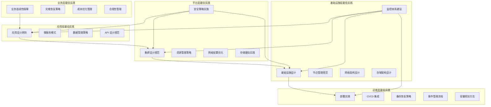
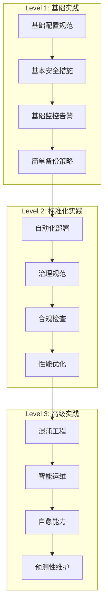

# Kubernetes 最佳实践

## 概述

Kubernetes 最佳实践是基于社区经验、生产环境验证和技术专家建议总结的一套指导原则和实施方法。这些实践帮助用户构建高可用、高性能、安全可靠的 Kubernetes 系统，避免常见陷阱，提升运维效率。

### 最佳实践的价值

**技术价值**：
- **提升系统可靠性**：通过经过验证的方法降低故障风险
- **优化性能表现**：基于最佳配置获得最优性能
- **增强安全防护**：遵循安全最佳实践保护系统安全
- **简化运维管理**：标准化的实践降低运维复杂度

**业务价值**：
- **加速项目交付**：避免重复踩坑，快速实现目标
- **降低运营成本**：减少故障停机和人工运维成本
- **提升团队效率**：统一的标准和规范提高协作效率
- **保障业务连续性**：可靠的系统架构保障业务稳定运行

### 实践原则

- **安全优先**：所有配置和部署都以安全为第一考虑
- **可靠性至上**：优先保证系统的稳定性和可用性
- **性能优化**：在保证可靠性基础上追求最优性能
- **简单有效**：选择简单而有效的解决方案
- **持续改进**：基于监控数据和经验持续优化

## 最佳实践体系架构

### 分层最佳实践模型



### 最佳实践成熟度模型



## 核心实践领域

### 安全最佳实践

#### RBAC 权限控制最佳实践

```yaml
# RBAC 最佳实践示例
apiVersion: v1
kind: Namespace
metadata:
  name: production
  labels:
    environment: production
    security.kubernetes.io/enforce: restricted
---
# 最小权限原则：只授予必要的权限
apiVersion: rbac.authorization.k8s.io/v1
kind: Role
metadata:
  namespace: production
  name: app-reader
rules:
- apiGroups: [""]
  resources: ["pods", "services", "configmaps"]
  verbs: ["get", "list", "watch"]
- apiGroups: ["apps"]
  resources: ["deployments", "replicasets"]
  verbs: ["get", "list", "watch"]
---
# 服务账户绑定
apiVersion: rbac.authorization.k8s.io/v1
kind: RoleBinding
metadata:
  name: app-readers
  namespace: production
subjects:
- kind: ServiceAccount
  name: app-reader-sa
  namespace: production
roleRef:
  kind: Role
  name: app-reader
  apiGroup: rbac.authorization.k8s.io
---
# 服务账户配置
apiVersion: v1
kind: ServiceAccount
metadata:
  name: app-reader-sa
  namespace: production
automountServiceAccountToken: false  # 安全实践：显式控制
```

#### Pod 安全策略最佳实践

```yaml
# Pod 安全标准配置
apiVersion: v1
kind: Pod
metadata:
  name: secure-app
  namespace: production
  annotations:
    # 启用安全配置
    seccomp.security.alpha.kubernetes.io/pod: runtime/default
spec:
  # 安全上下文配置
  securityContext:
    runAsNonRoot: true          # 不以 root 用户运行
    runAsUser: 10001           # 指定非特权用户 ID
    runAsGroup: 10001          # 指定用户组 ID
    fsGroup: 10001             # 文件系统组 ID
    seccompProfile:
      type: RuntimeDefault      # 启用 seccomp
  
  containers:
  - name: app
    image: myapp:v1.2.3
    # 容器安全上下文
    securityContext:
      allowPrivilegeEscalation: false  # 禁止权限提升
      readOnlyRootFilesystem: true     # 只读根文件系统
      runAsNonRoot: true               # 非 root 运行
      capabilities:
        drop:
        - ALL                          # 移除所有能力
        add:
        - NET_BIND_SERVICE             # 只添加必需的能力
    
    # 资源限制
    resources:
      requests:
        memory: "128Mi"
        cpu: "100m"
      limits:
        memory: "256Mi"
        cpu: "200m"
    
    # 健康检查
    livenessProbe:
      httpGet:
        path: /health
        port: 8080
        scheme: HTTP
      initialDelaySeconds: 30
      periodSeconds: 10
      timeoutSeconds: 5
      failureThreshold: 3
    
    readinessProbe:
      httpGet:
        path: /ready
        port: 8080
        scheme: HTTP
      initialDelaySeconds: 5
      periodSeconds: 5
      timeoutSeconds: 3
      failureThreshold: 3
    
    # 挂载点配置
    volumeMounts:
    - name: tmp
      mountPath: /tmp
    - name: cache
      mountPath: /app/cache
  
  volumes:
  - name: tmp
    emptyDir: {}
  - name: cache
    emptyDir:
      sizeLimit: 1Gi
```

#### 网络安全最佳实践

```yaml
# 网络策略：默认拒绝所有入站流量
apiVersion: networking.k8s.io/v1
kind: NetworkPolicy
metadata:
  name: default-deny-ingress
  namespace: production
spec:
  podSelector: {}
  policyTypes:
  - Ingress
---
# 网络策略：允许特定服务间通信
apiVersion: networking.k8s.io/v1
kind: NetworkPolicy
metadata:
  name: allow-frontend-to-backend
  namespace: production
spec:
  podSelector:
    matchLabels:
      app: backend
  policyTypes:
  - Ingress
  ingress:
  - from:
    - podSelector:
        matchLabels:
          app: frontend
    ports:
    - protocol: TCP
      port: 8080
---
# 网络策略：允许从 Ingress 控制器访问
apiVersion: networking.k8s.io/v1
kind: NetworkPolicy
metadata:
  name: allow-ingress-to-frontend
  namespace: production
spec:
  podSelector:
    matchLabels:
      app: frontend
  policyTypes:
  - Ingress
  ingress:
  - from:
    - namespaceSelector:
        matchLabels:
          name: ingress-nginx
    ports:
    - protocol: TCP
      port: 80
```

### 可靠性最佳实践

#### 高可用部署模式

```yaml
# 高可用 Deployment 配置
apiVersion: apps/v1
kind: Deployment
metadata:
  name: web-app
  namespace: production
  labels:
    app: web-app
    version: v1.0.0
spec:
  # 多副本部署
  replicas: 3
  
  # 滚动更新策略
  strategy:
    type: RollingUpdate
    rollingUpdate:
      maxUnavailable: 1        # 最多 1 个不可用
      maxSurge: 1             # 最多额外创建 1 个
  
  selector:
    matchLabels:
      app: web-app
  
  template:
    metadata:
      labels:
        app: web-app
        version: v1.0.0
    spec:
      # 反亲和性：分散部署到不同节点
      affinity:
        podAntiAffinity:
          preferredDuringSchedulingIgnoredDuringExecution:
          - weight: 100
            podAffinityTerm:
              labelSelector:
                matchExpressions:
                - key: app
                  operator: In
                  values:
                  - web-app
              topologyKey: kubernetes.io/hostname
      
      # 优雅终止
      terminationGracePeriodSeconds: 30
      
      containers:
      - name: web-app
        image: web-app:v1.0.0
        
        # 资源配置
        resources:
          requests:
            memory: "256Mi"
            cpu: "250m"
          limits:
            memory: "512Mi"
            cpu: "500m"
        
        # 端口配置
        ports:
        - containerPort: 8080
          name: http
          protocol: TCP
        
        # 健康检查
        livenessProbe:
          httpGet:
            path: /actuator/health/liveness
            port: http
          initialDelaySeconds: 45
          periodSeconds: 20
          timeoutSeconds: 10
          failureThreshold: 3
        
        readinessProbe:
          httpGet:
            path: /actuator/health/readiness
            port: http
          initialDelaySeconds: 10
          periodSeconds: 5
          timeoutSeconds: 5
          failureThreshold: 3
        
        # 启动探针
        startupProbe:
          httpGet:
            path: /actuator/health/liveness
            port: http
          initialDelaySeconds: 10
          periodSeconds: 5
          timeoutSeconds: 5
          failureThreshold: 30
        
        # 环境变量
        env:
        - name: JVM_OPTS
          value: "-Xmx384m -Xms384m"
        - name: SPRING_PROFILES_ACTIVE
          value: "production"
        
        # 生命周期钩子
        lifecycle:
          preStop:
            exec:
              command:
              - /bin/sh
              - -c
              - sleep 15  # 给负载均衡器时间移除此实例
---
# Pod 中断预算
apiVersion: policy/v1
kind: PodDisruptionBudget
metadata:
  name: web-app-pdb
  namespace: production
spec:
  minAvailable: 2  # 最少保持 2 个可用
  selector:
    matchLabels:
      app: web-app
---
# 水平自动扩缩容
apiVersion: autoscaling/v2
kind: HorizontalPodAutoscaler
metadata:
  name: web-app-hpa
  namespace: production
spec:
  scaleTargetRef:
    apiVersion: apps/v1
    kind: Deployment
    name: web-app
  minReplicas: 3
  maxReplicas: 10
  metrics:
  - type: Resource
    resource:
      name: cpu
      target:
        type: Utilization
        averageUtilization: 70
  - type: Resource
    resource:
      name: memory
      target:
        type: Utilization
        averageUtilization: 80
  behavior:
    scaleUp:
      stabilizationWindowSeconds: 60
      policies:
      - type: Percent
        value: 50
        periodSeconds: 60
    scaleDown:
      stabilizationWindowSeconds: 300
      policies:
      - type: Percent
        value: 10
        periodSeconds: 60
```

#### 服务容错模式

```yaml
# 服务配置最佳实践
apiVersion: v1
kind: Service
metadata:
  name: web-app-service
  namespace: production
  annotations:
    # 服务拓扑感知
    service.kubernetes.io/topology-aware-hints: auto
spec:
  type: ClusterIP
  selector:
    app: web-app
  ports:
  - port: 80
    targetPort: http
    protocol: TCP
    name: http
  # 会话亲和性配置
  sessionAffinity: None
  # 内部流量策略
  internalTrafficPolicy: Local
---
# Ingress 配置
apiVersion: networking.k8s.io/v1
kind: Ingress
metadata:
  name: web-app-ingress
  namespace: production
  annotations:
    # NGINX 特定配置
    nginx.ingress.kubernetes.io/rewrite-target: /
    nginx.ingress.kubernetes.io/ssl-redirect: "true"
    nginx.ingress.kubernetes.io/force-ssl-redirect: "true"
    
    # 限流配置
    nginx.ingress.kubernetes.io/rate-limit: "100"
    nginx.ingress.kubernetes.io/rate-limit-window: "1m"
    
    # 超时配置
    nginx.ingress.kubernetes.io/proxy-connect-timeout: "5"
    nginx.ingress.kubernetes.io/proxy-send-timeout: "60"
    nginx.ingress.kubernetes.io/proxy-read-timeout: "60"
    
    # 健康检查
    nginx.ingress.kubernetes.io/upstream-health-check: "true"
    nginx.ingress.kubernetes.io/upstream-health-check-path: "/actuator/health"
    nginx.ingress.kubernetes.io/upstream-health-check-interval: "10s"
    
    # 证书管理
    cert-manager.io/cluster-issuer: "letsencrypt-prod"
spec:
  tls:
  - hosts:
    - app.example.com
    secretName: web-app-tls
  rules:
  - host: app.example.com
    http:
      paths:
      - path: /
        pathType: Prefix
        backend:
          service:
            name: web-app-service
            port:
              number: 80
```

### 性能优化最佳实践

#### 资源配置优化

```yaml
# 资源限制和请求的最佳实践
apiVersion: v1
kind: LimitRange
metadata:
  name: resource-limits
  namespace: production
spec:
  limits:
  # 容器资源限制
  - type: Container
    default:
      cpu: "200m"
      memory: "256Mi"
    defaultRequest:
      cpu: "100m"
      memory: "128Mi"
    max:
      cpu: "2"
      memory: "2Gi"
    min:
      cpu: "50m"
      memory: "64Mi"
    maxLimitRequestRatio:
      cpu: "4"     # limits 最多是 requests 的 4 倍
      memory: "2"  # limits 最多是 requests 的 2 倍
  
  # Pod 资源限制
  - type: Pod
    max:
      cpu: "4"
      memory: "4Gi"
    min:
      cpu: "100m"
      memory: "128Mi"
  
  # PVC 存储限制
  - type: PersistentVolumeClaim
    max:
      storage: "10Gi"
    min:
      storage: "1Gi"
---
# 资源配额
apiVersion: v1
kind: ResourceQuota
metadata:
  name: production-quota
  namespace: production
spec:
  hard:
    # 计算资源配额
    requests.cpu: "10"
    requests.memory: "20Gi"
    limits.cpu: "20"
    limits.memory: "40Gi"
    
    # 存储资源配额
    requests.storage: "100Gi"
    persistentvolumeclaims: "10"
    
    # 对象数量配额
    pods: "50"
    services: "20"
    secrets: "30"
    configmaps: "20"
    
    # 服务质量等级配额
    count/pods.guaranteed: "5"
    count/pods.burstable: "30"
    count/pods.besteffort: "15"
```

#### 调度优化配置

```yaml
# 节点亲和性和反亲和性最佳实践
apiVersion: apps/v1
kind: Deployment
metadata:
  name: database
  namespace: production
spec:
  replicas: 3
  selector:
    matchLabels:
      app: database
  template:
    metadata:
      labels:
        app: database
    spec:
      # 节点亲和性：优先调度到 SSD 节点
      affinity:
        nodeAffinity:
          preferredDuringSchedulingIgnoredDuringExecution:
          - weight: 100
            preference:
              matchExpressions:
              - key: disk-type
                operator: In
                values:
                - ssd
          - weight: 50
            preference:
              matchExpressions:
              - key: node-type
                operator: In
                values:
                - compute-optimized
        
        # Pod 反亲和性：确保副本分散在不同节点
        podAntiAffinity:
          requiredDuringSchedulingIgnoredDuringExecution:
          - labelSelector:
              matchExpressions:
              - key: app
                operator: In
                values:
                - database
            topologyKey: kubernetes.io/hostname
          
          # 软反亲和性：尽量分散在不同可用区
          preferredDuringSchedulingIgnoredDuringExecution:
          - weight: 100
            podAffinityTerm:
              labelSelector:
                matchExpressions:
                - key: app
                  operator: In
                  values:
                  - database
              topologyKey: topology.kubernetes.io/zone
      
      # 容忍度：允许调度到特定污点节点
      tolerations:
      - key: "database-dedicated"
        operator: "Equal"
        value: "true"
        effect: "NoSchedule"
      
      # 优先级类
      priorityClassName: "high-priority"
      
      # 调度器名称（如果使用自定义调度器）
      schedulerName: "custom-scheduler"
      
      containers:
      - name: database
        image: postgres:13
        resources:
          requests:
            cpu: "500m"
            memory: "1Gi"
          limits:
            cpu: "1"
            memory: "2Gi"
---
# 优先级类定义
apiVersion: scheduling.k8s.io/v1
kind: PriorityClass
metadata:
  name: high-priority
value: 1000
globalDefault: false
description: "High priority class for critical workloads"
```

### 运维最佳实践

#### GitOps 部署流程

```yaml
# GitOps 部署配置
apiVersion: argoproj.io/v1alpha1
kind: Application
metadata:
  name: web-app
  namespace: argocd
  finalizers:
    - resources-finalizer.argocd.argoproj.io
spec:
  project: production
  
  # 源代码配置
  source:
    repoURL: https://github.com/company/k8s-manifests
    targetRevision: main
    path: apps/web-app/production
    
    # Helm 配置
    helm:
      valueFiles:
      - values.yaml
      - values-production.yaml
      parameters:
      - name: image.tag
        value: v1.0.0
      - name: replicaCount
        value: "3"
  
  # 目标集群配置
  destination:
    server: https://kubernetes.default.svc
    namespace: production
  
  # 同步策略
  syncPolicy:
    automated:
      prune: true      # 自动删除不再需要的资源
      selfHeal: true   # 自动修复配置漂移
      allowEmpty: false
    
    syncOptions:
    - CreateNamespace=true
    - PrunePropagationPolicy=foreground
    - PruneLast=true
    
    retry:
      limit: 3
      backoff:
        duration: 5s
        factor: 2
        maxDuration: 3m
  
  # 健康检查配置
  ignoreDifferences:
  - group: apps
    kind: Deployment
    jsonPointers:
    - /spec/replicas  # 忽略 HPA 导致的副本数差异
---
# Kustomization 配置
apiVersion: kustomize.config.k8s.io/v1beta1
kind: Kustomization

# 基础资源
resources:
- ../base
- certificate.yaml
- monitoring.yaml

# 生产环境特定配置
patchesStrategicMerge:
- deployment-production.yaml
- service-production.yaml

# 配置生成器
configMapGenerator:
- name: app-config
  files:
  - application.properties
  - logback.xml

secretGenerator:
- name: app-secrets
  envs:
  - secrets.env

# 镜像标签管理
images:
- name: web-app
  newTag: v1.0.0

# 名称前缀
namePrefix: prod-

# 标签应用
commonLabels:
  environment: production
  managed-by: argocd

# 注解应用
commonAnnotations:
  deployed-by: argocd
  deployment-time: "2024-01-01T00:00:00Z"
```

#### 备份恢复策略

```yaml
# Velero 备份配置
apiVersion: velero.io/v1
kind: Backup
metadata:
  name: production-daily-backup
  namespace: velero
spec:
  # 包含的命名空间
  includedNamespaces:
  - production
  - monitoring
  - ingress-nginx
  
  # 排除的资源
  excludedResources:
  - events
  - events.events.k8s.io
  
  # 包含集群资源
  includeClusterResources: true
  
  # 标签选择器
  labelSelector:
    matchLabels:
      backup: "enabled"
  
  # 存储位置
  storageLocation: default
  
  # 卷快照位置
  volumeSnapshotLocations:
  - default
  
  # TTL 配置
  ttl: 720h  # 30 天
  
  # 备份 PV
  snapshotVolumes: true
  
  # 默认卷快照到云端
  defaultVolumesToRestic: false
---
# 定期备份计划
apiVersion: velero.io/v1
kind: Schedule
metadata:
  name: production-backup-schedule
  namespace: velero
spec:
  # Cron 表达式：每天凌晨 2 点
  schedule: "0 2 * * *"
  
  template:
    includedNamespaces:
    - production
    - monitoring
    
    includeClusterResources: true
    snapshotVolumes: true
    ttl: 720h
    
    # 备份钩子：备份前停止应用
    hooks:
      resources:
      - name: database-backup-hook
        includedNamespaces:
        - production
        labelSelector:
          matchLabels:
            app: database
        pre:
        - exec:
            container: database
            command:
            - /bin/bash
            - -c
            - pg_dump mydb > /backup/mydb.sql
            timeout: 300s
        post:
        - exec:
            container: database
            command:
            - /bin/bash
            - -c
            - rm -f /backup/mydb.sql
---
# 恢复配置
apiVersion: velero.io/v1
kind: Restore
metadata:
  name: production-restore
  namespace: velero
spec:
  backupName: production-daily-backup-20240101020000
  
  # 包含的命名空间
  includedNamespaces:
  - production
  
  # 命名空间映射
  namespaceMapping:
    production: production-restore
  
  # 恢复 PV
  restorePVs: true
  
  # 保留节点端口
  preserveNodePorts: false
  
  # 恢复策略
  existingResourcePolicy: update
```

### 配置管理最佳实践

#### ConfigMap 和 Secret 管理

```yaml
# ConfigMap 分层管理
apiVersion: v1
kind: ConfigMap
metadata:
  name: app-config-base
  namespace: production
data:
  # 应用基础配置
  application.yaml: |
    server:
      port: 8080
      shutdown: graceful
    
    management:
      endpoints:
        web:
          exposure:
            include: health,info,metrics,prometheus
      endpoint:
        health:
          show-details: always
      
    logging:
      level:
        com.company.app: INFO
        org.springframework: WARN
      pattern:
        console: "%d{yyyy-MM-dd HH:mm:ss} [%thread] %-5level %logger{36} - %msg%n"
    
    spring:
      application:
        name: web-app
      profiles:
        active: production
---
apiVersion: v1
kind: ConfigMap
metadata:
  name: app-config-env
  namespace: production
data:
  # 环境特定配置
  DATABASE_HOST: "postgres.production.svc.cluster.local"
  DATABASE_PORT: "5432"
  DATABASE_NAME: "webapp"
  REDIS_HOST: "redis.production.svc.cluster.local"
  REDIS_PORT: "6379"
  LOG_LEVEL: "INFO"
  JVM_OPTS: "-Xmx1g -Xms1g -XX:+UseG1GC"
---
# Secret 安全管理
apiVersion: v1
kind: Secret
metadata:
  name: app-secrets
  namespace: production
  annotations:
    # 使用外部密钥管理
    secrets-store.csi.x-k8s.io/used: "true"
type: Opaque
data:
  # Base64 编码的敏感数据
  DATABASE_PASSWORD: <base64-encoded-password>
  API_KEY: <base64-encoded-api-key>
  JWT_SECRET: <base64-encoded-jwt-secret>
---
# 外部密钥提供者（使用 Secrets Store CSI Driver）
apiVersion: secrets-store.csi.x-k8s.io/v1
kind: SecretProviderClass
metadata:
  name: app-secrets-provider
  namespace: production
spec:
  provider: vault
  parameters:
    # Vault 配置
    vaultAddress: "https://vault.company.com"
    roleName: "web-app"
    objects: |
      - objectName: "database-password"
        secretPath: "secret/data/production/database"
        secretKey: "password"
      - objectName: "api-key"
        secretPath: "secret/data/production/api"
        secretKey: "key"
  secretObjects:
  - secretName: app-secrets
    type: Opaque
    data:
    - objectName: database-password
      key: DATABASE_PASSWORD
    - objectName: api-key
      key: API_KEY
```

## 最佳实践成熟度评估

### 评估维度和标准

```yaml
# 最佳实践成熟度评估模型
maturity_assessment:
  dimensions:
    security:
      weight: 25
      criteria:
        - name: "RBAC Implementation"
          description: "基于角色的访问控制实施"
          levels:
            basic: "基本 RBAC 配置"
            intermediate: "细粒度权限控制"
            advanced: "零信任安全模型"
          
        - name: "Pod Security Standards"
          description: "Pod 安全标准实施"
          levels:
            basic: "基本安全上下文配置"
            intermediate: "Pod 安全策略"
            advanced: "准入控制器和 OPA"
            
        - name: "Network Security"
          description: "网络安全策略"
          levels:
            basic: "基本网络策略"
            intermediate: "微分段网络"
            advanced: "服务网格安全"
    
    reliability:
      weight: 25
      criteria:
        - name: "High Availability"
          description: "高可用性设计"
          levels:
            basic: "多副本部署"
            intermediate: "跨可用区部署"
            advanced: "混沌工程验证"
            
        - name: "Backup & Recovery"
          description: "备份恢复策略"
          levels:
            basic: "定期备份"
            intermediate: "自动化备份恢复"
            advanced: "灾难恢复演练"
    
    performance:
      weight: 20
      criteria:
        - name: "Resource Optimization"
          description: "资源优化配置"
          levels:
            basic: "基本资源限制"
            intermediate: "HPA/VPA 配置"
            advanced: "智能调度优化"
            
        - name: "Monitoring & Observability"
          description: "监控可观测性"
          levels:
            basic: "基础监控告警"
            intermediate: "全链路追踪"
            advanced: "预测性分析"
    
    automation:
      weight: 20
      criteria:
        - name: "CI/CD Integration"
          description: "CI/CD 集成"
          levels:
            basic: "基本部署流水线"
            intermediate: "GitOps 工作流"
            advanced: "渐进式交付"
            
        - name: "Infrastructure as Code"
          description: "基础设施即代码"
          levels:
            basic: "声明式配置"
            intermediate: "Helm/Kustomize"
            advanced: "Terraform + Helm"
    
    governance:
      weight: 10
      criteria:
        - name: "Policy Management"
          description: "策略管理"
          levels:
            basic: "基本策略配置"
            intermediate: "策略即代码"
            advanced: "智能策略引擎"

  scoring:
    basic: 1
    intermediate: 2
    advanced: 3
    
  thresholds:
    level_1: 40   # 基础级别
    level_2: 65   # 中级级别
    level_3: 85   # 高级级别
```

### 最佳实践检查清单

```yaml
# 部署前检查清单
pre_deployment_checklist:
  security:
    - title: "镜像安全扫描"
      description: "所有容器镜像通过安全漏洞扫描"
      critical: true
      
    - title: "RBAC 权限检查"
      description: "验证最小权限原则实施"
      critical: true
      
    - title: "密钥管理"
      description: "敏感信息使用 Secret 或外部密钥管理"
      critical: true
      
    - title: "网络策略"
      description: "配置适当的网络访问控制"
      critical: false
  
  reliability:
    - title: "资源限制配置"
      description: "所有容器配置资源请求和限制"
      critical: true
      
    - title: "健康检查配置"
      description: "配置存活性和就绪性探针"
      critical: true
      
    - title: "多副本部署"
      description: "关键服务部署多个副本"
      critical: true
      
    - title: "PDB 配置"
      description: "配置 Pod 中断预算"
      critical: false
  
  performance:
    - title: "HPA 配置"
      description: "配置水平自动扩缩容"
      critical: false
      
    - title: "亲和性配置"
      description: "配置合适的调度策略"
      critical: false
      
    - title: "服务质量等级"
      description: "明确 QoS 类别配置"
      critical: false
  
  monitoring:
    - title: "指标暴露"
      description: "应用暴露 Prometheus 指标"
      critical: true
      
    - title: "日志配置"
      description: "配置结构化日志输出"
      critical: true
      
    - title: "告警规则"
      description: "配置关键告警规则"
      critical: true

# 生产环境检查清单
production_readiness_checklist:
  infrastructure:
    - title: "节点容量规划"
      description: "确保足够的节点容量和可用区分布"
      
    - title: "存储配置"
      description: "生产级存储类和备份策略"
      
    - title: "网络配置"
      description: "生产网络拓扑和安全配置"
  
  application:
    - title: "性能测试"
      description: "通过负载测试和性能基准测试"
      
    - title: "故障注入测试"
      description: "通过混沌工程测试"
      
    - title: "安全测试"
      description: "通过安全扫描和渗透测试"
  
  operations:
    - title: "运维手册"
      description: "完整的运维手册和故障排除指南"
      
    - title: "备份恢复演练"
      description: "定期备份恢复演练"
      
    - title: "灾难恢复计划"
      description: "完整的灾难恢复计划和演练"
```

## 相关概念

本章节的最佳实践与以下技术知识密切相关：

- **[核心概念](../01-core-concepts/README.md)**：理解最佳实践应用的基础概念
- **[系统架构](../02-architecture/README.md)**：了解架构设计的最佳实践
- **[工作原理](../03-working-principles/README.md)**：基于工作原理制定最佳实践
- **[可观测性](../04-observability/README.md)**：监控和可观测性最佳实践
- **[性能优化](../05-optimization/README.md)**：性能优化的最佳实践方法
- **[故障排除](../06-troubleshooting/README.md)**：故障预防和处理的最佳实践

## 参考资料

### 官方文档
- [Kubernetes 最佳实践](https://kubernetes.io/docs/concepts/configuration/overview/)
- [生产就绪清单](https://kubernetes.io/docs/setup/best-practices/)
- [安全最佳实践](https://kubernetes.io/docs/concepts/security/)

### 深入学习资源
- [Kubernetes Patterns Book](https://k8spatterns.io/)
- [Production Kubernetes Book](https://www.oreilly.com/library/view/production-kubernetes/9781492092292/)
- [CNCF 云原生技术栈](https://landscape.cncf.io/)

### 社区最佳实践
- [Google SRE 最佳实践](https://sre.google/workbook/)
- [NIST 云原生安全指南](https://www.nist.gov/cybersecurity)
- [CIS Kubernetes 基准测试](https://www.cisecurity.org/benchmark/kubernetes)
