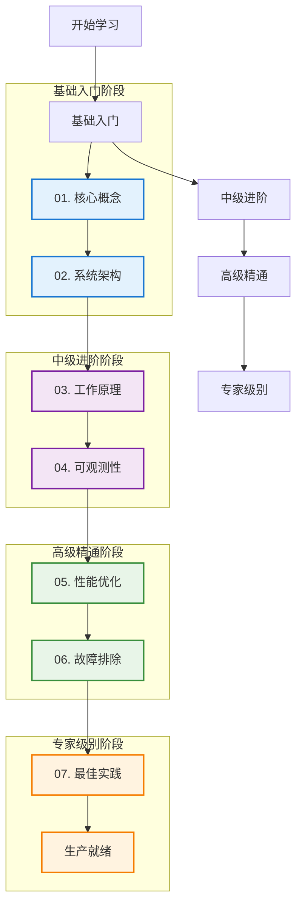

# Kubernetes 完整知识体系

## 概述

本知识体系提供了 Kubernetes 从入门到精通的完整学习路径，涵盖了核心概念、系统架构、工作原理、可观测性、性能优化、故障排除、最佳实践等各个方面。无论你是 Kubernetes 初学者还是经验丰富的实践者，都能在这里找到所需的知识和指导。

### 知识体系特色

- **系统性**：从基础概念到高级实践的完整覆盖
- **实用性**：结合生产环境经验的最佳实践
- **可操作性**：提供详细的配置示例和操作指南
- **前瞻性**：包含最新技术趋势和发展方向

## 学习路径导航

### 🎯 快速导航



### 📚 知识模块总览

| 模块 | 学习难度 | 预计学习时间 | 主要内容 | 适用人群 |
|------|----------|--------------|----------|----------|
| [01. 核心概念](./01-core-concepts/README.md) | ⭐⭐ | 1-2周 | Pod、Service、Deployment 等基础概念 | 所有用户 |
| [02. 系统架构](./02-architecture/README.md) | ⭐⭐⭐ | 2-3周 | 控制平面、数据平面、组件交互 | 运维人员、架构师 |
| [03. 工作原理](./03-working-principles/README.md) | ⭐⭐⭐⭐ | 3-4周 | 声明式API、控制器模式、调度算法 | 开发者、运维人员 |
| [04. 可观测性](./04-observability/README.md) | ⭐⭐⭐ | 2-3周 | 监控、日志、链路追踪 | 运维人员、SRE |
| [05. 性能优化](./05-optimization/README.md) | ⭐⭐⭐⭐ | 3-4周 | 资源优化、调度优化、网络优化 | 性能工程师、SRE |
| [06. 故障排除](./06-troubleshooting/README.md) | ⭐⭐⭐⭐⭐ | 4-5周 | 问题诊断、根因分析、解决方案 | 运维人员、SRE |
| [07. 最佳实践](./07-best-practices/README.md) | ⭐⭐⭐⭐ | 3-4周 | 安全、可靠性、性能、运维实践 | 所有用户 |

## 分阶段学习指南

### 第一阶段：基础建设（1-2个月）

**目标**：掌握 Kubernetes 基础概念和基本操作

**学习重点**：
1. **[核心概念](./01-core-concepts/README.md)**
   - 理解 Pod、Service、Deployment 等基础对象
   - 掌握 kubectl 基本命令
   - 学习 YAML 配置文件编写
   - 理解命名空间和标签选择器

2. **[系统架构](./02-architecture/README.md)**
   - 了解 Master-Worker 架构
   - 理解各组件职责和交互关系
   - 掌握集群基本搭建方法

**实践项目**：
```bash
# 部署一个简单的 Web 应用
kubectl create deployment nginx --image=nginx:1.20
kubectl expose deployment nginx --port=80 --type=NodePort
kubectl scale deployment nginx --replicas=3
```

**检验标准**：
- [ ] 能够独立搭建测试集群
- [ ] 熟练使用 kubectl 进行资源管理
- [ ] 理解 Kubernetes 基本架构和组件

### 第二阶段：深入理解（2-3个月）

**目标**：深入理解 Kubernetes 工作原理和监控体系

**学习重点**：
1. **[工作原理](./03-working-principles/README.md)**
   - 深入理解声明式 API 和控制器模式
   - 掌握调度器算法和工作流程
   - 理解网络和存储工作机制

2. **[可观测性](./04-observability/README.md)**
   - 搭建完整的监控体系
   - 学习指标、日志、链路追踪三大支柱
   - 掌握告警和事件管理

**实践项目**：
```yaml
# 部署监控栈
# 1. 部署 Prometheus + Grafana
# 2. 配置应用指标收集
# 3. 设置告警规则
# 4. 实现日志聚合
```

**检验标准**：
- [ ] 理解 Kubernetes 核心工作原理
- [ ] 能够搭建完整的监控体系
- [ ] 具备基本的问题诊断能力

### 第三阶段：优化提升（2-3个月）

**目标**：掌握性能优化和故障排除技能

**学习重点**：
1. **[性能优化](./05-optimization/README.md)**
   - 学习资源配置和调度优化
   - 掌握网络和存储性能优化
   - 理解自动扩缩容机制

2. **[故障排除](./06-troubleshooting/README.md)**
   - 掌握系统性的故障排除方法
   - 学习常见问题的诊断和解决
   - 培养根因分析能力

**实践项目**：
```bash
# 性能优化实战
# 1. 集群性能基准测试
# 2. 应用性能调优
# 3. 故障演练和排除
# 4. 容量规划实施
```

**检验标准**：
- [ ] 能够进行系统性能分析和优化
- [ ] 具备独立排查复杂问题的能力
- [ ] 掌握生产环境运维技能

### 第四阶段：实践精通（持续改进）

**目标**：建立生产级的 Kubernetes 最佳实践

**学习重点**：
1. **[最佳实践](./07-best-practices/README.md)**
   - 建立安全、可靠的部署流程
   - 实施 GitOps 和自动化运维
   - 构建企业级治理体系

**实践项目**：
```yaml
# 企业级实践
# 1. 多集群管理
# 2. 安全合规体系
# 3. 灾难恢复演练
# 4. 成本优化管理
```

**检验标准**：
- [ ] 能够设计和实施企业级 Kubernetes 方案
- [ ] 具备团队技术领导能力
- [ ] 持续跟踪和实践前沿技术

## 学习资源推荐

### 官方资源
- [Kubernetes 官方文档](https://kubernetes.io/docs/)
- [Kubernetes GitHub 仓库](https://github.com/kubernetes/kubernetes)
- [CNCF 云原生全景图](https://landscape.cncf.io/)

### 在线学习平台
- [Kubernetes 官方教程](https://kubernetes.io/docs/tutorials/)
- [Play with Kubernetes](https://labs.play-with-k8s.com/)
- [Katacoda Kubernetes 场景](https://www.katacoda.com/courses/kubernetes)

### 认证和考试
- **CKA (Certified Kubernetes Administrator)**：管理员认证
- **CKAD (Certified Kubernetes Application Developer)**：开发者认证
- **CKS (Certified Kubernetes Security Specialist)**：安全专家认证

### 推荐书籍
- 《Kubernetes in Action》- Marko Lukša
- 《Programming Kubernetes》- Michael Hausenblas
- 《Production Kubernetes》- Josh Rosso
- 《Kubernetes Patterns》- Bilgin Ibryam

### 社区和会议
- [KubeCon + CloudNativeCon](https://events.linuxfoundation.org/kubecon-cloudnativecon-north-america/)
- [Kubernetes Slack 社区](https://kubernetes.slack.com/)
- [Cloud Native Computing Foundation](https://www.cncf.io/)

## 实验环境搭建

### 本地开发环境
```bash
# 选项1：minikube
curl -LO https://storage.googleapis.com/minikube/releases/latest/minikube-linux-amd64
sudo install minikube-linux-amd64 /usr/local/bin/minikube
minikube start

# 选项2：kind (Kubernetes in Docker)
GO111MODULE="on" go get sigs.k8s.io/kind@v0.11.1
kind create cluster

# 选项3：k3s (轻量级 Kubernetes)
curl -sfL https://get.k3s.io | sh -
```

### 云环境
```bash
# Google Kubernetes Engine (GKE)
gcloud container clusters create my-cluster \
  --num-nodes=3 \
  --zone=us-central1-a

# Amazon Elastic Kubernetes Service (EKS)
eksctl create cluster --name my-cluster --region us-west-2

# Azure Kubernetes Service (AKS)
az aks create --resource-group myResourceGroup \
  --name myAKSCluster --node-count 3
```

## 学习进度跟踪

### 进度检查清单

#### 基础阶段 ✅
- [ ] 完成核心概念学习
- [ ] 理解系统架构
- [ ] 能够独立部署简单应用
- [ ] 通过 CKAD 模拟考试

#### 进阶阶段 ✅
- [ ] 深入理解工作原理
- [ ] 搭建监控体系
- [ ] 能够分析和解决常见问题
- [ ] 通过 CKA 模拟考试

#### 高级阶段 ✅
- [ ] 掌握性能优化技能
- [ ] 具备故障排除能力
- [ ] 能够设计生产级方案
- [ ] 通过 CKS 模拟考试

#### 专家阶段 ✅
- [ ] 建立最佳实践体系
- [ ] 具备团队指导能力
- [ ] 参与开源社区贡献
- [ ] 获得官方认证

### 学习笔记模板

```markdown
# 学习日期：2024-XX-XX
## 今日学习内容
- 学习模块：
- 重点概念：
- 实践操作：

## 遇到的问题
- 问题描述：
- 解决方案：
- 参考资料：

## 心得体会
- 关键收获：
- 实际应用：
- 后续计划：
```

## 社区贡献指南

### 参与方式
1. **文档改进**：发现错误或不清晰的地方，提交 PR
2. **示例补充**：添加更多实际场景的配置示例
3. **经验分享**：分享生产环境的实践经验
4. **问题反馈**：报告发现的问题或建议改进

### 贡献规范
- 遵循现有文档结构和格式
- 提供准确、可验证的技术信息
- 包含必要的配置示例和说明
- 添加适当的图表和流程图

## 技术发展趋势

### 当前热点
- **云原生安全**：零信任、供应链安全、运行时保护
- **边缘计算**：K3s、KubeEdge、OpenYurt
- **服务网格**：Istio、Linkerd、Consul Connect
- **GitOps**：ArgoCD、Flux、Tekton

### 未来趋势
- **无服务器计算**：Knative、OpenFaaS、Virtual Kubelet
- **机器学习平台**：Kubeflow、Seldon、KServe
- **多集群管理**：Admiral、Submariner、Clusternet
- **智能运维**：AI Ops、自愈系统、预测性维护

## 总结

Kubernetes 是一个复杂而强大的容器编排平台，掌握它需要系统性的学习和大量的实践。通过本知识体系的学习，你将：

1. **建立完整的知识框架**：从基础概念到高级实践的全面掌握
2. **获得实际操作能力**：通过丰富的示例和实践项目获得经验
3. **培养问题解决能力**：具备独立分析和解决问题的技能
4. **跟上技术发展趋势**：了解最新的技术动向和最佳实践

记住，学习 Kubernetes 是一个持续的过程，技术在不断发展，实践经验需要不断积累。保持学习的热情，积极参与社区，与同行交流经验，你将在云原生技术的道路上走得更远。

**开始你的 Kubernetes 学习之旅吧！** 🚀
