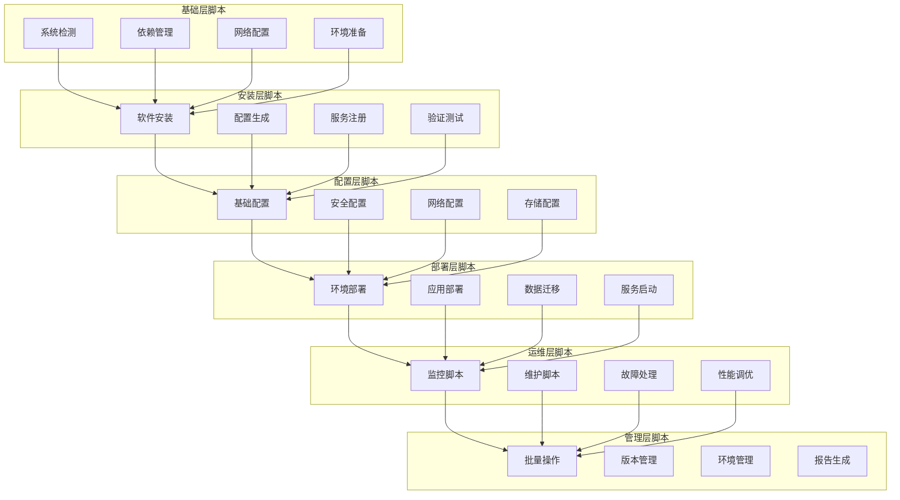

# Kubernetes 脚本集合

## 概述

本目录提供 Kubernetes 的全面自动化脚本集合，包括安装、配置、部署、维护、监控等各类操作脚本，帮助实现运维自动化，提高工作效率，减少人为错误，确保操作的一致性和可重复性。

## 脚本体系架构



## 目录结构

```
kubernetes/scripts/
├── README.md                     # 脚本总览和使用说明
├── install/                      # 安装脚本
│   ├── install-kubernetes.sh     # Kubernetes集群安装
│   ├── install-kubernetes.bat    # Windows版本
│   ├── install-helm.sh          # Helm包管理器安装
│   ├── install-helm.bat         # Windows版本
│   └── README.md
├── configure/                    # 配置脚本
│   ├── configure-cluster.sh     # 集群配置
│   ├── configure-cluster.bat    # Windows版本
│   ├── configure-network.sh     # 网络配置
│   ├── configure-security.sh    # 安全配置
│   └── README.md
├── deploy/                       # 部署脚本
│   ├── deploy-application.sh    # 应用部署
│   ├── deploy-monitoring.sh     # 监控部署
│   ├── deploy-logging.sh        # 日志部署
│   └── README.md
├── maintain/                     # 维护脚本
│   ├── backup-cluster.sh        # 集群备份
│   ├── cleanup-resources.sh     # 资源清理
│   ├── health-check.sh          # 健康检查
│   ├── update-cluster.sh        # 集群更新
│   └── README.md
├── monitor/                      # 监控脚本
│   ├── cluster-monitor.sh       # 集群监控
│   ├── node-monitor.sh          # 节点监控
│   ├── application-monitor.sh   # 应用监控
│   └── README.md
├── utils/                        # 工具脚本
│   ├── common-functions.sh      # 公共函数库
│   ├── common-functions.bat     # Windows公共函数
│   ├── kubectl-helpers.sh       # kubectl辅助工具
│   └── README.md
└── uninstall/                    # 卸载脚本
    ├── uninstall-kubernetes.sh  # Kubernetes卸载
    ├── uninstall-kubernetes.bat # Windows版本
    └── README.md
```

## 脚本功能矩阵

| 脚本名称 | 功能描述 | 支持平台 | 执行权限 | 依赖条件 | 使用频率 | 风险等级 |
|---------|---------|---------|---------|---------|---------|---------|
| **安装脚本** |
| install-kubernetes.sh | Kubernetes集群安装 | Linux/macOS | 管理员 | Docker, 网络连接 | 低频 | 高 |
| install-helm.sh | Helm包管理器安装 | Linux/macOS | 普通用户 | kubectl, 网络连接 | 低频 | 低 |
| **配置脚本** |
| configure-cluster.sh | 集群基础配置 | Linux/macOS | 管理员 | kubectl, 集群访问权限 | 中频 | 中 |
| configure-network.sh | 网络配置 | Linux/macOS | 管理员 | 网络管理权限 | 低频 | 高 |
| configure-security.sh | 安全配置 | Linux/macOS | 管理员 | 集群管理权限 | 中频 | 高 |
| **部署脚本** |
| deploy-application.sh | 应用部署 | 全平台 | 普通用户 | kubectl, YAML文件 | 高频 | 中 |
| deploy-monitoring.sh | 监控系统部署 | 全平台 | 普通用户 | kubectl, Helm | 中频 | 中 |
| **维护脚本** |
| backup-cluster.sh | 集群数据备份 | Linux/macOS | 管理员 | etcd访问权限 | 高频 | 中 |
| cleanup-resources.sh | 资源清理 | 全平台 | 普通用户 | kubectl | 高频 | 中 |
| health-check.sh | 集群健康检查 | 全平台 | 普通用户 | kubectl | 高频 | 低 |
| **监控脚本** |
| cluster-monitor.sh | 集群状态监控 | 全平台 | 普通用户 | kubectl | 高频 | 低 |
| node-monitor.sh | 节点状态监控 | 全平台 | 普通用户 | kubectl | 高频 | 低 |

## 关键脚本场景

### 一键安装
快速安装和配置完整的 Kubernetes 环境：
```bash
# 一键安装 Kubernetes 集群
./install/install-kubernetes.sh --type=single-node --cni=flannel

# 一键安装 Helm
./install/install-helm.sh --version=latest
```

### 环境初始化
新环境的快速搭建和配置：
```bash
# 初始化集群配置
./configure/configure-cluster.sh --config=production

# 配置网络和安全
./configure/configure-network.sh
./configure/configure-security.sh
```

### 批量运维
多节点的批量操作和管理：
```bash
# 批量健康检查
./maintain/health-check.sh --all-nodes

# 批量资源清理
./maintain/cleanup-resources.sh --namespace=default
```

### 故障恢复
自动化的故障检测和恢复：
```bash
# 集群故障检测
./monitor/cluster-monitor.sh --check-all

# 自动备份和恢复
./maintain/backup-cluster.sh --auto-restore
```

### 定期维护
定时执行的维护和清理任务：
```bash
# 定期清理未使用的资源
./maintain/cleanup-resources.sh --unused --dry-run

# 定期更新集群组件
./maintain/update-cluster.sh --components=all
```

## 兼容性说明

### 支持的操作系统
- **Linux**: Ubuntu 18.04+, CentOS 7+, RHEL 7+, Debian 9+
- **macOS**: macOS 10.14+
- **Windows**: Windows 10, Windows Server 2019+

### 支持的 Kubernetes 版本
- Kubernetes 1.20+
- OpenShift 4.6+
- Rancher 2.5+
- Amazon EKS, Google GKE, Azure AKS

### 依赖工具
- **必需**: kubectl, docker, curl, bash 4.0+
- **可选**: helm, git, jq, yq
- **Windows**: PowerShell 5.1+, WSL2

## 使用原则

### 安全原则
1. **最小权限**: 使用最小必要权限执行脚本
2. **输入验证**: 严格验证所有输入参数
3. **敏感数据**: 安全处理和存储敏感信息
4. **审计日志**: 记录所有重要操作的审计日志

### 可靠性原则
1. **幂等性**: 脚本可重复执行而不产生副作用
2. **原子性**: 操作要么全部成功要么全部回滚
3. **错误处理**: 完善的错误处理和异常捕获
4. **数据保护**: 避免数据丢失和损坏

### 可维护性原则
1. **代码规范**: 遵循Shell脚本编码规范
2. **文档完善**: 详细的注释和使用文档
3. **模块化**: 功能模块化和代码复用
4. **版本控制**: 脚本版本控制和变更记录

## 快速开始

### 环境检查
```bash
# 检查系统环境
./utils/common-functions.sh check_system

# 检查依赖工具
./utils/common-functions.sh check_dependencies
```

### 安装 Kubernetes
```bash
# 单节点集群安装
./install/install-kubernetes.sh --mode=single-node

# 多节点集群安装
./install/install-kubernetes.sh --mode=multi-node --master-ip=10.0.0.10
```

### 配置集群
```bash
# 基础配置
./configure/configure-cluster.sh --profile=production

# 网络配置
./configure/configure-network.sh --cni=calico
```

### 部署应用
```bash
# 部署示例应用
./deploy/deploy-application.sh --app=nginx --replicas=3

# 部署监控系统
./deploy/deploy-monitoring.sh --stack=prometheus
```

## 最佳实践

### 脚本执行
1. **预检查**: 执行前进行环境和权限检查
2. **备份**: 重要操作前进行数据备份
3. **测试**: 先在测试环境验证脚本功能
4. **监控**: 执行过程中监控系统状态

### 错误处理
1. **失败快速**: 遇到错误立即停止执行
2. **详细日志**: 记录详细的错误信息和堆栈
3. **用户友好**: 提供清晰的错误提示和解决建议
4. **自动恢复**: 在可能的情况下自动恢复

### 参数配置
1. **配置文件**: 使用配置文件管理复杂参数
2. **环境变量**: 支持环境变量配置
3. **命令行参数**: 支持命令行参数覆盖
4. **默认值**: 提供合理的默认值

## 故障排除

### 常见问题
1. **权限不足**: 确保具有足够的执行权限
2. **网络问题**: 检查网络连接和防火墙设置
3. **依赖缺失**: 安装必要的依赖工具
4. **版本不兼容**: 确认软件版本兼容性

### 调试方法
1. **详细日志**: 使用 `-v` 参数获取详细日志
2. **单步执行**: 使用 `bash -x` 进行单步调试
3. **环境检查**: 使用检查脚本验证环境
4. **手动执行**: 手动执行关键命令进行排查

## 更新维护

### 脚本更新
- 定期检查和更新脚本版本
- 关注上游项目的变更和最佳实践
- 测试新版本的兼容性和功能

### 问题反馈
- 通过 GitHub Issues 报告问题
- 提供详细的错误信息和环境描述
- 参与社区讨论和改进建议

## 相关资源

### 官方文档
- [Kubernetes 官方文档](https://kubernetes.io/docs/)
- [kubectl 命令参考](https://kubernetes.io/docs/reference/kubectl/)
- [Helm 官方文档](https://helm.sh/docs/)

### 社区资源
- [Kubernetes GitHub](https://github.com/kubernetes/kubernetes)
- [社区脚本集合](https://github.com/kubernetes/community)
- [最佳实践指南](https://kubernetes.io/docs/concepts/configuration/overview/)
