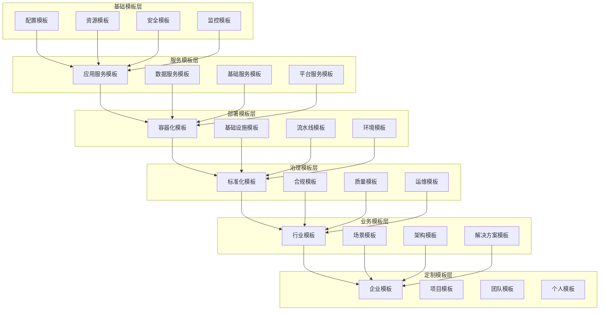

# Kubernetes 模板集合

## 概述

本目录提供 Kubernetes 的全面配置模板集合，包括配置文件模板、部署模板、监控模板等各类可复用的模板文件，帮助用户快速搭建标准化环境，确保配置的一致性和最佳实践的执行。

## 模板体系架构



## 目录结构

```
kubernetes/templates/
├── README.md                     # 模板总览和使用说明
├── workloads/                    # 工作负载模板
│   ├── deployment.yaml           # Deployment 模板
│   ├── statefulset.yaml         # StatefulSet 模板
│   ├── daemonset.yaml           # DaemonSet 模板
│   ├── job.yaml                 # Job 模板 
│   ├── cronjob.yaml             # CronJob 模板
│   └── README.md
├── services/                     # 服务发现模板
│   ├── service.yaml             # Service 模板
│   ├── ingress.yaml             # Ingress 模板
│   ├── endpoints.yaml           # Endpoints 模板
│   └── README.md
├── configuration/                # 配置管理模板
│   ├── configmap.yaml           # ConfigMap 模板
│   ├── secret.yaml              # Secret 模板
│   └── README.md
├── storage/                      # 存储模板
│   ├── persistentvolume.yaml    # PV 模板
│   ├── persistentvolumeclaim.yaml # PVC 模板
│   ├── storageclass.yaml        # StorageClass 模板
│   └── README.md
├── security/                     # 安全配置模板
│   ├── rbac/                    # RBAC 模板
│   │   ├── role.yaml
│   │   ├── rolebinding.yaml
│   │   ├── clusterrole.yaml
│   │   ├── clusterrolebinding.yaml
│   │   └── README.md
│   ├── network-policy/          # 网络策略模板
│   │   ├── network-policy.yaml
│   │   └── README.md
│   ├── pod-security/            # Pod 安全模板
│   │   ├── podsecuritypolicy.yaml
│   │   ├── securitycontext.yaml
│   │   └── README.md
│   └── certificates/            # 证书模板
│       ├── certificate.yaml
│       ├── issuer.yaml
│       └── README.md
├── monitoring/                   # 监控模板
│   ├── prometheus/              # Prometheus 监控
│   │   ├── prometheus.yaml
│   │   ├── servicemonitor.yaml
│   │   ├── alerting-rules.yaml
│   │   └── README.md
│   ├── grafana/                 # Grafana 仪表板
│   │   ├── dashboard.json
│   │   ├── datasource.yaml
│   │   └── README.md
│   └── logging/                 # 日志收集
│       ├── fluentd.yaml
│       ├── elasticsearch.yaml
│       └── README.md
├── ci-cd/                        # CI/CD 模板
│   ├── github-actions/          # GitHub Actions
│   │   ├── ci.yml
│   │   ├── cd.yml
│   │   └── README.md
│   ├── gitlab-ci/               # GitLab CI
│   │   ├── .gitlab-ci.yml
│   │   └── README.md
│   └── tekton/                  # Tekton 流水线
│       ├── pipeline.yaml
│       ├── task.yaml
│       └── README.md
├── helm-charts/                  # Helm Chart 模板
│   ├── microservice/            # 微服务 Chart
│   ├── web-app/                 # Web 应用 Chart
│   └── database/                # 数据库 Chart
└── examples/                     # 完整示例
    ├── microservice-stack/      # 微服务技术栈
    ├── monitoring-stack/        # 监控技术栈
    └── logging-stack/           # 日志技术栈
```

## 模板功能矩阵

| 模板名称 | 模板类型 | 技术栈 | 适用场景 | 复杂度 | 依赖关系 | 参数数量 |
|---------|---------|--------|---------|--------|---------|---------|
| **工作负载模板** |
| deployment.yaml | 工作负载 | Kubernetes | 无状态应用 | 简单 | 无 | 15+ |
| statefulset.yaml | 工作负载 | Kubernetes | 有状态应用 | 中等 | PVC | 20+ |
| daemonset.yaml | 工作负载 | Kubernetes | 系统守护进程 | 简单 | 无 | 12+ |
| **服务发现模板** |
| service.yaml | 网络 | Kubernetes | 服务暴露 | 简单 | Deployment | 8+ |
| ingress.yaml | 网络 | Kubernetes/Nginx | HTTP路由 | 中等 | Service | 15+ |
| **配置管理模板** |
| configmap.yaml | 配置 | Kubernetes | 配置数据 | 简单 | 无 | 5+ |
| secret.yaml | 配置 | Kubernetes | 敏感数据 | 简单 | 无 | 6+ |
| **存储模板** |
| storageclass.yaml | 存储 | Kubernetes/CSI | 存储类定义 | 中等 | CSI驱动 | 10+ |
| persistentvolume.yaml | 存储 | Kubernetes | 持久化卷 | 中等 | StorageClass | 8+ |
| **安全模板** |
| role.yaml | 安全 | Kubernetes/RBAC | 权限定义 | 中等 | 无 | 10+ |
| network-policy.yaml | 安全 | Kubernetes/CNI | 网络隔离 | 复杂 | CNI支持 | 15+ |
| **监控模板** |
| prometheus.yaml | 监控 | Prometheus | 指标收集 | 复杂 | 存储 | 30+ |
| servicemonitor.yaml | 监控 | Prometheus | 服务监控 | 中等 | Prometheus | 12+ |

## 关键模板场景

### 快速启动
新项目的快速搭建：
```bash
# 使用微服务模板
kubectl apply -f workloads/deployment.yaml
kubectl apply -f services/service.yaml
kubectl apply -f services/ingress.yaml
```

### 标准化部署
生产环境的标准化配置：
```bash
# 应用完整的微服务栈
kubectl apply -f examples/microservice-stack/
```

### 环境一致性
确保不同环境配置一致：
```bash
# 开发环境
export ENVIRONMENT=development
envsubst < deployment.yaml | kubectl apply -f -

# 生产环境
export ENVIRONMENT=production
envsubst < deployment.yaml | kubectl apply -f -
```

### 最佳实践落地
将最佳实践固化为模板：
```bash
# 使用安全强化模板
kubectl apply -f security/rbac/
kubectl apply -f security/network-policy/
kubectl apply -f security/pod-security/
```

### 合规要求
满足安全和合规要求：
```bash
# 应用合规配置
kubectl apply -f security/
kubectl apply -f monitoring/prometheus/
```

## 模板参数化机制

### 环境变量替换
```yaml
# 使用环境变量
apiVersion: apps/v1
kind: Deployment
metadata:
  name: ${APP_NAME:-my-app}
  namespace: ${NAMESPACE:-default}
  labels:
    app: ${APP_NAME:-my-app}
    version: ${APP_VERSION:-v1.0.0}
    environment: ${ENVIRONMENT:-development}
```

### Helm 模板语法
```yaml
# 使用 Helm 模板
apiVersion: apps/v1
kind: Deployment
metadata:
  name: {{ .Values.app.name }}
  namespace: {{ .Values.namespace | default "default" }}
  labels:
    app: {{ .Values.app.name }}
    version: {{ .Values.app.version }}
    environment: {{ .Values.environment }}
spec:
  replicas: {{ .Values.replicaCount | default 3 }}
```

### Kustomize 补丁
```yaml
# kustomization.yaml
apiVersion: kustomize.config.k8s.io/v1beta1
kind: Kustomization

resources:
- ../../base

patchesStrategicMerge:
- deployment-patch.yaml

configMapGenerator:
- name: app-config
  literals:
  - environment=production
```

## 模板使用指南

### 基本使用流程
1. **选择模板**：根据需求选择合适的模板
2. **参数配置**：配置模板参数和环境变量
3. **验证语法**：使用工具验证模板语法
4. **应用部署**：应用模板到集群
5. **验证结果**：验证部署结果和功能

### 模板定制化
1. **复制模板**：复制基础模板到项目目录
2. **修改参数**：根据需求修改模板参数
3. **添加功能**：根据需要添加额外配置
4. **测试验证**：在测试环境验证定制模板
5. **版本管理**：对定制模板进行版本控制

### 模板组合使用
1. **单一模板**：使用单个模板文件
2. **模板组合**：组合多个相关模板
3. **完整技术栈**：使用完整的解决方案模板
4. **分层部署**：按依赖关系分层部署模板

## 模板标准规范

### 文件命名规范
- 使用小写字母和连字符
- 文件名体现资源类型和用途
- 版本信息包含在文件名或目录中

### 参数命名规范
- 使用大写字母和下划线的环境变量
- 参数名称要有意义且易于理解
- 提供合理的默认值

### 注释规范
- 每个模板文件包含头部注释
- 重要配置项提供解释说明
- 参数用法和示例值说明

### 标签规范
- 统一的标签键值对规范
- 包含应用、版本、环境等基础标签
- 支持选择器和过滤器使用

## 质量保证

### 模板验证
- 语法正确性验证
- 参数完整性检查
- 依赖关系验证
- 最佳实践合规检查

### 测试机制
- 自动化模板测试
- 多环境兼容性测试
- 性能和安全性测试
- 回归测试和版本验证

### 文档完整性
- 详细的使用说明
- 参数配置示例
- 常见问题解答
- 故障排除指南

## 工具集成

### kubectl
```bash
# 直接应用模板
kubectl apply -f template.yaml

# 使用环境变量
envsubst < template.yaml | kubectl apply -f -

# 验证模板
kubectl apply --dry-run=client -f template.yaml
```

### Helm
```bash
# 安装 Chart
helm install my-app ./chart-template

# 升级应用
helm upgrade my-app ./chart-template

# 模板渲染
helm template my-app ./chart-template
```

### Kustomize
```bash
# 构建和应用
kubectl apply -k overlays/production

# 查看最终配置
kubectl kustomize overlays/production
```

## 最佳实践

### 模板设计
1. **单一职责**：每个模板专注于单一功能
2. **参数化**：高度参数化以提高复用性
3. **默认值**：提供合理的默认配置
4. **文档化**：完善的使用文档和示例

### 版本管理
1. **语义化版本**：使用语义化版本号
2. **变更记录**：维护详细的变更日志
3. **向后兼容**：保持 API 的向后兼容性
4. **废弃通知**：提前通知废弃的功能

### 安全考虑
1. **最小权限**：遵循最小权限原则
2. **敏感信息**：避免在模板中硬编码敏感信息
3. **安全基线**：应用安全配置基线
4. **定期审查**：定期进行安全审查和更新

## 故障排除

### 常见问题
1. **参数错误**：检查环境变量和参数配置
2. **依赖缺失**：确认相关依赖资源存在
3. **权限不足**：检查 RBAC 权限配置
4. **资源冲突**：避免资源名称和标签冲突

### 调试方法
1. **干运行**：使用 `--dry-run` 参数验证
2. **语法检查**：使用 `kubectl validate` 检查语法
3. **日志查看**：查看相关组件日志
4. **事件监控**：监控 Kubernetes 事件

## 社区贡献

### 贡献方式
- 提交新的模板和改进
- 报告问题和提供反馈
- 完善文档和示例
- 参与讨论和代码审查

### 质量标准
- 遵循项目的编码规范
- 提供完整的测试和文档
- 确保向后兼容性
- 通过代码审查流程

## 相关资源

### 官方文档
- [Kubernetes API 参考](https://kubernetes.io/docs/reference/kubernetes-api/)
- [Helm 模板指南](https://helm.sh/docs/chart_template_guide/)
- [Kustomize 教程](https://kubectl.docs.kubernetes.io/guides/introduction/kustomize/)

### 社区资源
- [Kubernetes 模板库](https://github.com/kubernetes/examples)
- [Helm Hub](https://artifacthub.io/)
- [最佳实践指南](https://kubernetes.io/docs/concepts/configuration/overview/)
